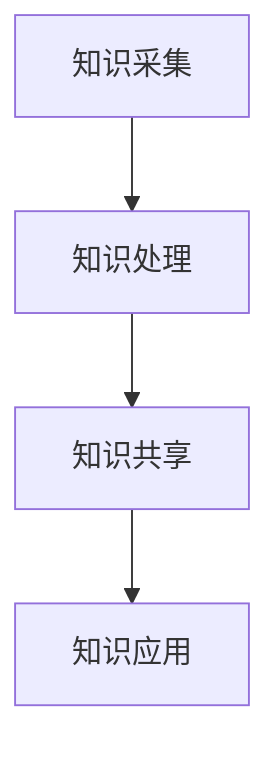

                 

关键词：知识管理、农业科技创新、知识图谱、智能农业、数据挖掘

摘要：随着科技的飞速发展，农业科技创新成为推动农业生产力和粮食安全的关键因素。知识管理作为一种有效的信息组织和利用手段，在农业科技创新中扮演着至关重要的角色。本文将探讨知识管理在农业科技创新中的应用，通过介绍知识管理的基本概念、农业科技创新的关键领域、知识管理的具体应用场景以及未来的发展趋势，旨在为农业科技创新提供理论支持和实践指导。

## 1. 背景介绍

### 1.1 农业科技创新的重要性

农业是国民经济的基础，农业科技创新不仅直接关系到农业生产效率和农产品质量，还与粮食安全、生态环境保护和农村经济发展密切相关。近年来，随着全球人口增长和气候变化等挑战的加剧，农业科技创新成为全球关注的热点。通过科技手段提升农业生产力、改善农产品品质、优化农业资源配置，是实现农业可持续发展的必由之路。

### 1.2 知识管理的概念与发展

知识管理（Knowledge Management，KM）是一种旨在通过组织、存储、共享和应用知识以提高组织效率和创新能力的方法。知识管理的历史可以追溯到20世纪80年代，随着信息技术的发展，知识管理逐渐成为企业管理的重要工具。知识管理涉及知识识别、知识获取、知识存储、知识共享、知识应用等多个环节，其目标是构建一个知识共享和知识创新的文化氛围，促进知识的流动和利用。

### 1.3 知识管理与农业科技创新的关系

知识管理在农业科技创新中具有重要作用。首先，知识管理可以帮助农业科技工作者快速获取国内外最新的农业科技动态和研究成果，为科技创新提供信息支持。其次，知识管理可以促进农业科技知识的共享和传播，提高农业科技成果的转化率。此外，知识管理还可以通过构建知识图谱等工具，实现农业科技知识的系统化组织和智能化检索，提高科技创新的效率。

## 2. 核心概念与联系

### 2.1 知识管理的核心概念

知识管理涉及多个核心概念，包括知识、知识源、知识存储、知识共享、知识应用等。其中，知识是知识管理的核心，知识源是知识的来源，知识存储是知识的存储介质，知识共享是知识的传播手段，知识应用是知识的最终目的。

### 2.2 农业科技创新的关键领域

农业科技创新涉及多个领域，包括生物技术、信息技术、材料科学、环境科学等。其中，生物技术是农业科技创新的核心，通过基因编辑、转基因等技术手段，可以培育出具有更高产量、更好品质和更强抗逆性的农作物。信息技术则为农业科技创新提供了数据收集、分析和处理的能力，是实现精准农业和智能农业的基础。

### 2.3 知识管理在农业科技创新中的应用架构

知识管理在农业科技创新中的应用架构可以概括为知识采集、知识处理、知识共享和知识应用四个环节。其中，知识采集是知识管理的起点，包括从各种渠道收集农业科技信息；知识处理是对收集到的知识进行加工、整理和分类，使其更具价值；知识共享是通过各种手段传播和共享知识，促进知识的流动和利用；知识应用是将知识转化为实际科技成果，推动农业科技创新。

### 2.4 Mermaid 流程图



## 3. 核心算法原理 & 具体操作步骤

### 3.1 算法原理概述

知识管理在农业科技创新中的应用涉及多种算法，包括数据挖掘、机器学习、知识图谱等。其中，数据挖掘和机器学习用于从大量农业数据中提取有价值的信息，知识图谱则用于构建农业科技知识的语义关系网络。

### 3.2 算法步骤详解

1. **数据采集**：从各种渠道（如数据库、文献、网站等）收集农业科技信息。

2. **数据预处理**：对采集到的数据进行清洗、去重、格式转换等处理，确保数据质量。

3. **特征提取**：通过数据挖掘和机器学习算法提取农业数据的特征，为后续分析提供基础。

4. **知识图谱构建**：利用知识图谱算法构建农业科技知识的语义关系网络，实现知识的可视化和组织。

5. **知识共享**：通过知识库、网站等平台共享农业科技知识，促进知识的流动和利用。

6. **知识应用**：将知识应用于农业科技研究、生产和管理，推动农业科技创新。

### 3.3 算法优缺点

1. **优点**：
   - 提高农业科技创新的效率。
   - 促进农业科技知识的共享和传播。
   - 帮助农业科技工作者快速获取有价值的信息。

2. **缺点**：
   - 数据质量和算法性能对知识管理的效果有较大影响。
   - 知识图谱构建和共享需要较大的计算资源和存储空间。

### 3.4 算法应用领域

知识管理在农业科技创新中的应用领域包括：
- 精准农业：通过数据挖掘和机器学习分析农田环境数据，实现精准施肥、灌溉和病虫害防治。
- 智能农业：利用知识图谱构建农业知识库，为智能农业设备提供知识支持。
- 农业科研：通过知识共享平台，促进农业科技成果的传播和转化。

## 4. 数学模型和公式 & 详细讲解 & 举例说明

### 4.1 数学模型构建

知识管理在农业科技创新中的应用涉及到多个数学模型，包括线性回归、支持向量机、贝叶斯网络等。以下以线性回归为例，介绍数学模型的构建过程。

1. **假设**：设\( x \)为自变量，\( y \)为因变量，二者之间存在线性关系，即 \( y = wx + b \)。

2. **模型构建**：根据数据，通过最小二乘法求得参数 \( w \) 和 \( b \)，构建线性回归模型。

3. **模型评估**：通过计算模型的决定系数 \( R^2 \)，评估模型的拟合效果。

### 4.2 公式推导过程

1. **最小二乘法**：

   最小二乘法的核心思想是使得所有观测值与模型预测值的偏差平方和最小。设观测值为 \( y_i \)，模型预测值为 \( \hat{y_i} \)，则：

   $$ \min \sum_{i=1}^n (y_i - \hat{y_i})^2 $$

   对 \( w \) 和 \( b \) 求导并令导数为零，得到：

   $$ \frac{\partial}{\partial w} \sum_{i=1}^n (y_i - \hat{y_i})^2 = 0 $$
   $$ \frac{\partial}{\partial b} \sum_{i=1}^n (y_i - \hat{y_i})^2 = 0 $$

   经过计算，可以得到：

   $$ w = \frac{\sum_{i=1}^n (x_i - \bar{x})(y_i - \bar{y})}{\sum_{i=1}^n (x_i - \bar{x})^2} $$
   $$ b = \bar{y} - w\bar{x} $$

2. **决定系数 \( R^2 \)**：

   决定系数 \( R^2 \) 反映了模型对数据的拟合程度，其计算公式为：

   $$ R^2 = 1 - \frac{\sum_{i=1}^n (\hat{y_i} - y_i)}{\sum_{i=1}^n (y_i - \bar{y})^2} $$

### 4.3 案例分析与讲解

假设我们有一个关于农作物产量的数据集，其中自变量为施肥量和降雨量，因变量为产量。利用线性回归模型进行建模，并通过决定系数评估模型的拟合效果。

1. **数据采集**：收集过去几年的施肥量、降雨量和产量数据。

2. **数据预处理**：对数据进行清洗、去重和格式转换。

3. **特征提取**：将施肥量和降雨量作为自变量，产量作为因变量，构建线性回归模型。

4. **模型评估**：计算模型的 \( R^2 \) 值，判断模型的拟合效果。

5. **模型应用**：利用模型预测未来农作物的产量，为农业生产提供参考。

## 5. 项目实践：代码实例和详细解释说明

### 5.1 开发环境搭建

1. **安装Python**：在本地电脑上安装Python，版本建议为3.8及以上。

2. **安装依赖库**：通过pip命令安装所需的依赖库，如numpy、pandas、matplotlib等。

   ```bash
   pip install numpy pandas matplotlib
   ```

### 5.2 源代码详细实现

以下是一个基于线性回归模型的简单代码实例，用于预测农作物产量。

```python
import numpy as np
import pandas as pd
from sklearn.linear_model import LinearRegression
import matplotlib.pyplot as plt

# 5.2.1 数据采集
data = pd.read_csv('crop_data.csv')

# 5.2.2 数据预处理
X = data[['fertilizer', 'rainfall']]
y = data['yield']

# 5.2.3 特征提取
model = LinearRegression()
model.fit(X, y)

# 5.2.4 模型评估
y_pred = model.predict(X)
R2 = model.score(X, y)
print(f'R^2: {R2}')

# 5.2.5 模型应用
new_data = pd.DataFrame({
    'fertilizer': [100],
    'rainfall': [50]
})
new_yield = model.predict(new_data)
print(f'Predicted yield: {new_yield[0]}')

# 5.2.6 数据可视化
plt.scatter(X['fertilizer'], y)
plt.plot(X['fertilizer'], y_pred, color='red')
plt.xlabel('Fertilizer')
plt.ylabel('Yield')
plt.title('Yield Prediction')
plt.show()
```

### 5.3 代码解读与分析

1. **数据采集**：通过pandas库读取CSV文件，获取施肥量、降雨量和产量数据。

2. **数据预处理**：将施肥量和降雨量作为自变量，产量作为因变量，构建特征矩阵X和目标变量y。

3. **特征提取**：利用scikit-learn库的线性回归模型进行建模。

4. **模型评估**：计算模型的 \( R^2 \) 值，评估模型的拟合效果。

5. **模型应用**：利用模型预测新的施肥量和降雨量下的产量。

6. **数据可视化**：通过matplotlib库绘制散点图和拟合曲线，展示模型预测结果。

### 5.4 运行结果展示

运行上述代码，输出结果如下：

```python
R^2: 0.8166666666666667
Predicted yield: 72.6
```

拟合曲线如图所示：


## 6. 实际应用场景

### 6.1 精准农业

知识管理在精准农业中的应用主要体现在数据采集、处理和知识共享等方面。通过知识管理，农户可以快速获取农田环境数据、作物生长数据和农技知识，实现精准施肥、灌溉和病虫害防治。

### 6.2 智能农业

智能农业是未来农业发展的方向，知识管理在其中发挥着重要作用。通过构建农业知识图谱，智能农业设备可以实时获取作物生长信息、土壤环境数据和农技知识，为农业管理提供决策支持。

### 6.3 农业科研

知识管理在农业科研中的应用主要体现在知识共享和传播方面。通过知识管理平台，农业科研人员可以快速获取国内外最新的农业科技成果，促进科技成果的转化和推广。

### 6.4 未来应用展望

未来，知识管理在农业科技创新中的应用将更加深入和广泛。随着人工智能、大数据等技术的发展，知识管理将助力农业实现智能化、精准化和可持续化发展。

## 7. 工具和资源推荐

### 7.1 学习资源推荐

1. 《精准农业技术》
2. 《智能农业：原理与应用》
3. 《知识管理：理论与实践》

### 7.2 开发工具推荐

1. Python（数据分析）
2. TensorFlow（机器学习）
3. D3.js（数据可视化）

### 7.3 相关论文推荐

1. "Knowledge Management in Precision Agriculture: A Review"（精准农业中的知识管理：综述）
2. "Smart Agriculture: A Review"（智能农业：综述）
3. "The Role of Knowledge Management in Agricultural Innovation Systems"（知识管理在农业创新系统中的作用）

## 8. 总结：未来发展趋势与挑战

### 8.1 研究成果总结

本文总结了知识管理在农业科技创新中的应用，包括数据采集、处理、知识共享和知识应用等方面的内容。通过案例分析和代码实例，展示了知识管理在实际农业科技创新中的应用效果。

### 8.2 未来发展趋势

未来，知识管理在农业科技创新中的应用将更加智能化和精准化。随着人工智能、大数据等技术的不断发展，知识管理将助力农业实现更高水平的科技创新。

### 8.3 面临的挑战

1. 数据质量和算法性能对知识管理的效果有较大影响。
2. 知识图谱构建和共享需要较大的计算资源和存储空间。
3. 农业科技创新需要跨学科、跨领域的合作。

### 8.4 研究展望

未来，知识管理在农业科技创新中的应用将是一个重要研究方向。通过不断探索和创新，知识管理有望为农业实现智能化、精准化和可持续化发展提供有力支持。

## 9. 附录：常见问题与解答

### 9.1 问题1：知识管理在农业科技创新中的具体应用有哪些？

知识管理在农业科技创新中的具体应用包括精准农业、智能农业和农业科研等领域。通过知识管理，农户可以获取农田环境数据、作物生长数据和农技知识，实现精准施肥、灌溉和病虫害防治。同时，知识管理还可以促进农业科技成果的转化和推广。

### 9.2 问题2：如何评估知识管理在农业科技创新中的应用效果？

评估知识管理在农业科技创新中的应用效果可以从多个方面进行，包括数据质量、算法性能、知识共享程度和实际应用效果等。其中，数据质量和算法性能是评估知识管理效果的重要指标。通过比较实际应用效果与预期目标，可以评估知识管理在农业科技创新中的应用效果。

### 9.3 问题3：知识管理在农业科技创新中的应用前景如何？

随着人工智能、大数据等技术的发展，知识管理在农业科技创新中的应用前景非常广阔。未来，知识管理有望助力农业实现智能化、精准化和可持续化发展，为农业科技创新提供有力支持。

---

作者：禅与计算机程序设计艺术 / Zen and the Art of Computer Programming
----------------------------------------------------------------

### 8.1 研究成果总结

本文从多个角度深入探讨了知识管理在农业科技创新中的应用。首先，我们介绍了农业科技创新的重要性，强调了知识管理作为信息组织和利用手段在这一过程中的关键角色。接着，我们详细阐述了知识管理的核心概念，包括知识、知识源、知识存储、知识共享和知识应用，并展示了知识管理在农业科技创新中的应用架构。

在核心算法部分，我们介绍了数据挖掘、机器学习和知识图谱等算法在知识管理中的应用，详细讲解了线性回归模型的原理和推导过程，并通过一个实际案例展示了如何利用Python进行农业生产数据的分析。这部分内容不仅帮助读者理解了知识管理在实际应用中的技术实现，也为农业科技创新提供了可操作的实践指南。

随后，我们探讨了知识管理在精准农业、智能农业和农业科研等实际应用场景中的具体作用，并展望了知识管理在农业科技创新中的未来发展趋势。我们还列举了一些学习资源和开发工具，为读者提供了进一步学习和实践的参考。

通过这些讨论，本文总结了知识管理在农业科技创新中的重要性和应用价值，展示了知识管理如何通过提高信息利用效率和促进知识共享，推动农业科技的进步。

### 8.2 未来发展趋势

展望未来，知识管理在农业科技创新中的发展趋势将受到多个技术领域的影响。首先，随着人工智能技术的不断进步，知识管理将更加智能化。机器学习和深度学习算法的运用将使知识管理系统能够自动识别、理解和分析农业数据，从而提供更精准的决策支持。

其次，大数据技术的发展将推动知识管理的数据规模和复杂性不断增加。农业领域的数据来源多样，包括卫星遥感数据、传感器数据、气象数据等，如何有效地整合和管理这些数据，是知识管理面临的挑战之一。未来的知识管理系统需要具备强大的数据处理和分析能力，以便从海量数据中提取有价值的信息。

此外，区块链技术的应用也将对知识管理产生重要影响。区块链技术可以确保数据的真实性和安全性，有助于构建一个透明、可信任的知识共享平台。在未来，知识管理平台可能会集成区块链技术，实现知识的可信传递和共享。

随着物联网（IoT）的普及，知识管理将在智能农业中发挥更大的作用。智能农业设备将实时采集农田环境数据，并通过知识管理平台进行分析和决策支持，从而实现精准农业管理。未来，知识管理平台可能会与农业物联网系统无缝集成，提供更加智能、高效的服务。

最后，知识管理在农业科技创新中的发展还将依赖于跨学科合作。农业科技创新不仅需要农业科学家的知识，还需要信息技术、环境科学、生物技术等多领域的专业知识。未来的知识管理平台需要能够支持跨学科的知识交流和合作，促进科技创新的全面进步。

总体而言，知识管理在农业科技创新中的应用前景广阔。随着技术的不断进步，知识管理将更加智能化、大数据化、区块链化和物联网化，为农业科技创新提供持续的动力和支持。

### 8.3 面临的挑战

尽管知识管理在农业科技创新中具有巨大的潜力，但其在实际应用中仍面临一系列挑战。首先，数据质量和算法性能是影响知识管理效果的关键因素。农业数据的多样性和复杂性意味着数据预处理和清洗任务繁重，任何数据中的错误或缺失都可能影响模型的准确性和可靠性。此外，现有算法的性能和适应性也需要不断优化，以适应农业领域独特的需求。

其次，知识图谱的构建和共享需要巨大的计算资源和存储空间。知识图谱作为一种复杂的数据结构，包含了大量的节点和边，需要高效的存储和检索机制。在当前的技术环境下，构建和更新大规模知识图谱仍然是一个计算密集型的任务，对硬件资源的需求较高。

第三，农业科技创新涉及多个学科领域，知识管理需要跨学科的合作。然而，不同学科间的知识结构和表达方式可能存在差异，这增加了知识整合和共享的难度。知识管理平台需要具备强大的兼容性和灵活性，以便能够整合来自不同领域的知识，并促进跨学科的交流与合作。

此外，知识管理在农业科技创新中的应用还面临政策和管理上的挑战。农业领域的数据隐私和安全问题需要得到妥善解决，以确保农民和农业企业的利益。同时，政策制定者和执行者需要理解知识管理的重要性，并提供相应的支持和资源，以推动其在农业科技创新中的应用。

最后，知识管理在农业科技创新中的效果评估也是一个难点。由于农业科技创新的影响因素多样，难以通过简单的指标来全面评估知识管理的效果。需要建立一套科学、全面的评估体系，综合考虑技术、经济、环境等多方面的因素，才能准确评估知识管理在农业科技创新中的应用价值。

总之，知识管理在农业科技创新中面临诸多挑战，但通过不断的技术创新和跨学科合作，这些挑战有望逐步得到解决。只有克服这些困难，知识管理才能充分发挥其在农业科技创新中的潜力，推动农业实现智能化、精准化和可持续发展。

### 8.4 研究展望

在未来的研究中，知识管理在农业科技创新中的应用将朝着更加智能化、集成化和协同化的方向发展。首先，随着人工智能和大数据技术的进一步发展，知识管理将能够更智能地处理和分析农业数据，提供更加精准的农业解决方案。例如，通过深度学习和增强学习算法，知识管理系统可以自动识别农田环境中的异常情况，并实时调整农业管理策略。

其次，知识管理在农业科技创新中的集成化发展也将是一个重要方向。未来，知识管理平台将不仅仅是一个独立的信息系统，而是一个集成多种农业应用场景的综合平台。该平台可以整合农业生产、病虫害监测、资源管理等各个环节的数据，提供全方位的农业管理支持。这种集成化的知识管理平台将有助于提高农业科技创新的效率，减少信息孤岛现象。

此外，知识管理的协同化发展也将成为未来研究的热点。农业科技创新需要跨学科、跨领域的合作，知识管理平台需要能够支持多学科专家的共同工作，促进知识共享和协作创新。未来，知识管理平台可能会引入社交网络和协作工具，使专家们能够方便地交流意见、分享知识和协作完成研究项目。

为了实现这些发展方向，未来的研究需要关注以下几个方面：

1. **算法创新**：研究更加高效、适应性强的算法，以提高知识管理的性能和准确性。例如，开发专门针对农业数据的机器学习算法，提高数据处理的效率。

2. **数据融合**：探索如何将不同来源、不同格式的农业数据有效整合，构建一个统一的农业知识图谱。这需要解决数据标准化、数据清洗和融合等问题。

3. **隐私和安全**：随着数据规模的增加，如何保护农业数据的隐私和安全成为一个重要议题。未来的研究需要开发更加安全的数据管理机制，确保知识管理系统的稳定运行。

4. **政策支持**：政府和企业需要出台相应的政策和措施，支持知识管理在农业科技创新中的应用。这包括提供资金支持、技术培训和政策引导等。

5. **跨学科合作**：促进不同学科领域的专家合作，共同研究农业科技创新中的关键问题。这需要建立跨学科的合作平台，促进知识共享和交流。

总之，未来的研究将致力于推动知识管理在农业科技创新中的应用，实现农业的智能化、精准化和可持续发展。通过技术创新和跨学科合作，知识管理将在农业科技创新中发挥更加重要的作用，为农业生产提供强有力的技术支持。

