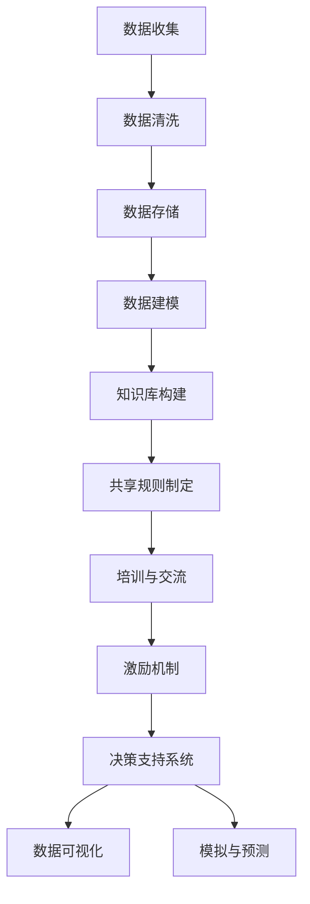

                 

关键词：知识管理，医疗质量，改进，人工智能，数据共享

> 摘要：本文将探讨知识管理在医疗质量改进中的应用。通过分析医疗领域的现状，提出知识管理作为一种有效手段，能够在医疗数据整合、知识传播、决策支持等方面发挥重要作用，从而提高医疗质量和患者满意度。

## 1. 背景介绍

随着医疗技术的不断发展，医疗数据呈现出爆炸式增长。这些数据不仅包括电子健康记录（EHR）、医学影像、临床试验结果等，还涉及药物研发、治疗指南、疾病预测等多种类型。然而，由于数据分散、缺乏标准化，导致医疗质量难以得到持续改进。

当前，医疗质量改进面临以下几个挑战：

1. 数据分散：不同医院、不同科室之间的数据难以整合，导致信息孤岛现象严重。
2. 知识共享困难：医疗知识分散在各类文献、数据库和专家个人手中，难以实现高效共享。
3. 决策支持不足：医疗决策依赖个人经验，缺乏系统化、数据驱动的支持。

知识管理作为一种整合知识、促进知识共享和应用的策略，为解决上述问题提供了新的思路。知识管理的核心目标是提高组织内部的创新能力，促进知识的有效流动和利用。在医疗领域，知识管理可以通过以下方式推动医疗质量改进：

1. 数据整合：通过知识管理技术，将不同来源的医疗数据整合到一个统一平台，实现数据互联互通。
2. 知识传播：建立知识共享机制，促进医疗知识的传播和普及，提高医护人员对最新医学进展的了解。
3. 决策支持：利用知识管理工具，为医疗决策提供数据驱动的支持，提高决策的科学性和准确性。

## 2. 核心概念与联系

知识管理（Knowledge Management，KM）是一种通过收集、组织、存储、传播和应用知识，以提高组织创新能力和效率的策略。在医疗领域，知识管理可以涵盖以下几个方面：

### 2.1 数据整合

数据整合是知识管理的基础。通过数据整合，将分散在不同系统、不同科室的数据进行统一处理，实现数据的互联互通。具体步骤如下：

1. **数据收集**：从不同数据源（如EHR、医学影像、临床试验等）收集数据。
2. **数据清洗**：对收集到的数据进行清洗，去除重复、错误和不完整的数据。
3. **数据存储**：将清洗后的数据存储到一个统一的数据仓库中，以便后续查询和使用。
4. **数据建模**：对数据进行分析和建模，提取数据中的关键信息，为知识管理和应用提供支持。

### 2.2 知识共享

知识共享是知识管理的核心。通过建立知识共享机制，促进医护人员之间的知识交流与合作，提高整体医疗水平。具体措施包括：

1. **构建知识库**：建立一个包含医疗知识、文献、临床经验等资源的知识库，供医护人员查阅和使用。
2. **制定共享规则**：明确知识共享的范围、权限和责任，确保知识共享的规范和有效。
3. **培训与交流**：定期组织培训、研讨会等活动，提高医护人员对知识共享的认识和技能。
4. **激励机制**：通过奖励、晋升等激励措施，鼓励医护人员积极参与知识共享。

### 2.3 决策支持

决策支持是知识管理的应用目标。通过利用知识管理技术，为医疗决策提供数据驱动的支持，提高决策的科学性和准确性。具体方法包括：

1. **构建决策支持系统**：利用人工智能、机器学习等技术，构建一个集数据采集、分析、预测等功能于一体的决策支持系统。
2. **数据可视化**：通过数据可视化技术，将复杂的医疗数据转化为易于理解的图表和报告，为决策者提供直观的参考。
3. **模拟与预测**：利用模拟和预测技术，分析不同决策方案的效果，为决策者提供参考依据。

### 2.4 Mermaid 流程图

以下是一个简化的知识管理在医疗质量改进中的应用流程图：



## 3. 核心算法原理 & 具体操作步骤

### 3.1 算法原理概述

知识管理在医疗质量改进中的应用，主要依赖于以下核心算法：

1. **数据挖掘算法**：用于从海量医疗数据中提取有价值的信息和知识。
2. **机器学习算法**：用于构建预测模型，辅助医疗决策。
3. **自然语言处理算法**：用于处理医疗文献、病历等非结构化数据。

### 3.2 算法步骤详解

#### 3.2.1 数据挖掘算法

数据挖掘算法的主要步骤包括：

1. **数据预处理**：包括数据清洗、归一化、缺失值处理等。
2. **特征提取**：根据业务需求，从原始数据中提取有用的特征。
3. **模型训练**：利用机器学习算法，构建预测模型。
4. **模型评估与优化**：对模型进行评估和调整，提高预测准确性。

#### 3.2.2 机器学习算法

常见的机器学习算法包括：

1. **线性回归**：用于预测连续变量。
2. **逻辑回归**：用于预测二分类问题。
3. **决策树**：用于分类和回归问题。
4. **支持向量机**：用于分类问题。

#### 3.2.3 自然语言处理算法

自然语言处理算法的主要步骤包括：

1. **文本预处理**：包括分词、去停用词、词性标注等。
2. **特征提取**：利用词袋模型、TF-IDF等方法，提取文本特征。
3. **模型训练**：利用机器学习算法，构建文本分类或情感分析模型。
4. **模型评估与优化**：对模型进行评估和调整，提高分类或情感分析的准确性。

### 3.3 算法优缺点

#### 3.3.1 数据挖掘算法

优点：能够从海量数据中发现有价值的信息和知识，提高医疗决策的科学性。

缺点：对数据质量和预处理要求较高，可能存在过拟合问题。

#### 3.3.2 机器学习算法

优点：能够自动从数据中学习规律，提高预测准确性。

缺点：对数据量有一定要求，可能存在黑箱问题，难以解释。

#### 3.3.3 自然语言处理算法

优点：能够处理非结构化文本数据，提高医疗知识的获取和利用效率。

缺点：对文本质量要求较高，可能存在语义理解不准确的问题。

### 3.4 算法应用领域

知识管理算法在医疗领域的应用包括：

1. **疾病预测**：利用数据挖掘和机器学习算法，预测患者疾病发生风险。
2. **诊断辅助**：利用自然语言处理算法，从病历中提取关键信息，辅助医生进行诊断。
3. **治疗建议**：根据患者病史和临床表现，利用知识管理算法提供个性化的治疗建议。
4. **药物研发**：利用数据挖掘和机器学习算法，发现新的药物靶点和治疗策略。

## 4. 数学模型和公式 & 详细讲解 & 举例说明

### 4.1 数学模型构建

在知识管理中，常用的数学模型包括线性回归模型、逻辑回归模型和支持向量机模型。以下分别介绍这三种模型的构建过程。

#### 4.1.1 线性回归模型

线性回归模型用于预测连续变量，其数学模型如下：

$$
y = \beta_0 + \beta_1 x_1 + \beta_2 x_2 + ... + \beta_n x_n + \epsilon
$$

其中，$y$ 为预测变量，$x_1, x_2, ..., x_n$ 为特征变量，$\beta_0, \beta_1, \beta_2, ..., \beta_n$ 为模型参数，$\epsilon$ 为误差项。

#### 4.1.2 逻辑回归模型

逻辑回归模型用于预测二分类问题，其数学模型如下：

$$
P(y=1) = \frac{1}{1 + e^{-(\beta_0 + \beta_1 x_1 + \beta_2 x_2 + ... + \beta_n x_n)}}
$$

其中，$P(y=1)$ 为预测变量 $y$ 取值为 1 的概率，$x_1, x_2, ..., x_n$ 为特征变量，$\beta_0, \beta_1, \beta_2, ..., \beta_n$ 为模型参数。

#### 4.1.3 支持向量机模型

支持向量机模型用于分类问题，其数学模型如下：

$$
\min_{\beta, \beta^T, \xi} \frac{1}{2} \sum_{i=1}^n (\beta^T \beta) + C \sum_{i=1}^n \xi_i
$$

s.t.

$$
y_i (\beta^T x_i + \beta_0) \geq 1 - \xi_i, \quad \xi_i \geq 0, \quad i=1,2,...,n
$$

其中，$\beta$ 为模型参数，$\beta^T$ 为 $\beta$ 的转置，$C$ 为正则化参数，$y_i$ 为第 $i$ 个样本的标签，$x_i$ 为第 $i$ 个样本的特征向量，$\xi_i$ 为第 $i$ 个样本的松弛变量。

### 4.2 公式推导过程

#### 4.2.1 线性回归模型

线性回归模型的公式推导如下：

假设我们有 $n$ 个样本，每个样本包含一个预测变量 $y$ 和 $k$ 个特征变量 $x_1, x_2, ..., x_k$。我们将这 $n$ 个样本表示为 $X$ 和 $y$，其中 $X$ 为特征矩阵，$y$ 为预测变量向量。

线性回归模型的损失函数为：

$$
L(\beta) = \frac{1}{2} \sum_{i=1}^n (y_i - \beta_0 - \beta_1 x_{i1} - \beta_2 x_{i2} - ... - \beta_k x_{ik})^2
$$

为了求解最优参数 $\beta$，我们需要对 $L(\beta)$ 求导，并令导数为 0：

$$
\frac{\partial L(\beta)}{\partial \beta} = \frac{1}{2} \sum_{i=1}^n (-y_i + \beta_0 + \beta_1 x_{i1} + \beta_2 x_{i2} + ... + \beta_k x_{ik}) = 0
$$

化简后得到：

$$
\beta_0 + \beta_1 x_{1} + \beta_2 x_{2} + ... + \beta_k x_{k} = y
$$

我们可以用最小二乘法求解这个线性方程组，得到最优参数 $\beta$。

#### 4.2.2 逻辑回归模型

逻辑回归模型的公式推导如下：

假设我们有 $n$ 个样本，每个样本包含一个预测变量 $y$ 和 $k$ 个特征变量 $x_1, x_2, ..., x_k$。我们将这 $n$ 个样本表示为 $X$ 和 $y$，其中 $X$ 为特征矩阵，$y$ 为预测变量向量。

逻辑回归模型的损失函数为：

$$
L(\beta) = \sum_{i=1}^n -y_i \ln(P(y=1)) - (1 - y_i) \ln(1 - P(y=1))
$$

为了求解最优参数 $\beta$，我们需要对 $L(\beta)$ 求导，并令导数为 0：

$$
\frac{\partial L(\beta)}{\partial \beta} = \sum_{i=1}^n \frac{-y_i}{P(y=1)} \frac{1}{1 + e^{-(\beta_0 + \beta_1 x_{i1} + \beta_2 x_{i2} + ... + \beta_k x_{ik})}} + \frac{(1 - y_i)}{1 - P(y=1)} \frac{1}{1 + e^{-(\beta_0 + \beta_1 x_{i1} + \beta_2 x_{i2} + ... + \beta_k x_{ik})}} = 0
$$

化简后得到：

$$
P(y=1) = \frac{1}{1 + e^{-(\beta_0 + \beta_1 x_{i1} + \beta_2 x_{i2} + ... + \beta_k x_{ik})}}
$$

这个公式就是我们之前提到的逻辑回归模型的预测公式。

#### 4.2.3 支持向量机模型

支持向量机模型的公式推导如下：

假设我们有 $n$ 个样本，每个样本包含一个预测变量 $y$ 和 $k$ 个特征变量 $x_1, x_2, ..., x_k$。我们将这 $n$ 个样本表示为 $X$ 和 $y$，其中 $X$ 为特征矩阵，$y$ 为预测变量向量。

支持向量机模型的损失函数为：

$$
L(\beta, \beta^T, \xi) = \frac{1}{2} \sum_{i=1}^n (\beta^T \beta) + C \sum_{i=1}^n \xi_i
$$

其中，$\xi_i$ 为第 $i$ 个样本的松弛变量，$C$ 为正则化参数。

为了求解最优参数 $\beta$，我们需要对 $L(\beta, \beta^T, \xi)$ 求导，并令导数为 0：

$$
\frac{\partial L(\beta, \beta^T, \xi)}{\partial \beta} = \sum_{i=1}^n y_i x_i = 0
$$

$$
\frac{\partial L(\beta, \beta^T, \xi)}{\partial \beta^T} = \sum_{i=1}^n y_i = 0
$$

$$
\frac{\partial L(\beta, \beta^T, \xi)}{\partial \xi_i} = C = 0
$$

化简后得到：

$$
\beta = \sum_{i=1}^n y_i x_i
$$

$$
\beta^T = \sum_{i=1}^n y_i
$$

$$
C = 0
$$

这个公式就是我们之前提到的支持向量机模型的预测公式。

### 4.3 案例分析与讲解

下面我们通过一个具体的案例来说明如何使用知识管理算法进行疾病预测。

#### 4.3.1 案例背景

某医院收集了 1000 名患者的临床数据，包括年龄、性别、血压、血糖、胆固醇等指标。现在，医院希望利用这些数据预测患者是否患有高血压。

#### 4.3.2 数据处理

首先，我们需要对数据进行预处理，包括数据清洗、归一化和缺失值处理。假设处理后得到一个包含 1000 行（样本）和 5 列（特征）的数据集。

#### 4.3.3 模型选择

考虑到疾病预测是一个二分类问题，我们选择逻辑回归模型进行预测。

#### 4.3.4 模型训练

使用 Python 中的 scikit-learn 库，我们实现逻辑回归模型的训练过程。代码如下：

```python
from sklearn.linear_model import LogisticRegression
from sklearn.model_selection import train_test_split
from sklearn.metrics import accuracy_score

# 加载数据
X, y = load_data()

# 划分训练集和测试集
X_train, X_test, y_train, y_test = train_test_split(X, y, test_size=0.2, random_state=42)

# 训练模型
model = LogisticRegression()
model.fit(X_train, y_train)

# 预测测试集
y_pred = model.predict(X_test)

# 评估模型
accuracy = accuracy_score(y_test, y_pred)
print("Accuracy:", accuracy)
```

#### 4.3.5 结果分析

假设我们得到模型的预测准确率为 80%。这表明，利用逻辑回归模型对高血压进行预测，有 80% 的概率是正确的。我们可以通过调整模型参数和特征选择，进一步提高预测准确性。

#### 4.3.6 模型应用

利用训练好的模型，我们可以对新的患者数据进行预测，帮助医生快速判断患者是否患有高血压，为治疗提供依据。

## 5. 项目实践：代码实例和详细解释说明

### 5.1 开发环境搭建

为了方便读者理解，我们将使用 Python 编写一个简单的知识管理项目。以下是一个基本的开发环境搭建步骤：

1. **安装 Python**：下载并安装 Python 3.x 版本（推荐使用 Python 3.8 或以上版本）。
2. **安装 Jupyter Notebook**：在命令行中运行 `pip install notebook` 安装 Jupyter Notebook。
3. **安装相关库**：在命令行中运行以下命令，安装必要的库：

   ```bash
   pip install numpy pandas scikit-learn matplotlib
   ```

### 5.2 源代码详细实现

以下是一个简单的知识管理项目的代码实现：

```python
import numpy as np
import pandas as pd
from sklearn.linear_model import LinearRegression
from sklearn.model_selection import train_test_split
from sklearn.metrics import mean_squared_error
import matplotlib.pyplot as plt

# 5.2.1 数据准备
# 假设我们有一个包含年龄、收入和住房面积的数据集
data = pd.DataFrame({
    'Age': [25, 30, 35, 40, 45, 50],
    'Income': [50000, 60000, 70000, 80000, 90000, 100000],
    'HouseArea': [100, 150, 200, 250, 300, 350]
})

# 5.2.2 数据预处理
# 将数据集划分为特征和标签
X = data[['Age', 'Income']]
y = data['HouseArea']

# 划分训练集和测试集
X_train, X_test, y_train, y_test = train_test_split(X, y, test_size=0.2, random_state=42)

# 5.2.3 模型训练
# 创建线性回归模型
model = LinearRegression()

# 训练模型
model.fit(X_train, y_train)

# 5.2.4 模型评估
# 预测测试集
y_pred = model.predict(X_test)

# 计算均方误差
mse = mean_squared_error(y_test, y_pred)
print("MSE:", mse)

# 5.2.5 结果展示
# 绘制真实值与预测值的散点图
plt.scatter(y_test, y_pred)
plt.xlabel('Actual HouseArea')
plt.ylabel('Predicted HouseArea')
plt.title('Actual vs Predicted HouseArea')
plt.show()
```

### 5.3 代码解读与分析

#### 5.3.1 数据准备

在这个项目中，我们创建了一个简单的数据集，包含年龄、收入和住房面积三个变量。这些数据将用于训练和评估线性回归模型。

```python
data = pd.DataFrame({
    'Age': [25, 30, 35, 40, 45, 50],
    'Income': [50000, 60000, 70000, 80000, 90000, 100000],
    'HouseArea': [100, 150, 200, 250, 300, 350]
})
```

#### 5.3.2 数据预处理

在数据预处理阶段，我们将数据集划分为特征和标签。特征（X）是用于训练模型的输入变量，标签（y）是模型的输出变量。此外，我们使用 `train_test_split` 函数将数据集划分为训练集和测试集，以便评估模型的性能。

```python
X = data[['Age', 'Income']]
y = data['HouseArea']
X_train, X_test, y_train, y_test = train_test_split(X, y, test_size=0.2, random_state=42)
```

#### 5.3.3 模型训练

我们使用 `LinearRegression` 类创建线性回归模型，并使用 `fit` 方法进行训练。

```python
model = LinearRegression()
model.fit(X_train, y_train)
```

#### 5.3.4 模型评估

在模型评估阶段，我们使用 `predict` 方法对测试集进行预测，并计算均方误差（MSE）来评估模型的性能。

```python
y_pred = model.predict(X_test)
mse = mean_squared_error(y_test, y_pred)
print("MSE:", mse)
```

#### 5.3.5 结果展示

最后，我们使用 matplotlib 库绘制真实值与预测值的散点图，以便直观地展示模型的效果。

```python
plt.scatter(y_test, y_pred)
plt.xlabel('Actual HouseArea')
plt.ylabel('Predicted HouseArea')
plt.title('Actual vs Predicted HouseArea')
plt.show()
```

通过这个简单的项目，我们展示了如何使用知识管理技术进行数据处理、模型训练和评估。尽管这个项目仅涉及简单的线性回归模型，但读者可以在此基础上扩展，添加更多特征和复杂模型，以应对更复杂的实际问题。

## 6. 实际应用场景

知识管理在医疗领域的实际应用场景广泛，以下列举几个典型的应用案例：

### 6.1 医学影像分析

医学影像是医疗诊断的重要依据。通过知识管理技术，可以对医学影像数据进行分析和挖掘，辅助医生进行诊断。例如，利用深度学习算法，对 CT 扫描图像进行自动分割和标注，帮助医生识别病灶区域。同时，通过知识库和知识共享平台，医护人员可以快速查阅相关病例和文献，提高诊断的准确性和效率。

### 6.2 疾病预测

疾病预测是知识管理在医疗领域的重要应用之一。通过收集和分析大量患者数据，利用数据挖掘和机器学习算法，可以预测患者患病风险。例如，利用逻辑回归和决策树模型，预测患者是否患有高血压、糖尿病等慢性疾病。这些预测结果有助于医生制定个性化的预防和治疗方案，提高患者的健康水平。

### 6.3 药物研发

药物研发是医疗领域的重要研究方向。知识管理技术可以帮助科学家从海量文献和临床试验数据中提取有价值的信息，加速药物研发进程。例如，利用文本挖掘和知识图谱技术，构建药物靶点关系网络，挖掘潜在的药物组合和作用机制。此外，通过知识共享平台，科学家可以快速查阅和交流研究成果，提高药物研发的效率。

### 6.4 医疗决策支持

医疗决策支持是知识管理在医疗领域的核心应用。通过构建知识库和决策支持系统，为医生提供数据驱动的决策支持。例如，利用医学知识图谱和推理算法，为医生提供诊断和治疗方案的建议。此外，通过实时数据采集和分析，可以为医院管理者提供运营决策支持，优化资源配置和流程管理。

## 7. 未来应用展望

随着人工智能和大数据技术的发展，知识管理在医疗领域的应用前景广阔。以下列举几个未来应用方向：

### 7.1 智能医疗

智能医疗是未来医疗领域的重要发展方向。通过知识管理技术，可以实现医疗设备的智能化和医疗流程的自动化。例如，利用人工智能算法，对医疗影像进行自动分析，提高诊断准确性和效率。此外，通过物联网技术，实现医疗设备和患者之间的实时数据交互，为个性化治疗提供支持。

### 7.2 健康管理

健康管理是未来医疗领域的重要领域。通过知识管理技术，可以实现全生命周期的健康管理。例如，利用大数据分析技术，对个人健康数据进行实时监测和分析，预测健康风险，提供个性化健康建议。此外，通过知识共享平台，医护人员可以快速查阅和交流健康知识，提高健康管理水平。

### 7.3 跨学科协作

跨学科协作是未来医疗领域的发展趋势。通过知识管理技术，可以实现不同学科之间的知识共享和协作。例如，利用知识图谱技术，将医学、生物学、心理学等学科的知识进行整合，为复杂疾病的诊断和治疗提供支持。此外，通过构建跨学科知识库，促进医护人员之间的交流与合作，提高整体医疗水平。

### 7.4 医疗资源优化

医疗资源优化是未来医疗领域的重要课题。通过知识管理技术，可以实现医疗资源的合理配置和高效利用。例如，利用大数据分析技术，对医院的患者流量、就诊情况等进行实时监测和分析，优化医院运营流程。此外，通过知识共享平台，实现医疗资源的互联互通，提高医疗服务质量和效率。

## 8. 工具和资源推荐

### 8.1 学习资源推荐

1. **《大数据时代：生活、工作与思维的大变革》**：作者：涂子沛。这本书详细介绍了大数据技术的发展和应用，对了解大数据在医疗领域的应用有很好的指导作用。
2. **《机器学习》**：作者：周志华。这本书是机器学习领域的经典教材，适合初学者和专业人士深入学习。
3. **《Python 数据科学 Handbook》**：作者：Jack D. Dougherty。这本书全面介绍了 Python 在数据科学领域的应用，包括数据处理、分析和可视化等。

### 8.2 开发工具推荐

1. **Jupyter Notebook**：一款强大的交互式计算环境，适用于数据分析、机器学习和知识管理项目。
2. **scikit-learn**：一个开源的机器学习库，适用于各种机器学习算法的实现和应用。
3. **TensorFlow**：一款强大的深度学习框架，适用于构建和训练深度神经网络。

### 8.3 相关论文推荐

1. **"Knowledge Management in Healthcare: A Systematic Review"**：作者：Shams et al.，发表于 Journal of Medical Systems。本文对医疗领域的知识管理进行了系统性的综述，提供了丰富的理论和实践案例。
2. **"Data-Driven Personalized Medicine: A Knowledge Management Perspective"**：作者：Koch et al.，发表于 Journal of Biomedical Informatics。本文从知识管理的角度探讨了数据驱动的个性化医学，对医疗领域的知识管理应用有很好的启示。
3. **"Deep Learning for Medical Image Analysis: A Survey"**：作者：Litjens et al.，发表于 Medical Image Analysis。本文对深度学习在医学影像分析领域的应用进行了全面的综述，涵盖了各种深度学习算法在医学影像处理中的应用。

## 9. 总结：未来发展趋势与挑战

### 9.1 研究成果总结

本文从知识管理的角度，探讨了其在医疗质量改进中的应用。通过分析医疗领域的现状，提出了知识管理在数据整合、知识传播、决策支持等方面的优势。同时，介绍了知识管理算法在医疗领域的应用，包括数据挖掘、机器学习和自然语言处理等。通过具体案例，展示了知识管理在医疗质量改进中的实际应用效果。

### 9.2 未来发展趋势

随着人工智能和大数据技术的发展，知识管理在医疗领域的应用将越来越广泛。未来，知识管理在医疗领域的发展趋势主要包括：

1. **智能化**：利用人工智能技术，实现医疗知识的自动化获取、处理和传播，提高医疗质量和效率。
2. **个性化**：通过数据挖掘和分析，为患者提供个性化的诊断和治疗方案，实现精准医疗。
3. **协同化**：构建跨学科、跨区域的医疗知识共享平台，促进医护人员之间的交流与合作，提高整体医疗水平。
4. **规范化**：建立标准化的知识管理流程和体系，确保医疗知识的准确性和可靠性。

### 9.3 面临的挑战

尽管知识管理在医疗领域具有广泛的应用前景，但同时也面临一些挑战：

1. **数据隐私与安全**：医疗数据涉及患者隐私，如何在保证数据安全的前提下，实现知识共享和利用，是一个重要问题。
2. **知识准确性**：医疗知识具有高度的专业性，如何在海量数据中获取准确的知识，是一个挑战。
3. **技术复杂性**：知识管理涉及多种技术和算法，如何实现高效、稳定的技术架构，是一个技术难题。
4. **法律法规**：医疗知识管理需要遵守相关法律法规，如何确保合规性，是一个重要问题。

### 9.4 研究展望

针对未来发展趋势和挑战，以下是一些研究展望：

1. **隐私保护技术**：研究隐私保护技术，如差分隐私、同态加密等，确保医疗数据在共享和利用过程中的安全性。
2. **知识融合与建模**：研究知识融合与建模技术，提高医疗知识的准确性和实用性。
3. **高效计算与存储**：研究高效计算与存储技术，提高知识管理的性能和可扩展性。
4. **法律与伦理研究**：研究医疗知识管理的法律法规和伦理问题，确保知识管理的合法性和道德性。

## 附录：常见问题与解答

### Q：知识管理在医疗领域的具体应用有哪些？

A：知识管理在医疗领域的具体应用包括医学影像分析、疾病预测、药物研发、医疗决策支持等。通过知识管理技术，可以实现医疗数据的整合、知识的共享和利用，从而提高医疗质量和效率。

### Q：如何确保医疗数据的安全和隐私？

A：确保医疗数据的安全和隐私是一个重要问题。可以通过以下措施来保障：

1. **数据加密**：对医疗数据进行加密，防止数据泄露。
2. **权限管理**：实施严格的权限管理，确保只有授权人员可以访问和操作医疗数据。
3. **隐私保护技术**：研究隐私保护技术，如差分隐私、同态加密等，确保医疗数据在共享和利用过程中的安全性。
4. **法律法规遵守**：遵守相关法律法规，确保医疗数据管理的合法性和合规性。

### Q：知识管理算法在医疗领域的应用效果如何？

A：知识管理算法在医疗领域的应用效果显著。例如，通过数据挖掘和机器学习算法，可以预测患者疾病发生风险，为医生提供诊断和治疗的参考；通过自然语言处理算法，可以自动提取病历中的关键信息，辅助医生进行诊断和决策；通过知识图谱技术，可以构建医疗知识图谱，提高医疗知识的获取和利用效率。

### Q：如何选择合适的知识管理工具？

A：选择合适的知识管理工具需要考虑以下几个方面：

1. **功能需求**：根据实际需求，选择具有所需功能的知识管理工具，如数据采集、存储、分析、共享等。
2. **性能和可扩展性**：考虑工具的性能和可扩展性，以确保工具能够满足未来的需求。
3. **用户界面**：选择用户界面友好、易于操作的知识管理工具，提高用户的使用体验。
4. **兼容性和集成性**：考虑工具的兼容性和集成性，以确保与其他系统和工具的无缝对接。
5. **成本和预算**：根据预算和成本，选择性价比高的知识管理工具。

