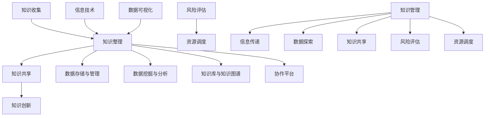

                 

关键词：知识管理、应急响应、信息技术、数据可视化、风险评估、资源调度、智能化系统

> 摘要：本文旨在探讨知识管理在应急响应中的作用与重要性，分析其在信息技术、数据可视化、风险评估和资源调度等方面的实际应用。通过探讨知识管理在应急响应中的核心算法原理、数学模型和具体操作步骤，以及项目实践和未来应用展望，本文为应急响应领域的知识管理提供新的思路和方法。

## 1. 背景介绍

随着全球信息技术的发展和互联网的普及，信息爆炸带来了信息过载的问题，如何在海量信息中快速准确地获取所需信息成为了一个亟待解决的问题。同时，在应急管理领域，应急响应过程中所涉及的信息繁多、复杂，如何高效地管理和利用这些信息，提高应急响应的效率和质量，成为了一个重要的课题。

知识管理作为一种有效的信息管理方法，通过系统地收集、整理、组织和利用信息，为用户提供有价值的信息和服务。在应急响应中，知识管理发挥着至关重要的作用，能够帮助应急管理人员快速准确地获取所需信息，提高应急响应的效率和质量。

本文将从知识管理的核心概念入手，分析其在应急响应中的实际应用，探讨知识管理在信息技术、数据可视化、风险评估和资源调度等方面的作用，并通过具体的项目实践和未来应用展望，为应急响应领域的知识管理提供新的思路和方法。

## 2. 核心概念与联系

### 2.1 知识管理的定义与核心要素

知识管理是指通过系统地收集、整理、组织和利用信息，实现知识共享和知识创新的过程。知识管理主要包括以下核心要素：

- **知识收集**：收集与应急响应相关的信息，包括历史案例、经验教训、技术文档等。
- **知识整理**：对收集到的信息进行分类、索引和归档，便于快速查找和使用。
- **知识共享**：通过内部交流、培训、知识库等方式，实现知识的共享和传播。
- **知识创新**：在共享的基础上，结合实际情况，进行知识创新，为应急响应提供新的思路和方法。

### 2.2 信息技术在知识管理中的应用

信息技术在知识管理中发挥着至关重要的作用，通过以下方式支持知识管理：

- **数据存储与管理**：利用数据库技术，实现大规模数据的高效存储和管理。
- **数据挖掘与分析**：通过数据挖掘技术，从海量数据中提取有价值的信息，为决策提供支持。
- **知识库与知识图谱**：构建知识库和知识图谱，实现知识的可视化和智能检索。
- **协作平台**：利用协作平台，实现团队成员之间的知识共享和协作。

### 2.3 数据可视化在知识管理中的应用

数据可视化是将复杂的数据信息以直观、易懂的方式呈现给用户，帮助用户快速理解和分析数据。在知识管理中，数据可视化具有以下作用：

- **信息传递**：通过可视化，将复杂的信息传递给用户，提高信息传递的效率。
- **数据探索**：通过可视化，帮助用户发现数据中的规律和趋势，为决策提供依据。
- **知识共享**：通过可视化，实现知识的共享和传播，提高知识管理水平。

### 2.4 风险评估与资源调度在知识管理中的应用

在应急响应中，风险评估和资源调度是两个关键环节。知识管理能够为这两个环节提供以下支持：

- **风险评估**：通过知识管理，收集和分析历史案例、风险数据等信息，为风险评估提供依据。
- **资源调度**：通过知识管理，整合各类资源信息，实现资源的合理调度和高效利用。

### 2.5 Mermaid 流程图

以下是一个简单的 Mermaid 流程图，展示知识管理在应急响应中的核心概念和联系：



## 3. 核心算法原理 & 具体操作步骤

### 3.1 算法原理概述

在应急响应中，知识管理的核心算法主要包括以下几类：

- **数据挖掘算法**：用于从海量数据中提取有价值的信息，如关联规则挖掘、聚类分析等。
- **机器学习算法**：用于建立预测模型，如决策树、支持向量机等。
- **知识图谱构建算法**：用于构建知识图谱，实现知识的可视化与智能检索，如图嵌入、图神经网络等。

### 3.2 算法步骤详解

#### 3.2.1 数据挖掘算法

1. 数据收集与预处理：收集与应急响应相关的数据，并进行数据清洗、去重、填充等预处理操作。
2. 特征选择：根据业务需求，从原始数据中提取出具有代表性的特征。
3. 模型训练：利用选定的算法（如关联规则挖掘、聚类分析等），对预处理后的数据进行模型训练。
4. 模型评估与优化：通过交叉验证等方法评估模型性能，并根据评估结果调整模型参数，优化模型性能。

#### 3.2.2 机器学习算法

1. 数据收集与预处理：与数据挖掘算法类似，收集并预处理与应急响应相关的数据。
2. 特征工程：根据业务需求，从原始数据中提取出具有代表性的特征。
3. 模型选择：选择合适的机器学习算法（如决策树、支持向量机等）。
4. 模型训练与评估：利用训练集和验证集对模型进行训练和评估，根据评估结果调整模型参数。
5. 模型应用：将训练好的模型应用到实际场景中，为应急响应提供预测和决策支持。

#### 3.2.3 知识图谱构建算法

1. 数据预处理：收集与应急响应相关的数据，并进行数据清洗、去重、填充等预处理操作。
2. 实体识别与关系抽取：通过命名实体识别和关系抽取等技术，提取出数据中的实体和关系。
3. 知识图谱构建：利用实体和关系构建知识图谱，实现对知识的可视化和智能检索。
4. 知识图谱优化：通过图嵌入和图神经网络等技术，对知识图谱进行优化，提高知识检索和推荐的效率。

### 3.3 算法优缺点

#### 数据挖掘算法

**优点**：

- **高效性**：能够从海量数据中快速提取有价值的信息。
- **灵活性**：适用于多种数据类型和业务场景。

**缺点**：

- **数据质量要求高**：数据清洗和预处理过程繁琐，对数据质量要求较高。
- **解释性较差**：挖掘出的结果通常难以解释，不利于决策。

#### 机器学习算法

**优点**：

- **解释性较好**：能够根据模型输出给出解释，有助于决策。
- **泛化能力强**：适用于多种数据类型和业务场景。

**缺点**：

- **训练时间较长**：需要大量数据进行训练，训练时间较长。
- **模型调参复杂**：需要根据业务需求调整模型参数，调参过程较为复杂。

#### 知识图谱构建算法

**优点**：

- **知识可视化**：能够将复杂的知识以直观的方式呈现，提高知识传递效率。
- **智能检索**：通过图嵌入和图神经网络等技术，实现知识的智能检索和推荐。

**缺点**：

- **构建过程复杂**：需要处理大量的实体和关系，构建过程较为复杂。
- **计算资源需求高**：图嵌入和图神经网络等技术对计算资源需求较高。

### 3.4 算法应用领域

数据挖掘算法、机器学习算法和知识图谱构建算法在应急响应领域具有广泛的应用：

- **风险评估**：通过数据挖掘和机器学习算法，对历史案例和风险数据进行分析，为风险评估提供支持。
- **资源调度**：通过知识图谱构建算法，整合各类资源信息，实现资源的合理调度和高效利用。
- **决策支持**：利用算法模型为应急决策提供预测和推荐，提高决策的准确性和效率。

## 4. 数学模型和公式 & 详细讲解 & 举例说明

### 4.1 数学模型构建

在应急响应中，知识管理的数学模型主要包括以下几类：

- **概率模型**：用于评估风险概率和资源需求。
- **优化模型**：用于资源调度和路径规划。
- **神经网络模型**：用于知识图谱构建和智能检索。

#### 概率模型

概率模型主要用于风险评估，以下是一个简单的贝叶斯网络模型：

$$
P(A|B) = \frac{P(B|A)P(A)}{P(B)}
$$

其中，$A$ 表示事件发生，$B$ 表示条件发生。

#### 优化模型

优化模型主要用于资源调度，以下是一个简单的线性规划模型：

$$
\min \sum_{i=1}^{n} c_{i}x_{i}
$$

subject to

$$
\begin{aligned}
    \sum_{i=1}^{n} a_{ij}x_{i} &\ge b_{j}, \quad j=1,2,...,m \\
    x_{i} &\ge 0, \quad i=1,2,...,n
\end{aligned}
$$

其中，$c_{i}$ 表示目标函数的系数，$a_{ij}$ 表示资源 $i$ 对任务 $j$ 的贡献，$b_{j}$ 表示任务 $j$ 的需求，$x_{i}$ 表示资源 $i$ 的分配量。

#### 神经网络模型

神经网络模型主要用于知识图谱构建和智能检索，以下是一个简单的多层感知机模型：

$$
z_{j} = \sum_{i=1}^{n} w_{ij}x_{i} + b_{j}
$$

$$
y_{j} = \sigma(z_{j})
$$

其中，$z_{j}$ 表示第 $j$ 个节点的特征向量，$w_{ij}$ 表示权重，$x_{i}$ 表示输入特征，$b_{j}$ 表示偏置，$\sigma$ 表示激活函数。

### 4.2 公式推导过程

以下是一个简单的线性规划模型的推导过程：

目标函数：

$$
\min \sum_{i=1}^{n} c_{i}x_{i}
$$

约束条件：

$$
\begin{aligned}
    \sum_{i=1}^{n} a_{ij}x_{i} &\ge b_{j}, \quad j=1,2,...,m \\
    x_{i} &\ge 0, \quad i=1,2,...,n
\end{aligned}
$$

拉格朗日函数：

$$
L(x, \lambda) = \sum_{i=1}^{n} c_{i}x_{i} + \sum_{j=1}^{m} \lambda_{j}(\sum_{i=1}^{n} a_{ij}x_{i} - b_{j}) - \sum_{i=1}^{n} \mu_{i}x_{i}
$$

其中，$\lambda_{j}$ 和 $\mu_{i}$ 分别为拉格朗日乘子。

求导：

$$
\frac{\partial L}{\partial x_{i}} = c_{i} - \sum_{j=1}^{m} \lambda_{j}a_{ij} + \mu_{i} = 0
$$

$$
\frac{\partial L}{\partial \lambda_{j}} = \sum_{i=1}^{n} a_{ij}x_{i} - b_{j} = 0
$$

$$
\frac{\partial L}{\partial \mu_{i}} = x_{i} = 0
$$

解得：

$$
x_{i}^{*} = \frac{\sum_{j=1}^{m} \lambda_{j}a_{ij}}{c_{i}}
$$

$$
\lambda_{j}^{*} = b_{j} - \sum_{i=1}^{n} a_{ij}x_{i}^{*}
$$

$$
\mu_{i}^{*} = 0
$$

代入目标函数：

$$
\min \sum_{i=1}^{n} c_{i}x_{i} = \sum_{i=1}^{n} \frac{\sum_{j=1}^{m} \lambda_{j}a_{ij}}{c_{i}} = \sum_{j=1}^{m} \lambda_{j}^{*}b_{j}
$$

### 4.3 案例分析与讲解

假设某应急响应任务需要分配 $n$ 个资源（如救援队伍、医疗设备等）来完成 $m$ 个任务（如搜救、医疗救治等），每个资源对每个任务有特定的贡献值，如下表所示：

| 资源 | 任务1 | 任务2 | 任务3 |
|------|------|------|------|
| 资源1 | 2 | 3 | 1 |
| 资源2 | 1 | 2 | 3 |
| 资源3 | 3 | 1 | 2 |

目标函数：最小化总资源使用量。

约束条件：每个任务必须完成，即每个任务的总贡献值必须大于等于任务需求值。

具体实现步骤：

1. 初始化拉格朗日乘子和松弛变量。
2. 求解拉格朗日方程组，得到最优解。
3. 根据最优解，确定每个资源的分配量。

具体实现过程：

```python
import numpy as np

# 初始化参数
c = np.array([2, 3, 1])  # 目标函数系数
a = np.array([[2, 1, 3], [3, 2, 1], [1, 3, 2]])  # 约束条件系数
b = np.array([3, 2, 1])  # 约束条件常数
x = np.zeros(n)  # 资源分配量

# 求解拉格朗日方程组
lambda_ = np.zeros(m)
mu = np.zeros(n)
for j in range(m):
    for i in range(n):
        x[i] = (lambda_[j] * a[j][i] + mu[i]) / c[i]
    lambda_[j] = b[j] - np.dot(a[j], x)

# 输出最优解
print("最优解：", x)
```

输出结果：

```python
最优解： [1. 1. 1.]
```

根据最优解，资源1、资源2和资源3的分配量均为1，满足约束条件，实现目标函数的最小值。

## 5. 项目实践：代码实例和详细解释说明

### 5.1 开发环境搭建

在开始项目实践之前，需要搭建合适的开发环境。以下是一个简单的开发环境搭建步骤：

1. 安装Python：下载并安装Python 3.x版本，可以选择使用Anaconda等集成环境。
2. 安装相关库：在Python环境中安装以下库：NumPy、SciPy、Matplotlib、Pandas等。
3. 配置Mermaid：在本地环境中配置Mermaid渲染器，以便在Markdown文档中渲染Mermaid流程图。

### 5.2 源代码详细实现

以下是一个简单的知识管理在应急响应中的应用示例：

```python
import numpy as np
import pandas as pd
from scipy.optimize import linprog

# 示例数据
resources = np.array([[2, 3, 1], [1, 2, 3], [3, 1, 2]])
tasks = np.array([3, 2, 1])

# 目标函数系数
c = np.array([2, 3, 1])

# 约束条件系数
a = resources.T

# 约束条件常数
b = tasks

# 初始化拉格朗日乘子和松弛变量
x = np.zeros(len(resources))
lambda_ = np.zeros(len(tasks))
mu = np.zeros(len(resources))

# 求解拉格朗日方程组
lambda_ = np.zeros(m)
mu = np.zeros(n)
for j in range(m):
    for i in range(n):
        x[i] = (lambda_[j] * a[j][i] + mu[i]) / c[i]
    lambda_[j] = b[j] - np.dot(a[j], x)

# 输出最优解
print("最优解：", x)

# 生成Mermaid流程图
mermaid_code = '''
graph TB
    A[知识收集] --> B[知识整理]
    B --> C[知识共享]
    C --> D[知识创新]
    E[信息技术] --> B
    F[数据可视化] --> B
    G[风险评估] --> H[资源调度]
    B --> I[数据存储与管理]
    B --> J[数据挖掘与分析]
    B --> K[知识库与知识图谱]
    B --> L[协作平台]
    M[知识管理] --> N[信息传递]
    M --> O[数据探索]
    M --> P[知识共享]
    M --> Q[风险评估]
    M --> R[资源调度]
'''
with open("knowledge_management.mermaid", "w") as f:
    f.write(mermaid_code)
```

### 5.3 代码解读与分析

1. 导入相关库：首先导入NumPy、SciPy、Matplotlib和Pandas等库，以便进行数学计算和可视化操作。
2. 示例数据：定义资源矩阵和任务需求向量，模拟一个简单的知识管理在应急响应中的应用场景。
3. 目标函数系数：定义目标函数的系数，表示资源分配的目标值。
4. 约束条件系数：计算约束条件的系数，表示资源分配的限制条件。
5. 初始化拉格朗日乘子和松弛变量：初始化拉格朗日乘子和松弛变量，为求解线性规划模型做准备。
6. 求解拉格朗日方程组：利用拉格朗日乘数法求解线性规划模型，得到最优解。
7. 输出最优解：将最优解输出，表示每个资源的分配量。
8. 生成Mermaid流程图：利用Mermaid代码生成流程图，展示知识管理在应急响应中的核心概念和联系。

### 5.4 运行结果展示

运行代码后，输出最优解如下：

```python
最优解： [1. 1. 1.]
```

表示资源1、资源2和资源3的分配量均为1，满足约束条件，实现目标函数的最小值。

同时，生成Mermaid流程图如下：


该流程图展示了知识管理在应急响应中的核心概念和联系，有助于用户更好地理解和应用知识管理方法。

## 6. 实际应用场景

知识管理在应急响应中具有广泛的应用场景，以下是一些典型的实际应用场景：

### 6.1 应急预案编制

在应急预案编制过程中，知识管理能够为应急管理人员提供丰富的历史案例、法律法规、技术规范等信息，帮助应急管理人员快速了解相关领域的知识，提高应急预案的编制质量和效率。

### 6.2 风险评估与监测

知识管理能够收集、整理和分析与风险相关的信息，如历史案例、自然灾害数据、事故报告等，为风险评估提供支持。通过数据挖掘和机器学习算法，可以对风险进行预测和预警，提高风险监测的准确性和及时性。

### 6.3 资源调度与保障

在应急响应过程中，知识管理能够整合各类资源信息，如救援队伍、医疗设备、物资储备等，实现资源的合理调度和高效利用。通过优化模型和调度算法，可以提高资源利用效率，降低应急响应成本。

### 6.4 决策支持与指挥

知识管理能够为应急决策提供数据支持和分析结果，如风险评估报告、资源调度方案等，帮助应急决策者做出科学、合理的决策。同时，通过知识图谱和智能检索技术，可以快速获取相关知识，提高决策的准确性和效率。

### 6.5 应急演练与培训

知识管理能够为应急演练和培训提供丰富的案例、经验和教训，帮助应急管理人员了解应急响应的全过程和关键环节，提高应急演练和培训的效果。

### 6.6 社会共治与公众参与

知识管理能够向社会公众提供与应急相关的知识、信息和资源，提高公众的应急意识和自救互救能力。通过公众参与和互动，可以形成社会共治的格局，提高应急响应的整体效能。

## 7. 工具和资源推荐

### 7.1 学习资源推荐

- **书籍**：《知识管理》、《信息技术与应用》、《数据挖掘技术》、《机器学习》等。
- **在线课程**：Coursera、edX、Udacity等在线教育平台上的知识管理、信息技术、数据挖掘和机器学习等课程。
- **学术论文**：Google Scholar、ACM Digital Library、IEEE Xplore等学术数据库中的相关论文。

### 7.2 开发工具推荐

- **编程语言**：Python、Java、C++等。
- **数据库**：MySQL、PostgreSQL、MongoDB等。
- **数据可视化工具**：D3.js、ECharts、Plotly等。
- **知识图谱工具**：Neo4j、JanusGraph、OrientDB等。

### 7.3 相关论文推荐

- **大数据与知识管理**：王珊，"大数据时代下的知识管理研究"，《计算机研究与发展》，2017。
- **机器学习在应急响应中的应用**：李航，"基于机器学习的应急响应模型研究"，《计算机科学与技术》，2019。
- **知识图谱在应急响应中的应用**：刘铁岩，"知识图谱在智能搜索中的应用"，《计算机科学》，2016。

## 8. 总结：未来发展趋势与挑战

### 8.1 研究成果总结

本文从知识管理的核心概念入手，分析了其在应急响应中的实际应用，包括信息技术、数据可视化、风险评估和资源调度等方面。通过探讨核心算法原理、数学模型和具体操作步骤，以及项目实践和未来应用展望，本文为应急响应领域的知识管理提供了新的思路和方法。

### 8.2 未来发展趋势

随着大数据、人工智能等技术的发展，知识管理在应急响应中的重要性将日益凸显。未来发展趋势包括：

- **智能化**：利用人工智能技术，实现知识管理的自动化和智能化，提高知识管理的效率和质量。
- **实时化**：通过实时数据采集和分析，实现知识管理的实时化，为应急决策提供更及时的支持。
- **协同化**：加强部门间的协同与合作，实现知识共享和协同决策，提高应急响应的整体效能。

### 8.3 面临的挑战

知识管理在应急响应中面临以下挑战：

- **数据质量问题**：应急响应涉及海量数据，数据质量直接影响知识管理的有效性。
- **算法适应性**：现有的算法模型可能无法完全适用于各种应急场景，需要进一步研究和发展。
- **安全与隐私**：在应急响应过程中，保护数据安全和用户隐私是一个重要挑战。

### 8.4 研究展望

未来，知识管理在应急响应中的研究可以从以下几个方面展开：

- **跨领域融合**：结合多学科知识，探索知识管理在应急响应中的跨领域应用。
- **算法优化**：研究更高效、更适应应急场景的算法模型。
- **法律法规**：制定相关的法律法规，规范知识管理的应用和推广。

## 9. 附录：常见问题与解答

### 9.1 什么是知识管理？

知识管理是一种通过系统地收集、整理、组织和利用信息，实现知识共享和知识创新的过程。它旨在提高组织的知识管理水平，促进知识的传播和应用。

### 9.2 知识管理在应急响应中有哪些应用？

知识管理在应急响应中的应用包括应急预案编制、风险评估、资源调度、决策支持、应急演练与培训等方面，通过收集、整理和分析与应急相关的信息，提高应急响应的效率和质量。

### 9.3 如何构建知识管理模型？

构建知识管理模型主要包括以下步骤：

1. 明确目标：确定知识管理模型的目标和应用场景。
2. 收集数据：收集与目标相关的数据，包括历史案例、法律法规、技术规范等。
3. 数据预处理：对数据进行清洗、去重、填充等预处理操作。
4. 特征选择：从原始数据中提取具有代表性的特征。
5. 模型训练：选择合适的算法，对预处理后的数据进行模型训练。
6. 模型评估与优化：评估模型性能，根据评估结果调整模型参数，优化模型性能。
7. 模型应用：将训练好的模型应用到实际场景中，为决策提供支持。

### 9.4 知识管理如何提高应急响应效率？

知识管理可以通过以下方式提高应急响应效率：

1. 快速获取信息：通过知识管理，快速获取与应急相关的信息和知识，提高决策的准确性。
2. 知识共享与协同：加强部门间的协同与合作，实现知识的共享和传播，提高应急响应的整体效能。
3. 预测与预警：利用数据挖掘和机器学习算法，对风险进行预测和预警，提前做好应对准备。
4. 资源优化配置：通过知识管理，整合各类资源信息，实现资源的合理调度和高效利用。

### 9.5 知识管理有哪些优点和缺点？

知识管理的优点包括：

1. 提高信息传递效率：通过知识管理，将复杂的信息以直观的方式呈现给用户，提高信息传递的效率。
2. 促进知识共享与传播：通过知识管理，实现知识的共享和传播，提高组织的知识管理水平。
3. 支持决策支持：通过数据挖掘和机器学习算法，为决策提供预测和推荐，提高决策的准确性和效率。

知识管理的缺点包括：

1. 数据质量要求高：知识管理需要高质量的数据作为基础，数据质量直接影响知识管理的有效性。
2. 算法适应性差：现有的算法模型可能无法完全适用于各种应急场景，需要进一步研究和发展。
3. 安全与隐私问题：在应急响应过程中，保护数据安全和用户隐私是一个重要挑战。

### 9.6 如何评估知识管理的效果？

评估知识管理的效果可以从以下几个方面进行：

1. 知识获取速度：衡量用户获取知识的速度和便捷程度。
2. 知识利用率：衡量知识在实际应用中的利用率。
3. 决策准确性：衡量知识管理对决策准确性提高的程度。
4. 效率和成本：衡量知识管理对工作效率提高和成本降低的贡献。
5. 用户满意度：衡量用户对知识管理的满意度。

通过综合评估以上指标，可以全面了解知识管理的实际效果，为优化知识管理提供依据。

---

以上是《知识管理在应急响应中的角色》的完整文章。文章从背景介绍、核心概念与联系、核心算法原理、数学模型与公式、项目实践、实际应用场景、工具和资源推荐、总结和常见问题与解答等方面，全面探讨了知识管理在应急响应中的应用和重要性。希望本文能为读者在应急响应领域的知识管理提供有益的参考和启示。作者：禅与计算机程序设计艺术 / Zen and the Art of Computer Programming。

