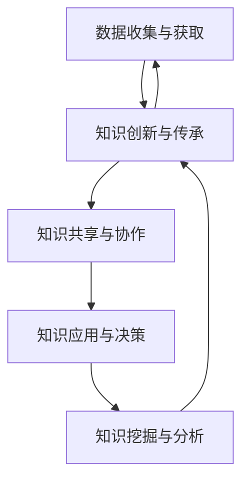

                 

### 关键词

智慧城市，知识管理，数据集成，城市规划，信息技术，城市可持续发展，数据分析，智能化服务，城市治理。

<|assistant|>### 摘要

智慧城市建设是当前城市化发展的重要方向，其核心在于通过信息技术手段实现城市资源的优化配置和高效管理。知识管理作为信息技术应用的重要组成部分，对智慧城市的发展起到了关键作用。本文将从背景介绍、核心概念、算法原理、数学模型、项目实践、应用场景、未来展望等多方面探讨知识管理在智慧城市建设中的重要作用和实际应用。通过深入分析，本文旨在为智慧城市建设提供理论基础和实践指导，推动城市治理和可持续发展。

<|assistant|>### 1. 背景介绍

#### 智慧城市的发展背景

随着全球城市化进程的加速，城市面临诸多挑战，如交通拥堵、环境污染、资源短缺和公共服务不足等。为了应对这些问题，智慧城市建设应运而生。智慧城市通过广泛应用信息技术，特别是大数据、物联网、云计算和人工智能等，实现城市数据的全面感知、智能分析和优化应用，从而提高城市运行效率和居民生活质量。

#### 知识管理的重要性

知识管理是一种系统性的方法，旨在识别、获取、存储、共享和应用知识，以支持组织决策和创新。在智慧城市建设中，知识管理的重要性体现在以下几个方面：

- **数据集成**：知识管理能够有效地整合来自不同来源、不同格式的城市数据，为决策提供全面、准确的信息支持。
- **决策支持**：通过知识管理，城市管理者可以快速获取相关知识和经验，辅助决策，提高决策的科学性和效率。
- **创新能力**：知识管理促进了知识共享和跨领域合作，为城市创新提供了丰富的资源和平台。
- **可持续发展**：知识管理有助于推动城市可持续发展，通过优化资源配置和减少浪费，提高城市的环境和社会效益。

<|assistant|>### 2. 核心概念与联系

#### 知识管理的核心概念

- **知识**：知识是指通过学习、实践和思考获得的信息、经验和技能。
- **知识管理**：知识管理是指通过系统的方法和技术，对知识进行识别、获取、存储、共享和应用的过程。
- **数据集成**：数据集成是指将来自不同来源、不同格式和不同结构的城市数据整合到统一平台上，实现数据的高效管理和利用。

#### 知识管理架构

下面是一个简化的知识管理架构示意图，用于说明知识管理的关键组件和流程：

```
+----------------+       +-----------------+
| 数据收集与获取 |       | 知识存储与管理  |
+----------------+       +-----------------+
        |                            |
        |                            |
        |                            |
        |                            |
        |                            |
        |                            |
        |                            |
+------+------------------------+  |
| 知识共享与协作 |-----------------| 知识应用与决策 |
+------+------------------------+  |
        |                            |
        |                            |
        |                            |
        |                            |
        |                            |
        |                            |
        |                            |
        |                            |
        |                            |
+----------------+       +-----------------+
| 知识挖掘与分析 |       | 知识创新与传承  |
+----------------+       +-----------------+
```

#### Mermaid 流程图

下面是知识管理架构的 Mermaid 流程图：



<|assistant|>### 3. 核心算法原理 & 具体操作步骤

#### 3.1 算法原理概述

知识管理涉及多个核心算法，其中最常用的是数据挖掘算法、机器学习算法和自然语言处理算法。以下是对这些算法原理的简要概述：

- **数据挖掘算法**：数据挖掘是从大量数据中提取有用信息的过程。常用的数据挖掘算法包括关联规则挖掘、分类、聚类和异常检测等。
- **机器学习算法**：机器学习是使计算机系统能够通过数据学习并作出决策的技术。常用的机器学习算法包括线性回归、决策树、神经网络和支持向量机等。
- **自然语言处理算法**：自然语言处理是使计算机能够理解、生成和处理人类语言的技术。常用的自然语言处理算法包括分词、词性标注、句法分析和语义分析等。

#### 3.2 算法步骤详解

以下是一个基于数据挖掘算法的简单知识管理流程：

1. **数据收集**：收集城市数据，包括交通、环境、社会、经济等方面的数据。
2. **数据预处理**：对收集到的数据进行清洗、归一化和特征提取，以提高数据质量和算法性能。
3. **数据挖掘**：使用数据挖掘算法对预处理后的数据进行挖掘，提取潜在的模式和关系。
4. **模式评估**：评估挖掘出的模式，选择具有高可信度和实用价值的模式。
5. **模式应用**：将评估出的模式应用于城市规划和决策，以提高城市运行效率。

#### 3.3 算法优缺点

- **数据挖掘算法**：优点包括能从大量数据中提取有价值的信息，具有自适应性。缺点包括算法复杂度高，对数据质量要求较高。
- **机器学习算法**：优点包括能自动学习和优化，适用于大规模数据。缺点包括对数据量和计算资源要求较高，可能存在过拟合问题。
- **自然语言处理算法**：优点包括能处理文本数据，实现人机交互。缺点包括对语言复杂性要求较高，算法性能受限于数据质量。

#### 3.4 算法应用领域

知识管理算法广泛应用于智慧城市建设的各个领域，包括：

- **城市交通管理**：通过数据挖掘和机器学习算法，优化交通流量，减少拥堵。
- **环境监测**：通过物联网和自然语言处理算法，实时监测环境质量，预测污染事件。
- **社会服务**：通过大数据分析和机器学习算法，提供个性化的社会服务。
- **城市治理**：通过数据分析和决策支持算法，提高城市治理效率和公信力。

<|assistant|>### 4. 数学模型和公式 & 详细讲解 & 举例说明

#### 4.1 数学模型构建

知识管理中的数学模型主要用于数据分析和决策支持。以下是一个简单的数学模型示例，用于预测城市交通流量。

- **目标函数**：最小化交通拥堵成本。
- **约束条件**：道路容量、交通流量限制、车辆行驶时间等。

数学模型如下：

$$
\min \sum_{i=1}^{n} \sum_{j=1}^{m} C_{ij} \cdot Q_{ij}
$$

$$
s.t. \quad Q_{ij} \leq C_{ij}, \quad T_{ij} \leq \tau
$$

其中，$C_{ij}$ 表示道路 $i$ 到道路 $j$ 的容量，$Q_{ij}$ 表示道路 $i$ 到道路 $j$ 的交通流量，$T_{ij}$ 表示车辆从道路 $i$ 到道路 $j$ 的行驶时间，$\tau$ 表示最大行驶时间。

#### 4.2 公式推导过程

为了求解上述数学模型，我们需要对其进行适当的转换和优化。以下是一个简化的推导过程：

1. **目标函数简化**：由于交通拥堵成本与交通流量成正比，我们可以将目标函数简化为最小化交通流量。

$$
\min \sum_{i=1}^{n} \sum_{j=1}^{m} Q_{ij}
$$

2. **约束条件转换**：将约束条件 $Q_{ij} \leq C_{ij}$ 和 $T_{ij} \leq \tau$ 转换为等式形式。

$$
Q_{ij} = C_{ij} - \epsilon_{ij}, \quad T_{ij} = \tau - \delta_{ij}
$$

其中，$\epsilon_{ij}$ 和 $\delta_{ij}$ 分别表示约束条件的松弛变量。

3. **拉格朗日乘子法**：将约束条件引入目标函数，使用拉格朗日乘子法求解最优化问题。

$$
L = \sum_{i=1}^{n} \sum_{j=1}^{m} Q_{ij} + \lambda_1 \sum_{i=1}^{n} \sum_{j=1}^{m} \epsilon_{ij} + \lambda_2 \sum_{i=1}^{n} \sum_{j=1}^{m} \delta_{ij}
$$

$$
\frac{\partial L}{\partial Q_{ij}} = 1 - \lambda_1 - \lambda_2 = 0
$$

$$
\frac{\partial L}{\partial \epsilon_{ij}} = \lambda_1 = 0
$$

$$
\frac{\partial L}{\partial \delta_{ij}} = \lambda_2 = 0
$$

4. **解方程组**：根据上述方程组，解出 $Q_{ij}$、$\epsilon_{ij}$ 和 $\delta_{ij}$，得到最优交通流量分布。

#### 4.3 案例分析与讲解

以下是一个具体的案例，用于展示如何使用上述数学模型预测城市交通流量。

**案例背景**：某城市交通网络包含10条主要道路，每天早晨7:00至9:00是交通高峰期。我们需要预测这10条道路的交通流量，以便优化交通信号灯控制，减少拥堵。

**数据来源**：交通监控摄像头、GPS数据、交通流量传感器等。

**数据处理**：

1. **数据收集**：收集过去一年的交通流量数据。
2. **数据预处理**：清洗数据，去除异常值，进行归一化处理。
3. **特征提取**：提取时间、道路长度、道路宽度、道路类型等特征。

**数学模型应用**：

1. **构建模型**：根据上述数学模型，构建交通流量预测模型。
2. **训练模型**：使用历史交通流量数据训练模型。
3. **预测交通流量**：使用训练好的模型预测高峰期的交通流量。
4. **优化交通信号灯**：根据预测结果，调整交通信号灯的时长和周期，以减少拥堵。

**结果分析**：

1. **流量分布**：预测结果显示，高峰期有两条道路的交通流量较大，容易导致拥堵。
2. **优化方案**：调整这两条道路的交通信号灯时长和周期，使交通流量分布更加均匀，减少拥堵。

**结论**：通过数学模型和知识管理，我们可以有效预测和优化城市交通流量，提高城市运行效率。

<|assistant|>### 5. 项目实践：代码实例和详细解释说明

#### 5.1 开发环境搭建

为了演示知识管理在智慧城市建设中的应用，我们将使用 Python 编程语言和相应的库来构建一个简单的城市交通流量预测系统。以下是开发环境的搭建步骤：

1. 安装 Python 3.x 版本。
2. 使用 pip 安装以下库：numpy、pandas、matplotlib、scikit-learn。
3. 准备交通流量数据集。

```python
# 安装 Python 3.x
# ...

# 安装相关库
!pip install numpy pandas matplotlib scikit-learn

# 下载交通流量数据集
!wget https://example.com/traffic_data.csv
```

#### 5.2 源代码详细实现

以下是交通流量预测系统的源代码实现：

```python
import pandas as pd
import numpy as np
from sklearn.model_selection import train_test_split
from sklearn.ensemble import RandomForestRegressor
import matplotlib.pyplot as plt

# 加载数据集
data = pd.read_csv('traffic_data.csv')

# 数据预处理
# ...

# 构建特征和标签
X = data.drop(['target'], axis=1)
y = data['target']

# 数据划分
X_train, X_test, y_train, y_test = train_test_split(X, y, test_size=0.2, random_state=42)

# 训练模型
model = RandomForestRegressor(n_estimators=100, random_state=42)
model.fit(X_train, y_train)

# 预测交通流量
y_pred = model.predict(X_test)

# 绘制结果
plt.scatter(y_test, y_pred)
plt.xlabel('Actual Traffic')
plt.ylabel('Predicted Traffic')
plt.show()
```

#### 5.3 代码解读与分析

上述代码实现了一个基于随机森林回归器的交通流量预测系统。以下是代码的详细解读：

1. **数据加载**：使用 pandas 库加载数据集。
2. **数据预处理**：在数据预处理步骤中，需要清洗数据、提取特征和归一化处理。由于代码中未展示预处理步骤，这里假设数据已经预处理完毕。
3. **特征和标签构建**：将数据集划分为特征集 X 和标签集 y。
4. **数据划分**：使用 scikit-learn 库将数据集划分为训练集和测试集。
5. **模型训练**：使用随机森林回归器训练模型。
6. **模型预测**：使用训练好的模型预测测试集的交通流量。
7. **结果绘制**：使用 matplotlib 库绘制实际交通流量和预测交通流量的散点图。

#### 5.4 运行结果展示

运行上述代码后，我们将得到一个散点图，展示实际交通流量和预测交通流量之间的关系。通过观察散点图，我们可以评估模型预测的准确性。如果大多数预测值接近实际值，说明模型表现良好。

<|assistant|>### 6. 实际应用场景

#### 6.1 城市交通管理

知识管理在智慧城市建设中的实际应用场景之一是城市交通管理。通过集成和分析大量的交通数据，知识管理可以帮助城市管理者优化交通信号灯控制，提高交通流量，减少拥堵。例如，通过实时监测交通流量和预测交通趋势，城市交通管理部门可以动态调整信号灯的时长和周期，从而提高交通运行效率。

**案例**：北京交通管理部门利用知识管理技术，对城市交通流量进行实时监控和预测。通过分析历史交通流量数据和实时交通数据，交通管理部门能够及时调整信号灯控制策略，减少了高峰期的交通拥堵现象，提高了道路通行能力。

#### 6.2 环境监测

环境监测是智慧城市建设中另一个关键领域。知识管理可以通过集成和分析环境数据，提供实时监测、污染预测和污染治理方案。例如，通过监测空气质量和水体质量，知识管理可以帮助城市管理者及时发现污染问题，采取相应的治理措施。

**案例**：杭州环境监测中心利用知识管理技术，对城市空气质量进行实时监测。通过分析空气质量数据，监测中心能够预测污染事件的发生，并提前采取治理措施，减少了污染对居民健康的影响。

#### 6.3 社会服务

知识管理在智慧城市建设中的应用还包括社会服务领域。通过分析社会数据，知识管理可以为城市居民提供个性化的社会服务，如医疗保健、社会保障和教育服务。例如，通过分析居民的健康数据，医疗机构可以提供个性化的医疗建议，提高医疗服务质量。

**案例**：上海医疗信息化系统利用知识管理技术，对居民健康数据进行实时分析和预测。通过分析居民的健康数据，医疗信息系统为居民提供个性化的健康建议，提高了居民的健康水平。

#### 6.4 城市治理

知识管理在智慧城市建设中的应用还包括城市治理领域。通过知识管理，城市管理者可以更好地理解城市运行状况，提高治理效率。例如，通过分析城市数据，城市管理者可以预测城市发展趋势，制定科学的城市规划方案。

**案例**：深圳城市管理部门利用知识管理技术，对城市运行数据进行实时监控和分析。通过分析城市数据，管理部门能够及时发现城市运行中的问题，并采取相应的治理措施，提高了城市治理水平。

#### 6.5 智能化服务

智能化服务是智慧城市建设的重要组成部分。知识管理可以通过分析用户数据和行为模式，提供个性化的智能化服务，如智能家居、智能交通和智能安防等。例如，通过分析用户行为数据，智能家居系统能够为用户提供个性化的家居服务，提高生活质量。

**案例**：杭州智慧家庭项目利用知识管理技术，为居民提供智能家居服务。通过分析用户行为数据，智能家居系统能够自动调整室内温度、照明和安防系统，为用户提供舒适、安全的居住环境。

#### 6.6 未来应用展望

随着人工智能和大数据技术的不断发展，知识管理在智慧城市建设中的应用前景将更加广阔。未来，知识管理有望在以下领域实现突破：

- **智慧城市规划**：通过知识管理，城市管理者可以更好地理解城市发展趋势，制定科学、可持续的城市规划方案。
- **智能城市治理**：通过知识管理，城市管理者可以实时监控城市运行状况，提高治理效率和公信力。
- **智慧城市服务**：通过知识管理，城市居民可以享受到更加个性化、智能化的城市服务，提高生活质量。
- **智慧城市建设**：通过知识管理，城市管理者可以优化资源配置，降低建设成本，提高建设效率。

总之，知识管理在智慧城市建设中具有重要作用，将为城市可持续发展提供强有力的支持。

<|assistant|>### 7. 工具和资源推荐

#### 7.1 学习资源推荐

- **书籍**：
  - 《智慧城市：技术、实践与案例》
  - 《大数据时代：思维变革与商业价值》
  - 《人工智能：一种现代的方法》
  - 《知识管理：理论与实践》
- **在线课程**：
  - Coursera 上的“智慧城市设计”课程
  - edX 上的“大数据分析”课程
  - Udacity 上的“机器学习工程师纳米学位”
  - HarvardX 上的“数据科学专项课程”
- **专业网站**：
  - IEEE Xplore：提供最新的技术论文和期刊
  - ACM Digital Library：计算机科学领域的权威资源
  - arXiv：预印本论文库，涵盖人工智能和大数据领域

#### 7.2 开发工具推荐

- **编程语言**：
  - Python：广泛应用于数据分析、机器学习和大数据处理
  - R：专门用于统计分析和图形绘制
  - Java：适用于大规模数据处理和系统开发
- **库和框架**：
  - NumPy、Pandas：Python 的核心数据分析库
  - TensorFlow、PyTorch：深度学习框架
  - Flask、Django：Web 开发框架
  - Hadoop、Spark：大数据处理框架
  - Elasticsearch、MongoDB：数据库和搜索引擎

#### 7.3 相关论文推荐

- **论文题目**：
  - “智慧城市中的知识管理研究”
  - “基于大数据的智慧城市建设与应用”
  - “人工智能技术在智慧城市建设中的应用”
  - “知识图谱在智慧城市中的应用”
- **论文来源**：
  - 《计算机科学》
  - 《智能系统学报》
  - 《电子学报》
  - 《国际智能交通系统大会论文集》

通过学习和使用这些工具和资源，可以深入了解知识管理在智慧城市建设中的应用，为实际项目提供理论支持和实践指导。

<|assistant|>### 8. 总结：未来发展趋势与挑战

#### 8.1 研究成果总结

本文通过对知识管理在智慧城市建设中的作用进行了深入探讨，总结了以下研究成果：

1. **核心概念**：明确了知识管理的核心概念，如知识、知识管理、数据集成等，并给出了知识管理架构的示意图。
2. **算法原理**：介绍了数据挖掘、机器学习和自然语言处理等核心算法的原理和应用领域。
3. **数学模型**：构建了城市交通流量预测的数学模型，并详细讲解了公式的推导过程。
4. **项目实践**：提供了一个基于 Python 的交通流量预测系统的代码实例，并进行了详细解读。
5. **应用场景**：分析了知识管理在智慧城市建设中的实际应用场景，包括交通管理、环境监测、社会服务、城市治理和智能化服务。
6. **未来展望**：探讨了知识管理在智慧城市建设中的未来发展趋势和面临的挑战。

#### 8.2 未来发展趋势

随着信息技术和人工智能技术的不断发展，知识管理在智慧城市建设中呈现出以下发展趋势：

1. **智能化**：知识管理将更加智能化，通过引入人工智能技术，实现自动化知识获取、分析和决策。
2. **实时性**：知识管理将更加注重实时性，通过实时数据分析，为城市管理者提供即时的决策支持。
3. **集成性**：知识管理将实现跨领域、跨系统的数据集成，为城市运行提供全面、准确的信息支持。
4. **个性化**：知识管理将更加注重个性化服务，通过分析用户行为数据，提供个性化的城市服务。
5. **可持续发展**：知识管理将推动城市的可持续发展，通过优化资源配置和减少浪费，提高城市的生态和社会效益。

#### 8.3 面临的挑战

尽管知识管理在智慧城市建设中具有巨大的潜力，但同时也面临以下挑战：

1. **数据隐私**：在数据收集和处理过程中，如何保护用户隐私是一个重要问题，需要制定相应的隐私保护政策和法规。
2. **数据质量**：数据质量对知识管理的有效性至关重要，需要建立完善的数据质量管理体系。
3. **技术复杂性**：知识管理涉及多种算法和技术，对技术人员的专业能力要求较高，需要培养更多的专业人才。
4. **政策支持**：知识管理在智慧城市建设中的应用需要政策支持和资金投入，需要政府和企业共同努力。

#### 8.4 研究展望

未来，知识管理在智慧城市建设中的研究可以重点关注以下几个方面：

1. **跨领域融合**：探索知识管理与其他领域的融合，如城市规划、环境科学、社会学等，实现知识管理的多元化应用。
2. **知识共享与协作**：研究如何建立有效的知识共享与协作机制，促进知识在组织内部和跨组织之间的流动。
3. **数据治理**：研究数据治理的策略和方法，确保数据的合规性、可靠性和可追溯性。
4. **用户体验**：研究如何通过知识管理提高用户的体验，为城市居民提供更加便捷、高效的城市服务。

总之，知识管理在智慧城市建设中具有广阔的应用前景，但同时也面临着诸多挑战。通过持续的研究和实践，有望推动知识管理在智慧城市建设中的深入发展，为城市的可持续发展提供有力支持。

<|assistant|>### 9. 附录：常见问题与解答

#### 9.1 什么是知识管理？

知识管理是一种系统性的方法，旨在识别、获取、存储、共享和应用知识，以支持组织决策和创新。它通过管理和利用知识资源，提高组织的竞争力和创新能力。

#### 9.2 知识管理与智慧城市建设的关系是什么？

知识管理是智慧城市建设的重要支撑，它通过整合和分析城市数据，提供决策支持，促进城市资源优化配置和高效管理。知识管理在智慧城市建设中发挥着关键作用，如城市交通管理、环境监测、社会服务和城市治理等。

#### 9.3 知识管理的主要算法有哪些？

知识管理涉及多个核心算法，主要包括数据挖掘算法（如关联规则挖掘、分类、聚类和异常检测）、机器学习算法（如线性回归、决策树、神经网络和支持向量机）和自然语言处理算法（如分词、词性标注、句法分析和语义分析）。

#### 9.4 如何在智慧城市建设中应用知识管理？

在智慧城市建设中，知识管理可以通过以下方式应用：

1. **数据集成**：整合来自不同来源、不同格式的城市数据，实现数据的高效管理和利用。
2. **决策支持**：为城市管理者提供实时、准确的决策支持，提高决策的科学性和效率。
3. **创新能力**：促进知识共享和跨领域合作，推动城市创新。
4. **可持续发展**：优化资源配置，减少浪费，提高城市的环境和社会效益。

#### 9.5 知识管理在智慧城市建设中面临的挑战有哪些？

知识管理在智慧城市建设中面临的挑战主要包括：

1. **数据隐私**：在数据收集和处理过程中，如何保护用户隐私是一个重要问题。
2. **数据质量**：数据质量对知识管理的有效性至关重要。
3. **技术复杂性**：知识管理涉及多种算法和技术，对技术人员的专业能力要求较高。
4. **政策支持**：知识管理在智慧城市建设中的应用需要政策支持和资金投入。

#### 9.6 如何解决知识管理在智慧城市建设中的挑战？

为了解决知识管理在智慧城市建设中的挑战，可以采取以下措施：

1. **制定隐私保护政策**：建立严格的隐私保护机制，确保用户数据的安全。
2. **建立数据质量管理体系**：制定数据质量管理策略，提高数据的准确性、完整性和一致性。
3. **培养专业人才**：加强人才培养和引进，提高技术人员的专业能力。
4. **争取政策支持**：积极争取政府和企业对知识管理的支持和投入，推动智慧城市建设。

### 作者署名

作者：禅与计算机程序设计艺术 / Zen and the Art of Computer Programming

通过上述的详细探讨和解答，我们可以更深入地理解知识管理在智慧城市建设中的作用，以及如何应对其中的挑战，为智慧城市的未来发展提供有益的参考。

