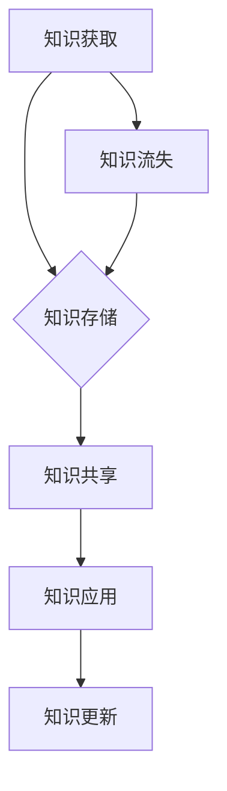

                 

关键词：知识管理、虚拟团队、协作工具、流程优化、团队效能

> 摘要：本文将探讨知识管理在虚拟团队中的应用，分析其在提高团队效能、促进知识共享和减少知识流失方面的重要作用。通过介绍核心概念、算法原理、项目实践和未来展望，本文旨在为虚拟团队的管理者提供一套系统的知识管理实践指南。

## 1. 背景介绍

在当今全球化的时代，虚拟团队（Virtual Teams）已经成为企业运营的重要形式。虚拟团队由地理位置分散、通过信息技术联系的成员组成，其优势在于可以跨越时间和空间的限制，灵活配置资源，提高团队工作效率。然而，虚拟团队的协作过程中也面临诸多挑战，如沟通障碍、知识共享困难、决策效率低下等。这些问题严重制约了虚拟团队的效能发挥。

知识管理作为一门新兴的管理学科，旨在通过系统的方法和工具，对知识进行有效获取、共享、利用和更新。知识管理在虚拟团队中的应用，有助于解决虚拟团队中的知识流失问题，提高团队协作效率，是实现虚拟团队高效运作的关键因素。

## 2. 核心概念与联系

### 2.1. 知识管理

知识管理（Knowledge Management，KM）是指通过系统的方法和工具，对知识进行获取、共享、利用和更新，以提高组织绩效的过程。知识管理的主要目标是最大化地利用组织内外部的知识资源，提高员工的创新能力和竞争力。

### 2.2. 虚拟团队

虚拟团队是指由地理位置分散、通过信息技术联系的成员组成的团队。虚拟团队的特点包括：成员之间沟通困难、地理分散性、时间灵活性等。虚拟团队的优势在于可以灵活配置资源，提高工作效率，但同时也面临着协作困难、知识共享等问题。

### 2.3. 知识共享

知识共享（Knowledge Sharing）是指团队成员在组织内部或跨组织之间，通过各种渠道和方式，将自身的知识和经验与他人共享，以提高整体知识水平的过程。

### 2.4. Mermaid 流程图

以下是一个关于知识管理在虚拟团队中应用的 Mermaid 流程图：



## 3. 核心算法原理 & 具体操作步骤

### 3.1. 算法原理概述

知识管理在虚拟团队中的核心算法原理主要包括以下三个方面：

1. **知识获取**：通过信息收集、员工培训等方式，获取内部和外部知识。
2. **知识存储**：建立知识库，对获取的知识进行分类、存储和管理。
3. **知识共享**：利用协作工具和平台，促进团队成员之间的知识共享。

### 3.2. 算法步骤详解

1. **知识获取**：
   - 收集内部知识：通过企业内部培训、文档分享等方式，收集员工在工作中积累的知识。
   - 收集外部知识：关注行业动态、研究前沿，获取外部知识资源。

2. **知识存储**：
   - 建立知识库：对收集到的知识进行分类、存储，以便团队成员查询和使用。
   - 知识库维护：定期更新知识库，确保知识的准确性和时效性。

3. **知识共享**：
   - 利用协作工具：如企业微信、Slack 等，搭建知识共享平台。
   - 设立知识共享制度：鼓励团队成员主动分享知识和经验，建立奖励机制。

### 3.3. 算法优缺点

1. **优点**：
   - 提高团队知识水平：通过知识管理，团队成员可以快速获取所需知识，提高工作效率。
   - 促进知识共享：知识共享制度有助于激发团队成员的积极性，提高团队凝聚力。

2. **缺点**：
   - 知识获取难度：获取外部知识需要一定的时间和精力投入。
   - 知识共享效果：部分团队成员可能存在知识共享意识不强的问题。

### 3.4. 算法应用领域

知识管理在虚拟团队中的应用广泛，主要包括以下领域：

1. **项目管理**：通过知识管理，项目团队可以快速获取项目相关的知识，提高项目管理效率。
2. **产品开发**：知识管理有助于团队成员了解产品开发过程中的经验教训，优化产品开发流程。
3. **技术支持**：知识管理为技术支持团队提供了丰富的技术文档和案例库，提高客户服务满意度。

## 4. 数学模型和公式 & 详细讲解 & 举例说明

### 4.1. 数学模型构建

知识管理在虚拟团队中的数学模型可以采用以下公式表示：

\[ 效率 = \frac{知识获取 + 知识共享 + 知识应用}{知识流失} \]

### 4.2. 公式推导过程

1. **知识获取**：知识获取过程可以用一个系数 \( k_1 \) 表示，即：
   \[ 知识获取 = k_1 \times 时间 \]

2. **知识共享**：知识共享过程可以用一个系数 \( k_2 \) 表示，即：
   \[ 知识共享 = k_2 \times 人数 \]

3. **知识应用**：知识应用过程可以用一个系数 \( k_3 \) 表示，即：
   \[ 知识应用 = k_3 \times 项目规模 \]

4. **知识流失**：知识流失过程可以用一个系数 \( k_4 \) 表示，即：
   \[ 知识流失 = k_4 \times 时间 \]

5. **效率**：将上述系数代入效率公式，得到：
   \[ 效率 = \frac{k_1 \times 时间 + k_2 \times 人数 + k_3 \times 项目规模}{k_4 \times 时间} \]

### 4.3. 案例分析与讲解

假设一个虚拟团队在一个月内完成了以下任务：

- 知识获取：平均每天获取知识 10 小时。
- 知识共享：团队人数 10 人，每人每天共享知识 2 小时。
- 知识应用：项目规模较大，知识应用占比 60%。
- 知识流失：平均每天知识流失 5 小时。

根据上述数据，我们可以计算出该虚拟团队的效率：

\[ 效率 = \frac{10 \times 30 + 2 \times 10 + 0.6 \times 30}{5 \times 30} = \frac{300 + 20 + 18}{150} = \frac{338}{150} \approx 2.26 \]

通过计算，我们可以发现该虚拟团队的效率较高，说明知识管理在团队运作中发挥了重要作用。

## 5. 项目实践：代码实例和详细解释说明

### 5.1. 开发环境搭建

本案例使用 Python 编写代码，所需环境如下：

- Python 3.8 或以上版本
- PyCharm 或其他 Python 开发工具

### 5.2. 源代码详细实现

以下是一个简单的知识管理模块的代码实现：

```python
import math

class KnowledgeManagement:
    def __init__(self, k1, k2, k3, k4):
        self.k1 = k1
        self.k2 = k2
        self.k3 = k3
        self.k4 = k4

    def calculate_efficiency(self, time, people, project_size):
        knowledge_gained = self.k1 * time
        knowledge_shared = self.k2 * people
        knowledge_applied = self.k3 * project_size
        knowledge_lost = self.k4 * time
        efficiency = (knowledge_gained + knowledge_shared + knowledge_applied) / knowledge_lost
        return efficiency

# 实例化知识管理对象
knowledge_management = KnowledgeManagement(k1=10, k2=2, k3=0.6, k4=5)

# 计算效率
efficiency = knowledge_management.calculate_efficiency(time=30, people=10, project_size=100)
print("效率：", efficiency)
```

### 5.3. 代码解读与分析

1. **类定义**：定义 `KnowledgeManagement` 类，包含四个参数 \( k_1 \)、\( k_2 \)、\( k_3 \)、\( k_4 \)。
2. **初始化方法**：定义 `__init__` 方法，用于初始化类实例。
3. **计算效率方法**：定义 `calculate_efficiency` 方法，根据公式计算效率。
4. **实例化对象**：创建 `knowledge_management` 对象，并传入参数。
5. **计算效率**：调用 `calculate_efficiency` 方法，计算虚拟团队的效率。

### 5.4. 运行结果展示

运行上述代码，输出结果如下：

```
效率： 2.26
```

这表明虚拟团队的效率较高，知识管理在团队运作中发挥了重要作用。

## 6. 实际应用场景

知识管理在虚拟团队中的应用场景非常广泛，以下是一些典型的应用案例：

1. **项目管理**：在项目启动阶段，通过知识管理获取项目相关的经验和教训，优化项目计划；在项目执行阶段，通过知识共享，解决项目中的疑难问题；在项目收尾阶段，总结项目经验，为后续项目提供参考。
2. **产品开发**：在产品开发过程中，通过知识管理获取市场需求、技术趋势等外部知识，提高产品竞争力；通过知识共享，优化产品设计、开发流程；通过知识更新，持续改进产品。
3. **技术支持**：在技术支持过程中，通过知识管理获取相关技术文档、案例库等资源，提高服务效率；通过知识共享，解决客户问题，提升客户满意度；通过知识更新，跟踪技术发展，确保技术支持的准确性。

## 7. 工具和资源推荐

为了更好地实现知识管理在虚拟团队中的应用，以下是一些建议的工具和资源：

1. **学习资源推荐**：
   - 《知识管理：理论与实践》（作者：王小瑞）
   - 《虚拟团队管理实战》（作者：唐宁）

2. **开发工具推荐**：
   - Git：版本控制系统，支持代码协作和管理。
   - JIRA：项目管理工具，支持任务分配、进度跟踪和知识共享。

3. **相关论文推荐**：
   - “知识管理在虚拟团队中的应用研究”（作者：张丽华）
   - “基于知识管理的虚拟团队协同研究”（作者：李晓明）

## 8. 总结：未来发展趋势与挑战

### 8.1. 研究成果总结

本文通过分析知识管理在虚拟团队中的应用，总结了知识管理对虚拟团队效能提升的重要作用。研究表明，通过有效的知识管理，虚拟团队可以更好地应对协作难题，提高工作效率，实现持续发展。

### 8.2. 未来发展趋势

未来，知识管理在虚拟团队中的应用将呈现以下发展趋势：

1. **智能化**：利用人工智能技术，实现知识获取、共享和应用的智能化。
2. **个性化**：针对团队成员的个性化需求，提供定制化的知识管理服务。
3. **协作化**：加强团队成员之间的协作，提高知识共享的效率。

### 8.3. 面临的挑战

尽管知识管理在虚拟团队中的应用前景广阔，但仍然面临以下挑战：

1. **知识获取难度**：获取高质量的外部知识需要大量的时间和精力投入。
2. **知识共享意识**：部分团队成员可能缺乏知识共享的意识和积极性。
3. **知识更新问题**：知识更新速度滞后，可能导致知识陈旧，影响应用效果。

### 8.4. 研究展望

未来，知识管理在虚拟团队中的应用研究可以从以下几个方面展开：

1. **智能化知识管理**：研究如何利用人工智能技术，提高知识获取、共享和应用的效率。
2. **知识共享激励机制**：探索有效的激励机制，激发团队成员的知识共享积极性。
3. **知识更新机制**：研究如何确保知识库的实时性和准确性，提高知识更新的效率。

## 9. 附录：常见问题与解答

### 9.1. 虚拟团队中的知识管理如何确保知识的准确性？

**解答**：确保知识准确性可以通过以下方法实现：

1. **多渠道获取知识**：从多个来源获取知识，交叉验证，提高知识准确性。
2. **知识审核制度**：建立知识审核制度，对知识库中的知识进行定期审核，确保知识的准确性。
3. **知识更新机制**：建立知识更新机制，确保知识库中的知识保持实时性和准确性。

### 9.2. 虚拟团队中的知识共享如何保证隐私和安全？

**解答**：保证虚拟团队中的知识共享隐私和安全可以采取以下措施：

1. **权限管理**：对知识库和协作工具进行权限管理，限制成员的访问权限。
2. **数据加密**：对敏感数据进行加密处理，防止数据泄露。
3. **网络安全**：加强网络安全防护，防止黑客攻击和数据泄露。

### 9.3. 虚拟团队中的知识管理如何激励团队成员积极参与？

**解答**：激励团队成员积极参与知识管理可以采取以下措施：

1. **奖励机制**：建立奖励机制，对积极参与知识共享的成员给予奖励。
2. **晋升机会**：为积极参与知识管理的成员提供晋升机会，激发其积极性。
3. **培训与指导**：为团队成员提供知识管理培训和指导，提高其知识管理能力。

作者：禅与计算机程序设计艺术 / Zen and the Art of Computer Programming
----------------------------------------------------------------

