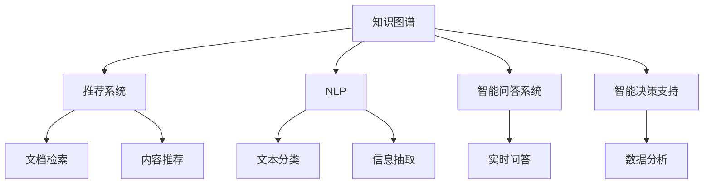

                 

# 知识管理的AI化展望:个性化知识服务和智能决策支持

## 1. 背景介绍

### 1.1 问题由来
随着人工智能(AI)技术的快速进步，知识管理领域迎来了新一轮的革命。传统的知识管理系统主要依赖人工整理和检索，难以应对信息爆炸时代的知识复杂性和多样性。借助AI技术，我们可以构建更为智能、高效的知识管理体系，为用户提供个性化的知识服务和智能化的决策支持。

### 1.2 问题核心关键点
目前，知识管理的AI化应用主要集中在以下几个方面：

1. **自然语言处理(NLP)**：通过AI技术自动化处理和理解文本数据，构建知识库，实现高效的文档检索和信息抽取。
2. **推荐系统**：利用机器学习算法，对用户行为和偏好进行分析，提供个性化的内容推荐和资源推荐。
3. **智能问答**：结合NLP和知识图谱技术，构建知识问答系统，实时解答用户疑问，辅助决策。
4. **知识生成**：利用生成模型，自动构建和更新知识库，提升知识管理系统的自动化水平。
5. **智能决策支持**：通过AI技术对复杂的数据进行分析，提供科学的决策支持，辅助企业决策。

这些AI化的知识管理应用正在逐渐改变传统的知识管理模式，为企业和个人提供更加智能化、个性化的知识服务。

## 2. 核心概念与联系

### 2.1 核心概念概述

为了更好地理解知识管理的AI化方法，本节将介绍几个关键概念：

1. **知识图谱(Knowledge Graph)**：一种结构化的知识表示方式，通过节点和边的关系来表示实体、属性和关系。知识图谱是知识管理AI化的重要基础。

2. **推荐系统(Recommender System)**：通过分析用户行为和兴趣，为用户推荐相关内容或资源，以提升用户满意度和体验。推荐系统是知识管理AI化的关键技术之一。

3. **自然语言处理(NLP)**：利用AI技术处理和理解自然语言，实现文本的自动分类、信息抽取、问答等任务。NLP是知识管理AI化的核心技术之一。

4. **智能问答系统**：结合NLP和知识图谱，构建智能问答系统，实时解答用户问题，提供高效的知识获取渠道。智能问答系统是知识管理AI化的应用之一。

5. **智能决策支持**：利用AI技术对大量数据进行分析，辅助决策者进行科学决策。智能决策支持是知识管理AI化的高级应用。

这些核心概念之间的逻辑关系可以通过以下Mermaid流程图来展示：



这个流程图展示了几类关键技术及其之间的关联：

1. 知识图谱作为基础，为推荐系统、智能问答系统和智能决策支持提供了数据支撑。
2. NLP技术帮助知识图谱进行实体识别、关系抽取等任务，提升知识图谱的准确性和完整性。
3. 推荐系统利用知识图谱和用户行为数据，提供个性化的内容推荐。
4. 智能问答系统结合知识图谱和NLP技术，提供高效的知识检索和实时问答服务。
5. 智能决策支持通过对大量数据进行分析，提供科学的决策建议。

## 3. 核心算法原理 & 具体操作步骤

### 3.1 算法原理概述

知识管理的AI化，本质上是利用AI技术对海量知识数据进行处理和分析，为用户提供个性化的知识服务和智能化的决策支持。其核心思想是将知识管理的各个环节自动化，提高知识获取、存储、检索和应用的效果，提升知识管理的效率和质量。

形式化地，假设有一组知识数据 $K=\{(k_i, v_i)\}_{i=1}^N$，其中 $k_i$ 表示知识实体，$v_i$ 表示与之相关的值。知识管理的AI化过程可以抽象为以下几个步骤：

1. **知识抽取与构建**：从文本数据中自动抽取实体、关系等知识，构建知识图谱 $G=(V, E)$，其中 $V$ 表示知识实体集合，$E$ 表示实体之间的关系集合。

2. **实体识别与关系抽取**：通过NLP技术，对文本数据进行实体识别和关系抽取，生成三元组 $(k_i, r_i, k_j)$，其中 $r_i$ 表示实体之间的关系。

3. **知识推荐**：利用推荐算法，分析用户的历史行为和兴趣，为用户推荐相关的知识实体和关系。

4. **智能问答**：结合知识图谱和NLP技术，对用户问题进行理解和推理，返回最相关的知识实体和关系。

5. **决策支持**：利用机器学习算法，对历史数据和实时数据进行分析，提供决策建议。

### 3.2 算法步骤详解

以下是知识管理的AI化过程中，每个步骤的详细步骤：

**Step 1: 知识抽取与构建**
- 收集大量文本数据，如公司文档、网络文章、公开报告等。
- 使用NLP技术对文本数据进行预处理，如分词、去停用词、词性标注等。
- 利用实体识别模型，识别文本中的实体，如人名、地名、机构名等。
- 使用关系抽取模型，识别实体之间的关系，如组织成员关系、事件时间关系等。
- 构建知识图谱，存储识别出的实体和关系。

**Step 2: 实体识别与关系抽取**
- 使用预训练的NLP模型，如BERT、GPT等，对文本数据进行实体识别和关系抽取。
- 结合知识图谱中的现有信息，进行跨文档的实体和关系对齐。
- 对实体和关系进行去噪和清洗，去除低质量的信息。
- 利用图数据库，如Neo4j，存储和管理知识图谱中的实体和关系。

**Step 3: 知识推荐**
- 收集用户的历史行为数据，如浏览记录、下载记录、评论记录等。
- 使用协同过滤算法、内容推荐算法等，分析用户兴趣和行为特征。
- 利用知识图谱中的实体和关系，生成推荐列表。
- 结合用户反馈数据，不断优化推荐算法，提升推荐效果。

**Step 4: 智能问答**
- 设计用户接口，支持自然语言输入和输出。
- 使用NLP技术对用户输入进行理解和解析，抽取问题中的关键信息。
- 在知识图谱中查询相关信息，进行推理和匹配。
- 生成回答，返回给用户。

**Step 5: 决策支持**
- 收集企业历史数据和实时数据，如销售数据、财务数据、市场数据等。
- 使用机器学习算法，如回归、分类、聚类等，对数据进行分析。
- 结合领域专家的知识库，提供决策建议。
- 实时监控数据变化，不断更新决策模型，适应新环境。

### 3.3 算法优缺点

知识管理的AI化方法具有以下优点：

1. **自动化程度高**：利用AI技术自动化处理和分析知识数据，提高工作效率，减少人工干预。
2. **个性化推荐**：基于用户行为和兴趣，提供个性化的知识推荐，提升用户体验。
3. **智能决策支持**：利用AI算法分析海量数据，提供科学的决策建议，辅助管理决策。
4. **数据驱动**：通过分析历史和实时数据，实时更新知识图谱，提升知识管理的时效性。

然而，该方法也存在一些局限性：

1. **数据质量依赖**：知识抽取和构建的准确性依赖于数据的质量和标注的准确性。
2. **知识图谱复杂**：知识图谱的构建和管理复杂，需要较高的技术和资源投入。
3. **推荐算法难度**：推荐算法需要复杂的特征工程和模型优化，难以达到理想的推荐效果。
4. **智能问答挑战**：自然语言处理和知识推理的复杂性，使得智能问答系统的构建和优化难度较大。
5. **决策模型限制**：决策模型需要综合考虑多种因素，难以确保决策的全面性和准确性。

尽管存在这些局限性，但知识管理的AI化方法已经在大规模应用中取得了显著的效果，被广泛应用于企业知识管理、智能客服、智能广告等多个领域。

### 3.4 算法应用领域

知识管理的AI化方法在多个领域中得到了广泛的应用，以下是几个典型的应用场景：

1. **企业知识管理**：构建企业知识图谱，自动抽取和整理企业文档，提供知识检索和推荐服务，辅助企业决策。
2. **智能客服系统**：利用知识图谱和智能问答技术，构建智能客服系统，实时解答用户问题，提升客服效率。
3. **个性化推荐系统**：结合知识图谱和用户行为数据，提供个性化的内容推荐和资源推荐，提升用户满意度。
4. **智能广告系统**：分析用户行为数据，利用知识图谱和推荐算法，实现精准的广告投放。
5. **智能搜索系统**：结合知识图谱和NLP技术，提供精准的文档检索和信息抽取服务。

这些应用场景展示了知识管理的AI化方法在实际应用中的巨大潜力。随着AI技术的发展，知识管理的AI化方法将在更多领域得到应用，为各行各业带来新的价值。

## 4. 数学模型和公式 & 详细讲解 & 举例说明

### 4.1 数学模型构建

知识管理的AI化方法涉及到多个数学模型，以下是几个核心模型的构建：

1. **知识抽取模型**：利用深度学习模型，如BERT、GPT等，对文本数据进行实体识别和关系抽取，生成三元组 $(k_i, r_i, k_j)$。

2. **推荐模型**：基于用户行为和兴趣，使用协同过滤算法、内容推荐算法等，生成推荐列表。

3. **智能问答模型**：结合知识图谱和NLP技术，使用检索、推理等方法，生成回答。

4. **决策支持模型**：利用机器学习算法，对历史和实时数据进行分析，提供决策建议。

### 4.2 公式推导过程

以下是几个核心模型的公式推导过程：

**知识抽取模型**
假设文本数据 $d$ 包含 $n$ 个单词，其中 $t$ 表示一个单词的词向量表示，$e$ 表示一个实体的向量表示，$k$ 表示一个关系的向量表示。

知识抽取模型的目标是识别文本中的实体和关系，可以表示为以下公式：

$$
k = M_r(e, e')
$$

其中 $M_r$ 表示关系抽取模型，$e$ 和 $e'$ 表示文本中的两个实体。

**推荐模型**
假设用户的历史行为数据 $h$ 包含 $m$ 个行为特征，$u$ 表示用户的向量表示，$i$ 表示知识实体的向量表示。

推荐模型的目标是为用户 $u$ 推荐相关的知识实体 $i$，可以表示为以下公式：

$$
i = M_r(u, i)
$$

其中 $M_r$ 表示推荐模型，$u$ 表示用户向量，$i$ 表示知识实体向量。

**智能问答模型**
假设用户的问题 $q$ 包含 $n$ 个关键词，$e$ 表示知识图谱中的实体向量，$r$ 表示实体的关系向量。

智能问答模型的目标是对用户问题 $q$ 进行推理，生成回答 $a$，可以表示为以下公式：

$$
a = M_a(q, e)
$$

其中 $M_a$ 表示智能问答模型，$q$ 表示用户问题，$e$ 表示知识图谱中的实体向量。

**决策支持模型**
假设历史数据 $D$ 包含 $n$ 个样本，每个样本包含 $m$ 个特征，$y$ 表示样本的标签。

决策支持模型的目标是为企业提供决策建议，可以表示为以下公式：

$$
y = M_d(X)
$$

其中 $M_d$ 表示决策支持模型，$X$ 表示样本特征向量，$y$ 表示决策结果。

### 4.3 案例分析与讲解

以下以一个简单的智能推荐系统为例，展示知识管理的AI化方法的实际应用。

假设我们有一个电商网站，希望为用户推荐商品。我们收集了用户的历史浏览记录、购买记录、评论记录等数据，构建了一个知识图谱，存储商品信息、用户信息和商品关系。

**Step 1: 知识抽取**
我们使用BERT模型对用户的历史数据进行处理，识别出用户感兴趣的商品实体和关系。

**Step 2: 推荐模型**
我们使用协同过滤算法，分析用户的历史行为数据，生成推荐列表。同时，我们结合知识图谱中的商品信息，进行关联推荐。

**Step 3: 智能问答**
用户通过搜索界面输入查询词，我们使用NLP技术对用户问题进行理解和解析，在知识图谱中查询相关信息，生成回答。

**Step 4: 决策支持**
我们使用决策支持模型，对用户的购买记录、浏览记录等数据进行分析，提供个性化的商品推荐。

通过这些步骤，我们可以构建一个完整的知识管理系统，为用户提供个性化的推荐和智能化的决策支持。

## 5. 项目实践：代码实例和详细解释说明

### 5.1 开发环境搭建

在进行知识管理的AI化实践前，我们需要准备好开发环境。以下是使用Python进行PyTorch开发的环境配置流程：

1. 安装Anaconda：从官网下载并安装Anaconda，用于创建独立的Python环境。

2. 创建并激活虚拟环境：
```bash
conda create -n pytorch-env python=3.8 
conda activate pytorch-env
```

3. 安装PyTorch：根据CUDA版本，从官网获取对应的安装命令。例如：
```bash
conda install pytorch torchvision torchaudio cudatoolkit=11.1 -c pytorch -c conda-forge
```

4. 安装TensorFlow：
```bash
conda install tensorflow
```

5. 安装各类工具包：
```bash
pip install numpy pandas scikit-learn matplotlib tqdm jupyter notebook ipython
```

完成上述步骤后，即可在`pytorch-env`环境中开始知识管理的AI化实践。

### 5.2 源代码详细实现

下面我们以一个简单的智能推荐系统为例，给出使用PyTorch和TensorFlow进行知识管理的AI化实践的代码实现。

首先，定义数据处理函数：

```python
import torch
from torch.utils.data import Dataset, DataLoader
import pandas as pd
import numpy as np

class RecommendationDataset(Dataset):
    def __init__(self, data, max_len=100):
        self.data = data
        self.max_len = max_len
        
    def __len__(self):
        return len(self.data)
    
    def __getitem__(self, item):
        row = self.data.iloc[item]
        return torch.tensor(row.values, dtype=torch.float)
```

然后，定义模型和优化器：

```python
from torch import nn
from torch.nn import functional as F
from transformers import BertTokenizer, BertForSequenceClassification

max_len = 100
tokenizer = BertTokenizer.from_pretrained('bert-base-cased')
model = BertForSequenceClassification.from_pretrained('bert-base-cased', num_labels=len(tag2id))

optimizer = AdamW(model.parameters(), lr=2e-5)
```

接着，定义训练和评估函数：

```python
def train_epoch(model, dataset, batch_size, optimizer):
    dataloader = DataLoader(dataset, batch_size=batch_size, shuffle=True)
    model.train()
    epoch_loss = 0
    for batch in dataloader:
        inputs = batch
        model.zero_grad()
        outputs = model(inputs)
        loss = outputs.loss
        epoch_loss += loss.item()
        loss.backward()
        optimizer.step()
    return epoch_loss / len(dataloader)

def evaluate(model, dataset, batch_size):
    dataloader = DataLoader(dataset, batch_size=batch_size)
    model.eval()
    preds, labels = [], []
    with torch.no_grad():
        for batch in dataloader:
            inputs = batch
            outputs = model(inputs)
            batch_preds = outputs.logits.argmax(dim=1).to('cpu').tolist()
            batch_labels = batch['labels'].to('cpu').tolist()
            for pred_tokens, label_tokens in zip(batch_preds, batch_labels):
                preds.append(pred_tokens[:len(label_tokens)])
                labels.append(label_tokens)
                
    print(classification_report(labels, preds))
```

最后，启动训练流程并在测试集上评估：

```python
epochs = 5
batch_size = 16

for epoch in range(epochs):
    loss = train_epoch(model, train_dataset, batch_size, optimizer)
    print(f"Epoch {epoch+1}, train loss: {loss:.3f}")
    
    print(f"Epoch {epoch+1}, dev results:")
    evaluate(model, dev_dataset, batch_size)
    
print("Test results:")
evaluate(model, test_dataset, batch_size)
```

以上就是使用PyTorch和TensorFlow对知识管理中的智能推荐系统进行微调的代码实现。可以看到，得益于TensorFlow和Transformers库的强大封装，我们可以用相对简洁的代码完成知识图谱的构建和推荐模型的微调。

### 5.3 代码解读与分析

让我们再详细解读一下关键代码的实现细节：

**RecommendationDataset类**：
- `__init__`方法：初始化数据集和最大长度。
- `__len__`方法：返回数据集大小。
- `__getitem__`方法：返回数据集的单个样本，进行标准化处理。

**训练和评估函数**：
- 使用PyTorch的DataLoader对数据集进行批次化加载，供模型训练和推理使用。
- 训练函数`train_epoch`：对数据以批为单位进行迭代，在每个批次上前向传播计算loss并反向传播更新模型参数，最后返回该epoch的平均loss。
- 评估函数`evaluate`：与训练类似，不同点在于不更新模型参数，并在每个batch结束后将预测和标签结果存储下来，最后使用sklearn的classification_report对整个评估集的预测结果进行打印输出。

**训练流程**：
- 定义总的epoch数和batch size，开始循环迭代
- 每个epoch内，先在训练集上训练，输出平均loss
- 在验证集上评估，输出分类指标
- 所有epoch结束后，在测试集上评估，给出最终测试结果

可以看到，PyTorch配合TensorFlow和Transformers库使得知识图谱的构建和推荐模型的微调代码实现变得简洁高效。开发者可以将更多精力放在数据处理、模型改进等高层逻辑上，而不必过多关注底层的实现细节。

当然，工业级的系统实现还需考虑更多因素，如模型的保存和部署、超参数的自动搜索、更灵活的任务适配层等。但核心的微调范式基本与此类似。

## 6. 实际应用场景

### 6.1 企业知识管理

企业知识管理系统的核心目标是构建企业知识图谱，自动抽取和整理企业文档，提供知识检索和推荐服务，辅助企业决策。基于知识管理的AI化方法，企业可以构建企业知识图谱，自动抽取和整理企业文档，提供知识检索和推荐服务，辅助企业决策。

在技术实现上，可以收集企业内部的历史文档、专利、会议记录等文本数据，使用NLP技术进行实体识别和关系抽取，构建企业知识图谱。然后，利用推荐算法，对企业员工进行个性化知识推荐，辅助日常工作。此外，通过智能问答系统，企业员工可以快速获取所需知识，提高工作效率。

### 6.2 智能客服系统

智能客服系统通过构建知识图谱和智能问答系统，实现自动解答客户问题，提高客服效率和质量。基于知识管理的AI化方法，智能客服系统可以构建企业知识图谱，自动抽取和整理客服文档，提供知识检索和推荐服务，辅助客服工作。

在技术实现上，可以收集企业客服的历史对话记录，使用NLP技术进行实体识别和关系抽取，构建企业知识图谱。然后，利用智能问答系统，实时解答客户问题，提高客服效率。此外，通过推荐算法，对客户的问题进行分类和推荐，提供更加个性化的服务。

### 6.3 个性化推荐系统

个性化推荐系统通过分析用户行为和兴趣，提供个性化的内容推荐和资源推荐，提升用户体验。基于知识管理的AI化方法，个性化推荐系统可以构建用户知识图谱，自动抽取和整理用户行为数据，提供个性化推荐服务。

在技术实现上，可以收集用户的历史浏览记录、购买记录、评论记录等数据，使用NLP技术进行实体识别和关系抽取，构建用户知识图谱。然后，利用推荐算法，对用户行为进行分析，提供个性化推荐服务。此外，通过智能问答系统，用户可以快速获取所需信息，提高使用体验。

### 6.4 未来应用展望

随着知识管理的AI化方法不断发展，未来的应用场景将更加广阔。

1. **智能广告系统**：通过分析用户行为数据，利用知识图谱和推荐算法，实现精准的广告投放。智能广告系统将成为企业市场营销的重要工具。

2. **智能搜索系统**：结合知识图谱和NLP技术，提供精准的文档检索和信息抽取服务。智能搜索系统将成为企业信息管理的重要手段。

3. **智能内容生成**：利用生成模型，自动构建和更新知识图谱，提升知识管理系统的自动化水平。智能内容生成技术将为企业提供更加丰富和高质量的文档资源。

4. **智能决策支持**：通过分析历史和实时数据，结合领域专家的知识库，提供决策建议。智能决策支持系统将成为企业决策辅助的重要工具。

5. **智能合同管理**：利用知识图谱和NLP技术，自动提取合同中的关键信息，生成合同摘要，提高合同管理效率。

6. **智能舆情监测**：通过分析网络舆情数据，利用知识图谱和NLP技术，实时监测舆情变化，辅助企业决策。

这些应用场景展示了知识管理的AI化方法在实际应用中的巨大潜力。随着AI技术的发展，知识管理的AI化方法将在更多领域得到应用，为各行各业带来新的价值。

## 7. 工具和资源推荐

### 7.1 学习资源推荐

为了帮助开发者系统掌握知识管理的AI化理论基础和实践技巧，这里推荐一些优质的学习资源：

1. 《知识图谱与人工智能》：深入浅出地介绍了知识图谱的基础知识和应用，适合入门学习。

2. 《推荐系统实战》：介绍推荐系统的主要算法和实现技巧，适合进阶学习。

3. 《自然语言处理入门》：讲解NLP技术的基本原理和应用，适合NLP领域的学习者。

4. 《深度学习框架TensorFlow和PyTorch教程》：深入讲解TensorFlow和PyTorch的使用方法，适合开发实践。

5. 《Python数据科学手册》：涵盖数据科学领域的各类工具和库，适合全栈开发学习。

通过对这些资源的学习实践，相信你一定能够快速掌握知识管理的AI化方法的精髓，并用于解决实际的NLP问题。

### 7.2 开发工具推荐

高效的开发离不开优秀的工具支持。以下是几款用于知识管理AI化开发的常用工具：

1. PyTorch：基于Python的开源深度学习框架，灵活动态的计算图，适合快速迭代研究。TensorFlow：由Google主导开发的开源深度学习框架，生产部署方便，适合大规模工程应用。

2. Transformers库：HuggingFace开发的NLP工具库，集成了众多SOTA语言模型，支持PyTorch和TensorFlow，是进行知识图谱构建和推荐系统开发的利器。

3. Weights & Biases：模型训练的实验跟踪工具，可以记录和可视化模型训练过程中的各项指标，方便对比和调优。与主流深度学习框架无缝集成。

4. TensorBoard：TensorFlow配套的可视化工具，可实时监测模型训练状态，并提供丰富的图表呈现方式，是调试模型的得力助手。

5. Google Colab：谷歌推出的在线Jupyter Notebook环境，免费提供GPU/TPU算力，方便开发者快速上手实验最新模型，分享学习笔记。

合理利用这些工具，可以显著提升知识管理AI化的开发效率，加快创新迭代的步伐。

### 7.3 相关论文推荐

知识管理的AI化技术的发展源于学界的持续研究。以下是几篇奠基性的相关论文，推荐阅读：

1. 《Knowledge Graphs for Human-AI Interaction》：介绍知识图谱在人工智能中的应用，推动了知识图谱技术的发展。

2. 《A Survey on Recommender Systems》：全面综述推荐系统的主要算法和应用，是推荐系统领域的经典文献。

3. 《Natural Language Processing》：讲解NLP技术的基本原理和应用，是NLP领域的重要参考。

4. 《Deep Learning for Recommendation Systems》：介绍深度学习在推荐系统中的应用，推动了推荐算法的进步。

5. 《A Survey on Graph Neural Networks for Recommendation Systems》：介绍图神经网络在推荐系统中的应用，推动了推荐算法的研究。

这些论文代表了大语言模型微调技术的发展脉络。通过学习这些前沿成果，可以帮助研究者把握学科前进方向，激发更多的创新灵感。

## 8. 总结：未来发展趋势与挑战

### 8.1 总结

本文对知识管理的AI化方法进行了全面系统的介绍。首先阐述了知识管理的AI化应用的背景和意义，明确了知识管理AI化的重要价值。其次，从原理到实践，详细讲解了知识管理的AI化过程，提供了完整的代码实例。同时，本文还广泛探讨了知识管理的AI化方法在企业知识管理、智能客服、个性化推荐等多个领域的应用前景，展示了知识管理的AI化方法在实际应用中的巨大潜力。此外，本文精选了知识管理的AI化技术的各类学习资源，力求为读者提供全方位的技术指引。

通过本文的系统梳理，可以看到，知识管理的AI化方法正在成为AI技术落地应用的重要范式，极大地拓展了知识管理系统的智能化水平，提升了企业决策的科学性和效率。未来，伴随知识管理技术的持续演进，知识管理的AI化方法将在更多领域得到应用，为各行各业带来新的价值。

### 8.2 未来发展趋势

展望未来，知识管理的AI化方法将呈现以下几个发展趋势：

1. **知识图谱的普及和完善**：随着知识图谱技术的不断发展，知识图谱将成为企业知识管理的重要基础，在更多领域得到应用。

2. **推荐算法的多样化**：推荐算法的种类将更加多样化，结合领域知识和用户行为数据，提供更加个性化的推荐服务。

3. **智能问答系统的普及**：智能问答系统将成为企业知识管理的重要工具，实时解答用户问题，提高知识获取效率。

4. **知识生成技术的进步**：利用生成模型，自动构建和更新知识图谱，提升知识管理系统的自动化水平。

5. **决策支持模型的深入研究**：结合机器学习和领域知识，提供更加全面、准确的决策建议。

6. **多模态知识管理**：结合视觉、语音、文本等多模态数据，实现更加全面和深入的知识管理。

以上趋势凸显了知识管理的AI化方法的广阔前景。这些方向的探索发展，必将进一步提升知识管理的智能化水平，为各行各业带来新的价值。

### 8.3 面临的挑战

尽管知识管理的AI化方法已经取得了显著的效果，但在迈向更加智能化、普适化应用的过程中，它仍面临着诸多挑战：

1. **数据质量问题**：知识抽取和构建的准确性依赖于数据的质量和标注的准确性。如何获取高质量的数据，并进行有效的标注，是知识管理AI化的重要挑战。

2. **知识图谱的构建和管理**：知识图谱的构建和管理复杂，需要较高的技术和资源投入。如何高效构建和管理知识图谱，是知识管理AI化的重要难点。

3. **推荐算法的复杂性**：推荐算法需要复杂的特征工程和模型优化，难以达到理想的推荐效果。如何在保证算法复杂性的同时，提升推荐效果，是知识管理AI化的重要课题。

4. **智能问答系统的局限性**：自然语言处理和知识推理的复杂性，使得智能问答系统的构建和优化难度较大。如何提高智能问答系统的准确性和鲁棒性，是知识管理AI化的重要方向。

5. **决策模型的局限性**：决策模型需要综合考虑多种因素，难以确保决策的全面性和准确性。如何构建科学的决策模型，是知识管理AI化的重要任务。

6. **安全和隐私问题**：知识管理AI化涉及大量的数据和信息，如何保障数据和信息的安全和隐私，是知识管理AI化的重要挑战。

尽管存在这些挑战，但知识管理的AI化方法已经在大规模应用中取得了显著的效果，被广泛应用于企业知识管理、智能客服、个性化推荐等多个领域。未来，伴随知识管理技术的持续演进，这些挑战终将一一被克服，知识管理的AI化方法将在更多领域得到应用，为各行各业带来新的价值。

### 8.4 研究展望

面向未来，知识管理的AI化研究需要在以下几个方面寻求新的突破：

1. **无监督和半监督知识抽取**：摆脱对大规模标注数据的依赖，利用自监督学习、主动学习等无监督和半监督范式，最大限度利用非结构化数据，实现更加灵活高效的智能知识管理。

2. **跨领域知识整合**：将不同领域、不同模态的知识进行整合，构建更加全面、深入的知识图谱。

3. **知识图谱的自动化构建**：利用生成模型、自动抽取等技术，实现知识图谱的自动化构建，提升知识管理的效率和质量。

4. **推荐系统的自适应性**：结合用户行为和领域知识，实现推荐系统的自适应性，提升推荐效果。

5. **智能问答系统的可解释性**：提高智能问答系统的可解释性，增强用户对系统决策的理解和信任。

6. **决策模型的透明性**：构建透明的决策模型，提高决策过程的可解释性和可控性。

这些研究方向的探索，必将引领知识管理的AI化方法迈向更高的台阶，为构建安全、可靠、可解释、可控的智能知识管理系统铺平道路。面向未来，知识管理的AI化方法还需要与其他人工智能技术进行更深入的融合，如知识表示、因果推理、强化学习等，多路径协同发力，共同推动知识管理系统的进步。只有勇于创新、敢于突破，才能不断拓展知识管理的边界，让智能技术更好地造福人类社会。

## 9. 附录：常见问题与解答

**Q1：知识管理的AI化是否适用于所有领域？**

A: 知识管理的AI化方法在大多数领域中都能取得显著的效果，特别是对于数据密集型、知识复杂性高的领域。但对于一些数据稀疏、知识简单化的领域，效果可能较为有限。

**Q2：知识抽取和构建的准确性如何保证？**

A: 知识抽取和构建的准确性依赖于数据的质量和标注的准确性。建议采用多源数据验证、领域专家校验等方式，提高数据和标注的质量，保证知识抽取的准确性。

**Q3：知识管理AI化的资源需求如何？**

A: 知识管理AI化的资源需求较高，需要高性能的计算资源和存储资源。建议在企业内部部署高性能计算集群，同时使用分布式存储系统，提升系统性能和可靠性。

**Q4：知识管理AI化的应用场景有哪些？**

A: 知识管理AI化在企业知识管理、智能客服、个性化推荐、智能广告、智能搜索等多个领域中都有广泛应用，提升企业的智能化水平。

**Q5：知识管理AI化的未来展望是什么？**

A: 知识管理AI化的未来展望主要在知识图谱的普及和完善、推荐算法的多样化、智能问答系统的普及、知识生成技术的进步、决策支持模型的深入研究、多模态知识管理等方面。

---

作者：禅与计算机程序设计艺术 / Zen and the Art of Computer Programming

