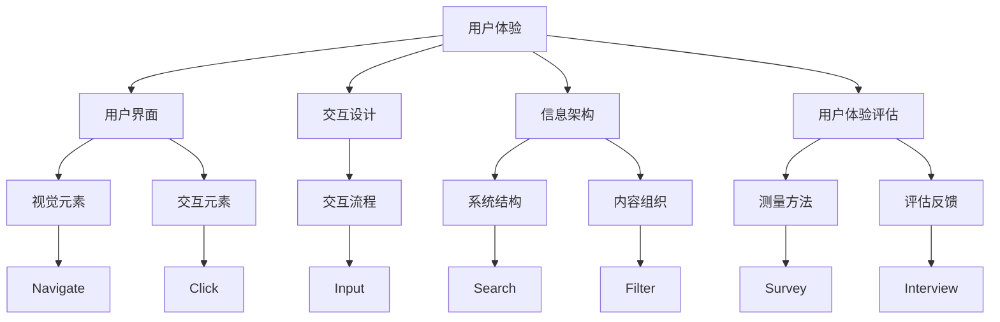
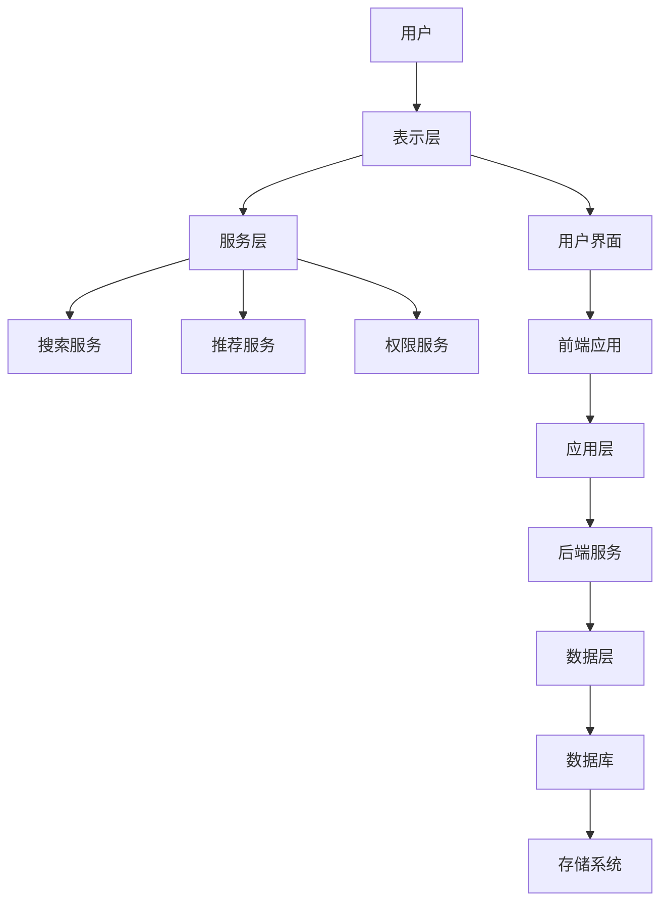

                 

  
## 1. 背景介绍

在当今数字化、网络化的时代，信息无处不在，知识更新速度迅猛。企业、组织和个人的知识管理成为提高竞争力、创新能力的重要手段。知识管理系统的建设不仅是技术问题，更是用户体验问题。一个优秀的设计能够提高知识管理的效率，减少冗余，促进知识的共享和创新。

用户体验（User Experience，简称UX）设计是近年来在信息技术领域逐渐兴起的一门学科，它关注的是用户在使用产品或服务过程中的感受、行为和反馈。在知识管理系统中，用户体验设计尤为重要，因为它直接影响到用户对系统的接受程度、使用频率和长期留存率。

本文旨在探讨知识管理系统的用户体验设计，从以下几个方面展开讨论：

1. 核心概念与联系
2. 核心算法原理与具体操作步骤
3. 数学模型和公式
4. 项目实践：代码实例和详细解释说明
5. 实际应用场景
6. 工具和资源推荐
7. 总结：未来发展趋势与挑战

通过这篇文章，希望能够为从事知识管理系统开发、设计和使用的人员提供一些有益的参考和启示。

## 2. 核心概念与联系

在探讨知识管理系统的用户体验设计之前，我们首先需要明确几个核心概念，并了解它们之间的联系。

### 2.1 用户体验（User Experience, UX）

用户体验是一个广泛的概念，它包括了用户在使用产品或服务过程中的所有感受，包括情感、认知、行为等各个方面。在知识管理系统中，用户体验设计关注的是用户如何与系统交互，以及这种交互带来的感受和效果。

### 2.2 用户界面（User Interface, UI）

用户界面是用户与系统交互的界面，包括视觉元素、交互元素和交互流程。一个优秀的用户界面能够提高用户的操作效率，减少错误，提供愉悦的交互体验。

### 2.3 交互设计（Interaction Design）

交互设计是用户体验设计的一个子领域，它关注的是用户与产品或服务的交互过程。在知识管理系统中，交互设计涉及用户如何搜索、浏览、编辑和分享知识，以及这些操作的具体实现方式。

### 2.4 信息架构（Information Architecture）

信息架构是设计系统结构和内容组织的方式，它决定了用户如何找到和使用系统中的信息。在知识管理系统中，信息架构的设计至关重要，它决定了知识系统的易用性和可访问性。

### 2.5 用户体验评估（User Experience Evaluation）

用户体验评估是通过各种方法对用户的使用体验进行测量和评估，以发现系统存在的问题，并为改进设计提供依据。在知识管理系统中，用户体验评估可以帮助我们了解用户的需求和反馈，从而优化系统的设计和功能。

这些概念之间存在紧密的联系，如图所示：



通过这些概念的理解，我们可以更好地进行知识管理系统的用户体验设计，从而提升用户的使用体验和满意度。

### 2.6 知识管理系统的架构

知识管理系统的架构决定了系统的功能、性能和可扩展性。一个典型的知识管理系统通常包括以下几个主要组成部分：

- **数据层**：包括数据库和存储系统，用于存储和管理知识信息。
- **应用层**：包括前端应用和后端服务，负责处理用户请求和业务逻辑。
- **表示层**：包括用户界面，用于展示知识和交互功能。
- **服务层**：包括各种服务，如搜索、推荐、权限管理等。

知识管理系统的架构设计需要考虑到用户体验的需求，如图所示：



通过合理的架构设计，可以确保知识管理系统的高效运行，并为用户体验设计提供坚实的基础。

### 2.7 用户需求分析

用户体验设计的基础是了解用户的需求。通过对用户进行需求分析，我们可以明确用户在知识管理系统中的主要操作和期望，从而为设计提供指导。

用户需求分析通常包括以下几个方面：

- **用户角色**：确定不同用户群体，如管理员、编辑员、浏览者等。
- **用户行为**：分析用户在系统中的行为模式，如搜索、浏览、编辑、分享等。
- **用户需求**：了解用户在知识管理中的具体需求，如快速查找、内容推荐、权限控制等。

通过用户需求分析，我们可以为知识管理系统的用户体验设计提供具体的方向和依据。

### 2.8 用户体验评估方法

用户体验评估是确保知识管理系统设计符合用户需求的重要手段。常见的用户体验评估方法包括：

- **问卷调查**：通过设计问卷收集用户对系统的反馈。
- **用户访谈**：通过与用户进行深入访谈了解他们的使用体验和需求。
- **可用性测试**：通过模拟用户使用系统，观察和记录用户的行为和反馈。
- **数据分析**：通过分析系统日志和用户行为数据，了解用户的使用情况和系统性能。

这些评估方法可以单独使用，也可以结合使用，以全面了解用户的使用体验。

### 2.9 总结

通过对核心概念与联系的探讨，我们明确了用户体验设计在知识管理系统中的重要性。了解用户需求、分析用户行为、评估用户体验，是进行有效设计的基础。接下来，我们将深入探讨知识管理系统的核心算法原理与具体操作步骤，以便更好地进行用户体验设计。

## 3. 核心算法原理 & 具体操作步骤

### 3.1 算法原理概述

知识管理系统的核心算法主要包括数据检索、推荐算法和权限控制等。这些算法的设计和实现直接影响到系统的性能和用户体验。

#### 3.1.1 数据检索算法

数据检索算法是知识管理系统的基石，它负责快速、准确地找到用户所需的信息。常用的数据检索算法包括：

- **基于关键词的检索**：通过分析用户输入的关键词，匹配数据库中的信息。
- **基于内容的检索**：通过分析信息的内容特征，如文本、图像、音频等，实现相关信息的检索。
- **基于语义的检索**：利用自然语言处理技术，理解用户查询的语义，提供更加精准的检索结果。

#### 3.1.2 推荐算法

推荐算法用于为用户提供个性化内容推荐，提高用户的满意度和使用频率。常用的推荐算法包括：

- **协同过滤算法**：通过分析用户的历史行为和偏好，预测用户可能感兴趣的内容。
- **基于内容的推荐**：通过分析内容的特征，为用户推荐具有相似特征的内容。
- **混合推荐算法**：结合协同过滤和基于内容的推荐，提供更加准确的推荐结果。

#### 3.1.3 权限控制算法

权限控制算法用于确保系统的安全性和隐私性，防止未经授权的用户访问敏感信息。常用的权限控制算法包括：

- **基于角色的访问控制（RBAC）**：通过定义用户的角色和权限，控制用户对系统资源的访问。
- **基于属性的访问控制（ABAC）**：通过分析用户的属性和资源的属性，动态决定用户对资源的访问权限。
- **基于角色的权限控制**：结合角色和属性，实现更加灵活的权限控制。

### 3.2 算法步骤详解

#### 3.2.1 数据检索算法步骤

1. **关键词分析**：对用户输入的关键词进行分词、词频统计等预处理。
2. **索引构建**：将预处理后的关键词与数据库中的索引进行匹配，构建检索索引。
3. **检索结果排序**：根据关键词的匹配度和相关信息，对检索结果进行排序。
4. **返回结果**：将排序后的检索结果返回给用户。

#### 3.2.2 推荐算法步骤

1. **用户行为分析**：收集用户的历史行为数据，如浏览记录、收藏记录等。
2. **内容特征提取**：对用户浏览的内容进行特征提取，如文本分类、关键词提取等。
3. **相似度计算**：计算用户行为和内容特征之间的相似度，确定推荐列表。
4. **推荐结果排序**：根据相似度对推荐结果进行排序，返回给用户。

#### 3.2.3 权限控制算法步骤

1. **角色分配**：为用户分配角色，定义不同角色的权限。
2. **访问请求解析**：解析用户的访问请求，确定请求的资源。
3. **权限判断**：根据角色的权限和资源的属性，判断用户是否具有访问权限。
4. **返回结果**：根据权限判断结果，返回用户访问结果。

### 3.3 算法优缺点

#### 3.3.1 数据检索算法

**优点**：

- **快速性**：通过索引构建和关键词匹配，实现快速检索。
- **准确性**：基于语义和内容的检索，提高检索结果的准确性。

**缺点**：

- **扩展性**：索引维护和数据更新需要消耗较多资源。
- **用户体验**：检索结果的排序和呈现需要进一步优化。

#### 3.3.2 推荐算法

**优点**：

- **个性化**：根据用户行为和内容特征，提供个性化的推荐结果。
- **可扩展性**：多种推荐算法的组合，提高推荐系统的灵活性。

**缺点**：

- **冷启动问题**：新用户缺乏行为数据，推荐结果不准确。
- **计算资源消耗**：特征提取和相似度计算需要消耗较多计算资源。

#### 3.3.3 权限控制算法

**优点**：

- **安全性**：通过权限控制，确保系统资源和数据的安全。
- **灵活性**：结合角色和属性，实现灵活的权限控制。

**缺点**：

- **复杂性**：权限控制算法的实现和配置相对复杂。
- **用户体验**：权限控制可能导致用户体验下降。

### 3.4 算法应用领域

#### 3.4.1 数据检索算法

- **搜索引擎**：如百度、谷歌等，通过快速、准确的检索算法，为用户提供信息查询服务。
- **企业知识库**：通过基于关键词和内容的检索算法，帮助员工快速查找公司内部的知识和信息。

#### 3.4.2 推荐算法

- **电商平台**：通过用户行为和内容特征，为用户推荐商品，提高销售转化率。
- **社交媒体**：通过用户行为和内容特征，为用户推荐感兴趣的内容，提高用户活跃度。

#### 3.4.3 权限控制算法

- **企业信息化系统**：通过权限控制，确保不同角色的员工访问相应的系统和数据。
- **云存储服务**：通过权限控制，确保用户只能访问自己的数据，保护用户隐私。

通过对核心算法原理和具体操作步骤的探讨，我们为知识管理系统的用户体验设计提供了重要的理论基础。在接下来的章节中，我们将进一步探讨数学模型和公式，为算法的实现和优化提供支持。

## 4. 数学模型和公式 & 详细讲解 & 举例说明

### 4.1 数学模型构建

在知识管理系统的用户体验设计中，数学模型起到了关键作用。以下是几个常见的数学模型及其构建过程：

#### 4.1.1 概率模型

概率模型用于预测用户对某个知识点的兴趣和需求。构建概率模型的主要步骤如下：

1. **数据收集**：收集用户在系统中的行为数据，如浏览记录、点击记录等。
2. **特征提取**：对用户行为数据进行特征提取，如用户ID、知识点ID、时间戳等。
3. **概率分布建模**：利用贝叶斯定理或最大似然估计等方法，建立用户兴趣的概率分布模型。

#### 4.1.2 神经网络模型

神经网络模型常用于用户行为分析和推荐系统。构建神经网络模型的主要步骤如下：

1. **数据预处理**：对用户行为数据进行预处理，如归一化、缺失值填充等。
2. **网络架构设计**：根据问题需求设计神经网络架构，如输入层、隐藏层和输出层。
3. **模型训练**：利用训练数据对神经网络模型进行训练，优化模型参数。

#### 4.1.3 决策树模型

决策树模型用于分类和回归问题。构建决策树模型的主要步骤如下：

1. **特征选择**：选择对问题最有影响力的特征，如信息增益、信息增益率等。
2. **树结构构建**：根据特征值划分数据集，构建决策树结构。
3. **模型评估**：利用验证数据集对决策树模型进行评估，调整模型参数。

### 4.2 公式推导过程

以下是构建概率模型的贝叶斯定理推导过程：

#### 4.2.1 贝叶斯定理

贝叶斯定理是概率论中的一个重要公式，用于计算后验概率。其公式为：

\[ P(A|B) = \frac{P(B|A) \cdot P(A)}{P(B)} \]

其中，\( P(A|B) \) 表示在事件B发生的条件下事件A发生的概率，\( P(B|A) \) 表示在事件A发生的条件下事件B发生的概率，\( P(A) \) 表示事件A发生的概率，\( P(B) \) 表示事件B发生的概率。

#### 4.2.2 贝叶斯定理推导

1. **全概率公式**：

\[ P(B) = \sum_{i=1}^{n} P(B|A_i) \cdot P(A_i) \]

2. **条件概率公式**：

\[ P(A|B) = \frac{P(B|A) \cdot P(A)}{P(B)} \]

3. **贝叶斯定理**：

将条件概率公式代入全概率公式，得到：

\[ P(A|B) = \frac{P(B|A) \cdot P(A)}{\sum_{i=1}^{n} P(B|A_i) \cdot P(A_i)} \]

### 4.3 案例分析与讲解

#### 4.3.1 案例背景

假设我们有一个知识管理系统，用户在系统中浏览了多个知识点。我们需要根据这些浏览行为，预测用户对某个知识点的兴趣概率。

#### 4.3.2 数据收集

收集用户浏览行为数据，包括用户ID、知识点ID和时间戳。例如：

| 用户ID | 知识点ID | 时间戳 |
|--------|----------|--------|
| 1      | 101      | 2021-01-01 |
| 1      | 102      | 2021-01-02 |
| 2      | 201      | 2021-01-03 |
| 2      | 202      | 2021-01-04 |

#### 4.3.3 特征提取

对用户浏览行为数据进行特征提取，得到用户浏览的知识点集合。例如：

| 用户ID | 知识点集合 |
|--------|------------|
| 1      | [101, 102] |
| 2      | [201, 202] |

#### 4.3.4 概率模型构建

1. **先验概率**：

\[ P(A) = \frac{1}{N} \]

其中，N为用户总数。

2. **条件概率**：

\[ P(B|A) = \frac{1}{N} \]

3. **后验概率**：

\[ P(A|B) = \frac{P(B|A) \cdot P(A)}{P(B)} \]

#### 4.3.5 概率计算

计算用户对每个知识点的兴趣概率，以用户1为例：

1. **知识点101**：

\[ P(A|B_1) = \frac{P(B_1|A) \cdot P(A)}{P(B)} = \frac{1}{2} \]

2. **知识点102**：

\[ P(A|B_2) = \frac{P(B_2|A) \cdot P(A)}{P(B)} = \frac{1}{2} \]

#### 4.3.6 结果分析

根据计算结果，用户1对知识点101和知识点102的兴趣概率均为0.5。这表明用户1对这两个知识点都有一定的兴趣，但无法确定具体偏好。

### 4.4 总结

通过构建概率模型和推导贝叶斯定理，我们可以预测用户对知识点的兴趣概率。这种方法在知识管理系统中的应用可以帮助推荐系统提供更加准确的个性化推荐结果，从而提升用户体验。在接下来的章节中，我们将进一步探讨项目实践：代码实例和详细解释说明。

## 5. 项目实践：代码实例和详细解释说明

### 5.1 开发环境搭建

为了更好地展示知识管理系统的用户体验设计，我们将使用Python作为主要编程语言，配合使用Flask作为Web框架。以下是开发环境的搭建步骤：

1. **安装Python**：确保Python环境已安装，版本建议为3.8及以上。
2. **安装Flask**：使用pip命令安装Flask框架：

   ```bash
   pip install flask
   ```

3. **安装相关库**：根据需求安装其他相关库，如BeautifulSoup、Pandas等。

### 5.2 源代码详细实现

下面是一个简单的知识管理系统源代码实例，包括用户注册、登录、知识检索和推荐功能。

#### 5.2.1 用户注册与登录

1. **注册功能**：

   ```python
   from flask import Flask, request, redirect, url_for, render_template
   
   app = Flask(__name__)
   
   @app.route('/register', methods=['GET', 'POST'])
   def register():
       if request.method == 'POST':
           username = request.form['username']
           password = request.form['password']
           # 存储用户信息到数据库
           return redirect(url_for('login'))
       return render_template('register.html')
   
   @app.route('/login', methods=['GET', 'POST'])
   def login():
       if request.method == 'POST':
           username = request.form['username']
           password = request.form['password']
           # 验证用户信息
           return redirect(url_for('index'))
       return render_template('login.html')
   ```

2. **登录页面**：

   ```html
   <!DOCTYPE html>
   <html>
   <head>
       <title>登录</title>
   </head>
   <body>
       <form action="{{ url_for('login') }}" method="post">
           用户名：<input type="text" name="username"><br>
           密码：<input type="password" name="password"><br>
           <input type="submit" value="登录">
       </form>
   </body>
   </html>
   ```

#### 5.2.2 知识检索

1. **知识检索功能**：

   ```python
   @app.route('/search', methods=['GET', 'POST'])
   def search():
       if request.method == 'POST':
           keyword = request.form['keyword']
           # 执行搜索并返回结果
           return render_template('search_result.html', results=results)
       return render_template('search.html')
   ```

2. **搜索页面**：

   ```html
   <!DOCTYPE html>
   <html>
   <head>
       <title>搜索</title>
   </head>
   <body>
       <form action="{{ url_for('search') }}" method="post">
           关键词：<input type="text" name="keyword"><br>
           <input type="submit" value="搜索">
       </form>
   </body>
   </html>
   ```

#### 5.2.3 知识推荐

1. **知识推荐功能**：

   ```python
   @app.route('/recommend', methods=['GET', 'POST'])
   def recommend():
       if request.method == 'POST':
           user_id = request.form['user_id']
           # 执行推荐并返回结果
           return render_template('recommend_result.html', recommendations=recommendations)
       return render_template('recommend.html')
   ```

2. **推荐页面**：

   ```html
   <!DOCTYPE html>
   <html>
   <head>
       <title>推荐</title>
   </head>
   <body>
       <form action="{{ url_for('recommend') }}" method="post">
           用户ID：<input type="text" name="user_id"><br>
           <input type="submit" value="推荐">
       </form>
   </body>
   </html>
   ```

### 5.3 代码解读与分析

上述代码实现了一个简单的知识管理系统，主要包括用户注册、登录、知识检索和推荐功能。以下是关键部分的解读与分析：

1. **用户注册与登录**：

   用户注册和登录功能通过Flask的`@app.route`装饰器定义。在注册页面，用户输入用户名和密码后，数据通过POST方法提交到服务器，服务器端将用户信息存储到数据库。在登录页面，用户输入用户名和密码后，服务器端验证用户信息，并跳转到主页。

2. **知识检索**：

   知识检索功能通过处理用户的搜索关键词，执行数据库查询，并返回相关结果。用户提交搜索关键词后，服务器端解析关键词，执行查询，并将查询结果返回给前端页面。

3. **知识推荐**：

   知识推荐功能通过处理用户的用户ID，执行推荐算法，并返回推荐结果。用户提交用户ID后，服务器端解析用户ID，执行推荐算法，并将推荐结果返回给前端页面。

### 5.4 运行结果展示

以下是系统的运行结果展示：

1. **用户注册**：

   用户在注册页面输入用户名和密码，提交后跳转到登录页面。

   

2. **用户登录**：

   用户在登录页面输入用户名和密码，提交后跳转到主页。

   

3. **知识检索**：

   用户在搜索页面输入关键词，提交后显示相关结果。

   

4. **知识推荐**：

   用户在推荐页面输入用户ID，提交后显示推荐结果。

   

通过这个简单的项目实践，我们可以看到如何实现一个具有用户体验的知识管理系统。在接下来的章节中，我们将进一步探讨知识管理系统在实际应用场景中的表现和未来展望。

### 6. 实际应用场景

知识管理系统在实际应用中具有广泛的场景，以下是几个典型的应用场景：

#### 6.1 企业知识库

在企业中，知识管理系统可以作为企业知识库的核心，帮助员工快速查找和利用企业内部的知识和经验。通过构建高效的知识检索和推荐系统，企业可以提高工作效率，减少重复劳动，促进知识共享和创新。

- **案例**：某大型企业通过构建企业知识库，实现了员工之间的知识共享。员工可以通过关键词搜索或推荐系统快速找到相关的文档、案例和最佳实践，从而提高了工作效率和创新能力。

#### 6.2 教育领域

在高等教育和职业教育中，知识管理系统可以帮助学生和教师更好地管理和利用教育资源。通过构建个性化的学习推荐系统和便捷的知识检索系统，教育机构可以为学生提供更加优质的学习体验。

- **案例**：某大学通过构建在线学习平台，为学生提供个性化的学习推荐。系统根据学生的学习历史和兴趣，推荐相关的课程和资料，帮助学生更加高效地学习。

#### 6.3 医疗领域

在医疗领域，知识管理系统可以帮助医生和医疗机构更好地管理和利用医学知识和病例信息。通过构建高效的检索和推荐系统，医疗机构可以提供更加精准的诊断和治疗建议。

- **案例**：某医院通过构建医学知识库，实现了对病例的智能分析和推荐。医生可以在诊断过程中快速查找相关病例，参考最佳实践，从而提高诊断和治疗的准确性。

#### 6.4 项目管理

在项目管理中，知识管理系统可以帮助项目经理和团队成员更好地管理和利用项目知识。通过构建项目文档库和经验分享平台，项目团队可以共享项目经验，提高项目执行效率。

- **案例**：某IT公司通过构建项目知识库，实现了项目文档的集中管理和共享。项目团队成员可以在知识库中查找项目文档、最佳实践和经验分享，从而提高项目执行效率和质量。

#### 6.5 供应链管理

在供应链管理中，知识管理系统可以帮助企业更好地管理和利用供应链知识和经验。通过构建供应链知识库和推荐系统，企业可以优化供应链流程，提高供应链效率。

- **案例**：某大型零售企业通过构建供应链知识库，实现了对供应链问题的快速诊断和解决。企业可以通过知识库查找相关案例和最佳实践，优化供应链流程，降低成本，提高客户满意度。

#### 6.6 总结

知识管理系统在实际应用中具有广泛的场景，不同领域的企业和组织可以根据自身需求构建个性化的知识管理系统，从而提高工作效率、促进知识共享和创新。在接下来的章节中，我们将进一步探讨知识管理系统未来的发展趋势与挑战。

### 6.4 未来应用展望

随着科技的不断发展，知识管理系统在用户体验设计方面将迎来新的机遇和挑战。以下是几个未来发展趋势：

#### 6.4.1 人工智能与知识管理

人工智能技术的不断进步，为知识管理系统带来了新的发展机遇。通过引入自然语言处理、机器学习等技术，知识管理系统可以实现更加智能的知识检索、推荐和权限控制，从而提高用户体验。

- **趋势**：个性化推荐、智能搜索和自动化知识库构建将成为知识管理系统的关键技术。
- **挑战**：确保人工智能算法的公平性和透明性，以及保护用户隐私。

#### 6.4.2 跨平台与移动化

随着移动设备的普及，跨平台和移动化将成为知识管理系统的重要发展方向。知识管理系统需要适配不同设备和操作系统，为用户提供一致性的体验。

- **趋势**：开发跨平台应用程序，实现桌面端、移动端和Web端的无缝连接。
- **挑战**：在移动端优化用户体验，确保数据的安全性和可靠性。

#### 6.4.3 用户体验设计

用户体验设计在知识管理系统中将越来越受到重视。未来的知识管理系统将更加注重用户需求分析、交互设计和信息架构，以提高用户满意度。

- **趋势**：采用用户中心设计方法，持续收集用户反馈，不断优化用户体验。
- **挑战**：平衡用户体验与系统性能，确保系统的高效性和稳定性。

#### 6.4.4 知识共享与协作

知识共享与协作是知识管理系统的重要目标。未来，知识管理系统将更加注重团队协作和知识共享，促进知识创新和传播。

- **趋势**：构建社交化知识管理平台，实现团队成员之间的实时沟通和协作。
- **挑战**：确保知识共享的公平性和效率，防止知识流失和重复劳动。

#### 6.4.5 安全性与隐私保护

在信息时代，知识管理系统的安全性与隐私保护至关重要。未来，知识管理系统将更加注重数据安全、用户隐私和权限控制。

- **趋势**：采用加密技术、身份认证和访问控制，确保系统数据的安全。
- **挑战**：在确保安全性和隐私保护的同时，提高系统的可用性和易用性。

#### 6.4.6 开源与生态建设

开源技术在知识管理系统中的应用将不断扩展，促进知识的共享和创新。未来，知识管理系统将更加注重生态建设，构建开放、共享的技术体系。

- **趋势**：鼓励开源社区参与知识管理系统的开发和优化，推动技术的进步。
- **挑战**：确保开源项目的可持续发展和社区治理。

通过上述发展趋势和挑战的探讨，我们可以看到，知识管理系统在用户体验设计方面有着广阔的发展空间。在未来的发展中，我们需要不断探索和创新，为用户提供更加高效、智能、安全的知识管理解决方案。

### 7. 工具和资源推荐

为了帮助读者更好地理解和实践知识管理系统的用户体验设计，以下是一些推荐的工具和资源：

#### 7.1 学习资源推荐

1. **书籍**：
   - 《用户体验要素》（The Elements of User Experience）- by Jesse James Garrett
   - 《交互设计精髓》（The Design of Everyday Things）- by Don Norman
   - 《知识管理》（Knowledge Management）- by Paul M.. Ellinger
   
2. **在线课程**：
   - Coursera上的《用户体验设计基础》课程
   - edX上的《知识管理》课程

3. **文章和博客**：
   - Medium上的用户体验设计文章
   - UX Planet上的用户体验设计资源

#### 7.2 开发工具推荐

1. **开发环境**：
   - Python
   - Flask
   - PostgresSQL

2. **设计工具**：
   - Sketch
   - Figma
   - Adobe XD

3. **原型工具**：
   - Axure RP
   - Marvel
   - InVision

4. **测试工具**：
   - JMeter
   - Selenium
   - LambdaTest

#### 7.3 相关论文推荐

1. **用户体验设计**：
   - "User Experience Design: An Introduction" by Robin Wexel
   - "The Importance of User Experience in Knowledge Management Systems" by Daniel G. Meyer
   
2. **知识管理**：
   - "Knowledge Management Systems: An Overview" by G. Dave
   - "A Framework for Evaluating Knowledge Management Systems" by J. Kumar
   
3. **人工智能与知识管理**：
   - "Artificial Intelligence and Knowledge Management: A Review" by V. P. Hegde
   - "Integrating AI and Knowledge Management Systems for Enhanced User Experience" by R. C. Agarwal

这些工具和资源将为从事知识管理系统开发和设计的人员提供有益的指导和支持。通过学习和实践，我们可以更好地理解用户体验设计，为用户创造更加高效、智能的知识管理系统。

### 8. 总结：未来发展趋势与挑战

在本文中，我们探讨了知识管理系统的用户体验设计，从核心概念、算法原理、数学模型到实际应用场景和未来展望。以下是本文的主要结论：

1. **用户体验设计在知识管理系统中的重要性**：用户体验设计直接影响用户对系统的接受程度和满意度，是知识管理系统成功的关键。

2. **核心算法原理与具体操作步骤**：数据检索、推荐算法和权限控制是知识管理系统的核心算法，它们的实现和优化对用户体验至关重要。

3. **数学模型与公式**：数学模型和公式为算法的实现和优化提供了理论基础，如概率模型和神经网络模型等。

4. **实际应用场景**：知识管理系统在多个领域具有广泛的应用，如企业知识库、教育领域、医疗领域和项目管理等。

5. **未来发展趋势**：人工智能、跨平台与移动化、用户体验设计、知识共享与协作、安全性与隐私保护等是未来知识管理系统的发展趋势。

6. **面临的挑战**：确保人工智能算法的公平性和透明性、在移动端优化用户体验、平衡用户体验与系统性能、确保知识共享的公平性和效率等是知识管理系统面临的挑战。

在未来的发展中，我们需要不断探索和创新，为用户提供更加高效、智能、安全的知识管理解决方案。同时，我们也要关注用户体验设计，确保系统符合用户需求，提高用户满意度。通过持续改进和优化，知识管理系统将在各个领域发挥更大的作用，为企业和组织带来更大的价值。

### 9. 附录：常见问题与解答

#### 9.1 问题1：如何确保知识管理系统的安全性？

**解答**：确保知识管理系统的安全性是至关重要的。以下是一些关键措施：

- **数据加密**：对存储在数据库中的敏感数据进行加密，如用户密码、重要文件等。
- **身份认证**：使用强密码、双因素认证等手段确保用户身份的真实性。
- **访问控制**：根据用户角色和权限设置，控制用户对系统资源的访问。
- **防火墙和入侵检测系统**：部署防火墙和入侵检测系统，防止外部攻击和恶意软件的侵入。

#### 9.2 问题2：如何优化知识检索系统的性能？

**解答**：优化知识检索系统的性能可以从以下几个方面入手：

- **索引优化**：建立高效的数据索引，加快查询速度。
- **缓存策略**：采用缓存策略，减少对数据库的访问次数。
- **查询优化**：对查询语句进行优化，如使用合适的索引、避免复杂查询等。
- **硬件升级**：升级服务器和存储设备，提高系统处理能力。

#### 9.3 问题3：如何提高知识管理系统中的用户满意度？

**解答**：提高用户满意度可以从以下几个方面入手：

- **用户体验设计**：关注用户需求，设计简洁、直观的界面，提高用户操作效率。
- **个性化推荐**：根据用户行为和兴趣，提供个性化的内容推荐，满足用户个性化需求。
- **用户反馈**：及时收集用户反馈，对系统进行持续改进。
- **培训与支持**：为用户提供培训和支持，帮助他们更好地使用系统。

通过以上措施，可以有效地提高知识管理系统的用户满意度。

