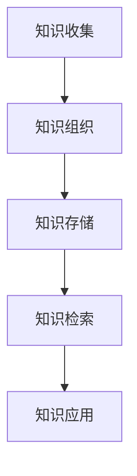

                 

关键词：知识管理、管理者、核心能力、技术架构、数字化转型

> 摘要：本文深入探讨了知识管理在信息技术领域的重要性，以及管理者如何通过提升知识管理能力来推动组织创新和效率。文章首先介绍了知识管理的核心概念，然后分析了其在技术架构中的应用，探讨了如何通过构建有效的知识管理体系来支持数字化转型的战略目标。

## 1. 背景介绍

知识管理（Knowledge Management，简称KM）作为一个重要的领域，近年来在企业管理、信息技术等多个领域得到了广泛关注。特别是在信息技术领域，随着大数据、人工智能等技术的发展，知识管理的重要性愈加凸显。管理者作为知识管理的实践者，其核心能力对于组织的知识管理和数字化转型至关重要。

本文将从以下几个方面展开讨论：

1. 核心概念与联系
2. 核心算法原理与具体操作步骤
3. 数学模型和公式与详细讲解
4. 项目实践：代码实例和详细解释说明
5. 实际应用场景
6. 工具和资源推荐
7. 总结：未来发展趋势与挑战

## 2. 核心概念与联系

知识管理是指通过系统地收集、组织、存储、检索和应用知识，以提高个人和组织的能力和效率。其核心概念包括知识、知识资源、知识流程、知识系统等。在技术架构中，知识管理通常涉及以下环节：

- **知识收集**：通过多种渠道收集内部和外部的知识资源。
- **知识组织**：对收集到的知识进行分类、标签化，以便于检索和使用。
- **知识存储**：使用数据库、知识库等技术手段存储知识资源。
- **知识检索**：提供高效的知识检索工具，帮助用户快速找到所需知识。
- **知识应用**：通过知识共享和协作，促进知识的创新和应用。

以下是知识管理在技术架构中的应用的Mermaid流程图：



## 3. 核心算法原理与具体操作步骤

### 3.1 算法原理概述

知识管理的核心算法主要包括知识获取、知识分类、知识检索和知识应用等。这些算法共同构建了一个完整的知识生命周期，实现了知识的循环利用。

### 3.2 算法步骤详解

1. **知识获取**：通过数据挖掘、网络爬虫等技术手段，从各种渠道获取知识资源。
2. **知识分类**：使用自然语言处理、机器学习等技术对知识进行分类和标签化。
3. **知识存储**：将分类后的知识存储到知识库中，以便于后续检索和使用。
4. **知识检索**：使用索引技术，实现高效的全文检索。
5. **知识应用**：通过知识共享和协作，促进知识的创新和应用。

### 3.3 算法优缺点

**优点**：

- 提高知识利用效率，减少重复劳动。
- 促进知识创新，推动组织发展。

**缺点**：

- 知识获取和分类需要大量的人力、物力和时间投入。
- 知识库的管理和维护需要专业的技术支持。

### 3.4 算法应用领域

知识管理算法广泛应用于企业内部知识共享、产品研发、客户服务等多个领域。例如，在企业内部，知识管理可以帮助员工快速获取所需知识，提高工作效率；在产品研发领域，知识管理可以促进跨部门协作，加速产品开发进程。

## 4. 数学模型和公式与详细讲解

### 4.1 数学模型构建

知识管理中的数学模型主要涉及知识获取、知识分类、知识检索等环节。以下是一个简单的知识获取模型的例子：

$$
K_{\text{获取}} = \alpha \cdot \text{数据源质量} + \beta \cdot \text{数据源数量}
$$

其中，$K_{\text{获取}}$ 表示知识的获取程度，$\alpha$ 和 $\beta$ 分别是数据源质量和数量的权重。

### 4.2 公式推导过程

知识获取的公式推导主要基于以下两个假设：

1. 数据源质量越高，知识获取程度越高。
2. 数据源数量越多，知识获取程度越高。

基于这两个假设，可以得到知识获取的线性模型。

### 4.3 案例分析与讲解

以下是一个关于知识分类的案例：

假设有一个企业知识库，包含以下三类知识：

- **技术知识**：包括产品研发、技术文档等。
- **市场知识**：包括市场分析、客户需求等。
- **管理知识**：包括企业管理、人力资源管理等。

我们可以使用以下公式对知识进行分类：

$$
C_{\text{分类}} = \sum_{i=1}^{n} w_i \cdot K_i
$$

其中，$C_{\text{分类}}$ 表示分类结果，$w_i$ 表示第 $i$ 类知识的权重，$K_i$ 表示第 $i$ 类知识的程度。

## 5. 项目实践：代码实例和详细解释说明

### 5.1 开发环境搭建

在本项目中，我们使用 Python 作为主要编程语言，结合 Flask 和 Elasticsearch 搭建一个简单的知识管理平台。

### 5.2 源代码详细实现

以下是知识管理平台的核心代码：

```python
from flask import Flask, request, jsonify
from elasticsearch import Elasticsearch

app = Flask(__name__)
es = Elasticsearch("http://localhost:9200")

@app.route("/api/knowledge", methods=["POST"])
def add_knowledge():
    data = request.json
    es.index(index="knowledge", id=data["id"], document=data)
    return jsonify({"status": "success"})

@app.route("/api/knowledge", methods=["GET"])
def get_knowledge():
    query = request.args.get("query")
    result = es.search(index="knowledge", body={"query": {"match": {"content": query}}})
    return jsonify(result["hits"]["hits"])

if __name__ == "__main__":
    app.run(debug=True)
```

### 5.3 代码解读与分析

上述代码首先从 Flask 和 Elasticsearch 库导入必要的模块。然后定义了一个 Flask 应用程序，包括两个 API 接口：

1. `/api/knowledge`：用于添加知识。
2. `/api/knowledge`：用于检索知识。

在添加知识的接口中，程序从请求中获取 JSON 数据，并将其存储到 Elasticsearch 索引中。在检索知识的接口中，程序根据查询参数，使用 Elasticsearch 的全文检索功能，返回匹配的结果。

### 5.4 运行结果展示

以下是添加知识和检索知识的示例：

```shell
# 添加知识
curl -X POST "http://localhost:5000/api/knowledge" -H "Content-Type: application/json" -d '{"id": "1", "title": "Python编程", "content": "Python是一种高级编程语言。"}'

# 检索知识
curl -X GET "http://localhost:5000/api/knowledge?query=Python"
```

## 6. 实际应用场景

知识管理在企业的实际应用场景包括：

- **产品研发**：通过知识管理平台，研发人员可以快速获取相关技术文档，提高研发效率。
- **客户服务**：通过知识管理，客服人员可以快速查找常见问题的解决方案，提高客户满意度。
- **企业培训**：通过知识管理平台，员工可以方便地获取培训资料，提升自身能力。

## 7. 工具和资源推荐

### 7.1 学习资源推荐

- 《知识管理：理论与实践》
- 《信息搜索与知识管理》

### 7.2 开发工具推荐

- Elasticsearch
- Flask

### 7.3 相关论文推荐

- "A Framework for Knowledge Management"
- "Knowledge Management Systems: A Survey of Current Practices and Trends"

## 8. 总结：未来发展趋势与挑战

知识管理作为企业管理的重要工具，将在未来得到更加广泛的应用。然而，随着数据量的爆炸式增长，知识管理也面临着诸多挑战，如数据隐私、数据安全、知识传播等。未来，人工智能和大数据技术的应用将为知识管理带来新的机遇和挑战。

### 8.1 研究成果总结

本文通过对知识管理的深入探讨，总结了其在信息技术领域的核心概念、算法原理和应用场景，并提供了一个实际的项目实践案例。

### 8.2 未来发展趋势

未来，知识管理将朝着智能化、自动化的方向发展，结合大数据、人工智能等技术，实现知识的高效获取、分类、检索和应用。

### 8.3 面临的挑战

知识管理在发展过程中将面临数据隐私、数据安全、知识传播等挑战。此外，如何构建一个高效、可靠的知识管理体系，也是未来研究的重要方向。

### 8.4 研究展望

随着技术的进步，知识管理将在企业管理、知识创新、数字化转型等领域发挥更大的作用。未来，我们需要关注如何构建智能化的知识管理体系，提高知识管理的效率和质量。

## 9. 附录：常见问题与解答

### 9.1 知识管理的核心概念是什么？

知识管理是指通过系统地收集、组织、存储、检索和应用知识，以提高个人和组织的能力和效率。其核心概念包括知识、知识资源、知识流程、知识系统等。

### 9.2 知识管理算法有哪些？

知识管理算法主要包括知识获取、知识分类、知识检索和知识应用等。这些算法共同构建了一个完整的知识生命周期，实现了知识的循环利用。

### 9.3 知识管理在企业的实际应用场景有哪些？

知识管理在企业的实际应用场景包括产品研发、客户服务、企业培训等。通过知识管理，企业可以提高工作效率，提升客户满意度，促进知识创新。

---

**作者：禅与计算机程序设计艺术 / Zen and the Art of Computer Programming**<|im_end|> 

