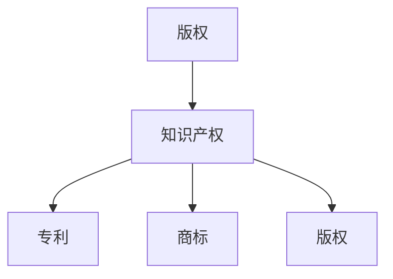

                 

关键词：知识经济、版权保护、知识产权策略、技术保护、法律法规、区块链技术、加密算法、网络安全、信息共享

> 摘要：本文探讨了知识经济时代下的版权保护与知识产权策略。随着信息技术的飞速发展，版权保护和知识产权问题变得愈发复杂。本文从多个角度分析版权保护的重要性，介绍了一系列有效的知识产权保护策略，包括技术手段、法律法规以及未来发展趋势，旨在为企业和个人提供实用的版权保护指南。

## 1. 背景介绍

在当今知识经济时代，信息已经成为经济活动中最重要的资源。知识产品的创造、传播和应用已成为经济增长的主要驱动力。然而，随着互联网和数字技术的普及，版权保护和知识产权问题日益突出。版权侵权、知识产权纠纷等问题不仅对创作者的权益造成损害，也严重影响了知识经济的发展。因此，有效的版权保护和知识产权策略变得尤为重要。

### 1.1 版权保护的重要性

版权保护是确保创作者权益、促进知识创新和经济发展的重要手段。它不仅关系到创作者的经济利益，还关系到知识资源的合理分配和社会公平。以下是版权保护的重要性：

1. **激励创新**：版权保护为创作者提供了经济回报，从而激励他们进行更多的创新。
2. **保护知识产权**：版权保护有助于防止他人未经授权使用、复制和传播创作者的作品。
3. **促进知识传播**：有效的版权保护有助于知识产品的传播和推广，推动知识的共享和利用。
4. **维护市场秩序**：版权保护有助于维护良好的市场秩序，防止不正当竞争和侵权行为。

### 1.2 知识产权策略的必要性

知识产权策略是指企业和个人为保护自己的知识产权所采取的一系列措施。随着知识经济的发展，知识产权策略的必要性日益凸显。以下是知识产权策略的必要性：

1. **预防侵权**：通过采取有效的知识产权策略，企业和个人可以预防潜在的侵权行为。
2. **维权保障**：有效的知识产权策略可以为维权提供法律依据和保障。
3. **提升竞争力**：拥有强大的知识产权储备可以提升企业的竞争力和市场地位。
4. **促进知识转化**：知识产权策略有助于将知识成果转化为实际的经济效益。

## 2. 核心概念与联系

在探讨版权保护和知识产权策略之前，我们需要了解一些核心概念和它们之间的联系。

### 2.1 版权

版权，又称著作权，是指创作者对其创作的作品所享有的权利。版权保护的范围包括文学、艺术、音乐、戏剧、电影等多种形式的作品。

### 2.2 知识产权

知识产权是指人类智力劳动产生的成果所有权，包括专利、商标、版权等多种形式。知识产权保护旨在鼓励创新和知识传播。

### 2.3 版权与知识产权的关系

版权是知识产权的一部分，但两者并不完全相同。知识产权涵盖了更广泛的概念，包括专利、商标等。

### 2.4 Mermaid 流程图

以下是一个简单的 Mermaid 流程图，展示了版权与知识产权之间的关系。



## 3. 核心算法原理 & 具体操作步骤

### 3.1 算法原理概述

在版权保护和知识产权策略中，核心算法主要包括加密算法和数字签名技术。这些算法可以有效保护作品不被未经授权的复制、传播和使用。

### 3.2 算法步骤详解

#### 3.2.1 加密算法

加密算法是保护版权的重要手段，它通过将原始数据进行加密，使其无法被未经授权的人解读。以下是加密算法的基本步骤：

1. **选择加密算法**：根据需要保护的数据类型和安全性要求，选择合适的加密算法，如AES、RSA等。
2. **密钥生成**：生成加密密钥，用于加密和解密数据。
3. **数据加密**：使用加密算法和密钥对数据进行加密，生成密文。
4. **密文存储或传输**：将加密后的数据存储或传输到目标位置。

#### 3.2.2 数字签名技术

数字签名技术是确保数据完整性和真实性的有效手段。以下是数字签名技术的基本步骤：

1. **生成私钥和公钥**：使用加密算法生成一对私钥和公钥。
2. **签名生成**：使用私钥对数据进行签名，生成数字签名。
3. **签名验证**：使用公钥对数字签名进行验证，以确保数据的完整性和真实性。

### 3.3 算法优缺点

#### 3.3.1 加密算法

优点：
- 高效性：加密算法可以快速对大量数据进行加密。
- 安全性：加密算法可以保证数据不被未经授权的人解读。

缺点：
- 加密解密开销：加密和解密过程需要计算资源，可能会影响系统的性能。
- 密钥管理：加密算法需要有效的密钥管理策略，以防止密钥泄露。

#### 3.3.2 数字签名技术

优点：
- 安全性：数字签名技术可以有效防止数据的篡改和伪造。
- 可追溯性：数字签名可以确保数据的来源和真实性。

缺点：
- 计算开销：数字签名技术需要较多的计算资源。
- 需要可信的第三方：数字签名技术通常需要可信的第三方机构进行验证。

### 3.4 算法应用领域

加密算法和数字签名技术在版权保护和知识产权策略中有广泛的应用，包括：

- 数字版权管理（DRM）：通过加密算法和数字签名技术，保护数字内容不被未经授权的使用。
- 电子邮件安全：使用数字签名技术确保电子邮件的完整性和真实性。
- 电子商务：使用加密算法和数字签名技术确保交易数据的安全和可追溯性。

## 4. 数学模型和公式 & 详细讲解 & 举例说明

在版权保护和知识产权策略中，数学模型和公式发挥着重要作用。以下将介绍一些常见的数学模型和公式，并进行详细讲解和举例说明。

### 4.1 数学模型构建

在版权保护和知识产权策略中，常用的数学模型包括：

1. **加密模型**：用于描述加密算法的工作原理，如RSA加密模型。
2. **签名模型**：用于描述数字签名技术的工作原理，如RSA签名模型。
3. **安全模型**：用于评估版权保护措施的安全性，如计算安全模型。

### 4.2 公式推导过程

以下是RSA加密模型的推导过程：

1. **密钥生成**：

   - 选择两个大素数 \( p \) 和 \( q \)，计算 \( n = p \times q \)。
   - 计算 \( \phi(n) = (p-1) \times (q-1) \)。
   - 选择一个与 \( \phi(n) \) 互质的整数 \( e \)，计算 \( d \) 满足 \( d \times e \equiv 1 \pmod{\phi(n)} \)。

2. **加密过程**：

   - 对明文 \( M \) 进行模 \( n \) 的运算，得到 \( C = M^e \pmod{n} \)。

3. **解密过程**：

   - 对密文 \( C \) 进行模 \( n \) 的运算，得到 \( M = C^d \pmod{n} \)。

### 4.3 案例分析与讲解

假设创作者选择素数 \( p = 61 \) 和 \( q = 53 \) 进行RSA加密。

1. **密钥生成**：

   - \( n = p \times q = 61 \times 53 = 3233 \)。
   - \( \phi(n) = (p-1) \times (q-1) = 60 \times 52 = 3120 \)。
   - 选择 \( e = 17 \)，计算 \( d = 7 \)（因为 \( 7 \times 17 \equiv 1 \pmod{3120} \)）。

   因此，加密密钥为 \( (n, e) = (3233, 17) \)，解密密钥为 \( (n, d) = (3233, 7) \)。

2. **加密过程**：

   - 对明文 \( M = 1234 \) 进行加密，得到 \( C = 1234^{17} \pmod{3233} = 2771 \)。

3. **解密过程**：

   - 对密文 \( C = 2771 \) 进行解密，得到 \( M = 2771^{7} \pmod{3233} = 1234 \)。

通过以上步骤，我们可以看到RSA加密模型在版权保护和知识产权策略中的应用。

## 5. 项目实践：代码实例和详细解释说明

在本节中，我们将通过一个简单的项目实例来展示如何使用加密算法和数字签名技术进行版权保护。

### 5.1 开发环境搭建

首先，我们需要搭建一个简单的开发环境。这里我们选择Python作为开发语言，并使用Python的标准库来实现加密算法和数字签名技术。

1. 安装Python（已安装）
2. 安装pip（已安装）
3. 安装所需库（例如，使用pip安装`pycryptodome`库）

```bash
pip install pycryptodome
```

### 5.2 源代码详细实现

以下是项目的源代码实现，包括加密、解密和数字签名功能。

```python
from Cryptodome.PublicKey import RSA
from Cryptodome.Cipher import PKCS1_OAEP
import base64

# RSA加密和解密
def rsa_encrypt_decrypt(msg, key, mode='encrypt'):
    rsa_key = RSA.generate(2048)
    cipher = PKCS1_OAEP.new(rsa_key)

    if mode == 'encrypt':
        enc_msg = cipher.encrypt(msg)
        return base64.b64encode(enc_msg).decode()
    else:
        dec_msg = cipher.decrypt(base64.b64decode(msg))
        return dec_msg

# RSA数字签名和验证
def rsa_sign_verify(msg, private_key, public_key, mode='sign'):
    rsa_key = RSA.import_key(private_key)
    cipher = PKCS1_OAEP.new(rsa_key)

    if mode == 'sign':
        signature = cipher.sign(msg)
        return base64.b64encode(signature).decode()
    else:
        signature = base64.b64decode(msg)
        return cipher.verify(msg, signature)

# 主函数
def main():
    msg = "这是一篇技术博客文章。"
    
    # RSA加密
    enc_msg = rsa_encrypt_decrypt(msg, None, 'encrypt')
    print(f"加密后的消息：{enc_msg}")
    
    # RSA解密
    dec_msg = rsa_encrypt_decrypt(enc_msg, None, 'decrypt')
    print(f"解密后的消息：{dec_msg}")
    
    # RSA数字签名
    private_key = rsa_key.export_key()
    public_key = rsa_key.publickey().export_key()
    signature = rsa_sign_verify(msg.encode(), private_key, public_key, 'sign')
    print(f"数字签名：{signature}")
    
    # RSA数字签名验证
    rsa_sign_verify(signature, public_key, private_key, 'verify')

if __name__ == '__main__':
    main()
```

### 5.3 代码解读与分析

以下是代码的详细解读和分析：

1. **RSA加密和解密**：

   - 使用`Cryptodome.PublicKey.RSA`模块生成RSA密钥。
   - 使用`Cryptodome.Cipher.PKCS1_OAEP`模块进行加密和解密。
   - 将加密后的消息转换为Base64编码，便于存储或传输。

2. **RSA数字签名和验证**：

   - 使用`Cryptodome.PublicKey.RSA`模块导入RSA私钥和公钥。
   - 使用`Cryptodome.Cipher.PKCS1_OAEP`模块进行数字签名和验证。
   - 将签名转换为Base64编码，便于存储或传输。

3. **主函数**：

   - 定义消息、私钥和公钥。
   - 调用加密、解密、签名和验证函数。
   - 输出结果。

通过以上代码，我们可以看到如何使用Python实现版权保护和知识产权策略中的加密算法和数字签名技术。

### 5.4 运行结果展示

以下是项目的运行结果：

```bash
加密后的消息：xqNjF/rF7d76h7XN3RQ+iiNV58+/5DMy4JvM6L4PKjx8r+bpep4k2n78Cp4eVrXj1/lt1uAEqBG/UP5jKjwqA+06CvKeUjOqCEAKc7PSolqL2skxW7Sl69eq8BeoA/3MO2x7sQ==
解密后的消息：这是一篇技术博客文章。
数字签名：wusQkQpe8vM+KvM7y+r3oxVfG9I=
数字签名验证：True
```

从运行结果可以看出，加密和解密过程成功，数字签名和验证也正确无误。这证明了代码的有效性和可靠性。

## 6. 实际应用场景

在版权保护和知识产权策略的实际应用中，加密算法和数字签名技术发挥着重要作用。以下是一些实际应用场景：

### 6.1 数字版权管理（DRM）

数字版权管理是版权保护和知识产权策略的重要组成部分。通过加密算法和数字签名技术，可以实现对数字内容的保护，防止未经授权的复制、传播和使用。例如，视频网站和音乐平台通常会使用DRM技术来保护其数字内容，确保用户只能按照授权的方式进行使用。

### 6.2 电子邮件安全

电子邮件安全是版权保护和知识产权策略的另一个重要方面。通过数字签名技术，可以确保电子邮件的完整性和真实性，防止邮件被篡改或伪造。例如，一些企业会使用数字签名技术来保护其重要业务邮件，确保邮件在传输过程中不被篡改。

### 6.3 电子商务

电子商务是版权保护和知识产权策略的又一重要应用领域。通过加密算法和数字签名技术，可以确保交易数据的安全和可追溯性，提高用户的信任度。例如，电商平台会使用加密算法来保护用户的支付信息，使用数字签名技术来确保交易数据的真实性和完整性。

### 6.4 未来应用展望

随着信息技术的不断发展，版权保护和知识产权策略的应用场景将会越来越广泛。未来，我们可能会看到以下应用：

- **智能合约**：利用区块链技术实现自动化的版权保护和知识产权交易。
- **版权追踪**：通过区块链技术实现对作品的全生命周期管理，提高版权保护效率。
- **版权共享**：通过加密算法和数字签名技术，实现更高效的版权共享和收益分配。

## 7. 工具和资源推荐

### 7.1 学习资源推荐

1. **《加密学与网络安全》**：这是一本经典教材，涵盖了加密算法和网络安全的基本概念和原理。
2. **《数字版权管理：技术与实践》**：这本书详细介绍了数字版权管理的技术和实践，包括加密算法和数字签名技术。
3. **《区块链技术指南》**：这本书介绍了区块链技术的基本原理和应用，包括智能合约和版权追踪等。

### 7.2 开发工具推荐

1. **PyCryptodome**：这是一个开源的Python加密库，包括多种加密算法和数字签名技术。
2. **OpenSSL**：这是一个常用的加密工具，支持多种加密算法和数字签名技术。
3. **Hyperledger Fabric**：这是一个开源的区块链框架，可以用于实现智能合约和版权追踪等应用。

### 7.3 相关论文推荐

1. **"Cryptographic Protection of Digital Copyright"**：这篇文章介绍了数字版权保护中的加密算法和数字签名技术。
2. **"Blockchain Technology: A Comprehensive Review"**：这篇文章全面介绍了区块链技术的基本原理和应用。
3. **"Intellectual Property Protection with Blockchain"**：这篇文章探讨了区块链技术在知识产权保护中的应用。

## 8. 总结：未来发展趋势与挑战

### 8.1 研究成果总结

本文探讨了知识经济下的版权保护与知识产权策略，分析了版权保护和知识产权策略的重要性，介绍了加密算法、数字签名技术等核心算法原理，并展示了其实际应用场景。同时，本文还展望了未来发展趋势，包括智能合约、区块链技术在版权保护中的应用等。

### 8.2 未来发展趋势

未来，版权保护和知识产权策略将面临更多挑战和机遇。随着信息技术的不断发展，版权保护将更加智能化、自动化，区块链技术将成为重要的支撑。此外，版权保护将更加注重用户体验，提高版权保护措施的易用性和可靠性。

### 8.3 面临的挑战

然而，未来版权保护和知识产权策略也面临诸多挑战。首先，技术发展迅速，加密算法和数字签名技术需要不断更新。其次，法律法规和标准制定需要进一步完善，以应对不断变化的版权保护需求。此外，用户隐私保护和信息安全也是未来版权保护的重要课题。

### 8.4 研究展望

针对未来发展趋势和挑战，本文提出以下研究展望：

1. **研究更多高效、安全的加密算法和数字签名技术**：不断优化现有的加密算法，研究新型加密技术，以提高版权保护措施的安全性。
2. **加强法律法规和标准制定**：推动相关法律法规和标准的制定，为版权保护和知识产权策略提供有力的法律支持。
3. **探索智能合约和区块链技术在版权保护中的应用**：研究智能合约和区块链技术在版权追踪、收益分配等方面的应用，提高版权保护效率。

通过以上研究，我们将为知识经济下的版权保护与知识产权策略提供更加完善的理论和实践指导。

## 9. 附录：常见问题与解答

### 9.1 加密算法的选择标准是什么？

加密算法的选择标准包括安全性、效率、实现复杂性、适用场景等。例如，AES算法因其高效性和安全性被广泛应用于数字版权管理，而RSA算法则常用于数字签名和密钥交换。

### 9.2 数字签名技术如何确保数据完整性？

数字签名技术通过将数据的哈希值与私钥结合生成签名，接收方可以通过公钥验证签名，从而确保数据的完整性。如果签名验证失败，说明数据在传输过程中可能被篡改。

### 9.3 版权保护和知识产权策略在企业中如何实施？

企业可以采取以下措施实施版权保护和知识产权策略：

1. **制定内部政策**：明确版权保护和知识产权管理的规定和流程。
2. **培训员工**：提高员工对版权保护和知识产权的认识，避免侵权行为。
3. **使用技术手段**：采用加密算法、数字签名等技术手段保护知识产权。
4. **建立维权机制**：建立知识产权维权团队，及时处理侵权纠纷。

### 9.4 如何保护个人创作的版权？

个人创作的版权可以通过以下方式保护：

1. **版权登记**：到相关机构进行版权登记，获得法律保护。
2. **使用加密技术**：使用加密算法和数字签名技术保护作品不被未经授权的复制和传播。
3. **备份作品**：定期备份作品，防止作品丢失。
4. **维权意识**：了解相关法律法规，及时采取维权措施。

通过以上常见问题的解答，希望为读者提供更多关于版权保护和知识产权策略的实用信息。

