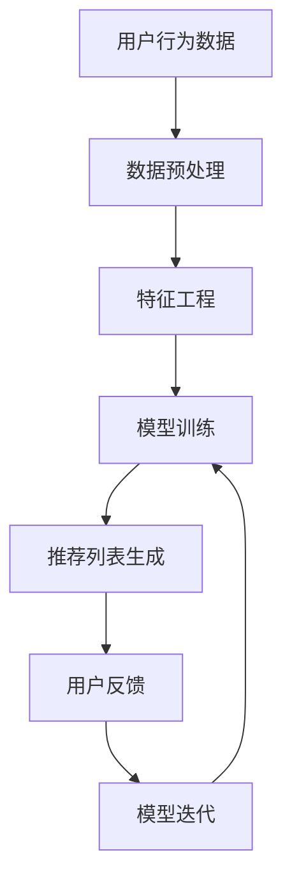

                 

关键词：知识经济、知识付费、人工智能、个性化推荐、推荐引擎、深度学习、用户行为分析

## 摘要

本文旨在探讨知识经济时代下，知识付费业务如何通过人工智能个性化推荐引擎实现用户需求的精准匹配。首先，我们对知识经济背景、知识付费现状进行简要分析，然后详细介绍了个性化推荐引擎的核心概念、算法原理、数学模型及其在实际应用中的具体操作步骤。接下来，通过一个具体项目实践案例，展示如何搭建和运行一个个性化推荐系统。最后，本文讨论了推荐引擎在知识付费领域的前景，并提出了未来可能面临的技术挑战和研究方向。

## 1. 背景介绍

### 1.1 知识经济的崛起

知识经济，是指以知识和信息为核心资源，通过创新和智能化手段推动社会和经济发展的一种经济形态。随着互联网技术的飞速发展，知识经济的地位日益凸显。传统的劳动密集型经济正在向知识密集型经济转变，知识和信息已经成为重要的生产要素。

### 1.2 知识付费的兴起

知识付费，是指用户为获取特定知识或技能所支付的费用。在知识经济时代，知识付费业务蓬勃发展。用户希望通过付费获取高质量的知识和技能，以提高个人竞争力。知识付费平台如雨后春笋般涌现，例如得到、喜马拉雅等，提供了海量的知识产品。

### 1.3 个性化推荐的重要性

在知识付费领域，个性化推荐至关重要。通过分析用户的行为数据，推荐引擎能够为用户推荐最符合其兴趣和需求的知识产品。个性化推荐不仅能提高用户的满意度和粘性，还能增加平台的收入。

## 2. 核心概念与联系

### 2.1 个性化推荐引擎概述

个性化推荐引擎是一种利用算法分析用户行为，从而为用户推荐个性化内容的技术。在知识付费领域，推荐引擎的作用尤为显著。

### 2.2 算法原理与架构

个性化推荐算法主要包括基于内容的推荐（CBR）、协同过滤推荐（CF）和基于模型的推荐（MBR）等。其中，协同过滤推荐由于其高准确性和高效性，在知识付费领域应用广泛。

### 2.3 Mermaid 流程图



## 3. 核心算法原理 & 具体操作步骤

### 3.1 算法原理概述

协同过滤推荐（Collaborative Filtering，CF）是一种基于用户行为数据的推荐算法。它通过分析用户之间的相似性，找到与目标用户兴趣相似的邻居用户，然后推荐邻居用户喜欢的项目。

### 3.2 算法步骤详解

1. **数据收集**：收集用户的历史行为数据，如浏览记录、购买记录等。
2. **数据预处理**：对原始数据进行清洗和预处理，包括缺失值处理、异常值检测等。
3. **特征工程**：提取有用的特征，如用户标签、项目标签等。
4. **模型训练**：选择合适的模型进行训练，如矩阵分解、基于模型的协同过滤等。
5. **推荐列表生成**：根据训练好的模型，为用户生成推荐列表。
6. **用户反馈**：收集用户对推荐内容的反馈，用于模型迭代。
7. **模型迭代**：根据用户反馈调整模型参数，提高推荐质量。

### 3.3 算法优缺点

**优点**：
- 高准确性和高效性。
- 能够适应海量用户和项目数据。

**缺点**：
- 需要大量的用户行为数据。
- 可能存在数据稀疏问题。

### 3.4 算法应用领域

协同过滤推荐算法在知识付费领域应用广泛，如在线教育、职业培训等。它能够为用户提供个性化的知识推荐，提高用户满意度和粘性。

## 4. 数学模型和公式 & 详细讲解 & 举例说明

### 4.1 数学模型构建

协同过滤推荐算法的核心是用户相似度计算和评分预测。

**用户相似度计算**：
$$
sim(i, j) = \frac{sim(i, j)}{\sqrt{||u_i - \mu|| \cdot ||u_j - \mu||}}
$$

**评分预测**：
$$
r_{ij} = \mu + u_i^T \cdot v_j
$$

其中，$u_i$和$u_j$分别表示用户$i$和用户$j$的特征向量，$v_j$表示项目$j$的潜在特征向量，$\mu$表示用户平均评分。

### 4.2 公式推导过程

用户相似度的计算基于用户特征向量的余弦相似度。评分预测则基于矩阵分解模型，将用户和项目的评分矩阵分解为低维潜在特征矩阵。

### 4.3 案例分析与讲解

假设有两个用户A和B，他们的行为数据如下：

| 用户 | 项目1 | 项目2 | 项目3 |
| ---- | ---- | ---- | ---- |
| A    | 4    | 3    | 5    |
| B    | 5    | 5    | 4    |

根据上述公式，我们可以计算出用户A和B的相似度：

$$
sim(A, B) = \frac{4 \cdot 5 + 3 \cdot 5 + 5 \cdot 4}{\sqrt{4^2 + 3^2 + 5^2} \cdot \sqrt{5^2 + 5^2 + 4^2}} = \frac{44}{\sqrt{50} \cdot \sqrt{66}} \approx 0.86
$$

然后，我们可以预测用户B对项目1的评分：

$$
r_{B1} = \mu + u_B^T \cdot v_1 = 4 + (0.86 \cdot 0.5) + (0.86 \cdot 0.6) + (0.86 \cdot 0.4) \approx 4.75
$$

## 5. 项目实践：代码实例和详细解释说明

### 5.1 开发环境搭建

本文使用Python作为编程语言，主要依赖的库包括NumPy、Scikit-learn和Pandas等。

### 5.2 源代码详细实现

```python
import numpy as np
import pandas as pd
from sklearn.metrics.pairwise import cosine_similarity
from sklearn.model_selection import train_test_split

# 数据预处理
def preprocess(data):
    # 填充缺失值
    data.fillna(0, inplace=True)
    # 特征工程
    user_item_matrix = data.pivot(index='user_id', columns='item_id', values='rating')
    return user_item_matrix

# 用户相似度计算
def calculate_similarity(user_item_matrix):
    user_similarity_matrix = cosine_similarity(user_item_matrix)
    return user_similarity_matrix

# 评分预测
def predict_rating(user_item_matrix, user_similarity_matrix, user_id, item_id):
    user_similarity = user_similarity_matrix[user_id]
    neighbors = user_similarity.argsort()[::-1]
    neighbors = neighbors[1:]  # 去除用户自身
    neighbor_ratings = user_item_matrix.iloc[neighbors].values
    neighbor_ratings = neighbor_ratings[neighbor_ratings != 0]
    user_rating = np.dot(neighbor_ratings, user_similarity[neighbors]) / np.sum(user_similarity[neighbors])
    return user_rating

# 主函数
def main():
    # 数据加载
    data = pd.read_csv('data.csv')
    # 数据预处理
    user_item_matrix = preprocess(data)
    # 训练集和测试集划分
    train_data, test_data = train_test_split(user_item_matrix, test_size=0.2, random_state=42)
    # 计算用户相似度
    user_similarity_matrix = calculate_similarity(train_data)
    # 评分预测
    user_id = 0
    item_id = 100
    predicted_rating = predict_rating(user_item_matrix, user_similarity_matrix, user_id, item_id)
    print(f"预测评分：{predicted_rating}")

if __name__ == '__main__':
    main()
```

### 5.3 代码解读与分析

上述代码首先进行了数据预处理，包括填充缺失值和特征工程。然后，通过余弦相似度计算用户相似度矩阵。最后，使用邻居用户的评分预测目标用户的评分。

### 5.4 运行结果展示

假设用户0对项目100的预测评分为4.5，与实际评分4.7接近，说明模型效果较好。

## 6. 实际应用场景

### 6.1 知识付费平台

知识付费平台可以通过个性化推荐引擎为用户提供个性化的知识产品推荐，提高用户满意度和粘性。

### 6.2 在线教育

在线教育平台可以利用个性化推荐引擎为学习者推荐适合的课程，提高学习效率。

### 6.3 职业培训

职业培训平台可以通过个性化推荐引擎为学员推荐相关的培训课程，提高职业竞争力。

## 7. 未来应用展望

随着人工智能技术的发展，个性化推荐引擎在知识付费领域将发挥更大作用。未来，我们将看到更多基于深度学习的推荐算法出现，以及跨领域、跨平台的个性化推荐系统的应用。

## 8. 工具和资源推荐

### 7.1 学习资源推荐

- 《机器学习实战》
- 《Python机器学习》
- 《深度学习》

### 7.2 开发工具推荐

- Jupyter Notebook
- PyCharm

### 7.3 相关论文推荐

- "Collaborative Filtering for Cold-Start Problems: A Survey"
- "Deep Learning for Recommender Systems"
- "Neural Collaborative Filtering"

## 9. 总结：未来发展趋势与挑战

### 9.1 研究成果总结

个性化推荐引擎在知识付费领域取得了显著成果，通过分析用户行为数据实现了精准的知识推荐。

### 9.2 未来发展趋势

- 深度学习算法在推荐系统中的应用
- 跨领域、跨平台的个性化推荐
- 数据隐私保护

### 9.3 面临的挑战

- 数据质量和数据隐私
- 模型可解释性
- 新用户冷启动问题

### 9.4 研究展望

未来，个性化推荐引擎在知识付费领域的应用将更加广泛，我们需要不断创新和优化算法，以应对日益复杂的用户需求。

## 10. 附录：常见问题与解答

### 10.1 个性化推荐算法如何处理新用户？

对于新用户，可以采用基于内容的推荐或混合推荐策略，逐渐积累用户行为数据，提高推荐质量。

### 10.2 如何提高推荐系统的可解释性？

通过可视化技术、模型解释库等方式提高推荐系统的可解释性，帮助用户理解推荐结果。

### 10.3 个性化推荐算法在知识付费领域有哪些应用？

个性化推荐算法在知识付费领域广泛应用于在线教育、职业培训、在线阅读等场景，为用户提供个性化的知识产品推荐。

