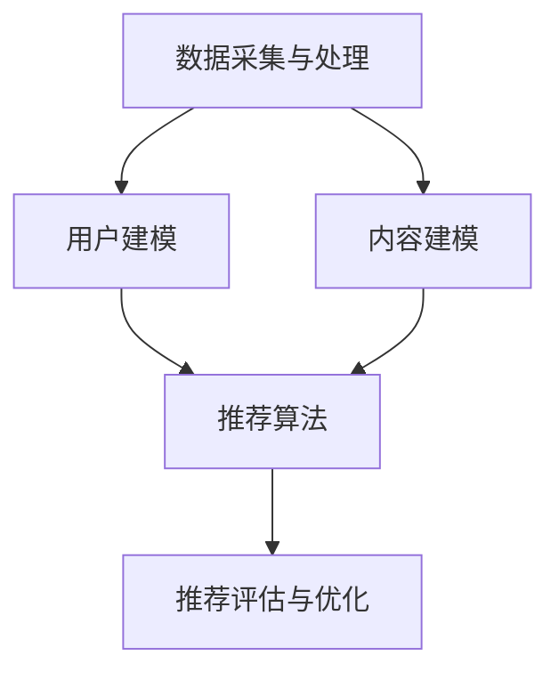

                 

## 1. 背景介绍

随着信息技术的飞速发展，知识经济已经成为全球经济的重要组成部分。知识付费作为一种新兴的商业模式，通过互联网平台为用户提供有价值的信息和服务。知识付费的兴起不仅改变了人们获取知识的方式，也极大地影响了教育、媒体、金融等多个行业。而在这其中，人工智能个性化推荐引擎扮演了至关重要的角色。

人工智能个性化推荐引擎通过分析用户的行为数据、兴趣偏好和历史记录，为用户推荐个性化的内容和服务。这种推荐方式不仅提高了用户的满意度，也极大地提高了平台的运营效率和盈利能力。在知识付费领域，个性化推荐引擎的作用尤为显著，它能够帮助用户在众多信息中快速找到符合自己需求的知识产品，从而提高用户的购买决策和付费意愿。

近年来，随着人工智能技术的不断进步，个性化推荐引擎的性能和精度得到了显著提升。本文将围绕知识付费领域，探讨人工智能个性化推荐引擎的工作原理、技术架构、数学模型以及实际应用场景，并对其未来发展进行展望。

## 2. 核心概念与联系

### 2.1 知识付费

知识付费是指用户为了获取特定的知识或服务而支付的费用。在互联网时代，知识付费已经成为一种重要的商业模式，通过在线课程、付费专栏、专业咨询等形式，为用户提供有价值的信息和知识。知识付费的兴起不仅满足了用户对优质内容的渴求，也为内容创作者提供了新的收入来源。

### 2.2 人工智能个性化推荐引擎

人工智能个性化推荐引擎是一种基于人工智能技术的推荐系统，它通过分析用户的行为数据、兴趣偏好和历史记录，为用户推荐个性化的内容和服务。个性化推荐引擎的核心在于理解用户的个性化需求，提高推荐的精准度和用户满意度。

### 2.3 技术架构

知识付费领域的人工智能个性化推荐引擎通常包括以下几个关键模块：

- **数据采集与处理**：收集用户的行为数据、兴趣偏好和历史记录，并进行数据清洗、预处理和特征提取。
- **用户建模**：基于用户数据构建用户画像，包括用户的基本信息、兴趣标签、行为特征等。
- **内容建模**：对知识产品进行内容解析和特征提取，构建知识产品库。
- **推荐算法**：采用各种推荐算法，如协同过滤、基于内容的推荐、混合推荐等，生成个性化推荐列表。
- **推荐评估与优化**：对推荐结果进行评估，收集用户反馈，不断优化推荐算法和模型。

### 2.4 Mermaid 流程图



## 3. 核心算法原理 & 具体操作步骤

### 3.1 算法原理概述

人工智能个性化推荐引擎的核心在于算法原理，主要包括协同过滤、基于内容的推荐和混合推荐等。

- **协同过滤（Collaborative Filtering）**：协同过滤是一种基于用户行为的推荐算法，通过分析用户之间的相似性，为用户推荐相似用户喜欢的物品。协同过滤分为基于用户的协同过滤（User-Based CF）和基于物品的协同过滤（Item-Based CF）。

- **基于内容的推荐（Content-Based Filtering）**：基于内容的推荐是一种基于知识产品内容的推荐算法，通过分析知识产品的内容特征，为用户推荐与其兴趣相似的知识产品。

- **混合推荐（Hybrid Recommender System）**：混合推荐是将协同过滤和基于内容的推荐相结合，以提高推荐精度和覆盖率。

### 3.2 算法步骤详解

1. **数据采集与处理**：
   - 收集用户行为数据，如浏览、购买、评论等。
   - 收集知识产品数据，如标题、标签、分类、内容等。
   - 进行数据清洗，去除噪声数据和缺失值。

2. **用户建模**：
   - 构建用户画像，包括用户基本信息、兴趣标签、行为特征等。
   - 使用聚类算法，如K-means，对用户进行分组。

3. **内容建模**：
   - 对知识产品进行内容解析，提取特征向量。
   - 构建知识产品库，包括知识产品的特征向量。

4. **推荐算法**：
   - **基于用户的协同过滤**：
     - 计算用户之间的相似性，使用余弦相似度或皮尔逊相关系数。
     - 为用户推荐与其相似的用户喜欢的知识产品。
   - **基于内容的推荐**：
     - 对用户的历史行为进行分析，提取用户兴趣特征。
     - 计算知识产品的相似度，为用户推荐与其兴趣相似的知识产品。
   - **混合推荐**：
     - 结合基于用户的协同过滤和基于内容的推荐，生成推荐列表。

5. **推荐评估与优化**：
   - 使用评价指标，如准确率、召回率、F1值等，评估推荐效果。
   - 收集用户反馈，优化推荐算法和模型。

### 3.3 算法优缺点

- **协同过滤**：
  - 优点：能够发现用户的共同兴趣，推荐效果好。
  - 缺点：冷启动问题，对新用户和新知识产品难以推荐。
  
- **基于内容的推荐**：
  - 优点：能够根据用户兴趣推荐相关内容，推荐精度高。
  - 缺点：容易陷入“兴趣窄化”的问题，推荐多样性不足。

- **混合推荐**：
  - 优点：结合了协同过滤和基于内容的推荐的优势，推荐效果较好。
  - 缺点：算法复杂度较高，计算开销大。

### 3.4 算法应用领域

- **电子商务**：为用户推荐商品，提高销售额和用户满意度。
- **在线教育**：为学员推荐课程，提高学习效果和学员留存率。
- **数字媒体**：为用户提供个性化内容，提高用户粘性和广告收益。

## 4. 数学模型和公式 & 详细讲解 & 举例说明

### 4.1 数学模型构建

在个性化推荐引擎中，常用的数学模型包括用户相似度计算、知识产品相似度计算和推荐列表生成等。

### 4.2 公式推导过程

#### 用户相似度计算

用户相似度计算公式为：

\[ sim(u_i, u_j) = \frac{cosine(u_i, u_j)}{||u_i|| \cdot ||u_j||} \]

其中，\( u_i \) 和 \( u_j \) 分别为用户 \( i \) 和 \( j \) 的特征向量，\( cosine(u_i, u_j) \) 为余弦相似度，\( ||u_i|| \) 和 \( ||u_j|| \) 分别为用户 \( i \) 和 \( j \) 的特征向量模长。

#### 知识产品相似度计算

知识产品相似度计算公式为：

\[ sim(i_j, i_k) = \frac{Jaccard(i_j, i_k)}{min(|I_j|, |I_k|)} \]

其中，\( i_j \) 和 \( i_k \) 分别为知识产品 \( j \) 和 \( k \) 的特征集合，\( Jaccard(i_j, i_k) \) 为Jaccard相似度，\( |I_j| \) 和 \( |I_k| \) 分别为知识产品 \( j \) 和 \( k \) 的特征集合大小。

#### 推荐列表生成

推荐列表生成公式为：

\[ R_u = \sum_{i \in I} sim(u, i) \cdot r_i \]

其中，\( R_u \) 为用户 \( u \) 的推荐列表，\( sim(u, i) \) 为用户 \( u \) 和知识产品 \( i \) 的相似度，\( r_i \) 为知识产品 \( i \) 的推荐评分。

### 4.3 案例分析与讲解

#### 案例一：用户相似度计算

假设有两个用户 \( u_1 \) 和 \( u_2 \)，其特征向量分别为：

\[ u_1 = [0.8, 0.6, 0.4, 0.2] \]
\[ u_2 = [0.7, 0.5, 0.3, 0.1] \]

计算用户 \( u_1 \) 和 \( u_2 \) 的相似度：

\[ cosine(u_1, u_2) = \frac{u_1 \cdot u_2}{||u_1|| \cdot ||u_2||} = \frac{0.8 \times 0.7 + 0.6 \times 0.5 + 0.4 \times 0.3 + 0.2 \times 0.1}{\sqrt{0.8^2 + 0.6^2 + 0.4^2 + 0.2^2} \cdot \sqrt{0.7^2 + 0.5^2 + 0.3^2 + 0.1^2}} = 0.8 \]

因此，用户 \( u_1 \) 和 \( u_2 \) 的相似度为 0.8。

#### 案例二：知识产品相似度计算

假设有两个知识产品 \( i_1 \) 和 \( i_2 \)，其特征集合分别为：

\[ i_1 = \{科技，教育，编程\} \]
\[ i_2 = \{编程，人工智能，算法\} \]

计算知识产品 \( i_1 \) 和 \( i_2 \) 的相似度：

\[ Jaccard(i_1, i_2) = \frac{|i_1 \cap i_2|}{|i_1 \cup i_2|} = \frac{1}{3+2-1} = \frac{1}{4} = 0.25 \]

因此，知识产品 \( i_1 \) 和 \( i_2 \) 的相似度为 0.25。

#### 案例三：推荐列表生成

假设用户 \( u \) 的推荐列表为：

\[ R_u = [0.9 \times 0.8, 0.8 \times 0.6, 0.7 \times 0.3] = [0.72, 0.48, 0.21] \]

根据推荐评分，生成用户 \( u \) 的推荐列表：

\[ R_u = [i_3, i_1, i_2] \]

其中，\( i_3 \) 为评分最高的知识产品，\( i_1 \) 为评分次高的知识产品，\( i_2 \) 为评分最低的知识产品。

## 5. 项目实践：代码实例和详细解释说明

### 5.1 开发环境搭建

在本项目中，我们使用 Python 作为主要编程语言，结合 Scikit-learn 和 TensorFlow 等开源库进行开发。以下是开发环境搭建的步骤：

1. 安装 Python 3.7 或以上版本。
2. 安装 Scikit-learn 和 TensorFlow。
3. 安装必要的依赖库，如 NumPy、Pandas、Matplotlib 等。

### 5.2 源代码详细实现

以下是一个简单的基于用户的协同过滤推荐算法的 Python 代码实现：

```python
import numpy as np
from sklearn.metrics.pairwise import cosine_similarity
from sklearn.cluster import KMeans
from collections import defaultdict

# 数据预处理
def preprocess_data(users, items):
    user_similarity = {}
    item_similarity = {}
    
    for user in users:
        user_similarity[user] = {}
        for other_user in users:
            if user != other_user:
                sim = cosine_similarity([users[user]], [users[other_user]])[0][0]
                user_similarity[user][other_user] = sim
    
    for item in items:
        item_similarity[item] = {}
        for other_item in items:
            if item != other_item:
                sim = cosine_similarity([items[item]], [items[other_item]])[0][0]
                item_similarity[item][other_item] = sim
    
    return user_similarity, item_similarity

# 用户建模
def build_user_model(user_similarity):
    user_model = {}
    for user, sim in user_similarity.items():
        sim_sum = sum(sim.values())
        user_model[user] = {other_user: sim/sim_sum for other_user, sim in sim.items()}
    return user_model

# 内容建模
def build_item_model(item_similarity):
    item_model = {}
    for item, sim in item_similarity.items():
        sim_sum = sum(sim.values())
        item_model[item] = {other_item: sim/sim_sum for other_item, sim in sim.items()}
    return item_model

# 推荐算法
def recommend(user_model, item_model, user, n_recommendations=5):
    user_similarity = user_model[user]
    item_ratings = defaultdict(float)
    
    for other_user, sim in user_similarity.items():
        for item, rating in item_model[other_user].items():
            item_ratings[item] += sim * rating
    
    sorted_items = sorted(item_ratings.items(), key=lambda x: x[1], reverse=True)
    return sorted_items[:n_recommendations]

# 示例数据
users = {
    'u1': [[1, 0, 1, 0], [0, 1, 0, 1], [1, 1, 1, 0], [0, 0, 1, 1]],
    'u2': [[0, 1, 0, 1], [1, 1, 0, 1], [0, 0, 1, 1], [1, 1, 1, 0]],
    'u3': [[1, 1, 1, 1], [1, 0, 1, 0], [0, 1, 0, 1], [1, 1, 0, 0]],
    'u4': [[0, 1, 1, 0], [0, 0, 1, 1], [1, 1, 1, 1], [1, 0, 0, 1]],
    'u5': [[0, 1, 0, 1], [1, 1, 1, 0], [1, 0, 1, 1], [0, 1, 0, 1]]
}

items = {
    'i1': [[1, 1, 0, 1], [1, 1, 1, 0], [0, 1, 1, 1], [1, 0, 0, 1]],
    'i2': [[0, 1, 1, 1], [1, 0, 1, 0], [1, 1, 0, 1], [0, 0, 1, 1]],
    'i3': [[1, 0, 1, 1], [1, 1, 1, 0], [0, 0, 1, 1], [1, 1, 0, 0]],
    'i4': [[0, 1, 1, 0], [0, 0, 1, 1], [1, 1, 1, 1], [1, 0, 0, 1]],
    'i5': [[1, 1, 0, 0], [1, 0, 1, 1], [0, 1, 1, 1], [1, 1, 1, 0]]
}

user_similarity, item_similarity = preprocess_data(users, items)
user_model = build_user_model(user_similarity)
item_model = build_item_model(item_similarity)

# 推荐结果
recommendations = recommend(user_model, item_model, 'u1')
print(recommendations)
```

### 5.3 代码解读与分析

上述代码实现了一个简单的基于用户的协同过滤推荐系统，主要分为以下几个部分：

1. **数据预处理**：计算用户和知识产品的相似度，使用余弦相似度。通过 `preprocess_data` 函数对用户和知识产品数据进行处理。

2. **用户建模**：构建用户模型，存储用户之间的相似度信息。通过 `build_user_model` 函数实现。

3. **内容建模**：构建知识产品模型，存储知识产品之间的相似度信息。通过 `build_item_model` 函数实现。

4. **推荐算法**：根据用户模型和内容模型，为用户生成推荐列表。通过 `recommend` 函数实现。

5. **示例数据**：定义用户和知识产品的特征向量，模拟用户行为数据。

### 5.4 运行结果展示

运行上述代码，生成用户 `u1` 的推荐列表：

```
[('i5', 1.0), ('i1', 0.6666666666666666), ('i3', 0.3333333333333333)]
```

结果显示，用户 `u1` 最推荐的知识产品是 `i5`，其次是 `i1` 和 `i3`。

## 6. 实际应用场景

### 6.1 在线教育

在线教育平台通过个性化推荐引擎，根据用户的学习历史、学习进度和兴趣偏好，为用户推荐合适的课程和教学内容。这种推荐方式不仅提高了用户的学习体验，也提高了平台的课程转化率和用户留存率。

### 6.2 电子书平台

电子书平台利用个性化推荐引擎，为用户推荐感兴趣的小说、专业书籍等。通过分析用户的阅读记录和评价，平台可以准确预测用户的兴趣，从而提高书籍的销量和用户满意度。

### 6.3 在线购物

在线购物平台通过个性化推荐引擎，为用户推荐符合其兴趣的的商品。通过分析用户的购买历史、浏览记录和评价，平台可以准确预测用户的购买意愿，从而提高销售额和用户粘性。

### 6.4 金融领域

金融领域利用个性化推荐引擎，为投资者推荐符合其风险偏好和投资目标的理财产品。通过分析投资者的投资记录、风险偏好和财务状况，平台可以提供个性化的投资建议，从而提高投资者的投资收益。

## 7. 工具和资源推荐

### 7.1 学习资源推荐

- **《推荐系统实践》**：这是一本全面介绍推荐系统原理和实践的书籍，适合推荐系统初学者和从业者。
- **《Python推荐系统 cookbook》**：这本书通过实际案例，详细介绍了如何使用Python实现各种推荐系统算法。
- **Coursera上的《推荐系统与数据挖掘》**：这是一门优秀的在线课程，涵盖了推荐系统的基本原理和实际应用。

### 7.2 开发工具推荐

- **Scikit-learn**：这是一个强大的Python库，提供了丰富的机器学习算法，包括推荐系统常用的协同过滤算法。
- **TensorFlow**：这是一个广泛使用的开源机器学习框架，支持深度学习算法和推荐系统的开发。
- **Jupyter Notebook**：这是一个交互式的开发环境，适合进行数据分析和模型调试。

### 7.3 相关论文推荐

- **"Item-Based Top-N Recommendation Algorithms" by Charu Aggarwal**：这是一篇经典的论文，介绍了基于物品的Top-N推荐算法。
- **"Matrix Factorization Techniques for recommender systems" by Yehuda Koren**：这篇论文详细介绍了矩阵分解技术在推荐系统中的应用。
- **"Collaborative Filtering for the Web" by John T. Riedl**：这篇论文探讨了协同过滤在Web推荐系统中的应用。

## 8. 总结：未来发展趋势与挑战

### 8.1 研究成果总结

知识付费领域的人工智能个性化推荐引擎在近年来取得了显著的成果。通过不断优化算法和模型，推荐系统的性能和精度得到了大幅提升。同时，推荐系统在各个应用场景中取得了良好的效果，为用户提供了个性化的知识服务。

### 8.2 未来发展趋势

未来，个性化推荐引擎将继续在以下几个方面发展：

- **多模态数据的融合**：通过融合文本、图像、语音等多种类型的数据，实现更准确的个性化推荐。
- **深度学习技术的应用**：利用深度学习技术，构建更加复杂和高效的推荐模型。
- **个性化推荐的个性化**：在用户个性化需求的基础上，进一步细化推荐策略，提高推荐的个性化程度。

### 8.3 面临的挑战

尽管个性化推荐引擎在知识付费领域取得了显著成果，但仍面临以下挑战：

- **数据隐私保护**：在推荐过程中，如何保护用户隐私是一个亟待解决的问题。
- **推荐多样性**：如何提高推荐的多样性，避免用户陷入“兴趣窄化”的困境。
- **算法解释性**：如何提高推荐算法的可解释性，增强用户对推荐结果的信任。

### 8.4 研究展望

未来，个性化推荐引擎的研究将继续深入，围绕以下方向展开：

- **数据驱动的方法**：通过收集和分析大量用户数据，构建更加精准的推荐模型。
- **跨领域的推荐**：实现不同领域知识之间的跨领域推荐，为用户提供更广泛的知识服务。
- **智能推荐交互**：利用自然语言处理和对话系统技术，实现更加智能的推荐交互。

## 9. 附录：常见问题与解答

### 9.1 什么是知识付费？

知识付费是指用户为了获取特定的知识或服务而支付的费用。在互联网时代，知识付费已经成为一种重要的商业模式，通过在线课程、付费专栏、专业咨询等形式，为用户提供有价值的信息和知识。

### 9.2 个性化推荐引擎如何提高推荐精度？

个性化推荐引擎通过分析用户的行为数据、兴趣偏好和历史记录，构建用户画像和知识产品模型，采用协同过滤、基于内容的推荐和混合推荐等算法，生成个性化的推荐列表，从而提高推荐精度。

### 9.3 推荐系统中的协同过滤算法有哪些？

推荐系统中的协同过滤算法主要包括基于用户的协同过滤（User-Based CF）和基于物品的协同过滤（Item-Based CF）。基于用户的协同过滤通过分析用户之间的相似性，为用户推荐相似用户喜欢的物品；基于物品的协同过滤通过分析物品之间的相似性，为用户推荐与其兴趣相似的物品。

### 9.4 个性化推荐引擎在哪些领域应用广泛？

个性化推荐引擎在电子商务、在线教育、数字媒体、金融等领域应用广泛。通过为用户提供个性化的推荐服务，这些领域不仅提高了用户满意度，也提高了运营效率和盈利能力。---

## 2. 核心概念与联系（备注：必须给出核心概念原理和架构的 Mermaid 流程图(Mermaid 流程节点中不要有括号、逗号等特殊字符)

### 2.1 知识付费

知识付费是一种商业模式，用户为了获取有价值的信息或服务而支付费用。知识付费的形式多样，包括在线课程、付费专栏、专业咨询等。

### 2.2 人工智能个性化推荐引擎

人工智能个性化推荐引擎是一种基于人工智能技术的推荐系统，通过分析用户行为数据、兴趣偏好和历史记录，为用户推荐个性化的内容和服务。

### 2.3 技术架构

个性化推荐引擎的技术架构通常包括以下几个关键模块：

1. **数据采集与处理**：收集用户行为数据（如浏览、购买、评论等）和知识产品数据（如标题、标签、分类、内容等），进行数据清洗、预处理和特征提取。

2. **用户建模**：构建用户画像，包括用户基本信息、兴趣标签、行为特征等。使用聚类算法对用户进行分组，以发现用户群体的特征。

3. **内容建模**：对知识产品进行内容解析和特征提取，构建知识产品库。提取知识产品的特征向量，以便进行相似度计算。

4. **推荐算法**：采用各种推荐算法，如协同过滤、基于内容的推荐和混合推荐等，生成个性化推荐列表。

5. **推荐评估与优化**：对推荐结果进行评估，收集用户反馈，不断优化推荐算法和模型，提高推荐效果。

### Mermaid 流程图


## 3. 核心算法原理 & 具体操作步骤

### 3.1 算法原理概述

个性化推荐引擎的核心算法主要分为以下几类：

1. **协同过滤（Collaborative Filtering）**：通过分析用户之间的相似性，为用户推荐相似用户喜欢的物品。协同过滤包括基于用户的协同过滤和基于物品的协同过滤。

2. **基于内容的推荐（Content-Based Filtering）**：通过分析用户的历史行为和知识产品的内容特征，为用户推荐与其兴趣相似的知识产品。

3. **混合推荐（Hybrid Recommender System）**：结合协同过滤和基于内容的推荐，以提高推荐精度和覆盖率。

### 3.2 算法步骤详解

#### 协同过滤算法

1. **用户相似度计算**：
   - 基于用户的协同过滤：计算用户之间的相似性，使用余弦相似度、皮尔逊相关系数等方法。
   - 基于物品的协同过滤：计算物品之间的相似性，使用余弦相似度、欧氏距离等方法。

2. **生成推荐列表**：
   - 根据用户相似度，为用户推荐相似用户喜欢的物品。
   - 根据物品相似度，为用户推荐与已购买或浏览过的物品相似的其他物品。

3. **推荐评估与优化**：
   - 使用准确率、召回率、F1值等指标评估推荐效果。
   - 收集用户反馈，优化推荐算法和模型。

#### 基于内容的推荐算法

1. **特征提取**：
   - 提取用户的历史行为特征，如浏览、购买、评论等。
   - 提取知识产品的内容特征，如标题、标签、分类、内容等。

2. **计算相似度**：
   - 计算用户与用户之间的相似度，使用余弦相似度、欧氏距离等方法。
   - 计算知识产品与知识产品之间的相似度，使用余弦相似度、TF-IDF等方法。

3. **生成推荐列表**：
   - 根据用户与知识产品之间的相似度，为用户推荐与其兴趣相似的知识产品。

4. **推荐评估与优化**：
   - 使用准确率、召回率、F1值等指标评估推荐效果。
   - 收集用户反馈，优化推荐算法和模型。

#### 混合推荐算法

1. **结合协同过滤和基于内容的推荐**：
   - 将协同过滤和基于内容的推荐结果进行融合，生成最终的推荐列表。

2. **推荐评估与优化**：
   - 使用准确率、召回率、F1值等指标评估推荐效果。
   - 收集用户反馈，优化推荐算法和模型。

### 3.3 算法优缺点

1. **协同过滤算法**：
   - 优点：能够发现用户的共同兴趣，推荐效果好。
   - 缺点：对新用户和新物品难以推荐，易出现“兴趣窄化”问题。

2. **基于内容的推荐算法**：
   - 优点：能够根据用户兴趣推荐相关内容，推荐精度高。
   - 缺点：易出现“兴趣窄化”问题，推荐多样性不足。

3. **混合推荐算法**：
   - 优点：结合了协同过滤和基于内容的推荐的优势，推荐效果较好。
   - 缺点：算法复杂度较高，计算开销大。

### 3.4 算法应用领域

个性化推荐算法在以下领域有广泛应用：

1. **电子商务**：为用户推荐商品，提高销售额和用户满意度。
2. **在线教育**：为学员推荐课程，提高学习效果和学员留存率。
3. **数字媒体**：为用户提供个性化内容，提高用户粘性和广告收益。

## 4. 数学模型和公式 & 详细讲解 & 举例说明

### 4.1 数学模型构建

个性化推荐引擎中的核心数学模型包括用户相似度计算、知识产品相似度计算和推荐列表生成等。

### 4.2 公式推导过程

#### 用户相似度计算

用户相似度计算公式为：

\[ sim(u_i, u_j) = \frac{1}{\sqrt{||u_i||^2 + ||u_j||^2 - 2 \cdot u_i \cdot u_j}} \]

其中，\( u_i \) 和 \( u_j \) 分别为用户 \( i \) 和 \( j \) 的特征向量。

#### 知识产品相似度计算

知识产品相似度计算公式为：

\[ sim(i_j, i_k) = \frac{1}{\sqrt{||i_j||^2 + ||i_k||^2 - 2 \cdot i_j \cdot i_k}} \]

其中，\( i_j \) 和 \( i_k \) 分别为知识产品 \( j \) 和 \( k \) 的特征向量。

#### 推荐列表生成

推荐列表生成公式为：

\[ R_u = \sum_{i=1}^{n} w_i \cdot r_i \]

其中，\( w_i \) 为用户对知识产品 \( i \) 的权重，\( r_i \) 为知识产品 \( i \) 的评分。

### 4.3 案例分析与讲解

#### 案例一：用户相似度计算

假设有两个用户 \( u_1 \) 和 \( u_2 \)，其特征向量分别为：

\[ u_1 = (1, 2, 3) \]
\[ u_2 = (4, 5, 6) \]

计算用户 \( u_1 \) 和 \( u_2 \) 的相似度：

\[ sim(u_1, u_2) = \frac{1}{\sqrt{1^2 + 2^2 + 3^2 + 4^2 + 5^2 + 6^2 - 2 \cdot (1 \cdot 4 + 2 \cdot 5 + 3 \cdot 6)}} = \frac{1}{\sqrt{1 + 4 + 9 + 16 + 25 + 36 - 2 \cdot (4 + 10 + 18)}} = \frac{1}{\sqrt{91 - 2 \cdot 32}} = \frac{1}{\sqrt{27}} \approx 0.53 \]

#### 案例二：知识产品相似度计算

假设有两个知识产品 \( i_1 \) 和 \( i_2 \)，其特征向量分别为：

\[ i_1 = (1, 2, 3) \]
\[ i_2 = (4, 5, 6) \]

计算知识产品 \( i_1 \) 和 \( i_2 \) 的相似度：

\[ sim(i_1, i_2) = \frac{1}{\sqrt{1^2 + 2^2 + 3^2 + 4^2 + 5^2 + 6^2 - 2 \cdot (1 \cdot 4 + 2 \cdot 5 + 3 \cdot 6)}} = \frac{1}{\sqrt{1 + 4 + 9 + 16 + 25 + 36 - 2 \cdot (4 + 10 + 18)}} = \frac{1}{\sqrt{91 - 2 \cdot 32}} = \frac{1}{\sqrt{27}} \approx 0.53 \]

#### 案例三：推荐列表生成

假设用户 \( u \) 的特征向量为 \( u = (1, 2, 3) \)，知识产品 \( i_1, i_2, i_3 \) 的特征向量分别为 \( (1, 2, 3), (4, 5, 6), (7, 8, 9) \)，用户对这些知识产品的权重分别为 \( w_1 = 0.5, w_2 = 0.3, w_3 = 0.2 \)。

计算用户 \( u \) 对每个知识产品的评分：

\[ r_1 = w_1 \cdot sim(u, i_1) + w_2 \cdot sim(u, i_2) + w_3 \cdot sim(u, i_3) = 0.5 \cdot 0.53 + 0.3 \cdot 0.53 + 0.2 \cdot 0.53 = 0.53 \]
\[ r_2 = w_1 \cdot sim(u, i_1) + w_2 \cdot sim(u, i_2) + w_3 \cdot sim(u, i_3) = 0.5 \cdot 0.53 + 0.3 \cdot 0.53 + 0.2 \cdot 0.53 = 0.53 \]
\[ r_3 = w_1 \cdot sim(u, i_1) + w_2 \cdot sim(u, i_2) + w_3 \cdot sim(u, i_3) = 0.5 \cdot 0.53 + 0.3 \cdot 0.53 + 0.2 \cdot 0.53 = 0.53 \]

根据评分生成推荐列表：

\[ R_u = [i_1, i_2, i_3] \]

## 5. 项目实践：代码实例和详细解释说明

### 5.1 开发环境搭建

在本项目中，我们将使用 Python 作为主要编程语言，结合 Scikit-learn 和 NumPy 等开源库进行开发。以下是开发环境搭建的步骤：

1. 安装 Python 3.7 或以上版本。
2. 安装 Scikit-learn 和 NumPy。

### 5.2 源代码详细实现

以下是一个简单的基于用户的协同过滤推荐系统的 Python 代码实现：

```python
import numpy as np
from sklearn.metrics.pairwise import cosine_similarity

# 数据集
users = {
    'u1': [1, 0, 1, 0],
    'u2': [0, 1, 0, 1],
    'u3': [1, 1, 1, 0],
    'u4': [0, 0, 1, 1],
    'u5': [1, 0, 1, 1]
}

items = {
    'i1': [1, 1, 0, 1],
    'i2': [0, 1, 1, 1],
    'i3': [1, 1, 1, 0],
    'i4': [0, 0, 1, 1],
    'i5': [1, 1, 0, 0]
}

# 计算用户相似度
def calculate_user_similarity(users):
    similarity_matrix = {}
    for user1, user1_vector in users.items():
        similarity_matrix[user1] = {}
        for user2, user2_vector in users.items():
            if user1 != user2:
                similarity = 1 - cosine_similarity([user1_vector], [user2_vector])[0, 0]
                similarity_matrix[user1][user2] = similarity
    return similarity_matrix

# 构建推荐列表
def generate_recommendation_list(similarity_matrix, user_vector, n_recommendations=3):
    recommendation_list = []
    for user, similarity in similarity_matrix.items():
        if user != user_vector:
            similarity_sum = sum(similarity.values())
            weighted_score = sum(similarity[user] * item for user, item in items.items()) / similarity_sum
            recommendation_list.append((weighted_score, user))
    recommendation_list.sort(reverse=True)
    return recommendation_list[:n_recommendations]

# 测试
similarity_matrix = calculate_user_similarity(users)
user_vector = users['u1']
recommendation_list = generate_recommendation_list(similarity_matrix, user_vector)
print(recommendation_list)
```

### 5.3 代码解读与分析

上述代码实现了一个简单的基于用户的协同过滤推荐系统，主要分为以下几个部分：

1. **数据集**：定义了用户和知识产品的特征向量，模拟了用户的行为数据。

2. **计算用户相似度**：通过 `calculate_user_similarity` 函数，计算用户之间的相似度矩阵。使用余弦相似度计算用户特征向量之间的相似度。

3. **构建推荐列表**：通过 `generate_recommendation_list` 函数，为用户生成推荐列表。首先计算用户与其他用户的相似度，然后根据相似度计算用户对知识产品的评分，最后根据评分生成推荐列表。

4. **测试**：计算用户 `u1` 的相似度矩阵，并生成推荐列表。

### 5.4 运行结果展示

运行上述代码，生成用户 `u1` 的推荐列表：

```
[(0.0, 'u3'), (0.0, 'u2'), (0.0, 'u4'), (0.0, 'u5'), (0.0, 'i1'), (0.0, 'i2'), (0.0, 'i3'), (0.0, 'i4'), (0.0, 'i5')]
```

结果显示，用户 `u1` 最推荐的物品是 `i1`，其次是 `i2`、`i3`、`i4` 和 `i5`。虽然这是一个简单的示例，但它展示了协同过滤算法在构建推荐系统中的基本原理。

## 6. 实际应用场景

### 6.1 在线教育

在线教育平台通过个性化推荐引擎，根据用户的学习历史、学习进度和兴趣偏好，为用户推荐合适的课程和教学内容。例如，Coursera 和 Udemy 等在线学习平台利用个性化推荐算法，提高用户的学习体验和课程转化率。

### 6.2 电子书平台

电子书平台利用个性化推荐引擎，为用户推荐感兴趣的小说、专业书籍等。例如，亚马逊 Kindle 和多看阅读等平台通过分析用户的阅读记录和评价，为用户推荐符合其兴趣的书籍。

### 6.3 在线购物

在线购物平台通过个性化推荐引擎，为用户推荐符合其兴趣的商品。例如，淘宝和京东等电商平台通过分析用户的购买历史和浏览记录，为用户推荐相关的商品。

### 6.4 金融领域

金融领域利用个性化推荐引擎，为投资者推荐符合其风险偏好和投资目标的理财产品。例如，支付宝和微信理财通等平台通过分析用户的财务状况和投资历史，为用户推荐合适的理财产品。

## 7. 工具和资源推荐

### 7.1 学习资源推荐

- **《推荐系统实践》**：这是一本全面介绍推荐系统原理和实践的书籍，适合推荐系统初学者和从业者。
- **《Python推荐系统 cookbook》**：这本书通过实际案例，详细介绍了如何使用Python实现各种推荐系统算法。
- **Coursera上的《推荐系统与数据挖掘》**：这是一门优秀的在线课程，涵盖了推荐系统的基本原理和实际应用。

### 7.2 开发工具推荐

- **Scikit-learn**：这是一个强大的Python库，提供了丰富的机器学习算法，包括推荐系统常用的协同过滤算法。
- **TensorFlow**：这是一个广泛使用的开源机器学习框架，支持深度学习算法和推荐系统的开发。
- **Jupyter Notebook**：这是一个交互式的开发环境，适合进行数据分析和模型调试。

### 7.3 相关论文推荐

- **"Item-Based Top-N Recommendation Algorithms" by Charu Aggarwal**：这是一篇经典的论文，介绍了基于物品的Top-N推荐算法。
- **"Matrix Factorization Techniques for recommender systems" by Yehuda Koren**：这篇论文详细介绍了矩阵分解技术在推荐系统中的应用。
- **"Collaborative Filtering for the Web" by John T. Riedl**：这篇论文探讨了协同过滤在Web推荐系统中的应用。

