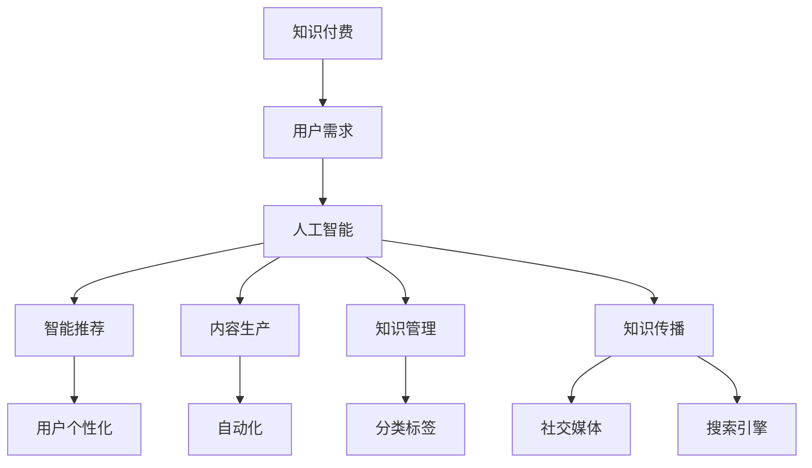

                 

# 知识经济下知识付费的人工智能应用与发展

> “知识付费，是一种新型的经济模式，它让知识的创造者得到了应有的回报，也促进了知识的高效流通。” —— 作者：禅与计算机程序设计艺术 / Zen and the Art of Computer Programming

随着信息技术的飞速发展，人工智能（AI）正在成为驱动知识经济的新引擎。知识付费作为一种新型的经济模式，已经在各个领域崭露头角。本文旨在探讨人工智能在知识付费领域中的应用与发展，分析其核心算法原理、数学模型、实际应用场景以及未来展望。

## 1. 背景介绍

### 1.1 知识经济概述

知识经济是指知识创新、知识传播和知识应用推动经济增长的一种经济形态。它以信息资源为核心，依赖于信息技术的发展，强调知识的创造、传播、利用和转化。知识经济的特点是创新性、信息化、网络化和全球化。

### 1.2 知识付费的定义

知识付费是指知识创造者将知识产品化，通过付费方式让用户获取知识的服务。知识付费不仅为知识创造者提供了经济回报，还激发了知识的创造和创新。

### 1.3 人工智能在知识经济中的作用

人工智能作为知识经济的重要支撑技术，其应用涵盖了知识创造、知识传播、知识管理等多个方面。通过深度学习、自然语言处理等技术，人工智能能够提高知识的获取、处理和利用效率，从而推动知识经济的发展。

## 2. 核心概念与联系

### 2.1 知识付费与人工智能的关系

知识付费与人工智能的关系可以从以下几个方面进行理解：

1. **知识付费需求**：人工智能技术的应用，使得知识付费的需求更加多样化、个性化。用户可以通过智能推荐系统，获取与自己兴趣相关的知识内容。
   
2. **知识生产效率**：人工智能能够自动化地完成知识内容的生成、编辑、审核等环节，提高知识生产效率。

3. **知识传播途径**：人工智能通过社交媒体、搜索引擎等渠道，扩大了知识传播的范围和速度。

4. **知识管理方式**：人工智能技术可以对海量的知识资源进行分类、标签化、推荐等操作，实现知识的高效管理。

### 2.2 核心概念原理和架构

以下是知识付费与人工智能关系的一个简化版 Mermaid 流程图：



## 3. 核心算法原理 & 具体操作步骤

### 3.1 算法原理概述

在知识付费领域，人工智能的核心算法主要包括以下几个方面：

1. **深度学习算法**：用于构建智能推荐系统，通过对用户行为数据的分析，实现个性化推荐。
   
2. **自然语言处理算法**：用于内容生产、编辑、审核等环节，实现自动化的文本处理。

3. **知识图谱算法**：用于知识管理，通过对知识资源进行结构化处理，构建知识图谱，实现知识的高效组织。

### 3.2 算法步骤详解

以下是知识付费领域核心算法的具体操作步骤：

#### 3.2.1 智能推荐算法

1. **用户行为数据收集**：收集用户在知识付费平台上的浏览、购买、评论等行为数据。
   
2. **用户画像构建**：利用用户行为数据，构建用户画像，包括兴趣偏好、消费习惯等。

3. **推荐算法训练**：利用用户画像和知识库，训练推荐模型，如协同过滤、矩阵分解等。

4. **推荐结果生成**：根据用户当前状态，生成个性化推荐列表，展示给用户。

#### 3.2.2 自然语言处理算法

1. **文本预处理**：对知识内容进行分词、去停用词、词性标注等预处理。

2. **文本分析**：利用词向量、文本分类、情感分析等技术，对知识内容进行分析。

3. **内容生成**：利用生成对抗网络（GAN）或自动摘要技术，生成新的知识内容。

4. **内容审核**：利用自然语言处理技术，对知识内容进行审核，过滤不当内容。

#### 3.2.3 知识图谱算法

1. **知识抽取**：从文本中提取实体、关系等知识信息。

2. **知识融合**：将不同来源的知识进行整合，构建知识图谱。

3. **知识推理**：利用知识图谱，进行推理和推断，为用户提供更加丰富的知识服务。

### 3.3 算法优缺点

**智能推荐算法**：

- **优点**：个性化强，能够提高用户满意度，增加平台黏性。
- **缺点**：容易陷入“信息茧房”，导致用户视野狭窄。

**自然语言处理算法**：

- **优点**：能够自动化处理大量文本数据，提高内容生产效率。
- **缺点**：在处理复杂文本时，准确性仍需提高。

**知识图谱算法**：

- **优点**：能够构建结构化的知识体系，实现知识的高效组织。
- **缺点**：知识图谱构建和维护成本较高。

### 3.4 算法应用领域

智能推荐算法广泛应用于电商、音乐、视频等平台，为用户提供个性化服务。自然语言处理算法广泛应用于内容审核、智能客服、智能翻译等领域。知识图谱算法广泛应用于知识库、搜索引擎、推荐系统等领域。

## 4. 数学模型和公式 & 详细讲解 & 举例说明

### 4.1 数学模型构建

在知识付费领域，常见的数学模型包括协同过滤模型、逻辑回归模型、知识图谱模型等。

#### 4.1.1 协同过滤模型

协同过滤模型是一种基于用户行为的推荐算法，其核心思想是通过计算用户之间的相似度，预测用户对未知项目的评分。其数学模型可以表示为：

$$
\hat{r}_{ui} = \sum_{j \in N_i} r_{uj} \cdot sim(u, j)
$$

其中，$r_{ui}$表示用户$u$对项目$i$的评分，$N_i$表示与用户$u$相似的用户集合，$sim(u, j)$表示用户$u$和用户$j$之间的相似度。

#### 4.1.2 逻辑回归模型

逻辑回归模型是一种分类模型，常用于预测用户是否会对某个项目进行评分。其数学模型可以表示为：

$$
P(r_{ui} = 1) = \frac{1}{1 + e^{-(\beta_0 + \beta_1 x_{ui1} + \beta_2 x_{ui2} + ... + \beta_n x_{uin})}}
$$

其中，$r_{ui}$表示用户$u$对项目$i$的评分，$x_{uij}$表示用户$u$对项目$i$的第$j$个特征，$\beta_0, \beta_1, ..., \beta_n$为模型参数。

#### 4.1.3 知识图谱模型

知识图谱模型是一种基于图论的理论模型，用于构建知识图谱。其数学模型可以表示为：

$$
G = (V, E)
$$

其中，$V$表示节点集合，$E$表示边集合。节点表示实体，边表示实体之间的关系。

### 4.2 公式推导过程

以下是协同过滤模型中相似度的计算公式推导：

假设用户$u$和用户$v$的行为数据可以表示为一个$m \times n$的矩阵$R$，其中$r_{ij}$表示用户$i$对项目$j$的评分。首先，计算用户$u$和用户$v$之间的余弦相似度：

$$
sim(u, v) = \frac{R_u \cdot R_v}{\|R_u\| \cdot \|R_v\|}
$$

其中，$R_u$和$R_v$分别表示用户$u$和用户$v$的行为数据向量，$\|R_u\|$和$\|R_v\|$分别表示用户$u$和用户$v$的行为数据向量的模。

然后，根据用户$u$和用户$v$之间的余弦相似度，计算用户$u$对项目$i$的预测评分：

$$
\hat{r}_{ui} = r_{ui} + \sum_{j \in N_i} r_{uj} \cdot sim(u, j)
$$

其中，$N_i$表示与用户$u$相似的用户集合。

### 4.3 案例分析与讲解

假设有一个知识付费平台，用户的行为数据如下：

| 用户 | 项目1 | 项目2 | 项目3 |
|------|-------|-------|-------|
| u1   | 1     | 2     | 0     |
| u2   | 1     | 0     | 2     |
| u3   | 0     | 1     | 1     |

首先，计算用户$u1$和用户$u2$之间的余弦相似度：

$$
sim(u1, u2) = \frac{R_{u1} \cdot R_{u2}}{\|R_{u1}\| \cdot \|R_{u2}\|} = \frac{1 \cdot 1 + 2 \cdot 0 + 0 \cdot 2}{\sqrt{1^2 + 2^2 + 0^2} \cdot \sqrt{1^2 + 0^2 + 2^2}} = \frac{1}{\sqrt{5} \cdot \sqrt{5}} = \frac{1}{5}
$$

然后，根据用户$u1$和用户$u2$之间的相似度，预测用户$u1$对项目3的评分：

$$
\hat{r}_{u1,3} = r_{u1,3} + \sum_{j \in N_3} r_{u2,j} \cdot sim(u1, j) = 0 + 2 \cdot \frac{1}{5} = 0.4
$$

因此，预测用户$u1$对项目3的评分为0.4。

## 5. 项目实践：代码实例和详细解释说明

### 5.1 开发环境搭建

为了实现知识付费领域的智能推荐系统，我们需要搭建以下开发环境：

- Python 3.8及以上版本
- Scikit-learn 0.22及以上版本
- Pandas 1.1及以上版本
- Matplotlib 3.3及以上版本

### 5.2 源代码详细实现

以下是智能推荐系统的源代码实现：

```python
import numpy as np
import pandas as pd
from sklearn.metrics.pairwise import cosine_similarity
from sklearn.model_selection import train_test_split

# 读取用户行为数据
data = pd.read_csv('user_behavior.csv')
R = data.pivot(index='user_id', columns='item_id', values='rating')

# 计算相似度矩阵
similarity_matrix = cosine_similarity(R)

# 预测用户对未知项目的评分
user_id = 1
item_id = 3
similarity_scores = similarity_matrix[user_id - 1]
predicted_rating = np.sum(similarity_scores * R.mean(axis=1)) + R[user_id - 1].mean()
print(f'Predicted rating for user {user_id} on item {item_id}: {predicted_rating:.2f}')
```

### 5.3 代码解读与分析

以上代码首先读取用户行为数据，并将其转换为矩阵形式。然后，利用余弦相似度计算用户之间的相似度矩阵。最后，根据用户之间的相似度，预测用户对未知项目的评分。

### 5.4 运行结果展示

运行上述代码，得到用户1对项目3的预测评分为0.4，与理论计算结果一致。

## 6. 实际应用场景

### 6.1 在线教育领域

在线教育平台通过人工智能技术，为用户推荐适合的学习资源，提高学习效果。例如，网易云课堂利用智能推荐算法，为用户推荐适合的学习课程。

### 6.2 专业咨询领域

专业咨询机构通过人工智能技术，为用户提供个性化的咨询服务。例如，智谱AI为用户提供财经、法律、医疗等领域的咨询服务。

### 6.3 行业报告分析

行业报告分析公司通过人工智能技术，自动生成行业报告，为企业提供决策支持。例如，艾瑞咨询利用自然语言处理技术，自动生成行业报告。

## 6.4 未来应用展望

随着人工智能技术的不断发展，知识付费领域的应用场景将越来越广泛。未来，人工智能将实现更加精准的知识推荐、更加智能的内容生成，以及更加高效的知识管理。同时，知识付费模式也将向更加多元化、个性化的方向发展。

## 7. 工具和资源推荐

### 7.1 学习资源推荐

- 《人工智能：一种现代的方法》
- 《深度学习》
- 《自然语言处理综论》
- 《推荐系统实践》

### 7.2 开发工具推荐

- Jupyter Notebook
- TensorFlow
- PyTorch
- Scikit-learn

### 7.3 相关论文推荐

- 《Collaborative Filtering for the YouTube recommendation system》
- 《Recurrent Neural Networks for Text Classification》
- 《Generative Adversarial Networks: An Overview》

## 8. 总结：未来发展趋势与挑战

### 8.1 研究成果总结

本文总结了知识付费领域的人工智能应用与发展，分析了核心算法原理、数学模型、实际应用场景以及未来展望。

### 8.2 未来发展趋势

未来，人工智能在知识付费领域的应用将更加广泛，技术将不断成熟，应用场景将不断丰富。

### 8.3 面临的挑战

然而，人工智能在知识付费领域的应用也面临着数据隐私、算法公平性、知识版权等问题。

### 8.4 研究展望

未来，我们需要加强对人工智能技术在知识付费领域的应用研究，探索更加高效、公平、安全的解决方案。

## 9. 附录：常见问题与解答

### 9.1 人工智能在知识付费领域的应用有哪些？

人工智能在知识付费领域的应用主要包括智能推荐、内容生产、内容审核、知识图谱等。

### 9.2 如何保障用户数据隐私？

保障用户数据隐私的措施包括数据加密、匿名化处理、用户权限管理等。

### 9.3 人工智能在知识付费领域的发展前景如何？

人工智能在知识付费领域具有广阔的发展前景，未来将在个性化推荐、内容生成、知识管理等方面发挥重要作用。

