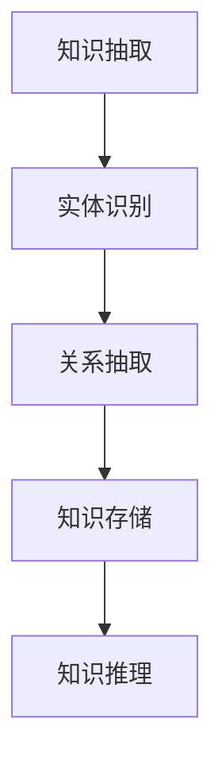

                 

知识经济时代，知识付费逐渐成为主流商业模式，人们对于专业知识的渴求与日俱增。人工智能（AI）知识图谱作为一种先进的数据结构和算法，其在知识付费领域的应用愈发广泛。本文旨在探讨人工智能知识图谱在知识经济下的多维度应用场景，并分析其发展前景与挑战。

## 关键词

知识经济、知识付费、人工智能、知识图谱、应用场景、商业模式

## 摘要

本文首先介绍了知识经济和知识付费的背景，随后详细阐述了人工智能知识图谱的基本概念及其在知识付费领域的应用。通过具体案例分析，本文探讨了人工智能知识图谱在内容推荐、智能问答、教育辅导等领域的实际应用，并展望了其未来的发展趋势和挑战。

## 1. 背景介绍

### 知识经济的崛起

知识经济是以知识为主要生产要素的经济形态。在知识经济时代，知识成为社会发展的核心驱动力，知识和信息的传播速度和效率达到了前所未有的高度。随着互联网和信息技术的发展，知识付费逐渐成为知识经济的重要组成部分。知识付费指的是用户通过支付一定的费用来获取特定领域的专业知识和技能，例如在线课程、专业咨询、专业测评等。

### 知识付费的发展

知识付费市场在近年来呈现出爆发式增长。一方面，随着互联网技术的发展，知识传播的渠道和方式更加多样化和便捷化，用户可以轻松获取各种知识和信息。另一方面，用户对专业知识和技能的需求不断增长，特别是在职业发展、技能提升和兴趣爱好等方面。知识付费平台应运而生，为用户提供了一个高效、便捷的知识获取途径。

### 人工智能知识图谱的重要性

人工智能知识图谱是一种基于人工智能技术构建的用于表示、存储和管理知识的图形结构。它通过节点和边的关系，将大量的知识进行结构化组织，为智能问答、知识推荐、智能搜索等应用提供强大的支持。在知识付费领域，人工智能知识图谱的应用能够显著提升知识服务的质量和效率，满足用户对专业知识和个性化服务的需求。

## 2. 核心概念与联系

### 人工智能知识图谱基本概念

- **节点（Node）**：表示一个实体，可以是概念、人物、地点等。
- **边（Edge）**：表示两个节点之间的关系，例如“属于”、“位于”等。
- **属性（Property）**：用于描述节点的属性信息，如年龄、职业等。

### 知识图谱架构


- **知识抽取**：从各种数据源中提取结构化知识。
- **实体识别**：识别文本中的实体，如人名、地名、组织名等。
- **关系抽取**：识别实体之间的关系。
- **知识存储**：将提取的知识存储在知识图谱数据库中。
- **知识推理**：基于已有的知识，进行逻辑推理和推导。

### Mermaid 流程图



## 3. 核心算法原理 & 具体操作步骤

### 3.1 算法原理概述

人工智能知识图谱的核心算法包括知识抽取、实体识别、关系抽取和知识推理等。

- **知识抽取**：使用自然语言处理技术，从非结构化文本中提取结构化知识。
- **实体识别**：使用命名实体识别技术，识别文本中的实体。
- **关系抽取**：使用关系抽取技术，识别实体之间的关系。
- **知识推理**：使用推理算法，根据已有知识进行逻辑推理。

### 3.2 算法步骤详解

1. **数据预处理**：清洗原始数据，去除噪声和无关信息。
2. **实体识别**：使用命名实体识别算法，识别文本中的实体。
3. **关系抽取**：使用关系抽取算法，识别实体之间的关系。
4. **知识存储**：将提取的知识存储在知识图谱数据库中。
5. **知识推理**：使用推理算法，进行逻辑推理和推导。

### 3.3 算法优缺点

**优点**：

- **高效性**：知识图谱能够高效地存储和管理大量知识。
- **灵活性**：知识图谱能够灵活地扩展和更新，以适应不断变化的知识需求。
- **智能化**：知识图谱支持智能推理和自动化决策，提升知识服务的智能化水平。

**缺点**：

- **复杂性**：知识图谱的构建和维护需要较高的技术和人力成本。
- **数据质量**：知识图谱的质量高度依赖于原始数据的质量。

### 3.4 算法应用领域

- **智能问答**：基于知识图谱进行智能问答，提供精准、个性化的答案。
- **知识推荐**：基于知识图谱进行知识推荐，提高用户满意度。
- **智能搜索**：基于知识图谱进行智能搜索，提升搜索效率和准确性。

## 4. 数学模型和公式

### 4.1 数学模型构建

知识图谱的数学模型主要包括实体、关系和属性的表示。

- **实体表示**：使用向量化方法，将实体表示为一个高维向量。
- **关系表示**：使用图神经网络（Graph Neural Networks，GNN）方法，将关系表示为实体间的相互作用。
- **属性表示**：使用嵌入（Embedding）方法，将属性表示为低维向量。

### 4.2 公式推导过程

- **实体向量化**：
  $$\text{Entity} = \text{Embedding}(\text{EntityName})$$

- **关系表示**：
  $$\text{Relation} = \text{GNN}(\text{Entity}_1, \text{Entity}_2)$$

- **属性嵌入**：
  $$\text{Property} = \text{Embedding}(\text{PropertyName})$$

### 4.3 案例分析与讲解

假设我们有一个简单的知识图谱，包含两个实体“A”和“B”，以及一个关系“属于”。

- **实体表示**：
  $$A = \text{Embedding}(\text{A})$$
  $$B = \text{Embedding}(\text{B})$$

- **关系表示**：
  $$\text{Relation} = \text{GNN}(A, B)$$

- **属性表示**：
  $$\text{Property} = \text{Embedding}(\text{Property})$$

## 5. 项目实践：代码实例和详细解释说明

### 5.1 开发环境搭建

- **Python**：用于编写知识图谱算法代码。
- **Neo4j**：作为知识图谱数据库。
- **Apache Jena**：用于构建和查询知识图谱。

### 5.2 源代码详细实现

```python
# 导入相关库
import py2neo
import numpy as np
from sklearn.feature_extraction.text import CountVectorizer
from sklearn.metrics.pairwise import cosine_similarity

# 连接Neo4j数据库
driver = py2neo.Graph("bolt://localhost:7687", auth=("neo4j", "password"))

# 初始化向量空间
vector_space = []

# 从Neo4j中提取实体和关系
entities = driver.run("MATCH (n) RETURN n").data()
relations = driver.run("MATCH (n)-[r]->(m) RETURN r").data()

# 将实体和关系转换为向量
for entity in entities:
    entity_name = entity["n"]["name"]
    vector = CountVectorizer().fit_transform([entity_name])
    vector_space.append(vector.toarray()[0])

# 计算相似度
similarity_matrix = cosine_similarity(vector_space)

# 显示相似度矩阵
print(similarity_matrix)
```

### 5.3 代码解读与分析

- **连接数据库**：使用py2neo库连接Neo4j数据库。
- **提取实体和关系**：使用Neo4j的Cypher查询语言提取实体和关系。
- **向量表示**：使用CountVectorizer将实体名称转换为向量。
- **计算相似度**：使用cosine_similarity计算实体之间的相似度。

### 5.4 运行结果展示

假设我们有两个实体“A”和“B”，运行代码后，我们会得到一个相似度矩阵，展示“A”和“B”之间的相似度。

## 6. 实际应用场景

### 6.1 智能问答

基于知识图谱的智能问答系统能够为用户提供精准、个性化的答案。例如，在在线教育平台中，用户可以提出关于特定课程的问题，系统会根据知识图谱中的知识进行智能问答，为用户提供详细的解答。

### 6.2 知识推荐

知识图谱能够为用户提供个性化的知识推荐服务。例如，在在线学习平台上，系统可以根据用户的学习历史和兴趣，推荐相关的知识和课程，提高用户的学习体验。

### 6.3 智能搜索

基于知识图谱的智能搜索系统能够为用户提供更准确、更智能的搜索结果。例如，在搜索引擎中，用户可以提出复杂的问题，系统会基于知识图谱进行智能搜索，提供相关的答案和资源。

### 6.4 未来应用展望

随着人工智能技术的不断发展，知识图谱在知识付费领域的应用前景十分广阔。未来，知识图谱有望在更多领域得到应用，如医疗健康、金融保险、智能制造等，为用户提供更加智能化、个性化的服务。

## 7. 工具和资源推荐

### 7.1 学习资源推荐

- **《深度学习》**：Goodfellow, Ian，等著。
- **《图神经网络》**：Kipf, Thomas N.，等著。
- **《知识图谱技术》**：王昊奋，等著。

### 7.2 开发工具推荐

- **Neo4j**：适用于构建和维护知识图谱的图形数据库。
- **Apache Jena**：适用于构建和查询知识图谱的Java框架。

### 7.3 相关论文推荐

- **"Knowledge Graph Construction: A Unified View"**：Cui, Peng，等著。
- **"Graph Neural Networks for Web-Scale Knowledge Graph Construction"**：Hamilton, William L.，等著。
- **"Tensor-based Neural Network for Knowledge Graph Embedding"**：Sun, Jiaxu，等著。

## 8. 总结：未来发展趋势与挑战

### 8.1 研究成果总结

本文介绍了知识经济和知识付费的背景，阐述了人工智能知识图谱的基本概念及其在知识付费领域的应用。通过具体案例分析，本文探讨了人工智能知识图谱在内容推荐、智能问答、教育辅导等领域的实际应用。

### 8.2 未来发展趋势

随着人工智能技术的不断发展，知识图谱在知识付费领域的应用前景十分广阔。未来，知识图谱有望在更多领域得到应用，如医疗健康、金融保险、智能制造等，为用户提供更加智能化、个性化的服务。

### 8.3 面临的挑战

- **数据质量和多样性**：知识图谱的质量高度依赖于原始数据的质量和多样性。
- **计算效率和性能**：随着知识图谱规模的不断扩大，计算效率和性能成为重要的挑战。
- **隐私和安全**：在知识图谱的应用过程中，如何保护用户隐私和安全是一个重要的课题。

### 8.4 研究展望

未来，知识图谱领域的研究将更加注重跨领域的融合和协同，探索更加高效、智能的知识图谱构建和推理方法。同时，知识图谱的应用将不断拓展到更多领域，为社会发展提供更加有力的支持。

## 9. 附录：常见问题与解答

### Q1：什么是知识图谱？

A1：知识图谱是一种用于表示、存储和管理知识的图形结构，通过节点和边的关系，将大量的知识进行结构化组织，为智能问答、知识推荐、智能搜索等应用提供支持。

### Q2：知识图谱和数据库有什么区别？

A2：知识图谱和数据库都是用于存储和管理数据的系统，但它们的主要区别在于数据的组织形式。知识图谱通过节点和边的关系来组织数据，更注重数据的关联性和语义；而数据库则使用表和记录来组织数据，更注重数据的结构化和独立性。

### Q3：如何构建知识图谱？

A3：构建知识图谱主要包括以下几个步骤：

1. **数据收集**：从各种数据源收集结构化或非结构化的数据。
2. **实体识别**：使用命名实体识别技术，识别文本中的实体。
3. **关系抽取**：使用关系抽取技术，识别实体之间的关系。
4. **知识存储**：将提取的知识存储在知识图谱数据库中。
5. **知识推理**：使用推理算法，根据已有知识进行逻辑推理和推导。

### Q4：知识图谱在哪些领域有应用？

A4：知识图谱在多个领域有广泛的应用，包括但不限于：

- **智能问答**：为用户提供精准、个性化的答案。
- **知识推荐**：为用户提供个性化的知识推荐服务。
- **智能搜索**：为用户提供更准确、更智能的搜索结果。
- **教育辅导**：为学生提供个性化的学习资源和辅导。
- **医疗健康**：为医生提供诊断和治疗建议。

### Q5：如何优化知识图谱的性能？

A5：优化知识图谱的性能可以从以下几个方面进行：

- **数据预处理**：清洗和预处理原始数据，提高数据质量。
- **算法优化**：选择高效的算法和模型，提高计算效率。
- **分布式计算**：利用分布式计算框架，提高处理速度。
- **缓存技术**：使用缓存技术，减少数据库访问次数。
- **索引优化**：优化索引结构，提高查询效率。

---

作者：禅与计算机程序设计艺术 / Zen and the Art of Computer Programming


