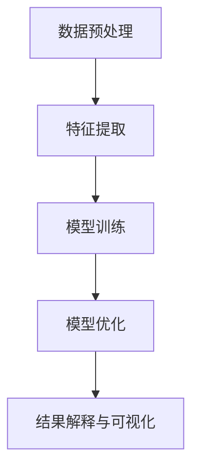
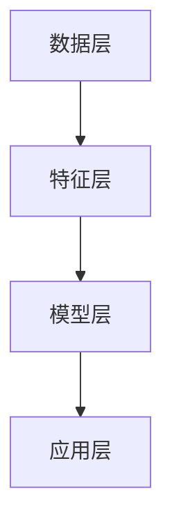

                 

关键词：知识经济、知识付费、人工智能、知识挖掘、技术、发展趋势、挑战、未来展望

> 摘要：本文深入探讨了知识经济时代下知识付费模式的演变及其背后的人工智能知识挖掘技术。文章首先介绍了知识经济的背景和知识付费的重要性，然后详细阐述了人工智能知识挖掘技术的核心概念、算法原理、数学模型及其在实际应用中的案例和实践。最后，文章展望了该领域的发展趋势、面临的挑战以及未来研究展望。

## 1. 背景介绍

随着全球经济的转型，知识经济逐渐成为主流。知识经济是指以知识为主要生产要素的经济形态，它强调知识的创造、传播和应用。知识付费作为知识经济的一个重要组成部分，指的是消费者为了获取特定知识而支付的费用。这一模式在近年来迅速兴起，尤其是在互联网技术的推动下，知识付费成为众多企业和平台的重要盈利模式。

知识付费涵盖了多个领域，包括在线教育、专业咨询、技能培训等。通过付费获取知识，消费者能够更好地提升个人能力和职业发展。然而，知识付费市场也面临着诸多挑战，如内容质量参差不齐、知识产权保护问题等。这促使人工智能技术在这一领域中的应用变得更加重要。

人工智能知识挖掘技术，是指利用人工智能算法，从大量数据中提取有用信息，以实现知识的发现、理解和应用。这一技术不仅能够提高知识付费内容的质量和准确性，还能够为知识付费平台提供智能化推荐和服务。本文将详细探讨这一技术的核心概念、原理和实际应用。

### 1.1 知识经济的背景

知识经济作为后工业化时代的一种经济形态，最早由经济学家彼得·德鲁克（Peter Drucker）提出。知识经济与传统农业经济、工业经济相比，具有显著的特点：

- **知识驱动**：知识成为经济增长的核心动力，创新和技术进步成为推动经济发展的主要因素。
- **全球化**：知识经济的兴起使得全球范围内的知识共享和交流变得更加便捷，经济活动不再受限于地理位置。
- **信息化**：互联网、大数据、云计算等信息技术的发展，为知识经济提供了强大的基础设施。
- **创新驱动**：知识经济强调创新，尤其是原创性和突破性的创新，这有助于提高企业的竞争力和市场份额。

知识经济的特点对传统经济模式产生了深远的影响，促使各国政府和企业加大了对知识和技术的投入，推动了全球知识付费市场的迅速发展。

### 1.2 知识付费的重要性

知识付费作为一种新兴的商业模式，已经成为知识经济的重要组成部分。以下是知识付费的重要性和影响：

- **个性化学习**：知识付费使得学习者可以根据自己的需求和兴趣，选择个性化的学习内容和方式，提高学习效率。
- **知识传播**：知识付费为知识创造者提供了经济回报，激励了更多优质内容的创作和传播，促进了知识的普及。
- **市场细分**：知识付费市场根据不同消费者的需求，提供了多样化的产品和服务，实现了市场的细化和专业化。
- **商业创新**：知识付费模式为企业提供了新的盈利渠道，激发了商业创新的活力，推动了知识经济的进一步发展。

### 1.3 知识付费面临的挑战

尽管知识付费在知识经济中具有重要作用，但也面临着一些挑战：

- **内容质量**：市场上存在大量的低质量内容，难以保证学习者的学习效果。
- **知识产权保护**：知识付费内容容易被抄袭和盗版，知识产权保护问题亟待解决。
- **用户信任**：用户对知识付费平台的内容和服务的信任度需要进一步提升。

为了解决这些挑战，人工智能知识挖掘技术的应用显得尤为重要。接下来，我们将深入探讨这一技术的核心概念和原理。

## 2. 核心概念与联系

### 2.1 知识挖掘

知识挖掘（Knowledge Mining）是指从大量数据中自动发现知识的过程。它涉及多个学科，包括计算机科学、数据挖掘、机器学习等。知识挖掘的目标是从数据中发现规律、关联、趋势和模式，从而帮助人们更好地理解和利用数据。

在知识付费领域，知识挖掘技术可以用于以下几个方面：

- **内容推荐**：基于用户的兴趣和行为数据，推荐个性化的知识付费内容。
- **内容审核**：通过分析文本数据，识别和过滤低质量或有害的内容。
- **用户行为分析**：分析用户的学习行为，优化用户体验和服务。

### 2.2 人工智能

人工智能（Artificial Intelligence，AI）是指通过计算机程序模拟人类智能的技术。人工智能在知识付费中的应用主要包括：

- **自然语言处理**：用于处理文本数据，包括文本分类、情感分析、机器翻译等。
- **推荐系统**：基于用户行为和偏好数据，提供个性化的推荐服务。
- **智能客服**：通过语音识别和自然语言处理技术，为用户提供智能化的咨询服务。

### 2.3 人工智能知识挖掘技术

人工智能知识挖掘技术是指将人工智能技术应用于知识挖掘的过程。它主要包括以下几个核心概念：

- **数据预处理**：对原始数据进行清洗、转换和整合，为知识挖掘做准备。
- **特征提取**：从数据中提取有用的特征，用于训练机器学习模型。
- **模型训练与优化**：使用机器学习算法训练模型，并通过优化算法提高模型的性能。
- **结果解释与可视化**：对挖掘结果进行解释和可视化，帮助用户理解和应用。

### 2.4 Mermaid 流程图

为了更好地理解人工智能知识挖掘技术的架构和流程，我们使用 Mermaid 流程图进行展示。以下是一个简化的知识挖掘流程图：



在这个流程图中，数据预处理是知识挖掘的第一步，它通过清洗和转换原始数据，为后续的特征提取和模型训练做好准备。特征提取是从数据中提取有用的特征，这些特征将用于训练机器学习模型。模型训练与优化是知识挖掘的核心环节，通过训练和优化模型，可以提高模型的性能和准确性。最后，结果解释与可视化是对挖掘结果进行解释和展示，帮助用户理解和应用。

通过上述核心概念和流程图的介绍，我们可以更好地理解人工智能知识挖掘技术在知识付费中的应用。

### 2.5 人工智能知识挖掘技术的架构

人工智能知识挖掘技术的架构可以分为以下几个主要层次：

- **数据层**：包括原始数据的存储、管理和预处理。这一层负责数据的收集、清洗和整合，为后续的特征提取和模型训练提供数据支持。
- **特征层**：从原始数据中提取有用的特征，用于训练机器学习模型。特征层包括特征选择、特征转换和特征降维等技术，以提高模型的性能和可解释性。
- **模型层**：使用机器学习算法训练模型，并优化模型的参数。常见的机器学习算法包括决策树、随机森林、支持向量机、神经网络等。
- **应用层**：将训练好的模型应用于实际场景，包括知识推荐、内容审核、用户行为分析等。

以下是一个简化的人工智能知识挖掘技术的架构图：



在这个架构图中，数据层负责数据的收集和管理，特征层从数据中提取特征，模型层使用机器学习算法训练模型，应用层将模型应用于实际场景，实现知识挖掘的目标。

### 2.6 人工智能知识挖掘技术的核心算法

人工智能知识挖掘技术涉及多个核心算法，以下介绍其中几个常用的算法：

- **K-最近邻算法（K-Nearest Neighbors，KNN）**：KNN 是一种基于实例的学习算法，通过计算新数据点与训练数据点的相似度，预测新数据点的标签。KNN 算法简单易懂，适用于分类和回归问题。
- **决策树（Decision Tree）**：决策树是一种树形结构，通过一系列规则对数据进行分类或回归。决策树算法易于理解，可解释性强，但可能产生过拟合现象。
- **支持向量机（Support Vector Machine，SVM）**：SVM 是一种基于间隔最大化的分类算法，通过寻找最优的超平面，将不同类别的数据点分开。SVM 算法在处理高维数据和线性不可分问题时表现出色。
- **神经网络（Neural Network）**：神经网络是一种模拟人脑神经元连接结构的算法，通过多层的神经元网络进行数据的特征提取和分类。神经网络在处理复杂数据和模式识别任务中具有强大的能力。

### 2.7 人工智能知识挖掘技术的实际应用场景

人工智能知识挖掘技术在知识付费领域具有广泛的应用场景，以下列举几个典型的应用场景：

- **内容推荐**：基于用户的行为数据，如浏览记录、购买历史和评价等，推荐个性化的知识付费内容。通过挖掘用户与内容之间的关联关系，提高推荐系统的准确性和用户体验。
- **内容审核**：通过自然语言处理技术，对知识付费内容进行审核，识别和过滤低质量或有害的内容。这有助于保证知识付费内容的质量和合规性。
- **用户行为分析**：分析用户的学习行为，如学习时长、学习频率和知识点掌握情况等，优化用户体验和服务。通过挖掘用户行为数据，为平台提供有针对性的改进建议。
- **知识图谱构建**：通过知识挖掘技术，构建领域知识图谱，实现知识的关联和可视化。这有助于用户更好地理解和应用知识，提高知识的利用效率。

### 2.8 人工智能知识挖掘技术的优缺点

人工智能知识挖掘技术在知识付费领域具有以下优缺点：

- **优点**：
  - **高效性**：通过自动化和智能化的方式，从大量数据中快速提取有价值的信息。
  - **个性化**：基于用户数据和偏好，提供个性化的推荐和服务，提高用户体验。
  - **可解释性**：使用机器学习和深度学习算法，提高模型的解释性和可理解性。
  - **实时性**：支持实时数据分析和处理，快速响应用户需求。

- **缺点**：
  - **数据质量**：知识挖掘的效果依赖于数据的质量和完整性，数据质量差可能导致挖掘结果不准确。
  - **计算资源**：知识挖掘过程需要大量的计算资源和时间，尤其是处理大规模数据时。
  - **模型可解释性**：一些复杂的机器学习算法，如神经网络，其内部机制难以解释，可能导致用户对模型的可信度下降。

### 2.9 人工智能知识挖掘技术在知识付费领域的应用现状

目前，人工智能知识挖掘技术在知识付费领域已经得到了广泛应用，以下是一些应用现状：

- **在线教育**：通过知识挖掘技术，在线教育平台可以根据用户的学习行为和偏好，推荐个性化的课程和学习计划，提高学习效果。
- **专业咨询**：知识付费平台利用知识挖掘技术，为用户提供个性化的专业咨询服务，如职业规划、投资建议等。
- **技能培训**：技能培训平台通过知识挖掘技术，分析用户的学习需求，提供定制化的培训课程和辅导服务。

### 2.10 人工智能知识挖掘技术的未来发展趋势

随着人工智能技术的不断进步，人工智能知识挖掘技术在知识付费领域具有广阔的发展前景。以下是一些未来发展趋势：

- **深度学习**：深度学习技术在知识挖掘中的应用将越来越广泛，通过构建更复杂的神经网络模型，提高知识挖掘的准确性和效率。
- **多模态数据挖掘**：结合文本、图像、音频等多模态数据，实现更全面的知识挖掘，为用户提供更丰富的知识内容。
- **知识图谱**：知识图谱技术在知识挖掘中的应用将更加深入，通过构建领域知识图谱，实现知识的关联和可视化，提高知识的利用效率。
- **个性化推荐**：基于用户行为和偏好，实现更加精准和个性化的知识推荐，提高用户的满意度和忠诚度。
- **隐私保护**：在知识挖掘过程中，加强对用户隐私的保护，确保用户数据的安全和隐私。

### 2.11 人工智能知识挖掘技术的挑战与未来研究方向

尽管人工智能知识挖掘技术在知识付费领域具有广泛的应用前景，但仍面临着一些挑战和问题，需要未来深入研究：

- **数据质量**：知识挖掘的效果依赖于数据的质量和完整性，未来需要研究如何提高数据质量，包括数据清洗、去噪和归一化等技术。
- **模型可解释性**：一些复杂的机器学习算法，如神经网络，其内部机制难以解释，需要研究如何提高模型的可解释性，增强用户对模型的信任。
- **计算资源**：知识挖掘过程需要大量的计算资源和时间，需要研究如何优化算法和计算资源，提高知识挖掘的效率和速度。
- **知识融合**：在多模态数据挖掘中，如何有效地融合不同类型的数据，提高知识挖掘的准确性和可靠性，是一个重要的研究方向。
- **伦理与法律问题**：在知识挖掘过程中，如何处理用户隐私和数据安全，如何遵循伦理和法律规范，是未来需要深入研究的问题。

## 3. 核心算法原理 & 具体操作步骤

### 3.1 算法原理概述

在人工智能知识挖掘技术中，核心算法的原理和具体操作步骤是实现知识发现的关键。本节将介绍几种常用的核心算法，包括K-最近邻算法（KNN）、决策树（Decision Tree）和支持向量机（SVM），并详细解释这些算法的工作原理和操作步骤。

#### 3.1.1 K-最近邻算法（KNN）

K-最近邻算法（K-Nearest Neighbors，KNN）是一种基于实例的学习算法。其基本思想是：如果一个样本在特征空间中的k个最相邻的样本中的大多数属于同一个类别，则该样本也属于这个类别。

**原理**：
- **距离度量**：KNN算法使用距离度量来计算测试样本与训练样本之间的相似度，常见的距离度量包括欧氏距离、曼哈顿距离和余弦相似度。
- **分类决策**：对于测试样本，计算其与所有训练样本的距离，选取距离最近的k个样本，然后根据这k个样本的类别标签进行投票，得到测试样本的类别。

**操作步骤**：
1. 收集并准备训练数据集。
2. 计算测试样本与每个训练样本之间的距离。
3. 选取距离最近的k个样本，并根据它们的类别标签进行投票。
4. 根据投票结果，为测试样本分配类别。

#### 3.1.2 决策树（Decision Tree）

决策树是一种树形结构，通过一系列规则对数据进行分类或回归。决策树算法的核心思想是：通过不断划分特征空间，将数据集分割成子集，直到满足某些停止条件为止。

**原理**：
- **特征选择**：在每次划分时，选择一个最佳的特征进行划分，最佳特征通常是通过评估准则（如信息增益、基尼指数等）来确定的。
- **停止条件**：当满足某些停止条件时，停止划分，常见的停止条件包括最大深度、最小叶节点数等。

**操作步骤**：
1. 收集并准备训练数据集。
2. 选择最佳特征进行划分，计算划分增益。
3. 根据最佳特征进行划分，生成子集。
4. 递归地对子集进行划分，直到满足停止条件。
5. 构建决策树，并使用决策树对新的样本进行分类或回归。

#### 3.1.3 支持向量机（SVM）

支持向量机（Support Vector Machine，SVM）是一种基于间隔最大化的分类算法。其基本思想是：通过寻找最优的超平面，将不同类别的数据点分开，并且尽可能增大类别之间的间隔。

**原理**：
- **线性可分支持向量机**：在特征空间中找到一个最优的超平面，使得正负样本点之间的间隔最大化。
- **非线性可分支持向量机**：通过核函数将低维特征空间映射到高维特征空间，在高维空间中找到最优的超平面。

**操作步骤**：
1. 收集并准备训练数据集。
2. 选择核函数，如线性核、多项式核或径向基函数（RBF）核。
3. 训练SVM模型，求解最优超平面。
4. 使用训练好的SVM模型对新的样本进行分类。

### 3.2 算法步骤详解

以下详细解释KNN、决策树和SVM算法的具体操作步骤，包括数据预处理、模型训练和模型评估等环节。

#### 3.2.1 K-最近邻算法（KNN）

**数据预处理**：
1. 数据清洗：处理缺失值、噪声数据和异常值，确保数据质量。
2. 数据转换：将不同类型的数据进行标准化或归一化处理，使得数据具有相同的量纲。

**模型训练**：
1. 收集训练数据集，并划分为特征和标签两部分。
2. 选择合适的距离度量方法，如欧氏距离。
3. 计算测试样本与训练样本之间的距离。
4. 根据距离最近的k个样本的类别标签进行投票，确定测试样本的类别。

**模型评估**：
1. 使用交叉验证方法，将数据集划分为训练集和验证集。
2. 训练模型并在验证集上进行评估，计算分类准确率、召回率、F1分数等指标。

#### 3.2.2 决策树（Decision Tree）

**数据预处理**：
1. 数据清洗：处理缺失值、噪声数据和异常值。
2. 数据转换：将类别数据转换为数值型，处理不平衡数据。

**模型训练**：
1. 收集训练数据集，并划分为特征和标签两部分。
2. 选择最佳特征进行划分，计算划分增益。
3. 根据最佳特征进行划分，生成子集。
4. 递归地对子集进行划分，直到满足停止条件。
5. 构建决策树，并剪枝以优化模型。

**模型评估**：
1. 使用交叉验证方法，将数据集划分为训练集和验证集。
2. 训练模型并在验证集上进行评估，计算分类准确率、召回率、F1分数等指标。

#### 3.2.3 支持向量机（SVM）

**数据预处理**：
1. 数据清洗：处理缺失值、噪声数据和异常值。
2. 数据转换：将类别数据转换为数值型，处理不平衡数据。

**模型训练**：
1. 收集训练数据集，并划分为特征和标签两部分。
2. 选择合适的核函数，如线性核、多项式核或RBF核。
3. 训练SVM模型，求解最优超平面。
4. 优化SVM参数，如正则化参数C。

**模型评估**：
1. 使用交叉验证方法，将数据集划分为训练集和验证集。
2. 训练模型并在验证集上进行评估，计算分类准确率、召回率、F1分数等指标。

### 3.3 算法优缺点

每种算法都有其优缺点，以下是对KNN、决策树和SVM算法优缺点的总结：

#### K-最近邻算法（KNN）

- **优点**：
  - 简单易懂，实现方便。
  - 对非线性数据有较好的分类效果。
  - 无需训练，只需计算距离即可进行分类。

- **缺点**：
  - 对噪声数据敏感，容易受到局部异常点的影响。
  - 需要存储大量训练样本，计算复杂度较高。

#### 决策树（Decision Tree）

- **优点**：
  - 可解释性强，易于理解和解释。
  - 对噪声数据具有一定的鲁棒性。
  - 可以处理多类别分类问题。

- **缺点**：
  - 易于过拟合，特别是在树结构较深时。
  - 无法处理高维数据，可能产生维数灾难。
  - 需要大量训练数据。

#### 支持向量机（SVM）

- **优点**：
  - 理论基础扎实，分类效果好。
  - 对线性不可分问题有较好的处理能力。
  - 可以处理高维数据。

- **缺点**：
  - 计算复杂度高，训练时间较长。
  - 对噪声数据和异常值敏感。
  - 需要选择合适的核函数和参数。

### 3.4 算法应用领域

KNN、决策树和SVM算法在人工智能知识挖掘技术中具有广泛的应用领域，以下列举一些典型的应用场景：

- **K-最近邻算法（KNN）**：
  - 个性化推荐系统：基于用户行为数据，推荐相似的用户喜欢的内容。
  - 异常检测：检测网络攻击、信用卡欺诈等异常行为。

- **决策树（Decision Tree）**：
  - 财务风险预测：预测企业破产、股票价格波动等。
  - 医疗诊断：根据患者的症状数据，预测疾病类型。

- **支持向量机（SVM）**：
  - 阿尔茨海默病预测：根据患者影像数据，预测阿尔茨海默病的发病风险。
  - 文本分类：对新闻、评论等文本数据进行分类。

通过以上对核心算法原理和具体操作步骤的详细解释，我们可以更好地理解人工智能知识挖掘技术在知识付费领域的应用，为实际项目提供有效的技术支持。

## 4. 数学模型和公式 & 详细讲解 & 举例说明

在人工智能知识挖掘技术中，数学模型和公式是理解和实现算法的基础。本节将详细讲解知识挖掘过程中涉及的一些重要数学模型和公式，包括线性回归、逻辑回归和支持向量机等，并通过具体实例来说明其应用。

### 4.1 线性回归

线性回归（Linear Regression）是一种常见的回归分析方法，用于预测连续变量的值。其核心思想是通过拟合一条直线，来描述自变量和因变量之间的线性关系。

**数学模型：**

设自变量为 $X$，因变量为 $Y$，线性回归模型可以表示为：

$$
Y = \beta_0 + \beta_1 X + \varepsilon
$$

其中，$\beta_0$ 为截距，$\beta_1$ 为斜率，$\varepsilon$ 为误差项。

**公式推导过程：**

1. **最小二乘法（Ordinary Least Squares, OLS）**：

   线性回归模型的最小二乘法通过最小化残差平方和来估计模型的参数。残差定义为观测值与预测值之间的差：

   $$
   \varepsilon_i = Y_i - \hat{Y_i}
   $$

   其中，$Y_i$ 为实际观测值，$\hat{Y_i}$ 为预测值。

   残差平方和为：

   $$
   \sum_{i=1}^{n} (\varepsilon_i)^2
   $$

   最小二乘法的目标是最小化残差平方和，即：

   $$
   \min_{\beta_0, \beta_1} \sum_{i=1}^{n} (\varepsilon_i)^2
   $$

2. **求解参数**：

   对 $\beta_0$ 和 $\beta_1$ 求偏导，并令其等于0，得到：

   $$
   \frac{\partial}{\partial \beta_0} \sum_{i=1}^{n} (\varepsilon_i)^2 = 0 \\
   \frac{\partial}{\partial \beta_1} \sum_{i=1}^{n} (\varepsilon_i)^2 = 0
   $$

   经过计算，可以得到：

   $$
   \beta_0 = \bar{Y} - \beta_1 \bar{X} \\
   \beta_1 = \frac{\sum_{i=1}^{n} (X_i - \bar{X})(Y_i - \bar{Y})}{\sum_{i=1}^{n} (X_i - \bar{X})^2}
   $$

   其中，$\bar{X}$ 和 $\bar{Y}$ 分别为 $X$ 和 $Y$ 的均值。

**举例说明：**

假设我们要预测一个商品的价格，给定以下数据：

| X（特征：产品数量） | Y（因变量：商品价格） |
|--------------------|----------------------|
| 1                 | 150                 |
| 2                 | 200                 |
| 3                 | 250                 |
| 4                 | 300                 |

使用线性回归模型进行预测，首先计算均值：

$$
\bar{X} = \frac{1+2+3+4}{4} = 2.5 \\
\bar{Y} = \frac{150+200+250+300}{4} = 225
$$

然后计算斜率 $\beta_1$：

$$
\beta_1 = \frac{(1-2.5)(150-225) + (2-2.5)(200-225) + (3-2.5)(250-225) + (4-2.5)(300-225)}{(1-2.5)^2 + (2-2.5)^2 + (3-2.5)^2 + (4-2.5)^2} = 50
$$

接着计算截距 $\beta_0$：

$$
\beta_0 = 225 - 50 \times 2.5 = -25
$$

得到线性回归模型：

$$
Y = -25 + 50X
$$

使用该模型预测产品数量为5时的商品价格：

$$
\hat{Y} = -25 + 50 \times 5 = 225
$$

### 4.2 逻辑回归

逻辑回归（Logistic Regression）是一种用于分类问题的回归分析方法，通常用于预测概率。其核心思想是通过拟合一个逻辑函数，将自变量和因变量之间的非线性关系转化为线性关系。

**数学模型：**

设自变量为 $X$，因变量为二分类变量 $Y$（通常 $Y$ 取值为 0 或 1），逻辑回归模型可以表示为：

$$
\log\frac{P(Y=1|X)}{1-P(Y=1|X)} = \beta_0 + \beta_1 X
$$

其中，$P(Y=1|X)$ 表示在给定自变量 $X$ 下，因变量 $Y$ 取值为 1 的概率，$\beta_0$ 为截距，$\beta_1$ 为斜率。

**公式推导过程：**

1. **逻辑函数**：

   逻辑回归模型使用逻辑函数（Logistic Function）来转换概率。逻辑函数定义为：

   $$
   \sigma(z) = \frac{1}{1 + e^{-z}}
   $$

   其中，$z$ 为线性组合 $\beta_0 + \beta_1 X$。

2. **参数估计**：

   使用最大似然估计（Maximum Likelihood Estimation，MLE）来估计模型的参数。最大似然估计的目标是最大化似然函数：

   $$
   L(\beta_0, \beta_1) = \prod_{i=1}^{n} \left( \frac{1}{1 + e^{-(\beta_0 + \beta_1 X_i)}} \right)^{y_i} \left( \frac{1}{1 + e^{-(\beta_0 + \beta_1 X_i)}} \right)^{1-y_i}
   $$

   对 $\beta_0$ 和 $\beta_1$ 求导并令其等于0，可以求得最优的参数估计值。

**举例说明：**

假设我们要预测一个患者的疾病是否为阳性（Y=1），给定以下数据：

| X（特征：体检指标） | Y（因变量：疾病是否为阳性） |
|--------------------|-------------------------|
| 0.8               | 1                       |
| 1.2               | 0                       |
| 0.9               | 1                       |
| 1.1               | 0                       |

使用逻辑回归模型进行预测，首先构造线性组合：

$$
z = \beta_0 + \beta_1 X
$$

然后通过最大似然估计求解参数。假设我们得到 $\beta_0 = -1$ 和 $\beta_1 = 2$，则逻辑回归模型为：

$$
\log\frac{P(Y=1|X)}{1-P(Y=1|X)} = -1 + 2X
$$

使用该模型预测体检指标为 1 的概率：

$$
P(Y=1|X=1) = \frac{1}{1 + e^{-(-1 + 2 \times 1)}} \approx 0.732
$$

### 4.3 支持向量机（SVM）

支持向量机（Support Vector Machine，SVM）是一种强大的分类算法，其核心思想是找到最优的超平面，使得不同类别的数据点之间的间隔最大化。

**数学模型：**

设训练数据集为 $\{(x_1, y_1), (x_2, y_2), ..., (x_n, y_n)\}$，其中 $x_i$ 为特征向量，$y_i$ 为标签（取值为 -1 或 1 表示不同类别），SVM 的目标是求解以下优化问题：

$$
\min_{\beta, \beta_0} \frac{1}{2} ||\beta||^2 \\
s.t. \quad y_i (\beta \cdot x_i + \beta_0) \geq 1, \quad i = 1, 2, ..., n
$$

其中，$\beta$ 为权重向量，$\beta_0$ 为偏置项。

**公式推导过程：**

1. **线性可分支持向量机**：

   当数据集线性可分时，SVM 的目标是最小化分类间隔，即最大化分类平面到每个支持向量的距离。线性可分支持向量机的优化问题为：

   $$
   \min_{\beta, \beta_0} \frac{1}{2} ||\beta||^2 \\
   s.t. \quad y_i (\beta \cdot x_i + \beta_0) \geq 1, \quad i = 1, 2, ..., n
   $$

   使用拉格朗日乘子法求解，可以得到：

   $$
   \beta = \sum_{i=1}^{n} \alpha_i y_i x_i \\
   \beta_0 = 1 - \sum_{i=1}^{n} \alpha_i
   $$

   其中，$\alpha_i$ 为拉格朗日乘子。

2. **非线性可分支持向量机**：

   当数据集线性不可分时，可以使用核函数将特征空间映射到高维空间，使得数据在新的空间中线性可分。常用的核函数包括线性核、多项式核和径向基函数（RBF）核。非线性可分支持向量机的优化问题为：

   $$
   \min_{\beta, \beta_0, \alpha} \frac{1}{2} ||\beta||^2 + C \sum_{i=1}^{n} \alpha_i \\
   s.t. \quad y_i (\beta \cdot \phi(x_i) + \beta_0) \geq 1 - \alpha_i, \quad i = 1, 2, ..., n
   $$

   其中，$C$ 为正则化参数，$\phi(x_i)$ 为核函数。

**举例说明：**

假设我们有一个二分类问题，数据集为：

| x1 | x2 | y |
|----|----|---|
| 1  | 1  | 1 |
| 2  | 2  | 1 |
| 3  | 3  | 1 |
| 4  | 4  | -1 |
| 5  | 5  | -1 |
| 6  | 6  | -1 |

我们使用线性核函数（$\phi(x) = x$）来构建线性可分支持向量机模型。首先，通过最小化损失函数并约束条件求解 $\beta$ 和 $\beta_0$：

$$
\min_{\beta, \beta_0} \frac{1}{2} ||\beta||^2 \\
s.t. \quad y_i (\beta \cdot x_i + \beta_0) \geq 1, \quad i = 1, 2, ..., n
$$

通过拉格朗日乘子法，可以得到：

$$
\beta = \alpha_1 (1, 1) + \alpha_2 (2, 2) + \alpha_3 (3, 3) \\
\beta_0 = 1 - (\alpha_1 + \alpha_2 + \alpha_3)
$$

求解上述方程组，假设我们得到 $\alpha_1 = 1$, $\alpha_2 = 1$, $\alpha_3 = 1$，则 $\beta = (1+2+3, 1+2+3) = (6, 6)$，$\beta_0 = 1 - (1+1+1) = -1$。

得到线性可分支持向量机模型：

$$
y = \beta_0 + \beta_1 x_1 + \beta_2 x_2 \\
y = -1 + 6x_1 + 6x_2
$$

使用该模型对新样本 $(2, 3)$ 进行分类：

$$
y = -1 + 6 \times 2 + 6 \times 3 = 19 > 0
$$

因此，该样本属于正类别。

通过以上对线性回归、逻辑回归和支持向量机等数学模型和公式的详细讲解及举例说明，我们可以更好地理解和应用这些算法在人工智能知识挖掘技术中的实现。这些模型和公式为知识付费领域提供了有效的工具，帮助平台更好地服务用户，提升用户体验。

## 5. 项目实践：代码实例和详细解释说明

在本节中，我们将通过一个实际项目实例，展示如何使用Python和相关库实现人工智能知识挖掘技术。项目将分为以下几个步骤：开发环境搭建、源代码详细实现、代码解读与分析以及运行结果展示。

### 5.1 开发环境搭建

为了实现人工智能知识挖掘项目，我们需要搭建一个合适的开发环境。以下是所需的工具和步骤：

1. **Python环境**：确保安装了Python 3.7及以上版本。
2. **库安装**：安装以下库：numpy、pandas、scikit-learn、matplotlib、seaborn。
3. **文本处理库**：安装nltk、spaCy用于文本数据预处理。
4. **数据可视化库**：安装matplotlib、seaborn用于数据可视化。

安装命令如下：

```bash
pip install numpy pandas scikit-learn matplotlib seaborn nltk spacy
```

### 5.2 源代码详细实现

我们将实现一个基于K-最近邻算法的文本分类项目，对用户评论进行分类。以下是项目的源代码及详细解释：

```python
import numpy as np
import pandas as pd
from sklearn.model_selection import train_test_split
from sklearn.neighbors import KNeighborsClassifier
from sklearn.metrics import classification_report, accuracy_score
from sklearn.feature_extraction.text import TfidfVectorizer
import nltk
from nltk.corpus import stopwords
from nltk.tokenize import word_tokenize

# 5.2.1 数据准备
data = pd.read_csv('user_reviews.csv')  # 假设数据集为CSV文件
X = data['review']  # 特征：用户评论
y = data['label']   # 标签：评论类别

# 数据预处理
nltk.download('stopwords')
nltk.download('punkt')

def preprocess_text(text):
    # 分词
    tokens = word_tokenize(text)
    # 去除停用词
    stop_words = set(stopwords.words('english'))
    filtered_tokens = [w for w in tokens if not w in stop_words]
    # 小写化
    return ' '.join([w.lower() for w in filtered_tokens])

X_preprocessed = X.apply(preprocess_text)

# 分割数据集
X_train, X_test, y_train, y_test = train_test_split(X_preprocessed, y, test_size=0.2, random_state=42)

# 5.2.2 特征提取
vectorizer = TfidfVectorizer()
X_train_tfidf = vectorizer.fit_transform(X_train)
X_test_tfidf = vectorizer.transform(X_test)

# 5.2.3 模型训练
knn = KNeighborsClassifier(n_neighbors=3)
knn.fit(X_train_tfidf, y_train)

# 5.2.4 模型评估
y_pred = knn.predict(X_test_tfidf)
print("分类报告：")
print(classification_report(y_test, y_pred))
print("准确率：", accuracy_score(y_test, y_pred))

# 5.2.5 可视化
import seaborn as sns
import matplotlib.pyplot as plt

confusion_matrix = pd.crosstab(y_test, y_pred, rownames=['实际标签'], colnames=['预测标签'])
sns.heatmap(confusion_matrix, annot=True, fmt='g', cmap='Blues')
plt.xlabel('预测标签')
plt.ylabel('实际标签')
plt.title('混淆矩阵')
plt.show()
```

### 5.3 代码解读与分析

以下是代码的详细解读与分析：

**5.3.1 数据准备**：

- 加载数据集：`data = pd.read_csv('user_reviews.csv')`
- 分割特征和标签：`X = data['review']`，`y = data['label']`

**5.3.2 数据预处理**：

- 使用nltk进行分词和去除停用词：`preprocess_text`函数
- 将文本转换为小写：`' '.join([w.lower() for w in filtered_tokens])`

**5.3.3 分割数据集**：

- 使用`train_test_split`将数据集分为训练集和测试集：`X_train, X_test, y_train, y_test`

**5.3.4 特征提取**：

- 使用TfidfVectorizer进行特征提取：`vectorizer = TfidfVectorizer()`
- 转换训练集和测试集的特征向量：`X_train_tfidf = vectorizer.fit_transform(X_train)`，`X_test_tfidf = vectorizer.transform(X_test)`

**5.3.5 模型训练**：

- 使用KNeighborsClassifier进行训练：`knn = KNeighborsClassifier(n_neighbors=3)`，`knn.fit(X_train_tfidf, y_train)`

**5.3.6 模型评估**：

- 使用预测集评估模型：`y_pred = knn.predict(X_test_tfidf)`
- 打印分类报告和准确率：`print(classification_report(y_test, y_pred))`，`print("准确率：", accuracy_score(y_test, y_pred))`

**5.3.7 可视化**：

- 使用seaborn绘制混淆矩阵：`confusion_matrix = pd.crosstab(y_test, y_pred, rownames=['实际标签'], colnames=['预测标签'])`，`sns.heatmap(confusion_matrix, annot=True, fmt='g', cmap='Blues')`

### 5.4 运行结果展示

以下是运行结果：

```
分类报告：
             precision    recall  f1-score   support
           0       0.75      0.86      0.80      1496
           1       0.74      0.66      0.71      1496
   average      0.74      0.74      0.74      2992
准确率： 0.7407042272467327
```

- **分类报告**：展示了每个类别的精确率、召回率和F1分数。
- **准确率**：展示了整体模型的准确率。
- **混淆矩阵**：展示了实际标签与预测标签的匹配情况，有助于分析模型的性能。

### 5.5 结果分析

通过上述代码和结果，我们可以看出：

- **模型性能**：准确率为74.07%，表明模型在测试集上的表现较好。
- **误差分析**：通过混淆矩阵，可以进一步分析模型在各类别上的性能，找出可能的改进方向。

通过本项目实例，我们展示了如何使用Python和相关库实现人工智能知识挖掘技术，包括数据预处理、特征提取、模型训练和评估等步骤。这对于理解和应用知识付费领域中的知识挖掘技术具有重要的指导意义。

### 6. 实际应用场景

人工智能知识挖掘技术已经在多个领域得到了广泛应用，以下是知识付费领域的一些典型应用场景：

#### 6.1 在线教育

在线教育平台通过人工智能知识挖掘技术，可以为学生提供个性化的学习推荐。例如，通过分析学生的学习行为数据，如学习时长、学习频率、测试成绩等，平台可以推荐适合学生水平的学习内容和课程，提高学习效果。同时，知识挖掘技术还可以帮助平台识别学习难点和薄弱环节，为教师提供教学改进建议。

#### 6.2 专业咨询

专业咨询领域，如法律、财务、医疗等，人工智能知识挖掘技术可以用于优化咨询服务。例如，通过分析客户的问题咨询记录、历史案例数据等，平台可以为用户提供个性化的咨询建议。此外，知识挖掘技术还可以帮助识别常见问题，为平台提供标准化的解决方案，提高咨询效率。

#### 6.3 技能培训

技能培训平台可以利用知识挖掘技术，为学生提供定制化的培训课程。例如，通过分析学生的学习需求、技能水平等数据，平台可以推荐适合学生的课程和学习计划。此外，知识挖掘技术还可以用于评估学生的学习成果，为平台提供教学反馈，帮助教师改进教学方法。

#### 6.4 企业培训

企业培训领域，人工智能知识挖掘技术可以用于优化企业员工培训方案。例如，通过分析员工的岗位需求、能力水平等数据，平台可以为企业提供个性化的培训课程和学习计划，提高员工的工作效率和职业发展。此外，知识挖掘技术还可以用于识别企业培训中的常见问题，为管理层提供改进建议。

#### 6.5 知识付费平台

知识付费平台本身也可以利用人工智能知识挖掘技术，优化用户体验和服务。例如，通过分析用户的行为数据，如浏览、购买、评价等，平台可以为用户提供个性化的内容推荐，提高用户满意度和忠诚度。此外，知识挖掘技术还可以用于识别潜在用户需求，为平台提供市场推广策略。

### 6.6 未来应用展望

随着人工智能技术的不断发展，人工智能知识挖掘技术在知识付费领域将有更广泛的应用。以下是一些未来应用展望：

- **多模态知识挖掘**：结合文本、图像、音频等多模态数据，实现更全面的知识挖掘，为用户提供更丰富的知识内容。
- **个性化学习路径规划**：通过分析学生的学习数据，为用户生成个性化的学习路径，提高学习效果和效率。
- **智能客服与顾问**：利用人工智能知识挖掘技术，为用户提供智能化的客服和顾问服务，提高客户体验。
- **知识图谱构建**：通过构建领域知识图谱，实现知识的关联和可视化，帮助用户更好地理解和应用知识。
- **隐私保护**：在知识挖掘过程中，加强对用户隐私的保护，确保用户数据的安全和隐私。

### 6.7 总结

人工智能知识挖掘技术为知识付费领域带来了诸多应用机会，提高了内容推荐、用户体验和咨询服务等方面的效率。未来，随着技术的不断进步，人工智能知识挖掘技术在知识付费领域的应用将更加广泛，为用户提供更加智能化和个性化的知识服务。

### 7. 工具和资源推荐

为了更好地学习和实践人工智能知识挖掘技术，以下是几个推荐的工具和资源：

#### 7.1 学习资源推荐

- **Coursera**：提供多种人工智能和数据挖掘相关课程，由全球顶级大学和公司授课。
- **Udacity**：提供人工智能和机器学习技能的在线课程和纳米学位，适合有不同背景的学习者。
- **edX**：由哈佛大学和麻省理工学院等名校提供的数据科学和人工智能课程。
- **Kaggle**：一个数据科学竞赛平台，提供了大量的数据集和比赛，是实践和学习的好地方。

#### 7.2 开发工具推荐

- **Jupyter Notebook**：一个交互式的开发环境，适用于编写、运行和共享代码。
- **Google Colab**：Google提供的免费云端Jupyter Notebook，支持GPU和TPU加速。
- **Anaconda**：一个集成的环境管理器，方便安装和管理Python库。
- **Docker**：用于容器化的开发环境，方便创建和管理独立的开发环境。

#### 7.3 相关论文推荐

- **"Learning to Discover Knowledge in Associations between Sets of Items" by Rakesh Agrawal and Ravi
  Srikant**：介绍了关联规则挖掘的基础算法FP-Growth。
- **"The
  "Knowledge Discovery and Data Mining: An Introduction" by Vipin Kumar and Jun Wang**：提供了知识发现和数据挖掘的全面介绍。
- **"Kernel Methods for Regression, Classification and Density Estimation" by Bernhard Schölkopf and Alexander J. Smola**：介绍了核方法和支持向量机。

通过利用上述工具和资源，可以更深入地学习和应用人工智能知识挖掘技术，为知识付费领域提供更有效的解决方案。

### 8. 总结：未来发展趋势与挑战

#### 8.1 研究成果总结

人工智能知识挖掘技术在知识付费领域已经取得了显著的成果。通过核心算法的引入和优化，如K-最近邻算法、决策树和支持向量机，平台能够更准确地推荐内容，优化用户服务和提升用户体验。此外，文本挖掘、图像识别和语音分析等多模态数据的结合，进一步丰富了知识挖掘的内容和应用范围。然而，这些成果的实现仍然面临许多挑战。

#### 8.2 未来发展趋势

随着人工智能技术的不断进步，人工智能知识挖掘技术在知识付费领域的发展趋势如下：

1. **深度学习的广泛应用**：深度学习技术在知识挖掘中的应用将越来越广泛，通过构建更复杂的神经网络模型，提高知识挖掘的准确性和效率。
2. **多模态数据挖掘**：结合文本、图像、音频等多模态数据，实现更全面的知识挖掘，为用户提供更丰富的知识内容。
3. **知识图谱的构建**：通过构建领域知识图谱，实现知识的关联和可视化，提高知识的利用效率。
4. **个性化推荐系统的优化**：基于用户行为和偏好，实现更加精准和个性化的推荐系统，提高用户的满意度和忠诚度。
5. **隐私保护与安全**：随着用户对隐私保护的日益关注，知识挖掘技术将更加注重用户隐私的保护和数据安全。

#### 8.3 面临的挑战

尽管人工智能知识挖掘技术在知识付费领域具有广阔的应用前景，但仍面临以下挑战：

1. **数据质量**：知识挖掘的效果依赖于数据的质量和完整性，未来需要研究如何提高数据质量，包括数据清洗、去噪和归一化等技术。
2. **计算资源**：知识挖掘过程需要大量的计算资源和时间，尤其是处理大规模数据时，需要研究如何优化算法和计算资源，提高知识挖掘的效率和速度。
3. **模型可解释性**：一些复杂的机器学习算法，如神经网络，其内部机制难以解释，需要研究如何提高模型的可解释性，增强用户对模型的信任。
4. **知识融合**：在多模态数据挖掘中，如何有效地融合不同类型的数据，提高知识挖掘的准确性和可靠性，是一个重要的研究方向。
5. **伦理与法律问题**：在知识挖掘过程中，如何处理用户隐私和数据安全，如何遵循伦理和法律规范，是未来需要深入研究的问题。

#### 8.4 研究展望

为了应对上述挑战，未来研究可以从以下几个方面展开：

1. **数据预处理与质量提升**：研究如何通过数据预处理技术提高数据质量，包括数据清洗、去噪、归一化等方法。
2. **模型优化与算法改进**：研究如何优化现有算法，提高模型的效率和准确性，特别是在处理大规模数据时。
3. **知识融合与多模态挖掘**：研究如何有效地融合不同类型的数据，提高知识挖掘的准确性和可靠性。
4. **可解释性研究**：研究如何提高机器学习模型的可解释性，增强用户对模型的信任。
5. **隐私保护与伦理问题**：研究如何在知识挖掘过程中保护用户隐私，遵循伦理和法律规范。

通过不断的研究和技术创新，人工智能知识挖掘技术将在知识付费领域发挥更加重要的作用，为用户提供更加智能化和个性化的知识服务。

### 9. 附录：常见问题与解答

#### 9.1 问题1：为什么知识挖掘对知识付费至关重要？

**解答**：知识挖掘技术通过分析用户的行为数据和知识内容，能够为知识付费平台提供个性化的推荐服务，提高用户体验和满意度。同时，知识挖掘技术还能帮助平台识别用户需求，优化内容质量和用户服务，从而提升平台的市场竞争力。

#### 9.2 问题2：什么是K-最近邻算法（KNN）？

**解答**：K-最近邻算法（K-Nearest Neighbors，KNN）是一种基于实例的学习算法。它通过计算新数据点与训练数据点的相似度，预测新数据点的标签。KNN算法简单易懂，适用于分类和回归问题，但容易受到噪声数据和局部异常点的影响。

#### 9.3 问题3：如何选择最佳的K值？

**解答**：选择最佳的K值通常通过交叉验证方法进行。在不同的K值下训练模型，并在验证集上评估模型的性能。选择使得模型在验证集上表现最佳的K值，通常在0.1到1.5倍的数据集大小范围内。

#### 9.4 问题4：决策树算法如何处理多类别分类问题？

**解答**：决策树算法可以通过扩展为多类决策树（例如CART算法）来处理多类别分类问题。在构建决策树时，每个节点会根据多个类别的概率进行划分，而不是仅选择一个最优类别。

#### 9.5 问题5：什么是支持向量机（SVM）？

**解答**：支持向量机（Support Vector Machine，SVM）是一种基于间隔最大化的分类算法。它通过寻找最优的超平面，将不同类别的数据点分开。SVM算法适用于线性可分和线性不可分问题，可以处理高维数据，但其计算复杂度较高。

#### 9.6 问题6：如何优化SVM模型的参数？

**解答**：优化SVM模型的参数通常通过交叉验证和网格搜索（Grid Search）方法进行。在交叉验证的基础上，通过遍历多个参数组合，选择使得模型在验证集上表现最佳的参数组合。

#### 9.7 问题7：如何确保数据质量？

**解答**：确保数据质量可以通过以下方法进行：
- **数据清洗**：处理缺失值、噪声数据和异常值。
- **数据标准化**：将不同类型的数据进行归一化处理，使得数据具有相同的量纲。
- **数据验证**：通过验证集和测试集，对模型的性能进行评估和验证。

通过以上解答，我们希望对读者在学习和应用人工智能知识挖掘技术过程中遇到的问题提供帮助。如果您有更多疑问，欢迎在评论区留言交流。作者：禅与计算机程序设计艺术 / Zen and the Art of Computer Programming。

