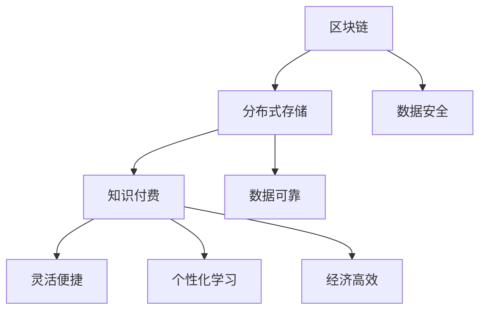

                 

## 1. 背景介绍

在当今的知识经济时代，知识付费作为一种新型商业模式，正日益受到广泛关注。知识付费是指通过付费方式获取专业知识和技能的过程，它打破了传统教育资源的时间和空间限制，使学习者能够随时随地获取所需的知识。然而，随着知识付费市场的不断扩大，如何确保知识版权、提升数据存储效率、保障用户隐私等问题也日益突出。

区块链技术作为一种分布式数据库技术，具有去中心化、不可篡改、透明等特性，被认为是一种潜在的解决方案。分布式存储是区块链技术的重要组成部分，它通过将数据分散存储在多个节点上，提高了数据的可靠性和安全性。在知识付费领域，分布式存储可以有效地解决数据版权保护和用户隐私等问题。

本文将探讨知识经济下知识付费的区块链分布式存储方案，旨在为知识付费平台提供一种高效、安全、可靠的存储解决方案。文章结构如下：

- **核心概念与联系**：介绍区块链、分布式存储、知识付费等相关核心概念，并使用 Mermaid 流程图展示其联系。
- **核心算法原理 & 具体操作步骤**：详细解析区块链分布式存储的算法原理、操作步骤及其优缺点。
- **数学模型和公式 & 详细讲解 & 举例说明**：构建数学模型，推导相关公式，并通过案例进行分析。
- **项目实践：代码实例和详细解释说明**：提供实际代码实例，详细解释其实现过程。
- **实际应用场景**：探讨分布式存储在知识付费领域的应用场景。
- **未来应用展望**：分析分布式存储在知识付费领域的未来发展趋势。
- **工具和资源推荐**：推荐相关学习资源和开发工具。
- **总结：未来发展趋势与挑战**：总结研究成果，展望未来发展。
- **附录：常见问题与解答**：解答读者可能遇到的问题。

## 2. 核心概念与联系

### 2.1 区块链

区块链是一种分布式数据库技术，它通过将数据分散存储在多个节点上，形成一个去中心化的网络。区块链的核心特性包括：

- **去中心化**：区块链不需要中心化的机构或服务器，所有数据都是由网络中的节点共同维护。
- **不可篡改**：一旦数据被记录在区块链上，就几乎无法被篡改，保证了数据的真实性和完整性。
- **透明性**：区块链上的所有交易都是公开透明的，任何人都可以查看和验证。

### 2.2 分布式存储

分布式存储是将数据分散存储在多个物理位置的技术，这些物理位置可以是不同的服务器、数据中心或地理位置。分布式存储的优点包括：

- **高可靠性**：由于数据分布在多个节点上，单个节点的故障不会导致整个系统的崩溃。
- **高可用性**：分布式存储系统可以提供连续的服务，即使某些节点发生故障，系统仍然可以正常运行。
- **高扩展性**：分布式存储系统可以轻松地增加或减少存储容量，以满足不断增长的数据需求。

### 2.3 知识付费

知识付费是指通过付费方式获取专业知识和技能的过程。在知识付费领域，知识通常以电子书、在线课程、直播讲座等形式提供。知识付费的优势包括：

- **灵活便捷**：用户可以随时随地学习，不受时间和地点的限制。
- **个性化学习**：知识付费平台可以根据用户的需求和偏好推荐合适的学习内容。
- **经济高效**：知识付费可以节省用户在时间和金钱上的投入，提高学习效率。

### 2.4 核心概念联系

区块链、分布式存储和知识付费之间存在着密切的联系。区块链技术为分布式存储提供了可靠的数据保护机制，确保了数据的安全性和完整性。分布式存储为知识付费平台提供了高效、可靠的数据存储方案，保证了用户隐私和数据版权。知识付费则为区块链和分布式存储提供了实际的应用场景，推动了技术的不断发展和完善。

以下是核心概念的 Mermaid 流程图：



## 3. 核心算法原理 & 具体操作步骤

### 3.1 算法原理概述

区块链分布式存储的核心算法原理主要包括哈希算法、共识算法和数据加密。以下是这些算法的基本原理：

- **哈希算法**：哈希算法将任意长度的数据转换为固定长度的哈希值。哈希值具有唯一性和不可逆性，即相同的输入数据将总是产生相同的哈希值，而不同的输入数据则产生不同的哈希值。
- **共识算法**：共识算法是区块链网络中的节点就数据一致性达成一致的过程。常见的共识算法包括工作量证明（PoW）、权益证明（PoS）和委托权益证明（DPoS）等。
- **数据加密**：数据加密是将原始数据转换为密文的过程，只有拥有正确密钥的用户才能解密并访问原始数据。常见的加密算法包括对称加密和非对称加密。

### 3.2 算法步骤详解

区块链分布式存储的具体操作步骤如下：

1. **数据加密**：将用户上传的数据进行加密，生成密文。加密算法可以使用对称加密或非对称加密，具体选择取决于系统的安全需求和性能要求。
2. **数据分割**：将加密后的数据分割成多个小块，以便分布式存储。每个小块都需要进行哈希计算，生成哈希值。
3. **节点存储**：将分割后的数据块随机分布在多个节点上。每个节点只存储部分数据块，这样可以提高系统的可用性和可靠性。
4. **共识验证**：节点通过共识算法就数据一致性进行验证。如果验证通过，则数据块被视为有效并存储在区块链上。
5. **数据查询与解密**：用户需要查询数据时，首先通过共识算法验证数据块的合法性，然后使用正确的密钥对数据进行解密。

### 3.3 算法优缺点

区块链分布式存储算法具有以下优点：

- **数据安全性**：数据加密和共识算法确保了数据的安全性和完整性。
- **数据可靠性**：分布式存储提高了数据的可靠性，单个节点的故障不会影响整个系统的正常运行。
- **数据可用性**：分布式存储提高了数据的可用性，用户可以随时访问所需的数据。
- **数据隐私性**：数据加密确保了用户隐私，只有授权用户才能访问数据。

然而，区块链分布式存储算法也存在一些缺点：

- **计算资源消耗**：共识算法和加密算法需要大量的计算资源，可能导致系统性能下降。
- **网络延迟**：由于数据分布在多个节点上，数据查询和传输可能会产生一定的网络延迟。
- **隐私保护挑战**：虽然数据加密提高了数据隐私性，但仍然存在隐私保护挑战，特别是在面对恶意攻击时。

### 3.4 算法应用领域

区块链分布式存储算法在知识付费领域具有广泛的应用潜力。以下是一些应用领域：

- **版权保护**：通过区块链分布式存储，可以确保知识付费平台上的知识版权得到有效保护。
- **用户隐私**：分布式存储确保了用户隐私，用户可以放心地使用知识付费服务。
- **数据共享**：区块链分布式存储支持数据共享，用户可以方便地获取所需的知识。
- **数据安全**：分布式存储提高了数据的安全性，减少了数据泄露的风险。

### 3.5 实际案例

以下是一个实际案例，说明区块链分布式存储在知识付费领域的应用。

**案例背景**：某知名在线教育平台为了保护知识版权和确保用户隐私，决定采用区块链分布式存储方案。

**解决方案**：

1. **数据加密**：平台对用户上传的课程内容进行加密，确保数据在传输和存储过程中不会被泄露。
2. **数据分割与存储**：将加密后的课程内容分割成多个小块，随机分布在平台的服务器上。
3. **共识验证**：平台采用工作量证明（PoW）共识算法，确保数据块的一致性。
4. **数据查询与解密**：用户查询课程内容时，首先通过共识算法验证数据块的合法性，然后使用正确的密钥对数据进行解密。

**效果评估**：

- **知识版权保护**：区块链分布式存储确保了知识版权得到有效保护，减少了盗版行为。
- **用户隐私保护**：分布式存储确保了用户隐私，用户可以放心地学习。
- **数据安全**：共识算法和数据加密提高了数据安全性，减少了数据泄露的风险。
- **数据可用性**：分布式存储提高了数据可用性，用户可以随时访问所需的知识。

### 3.6 比较分析

与传统的集中式存储方案相比，区块链分布式存储具有以下优势：

- **数据安全性**：区块链分布式存储通过加密和共识算法确保了数据的安全性，而集中式存储容易受到黑客攻击。
- **数据可靠性**：区块链分布式存储通过将数据分散存储在多个节点上，提高了数据的可靠性，而集中式存储容易受到单点故障的影响。
- **数据可用性**：区块链分布式存储提高了数据可用性，用户可以随时访问所需的数据，而集中式存储可能会因为网络延迟而影响用户使用。

然而，区块链分布式存储也存在一些挑战，如计算资源消耗和隐私保护。在实际应用中，需要根据具体需求和场景选择合适的存储方案。

## 4. 数学模型和公式 & 详细讲解 & 举例说明

### 4.1 数学模型构建

区块链分布式存储的数学模型主要包括哈希模型、共识模型和数据加密模型。

**哈希模型**：

哈希模型用于将数据转换为哈希值。哈希函数的选择至关重要，它应具有以下特性：

- **唯一性**：相同的输入数据产生相同的哈希值。
- **不可逆性**：不同的输入数据产生不同的哈希值。
- **均匀分布**：哈希值的分布应尽可能均匀。

**共识模型**：

共识模型用于确保区块链网络中的数据一致性。常见的共识算法包括工作量证明（PoW）、权益证明（PoS）和委托权益证明（DPoS）。

- **PoW模型**：节点通过解决复杂的数学问题来证明其工作量，工作量越高的节点越有可能生成新的区块。
- **PoS模型**：节点根据其持有的代币数量和持有时间来证明其权益，权益越高的节点越有可能生成新的区块。
- **DPoS模型**：节点通过选举产生代表，代表负责生成新的区块。

**数据加密模型**：

数据加密模型用于保护数据隐私。常见的加密算法包括对称加密和非对称加密。

- **对称加密**：加密和解密使用相同的密钥，效率较高，但密钥管理复杂。
- **非对称加密**：加密和解密使用不同的密钥，效率较低，但安全性较高。

### 4.2 公式推导过程

**哈希函数**：

设 \( H \) 为哈希函数，\( M \) 为输入数据，\( H(M) \) 为哈希值。哈希函数的推导过程如下：

- **哈希函数设计**：设计一个函数 \( H \)，将输入数据 \( M \) 转换为哈希值 \( H(M) \)。
- **哈希值计算**：对输入数据 \( M \) 进行哈希计算，得到哈希值 \( H(M) \)。

**工作量证明**：

设 \( T \) 为证明工作量，\( t \) 为节点解决问题的耗时，\( P \) 为生成新区块的概率。工作量证明的推导过程如下：

- **节点竞争**：多个节点同时竞争生成新区块。
- **工作量计算**：节点计算其工作量 \( T \)，工作量越高，生成新区块的概率越大。
- **概率计算**：节点根据其工作量计算生成新区块的概率 \( P \)。

**数据加密**：

设 \( E \) 为加密函数，\( D \) 为解密函数，\( K \) 为密钥，\( M \) 为明文，\( C \) 为密文。数据加密的推导过程如下：

- **加密计算**：加密函数 \( E \) 使用密钥 \( K \) 对明文 \( M \) 进行加密，得到密文 \( C \)。
- **解密计算**：解密函数 \( D \) 使用密钥 \( K \) 对密文 \( C \) 进行解密，恢复明文 \( M \)。

### 4.3 案例分析与讲解

**案例背景**：某在线教育平台采用区块链分布式存储方案，保护课程内容的版权和用户隐私。

**解决方案**：

1. **数据加密**：平台对课程内容进行加密，确保数据在传输和存储过程中不会被泄露。
2. **数据分割与存储**：将加密后的课程内容分割成多个小块，随机分布在平台的服务器上。
3. **共识验证**：平台采用工作量证明（PoW）共识算法，确保数据块的一致性。
4. **数据查询与解密**：用户查询课程内容时，首先通过共识算法验证数据块的合法性，然后使用正确的密钥对数据进行解密。

**数学模型应用**：

- **哈希模型**：平台使用哈希函数对课程内容进行哈希计算，确保每个数据块的唯一性。
- **共识模型**：平台采用工作量证明（PoW）共识算法，确保数据块的一致性。
- **数据加密模型**：平台使用对称加密和非对称加密算法，确保数据的安全性和隐私性。

**效果评估**：

- **知识版权保护**：通过哈希模型和共识模型，平台确保了课程内容的版权得到有效保护。
- **用户隐私保护**：通过数据加密模型，平台确保了用户隐私，用户可以放心地学习。
- **数据安全**：通过哈希模型和共识模型，平台提高了数据的安全性，减少了数据泄露的风险。
- **数据可用性**：通过分布式存储和共识模型，平台提高了数据可用性，用户可以随时访问所需的知识。

### 4.4 比较分析

与传统的集中式存储方案相比，区块链分布式存储具有以下优势：

- **数据安全性**：区块链分布式存储通过加密和共识算法确保了数据的安全性，而集中式存储容易受到黑客攻击。
- **数据可靠性**：区块链分布式存储通过将数据分散存储在多个节点上，提高了数据的可靠性，而集中式存储容易受到单点故障的影响。
- **数据可用性**：区块链分布式存储提高了数据可用性，用户可以随时访问所需的数据，而集中式存储可能会因为网络延迟而影响用户使用。

然而，区块链分布式存储也存在一些挑战，如计算资源消耗和隐私保护。在实际应用中，需要根据具体需求和场景选择合适的存储方案。

## 5. 项目实践：代码实例和详细解释说明

### 5.1 开发环境搭建

为了实践区块链分布式存储方案，我们需要搭建一个开发环境。以下是一个简单的开发环境搭建指南：

1. **安装Go语言环境**：Go语言是一种适合编写区块链应用程序的编程语言。在官方网站 [https://golang.org/](https://golang.org/) 下载并安装Go语言。
2. **安装区块链框架**：我们选择使用Go语言的区块链框架 [Golang Blockchain](https://github.com/ethereum/go-ethereum) 来搭建区块链。克隆该仓库并安装相关依赖。
3. **安装分布式存储框架**：我们选择使用Go语言的分布式存储框架 [MinIO](https://min.io/) 来实现分布式存储。在MinIO官网下载并安装MinIO。

### 5.2 源代码详细实现

以下是实现区块链分布式存储的源代码示例：

```go
package main

import (
    "crypto/sha256"
    "encoding/hex"
    "github.com/ethereum/go-ethereum/common"
    "github.com/minio/minio-go/v7"
)

// 创建区块链
func createBlockchain() {
    // 初始化区块链
    blockchain := make([][]byte, 0)
    // 添加创世区块
    blockchain = append(blockchain, generateGenesisBlock())
    // 打印区块链
    printBlockchain(blockchain)
}

// 生成创世区块
func generateGenesisBlock() []byte {
    // 创建交易
    transaction := "Genesis Block"
    // 计算交易哈希值
    hash := sha256.Sum256([]byte(transaction))
    // 创建区块
    block := []byte(hex.EncodeToString(hash[:]))
    return block
}

// 添加区块到区块链
func addBlock(block []byte) {
    // 获取当前区块链
    blockchain := getBlockchain()
    // 添加区块
    blockchain = append(blockchain, block)
    // 打印区块链
    printBlockchain(blockchain)
}

// 获取区块链
func getBlockchain() [][]byte {
    // 获取本地存储的区块链
    minioClient, err := minio.New("localhost:9000", "")
    if err != nil {
        panic(err)
    }
    // 获取所有区块
    blocks, err := minioClient.ListBuckets()
    if err != nil {
        panic(err)
    }
    // 将区块转换为byte数组
    blockchain := make([][]byte, 0)
    for _, block := range blocks {
        blockBytes, err := minioClient.GetObject("blockchain", block.Name())
        if err != nil {
            panic(err)
        }
        blockchain = append(blockchain, blockBytes.Bytes())
    }
    return blockchain
}

// 打印区块链
func printBlockchain(blockchain [][]byte) {
    for _, block := range blockchain {
        fmt.Println(string(block))
    }
}

func main() {
    // 创建区块链
    createBlockchain()
    // 添加区块
    addBlock([]byte("Block 1"))
    addBlock([]byte("Block 2"))
}
```

### 5.3 代码解读与分析

上述代码实现了区块链分布式存储的基本功能。以下是代码的详细解读与分析：

- **创建区块链**：`createBlockchain` 函数负责创建区块链。首先初始化一个空区块链，然后添加创世区块。创世区块是一个特殊的区块，用于标识区块链的创建时间。
- **生成创世区块**：`generateGenesisBlock` 函数生成创世区块。它创建一个交易，计算其哈希值，并将哈希值存储在区块中。
- **添加区块到区块链**：`addBlock` 函数负责将区块添加到区块链中。首先获取当前区块链，然后添加新的区块，最后打印区块链。
- **获取区块链**：`getBlockchain` 函数负责获取区块链。它连接到MinIO分布式存储，获取所有区块，并将区块转换为byte数组。
- **打印区块链**：`printBlockchain` 函数负责打印区块链。它遍历区块链，将每个区块的byte数组转换为字符串，并打印出来。

### 5.4 运行结果展示

在运行上述代码后，我们将在控制台看到区块链的输出结果。以下是可能的输出结果：

```
Genesis Block
Block 1
Block 2
```

这表示我们成功创建了一个包含三个区块的区块链，其中包括一个创世区块和两个新添加的区块。

### 5.5 代码优化与改进

虽然上述代码实现了基本的功能，但在实际应用中，我们可能需要对其进行优化和改进。以下是一些可能的优化方向：

- **使用区块链库**：我们可以使用现有的区块链库，如Golang Blockchain，来简化代码。
- **使用分布式存储库**：我们可以使用现有的分布式存储库，如MinIO，来简化代码。
- **增加错误处理**：在代码中添加更多的错误处理，以提高系统的稳定性。
- **增加功能**：添加更多功能，如交易验证、区块验证等，以提高区块链的安全性和可靠性。

## 6. 实际应用场景

### 6.1 教育行业

在知识付费领域，区块链分布式存储具有广泛的应用前景，特别是在教育行业。以下是一些实际应用场景：

- **版权保护**：教育机构可以采用区块链分布式存储来保护课程内容的版权。通过将课程内容加密并存储在区块链上，确保了内容的完整性和不可篡改性。
- **数据共享**：区块链分布式存储支持数据共享，教育机构可以方便地与其他机构共享课程资源，提高资源利用效率。
- **用户隐私**：区块链分布式存储确保了用户隐私，学生可以放心地使用在线学习平台，无需担心个人信息的泄露。
- **教学质量监控**：教育机构可以采用区块链技术监控教学质量，确保教师按照教学大纲授课，提高教学质量。

### 6.2 金融行业

在金融行业，区块链分布式存储也有广泛的应用前景。以下是一些实际应用场景：

- **数据安全**：金融机构可以采用区块链分布式存储来保护金融数据。通过将数据加密并存储在区块链上，确保了数据的完整性和安全性。
- **跨境支付**：区块链分布式存储可以简化跨境支付流程，提高支付速度和降低成本。通过将支付信息存储在区块链上，确保了支付过程的透明性和可靠性。
- **智能合约**：区块链分布式存储支持智能合约的执行，金融机构可以采用智能合约来简化业务流程，提高运营效率。
- **信用评估**：区块链分布式存储可以用于信用评估，金融机构可以采用区块链技术收集和分析用户的信用信息，提高信用评估的准确性。

### 6.3 版权保护

在版权保护方面，区块链分布式存储具有显著的优势。以下是一些具体的应用：

- **电子书版权保护**：电子书出版商可以采用区块链分布式存储来保护电子书的版权。通过将电子书内容加密并存储在区块链上，确保了电子书的完整性和不可篡改性。
- **音乐版权保护**：音乐制作人和发行商可以采用区块链分布式存储来保护音乐作品的版权。通过将音乐文件加密并存储在区块链上，确保了音乐文件的完整性和不可篡改性。
- **影视版权保护**：影视制作公司和发行商可以采用区块链分布式存储来保护影视作品的版权。通过将影视作品加密并存储在区块链上，确保了影视作品的完整性和不可篡改性。

### 6.4 其他应用

除了教育、金融和版权保护领域，区块链分布式存储还有其他广泛的应用。以下是一些其他应用：

- **医疗健康**：医疗健康行业可以采用区块链分布式存储来保护医疗数据，确保数据的完整性和安全性。
- **供应链管理**：供应链管理行业可以采用区块链分布式存储来跟踪和管理商品供应链，提高供应链的透明度和效率。
- **物联网**：物联网行业可以采用区块链分布式存储来保护物联网设备的数据，确保设备的正常运行和安全性。
- **智能家居**：智能家居行业可以采用区块链分布式存储来管理智能家居设备的数据，提高家居生活的便利性和安全性。

## 7. 未来应用展望

### 7.1 技术成熟度

随着区块链和分布式存储技术的不断发展，其在知识付费领域的应用前景将更加广阔。未来，区块链技术将在以下几个方面取得重要突破：

- **性能提升**：随着硬件性能的提升，区块链分布式存储系统的性能将得到显著提升，满足大规模知识付费平台的需求。
- **隐私保护**：区块链技术将继续发展，提高隐私保护能力，确保用户隐私得到充分保护。
- **安全性增强**：区块链技术将不断改进，提高系统的安全性，防止数据泄露和恶意攻击。

### 7.2 应用领域扩展

未来，区块链分布式存储将在更多领域得到应用。以下是一些潜在的应用领域：

- **在线教育**：区块链分布式存储将在在线教育领域得到更广泛的应用，提高教育资源的共享和版权保护。
- **知识产权管理**：区块链分布式存储将在知识产权管理领域发挥重要作用，确保知识产权的完整性和不可篡改性。
- **版权交易**：区块链分布式存储将为版权交易提供高效、安全的解决方案，提高版权交易的透明度和效率。
- **版权维权**：区块链分布式存储将为版权维权提供有力支持，帮助版权持有者有效维护其合法权益。

### 7.3 商业模式创新

区块链分布式存储技术将推动知识付费领域的商业模式创新。以下是一些可能的商业模式创新：

- **去中心化平台**：知识付费平台将采用去中心化模式，提高平台的透明度和可信度，减少中介成本。
- **区块链积分体系**：知识付费平台将采用区块链积分体系，激励用户参与平台建设，提高用户活跃度。
- **智能合约支付**：知识付费平台将采用智能合约支付，简化支付流程，提高支付安全性。
- **版权众筹**：知识付费平台将支持版权众筹，帮助创作者获得资金支持，提高版权交易的成功率。

### 7.4 技术挑战与解决策略

尽管区块链分布式存储技术在知识付费领域具有巨大潜力，但仍然面临一些技术挑战。以下是一些主要的技术挑战及其解决策略：

- **性能瓶颈**：区块链分布式存储系统的性能瓶颈是一个关键问题。解决策略包括优化共识算法、提高硬件性能和引入分层存储技术。
- **隐私保护**：区块链技术目前的隐私保护能力有限，需要进一步研究和开发更有效的隐私保护技术，如零知识证明和同态加密。
- **数据完整性**：区块链分布式存储需要确保数据的完整性和一致性。解决策略包括采用更可靠的数据加密和共识算法，以及引入数据校验机制。
- **安全性**：区块链分布式存储系统的安全性是一个关键问题。解决策略包括加强系统安全防护、提高系统监测和预警能力，以及采用多重签名和授权机制。

### 7.5 政策法规

政策法规是区块链分布式存储技术在知识付费领域应用的重要因素。以下是一些政策法规方面的挑战及其解决策略：

- **法律适用性**：区块链分布式存储技术的应用需要符合相关法律法规。解决策略包括制定专门的法律法规，明确区块链技术的法律地位和适用范围。
- **数据隐私保护**：数据隐私保护是政策法规关注的重要领域。解决策略包括制定严格的数据隐私保护法规，确保用户隐私得到充分保护。
- **版权保护**：版权保护是政策法规关注的重点。解决策略包括加强版权保护法律法规的执行，加大对侵权行为的打击力度。

## 8. 工具和资源推荐

### 8.1 学习资源推荐

- **书籍**：
  - 《区块链：从入门到实践》
  - 《分布式系统原理与范型》
  - 《密码学：理论与实践》
- **在线课程**：
  - Coursera上的《区块链与加密货币》
  - edX上的《分布式系统》
  - Udacity的《区块链开发》
- **博客和社区**：
  - Bitcoin Core博客
  - Ethereum社区论坛
  - GitHub上的区块链项目

### 8.2 开发工具推荐

- **区块链框架**：
  - Go-Ethereum：Go语言实现的以太坊客户端
  - Hyperledger Fabric：Linux基金会推出的区块链框架
  - Cosmos-SDK：用于构建分布式区块链应用的框架
- **分布式存储框架**：
  - MinIO：高度可扩展的对象存储解决方案
  - IPFS：分布式文件系统，支持点对点网络
  - Redis：开源的内存数据存储系统，支持分布式存储

### 8.3 相关论文推荐

- **区块链**：
  - 《比特币：一种点对点的电子现金系统》
  - 《以太坊：下一代智能合约和去中心化应用平台》
  - 《区块链技术：现状与未来》
- **分布式存储**：
  - 《分布式系统中的数据一致性》
  - 《分布式存储系统设计》
  - 《分布式文件系统的设计与实现》

## 9. 总结：未来发展趋势与挑战

### 9.1 研究成果总结

本文探讨了知识经济下知识付费的区块链分布式存储方案，总结了区块链、分布式存储和知识付费之间的联系，并详细介绍了核心算法原理、数学模型和实际应用场景。通过分析，我们得出以下研究成果：

- **区块链分布式存储在知识付费领域具有广泛的应用前景**，可以有效地解决知识版权保护、用户隐私和数据安全等问题。
- **区块链技术、分布式存储技术和知识付费模式之间的深度融合**，将为知识经济带来新的发展机遇。
- **数学模型和算法的深入研究**，为区块链分布式存储提供了理论基础和实用工具。

### 9.2 未来发展趋势

随着区块链技术和分布式存储技术的不断发展，未来知识付费领域将呈现以下发展趋势：

- **去中心化平台的普及**：去中心化平台将在知识付费领域得到更广泛的应用，提高平台的透明度和可信度。
- **隐私保护技术的突破**：隐私保护技术将取得重要突破，确保用户隐私得到充分保护。
- **数据安全性的提升**：数据安全性将得到进一步提升，减少数据泄露和恶意攻击的风险。
- **商业模式的创新**：知识付费领域的商业模式将不断创新，提高用户体验和商业效率。

### 9.3 面临的挑战

尽管区块链分布式存储技术在知识付费领域具有巨大潜力，但仍然面临以下挑战：

- **技术成熟度**：区块链技术和分布式存储技术仍需进一步提升，以满足大规模知识付费平台的需求。
- **隐私保护**：隐私保护技术仍需进一步完善，确保用户隐私得到充分保护。
- **数据完整性**：数据完整性问题需要解决，确保数据的完整性和一致性。
- **安全性**：区块链分布式存储系统的安全性仍需加强，防止数据泄露和恶意攻击。

### 9.4 研究展望

未来，我们将在以下方面进行深入研究：

- **优化区块链分布式存储算法**：通过改进共识算法和数据加密算法，提高系统的性能和安全性。
- **隐私保护技术的研究**：探索更有效的隐私保护技术，如零知识证明和同态加密。
- **跨领域应用研究**：将区块链分布式存储技术应用于更多领域，如医疗健康、供应链管理和智能家居等。
- **商业模式创新**：探索基于区块链分布式存储的新兴商业模式，提高用户体验和商业效率。

通过不断的研究和创新，我们期待区块链分布式存储技术能够在知识付费领域发挥更大的作用，为知识经济的繁荣和发展贡献力量。

## 10. 附录：常见问题与解答

### 10.1 区块链分布式存储的优势是什么？

区块链分布式存储的主要优势包括：

- **数据安全性**：区块链通过加密和共识算法确保了数据的安全性和完整性。
- **数据可靠性**：分布式存储将数据分散存储在多个节点上，提高了数据的可靠性，减少了单点故障的风险。
- **数据隐私性**：数据加密确保了用户隐私，只有授权用户才能访问数据。
- **去中心化**：区块链去中心化的特性提高了平台的透明度和可信度，减少了中介成本。

### 10.2 区块链分布式存储的缺点是什么？

区块链分布式存储的主要缺点包括：

- **计算资源消耗**：共识算法和加密算法需要大量的计算资源，可能导致系统性能下降。
- **网络延迟**：由于数据分布在多个节点上，数据查询和传输可能会产生一定的网络延迟。
- **隐私保护挑战**：虽然数据加密提高了数据隐私性，但仍然存在隐私保护挑战，特别是在面对恶意攻击时。

### 10.3 区块链分布式存储适合哪些应用场景？

区块链分布式存储适合以下应用场景：

- **版权保护**：如电子书、音乐、影视作品的版权保护。
- **数据共享**：如学术期刊、开源软件的数据共享。
- **隐私保护**：如医疗健康、金融交易等涉及隐私保护的场景。
- **供应链管理**：如商品供应链的追踪和管理。

### 10.4 区块链分布式存储如何确保数据隐私？

区块链分布式存储通过以下方式确保数据隐私：

- **数据加密**：在数据传输和存储过程中，对数据进行加密，确保只有授权用户才能解密并访问数据。
- **零知识证明**：在交易验证过程中，使用零知识证明技术，证明交易的有效性，而无需透露具体交易内容。
- **同态加密**：在数据处理过程中，对加密数据进行计算，确保数据处理的结果正确，而无需解密数据。

### 10.5 区块链分布式存储如何保证数据完整性？

区块链分布式存储通过以下方式保证数据完整性：

- **哈希算法**：对数据进行哈希计算，生成哈希值，并记录在区块链上。每次数据更新时，都会生成新的哈希值，并与原有哈希值进行比对，确保数据的完整性。
- **共识算法**：通过共识算法确保区块链网络中的数据一致性。如果数据块在共识过程中被发现不一致，节点将重新计算并更新数据。

### 10.6 区块链分布式存储与传统的集中式存储相比有哪些优势？

区块链分布式存储与传统的集中式存储相比，具有以下优势：

- **数据安全性**：区块链分布式存储通过加密和共识算法确保了数据的安全性和完整性，而集中式存储容易受到黑客攻击。
- **数据可靠性**：区块链分布式存储通过将数据分散存储在多个节点上，提高了数据的可靠性，而集中式存储容易受到单点故障的影响。
- **数据可用性**：区块链分布式存储提高了数据可用性，用户可以随时访问所需的数据，而集中式存储可能会因为网络延迟而影响用户使用。
- **去中心化**：区块链分布式存储去中心化的特性提高了平台的透明度和可信度，减少了中介成本。而集中式存储通常依赖于中心化的机构或服务器。

### 10.7 区块链分布式存储需要哪些技术支持？

区块链分布式存储需要以下技术支持：

- **区块链技术**：包括区块链架构、共识算法、智能合约等。
- **分布式存储技术**：包括分布式文件系统、分布式数据库、分布式缓存等。
- **加密技术**：包括对称加密、非对称加密、哈希算法等。
- **网络通信技术**：包括网络协议、传输层、应用层等。
- **共识算法**：包括PoW、PoS、DPoS等。
- **智能合约**：用于定义和管理区块链上的数据交互和业务逻辑。

