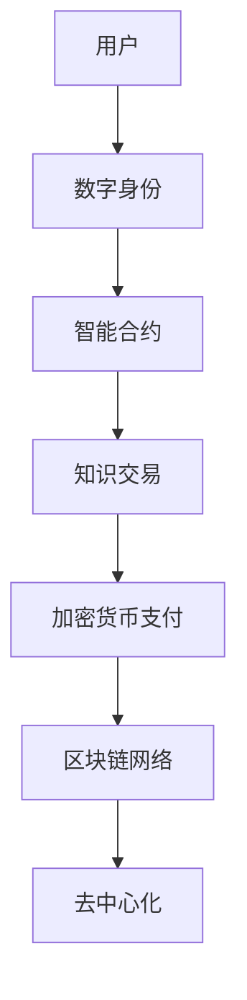

                 

关键词：知识付费、区块链、知识经济、去中心化、智能合约、加密货币、数字身份、用户权益保护、数据分析、平台构建、应用场景

>摘要：随着知识经济的兴起，知识付费逐渐成为行业新风口。本文将探讨在知识经济下，区块链技术在知识付费领域的应用与发展。我们将从核心概念、算法原理、数学模型、项目实践以及实际应用场景等多个角度，深入分析区块链在知识付费中的潜在价值，并提出未来发展展望。

## 1. 背景介绍

### 1.1 知识经济下的知识付费

知识经济是继农业经济、工业经济之后的一种新的经济形态，其核心是知识的创造、传播和应用。在知识经济下，知识付费成为了一种重要的商业模式。知识付费是指用户为获取特定领域的知识或技能，向知识提供方支付费用的一种行为。这种模式在在线教育、专业咨询、版权交易等多个领域得到了广泛应用。

### 1.2 区块链技术简介

区块链是一种分布式数据库技术，具有去中心化、不可篡改、透明性等特性。区块链通过加密算法确保数据的完整性和安全性，同时利用共识算法实现分布式网络中的信任机制。区块链技术的这些特性使其在多个领域具有广泛的应用潜力，包括金融、物流、医疗等。

### 1.3 区块链与知识付费的结合

知识付费与区块链技术的结合，可以解决传统知识付费模式中的诸多痛点，如信任问题、透明性问题、安全性问题等。区块链技术可以为知识付费提供去中心化的解决方案，实现用户权益的保护、知识传播的透明性以及交易的安全性和高效性。

## 2. 核心概念与联系

### 2.1 去中心化

去中心化是区块链技术的一个核心概念，意味着数据的存储和验证不再依赖于中心化的服务器或机构，而是通过分布式的网络节点共同完成。在知识付费领域，去中心化可以减少平台中介的参与，降低交易成本，提高交易效率。

### 2.2 智能合约

智能合约是区块链上的程序，可以在满足特定条件时自动执行。在知识付费中，智能合约可以用于自动执行交易、支付、合同管理等流程，提高交易的自动化和安全性。

### 2.3 加密货币

加密货币是基于区块链技术的数字货币，具有去中心化、匿名性等特点。在知识付费中，加密货币可以作为一种支付手段，提高交易的便捷性和安全性。

### 2.4 数字身份

数字身份是指用户在区块链上的身份标识，通过加密算法确保身份的唯一性和安全性。在知识付费中，数字身份可以用于认证用户身份、保护用户隐私，同时方便用户在平台上的交流和交易。

### 2.5 Mermaid 流程图



## 3. 核心算法原理 & 具体操作步骤

### 3.1 算法原理概述

区块链在知识付费中的应用主要依赖于以下核心算法：

1. **加密算法**：用于保护用户隐私和数据安全。
2. **共识算法**：用于分布式网络中的数据一致性验证。
3. **智能合约执行算法**：用于自动执行交易和合约。

### 3.2 算法步骤详解

1. **用户注册与数字身份生成**：
   - 用户在知识付费平台上注册。
   - 平台使用加密算法为用户生成数字身份。

2. **知识交易与智能合约执行**：
   - 用户购买知识产品。
   - 智能合约自动执行交易，确保支付与交付的同步。

3. **加密货币支付**：
   - 用户使用加密货币进行支付。
   - 区块链网络验证支付并记录交易。

4. **数据存储与去中心化**：
   - 知识产品及相关数据存储在区块链上。
   - 分布式网络共同维护数据的一致性和安全性。

### 3.3 算法优缺点

**优点**：
- **安全性**：加密算法和共识算法确保数据的安全和完整性。
- **去中心化**：分布式网络减少中心化机构的依赖，提高交易效率。
- **透明性**：区块链上的交易记录公开透明，便于监督。

**缺点**：
- **计算资源消耗**：共识算法需要大量计算资源，可能导致能源消耗。
- **交易效率**：区块链上的交易处理速度相对较慢，可能不适合高频交易。

### 3.4 算法应用领域

区块链在知识付费中的应用主要包括以下领域：

- **在线教育**：实现去中心化的课程交易和学习认证。
- **专业咨询**：提供安全可靠的知识交易和咨询服务。
- **版权交易**：保障知识版权的合法性和权益分配。

## 4. 数学模型和公式 & 详细讲解 & 举例说明

### 4.1 数学模型构建

在知识付费的区块链应用中，我们可以构建以下数学模型：

1. **加密模型**：
   - 数据加密：\( E_k(D) = C \)
   - 数据解密：\( D_k(C) = P \)

   其中，\( E_k \) 和 \( D_k \) 分别为加密和解密函数，\( k \) 为密钥，\( D \) 为原始数据，\( C \) 为加密后的数据，\( P \) 为解密后的数据。

2. **共识模型**：
   - 一致性验证：\( V(G, P) \)
   - 节点同步：\( S(N, G) \)

   其中，\( V \) 为一致性验证函数，\( G \) 为区块链上的交易记录，\( P \) 为验证参数，\( N \) 为参与验证的节点。

### 4.2 公式推导过程

1. **加密模型推导**：
   - 加密过程：
     \[
     E_k(D) = C = D_k^{-1}(D)
     \]
     其中，\( D_k^{-1} \) 为密钥 \( k \) 的逆函数。

   - 解密过程：
     \[
     D_k(C) = P = D_k(D_k^{-1}(D))
     \]

2. **共识模型推导**：
   - 一致性验证：
     \[
     V(G, P) = \begin{cases}
       1, & \text{如果 } G \text{ 满足一致性条件} \\
       0, & \text{如果 } G \text{ 不满足一致性条件}
     \end{cases}
     \]

   - 节点同步：
     \[
     S(N, G) = \begin{cases}
       1, & \text{如果 } N \text{ 中的每个节点都验证通过} \\
       0, & \text{如果 } N \text{ 中有节点验证失败}
     \end{cases}
     \]

### 4.3 案例分析与讲解

以在线教育为例，假设用户 A 购买课程 B，我们可以使用以下公式进行计算：

1. **加密课程内容**：
   \[
   C_B = E_{k_B}(B)
   \]

2. **用户 A 付款**：
   \[
   A \rightarrow B: \text{加密货币} C_A
   \]

3. **智能合约执行**：
   \[
   C_B \rightarrow A: \text{解密后的课程内容} B
   \]

通过以上步骤，用户 A 可以安全地获取课程 B 的内容，而交易过程由智能合约自动执行，确保了交易的安全性和高效性。

## 5. 项目实践：代码实例和详细解释说明

### 5.1 开发环境搭建

在实践项目中，我们需要搭建以下开发环境：

1. **区块链平台**：使用以太坊（Ethereum）作为底层区块链平台。
2. **智能合约开发工具**：使用 Truffle 或 Remix 进行智能合约开发。
3. **前端框架**：使用 React 或 Vue.js 开发前端界面。
4. **后端服务**：使用 Node.js 或 Python 搭建后端服务。

### 5.2 源代码详细实现

以下是一个简单的知识付费智能合约的实现示例：

```solidity
// SPDX-License-Identifier: MIT
pragma solidity ^0.8.0;

contract KnowledgePay {

    mapping(address => mapping(bytes32 => bool)) public coursesPurchased;

    function purchaseCourse(bytes32 _courseId) external payable {
        require(!coursesPurchased[msg.sender][_courseId], "Course already purchased");
        coursesPurchased[msg.sender][_courseId] = true;
        // 发送加密课程内容到用户地址
        // ...
    }

    function refundCourse(bytes32 _courseId) external {
        require(coursesPurchased[msg.sender][_courseId], "No course purchased");
        coursesPurchased[msg.sender][_courseId] = false;
        // 退还用户加密货币
        // ...
    }

    // 其他相关函数
    // ...
}
```

### 5.3 代码解读与分析

1. **合约结构**：
   - `coursesPurchased`：一个映射结构，用于记录用户是否已购买特定课程。
   - `purchaseCourse`：一个外部调用函数，用于购买课程。
   - `refundCourse`：一个外部调用函数，用于退还课程费用。

2. **代码逻辑**：
   - `purchaseCourse`：检查用户是否已购买课程，如果未购买，则更新映射结构并接收加密课程内容。
   - `refundCourse`：检查用户是否已购买课程，如果是，则更新映射结构并退还加密货币。

### 5.4 运行结果展示

运行以上智能合约，用户可以通过前端界面购买课程，并接收加密课程内容。当用户需要退款时，可以通过前端界面发起退款请求，智能合约将根据用户是否已购买课程执行退款操作。

## 6. 实际应用场景

### 6.1 在线教育

区块链技术可以为在线教育提供去中心化的课程交易和认证服务，提高教育质量和用户体验。

### 6.2 专业咨询

区块链技术可以保障专业咨询服务的安全性和可靠性，提高用户信任度。

### 6.3 版权交易

区块链技术可以用于版权交易，确保知识版权的合法性和权益分配。

### 6.4 未来应用展望

随着区块链技术的不断成熟，知识付费领域将迎来更多创新和应用，如去中心化的版权交易平台、知识共享社区等。

## 7. 工具和资源推荐

### 7.1 学习资源推荐

- 《精通区块链》
- 《智能合约开发实战》
- 《区块链应用实践》

### 7.2 开发工具推荐

- Truffle
- Remix
- MetaMask

### 7.3 相关论文推荐

- 《区块链技术原理与应用》
- 《智能合约的安全性问题研究》
- 《基于区块链的知识付费模型设计》

## 8. 总结：未来发展趋势与挑战

### 8.1 研究成果总结

本文从核心概念、算法原理、数学模型、项目实践等多个角度，探讨了区块链在知识付费领域的应用与发展。研究表明，区块链技术可以为知识付费提供去中心化的解决方案，提高交易安全性和透明性。

### 8.2 未来发展趋势

随着区块链技术的不断成熟，知识付费领域将迎来更多创新和应用。未来，去中心化的知识共享平台、版权交易平台等有望成为主流。

### 8.3 面临的挑战

- **技术成熟度**：区块链技术在性能、安全性等方面仍有待提高。
- **法规政策**：区块链技术的监管政策需要不断完善。

### 8.4 研究展望

未来，我们需要进一步研究区块链技术在知识付费领域的应用，探索更多创新解决方案，推动行业的发展。

## 9. 附录：常见问题与解答

### 9.1 区块链技术如何保障知识付费的安全性？

区块链技术通过加密算法和共识算法确保数据的安全和完整性，同时去中心化的网络结构减少了单点故障的风险。

### 9.2 区块链技术如何提高知识付费的透明性？

区块链上的交易记录公开透明，用户可以随时查询和验证交易过程，确保交易的透明性和公正性。

### 9.3 区块链技术如何降低知识付费的成本？

区块链技术去中心化的特性减少了中介机构的参与，降低了交易成本，提高了交易效率。

作者：禅与计算机程序设计艺术 / Zen and the Art of Computer Programming
------------------------------------------------------------------------

