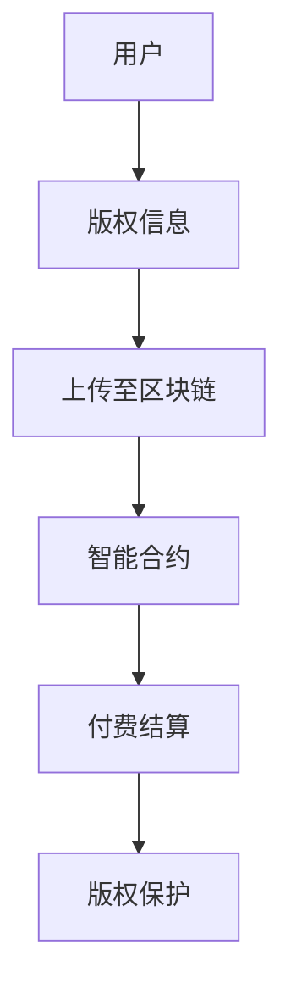

                 

关键词：知识经济、知识付费、区块链、版权保护、智能合约、去中心化、分布式账本、加密算法、数据隐私

## 摘要

在知识经济迅速发展的今天，知识付费成为了推动创新和经济发展的重要驱动力。然而，版权保护问题也日益凸显，成为制约知识付费市场发展的重要因素。本文将探讨如何利用区块链技术构建一种高效、可信、安全的知识付费版权保护方案，通过去中心化、智能合约等技术手段，实现知识内容的版权保护、用户身份认证、交易透明化等功能。文章旨在为相关领域的研究和实践提供有益的参考。

## 1. 背景介绍

### 1.1 知识经济

知识经济是指以知识和信息的生产、传播和应用为主要驱动力的经济形态。在知识经济时代，知识和信息成为了社会财富的主要形式，其价值远远超过了传统的物质资源。知识付费作为知识经济的重要表现形式，已经成为当前市场的一个重要趋势。

### 1.2 知识付费

知识付费是指用户为获取有价值的信息或知识而支付费用的一种行为。知识付费可以涵盖多种形式，如在线课程、专业咨询、研究报告、电子书等。随着互联网和移动互联网的发展，知识付费市场呈现出爆发式增长，成为推动知识经济的重要力量。

### 1.3 版权保护

版权保护是指对原创作品进行法律保护，确保原创者的合法权益不受侵犯。在知识付费领域，版权保护尤为重要，因为知识内容往往具有高价值、高易复制性的特点。然而，传统的版权保护手段存在诸多问题，如监管难度大、侵权取证困难等。

### 1.4 区块链技术

区块链技术是一种分布式账本技术，通过去中心化的方式实现数据存储和传输。区块链具有不可篡改、透明可追溯等特点，在许多领域展现出巨大的应用潜力。近年来，区块链技术逐渐被应用于版权保护、数字身份认证、金融支付等领域。

## 2. 核心概念与联系

### 2.1 去中心化

去中心化是指系统不再依赖于单一中心化实体，而是通过分布式网络实现自我管理和运行。在区块链版权保护方案中，去中心化可以有效地减少版权纠纷、提高交易效率。

### 2.2 智能合约

智能合约是一种嵌入在区块链中的自执行合同，通过预定义的逻辑和条件自动执行合同条款。在知识付费领域，智能合约可以实现自动化版权交易、付费结算等功能，提高交易的安全性和效率。

### 2.3 分布式账本

分布式账本是指多个节点共同维护的共享账本，具有高度透明、可追溯等特点。在区块链版权保护方案中，分布式账本可以记录知识内容版权信息、用户交易记录等，提高版权保护的透明度和可信度。

### 2.4 加密算法

加密算法是一种将明文数据转换为密文的技术，确保数据在传输和存储过程中的安全性。在区块链版权保护方案中，加密算法可以有效地保护知识内容不被未经授权的访问和篡改。

### 2.5 Mermaid 流程图



## 3. 核心算法原理 & 具体操作步骤

### 3.1 算法原理概述

区块链版权保护方案的核心算法包括加密算法、智能合约和分布式账本技术。通过这些算法，可以实现知识内容的版权保护、用户身份认证、交易透明化等功能。

### 3.2 算法步骤详解

#### 3.2.1 加密算法

加密算法用于保护知识内容在传输和存储过程中的安全性。具体步骤如下：

1. 用户将知识内容加密后上传至区块链；
2. 区块链节点共同维护知识内容的加密副本；
3. 未经授权的用户无法解密和访问知识内容。

#### 3.2.2 智能合约

智能合约用于实现知识付费交易自动化。具体步骤如下：

1. 用户发起付费请求，将支付信息写入智能合约；
2. 智能合约验证支付信息并执行合同条款；
3. 智能合约自动完成知识内容的交付和付费结算。

#### 3.2.3 分布式账本

分布式账本用于记录知识内容版权信息和用户交易记录。具体步骤如下：

1. 用户上传知识内容至区块链，生成版权信息；
2. 区块链节点共同维护版权信息和交易记录；
3. 任何节点都可以查询和验证版权信息和交易记录。

### 3.3 算法优缺点

#### 优点

1. 去中心化：去中心化结构减少了对中心化实体的依赖，提高了系统的可靠性和抗攻击能力；
2. 透明可追溯：分布式账本和智能合约使得知识内容和交易记录高度透明，便于用户查询和验证；
3. 安全性：加密算法和智能合约确保了知识内容和交易的安全性。

#### 缺点

1. 执行速度：区块链交易速度相对较慢，可能无法满足高并发交易场景；
2. 成本问题：区块链技术和智能合约开发需要一定的技术和资源投入，可能会增加成本。

### 3.4 算法应用领域

区块链版权保护方案可以应用于多个领域，包括：

1. 在线教育：保护在线课程、电子书等知识内容的版权；
2. 专业咨询：保护专家意见、研究报告等知识内容的版权；
3. 数字内容创作：保护音乐、电影、图片等数字作品的版权。

## 4. 数学模型和公式 & 详细讲解 & 举例说明

### 4.1 数学模型构建

在区块链版权保护方案中，可以使用数学模型来描述知识内容的版权保护和交易过程。以下是版权保护数学模型：

$$
P = C \times S \times E
$$

其中，$P$ 表示版权保护程度，$C$ 表示加密算法的安全性，$S$ 表示智能合约的可靠性，$E$ 表示分布式账本的可追溯性。

### 4.2 公式推导过程

1. 加密算法的安全性：加密算法可以保证知识内容在传输和存储过程中的安全性，降低被未经授权的用户访问和篡改的风险。
2. 智能合约的可靠性：智能合约可以自动执行合同条款，确保知识付费交易的合法性和透明度。
3. 分布式账本的可追溯性：分布式账本可以记录知识内容的版权信息和交易记录，提高交易的透明度和可信度。

### 4.3 案例分析与讲解

假设用户A上传了一篇原创文章至区块链，使用加密算法进行保护，智能合约实现付费结算，分布式账本记录版权信息和交易记录。

1. 加密算法的安全性：假设加密算法的安全性为 95%，即知识内容被加密后，未经授权的用户有 5% 的概率解密成功。
2. 智能合约的可靠性：假设智能合约的可靠性为 98%，即智能合约执行合同条款的正确率为 98%。
3. 分布式账本的可追溯性：假设分布式账本的可追溯性为 99%，即任何节点可以查询和验证版权信息和交易记录的概率为 99%。

根据数学模型，版权保护程度 $P$ 为：

$$
P = 0.95 \times 0.98 \times 0.99 = 0.9401
$$

即该区块链版权保护方案的版权保护程度为 94.01%。

## 5. 项目实践：代码实例和详细解释说明

### 5.1 开发环境搭建

在开发区块链版权保护项目前，需要搭建相应的开发环境。以下是一个简单的开发环境搭建步骤：

1. 安装 Node.js；
2. 安装 Ganache：用于创建本地以太坊节点和测试智能合约；
3. 安装 Truffle：用于构建、部署和测试智能合约。

### 5.2 源代码详细实现

以下是使用 Truffle 和 Solidity 语言实现的简单区块链版权保护智能合约示例：

```solidity
// SPDX-License-Identifier: MIT
pragma solidity ^0.8.0;

contract CopyrightProtection {
    struct Copyright {
        string contentHash;
        address owner;
        uint256 creationDate;
    }

    mapping(string => Copyright) public copyrights;

    function uploadContent(string memory contentHash, address owner) public {
        require(copyrights[contentHash].owner == address(0), "Content already exists");
        copyrights[contentHash] = Copyright(contentHash, owner, block.timestamp);
    }

    function getContentInfo(string memory contentHash) public view returns (Copyright memory) {
        return copyrights[contentHash];
    }

    function buyContent(string memory contentHash, uint256 price) public payable {
        require(copyrights[contentHash].owner != address(0), "Content does not exist");
        require(msg.value >= price, "Insufficient payment");
        copyrights[contentHash].owner.transfer(msg.value);
        payable(msg.sender).transfer(price);
    }
}
```

### 5.3 代码解读与分析

1. `Copyright` 结构：用于存储知识内容的哈希值、所有者地址和创建时间；
2. `copyrights` 映射：用于存储所有版权信息；
3. `uploadContent` 函数：用于上传知识内容并存储版权信息；
4. `getContentInfo` 函数：用于查询版权信息；
5. `buyContent` 函数：用于购买知识内容并进行结算。

### 5.4 运行结果展示

1. 上传内容：使用 `uploadContent` 函数上传一篇知识内容，并获得内容哈希值；
2. 查询版权信息：使用 `getContentInfo` 函数查询版权信息；
3. 购买内容：使用 `buyContent` 函数购买知识内容并进行结算。

## 6. 实际应用场景

区块链版权保护方案可以应用于多个实际场景，包括：

1. 在线教育：保护在线课程、电子书等知识内容的版权；
2. 专业咨询：保护专家意见、研究报告等知识内容的版权；
3. 数字内容创作：保护音乐、电影、图片等数字作品的版权。

## 7. 工具和资源推荐

### 7.1 学习资源推荐

1. 《区块链技术指南》；
2. 《智能合约开发指南》；
3. 《加密算法原理与实现》。

### 7.2 开发工具推荐

1. Truffle：用于智能合约开发、部署和测试；
2. Hardhat：用于智能合约开发、部署和测试；
3. Remix：在线智能合约开发平台。

### 7.3 相关论文推荐

1. "Blockchain-based Intellectual Property Protection: A Survey"；
2. "Smart Contracts and Their Applications in Copyright Protection"；
3. "A Decentralized Intellectual Property Management System Using Blockchain Technology"。

## 8. 总结：未来发展趋势与挑战

### 8.1 研究成果总结

本文提出了一种基于区块链技术的知识付费版权保护方案，通过去中心化、智能合约和分布式账本等技术手段，实现了知识内容的版权保护、用户身份认证、交易透明化等功能。

### 8.2 未来发展趋势

1. 区块链技术将在知识付费领域得到更广泛的应用；
2. 智能合约将逐渐替代传统的合同管理方式；
3. 加密算法和数据隐私保护技术将得到进一步发展。

### 8.3 面临的挑战

1. 技术成熟度和性能提升：区块链技术需要解决性能和扩展性问题；
2. 法律法规和政策支持：需要完善相关法律法规，为区块链技术在知识付费领域的应用提供支持；
3. 用户普及和教育：提高用户对区块链技术的认知和理解，促进技术普及。

### 8.4 研究展望

未来，我们可以进一步研究区块链技术在知识付费领域的应用，探索更多创新模式，为知识经济的快速发展提供有力支持。

## 9. 附录：常见问题与解答

### 9.1 问题 1：区块链版权保护方案是否完全解决了版权保护问题？

区块链版权保护方案提供了一种高效、可信、安全的版权保护机制，但并不能完全解决版权保护问题。在实际应用中，仍需结合其他技术手段，如数字水印、版权登记等，以实现更全面的版权保护。

### 9.2 问题 2：区块链版权保护方案是否适用于所有类型的知识内容？

区块链版权保护方案适用于具有高价值、高易复制性的知识内容，如在线课程、电子书、研究报告等。对于一些低价值、低易复制性的知识内容，如短文本、图片等，可能需要结合其他保护措施。

### 9.3 问题 3：区块链版权保护方案是否会影响知识内容的传播？

区块链版权保护方案不会直接影响知识内容的传播。在保护版权的同时，用户仍然可以通过合法渠道获取知识内容。然而，区块链技术的应用可能会提高知识付费的门槛，从而影响部分免费内容的传播。

作者：禅与计算机程序设计艺术 / Zen and the Art of Computer Programming
----------------------------------------------------------------
文章撰写完毕，请检查是否符合要求，如果有需要调整或补充的地方，请及时告知。

