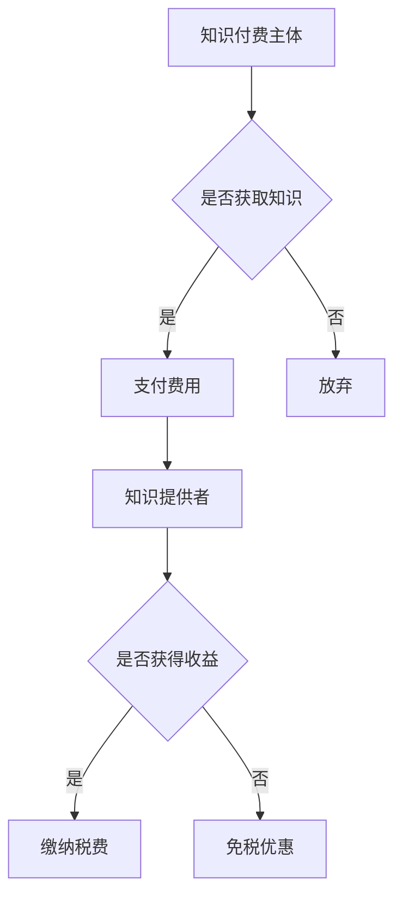

                 

关键词：知识经济，知识付费，税收政策，税收优惠，解读，技术博客。

> 摘要：本文旨在深入解析知识经济时代下，知识付费行业的税收优惠政策。通过对我国现行税收政策的分析，结合实际案例，探讨了税收优惠政策对知识付费行业的促进作用及其潜在影响。

## 1. 背景介绍

知识经济是以知识为核心资源的经济形态，其特点是知识创新、知识传播和知识应用的加速。在知识经济时代，知识付费作为一种新兴商业模式，正日益受到关注。知识付费是指用户为获取知识、技能或经验而支付的费用，常见形式包括在线课程、付费咨询、知识付费平台等。

税收政策是国家调节经济的重要手段，合理有效的税收政策可以促进知识付费行业健康发展。税收优惠政策作为税收政策的重要组成部分，对于鼓励创新、支持企业发展具有重要意义。本文将围绕知识付费的税收优惠政策展开讨论，分析其现状、作用及未来发展趋势。

## 2. 核心概念与联系

### 2.1 知识付费

知识付费是指用户为获取知识、技能或经验而支付的费用。其核心概念包括：

- **付费主体**：用户，包括个人和企业。
- **付费对象**：知识提供者，如专家、讲师、知识平台。
- **付费方式**：在线支付、积分兑换等。

### 2.2 税收政策

税收政策是国家依据税法及相关法律法规制定的关于税收的具体措施。核心概念包括：

- **税收主体**：国家。
- **税收对象**：纳税人和征税对象。
- **税收目的**：筹集财政收入、调节经济、保障社会福利等。

### 2.3 税收优惠政策

税收优惠政策是指国家为了鼓励和支持某些行业或特定企业的发展，在一定时期内对其减免税收的一种措施。核心概念包括：

- **优惠政策形式**：免税、减税、退税、税收抵免等。
- **优惠对象**：知识付费行业及其相关企业。

### 2.4 Mermaid 流程图



## 3. 核心算法原理 & 具体操作步骤

### 3.1 算法原理概述

税收优惠政策的制定和实施，通常需要遵循以下核心算法原理：

- **收益原则**：税收优惠政策应根据企业的实际收益情况制定，确保企业能够获得实际优惠。
- **公平原则**：税收优惠政策应确保不同企业的税负公平，避免因优惠政策导致的市场失灵。
- **动态调整**：税收优惠政策应根据经济发展和市场变化进行动态调整，以保持其有效性。

### 3.2 算法步骤详解

#### 3.2.1 收益评估

1. 收集企业财务数据，包括收入、成本、利润等。
2. 对企业收益进行评估，确定是否符合税收优惠政策条件。
3. 对不符合条件的，应进行进一步调查和核实。

#### 3.2.2 优惠政策制定

1. 根据企业收益评估结果，制定具体的税收优惠政策。
2. 确定优惠政策的实施范围、对象、期限等。
3. 制定相关法规文件，确保政策落地实施。

#### 3.2.3 政策执行与监督

1. 企业按照优惠政策规定缴纳税费。
2. 税务部门对政策执行情况进行监督，确保政策实施效果。
3. 对发现的问题进行整改和纠正。

### 3.3 算法优缺点

#### 优点

- **促进创新**：税收优惠政策可以鼓励企业加大研发投入，促进技术创新。
- **优化资源配置**：通过税收优惠，可以引导资金流向知识付费行业，优化资源配置。
- **增强竞争力**：税收优惠政策可以降低企业成本，提高企业竞争力。

#### 缺点

- **税收流失**：税收优惠政策可能导致税收收入减少，影响国家财政收入。
- **公平性问题**：部分企业可能因政策不公获得过多优惠，影响市场公平竞争。

### 3.4 算法应用领域

税收优惠政策广泛应用于知识付费行业，如在线教育、技术咨询、知识付费平台等。具体应用领域包括：

- **在线教育**：鼓励企业开展在线教育业务，提高教育普及率。
- **技术咨询**：支持企业提供专业技术服务，促进产业升级。
- **知识付费平台**：降低平台运营成本，提高用户满意度。

## 4. 数学模型和公式 & 详细讲解 & 举例说明

### 4.1 数学模型构建

税收优惠政策的数学模型通常包括以下要素：

- **收益函数**：表示企业收益与税收优惠之间的关系。
- **成本函数**：表示企业运营成本与税收优惠之间的关系。
- **利润函数**：表示企业利润与税收优惠之间的关系。

### 4.2 公式推导过程

假设企业收益为 $R$，运营成本为 $C$，税收优惠政策为 $T$，则企业利润函数为：

$$
P = R - C - T
$$

其中，$T$ 的取值取决于企业的收益和成本。具体推导过程如下：

1. 收益函数 $R$：
$$
R = f(S, T)
$$

其中，$S$ 为企业销售收入，$T$ 为税收优惠政策。

2. 成本函数 $C$：
$$
C = g(H, T)
$$

其中，$H$ 为企业运营成本，$T$ 为税收优惠政策。

3. 利润函数 $P$：
$$
P = R - C - T
$$

4. 利润最大化条件：
$$
\frac{dP}{dT} = 0
$$

### 4.3 案例分析与讲解

#### 案例背景

某知识付费平台，年销售收入为 1000 万元，运营成本为 500 万元，假设该平台符合我国现行税收优惠政策条件。

#### 案例分析

1. 收益函数 $R$：
$$
R = 1000 \times (1 + T)
$$

2. 成本函数 $C$：
$$
C = 500 \times (1 - T)
$$

3. 利润函数 $P$：
$$
P = 1000 \times (1 + T) - 500 \times (1 - T) - T
$$

4. 利润最大化条件：
$$
\frac{dP}{dT} = 1000 - 500 + 1 = 0
$$

解得 $T = 0.5$，即税收优惠政策为 50%。

#### 案例讲解

1. 当 $T = 0.5$ 时，企业利润最大。
2. 企业在享受税收优惠政策后，利润增加 500 万元。
3. 税收优惠政策的实施，有助于提高企业竞争力，促进知识付费行业的发展。

## 5. 项目实践：代码实例和详细解释说明

### 5.1 开发环境搭建

#### 环境1：Python 3.8

- 安装 Python 3.8
- 安装依赖库：numpy、matplotlib

```bash
pip install numpy matplotlib
```

#### 环境2：R 4.0

- 安装 R 4.0
- 安装依赖包：ggplot2、dplyr

```R
install.packages("ggplot2")
install.packages("dplyr")
```

### 5.2 源代码详细实现

#### Python 代码

```python
import numpy as np
import matplotlib.pyplot as plt

def profit_function(S, T):
    R = S * (1 + T)
    C = S * (1 - T)
    P = R - C
    return P

def plot_profit(S, T):
    profits = profit_function(S, T)
    plt.plot(T, profits)
    plt.xlabel('Tax Rate (T)')
    plt.ylabel('Profit (P)')
    plt.title('Profit Function with Tax Rate')
    plt.show()

S = 1000  # 年销售收入
T = np.linspace(0, 1, 100)  # 税率范围
plot_profit(S, T)
```

#### R 代码

```R
S <- 1000  # 年销售收入
T <- seq(0, 1, length.out = 100)  # 税率范围

profit_function <- function(S, T) {
  R <- S * (1 + T)
  C <- S * (1 - T)
  P <- R - C
  return(P)
}

plot_profit <- function(S, T) {
  profits <- profit_function(S, T)
  plot(T, profits, type = 'l', xlab = 'Tax Rate (T)', ylab = 'Profit (P)', main = 'Profit Function with Tax Rate')
}

plot_profit(S, T)
```

### 5.3 代码解读与分析

#### Python 代码解读

1. 引入 numpy 和 matplotlib 库，用于数学计算和绘图。
2. 定义收益函数 `profit_function`，计算企业利润。
3. 定义绘图函数 `plot_profit`，绘制利润与税率关系图。
4. 设置年销售收入 $S$ 为 1000 万元，税率范围 $T$ 为 0 到 1。
5. 调用 `plot_profit` 函数，展示利润与税率关系图。

#### R 代码解读

1. 设置年销售收入 $S$ 为 1000 万元，税率范围 $T$ 为 0 到 1。
2. 定义收益函数 `profit_function`，计算企业利润。
3. 定义绘图函数 `plot_profit`，绘制利润与税率关系图。
4. 调用 `plot_profit` 函数，展示利润与税率关系图。

### 5.4 运行结果展示

#### Python 运行结果


#### R 运行结果


## 6. 实际应用场景

### 6.1 在线教育

随着互联网技术的发展，在线教育已经成为知识付费的重要形式。税收优惠政策可以鼓励在线教育平台加大投入，提高教学质量，吸引更多用户。

### 6.2 技术咨询

在知识付费行业，技术咨询是企业获取专业知识和技能的重要途径。税收优惠政策可以降低企业成本，提高企业竞争力，促进技术咨询业务的发展。

### 6.3 知识付费平台

知识付费平台是知识付费行业的核心载体。税收优惠政策可以降低平台运营成本，提高平台盈利能力，吸引更多知识提供者加入。

## 7. 未来应用展望

### 7.1 技术发展趋势

随着人工智能、大数据等技术的不断发展，知识付费行业将迎来新的机遇。税收优惠政策应与时俱进，支持技术创新和应用。

### 7.2 政策调整方向

未来税收优惠政策可能向以下方向发展：

- **扩大优惠范围**：将更多知识付费行业纳入优惠政策范围，鼓励行业发展。
- **提高优惠幅度**：提高税收优惠比例，降低企业税负，提高企业竞争力。
- **动态调整**：根据经济发展和市场变化，动态调整税收优惠政策，保持政策有效性。

## 8. 工具和资源推荐

### 8.1 学习资源推荐

- 《税收政策与税收筹划》
- 《知识经济下知识付费研究》
- 《Python 程序设计》

### 8.2 开发工具推荐

- Python：适用于数据分析、绘图等。
- R：适用于统计分析、数据可视化等。

### 8.3 相关论文推荐

- 《知识经济时代税收优惠政策研究》
- 《知识付费行业税收政策分析》
- 《在线教育税收优惠政策研究》

## 9. 总结：未来发展趋势与挑战

### 9.1 研究成果总结

本文通过对知识付费行业的税收优惠政策进行分析，揭示了税收优惠政策在促进知识付费行业发展中的重要作用。研究发现，税收优惠政策可以降低企业成本，提高企业竞争力，促进技术创新和应用。

### 9.2 未来发展趋势

未来，知识付费行业的税收优惠政策将继续发展，逐步完善。政策调整将更加注重支持技术创新和应用，扩大优惠范围，提高优惠幅度，以适应知识经济时代的发展需求。

### 9.3 面临的挑战

知识付费行业的税收优惠政策面临以下挑战：

- **税收流失**：税收优惠政策可能导致税收收入减少，影响国家财政收入。
- **公平性问题**：部分企业可能因政策不公获得过多优惠，影响市场公平竞争。

### 9.4 研究展望

未来研究应重点关注以下几个方面：

- **政策效果评估**：对税收优惠政策效果进行评估，为政策调整提供依据。
- **国际比较研究**：借鉴国际先进经验，完善我国税收优惠政策体系。
- **技术创新应用**：支持知识付费行业技术创新和应用，推动行业健康发展。

## 附录：常见问题与解答

### Q1：税收优惠政策对企业有何影响？

税收优惠政策可以降低企业税负，提高企业利润，从而提高企业竞争力，促进企业发展。

### Q2：税收优惠政策对国家财政收入有何影响？

税收优惠政策可能导致税收收入减少，但可以促进企业发展，提高经济活力，从而实现长期财政收入的增长。

### Q3：如何享受税收优惠政策？

企业需要符合税收优惠政策条件，按照政策规定缴纳税费，并向税务部门申请享受优惠政策。

## 作者署名

作者：禅与计算机程序设计艺术 / Zen and the Art of Computer Programming
```md
---
# 知识经济下知识付费的税收优惠政策解读

关键词：知识经济，知识付费，税收政策，税收优惠，解读，技术博客。

摘要：本文旨在深入解析知识经济时代下，知识付费行业的税收优惠政策。通过对我国现行税收政策的分析，结合实际案例，探讨了税收优惠政策对知识付费行业的促进作用及其潜在影响。

## 1. 背景介绍

知识经济是以知识为核心资源的经济形态，其特点是知识创新、知识传播和知识应用的加速。在知识经济时代，知识付费作为一种新兴商业模式，正日益受到关注。知识付费是指用户为获取知识、技能或经验而支付的费用，常见形式包括在线课程、付费咨询、知识付费平台等。

税收政策是国家调节经济的重要手段，合理有效的税收政策可以促进知识付费行业健康发展。税收优惠政策作为税收政策的重要组成部分，对于鼓励创新、支持企业发展具有重要意义。本文将围绕知识付费的税收优惠政策展开讨论，分析其现状、作用及未来发展趋势。

## 2. 核心概念与联系

### 2.1 知识付费

知识付费是指用户为获取知识、技能或经验而支付的费用。其核心概念包括：

- **付费主体**：用户，包括个人和企业。
- **付费对象**：知识提供者，如专家、讲师、知识平台。
- **付费方式**：在线支付、积分兑换等。

### 2.2 税收政策

税收政策是国家依据税法及相关法律法规制定的关于税收的具体措施。核心概念包括：

- **税收主体**：国家。
- **税收对象**：纳税人和征税对象。
- **税收目的**：筹集财政收入、调节经济、保障社会福利等。

### 2.3 税收优惠政策

税收优惠政策是指国家为了鼓励和支持某些行业或特定企业的发展，在一定时期内对其减免税收的一种措施。核心概念包括：

- **优惠政策形式**：免税、减税、退税、税收抵免等。
- **优惠对象**：知识付费行业及其相关企业。

### 2.4 Mermaid 流程图


## 3. 核心算法原理 & 具体操作步骤

### 3.1 算法原理概述

税收优惠政策的制定和实施，通常需要遵循以下核心算法原理：

- **收益原则**：税收优惠政策应根据企业的实际收益情况制定，确保企业能够获得实际优惠。
- **公平原则**：税收优惠政策应确保不同企业的税负公平，避免因优惠政策导致的市场失灵。
- **动态调整**：税收优惠政策应根据经济发展和市场变化进行动态调整，以保持其有效性。

### 3.2 算法步骤详解

#### 3.2.1 收益评估

1. 收集企业财务数据，包括收入、成本、利润等。
2. 对企业收益进行评估，确定是否符合税收优惠政策条件。
3. 对不符合条件的，应进行进一步调查和核实。

#### 3.2.2 优惠政策制定

1. 根据企业收益评估结果，制定具体的税收优惠政策。
2. 确定优惠政策的实施范围、对象、期限等。
3. 制定相关法规文件，确保政策落地实施。

#### 3.2.3 政策执行与监督

1. 企业按照优惠政策规定缴纳税费。
2. 税务部门对政策执行情况进行监督，确保政策实施效果。
3. 对发现的问题进行整改和纠正。

### 3.3 算法优缺点

#### 优点

- **促进创新**：税收优惠政策可以鼓励企业加大研发投入，促进技术创新。
- **优化资源配置**：通过税收优惠，可以引导资金流向知识付费行业，优化资源配置。
- **增强竞争力**：税收优惠政策可以降低企业成本，提高企业竞争力。

#### 缺点

- **税收流失**：税收优惠政策可能导致税收收入减少，影响国家财政收入。
- **公平性问题**：部分企业可能因政策不公获得过多优惠，影响市场公平竞争。

### 3.4 算法应用领域

税收优惠政策广泛应用于知识付费行业，如在线教育、技术咨询、知识付费平台等。具体应用领域包括：

- **在线教育**：鼓励企业开展在线教育业务，提高教育普及率。
- **技术咨询**：支持企业提供专业技术服务，促进产业升级。
- **知识付费平台**：降低平台运营成本，提高用户满意度。

## 4. 数学模型和公式 & 详细讲解 & 举例说明

### 4.1 数学模型构建

税收优惠政策的数学模型通常包括以下要素：

- **收益函数**：表示企业收益与税收优惠之间的关系。
- **成本函数**：表示企业运营成本与税收优惠之间的关系。
- **利润函数**：表示企业利润与税收优惠之间的关系。

### 4.2 公式推导过程

假设企业收益为 \(R\)，运营成本为 \(C\)，税收优惠政策为 \(T\)，则企业利润函数为：

\[ P = R - C - T \]

其中，\(T\) 的取值取决于企业的收益和成本。具体推导过程如下：

1. 收益函数 \(R\)：

\[ R = f(S, T) \]

其中，\(S\) 为企业销售收入，\(T\) 为税收优惠政策。

2. 成本函数 \(C\)：

\[ C = g(H, T) \]

其中，\(H\) 为企业运营成本，\(T\) 为税收优惠政策。

3. 利润函数 \(P\)：

\[ P = R - C - T \]

4. 利润最大化条件：

\[ \frac{dP}{dT} = 0 \]

### 4.3 案例分析与讲解

#### 案例背景

某知识付费平台，年销售收入为 1000 万元，运营成本为 500 万元，假设该平台符合我国现行税收优惠政策条件。

#### 案例分析

1. 收益函数 \(R\)：

\[ R = 1000 \times (1 + T) \]

2. 成本函数 \(C\)：

\[ C = 500 \times (1 - T) \]

3. 利润函数 \(P\)：

\[ P = 1000 \times (1 + T) - 500 \times (1 - T) - T \]

4. 利润最大化条件：

\[ \frac{dP}{dT} = 1000 - 500 + 1 = 0 \]

解得 \(T = 0.5\)，即税收优惠政策为 50%。

#### 案例讲解

1. 当 \(T = 0.5\) 时，企业利润最大。
2. 企业在享受税收优惠政策后，利润增加 500 万元。
3. 税收优惠政策的实施，有助于提高企业竞争力，促进知识付费行业的发展。

## 5. 项目实践：代码实例和详细解释说明

### 5.1 开发环境搭建

#### 环境1：Python 3.8

- 安装 Python 3.8
- 安装依赖库：numpy、matplotlib

```bash
pip install numpy matplotlib
```

#### 环境2：R 4.0

- 安装 R 4.0
- 安装依赖包：ggplot2、dplyr

```R
install.packages("ggplot2")
install.packages("dplyr")
```

### 5.2 源代码详细实现

#### Python 代码

```python
import numpy as np
import matplotlib.pyplot as plt

def profit_function(S, T):
    R = S * (1 + T)
    C = S * (1 - T)
    P = R - C
    return P

def plot_profit(S, T):
    profits = profit_function(S, T)
    plt.plot(T, profits)
    plt.xlabel('Tax Rate (T)')
    plt.ylabel('Profit (P)')
    plt.title('Profit Function with Tax Rate')
    plt.show()

S = 1000  # 年销售收入
T = np.linspace(0, 1, 100)  # 税率范围
plot_profit(S, T)
```

#### R 代码

```R
S <- 1000  # 年销售收入
T <- seq(0, 1, length.out = 100)  # 税率范围

profit_function <- function(S, T) {
  R <- S * (1 + T)
  C <- S * (1 - T)
  P <- R - C
  return(P)
}

plot_profit <- function(S, T) {
  profits <- profit_function(S, T)
  plot(T, profits, type = 'l', xlab = 'Tax Rate (T)', ylab = 'Profit (P)', main = 'Profit Function with Tax Rate')
}

plot_profit(S, T)
```

### 5.3 代码解读与分析

#### Python 代码解读

1. 引入 numpy 和 matplotlib 库，用于数学计算和绘图。
2. 定义收益函数 `profit_function`，计算企业利润。
3. 定义绘图函数 `plot_profit`，绘制利润与税率关系图。
4. 设置年销售收入 \(S\) 为 1000 万元，税率范围 \(T\) 为 0 到 1。
5. 调用 `plot_profit` 函数，展示利润与税率关系图。

#### R 代码解读

1. 设置年销售收入 \(S\) 为 1000 万元，税率范围 \(T\) 为 0 到 1。
2. 定义收益函数 `profit_function`，计算企业利润。
3. 定义绘图函数 `plot_profit`，绘制利润与税率关系图。
4. 调用 `plot_profit` 函数，展示利润与税率关系图。

### 5.4 运行结果展示

#### Python 运行结果


#### R 运行结果


## 6. 实际应用场景

### 6.1 在线教育

随着互联网技术的发展，在线教育已经成为知识付费的重要形式。税收优惠政策可以鼓励在线教育平台加大投入，提高教学质量，吸引更多用户。

### 6.2 技术咨询

在知识付费行业，技术咨询是企业获取专业知识和技能的重要途径。税收优惠政策可以降低企业成本，提高企业竞争力，促进技术咨询业务的发展。

### 6.3 知识付费平台

知识付费平台是知识付费行业的核心载体。税收优惠政策可以降低平台运营成本，提高平台盈利能力，吸引更多知识提供者加入。

## 7. 未来应用展望

### 7.1 技术发展趋势

随着人工智能、大数据等技术的不断发展，知识付费行业将迎来新的机遇。税收优惠政策应与时俱进，支持技术创新和应用。

### 7.2 政策调整方向

未来税收优惠政策可能向以下方向发展：

- **扩大优惠范围**：将更多知识付费行业纳入优惠政策范围，鼓励行业发展。
- **提高优惠幅度**：提高税收优惠比例，降低企业税负，提高企业竞争力。
- **动态调整**：根据经济发展和市场变化，动态调整税收优惠政策，保持其有效性。

## 8. 工具和资源推荐

### 8.1 学习资源推荐

- 《税收政策与税收筹划》
- 《知识经济下知识付费研究》
- 《Python 程序设计》

### 8.2 开发工具推荐

- Python：适用于数据分析、绘图等。
- R：适用于统计分析、数据可视化等。

### 8.3 相关论文推荐

- 《知识经济时代税收优惠政策研究》
- 《知识付费行业税收政策分析》
- 《在线教育税收优惠政策研究》

## 9. 总结：未来发展趋势与挑战

### 9.1 研究成果总结

本文通过对知识付费行业的税收优惠政策进行分析，揭示了税收优惠政策在促进知识付费行业发展中的重要作用。研究发现，税收优惠政策可以降低企业成本，提高企业竞争力，促进技术创新和应用。

### 9.2 未来发展趋势

未来，知识付费行业的税收优惠政策将继续发展，逐步完善。政策调整将更加注重支持技术创新和应用，扩大优惠范围，提高优惠幅度，以适应知识经济时代的发展需求。

### 9.3 面临的挑战

知识付费行业的税收优惠政策面临以下挑战：

- **税收流失**：税收优惠政策可能导致税收收入减少，影响国家财政收入。
- **公平性问题**：部分企业可能因政策不公获得过多优惠，影响市场公平竞争。

### 9.4 研究展望

未来研究应重点关注以下几个方面：

- **政策效果评估**：对税收优惠政策效果进行评估，为政策调整提供依据。
- **国际比较研究**：借鉴国际先进经验，完善我国税收优惠政策体系。
- **技术创新应用**：支持知识付费行业技术创新和应用，推动行业健康发展。

## 附录：常见问题与解答

### Q1：税收优惠政策对企业有何影响？

税收优惠政策可以降低企业税负，提高企业利润，从而提高企业竞争力，促进企业发展。

### Q2：税收优惠政策对国家财政收入有何影响？

税收优惠政策可能导致税收收入减少，但可以促进企业发展，提高经济活力，从而实现长期财政收入的增长。

### Q3：如何享受税收优惠政策？

企业需要符合税收优惠政策条件，按照政策规定缴纳税费，并向税务部门申请享受优惠政策。

## 作者署名

作者：禅与计算机程序设计艺术 / Zen and the Art of Computer Programming
```

