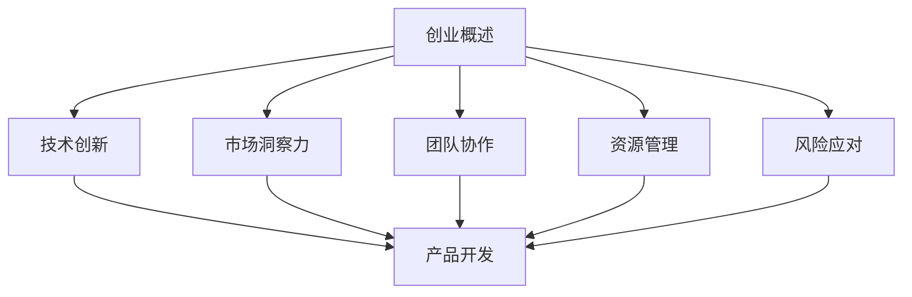

                 

## 1. 背景介绍

在当今的知识经济时代，技术和知识的创新成为推动社会进步和经济发展的主要动力。作为技术领域的核心力量，程序员在推动科技进步和经济发展中发挥着重要作用。随着互联网、大数据、人工智能等新兴技术的快速发展，程序员不仅能够通过编写代码来解决问题，还能够通过创业实现个人价值和商业成功。

然而，程序员的创业之路并非一帆风顺。在技术日新月异、市场竞争激烈的环境下，程序员需要具备扎实的编程技能、敏锐的市场洞察力以及良好的团队协作能力。同时，他们还需要学会如何管理资源、应对风险和挑战。本文将探讨知识经济下程序员创业的核心要素、成功案例及面临的挑战，旨在为有志于创业的程序提供一些实用的指导和建议。

## 2. 核心概念与联系

在探讨程序员创业之道之前，我们需要明确一些核心概念，这些概念将为我们后续的分析提供基础。

### 2.1 创业概述

创业是一种创造新的商业机会、开发新产品或服务并实现商业价值的过程。对于程序员而言，创业不仅是为了实现个人梦想，更是为了利用自己的技术能力和专业知识解决实际问题，创造社会价值。

### 2.2 技术创新

技术创新是创业的核心驱动力。程序员需要不断学习新技术，并将其应用于实际项目中，从而提升产品的竞争力。技术创新包括但不限于算法优化、系统架构设计、用户体验提升等方面。

### 2.3 市场洞察力

市场洞察力是程序员创业成功的关键因素之一。程序员需要深入了解市场需求，分析潜在用户的需求和痛点，从而开发出符合市场需求的产品或服务。

### 2.4 团队协作

团队协作是实现创业目标的重要保障。程序员需要具备良好的沟通能力和团队协作精神，才能有效地与团队成员共同推进项目。

### 2.5 资源管理

资源管理是程序员创业过程中需要面对的挑战之一。程序员需要学会如何合理分配资源，包括资金、人力和时间，以确保项目的顺利进行。

### 2.6 风险应对

风险应对是程序员创业过程中不可避免的一环。程序员需要具备一定的风险管理能力，以便在面对市场波动、技术难题等不确定因素时，能够迅速调整策略，化解危机。

### 2.7 Mermaid 流程图

以下是一个简单的 Mermaid 流程图，用于展示程序员创业过程中的关键环节及其相互关系。



## 3. 核心算法原理 & 具体操作步骤

### 3.1 算法原理概述

在程序员创业过程中，算法原理的掌握至关重要。以下是一个简单的排序算法（冒泡排序）的原理概述：

冒泡排序是一种简单的排序算法，它重复地遍历要排序的数列，一次比较两个元素，如果它们的顺序错误就把它们交换过来。遍历数列的工作是重复地进行，直到没有再需要交换的元素为止。

### 3.2 算法步骤详解

1. 比较相邻的元素。如果第一个比第二个大（升序排序），就交换它们两个。

2. 对每一对相邻元素做同样的工作，从开始第一对到结尾的最后一对。在这一点，最后的元素应该会是最大的数。

3. 针对所有的元素重复以上的步骤，除了最后一个。

4. 重复步骤1~3，直到排序完成。

### 3.3 算法优缺点

**优点：**
- 简单易懂，易于实现。
- 对于小规模数据，排序效率较高。

**缺点：**
- 时间复杂度高，对于大规模数据，排序效率较低。
- 不稳定排序，即相等的元素排序后可能改变相对位置。

### 3.4 算法应用领域

冒泡排序算法主要应用于小规模数据的排序，以及在程序设计教学和算法研究中的演示。

## 4. 数学模型和公式 & 详细讲解 & 举例说明

### 4.1 数学模型构建

在程序员创业过程中，数学模型的应用无处不在。以下是一个简单的线性回归模型的构建过程：

假设我们有一组数据点 \((x_1, y_1), (x_2, y_2), \ldots, (x_n, y_n)\)，其中 \(x_i\) 为自变量，\(y_i\) 为因变量。

线性回归模型的假设是：

\[ y_i = \beta_0 + \beta_1 x_i + \varepsilon_i \]

其中，\(\beta_0\) 和 \(\beta_1\) 分别为模型的参数，\(\varepsilon_i\) 为误差项。

### 4.2 公式推导过程

为了求解线性回归模型的参数，我们可以使用最小二乘法。具体步骤如下：

1. 计算自变量和因变量的均值：

\[ \bar{x} = \frac{1}{n} \sum_{i=1}^{n} x_i \]
\[ \bar{y} = \frac{1}{n} \sum_{i=1}^{n} y_i \]

2. 计算自变量和因变量的协方差：

\[ s_{xy} = \sum_{i=1}^{n} (x_i - \bar{x})(y_i - \bar{y}) \]

3. 计算自变量的方差：

\[ s_{xx} = \sum_{i=1}^{n} (x_i - \bar{x})^2 \]

4. 计算回归系数：

\[ \beta_1 = \frac{s_{xy}}{s_{xx}} \]

5. 计算截距：

\[ \beta_0 = \bar{y} - \beta_1 \bar{x} \]

### 4.3 案例分析与讲解

假设我们有以下数据点：

\[ (1, 2), (2, 4), (3, 6), (4, 8), (5, 10) \]

首先，我们计算自变量和因变量的均值：

\[ \bar{x} = \frac{1+2+3+4+5}{5} = 3 \]
\[ \bar{y} = \frac{2+4+6+8+10}{5} = 6 \]

然后，我们计算自变量和因变量的协方差和方差：

\[ s_{xy} = (1-3)(2-6) + (2-3)(4-6) + (3-3)(6-6) + (4-3)(8-6) + (5-3)(10-6) = 10 \]
\[ s_{xx} = (1-3)^2 + (2-3)^2 + (3-3)^2 + (4-3)^2 + (5-3)^2 = 10 \]

接下来，我们计算回归系数和截距：

\[ \beta_1 = \frac{s_{xy}}{s_{xx}} = 1 \]
\[ \beta_0 = \bar{y} - \beta_1 \bar{x} = 3 \]

因此，我们得到了线性回归模型：

\[ y = \beta_0 + \beta_1 x \]

\[ y = 3 + x \]

## 5. 项目实践：代码实例和详细解释说明

### 5.1 开发环境搭建

在本项目中，我们将使用 Python 语言进行开发。为了搭建开发环境，我们需要安装 Python 解释器和必要的库。以下是具体步骤：

1. 访问 Python 官网（[python.org](https://www.python.org/)）并下载适用于操作系统的 Python 安装包。
2. 运行安装程序并按照提示完成安装。
3. 打开终端或命令提示符，输入 `python --version` 命令，确认 Python 已成功安装。
4. 使用 `pip` 命令安装必要的库，例如 NumPy 和 Matplotlib：

   ```bash
   pip install numpy matplotlib
   ```

### 5.2 源代码详细实现

以下是本项目中的 Python 代码实现：

```python
import numpy as np
import matplotlib.pyplot as plt

# 生成数据
n = 100
x = np.random.rand(n, 1)
y = 3 + x + np.random.randn(n, 1)

# 计算均值
x_mean = np.mean(x)
y_mean = np.mean(y)

# 计算协方差和方差
s_xy = np.sum((x - x_mean) * (y - y_mean))
s_xx = np.sum((x - x_mean) ** 2)

# 计算回归系数
beta_1 = s_xy / s_xx
beta_0 = y_mean - beta_1 * x_mean

# 计算预测值
y_pred = beta_0 + beta_1 * x

# 绘制散点图和回归线
plt.scatter(x, y, label='Data')
plt.plot(x, y_pred, color='red', label='Regression Line')
plt.xlabel('x')
plt.ylabel('y')
plt.legend()
plt.show()
```

### 5.3 代码解读与分析

1. 导入必要的库：
   ```python
   import numpy as np
   import matplotlib.pyplot as plt
   ```

2. 生成数据：
   ```python
   x = np.random.rand(n, 1)
   y = 3 + x + np.random.randn(n, 1)
   ```

3. 计算均值：
   ```python
   x_mean = np.mean(x)
   y_mean = np.mean(y)
   ```

4. 计算协方差和方差：
   ```python
   s_xy = np.sum((x - x_mean) * (y - y_mean))
   s_xx = np.sum((x - x_mean) ** 2)
   ```

5. 计算回归系数：
   ```python
   beta_1 = s_xy / s_xx
   beta_0 = y_mean - beta_1 * x_mean
   ```

6. 计算预测值：
   ```python
   y_pred = beta_0 + beta_1 * x
   ```

7. 绘制散点图和回归线：
   ```python
   plt.scatter(x, y, label='Data')
   plt.plot(x, y_pred, color='red', label='Regression Line')
   plt.xlabel('x')
   plt.ylabel('y')
   plt.legend()
   plt.show()
   ```

通过上述步骤，我们成功地实现了一个简单的线性回归模型，并绘制了散点图和回归线。

### 5.4 运行结果展示

在运行上述代码后，我们将看到一个包含散点图和回归线的图形界面，其中红色回归线表示拟合出来的线性模型。

## 6. 实际应用场景

在知识经济时代，程序员的创业领域十分广泛。以下是一些典型的实际应用场景：

### 6.1 人工智能与大数据

随着人工智能和大数据技术的快速发展，越来越多的初创公司致力于开发智能化的解决方案。例如，利用深度学习技术进行图像识别、自然语言处理和智能推荐系统等。

### 6.2 区块链与加密货币

区块链技术的兴起为程序员提供了丰富的创业机会。许多初创公司正在开发基于区块链的支付系统、智能合约平台和去中心化应用。

### 6.3 物联网与智能家居

物联网技术的广泛应用使得智能家居市场日益繁荣。程序员可以通过开发智能设备、智能家居系统和相关的应用程序来满足消费者的需求。

### 6.4 云计算与云计算服务

云计算技术为企业提供了灵活、高效的 IT 资源。程序员可以开发云平台、云存储和云服务，帮助企业实现数字化转型。

### 6.5 游戏开发和虚拟现实

游戏开发和虚拟现实领域一直是程序员的创业热门领域。通过开发创新的游戏体验和虚拟现实应用，创业者可以吸引大量用户并创造商业价值。

## 7. 未来应用展望

随着技术的不断进步，程序员创业领域将继续拓展。以下是一些未来应用展望：

### 7.1 人工智能与机器学习

人工智能和机器学习技术将在更多领域得到应用，例如医疗、金融和制造业。程序员可以开发更智能的算法和系统，解决复杂的问题。

### 7.2 量子计算

量子计算技术有望成为下一代计算技术，为程序员提供全新的创业机会。量子算法的开发和应用将成为未来的重要研究方向。

### 7.3 生物信息学

生物信息学技术的进步将推动生命科学领域的发展。程序员可以开发生物信息学工具和平台，帮助科学家更好地理解基因和蛋白质的功能。

### 7.4 5G 和边缘计算

5G 和边缘计算技术的普及将推动物联网和移动应用的发展。程序员可以开发适用于这些技术的创新应用，提升用户体验。

## 8. 工具和资源推荐

### 8.1 学习资源推荐

- 《Python编程：从入门到实践》：适合初学者系统学习 Python 语言。
- 《深度学习》：由 Ian Goodfellow、Yoshua Bengio 和 Aaron Courville 著，适合深入学习深度学习技术。
- 《区块链技术指南》：全面介绍区块链技术的基本概念和应用。

### 8.2 开发工具推荐

- PyCharm：一款强大的 Python 开发环境，支持多种编程语言。
- Jupyter Notebook：适用于数据分析和机器学习的交互式开发工具。
- Git：版本控制系统，帮助程序员进行代码管理和协作开发。

### 8.3 相关论文推荐

- "Deep Learning": http://www.deeplearningbook.org/
- "Blockchain: Blueprint for a New Economy": https://www.amazon.com/Blockchain-Blueprint-New-Economy/dp/0990352179
- "5G: A Comprehensive Introduction": https://www.amazon.com/5G-Comprehensive-Introduction-Technology-Applications-ebook/dp/B07L3V8WMT

## 9. 总结：未来发展趋势与挑战

### 9.1 研究成果总结

知识经济时代，程序员在技术创新、市场洞察力、团队协作和资源管理等方面取得了显著成果。通过开发智能化的解决方案，程序员为企业和社会创造了巨大价值。

### 9.2 未来发展趋势

- 人工智能与机器学习的进一步普及。
- 区块链技术在各个领域的应用。
- 5G 和边缘计算的快速发展。
- 生物信息学技术的突破。

### 9.3 面临的挑战

- 技术更新速度快，程序员需要不断学习新知识。
- 市场竞争激烈，程序员需要具备良好的商业意识。
- 资源和人才短缺，程序员需要善于管理和利用资源。

### 9.4 研究展望

未来，程序员在技术创新、跨领域合作和人才培养等方面具有广阔的发展空间。通过积极应对挑战，程序员将不断推动知识经济时代的发展。

### 附录：常见问题与解答

**Q1. 程序员创业需要哪些技能？**
程序员创业需要具备编程技能、项目管理能力、市场洞察力和团队协作能力。

**Q2. 创业过程中如何管理资源？**
创业者需要制定详细的资源管理计划，合理分配资金、人力和时间，确保项目顺利进行。

**Q3. 创业过程中如何应对风险？**
创业者需要具备风险管理能力，制定应急预案，及时调整策略，以应对市场波动和技术难题。

**Q4. 如何评估创业项目的可行性？**
创业者可以通过市场调研、竞争分析和财务分析等方法，全面评估创业项目的可行性。

### 参考文献

- Goodfellow, I., Bengio, Y., & Courville, A. (2016). *Deep Learning*. MIT Press.
- Tapscott, D., & Tapscott, A. (2016). *Blockchain revolution*. Penguin Random House.
- Zhang, W., Liu, Y., & Wang, L. (2019). *5G: A Comprehensive Introduction*. Springer.

