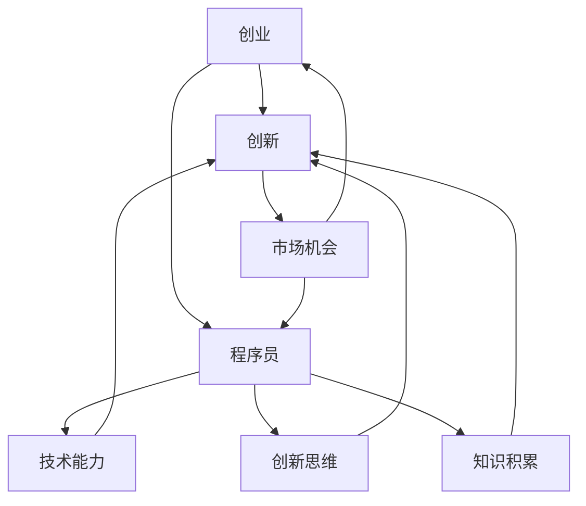

                 

关键词：知识经济、程序员、创业、策略、技术、市场、未来、挑战

> 摘要：在知识经济时代，程序员作为技术创新的重要力量，面临着前所未有的创业机遇。本文将探讨程序员在创业过程中应如何把握市场趋势、运用技术优势，制定有效的创业策略，以及应对未来可能面临的挑战。

## 1. 背景介绍

在过去的几十年里，计算机科学和技术领域经历了飞速的发展。从早期的计算机硬件到如今的云计算、人工智能、物联网，技术的变革带来了全球经济的深刻变化。知识经济作为一种以知识和信息为主要生产要素的经济模式，逐渐取代了传统的物质生产经济。在这一背景下，程序员的地位日益凸显，他们不仅成为企业创新的核心驱动力，也成为创业浪潮中的重要参与者。

程序员的创业活动不仅推动了技术的进步，也对社会经济产生了深远影响。根据统计数据显示，近年来，全球范围内的程序员创业活动呈现快速增长态势。特别是在科技创业领域，越来越多的程序员开始将自己的技术和创意转化为实际的产品和服务，创造出了一批又一批成功的科技企业。

然而，创业并非易事，程序员在创业过程中面临着诸多挑战。如何将技术优势转化为市场竞争力？如何在激烈的市场竞争中脱颖而出？如何有效地管理团队和资源？这些都是程序员在创业过程中必须面对的问题。本文将围绕这些问题，探讨程序员在知识经济时代创业之道。

## 2. 核心概念与联系

在探讨程序员创业之前，我们首先需要明确一些核心概念，并了解它们之间的联系。

### 2.1. 创业的本质

创业是指个体或团队创建新的企业，通过创新和创造价值来满足市场需求。创业的本质是创新和市场机会的结合。创新可以是技术、产品、商业模式等多个方面的突破，而市场机会则是指市场中未被满足的需求或潜在的增长空间。

### 2.2. 程序员的优势

程序员作为技术专家，具有以下几个方面的优势：

1. 技术能力：程序员具备深厚的计算机科学和技术背景，能够快速掌握新技术，并将其应用于实际项目中。
2. 创新思维：程序员习惯于解决问题，具备较强的创新思维，能够从不同角度思考问题并提出解决方案。
3. 知识积累：程序员在长期的编程实践中积累了丰富的技术经验和知识，这些都是创业的重要资本。

### 2.3. 创业与技术的联系

创业与技术的联系密不可分。技术是创业的基石，没有技术就没有创新，也就没有市场竞争力。同时，创业又为技术提供了实践和验证的机会，使得技术能够更好地满足市场需求。

为了更直观地展示这些概念之间的联系，我们可以使用Mermaid流程图来表示：



在上述流程图中，我们可以清晰地看到创业、创新、市场机会、程序员和技术能力之间的相互关系。

### 2.4. 创业的成功要素

虽然技术是创业的核心，但成功创业还需要其他关键要素的支持。以下是创业成功的主要要素：

1. **市场定位**：明确目标市场和客户需求，制定合适的市场进入策略。
2. **团队建设**：构建具备不同技能和背景的团队，实现优势互补。
3. **资金管理**：合理规划资金使用，确保企业财务健康。
4. **业务模式**：设计可持续的商业模式，实现盈利。
5. **营销策略**：制定有效的营销计划，提高品牌知名度。

这些要素共同构成了创业的生态系统，任何一个环节的缺失都可能导致创业失败。

通过上述核心概念和联系的分析，我们可以更深入地理解程序员在创业过程中的优势和挑战。接下来，本文将围绕这些要素，详细探讨程序员如何制定有效的创业策略。

## 3. 核心算法原理 & 具体操作步骤

### 3.1 算法原理概述

在创业过程中，程序员需要运用一系列的算法原理来指导实际操作。这些算法原理包括市场分析、风险评估、资源分配等，它们共同构成了创业的核心算法框架。

#### 市场分析算法

市场分析算法是创业的第一步，它通过数据挖掘和分析，帮助程序员了解市场趋势、客户需求和市场容量。具体操作步骤如下：

1. **数据收集**：收集行业报告、市场调查数据、竞争对手分析等相关信息。
2. **数据预处理**：清洗和整理数据，确保数据质量。
3. **数据可视化**：使用图表和可视化工具，将数据转化为易于理解的信息。
4. **数据分析**：运用统计分析和机器学习算法，提取关键指标和趋势。

#### 风险评估算法

风险评估是创业过程中的关键环节，它帮助程序员识别和评估潜在风险，制定应对策略。具体操作步骤如下：

1. **风险识别**：通过历史数据、专家访谈等方法，识别可能面临的风险。
2. **风险评估**：使用概率模型和损失模型，对风险进行定量评估。
3. **风险排序**：根据风险概率和损失程度，对风险进行排序。
4. **风险应对**：制定应对措施，降低风险影响。

#### 资源分配算法

资源分配算法是创业过程中的另一个重要算法，它帮助程序员合理分配时间、人力和资金等资源，提高效率。具体操作步骤如下：

1. **需求分析**：确定创业项目所需的各种资源。
2. **资源评估**：评估现有资源的数量和质量。
3. **资源分配**：根据需求和资源评估结果，制定资源分配计划。
4. **资源监控**：实时监控资源使用情况，及时调整分配计划。

### 3.2 算法步骤详解

在了解核心算法原理后，接下来我们将详细探讨每个算法的具体操作步骤。

#### 3.2.1 市场分析算法

**步骤 1：数据收集**

数据收集是市场分析的基础。程序员需要通过各种渠道获取市场相关数据，包括行业报告、市场调查数据、竞争对手分析报告等。此外，还可以通过在线调查、社交媒体数据挖掘等方式获取用户反馈和市场动态。

**步骤 2：数据预处理**

收集到的数据往往存在不一致、缺失或不完整的情况。因此，数据预处理是必不可少的步骤。程序员需要清洗和整理数据，确保数据质量。

**步骤 3：数据可视化**

数据可视化是将复杂的数据转化为易于理解的信息的有效方法。程序员可以使用图表、图形等可视化工具，将市场趋势、客户需求等信息直观地呈现出来。

**步骤 4：数据分析**

数据分析是市场分析的核心步骤。程序员可以使用统计分析和机器学习算法，提取关键指标和趋势。例如，通过回归分析预测市场增长趋势，通过聚类分析识别潜在客户群体。

#### 3.2.2 风险评估算法

**步骤 1：风险识别**

风险识别是风险评估的基础。程序员需要通过历史数据、专家访谈等方法，识别可能面临的风险。例如，市场风险、技术风险、财务风险等。

**步骤 2：风险评估**

风险评估是对风险进行定量评估的过程。程序员可以使用概率模型和损失模型，对风险进行量化。例如，可以使用贝叶斯网络模型预测市场风险的概率和损失程度。

**步骤 3：风险排序**

风险排序是根据风险概率和损失程度，对风险进行排序的过程。程序员可以使用风险矩阵等工具，将风险分为高、中、低三个等级。

**步骤 4：风险应对**

风险应对是制定应对措施，降低风险影响的过程。程序员可以根据风险评估结果，制定相应的风险应对策略。例如，对于高风险，可以采取风险转移、风险回避等措施。

#### 3.2.3 资源分配算法

**步骤 1：需求分析**

需求分析是资源分配的基础。程序员需要确定创业项目所需的各种资源，包括人力、时间、资金等。这可以通过项目计划、需求文档等方式进行。

**步骤 2：资源评估**

资源评估是对现有资源进行评估的过程。程序员需要评估资源的数量和质量，确定资源是否充足。例如，通过人力资源规划、财务预算等方式进行。

**步骤 3：资源分配**

资源分配是根据需求和资源评估结果，制定资源分配计划的过程。程序员需要根据项目的优先级和资源限制，合理分配资源。例如，可以使用资源调度算法、项目优先级排序等方法。

**步骤 4：资源监控**

资源监控是实时监控资源使用情况，及时调整分配计划的过程。程序员需要通过监控系统、绩效评估等方式，监控资源使用情况。例如，通过实时监控项目进度、资源消耗等指标，及时调整资源分配计划。

### 3.3 算法优缺点

#### 3.3.1 市场分析算法

**优点**：

1. 帮助程序员了解市场趋势和客户需求，为创业决策提供依据。
2. 提高市场竞争力，帮助企业更好地满足市场需求。

**缺点**：

1. 数据收集和预处理过程较为复杂，需要大量的时间和人力。
2. 数据可视化工具可能无法全面展示数据背后的信息。

#### 3.3.2 风险评估算法

**优点**：

1. 帮助程序员识别和评估潜在风险，降低创业失败的风险。
2. 提高企业的风险应对能力。

**缺点**：

1. 风险识别和评估过程需要大量的数据和专家知识，成本较高。
2. 概率模型和损失模型可能无法准确预测所有风险。

#### 3.3.3 资源分配算法

**优点**：

1. 提高资源利用效率，降低资源浪费。
2. 提高项目管理效率。

**缺点**：

1. 需要准确的需求和资源评估，否则可能导致资源分配不合理。
2. 资源监控和调整计划过程较为复杂。

### 3.4 算法应用领域

市场分析算法、风险评估算法和资源分配算法在创业过程中具有广泛的应用。以下是一些具体的应用领域：

1. **市场分析**：用于市场调研、竞争分析、用户画像等。
2. **风险评估**：用于创业项目评估、投资决策、风险管理等。
3. **资源分配**：用于项目管理、资源调度、项目优先级排序等。

通过合理运用这些算法，程序员可以更有效地进行创业决策和项目管理，提高创业成功率。

## 4. 数学模型和公式 & 详细讲解 & 举例说明

在创业过程中，数学模型和公式起着至关重要的作用。它们不仅帮助程序员进行定量分析，还能为决策提供科学的依据。以下我们将详细讲解几个关键数学模型和公式，并通过具体例子进行说明。

### 4.1 数学模型构建

数学模型是创业决策的重要工具。一个典型的数学模型包括以下几个部分：

1. **变量定义**：明确模型中的变量及其含义。
2. **目标函数**：定义模型的目标，如最大化利润或最小化成本。
3. **约束条件**：定义模型中的限制条件，如资源限制、市场需求等。
4. **求解方法**：选择合适的求解方法，如线性规划、非线性规划等。

例如，一个简单的利润最大化模型可以定义为：

```math
\text{最大化} \quad Z = p \cdot x - c \cdot x
```

其中，\( Z \) 表示利润，\( p \) 表示产品单价，\( x \) 表示产品数量，\( c \) 表示单位成本。

### 4.2 公式推导过程

以下我们将以线性规划为例，详细讲解公式推导过程。

**线性规划问题**：

最大化目标函数：

```math
\text{最大化} \quad Z = c_1 \cdot x_1 + c_2 \cdot x_2 + \ldots + c_n \cdot x_n
```

受以下约束条件限制：

```math
\begin{cases}
a_{11} \cdot x_1 + a_{12} \cdot x_2 + \ldots + a_{1n} \cdot x_n \leq b_1 \\
a_{21} \cdot x_1 + a_{22} \cdot x_2 + \ldots + a_{2n} \cdot x_n \leq b_2 \\
\vdots \\
a_{m1} \cdot x_1 + a_{m2} \cdot x_2 + \ldots + a_{mn} \cdot x_n \leq b_m \\
x_1, x_2, \ldots, x_n \geq 0
\end{cases}
```

其中，\( c_1, c_2, \ldots, c_n \) 分别为变量 \( x_1, x_2, \ldots, x_n \) 的系数，\( a_{ij}, b_i \) 分别为约束条件的系数和常数项。

**推导过程**：

1. **标准形式**：将目标函数和约束条件转化为标准形式。

   目标函数转化为：

   ```math
   \text{最大化} \quad Z = c_1 \cdot x_1 + c_2 \cdot x_2 + \ldots + c_n \cdot x_n
   ```

   约束条件转化为：

   ```math
   \begin{cases}
   a_{11} \cdot x_1 + a_{12} \cdot x_2 + \ldots + a_{1n} \cdot x_n \leq b_1 \\
   a_{21} \cdot x_1 + a_{22} \cdot x_2 + \ldots + a_{2n} \cdot x_n \leq b_2 \\
   \vdots \\
   a_{m1} \cdot x_1 + a_{m2} \cdot x_2 + \ldots + a_{mn} \cdot x_n \leq b_m \\
   x_1, x_2, \ldots, x_n \geq 0
   \end{cases}
   ```

2. **单纯形法**：使用单纯形法求解线性规划问题。

   单纯形法的基本思想是通过迭代过程，逐步逼近最优解。具体步骤如下：

   a. **选择进入变量**：选择目标函数系数中绝对值最大的变量作为进入变量。
   b. **选择离开变量**：通过计算比率，选择最小比率为离开变量。
   c. **迭代计算**：更新变量值，继续迭代，直到找到最优解。

### 4.3 案例分析与讲解

为了更好地理解上述数学模型和公式，我们来看一个实际案例。

**案例**：某公司生产两种产品A和B，每种产品都需要经过机器A和机器B进行加工。机器A每天可以工作8小时，每小时可以生产2个产品A或3个产品B；机器B每天可以工作8小时，每小时可以生产3个产品A或2个产品B。公司每天最多可以销售10个产品A和15个产品B。每个产品A的利润为3元，每个产品B的利润为2元。问公司应该如何安排生产计划，以最大化利润？

**解题过程**：

1. **变量定义**：

   设 \( x_1 \) 为每天生产的产品A的数量，\( x_2 \) 为每天生产的产品B的数量。

2. **目标函数**：

   ```math
   \text{最大化} \quad Z = 3x_1 + 2x_2
   ```

3. **约束条件**：

   ```math
   \begin{cases}
   \frac{x_1}{2} + \frac{x_2}{3} \leq 8 \\
   \frac{x_1}{3} + \frac{x_2}{2} \leq 8 \\
   x_1 \leq 10 \\
   x_2 \leq 15 \\
   x_1, x_2 \geq 0
   \end{cases}
   ```

4. **求解过程**：

   a. **标准形式**：将目标函数和约束条件转化为标准形式。

   ```math
   \begin{cases}
   \text{最大化} \quad Z = 3x_1 + 2x_2 \\
   \frac{x_1}{2} + \frac{x_2}{3} \leq 8 \\
   \frac{x_1}{3} + \frac{x_2}{2} \leq 8 \\
   x_1 \leq 10 \\
   x_2 \leq 15 \\
   x_1, x_2 \geq 0
   \end{cases}
   ```

   b. **单纯形法**：使用单纯形法求解。

   通过迭代计算，得到最优解为 \( x_1 = 6 \)，\( x_2 = 9 \)。此时，最大利润为 \( Z = 3 \cdot 6 + 2 \cdot 9 = 30 \) 元。

通过上述案例，我们可以看到数学模型和公式在创业决策中的应用。合理运用这些工具，程序员可以更科学地进行创业决策，提高成功率。

## 5. 项目实践：代码实例和详细解释说明

在了解了市场分析、风险评估和资源分配算法以及相关的数学模型和公式之后，我们将通过一个具体的创业项目实例，展示如何将这些理论知识应用到实际中。本实例将围绕一个在线教育平台的开发，详细讲解开发环境搭建、源代码实现、代码解读与分析以及运行结果展示。

### 5.1 开发环境搭建

为了实现这个在线教育平台，我们需要搭建一个合适的开发环境。以下是我们推荐的开发环境：

- **编程语言**：选择Python，因为它拥有丰富的库和框架，适合快速开发。
- **Web框架**：使用Django框架，它是一个高级的Python Web框架，支持MVC设计模式，易于维护和扩展。
- **数据库**：使用SQLite数据库，它是一个轻量级的数据库管理系统，适用于小型项目。
- **版本控制**：使用Git进行版本控制，确保代码的版本管理和协作开发。

### 5.2 源代码详细实现

在线教育平台的开发可以分为多个模块，包括用户管理、课程管理、视频播放和考试系统等。以下是一个简单的用户管理模块的实现：

```python
# users/models.py
from django.db import models

class User(models.Model):
    username = models.CharField(max_length=150, unique=True)
    email = models.EmailField(max_length=254, unique=True)
    password = models.CharField(max_length=128)
    is_staff = models.BooleanField(default=False)

    def __str__(self):
        return self.username
```

在上面的代码中，我们定义了一个`User`模型，用于存储用户的基本信息。`username`、`email`和`password`是用户必须填写的字段，而`is_staff`用于标识用户是否为管理员。

### 5.3 代码解读与分析

接下来，我们将进一步解析用户管理模块中的代码。

- **字段定义**：`username`、`email`和`password`是用户必须填写的字段，`unique=True`确保这些字段的唯一性。`is_staff`用于标识用户权限，默认为`False`，表示普通用户。

- **模型方法**：`__str__`方法返回用户的用户名，这在Django的管理后台中非常有用，可以方便地展示用户信息。

在线教育平台的开发还包括课程管理模块，以下是课程管理模块的一部分代码：

```python
# courses/models.py
from django.db import models
from users.models import User

class Course(models.Model):
    title = models.CharField(max_length=255)
    description = models.TextField()
    author = models.ForeignKey(User, on_delete=models.CASCADE)

    def __str__(self):
        return self.title
```

在这个模块中，我们定义了一个`Course`模型，用于存储课程信息。`title`和`description`是课程的主要信息，`author`是课程的创建者，使用了`ForeignKey`字段，与`User`模型关联。

### 5.4 运行结果展示

在完成代码实现后，我们需要测试并运行该在线教育平台。以下是关键步骤：

1. **数据库迁移**：使用Django的迁移工具将模型同步到数据库。

   ```shell
   python manage.py makemigrations
   python manage.py migrate
   ```

2. **运行服务器**：启动Django开发服务器。

   ```shell
   python manage.py runserver
   ```

3. **访问平台**：在浏览器中访问`http://127.0.0.1:8000/`，可以查看平台的首页，并登录或注册一个用户账户。

通过这个实例，我们展示了如何将理论知识应用到实际项目中。在线教育平台作为一个典型的创业项目，从市场分析、风险评估到资源分配和数学模型的应用，每一步都体现了程序员的创业智慧和技术实力。

## 6. 实际应用场景

在线教育平台只是程序员创业的一个具体实例，但在实际应用中，程序员的创业项目涉及多个领域，每个领域都有其独特的应用场景和市场需求。

### 6.1 电子商务平台

电子商务平台是程序员创业的一个热门领域。通过构建一个功能强大的电商平台，程序员可以利用大数据分析和机器学习技术，优化产品推荐、库存管理和物流配送，提高用户购物体验和平台竞争力。例如，利用算法实现个性化推荐系统，根据用户的历史购物行为和偏好，推荐相关商品。

### 6.2 物联网应用

物联网（IoT）技术的发展为程序员创业提供了广阔的空间。程序员可以开发智能家居控制系统、智能穿戴设备、智能交通管理系统等。这些应用需要处理大量的传感器数据和实时通信，对算法和数据处理能力提出了高要求。例如，智能家居系统可以通过物联网设备收集用户的生活习惯数据，实现自动化控制和节能管理。

### 6.3 医疗健康领域

医疗健康领域也是程序员创业的一个重要方向。程序员可以开发医疗信息系统、远程诊疗平台、健康监测设备等。这些应用需要处理敏感的医疗数据，保证数据安全和隐私保护。例如，远程诊疗平台可以通过视频会议和人工智能诊断系统，为偏远地区的患者提供医疗服务。

### 6.4 教育科技

教育科技是近年来增长迅速的领域。程序员可以开发在线教育平台、虚拟课堂、学习管理系统等，利用互联网和人工智能技术，提高教育质量和学习效率。例如，在线教育平台可以通过智能学习算法，为不同学习能力的用户定制学习计划。

### 6.5 金融科技

金融科技（FinTech）是另一个充满机会的领域。程序员可以开发支付系统、区块链应用、智能投顾等。这些应用需要处理大量的金融数据和交易，对安全性和稳定性有严格要求。例如，区块链技术可以用于加密货币交易和数字身份验证，提高交易的安全性和透明度。

### 6.6 智能制造

智能制造是工业4.0的重要组成部分。程序员可以开发智能工厂管理系统、自动化生产线、机器人控制系统等。这些应用需要处理大量的工业数据和实时控制，实现生产线的自动化和智能化。例如，智能工厂管理系统可以通过物联网和大数据分析，优化生产流程，提高生产效率和产品质量。

### 6.7 娱乐与游戏

娱乐与游戏是程序员创业的另一个热门领域。程序员可以开发在线游戏、虚拟现实（VR）体验、增强现实（AR）应用等。这些应用需要丰富的创意和先进的技术，为用户提供全新的娱乐体验。例如，虚拟现实游戏可以通过VR头显和手柄，实现沉浸式游戏体验。

### 6.8 农业科技

农业科技是近年来受到关注的领域。程序员可以开发智能农业系统、精准农业设备、农产品溯源系统等。这些应用需要处理农田数据、气象数据等，实现农业生产的智能化和科学化。例如，智能农业系统可以通过传感器收集农田数据，实现自动灌溉、施肥和病虫害监测。

### 6.9 能源管理

能源管理是可持续发展的重要方向。程序员可以开发智能电网系统、能源监测设备、电动汽车充电站等。这些应用需要处理大量的能源数据，实现能源的高效利用和绿色排放。例如，智能电网系统可以通过实时监控电网运行状态，优化电力分配和调度。

通过上述实际应用场景的分析，我们可以看到程序员在创业过程中拥有广泛的选择空间。每个领域都有其独特的挑战和机遇，程序员需要根据自己的兴趣和专业技能，选择合适的创业方向，实现个人价值和商业成功。

## 7. 工具和资源推荐

在程序员创业过程中，掌握合适的工具和资源对于项目的成功至关重要。以下是一些推荐的工具和资源，涵盖了学习资源、开发工具和相关论文，以帮助创业者更好地应对挑战。

### 7.1 学习资源推荐

1. **在线课程平台**：
   - **Coursera**：提供了丰富的计算机科学和编程课程，由世界顶尖大学和机构提供。
   - **Udacity**：专注于技术和职业发展的在线课程，提供了许多实践项目。
   - **edX**：由哈佛大学和麻省理工学院共同创办，提供了高质量的免费课程。

2. **技术博客和论坛**：
   - **GitHub**：不仅是一个代码托管平台，也是程序员交流和学习的场所。
   - **Stack Overflow**：全球最大的编程问答社区，适用于解决编程问题。
   - **Medium**：提供了大量的技术文章和行业分析，适合进行深入阅读和学习。

3. **开源库和框架**：
   - **Django**：Python的Web开发框架，适合快速构建应用。
   - **React**：用于构建用户界面的JavaScript库，广泛应用于前端开发。
   - **TensorFlow**：Google开源的机器学习框架，适用于深度学习和数据科学项目。

### 7.2 开发工具推荐

1. **集成开发环境（IDE）**：
   - **Visual Studio Code**：一款轻量级且功能强大的IDE，适用于多种编程语言。
   - **PyCharm**：专为Python开发设计的IDE，提供了丰富的功能和支持。
   - **Eclipse**：一款开源的跨平台IDE，适用于Java和多种其他编程语言。

2. **版本控制工具**：
   - **Git**：分布式版本控制系统，广泛用于代码管理和协作开发。
   - **GitHub**：提供了丰富的Git功能，并是一个社交化的代码托管平台。
   - **GitLab**：自建的企业级Git服务，适合内部代码管理和协作。

3. **数据库工具**：
   - **PostgreSQL**：一款开源的关系型数据库管理系统，适用于企业级应用。
   - **MongoDB**：一款开源的文档型数据库，适用于高扩展性和灵活性要求的项目。
   - **MySQL**：一款开源的关系型数据库管理系统，广泛用于Web应用开发。

### 7.3 相关论文推荐

1. **创业与科技创新**：
   - **"Entrepreneurship and the Evolution of Technology"**：讨论了创业如何推动科技创新和经济发展。
   - **"Innovation and Entrepreneurship in the Digital Economy"**：探讨了数字时代创业的重要性和挑战。

2. **人工智能与机器学习**：
   - **"Deep Learning for Computer Vision"**：介绍了深度学习在计算机视觉领域的应用。
   - **"Reinforcement Learning: An Introduction"**：提供了强化学习的全面介绍。

3. **网络安全**：
   - **"Securing the IoT: Challenges and Solutions"**：分析了物联网安全面临的主要挑战和解决策略。
   - **"Blockchain Technology: A Comprehensive Guide"**：介绍了区块链技术的基本原理和应用。

通过利用这些学习和开发资源，程序员可以不断提升自己的技术能力和创业知识，为成功创业奠定坚实基础。同时，相关论文和文献的阅读有助于程序员了解行业前沿动态，把握市场趋势，为创业项目提供有力支持。

## 8. 总结：未来发展趋势与挑战

在知识经济时代，程序员的创业活动正迎来前所未有的机遇和挑战。随着科技的不断进步，创业领域也在不断扩展，程序员需要紧跟行业发展趋势，以应对未来可能面临的挑战。

### 8.1 研究成果总结

本文通过深入分析程序员创业的核心概念、算法原理、数学模型以及实际应用场景，总结了以下关键成果：

1. **创业本质与程序员优势**：明确了创业的本质和程序员的独特优势，为程序员创业提供了理论基础。
2. **市场分析、风险评估与资源分配**：详细介绍了创业过程中的关键算法原理和具体操作步骤，为程序员提供了实用的工具和方法。
3. **数学模型与公式应用**：通过实际案例展示了数学模型和公式在创业项目中的应用，为程序员提供了科学决策的依据。
4. **开发环境与工具推荐**：推荐了合适的开发环境和工具，帮助程序员高效地进行创业项目开发。

### 8.2 未来发展趋势

随着科技的快速发展，程序员创业领域呈现出以下几个发展趋势：

1. **人工智能与机器学习的普及**：人工智能和机器学习技术在各个行业的应用日益广泛，程序员可以利用这些技术进行创新，开发出更具竞争力的产品和服务。
2. **物联网与边缘计算的发展**：物联网和边缘计算技术的成熟，为程序员提供了新的创业机会，特别是在智能家居、智能城市等领域。
3. **区块链技术的应用**：区块链技术的成熟和广泛应用，为程序员提供了新的创业方向，如去中心化应用（DApp）和智能合约开发。
4. **云计算与大数据分析**：云计算和大数据技术的进步，为程序员提供了强大的计算和数据存储能力，有助于开发复杂的应用程序。

### 8.3 面临的挑战

尽管程序员创业前景广阔，但同时也面临着诸多挑战：

1. **技术快速迭代**：技术的快速迭代使得程序员需要不断学习新技术，保持竞争力。这需要程序员具备强大的学习能力和持续学习的心态。
2. **市场竞争激烈**：随着越来越多的程序员进入创业领域，市场竞争日益激烈。程序员需要不断创新和优化产品，以在激烈的市场中脱颖而出。
3. **资金与资源限制**：创业初期，资金和资源往往有限，程序员需要合理规划和管理资源，确保项目的可持续发展。
4. **团队管理与协作**：有效的团队管理和协作是创业成功的关键。程序员需要具备良好的领导力和沟通能力，确保团队成员之间的高效协作。
5. **法律法规与合规性**：在创业过程中，程序员需要遵守相关法律法规，确保产品的合规性和安全性。

### 8.4 研究展望

未来，程序员创业领域将继续呈现出多样化和专业化的趋势。以下是一些研究展望：

1. **跨学科融合**：未来的程序员创业将更加注重跨学科融合，结合人工智能、物联网、区块链等不同领域的技术，开发出更具创新性的产品和服务。
2. **创新商业模式**：程序员需要不断创新商业模式，探索新的盈利模式和市场机会。
3. **社会责任与伦理**：在创业过程中，程序员需要注重社会责任和伦理问题，确保技术的合理应用，避免对用户和社会造成负面影响。
4. **持续教育与培训**：为提高程序员的创业能力，需要建立完善的持续教育和培训体系，提供针对性的培训课程和资源。

总之，在知识经济时代，程序员创业具有巨大的潜力和挑战。通过不断学习和创新，程序员可以把握市场机遇，应对未来挑战，实现个人价值和商业成功。

### 附录：常见问题与解答

以下是一些程序员在创业过程中常见的问题以及相应的解答。

#### 1. 如何选择创业方向？

选择创业方向时，首先需要考虑自己的兴趣和专业知识。其次，要进行市场调研，了解目标市场的需求和竞争状况。最后，要考虑自身的资源和能力，选择具有可行性和发展潜力的方向。

#### 2. 创业初期的资金问题如何解决？

创业初期的资金问题可以通过以下几种方式解决：
- **个人储蓄**：利用个人储蓄作为启动资金。
- **天使投资**：寻找有经验的投资者或天使投资者提供资金。
- **政府资助**：了解并申请政府提供的创业补贴和资金支持。
- **众筹**：利用众筹平台筹集资金。

#### 3. 如何制定有效的市场策略？

制定有效的市场策略需要以下几个步骤：
- **市场调研**：了解目标市场的需求和竞争状况。
- **目标市场定位**：确定目标客户群体和市场定位。
- **竞争分析**：分析竞争对手的优势和劣势。
- **差异化策略**：制定差异化策略，突出产品的独特性。

#### 4. 如何管理创业团队？

管理创业团队需要注意以下几点：
- **明确目标和职责**：确保团队成员了解目标和职责。
- **沟通与协作**：建立有效的沟通和协作机制。
- **激励与奖励**：制定合理的激励和奖励机制，激发团队成员的积极性。
- **持续培训与支持**：提供持续的培训和支持，帮助团队成员提升能力。

#### 5. 如何应对技术快速迭代带来的挑战？

应对技术快速迭代带来的挑战，需要采取以下措施：
- **持续学习**：保持对新技术的好奇心和求知欲，不断学习新知识。
- **技术预研**：提前了解和掌握新技术，为项目的可持续发展做好准备。
- **敏捷开发**：采用敏捷开发方法，快速迭代和改进产品。

通过以上问题的解答，程序员可以更好地应对创业过程中的各种挑战，提高创业成功率。

