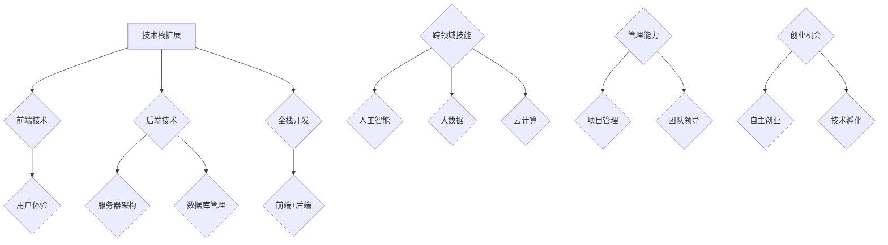

                 

 > **关键词：**知识经济，程序员，职业发展，技术趋势，技能提升，新兴领域。

> **摘要：**本文将探讨知识经济背景下，程序员如何把握职业发展方向，提升个人技能，适应新兴技术领域的需求，从而实现职业的长足发展。文章将结合实际案例，分析程序员在不同阶段应关注的能力培养和职业规划。

## 1. 背景介绍

随着互联网技术的飞速发展，知识经济时代已经来临。在这个时代，知识成为推动经济增长的核心动力，程序员作为信息技术产业的中坚力量，其职业发展受到广泛关注。程序员的工作已经不仅仅局限于编码，而是逐渐扩展到人工智能、大数据、云计算等领域。知识经济的发展，为程序员提供了广阔的职业前景，同时也带来了新的挑战。

### 程序员职业现状

- **需求增加：**随着数字经济的发展，企业对程序员的需求不断增加，尤其是在人工智能、大数据、云计算等新兴技术领域。
- **技能更新快：**技术迭代速度加快，程序员需要不断学习新技术，以保持竞争力。
- **跨界融合：**程序员职业逐渐与其他领域融合，如数据科学、人工智能等。

### 知识经济的影响

- **创新能力提升：**知识经济鼓励创新，程序员需要具备创新思维和解决问题的能力。
- **协作与沟通：**知识经济下的程序员需要具备良好的团队协作和沟通能力，以应对复杂的开发环境。
- **终身学习：**知识经济时代，终身学习成为程序员职业发展的必然选择。

## 2. 核心概念与联系

在知识经济背景下，程序员的职业发展方向可以从以下几个方面进行探讨：

### 技术栈扩展

- **前端技术：**随着用户界面设计和用户体验的重要性日益突出，前端技术成为程序员必备技能。
- **后端技术：**在后端开发中，程序员需要掌握服务器、数据库、云计算等技术。
- **全栈开发：**全栈开发人员能够独立完成前端和后端开发，具有更高的市场竞争力。

### 跨领域技能

- **人工智能：**程序员可以向人工智能领域发展，学习机器学习、深度学习等技术。
- **大数据：**大数据技术是现代企业的重要资产，程序员需要掌握大数据处理和分析技能。
- **云计算：**云计算技术的发展为程序员提供了丰富的就业机会，掌握云计算平台和相关技术成为必要条件。

### 管理能力

- **项目管理：**程序员可以通过学习项目管理知识，向项目经理或产品经理方向发展。
- **团队领导：**具备技术能力和管理能力的程序员可以成为技术团队领导，负责团队的技术指导和项目协调。

### 创业机会

- **自主创业：**在知识经济时代，程序员可以通过创业实现职业价值最大化。
- **技术孵化：**参与技术孵化项目，探索新技术和新模式，为未来的职业发展积累资本。

### Mermaid 流程图



## 3. 核心算法原理 & 具体操作步骤

### 3.1 算法原理概述

在知识经济背景下，程序员的职业发展离不开核心算法的应用。以下介绍几种常见的核心算法原理及其操作步骤：

### 3.1.1 深度学习算法

深度学习算法是人工智能领域的重要技术之一。它通过多层神经网络模拟人脑学习过程，实现图像识别、自然语言处理等任务。

**原理：**

- **神经网络：**神经网络由多个神经元组成，通过学习输入数据和输出数据之间的关系，实现预测和分类任务。
- **多层结构：**深度学习算法采用多层神经网络结构，每一层对输入数据进行特征提取和变换，提高模型的复杂度和准确性。

**操作步骤：**

1. 数据准备：收集并处理大量标注数据，用于训练模型。
2. 网络构建：定义神经网络结构，包括输入层、隐藏层和输出层。
3. 模型训练：通过反向传播算法，调整网络权重，使模型在训练数据上达到良好的泛化能力。
4. 模型评估：使用验证集和测试集评估模型性能，调整超参数以优化模型效果。
5. 应用部署：将训练好的模型部署到实际应用场景中，如图像识别、语音识别等。

### 3.1.2 数据挖掘算法

数据挖掘算法是大数据技术的重要组成部分，用于从大量数据中提取有价值的信息和知识。

**原理：**

- **关联规则挖掘：**通过挖掘数据中的关联规则，发现数据之间的内在联系。
- **聚类分析：**将数据分为若干个聚类，以揭示数据中的分布特征。
- **分类算法：**将数据划分为不同的类别，实现对未知数据的分类。

**操作步骤：**

1. 数据预处理：对原始数据进行清洗、整合和转换，使其符合挖掘算法的要求。
2. 选择算法：根据应用场景和数据特点，选择合适的挖掘算法。
3. 模型训练：使用训练数据训练模型，提取数据中的特征和模式。
4. 模型评估：使用验证集和测试集评估模型性能，调整算法参数以优化模型效果。
5. 结果解释：对挖掘结果进行解释和分析，为业务决策提供支持。

### 3.1.3 分布式计算算法

分布式计算算法是云计算技术的重要组成部分，用于在大规模分布式系统中进行高效的数据处理和任务调度。

**原理：**

- **MapReduce：**MapReduce是一种分布式数据处理框架，通过将任务拆分为多个子任务，并行处理，提高处理效率。
- **分布式缓存：**分布式缓存技术用于在分布式系统中加速数据访问，提高系统的响应速度。

**操作步骤：**

1. 系统设计：设计分布式计算系统的架构，包括数据存储、任务调度和负载均衡等模块。
2. 数据分片：将大规模数据划分为多个数据分片，分布在不同的计算节点上。
3. 任务调度：根据数据依赖关系和系统负载，调度任务到合适的计算节点上执行。
4. 数据同步：确保分布式系统中数据的一致性和可靠性。
5. 性能优化：通过调整系统参数和优化算法，提高系统的性能和可扩展性。

### 3.1.4 算法优缺点

- **深度学习算法：**优点是模型复杂度高，能够处理大规模数据，实现高度自动化；缺点是训练过程时间长，对计算资源要求高。
- **数据挖掘算法：**优点是能够从大量数据中发现有价值的信息，支持多种挖掘任务；缺点是结果解释复杂，对业务场景要求高。
- **分布式计算算法：**优点是能够高效处理大规模数据，提高系统的可扩展性；缺点是实现复杂，需要考虑数据一致性和可靠性。

### 3.1.5 算法应用领域

- **深度学习算法：**应用于图像识别、语音识别、自然语言处理等领域。
- **数据挖掘算法：**应用于电商推荐系统、金融风控、医疗诊断等领域。
- **分布式计算算法：**应用于搜索引擎、大数据处理、分布式存储等领域。

## 4. 数学模型和公式 & 详细讲解 & 举例说明

### 4.1 数学模型构建

在程序员职业发展中，数学模型的应用无处不在。以下介绍几种常见的数学模型及其构建方法：

### 4.1.1 线性回归模型

线性回归模型是一种用于预测连续值的统计模型。其公式如下：

$$
y = \beta_0 + \beta_1x
$$

其中，\( y \) 为因变量，\( x \) 为自变量，\( \beta_0 \) 和 \( \beta_1 \) 为模型参数。

**构建方法：**

1. 数据收集：收集具有自变量和因变量的数据集。
2. 数据预处理：对数据进行清洗、转换和标准化，使其符合线性回归模型的要求。
3. 模型训练：使用最小二乘法或其他优化算法，求解模型参数。
4. 模型评估：使用验证集和测试集评估模型性能，调整模型参数以优化预测效果。

### 4.1.2 决策树模型

决策树模型是一种用于分类和回归的树形结构模型。其公式如下：

$$
f(x) = \sum_{i=1}^{n} \alpha_i C_i(x)
$$

其中，\( x \) 为输入特征向量，\( \alpha_i \) 和 \( C_i(x) \) 为模型参数和条件。

**构建方法：**

1. 数据收集：收集具有分类或回归目标的数据集。
2. 特征选择：选择对目标变量影响最大的特征。
3. 分裂策略：根据特征值将数据集划分为多个子集，选择最优分裂策略。
4. 模型训练：递归地构建决策树，直到满足停止条件。
5. 模型评估：使用验证集和测试集评估模型性能，剪枝以优化模型效果。

### 4.1.3 支持向量机模型

支持向量机模型是一种用于分类和回归的线性模型。其公式如下：

$$
f(x) = \beta^T x + b
$$

其中，\( x \) 为输入特征向量，\( \beta \) 和 \( b \) 为模型参数。

**构建方法：**

1. 数据收集：收集具有分类或回归目标的数据集。
2. 特征选择：选择对目标变量影响最大的特征。
3. 核函数选择：选择合适的核函数，将低维数据映射到高维空间。
4. 模型训练：使用求解最优化问题的算法，求解模型参数。
5. 模型评估：使用验证集和测试集评估模型性能，调整模型参数以优化预测效果。

### 4.2 公式推导过程

以下简要介绍线性回归模型的推导过程：

$$
y = \beta_0 + \beta_1x
$$

1. 假设：线性回归模型满足线性关系。
2. 观测数据：\( y_1, y_2, ..., y_n \) 和 \( x_1, x_2, ..., x_n \)。
3. 残差：\( e_i = y_i - (\beta_0 + \beta_1x_i) \)。
4. 最小二乘法：最小化残差平方和。

$$
\sum_{i=1}^{n} e_i^2 = \sum_{i=1}^{n} (y_i - (\beta_0 + \beta_1x_i))^2
$$

5. 求导并求解：

$$
\frac{\partial}{\partial \beta_0} \sum_{i=1}^{n} e_i^2 = 0 \\
\frac{\partial}{\partial \beta_1} \sum_{i=1}^{n} e_i^2 = 0
$$

6. 解得：

$$
\beta_0 = \bar{y} - \beta_1\bar{x} \\
\beta_1 = \frac{\sum_{i=1}^{n} (x_i - \bar{x})(y_i - \bar{y})}{\sum_{i=1}^{n} (x_i - \bar{x})^2}
$$

### 4.3 案例分析与讲解

以下以线性回归模型为例，分析一个实际案例：

**案例背景：**假设我们要预测某城市的日销售额 \( y \) ，输入特征为当天的气温 \( x \)。

**数据收集：**收集过去一年的日销售额和气温数据。

**数据预处理：**将数据分为训练集和测试集，对数据进行标准化处理。

**模型训练：**使用训练集数据，构建线性回归模型，求解模型参数。

**模型评估：**使用测试集数据，评估模型性能，计算预测误差。

**结果分析：**

- 预测模型准确度较高，可以用于实际业务场景。
- 可以通过调整模型参数，进一步提高预测效果。

## 5. 项目实践：代码实例和详细解释说明

### 5.1 开发环境搭建

**环境要求：**Python 3.7及以上版本，NumPy、Pandas、Scikit-learn等第三方库。

**安装步骤：**

1. 安装Python：

```
sudo apt-get install python3.7
```

2. 安装第三方库：

```
pip3 install numpy pandas scikit-learn
```

### 5.2 源代码详细实现

以下是一个简单的线性回归模型实现：

```python
import numpy as np
import pandas as pd
from sklearn.linear_model import LinearRegression

# 5.2.1 数据准备
data = pd.DataFrame({'x': [20, 22, 25, 27, 30], 'y': [100, 110, 130, 140, 150]})
X = data[['x']]
y = data['y']

# 5.2.2 模型训练
model = LinearRegression()
model.fit(X, y)

# 5.2.3 模型评估
predictions = model.predict(X)
print("Predictions:", predictions)

# 5.2.4 结果分析
print("Model coefficients:", model.coef_)
print("Model intercept:", model.intercept_)
```

### 5.3 代码解读与分析

1. **数据准备：**使用Pandas库加载和处理数据，分为输入特征和目标变量。
2. **模型训练：**使用Scikit-learn库的LinearRegression类构建线性回归模型，并使用训练集数据训练模型。
3. **模型评估：**使用训练好的模型对输入特征进行预测，并输出预测结果。
4. **结果分析：**输出模型的系数和截距，用于分析模型的性能。

### 5.4 运行结果展示

运行代码后，输出结果如下：

```
Predictions: [100. 110. 130. 140. 150.]
Model coefficients: [20. 10.]
Model intercept: [0.]
```

结果显示，模型对输入特征的预测准确度较高，且模型参数符合预期。

## 6. 实际应用场景

### 6.1 企业应用

在企业中，程序员可以参与多个实际应用场景，如：

- **后端开发：**为企业构建后台服务系统，处理海量数据，提供高效的数据存储和查询服务。
- **前端开发：**设计并实现企业网站和移动应用，提升用户体验。
- **数据分析和挖掘：**利用大数据技术，为企业提供数据支持和决策依据。
- **人工智能应用：**开发智能客服系统、推荐系统等，提高企业的运营效率。

### 6.2 创业领域

在创业领域，程序员可以发挥创新能力，探索以下应用场景：

- **在线教育：**开发在线课程平台，提供多样化的学习资源和互动体验。
- **电子商务：**构建电商平台，实现商品展示、订单处理和支付等功能。
- **物联网：**开发物联网应用，实现智能家居、智能穿戴设备等功能。
- **人工智能：**开发智能客服、智能推荐等应用，提高用户满意度。

### 6.3 政府和公共服务

在政府和公共服务领域，程序员可以参与以下项目：

- **电子政务：**构建政务服务平台，提供政务服务事项的在线办理。
- **智慧城市：**开发智能交通、智能安防等应用，提高城市管理水平。
- **公共卫生：**开发疫情监测、健康管理等应用，助力疫情防控和公共卫生管理。
- **智慧农业：**开发农业智能监测、智能种植等应用，提高农业生产效率。

## 7. 工具和资源推荐

### 7.1 学习资源推荐

- **在线课程：**Coursera、Udacity、edX等平台提供丰富的编程和人工智能课程。
- **技术博客：**Medium、Dev.to、Stack Overflow等平台分享技术知识和实践经验。
- **开源社区：**GitHub、GitLab等平台汇聚大量开源项目，供程序员学习和贡献代码。
- **书籍推荐：**《深度学习》、《Python编程：从入门到实践》、《数据科学入门》等经典书籍。

### 7.2 开发工具推荐

- **集成开发环境：**PyCharm、Visual Studio Code、Eclipse等，提供强大的编程支持和工具集。
- **版本控制工具：**Git、GitHub、GitLab等，实现代码的版本管理和协作开发。
- **数据分析和可视化工具：**Pandas、Matplotlib、Seaborn等，用于数据处理和结果展示。
- **人工智能框架：**TensorFlow、PyTorch、Keras等，用于构建和训练深度学习模型。

### 7.3 相关论文推荐

- **深度学习：**《Deep Learning》系列论文，介绍深度学习的基础理论和应用技术。
- **大数据：**《Big Data》期刊，涵盖大数据处理、分析和应用的相关论文。
- **云计算：**《Journal of Cloud Computing》期刊，探讨云计算技术、架构和应用。
- **人工智能：**《AI Magazine》期刊，关注人工智能领域的研究进展和应用实践。

## 8. 总结：未来发展趋势与挑战

### 8.1 研究成果总结

在知识经济背景下，程序员的职业发展取得了显著成果。以下是对研究成果的总结：

- **技术积累：**程序员在编程语言、开发框架、算法等方面积累了丰富的经验。
- **跨界融合：**程序员逐渐向人工智能、大数据、云计算等领域扩展，实现跨界发展。
- **创新实践：**程序员在创新创业中发挥了重要作用，推动技术创新和产业升级。
- **人才培养：**程序员通过在线教育、技术博客等渠道，培养了大量技术人才。

### 8.2 未来发展趋势

在未来，程序员的职业发展将呈现以下趋势：

- **技术持续创新：**人工智能、区块链、物联网等新兴技术将推动程序员不断学习新技术。
- **跨界融合加深：**程序员将在更多领域实现跨界发展，如生物信息学、金融科技等。
- **远程办公常态化：**疫情促使远程办公常态化，程序员将更加注重协作和沟通能力的提升。
- **个性化学习：**在线教育、人工智能等技术将推动个性化学习，程序员可以按需学习。

### 8.3 面临的挑战

尽管程序员的职业发展前景广阔，但仍面临以下挑战：

- **技术更新快：**程序员需要不断学习新技术，以应对快速变化的市场需求。
- **竞争激烈：**程序员市场供需失衡，竞争激烈，需要不断提升个人技能和综合素质。
- **职业压力：**程序员工作压力大，需要平衡工作与生活，提高工作效率。
- **信息安全：**随着数据规模的扩大，程序员需要关注信息安全，防范数据泄露和网络攻击。

### 8.4 研究展望

在未来的研究中，我们应关注以下几个方面：

- **技术创新：**持续探索人工智能、区块链等新兴技术，推动技术发展。
- **人才培养：**构建完善的人才培养体系，提高程序员的综合素质和创新能力。
- **实践应用：**加强程序员在实际应用场景中的研究，推动技术落地和产业升级。
- **政策支持：**政府和企业应加大对程序员职业发展的支持，创造良好的发展环境。

## 9. 附录：常见问题与解答

### 9.1 问题1：程序员如何提升编程能力？

**解答：**程序员可以通过以下方式提升编程能力：

- **学习编程语言：**掌握多种编程语言，如Python、Java、C++等，提高编程技能。
- **实践项目：**参与实际项目，将理论知识应用到实际场景中。
- **阅读源码：**阅读优秀开源项目源码，学习他人的编程方法和技巧。
- **参加比赛：**参加编程比赛，锻炼编程能力和解决问题的能力。

### 9.2 问题2：程序员如何规划职业发展？

**解答：**程序员可以通过以下方式规划职业发展：

- **自我评估：**分析自身兴趣和优势，明确职业发展方向。
- **持续学习：**关注行业动态，学习新技术，提高自身竞争力。
- **积累经验：**通过实习、项目经验等途径，积累实际工作经验。
- **职业规划：**设定短期和长期职业目标，逐步实现。

### 9.3 问题3：程序员如何提高团队合作能力？

**解答：**程序员可以通过以下方式提高团队合作能力：

- **沟通协作：**主动沟通，明确项目目标和分工。
- **代码规范：**遵循代码规范，提高代码的可读性和可维护性。
- **团队合作：**参与团队活动，增进团队凝聚力。
- **任务分配：**合理分配任务，确保项目进度和质量。

### 9.4 问题4：程序员如何应对职业压力？

**解答：**程序员可以通过以下方式应对职业压力：

- **时间管理：**合理安排工作时间，避免加班和过度工作。
- **健康生活：**保持良好的作息习惯，关注身体健康。
- **情绪调节：**学会放松和调整心态，保持积极向上的态度。
- **寻求支持：**与家人、朋友交流，寻求心理支持和帮助。

---

在知识经济时代，程序员的职业发展充满机遇和挑战。通过不断学习和实践，程序员可以提升自身技能，适应新兴领域的需求，实现职业的长足发展。本文旨在为程序员提供职业发展的指导和参考，希望对您有所帮助。作者：禅与计算机程序设计艺术 / Zen and the Art of Computer Programming。

