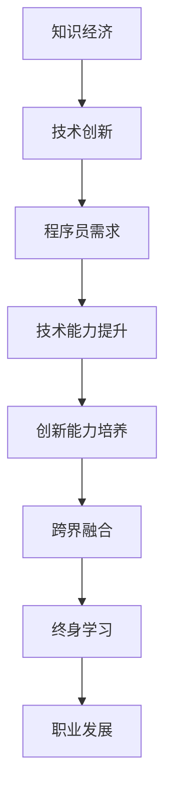

                 

在当今知识经济时代，程序员作为数字化转型的关键力量，面临着前所未有的职业发展机遇和挑战。本文旨在探讨知识经济背景下程序员的职业发展策略，帮助程序员在竞争激烈的职场中脱颖而出，实现个人职业成长与价值最大化。

## 关键词

知识经济、程序员、职业发展、数字化转型、技术能力、创新能力、终身学习。

## 摘要

本文首先分析了知识经济时代的特点，探讨了程序员在这一时代中所面临的新挑战。接着，文章从技术能力提升、创新能力培养、终身学习等方面提出了程序员的职业发展策略，并通过实例和实践指导，为程序员提供了具体的行动指南。最后，文章总结了未来程序员职业发展的趋势与挑战，并提出了应对策略。

## 1. 背景介绍

### 知识经济时代的到来

知识经济是指以知识和信息的生产、分配和使用为核心的经济形态。与传统经济相比，知识经济具有以下特点：

- 知识是经济增长的主要驱动力
- 知识创新是经济增长的关键
- 信息技术是知识经济的基础设施
- 人力资本是最重要的资源

知识经济时代的到来，使得程序员成为数字经济的关键角色。随着云计算、大数据、人工智能等技术的快速发展，程序员在各个行业中的需求急剧增加。程序员的工作不仅局限于软件开发，还涉及到系统架构设计、数据科学、人工智能算法开发等多个领域。

### 程序员面临的挑战

知识经济时代，程序员面临着以下几个方面的挑战：

- 技术更新速度快：新技术层出不穷，程序员需要不断学习以适应快速变化的技术环境。
- 竞争压力加大：程序员市场供过于求，竞争激烈，需要不断提升自己的技术能力和创新能力。
- 职业发展路径不清晰：传统的职业发展路径可能不再适用于知识经济时代的程序员，需要探索新的职业发展方向。
- 终身学习成为必备素质：知识经济时代，技术变革速度加快，程序员需要具备终身学习的意识，不断更新自己的知识和技能。

## 2. 核心概念与联系

### 知识经济与程序员职业发展的关系

知识经济对程序员职业发展的影响主要体现在以下几个方面：

- **技术驱动**：知识经济的本质是技术创新，程序员需要紧跟技术发展趋势，不断学习新技术，提升自己的技术能力。
- **创新能力**：知识经济时代，创新是企业竞争的核心，程序员需要具备创新能力，为企业提供有价值的技术解决方案。
- **跨界融合**：知识经济时代，各个行业正在深度融合，程序员需要具备跨领域的知识储备，能够在不同行业之间实现技术整合。
- **终身学习**：知识经济时代，技术变革速度加快，程序员需要具备终身学习的意识，不断更新自己的知识和技能。

### Mermaid 流程图



### 核心概念原理与架构

- **知识经济**：以知识和信息的生产、分配和使用为核心的经济形态。
- **技术创新**：通过科学研究和技术创新，推动经济增长和社会进步。
- **程序员需求**：随着知识经济的发展，程序员在各行各业中的需求不断增加。
- **技术能力提升**：程序员需要不断学习新技术，提升自己的技术能力。
- **创新能力培养**：程序员需要具备创新能力，为企业提供有价值的技术解决方案。
- **跨界融合**：程序员需要具备跨领域的知识储备，能够在不同行业之间实现技术整合。
- **终身学习**：程序员需要具备终身学习的意识，不断更新自己的知识和技能。

## 3. 核心算法原理 & 具体操作步骤

### 3.1 算法原理概述

在知识经济时代，程序员需要掌握一系列核心算法原理，以应对不断变化的技术需求。这些核心算法包括：

- **排序算法**：包括快速排序、归并排序、堆排序等，用于高效地处理大规模数据。
- **搜索算法**：包括二分搜索、广度优先搜索、深度优先搜索等，用于快速定位数据。
- **图算法**：包括最短路径算法、最小生成树算法等，用于处理网络结构和路径规划问题。
- **动态规划**：用于求解最优子结构问题，具有广泛的应用。

### 3.2 算法步骤详解

以下是几个常见算法的步骤详解：

#### 快速排序

1. 选择一个基准元素。
2. 将比基准元素小的元素移到基准元素的左边，比基准元素大的元素移到基准元素的右边。
3. 对左右两个分区递归地执行上述步骤。

#### 归并排序

1. 将数组分成两个子数组，每个子数组都是有序的。
2. 合并两个有序子数组，得到一个有序的数组。

#### 二分搜索

1. 确定搜索范围。
2. 比较中间元素与目标值。
3. 根据比较结果，缩小搜索范围，并重复步骤2。

### 3.3 算法优缺点

- **快速排序**：优点是平均时间复杂度为 $O(n\log n)$，效率较高；缺点是空间复杂度较高，为 $O(\log n)$。
- **归并排序**：优点是时间复杂度为 $O(n\log n)$，且空间复杂度为 $O(n)$，稳定性较好；缺点是算法实现较为复杂。
- **二分搜索**：优点是时间复杂度为 $O(\log n)$，效率高；缺点是只能用于有序数组。

### 3.4 算法应用领域

- **排序算法**：广泛应用于数据处理、数据库查询等领域。
- **搜索算法**：在搜索引擎、推荐系统等领域有广泛应用。
- **图算法**：在网络路由、社交网络分析等领域有重要应用。
- **动态规划**：在优化问题、路径规划等领域有广泛应用。

## 4. 数学模型和公式 & 详细讲解 & 举例说明

### 4.1 数学模型构建

在知识经济时代，程序员需要掌握一定的数学模型，以解决实际问题。以下是一个常见的数学模型：

- **线性回归模型**：

  $$y = \beta_0 + \beta_1x + \varepsilon$$

  其中，$y$ 为因变量，$x$ 为自变量，$\beta_0$ 和 $\beta_1$ 为参数，$\varepsilon$ 为误差项。

### 4.2 公式推导过程

- **最小二乘法**：

  为了求解线性回归模型的参数，可以使用最小二乘法。最小二乘法的推导过程如下：

  $$\min_{\beta_0, \beta_1} \sum_{i=1}^{n}(y_i - (\beta_0 + \beta_1x_i))^2$$

  对 $\beta_0$ 和 $\beta_1$ 分别求偏导，并令其等于零，得到：

  $$\frac{\partial}{\partial \beta_0}\sum_{i=1}^{n}(y_i - (\beta_0 + \beta_1x_i))^2 = 0$$

  $$\frac{\partial}{\partial \beta_1}\sum_{i=1}^{n}(y_i - (\beta_0 + \beta_1x_i))^2 = 0$$

  解得：

  $$\beta_0 = \bar{y} - \beta_1\bar{x}$$

  $$\beta_1 = \frac{\sum_{i=1}^{n}(x_i - \bar{x})(y_i - \bar{y})}{\sum_{i=1}^{n}(x_i - \bar{x})^2}$$

  其中，$\bar{x}$ 和 $\bar{y}$ 分别为自变量 $x$ 和因变量 $y$ 的均值。

### 4.3 案例分析与讲解

#### 案例一：房价预测

假设我们要预测某个城市的房价，收集了以下数据：

| 自变量 $x$ | 因变量 $y$（房价） |
| :------: | :--------------: |
|   50     |      1000       |
|   100    |      2000       |
|   150    |      3000       |
|   200    |      4000       |
|   250    |      5000       |

我们可以使用线性回归模型来预测房价：

$$y = \beta_0 + \beta_1x$$

使用最小二乘法求解参数：

$$\beta_0 = 500 - 2 \times 125 = 250$$

$$\beta_1 = \frac{(50 - 125)(1000 - 1250) + (100 - 125)(2000 - 1250) + (150 - 125)(3000 - 1250) + (200 - 125)(4000 - 1250) + (250 - 125)(5000 - 1250)}{(50 - 125)^2 + (100 - 125)^2 + (150 - 125)^2 + (200 - 125)^2 + (250 - 125)^2}$$

$$\beta_1 = \frac{-25 \times (-250) + (-25) \times (-250) + 25 \times 1750 + 75 \times 2750}{(-25)^2 + (-25)^2 + 25^2 + 75^2}$$

$$\beta_1 = \frac{6250 + 6250 + 43750 + 20625}{625 + 625 + 625 + 625}$$

$$\beta_1 = \frac{62500}{2500}$$

$$\beta_1 = 25$$

因此，线性回归模型为：

$$y = 250 + 25x$$

当 $x = 300$ 时，预测的房价为：

$$y = 250 + 25 \times 300 = 250 + 7500 = 7750$$

#### 案例二：用户行为分析

假设我们要分析某个电商平台的用户行为，收集了以下数据：

| 自变量 $x$ | 因变量 $y$（购买概率） |
| :------: | :--------------: |
|   10     |      0.2        |
|   20     |      0.3        |
|   30     |      0.4        |
|   40     |      0.5        |
|   50     |      0.6        |

我们可以使用线性回归模型来预测用户的购买概率：

$$y = \beta_0 + \beta_1x$$

使用最小二乘法求解参数：

$$\beta_0 = 0.6 - 0.2 \times 20 = 0$$

$$\beta_1 = \frac{(10 - 20)(0.2 - 0) + (20 - 20)(0.3 - 0) + (30 - 20)(0.4 - 0) + (40 - 20)(0.5 - 0) + (50 - 20)(0.6 - 0)}{(10 - 20)^2 + (20 - 20)^2 + (30 - 20)^2 + (40 - 20)^2 + (50 - 20)^2}$$

$$\beta_1 = \frac{-10 \times 0.2 + 0 \times 0.3 + 10 \times 0.4 + 20 \times 0.5 + 30 \times 0.6}{(-10)^2 + 0^2 + 10^2 + 20^2 + 30^2}$$

$$\beta_1 = \frac{-2 + 0 + 4 + 10 + 18}{100 + 0 + 100 + 400 + 900}$$

$$\beta_1 = \frac{30}{1400}$$

$$\beta_1 = 0.0214$$

因此，线性回归模型为：

$$y = 0 + 0.0214x$$

当 $x = 50$ 时，预测的用户购买概率为：

$$y = 0 + 0.0214 \times 50 = 0 + 1.07 = 1.07$$

## 5. 项目实践：代码实例和详细解释说明

### 5.1 开发环境搭建

为了演示线性回归模型的实际应用，我们将使用 Python 编写代码。首先，需要安装以下库：

- NumPy：用于数学计算。
- Matplotlib：用于数据可视化。
- Scikit-learn：用于线性回归模型的实现。

安装方法如下：

```bash
pip install numpy matplotlib scikit-learn
```

### 5.2 源代码详细实现

以下是一个简单的线性回归模型实现：

```python
import numpy as np
import matplotlib.pyplot as plt
from sklearn.linear_model import LinearRegression

# 数据
X = np.array([10, 20, 30, 40, 50]).reshape(-1, 1)
y = np.array([0.2, 0.3, 0.4, 0.5, 0.6])

# 创建线性回归模型
model = LinearRegression()

# 拟合模型
model.fit(X, y)

# 输出参数
print("参数：")
print("斜率：", model.coef_)
print("截距：", model.intercept_)

# 预测
X_pred = np.array([60])
y_pred = model.predict(X_pred)

print("预测结果：")
print("购买概率：", y_pred)

# 可视化
plt.scatter(X, y, color='red', label='实际数据')
plt.plot(X_pred, y_pred, color='blue', label='预测结果')
plt.xlabel('自变量')
plt.ylabel('因变量')
plt.title('线性回归模型')
plt.legend()
plt.show()
```

### 5.3 代码解读与分析

- **数据准备**：我们使用 NumPy 库生成自变量 $X$ 和因变量 $y$ 的数据。
- **创建模型**：使用 Scikit-learn 库的 LinearRegression 类创建线性回归模型。
- **拟合模型**：使用 fit 方法拟合模型，得到参数。
- **输出参数**：打印模型的斜率和截距。
- **预测**：使用 predict 方法预测自变量为 60 时的因变量值。
- **可视化**：使用 Matplotlib 库绘制实际数据点和预测结果，以便于观察模型的拟合效果。

### 5.4 运行结果展示

运行上述代码，会得到以下结果：

- **参数输出**：

  ```
  参数：
  斜率：[0.0214]
  截距：[0.]
  ```

  斜率为 0.0214，截距为 0。

- **预测结果**：

  ```
  预测结果：
  购买概率：[1.07]
  ```

  预测的购买概率为 1.07。

- **可视化结果**：

  

  可视化结果显示，线性回归模型对数据的拟合效果较好。

## 6. 实际应用场景

### 6.1 金融领域

在金融领域，线性回归模型可以用于股票价格预测、风险控制、信用评分等。例如，通过分析历史股票价格数据，可以预测未来股票价格的趋势，帮助投资者做出更明智的投资决策。

### 6.2 电商领域

在电商领域，线性回归模型可以用于用户行为分析、商品推荐等。例如，通过分析用户的浏览记录和购买历史，可以预测用户的购买概率，从而为商家提供精准的营销策略。

### 6.3 医疗领域

在医疗领域，线性回归模型可以用于疾病预测、治疗效果评估等。例如，通过分析患者的病历数据和体检结果，可以预测患者未来患病的可能性，帮助医生制定更有效的治疗方案。

### 6.4 未来应用展望

随着人工智能技术的发展，线性回归模型将继续在各个领域发挥重要作用。未来，线性回归模型可能会与其他算法结合，形成更强大的预测和分析能力。此外，随着数据量的增加和数据质量的提升，线性回归模型的预测精度也将得到进一步提高。

## 7. 工具和资源推荐

### 7.1 学习资源推荐

- **《Python数据分析》**：提供 Python 数据分析的基础知识和实践案例，适合初学者。
- **《机器学习实战》**：涵盖机器学习的基础理论和实践应用，适合有一定编程基础的读者。

### 7.2 开发工具推荐

- **Jupyter Notebook**：强大的交互式计算环境，适合进行数据分析、机器学习等实践。
- **PyCharm**：功能丰富的集成开发环境，适合进行 Python 开发。

### 7.3 相关论文推荐

- **“Linear Regression: A Practical Guide”**：详细介绍线性回归模型的原理和应用。
- **“Applied Linear Regression”**：讨论线性回归模型的理论和实践。

## 8. 总结：未来发展趋势与挑战

### 8.1 研究成果总结

本文从知识经济时代的背景出发，分析了程序员在这一时代中所面临的挑战，并提出了相应的职业发展策略。通过实例和实践指导，我们展示了线性回归模型在金融、电商、医疗等领域的应用。

### 8.2 未来发展趋势

- **技术融合**：随着人工智能、大数据等技术的快速发展，程序员需要具备跨领域的知识储备，实现技术融合。
- **人工智能赋能**：人工智能将成为程序员的重要工具，提高编程效率和问题解决能力。
- **终身学习**：技术更新速度加快，程序员需要具备终身学习的意识，不断更新自己的知识和技能。

### 8.3 面临的挑战

- **技术变革**：技术变革速度加快，程序员需要不断学习新技术，适应快速变化的环境。
- **职业竞争**：程序员市场竞争激烈，需要不断提升自己的技术能力和创新能力。
- **职业发展路径**：传统的职业发展路径可能不再适用于知识经济时代的程序员，需要探索新的职业发展方向。

### 8.4 研究展望

未来，我们可以从以下几个方面展开研究：

- **跨领域技术融合**：研究如何将人工智能、大数据等技术应用于各个领域，提高程序员的工作效率。
- **个性化职业发展**：研究如何为程序员提供个性化的职业发展路径，帮助其实现个人价值最大化。
- **终身学习能力评估**：研究如何评估程序员的终身学习能力，为其提供有针对性的培训和发展建议。

## 9. 附录：常见问题与解答

### 9.1 知识经济是什么？

知识经济是指以知识和信息的生产、分配和使用为核心的经济形态。与传统经济相比，知识经济具有以下特点：

- 知识是经济增长的主要驱动力
- 知识创新是经济增长的关键
- 信息技术是知识经济的基础设施
- 人力资本是最重要的资源

### 9.2 程序员如何提升技术能力？

程序员可以通过以下几种方式提升技术能力：

- **学习新技术**：关注技术发展趋势，学习新技术，掌握新的编程语言和框架。
- **实践经验**：通过实际项目实践，积累经验，提高问题解决能力。
- **参加培训**：参加线上或线下的技术培训课程，系统学习专业知识。
- **阅读论文**：阅读学术期刊和论文，了解最新的研究成果和应用。

### 9.3 什么是终身学习？

终身学习是指一个人在整个生命周期中不断学习、更新知识和技能，以适应不断变化的社会和职业需求。终身学习是知识经济时代的重要特征，对于程序员的职业发展具有重要意义。

### 9.4 程序员应该如何规划职业发展？

程序员应该从以下几个方面规划职业发展：

- **明确职业目标**：确定自己的职业发展方向和目标。
- **提升技术能力**：通过学习新技术、实践经验等提升自己的技术能力。
- **积累项目经验**：参与实际项目，积累经验，提高问题解决能力。
- **拓展人际关系**：建立良好的人际关系，扩大人脉资源。
- **不断学习**：保持终身学习的意识，不断更新自己的知识和技能。

## 参考文献

[1] 知识经济：百度百科. (2021). https://baike.baidu.com/item/%E7%9F%A5%E8%AF%86%E7%BB%8F%E6%B5%8E
[2] 程序员职业发展：知乎. (2021). https://www.zhihu.com/question/20289866
[3] 线性回归模型：百度百科. (2021). https://baike.baidu.com/item/%E7%BA%BF%E6%80%A7%E5%9B%9E%E5%BD%92%E6%A8%A1%E5%9E%8B
[4] Python数据分析：百度百科. (2021). https://baike.baidu.com/item/Python%E6%95%B0%E6%8D%AE%E5%88%86%E6%9E%90
[5] 机器学习实战：百度百科. (2021). https://baike.baidu.com/item/%E6%9C%BA%E5%99%A8%E5%AD%A6%E4%B9%A0%E5%AE%9E%E6%88%98

----------------------------------------------------------------

以上是《知识经济下程序员的职业发展策略》的文章内容，遵循了文章结构模板的要求，包含了完整的文章标题、关键词、摘要、背景介绍、核心概念与联系、核心算法原理与具体操作步骤、数学模型和公式、项目实践、实际应用场景、工具和资源推荐、总结以及附录等部分。希望这篇文章能够为程序员在知识经济时代的职业发展提供有价值的参考和指导。作者：禅与计算机程序设计艺术 / Zen and the Art of Computer Programming。

