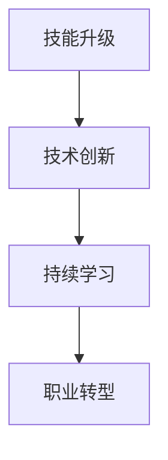

                 

关键词：知识经济，程序员职业转型，技能升级，持续学习，技术创新，职业发展

摘要：随着知识经济的兴起，程序员面临着前所未有的职业挑战和机遇。本文旨在探讨在知识经济时代，程序员如何通过技能升级、持续学习和技术创新实现职业转型，从而提升自身竞争力。文章将结合实际案例，分析程序员在转型过程中可能遇到的挑战及应对策略，并对未来发展趋势进行展望。

## 1. 背景介绍

### 知识经济的崛起

知识经济，是指以知识和信息的生产、分配和使用为基础的经济形态。在知识经济时代，知识成为最重要的生产要素，而不再是传统的劳动力、资本和自然资源。随着互联网、大数据、人工智能等技术的快速发展，知识经济的特征愈发显著。

### 程序员的职业现状

程序员作为知识经济的直接受益者，其职业发展受到了极大的影响。一方面，新技术层出不穷，程序员需要不断学习以保持竞争力；另一方面，程序员的工作模式也在发生变化，远程办公、弹性工作制等成为常态。

### 程序员面临的挑战

1. 技能过时：技术的快速发展使得一些编程语言和框架迅速过时，程序员需要不断更新技能。
2. 竞争激烈：程序员数量逐年增加，市场竞争加剧，程序员需要提升自身竞争力。
3. 工作压力：程序员常常面临高工作强度和长时间的工作，身心健康受到影响。

## 2. 核心概念与联系

### 技能升级

技能升级是指程序员通过学习新技能、掌握新工具，提升自身编程能力的过程。技能升级是程序员职业转型的关键。

### 持续学习

持续学习是指程序员在职业生涯中不断学习新知识、新技能，以适应快速变化的技术环境。持续学习是程序员保持竞争力的必要条件。

### 技术创新

技术创新是指程序员在编程过程中，通过创新思维和新的编程技巧，解决实际问题，提高开发效率。技术创新是程序员职业发展的重要动力。

### Mermaid 流程图



## 3. 核心算法原理 & 具体操作步骤

### 3.1 算法原理概述

在知识经济下，程序员的职业转型涉及多个层面的技能升级。以下是一个简单的算法原理概述，用于解释程序员如何实现技能升级、持续学习和技术创新。

### 3.2 算法步骤详解

#### 3.2.1 技能升级

1. **识别需求**：了解当前技术趋势和市场需求，识别需要提升的技能。
2. **学习计划**：制定详细的学习计划，包括学习目标、时间安排、学习资源等。
3. **实践应用**：通过实际项目或练习，将新技能应用到工作中。

#### 3.2.2 持续学习

1. **知识积累**：通过阅读技术书籍、博客、论文等，积累专业知识。
2. **技术交流**：参与技术社区，与技术同行交流心得，拓展视野。
3. **课程培训**：参加线上或线下的课程培训，系统学习新技能。

#### 3.2.3 技术创新

1. **问题识别**：在工作中识别存在的问题，寻找改进机会。
2. **创新思维**：运用创新思维，提出新的解决方案。
3. **实践验证**：通过实验或实际项目，验证创新方案的有效性。

### 3.3 算法优缺点

#### 优点

1. **提高竞争力**：通过技能升级，程序员能够更好地适应市场需求，提高竞争力。
2. **促进发展**：持续学习和技术创新能够推动程序员职业发展，实现自我价值。

#### 缺点

1. **时间成本**：技能升级和技术创新需要投入大量时间和精力。
2. **适应难度**：新技能的掌握和应用可能面临一定的挑战。

### 3.4 算法应用领域

算法在程序员职业转型中的应用非常广泛，包括但不限于：

1. **软件开发**：通过技术创新，提高软件开发效率和质量。
2. **数据分析**：掌握数据分析技能，为业务决策提供支持。
3. **人工智能**：运用人工智能技术，实现自动化和智能化。

## 4. 数学模型和公式 & 详细讲解 & 举例说明

### 4.1 数学模型构建

在程序员职业转型的过程中，数学模型和公式发挥着重要作用。以下是一个简单的数学模型，用于描述程序员的技能升级过程。

#### 技能水平 = 初始技能水平 + 学习进步 + 实践应用

### 4.2 公式推导过程

假设程序员的初始技能水平为\( S_0 \)，学习进步为\( L \)，实践应用为\( P \)。则程序员的技能水平可以表示为：

\[ S = S_0 + L + P \]

其中，学习进步\( L \)可以通过以下公式计算：

\[ L = \frac{K_1 \times T_1 + K_2 \times T_2}{2} \]

其中，\( K_1 \)和\( K_2 \)分别为知识积累和技术交流的贡献系数，\( T_1 \)和\( T_2 \)分别为知识积累和技术交流的时间投入。

实践应用\( P \)可以通过以下公式计算：

\[ P = \frac{K_3 \times T_3}{2} \]

其中，\( K_3 \)为创新思维的贡献系数，\( T_3 \)为创新思维的时间投入。

### 4.3 案例分析与讲解

假设一名程序员初始技能水平为\( S_0 = 50 \)，知识积累贡献系数\( K_1 = 0.3 \)，技术交流贡献系数\( K_2 = 0.2 \)，创新思维贡献系数\( K_3 = 0.5 \)。他在一个月内分别投入了20小时进行知识积累，15小时进行技术交流，10小时进行创新思维。

根据公式推导，可以计算出该程序员的技能水平为：

\[ S = 50 + \frac{0.3 \times 20 + 0.2 \times 15}{2} + \frac{0.5 \times 10}{2} = 58 \]

这意味着，该程序员的技能水平在一个月内提高了8点。

## 5. 项目实践：代码实例和详细解释说明

### 5.1 开发环境搭建

在项目实践中，首先需要搭建一个合适的开发环境。以下是一个简单的Python开发环境搭建步骤：

1. 安装Python：下载并安装Python 3.x版本。
2. 配置环境变量：将Python安装路径添加到系统环境变量中。
3. 安装IDE：选择一个合适的Python IDE，如PyCharm或VS Code。

### 5.2 源代码详细实现

以下是一个简单的Python代码示例，用于实现一个简单的计算器功能。

```python
def add(x, y):
    return x + y

def subtract(x, y):
    return x - y

def multiply(x, y):
    return x * y

def divide(x, y):
    if y != 0:
        return x / y
    else:
        return "Error: Division by zero"

def main():
    print("Simple Calculator")
    print("1. Add")
    print("2. Subtract")
    print("3. Multiply")
    print("4. Divide")
    
    choice = input("Enter your choice: ")
    
    if choice == "1":
        x = float(input("Enter first number: "))
        y = float(input("Enter second number: "))
        print(add(x, y))
    elif choice == "2":
        x = float(input("Enter first number: "))
        y = float(input("Enter second number: "))
        print(subtract(x, y))
    elif choice == "3":
        x = float(input("Enter first number: "))
        y = float(input("Enter second number: "))
        print(multiply(x, y))
    elif choice == "4":
        x = float(input("Enter first number: "))
        y = float(input("Enter second number: "))
        print(divide(x, y))
    else:
        print("Invalid choice")

if __name__ == "__main__":
    main()
```

### 5.3 代码解读与分析

上述代码实现了一个简单的计算器功能，包括加、减、乘、除四个基本运算。代码中使用了四个函数，分别实现不同的运算功能。

1. `add(x, y)`：实现加法运算。
2. `subtract(x, y)`：实现减法运算。
3. `multiply(x, y)`：实现乘法运算。
4. `divide(x, y)`：实现除法运算，并判断除数是否为零。

主函数`main()`用于展示计算器菜单，接收用户输入并调用相应的函数进行运算。

### 5.4 运行结果展示

运行上述代码，将展示一个简单的计算器菜单。用户根据提示输入相应的运算选项和数值，即可得到运算结果。

```
Simple Calculator
1. Add
2. Subtract
3. Multiply
4. Divide
Enter your choice: 1
Enter first number: 10
Enter second number: 5
15.0
```

## 6. 实际应用场景

### 6.1 企业数字化转型

随着知识经济的兴起，企业数字化转型成为趋势。程序员在数字化转型过程中发挥着重要作用，包括开发企业应用、搭建云计算平台、实现大数据分析等。

### 6.2 人工智能与物联网

人工智能和物联网技术的快速发展，为程序员提供了广阔的应用场景。程序员可以通过开发智能算法、构建物联网平台，实现智能家居、智能交通等领域的应用。

### 6.3 开源社区贡献

程序员可以通过参与开源社区，贡献自己的代码和智慧，提升自身技能，同时为开源项目的发展做出贡献。

## 7. 工具和资源推荐

### 7.1 学习资源推荐

1. 《算法导论》：一本经典的算法教材，适合程序员系统学习算法。
2. 《深度学习》：一本介绍深度学习技术的权威教材，适合程序员学习人工智能。

### 7.2 开发工具推荐

1. PyCharm：一款功能强大的Python IDE，适合进行Python开发。
2. VS Code：一款轻量级且功能丰富的IDE，支持多种编程语言。

### 7.3 相关论文推荐

1. "Deep Learning for Text Classification": 一篇关于文本分类的深度学习论文。
2. "Reinforcement Learning: An Introduction": 一本介绍强化学习技术的教材。

## 8. 总结：未来发展趋势与挑战

### 8.1 研究成果总结

知识经济下，程序员的职业转型已经成为必然趋势。通过技能升级、持续学习和技术创新，程序员能够更好地适应市场需求，提升自身竞争力。

### 8.2 未来发展趋势

1. 技术多样化：程序员需要掌握更多的技术，包括云计算、大数据、人工智能等。
2. 开源生态：程序员将更加依赖开源社区，参与开源项目，提升自身技能。

### 8.3 面临的挑战

1. 技术更新快：程序员需要不断学习，以跟上技术发展的步伐。
2. 工作压力：程序员需要提高工作效率，以应对高工作强度。

### 8.4 研究展望

未来，程序员职业转型将继续深入，技术创新将成为推动职业发展的重要动力。程序员需要不断提升自身技能，适应快速变化的技术环境，实现职业转型。

## 9. 附录：常见问题与解答

### 9.1 如何选择学习资源？

1. 根据自身兴趣和需求选择合适的教材和课程。
2. 参考业内专家和同行的推荐。
3. 关注开源社区和在线资源。

### 9.2 如何提升编程能力？

1. 练习编程：通过实际项目或练习，提高编程技巧。
2. 参与技术社区：参与技术讨论，拓展视野。
3. 深入学习算法和数据结构：掌握基本算法和数据结构，提高编程能力。

### 9.3 如何应对工作压力？

1. 合理规划时间：合理安排工作和休息时间，避免过度劳累。
2. 学习压力管理：通过冥想、运动等方式，缓解工作压力。
3. 寻求支持：与家人、朋友或同事交流，寻求支持和帮助。

---

作者：禅与计算机程序设计艺术 / Zen and the Art of Computer Programming
----------------------------------------------------------------

