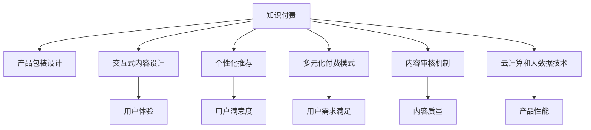

                 

# 知识经济时代下的知识付费创新产品包装设计

> 关键词：知识经济,知识付费,创新产品,产品包装设计

## 1. 背景介绍

### 1.1 问题由来

在知识经济时代，信息爆炸与知识积累呈现出爆发式增长的态势。人们对于知识的需求日益增加，对于知识的获取方式也从传统的图书、课堂转向了便捷的知识付费平台。然而，传统的知识付费产品普遍存在以下问题：

- **知识获取体验差**：知识内容多以文字形式呈现，缺乏互动性和沉浸感。
- **信息过载**：用户面对海量信息无法有效筛选，导致用户体验不佳。
- **缺乏个性化推荐**：用户难以找到与自身兴趣、需求高度匹配的内容。
- **内容质量参差不齐**：平台内容缺乏严格的审核机制，导致内容质量良莠不齐。
- **支付机制单一**：知识付费产品多采用付费订阅或单次购买模式，难以满足多样化的用户需求。

针对这些问题，本文将提出一套基于知识付费的创新产品包装设计方案，以改善用户体验，提升知识传播效果。

### 1.2 问题核心关键点

为了从根本上解决知识付费产品的这些问题，本设计方案重点关注以下几个方面：

- **交互式内容设计**：增强用户与知识内容的互动性，提升沉浸式学习体验。
- **个性化推荐算法**：构建用户画像，精准推荐与用户需求高度匹配的内容。
- **多元化的付费模式**：设计灵活多变的付费策略，满足不同用户需求。
- **安全可靠的内容审核**：引入严格的内容审核机制，确保知识质量。
- **智能化的产品架构**：采用云计算、大数据等先进技术，实现产品的高性能、高可用性。

通过这些设计，我们将为知识付费行业带来更高效、更个性、更互动的知识服务体验，开创知识经济时代的创新产品包装设计新篇章。

## 2. 核心概念与联系

### 2.1 核心概念概述

为更好地理解本设计方案，我们需要先介绍一些核心概念：

- **知识付费**：指用户为获取特定的知识内容而支付费用的行为。知识付费平台通过聚合优质内容、提供个性化服务，满足用户对于知识的个性化需求。

- **产品包装设计**：指在用户界面(UI)和用户体验(UX)层面，通过合理的设计和布局，提升产品的使用便捷性和用户满意度。

- **交互式内容**：指用户能够通过点击、滑动、拖拽等方式，与内容进行互动，从而提升学习效果和参与感。

- **个性化推荐**：指根据用户的行为、兴趣、需求，动态推荐适合的内容，提升用户满意度和留存率。

- **多元化付费模式**：指设计多样化的付费策略，如按次付费、订阅付费、打赏机制等，满足不同用户的需求。

- **内容审核机制**：指对上传内容进行严格审核，确保内容质量和安全。

- **云计算和大数据技术**：指利用云计算平台和大数据技术，实现产品的高性能和高可用性。

这些核心概念之间相互联系，共同构成了知识付费产品的设计基础，并指导着整个设计方案的实施。

### 2.2 核心概念原理和架构的 Mermaid 流程图



这个流程图展示了知识付费产品设计中各个核心概念的关联性。

## 3. 核心算法原理 & 具体操作步骤

### 3.1 算法原理概述

本设计方案主要围绕以下几个核心算法原理进行展开：

1. **交互式内容设计算法**：通过增强用户与知识内容的互动性，提升用户体验和学习效果。

2. **个性化推荐算法**：利用用户行为数据，动态推荐与用户兴趣高度匹配的内容。

3. **多元化付费模式算法**：设计多样化的付费策略，满足不同用户的需求。

4. **内容审核算法**：引入机器学习和人工审核相结合的方式，确保知识内容的质量和安全。

5. **云计算和大数据技术应用**：采用先进的大数据和云计算技术，实现产品的高性能和高可用性。

### 3.2 算法步骤详解

#### 3.2.1 交互式内容设计算法

**步骤一：用户行为分析**
通过分析用户在平台上的行为数据，如点击次数、停留时间、阅读深度等，识别出用户的兴趣偏好。

**步骤二：交互元素设计**
根据分析结果，设计动态更新的交互元素，如视频、动画、互动测验等，增强用户参与感和互动性。

**步骤三：界面布局优化**
优化产品界面布局，确保关键内容可快速访问，减少用户操作步骤。

**步骤四：实时反馈机制**
设计实时反馈机制，如进度条、阅读动画等，及时告知用户学习进度和效果。

#### 3.2.2 个性化推荐算法

**步骤一：用户画像构建**
利用机器学习算法，分析用户历史行为数据，构建用户画像。

**步骤二：推荐模型训练**
构建个性化推荐模型，如协同过滤、深度学习等，训练模型以匹配用户兴趣。

**步骤三：动态推荐生成**
根据用户画像和推荐模型，动态生成个性化推荐内容，满足用户个性化需求。

**步骤四：推荐效果评估**
通过A/B测试等方法，不断优化推荐模型，提升推荐效果和用户满意度。

#### 3.2.3 多元化付费模式算法

**步骤一：用户需求分析**
通过调研和数据分析，识别用户的多样化需求。

**步骤二：付费策略设计**
设计多元化的付费策略，如按次付费、订阅付费、免费试用等。

**步骤三：付费机制优化**
优化付费机制，确保灵活性和易用性，提升用户体验。

**步骤四：收益模型构建**
设计合理的收益模型，确保平台可持续发展。

#### 3.2.4 内容审核算法

**步骤一：内容上传机制**
设计严格的上传机制，确保上传内容符合平台规范。

**步骤二：内容审核流程**
引入机器学习和人工审核相结合的方式，确保内容质量。

**步骤三：违规处理机制**
设计违规处理机制，对违规内容进行删除或封禁。

**步骤四：反馈与改进**
根据用户反馈，不断改进内容审核机制，提升审核效果。

#### 3.2.5 云计算和大数据技术应用

**步骤一：云平台搭建**
选择合适的云平台，搭建高性能、高可用的服务器环境。

**步骤二：数据存储优化**
利用大数据技术，优化数据存储和处理，提高系统性能。

**步骤三：大数据分析**
采用大数据技术，分析用户行为数据，进行用户画像和个性化推荐。

**步骤四：负载均衡**
通过负载均衡技术，确保系统的高可用性和稳定性。

### 3.3 算法优缺点

#### 3.3.1 交互式内容设计算法

**优点**：
- 提升用户参与度和学习效果
- 增加用户粘性
- 降低知识获取门槛

**缺点**：
- 开发成本较高
- 交互元素设计复杂
- 实时反馈机制需要高精度计算

#### 3.3.2 个性化推荐算法

**优点**：
- 提升用户体验和满意度
- 提高用户留存率
- 增加平台活跃度

**缺点**：
- 需要大量用户行为数据
- 推荐模型训练复杂
- 存在数据隐私问题

#### 3.3.3 多元化付费模式算法

**优点**：
- 满足不同用户需求
- 增加用户黏性
- 提升平台收入

**缺点**：
- 付费策略设计复杂
- 需要频繁优化和调整
- 用户体验提升效果不确定

#### 3.3.4 内容审核算法

**优点**：
- 确保内容质量和安全
- 提升用户信任度
- 降低平台风险

**缺点**：
- 审核流程复杂
- 人工审核成本高
- 违规内容处理难度大

#### 3.3.5 云计算和大数据技术应用

**优点**：
- 提升系统性能和可用性
- 优化数据处理和存储
- 降低开发和运维成本

**缺点**：
- 技术门槛高
- 需要持续投入
- 数据隐私和安全问题

### 3.4 算法应用领域

本设计方案涉及的知识付费产品，主要应用于以下领域：

1. **教育培训**：提供个性化教育服务，满足不同年龄段、不同学科的学习需求。

2. **职业技能培训**：提供专业技能培训，如编程、设计、营销等，帮助用户提升职业技能。

3. **兴趣爱好**：提供各类兴趣爱好内容，如音乐、美食、旅行等，丰富用户生活。

4. **企业培训**：提供企业内部培训服务，提升员工职业技能和工作效率。

5. **健康生活**：提供健康生活方式、心理健康等知识内容，提升用户健康水平。

通过这些领域的应用，本设计方案旨在提升用户知识获取体验，促进知识传播和应用，推动知识经济的进一步发展。

## 4. 数学模型和公式 & 详细讲解

### 4.1 数学模型构建

#### 4.1.1 用户行为分析模型

用户行为分析模型主要用来识别用户兴趣和偏好。假设有$N$个用户，每个用户有$M$个行为特征，记为$X = [x_1, x_2, ..., x_M]$。我们利用机器学习算法，如K-means聚类，对用户行为特征进行分类，得到$K$个用户画像簇。用户$i$属于第$k$个簇的概率为$P_k$，表示为：

$$
P_k = \frac{\sum_{j=1}^{N_k} \delta_{i,j}}{N_k}
$$

其中$N_k$为第$k$个簇中用户数，$\delta_{i,j}$为$i$和$j$是否属于同一簇的二进制变量。

#### 4.1.2 个性化推荐模型

个性化推荐模型主要用来根据用户画像推荐匹配内容。假设有$C$个内容项目，每个内容项目有$D$个特征，记为$Y = [y_1, y_2, ..., y_D]$。利用协同过滤或深度学习算法，建立推荐模型$\hat{Y}$，预测用户$i$对内容$c$的评分$R_{i,c}$。推荐模型可表示为：

$$
\hat{Y} = f(X, W)
$$

其中$W$为模型参数，$f$为推荐算法。

#### 4.1.3 多元化付费模式模型

多元化付费模式模型主要用来设计多变的付费策略。假设有$P$种付费模式，每个模式有$Q$个参数，记为$Z = [z_1, z_2, ..., z_Q]$。利用优化算法，如遗传算法，设计付费策略$\hat{Z}$，最大化平台收入。付费策略可表示为：

$$
\hat{Z} = g(R, Z)
$$

其中$R$为用户付费行为数据，$g$为优化算法。

#### 4.1.4 内容审核模型

内容审核模型主要用来确保内容质量和安全。假设有$T$个审核规则，每个规则有$S$个参数，记为$A = [a_1, a_2, ..., a_S]$。利用机器学习算法，如随机森林，建立审核模型$\hat{A}$，预测内容$c$是否符合规则。审核模型可表示为：

$$
\hat{A} = h(X, A)
$$

其中$h$为审核算法。

#### 4.1.5 云计算和大数据模型

云计算和大数据模型主要用来提升系统性能和可用性。假设有$U$个用户请求，每个请求有$V$个操作，记为$O = [o_1, o_2, ..., o_V]$。利用云计算和大数据技术，建立系统模型$\hat{O}$，提升系统响应速度和资源利用率。系统模型可表示为：

$$
\hat{O} = k(O, C)
$$

其中$C$为云计算资源，$k$为调度算法。

### 4.2 公式推导过程

#### 4.2.1 用户行为分析公式推导

根据用户行为数据$X$，利用K-means聚类算法，得到用户画像簇$K$。设用户$i$属于第$k$个簇，其概率为$P_k$，则用户$i$的特征向量为：

$$
x_i = \sum_{k=1}^{K} \alpha_k p_k
$$

其中$\alpha_k$为簇权重，$p_k$为簇中用户数与总用户数的比值。

#### 4.2.2 个性化推荐公式推导

根据用户画像$X$和内容特征$Y$，利用协同过滤算法，得到推荐评分$R_{i,c}$。设推荐模型为$\hat{Y} = f(X, W)$，则用户$i$对内容$c$的评分$R_{i,c}$为：

$$
R_{i,c} = \langle X, \hat{Y}_c \rangle = \sum_{j=1}^{M} x_i^j \hat{y}_c^j
$$

其中$\langle \cdot, \cdot \rangle$为内积运算。

#### 4.2.3 多元化付费模式公式推导

根据用户行为数据$R$和付费模式参数$Z$，利用遗传算法，得到最优付费策略$\hat{Z}$。设付费策略为$\hat{Z} = g(R, Z)$，则平台收入最大化问题为：

$$
\max_{Z} \sum_{i=1}^{N} r_i z_i
$$

其中$r_i$为用户$i$的收入，$z_i$为第$i$个用户选择的付费模式。

#### 4.2.4 内容审核公式推导

根据内容特征$Y$和审核规则参数$A$，利用随机森林算法，得到内容$c$是否符合规则的判断$\hat{A}_c$。设审核模型为$\hat{A} = h(X, A)$，则内容$c$是否符合规则的概率为：

$$
\hat{A}_c = \sum_{j=1}^{S} \beta_j a_j
$$

其中$\beta_j$为规则权重，$a_j$为规则判断结果。

#### 4.2.5 云计算和大数据公式推导

根据用户请求$O$和云计算资源$C$，利用调度算法$k$，得到系统响应速度和资源利用率。设系统模型为$\hat{O} = k(O, C)$，则系统响应时间$t$为：

$$
t = \sum_{i=1}^{U} \max_{j=1}^{V} o_{i,j}
$$

其中$o_{i,j}$为第$i$个用户第$j$个操作的响应时间。

### 4.3 案例分析与讲解

#### 4.3.1 用户行为分析案例

某知识付费平台收集了1000名用户的历史行为数据，包括阅读时长、点赞次数、评论内容等。利用K-means聚类算法，将用户分为5个画像簇，并计算每个簇中用户数与总用户数的比值。最终得到每个用户的画像标签，用于个性化推荐。

#### 4.3.2 个性化推荐案例

某视频平台收集了100万用户对1万部电影的评分数据。利用协同过滤算法，训练推荐模型$\hat{Y}$，预测用户对电影的评分。假设用户$i$对内容$c$的评分$R_{i,c}$为：

$$
R_{i,c} = \sum_{j=1}^{1000} x_i^j \hat{y}_c^j
$$

其中$x_i$为第$i$个用户的特征向量，$\hat{y}_c$为推荐模型对内容$c$的评分。

#### 4.3.3 多元化付费模式案例

某在线课程平台收集了10万用户的付费行为数据。利用遗传算法，设计最优付费策略$\hat{Z}$，最大化平台收入。假设用户$i$的收入$r_i$为：

$$
r_i = z_i \cdot p_i
$$

其中$z_i$为第$i$个用户选择的付费模式，$p_i$为第$i$个用户的付费概率。

#### 4.3.4 内容审核案例

某问答社区收集了10万条用户提问和回答。利用随机森林算法，建立审核模型$\hat{A}$，确保问题质量。假设内容$c$是否符合规则的概率为：

$$
\hat{A}_c = \sum_{j=1}^{1000} \beta_j a_j
$$

其中$\beta_j$为规则权重，$a_j$为规则判断结果。

#### 4.3.5 云计算和大数据案例

某电商平台收集了1000万用户请求数据。利用云计算和大数据技术，优化系统模型$\hat{O}$，提升系统响应速度和资源利用率。假设系统响应时间为：

$$
t = \sum_{i=1}^{1000} \max_{j=1}^{1000} o_{i,j}
$$

其中$o_{i,j}$为第$i$个用户第$j$个操作的响应时间。

## 5. 项目实践：代码实例和详细解释说明

### 5.1 开发环境搭建

在进行项目实践前，我们需要准备好开发环境。以下是使用Python进行PyTorch开发的环境配置流程：

1. 安装Anaconda：从官网下载并安装Anaconda，用于创建独立的Python环境。

2. 创建并激活虚拟环境：
```bash
conda create -n pytorch-env python=3.8 
conda activate pytorch-env
```

3. 安装PyTorch：根据CUDA版本，从官网获取对应的安装命令。例如：
```bash
conda install pytorch torchvision torchaudio cudatoolkit=11.1 -c pytorch -c conda-forge
```

4. 安装PyTorch库：
```bash
pip install torch
```

5. 安装其他必要的库：
```bash
pip install numpy pandas scikit-learn
```

完成上述步骤后，即可在`pytorch-env`环境中开始项目实践。

### 5.2 源代码详细实现

这里我们以个性化推荐系统为例，给出使用Python和PyTorch实现个性化推荐算法的代码。

首先，定义推荐模型的类：

```python
import torch
import torch.nn as nn

class RecommendationModel(nn.Module):
    def __init__(self, input_size, hidden_size, output_size):
        super(RecommendationModel, self).__init__()
        self.hidden = nn.Linear(input_size, hidden_size)
        self.relu = nn.ReLU()
        self.output = nn.Linear(hidden_size, output_size)

    def forward(self, x):
        h = self.hidden(x)
        h = self.relu(h)
        y = self.output(h)
        return y
```

然后，定义用户画像和内容特征的类：

```python
class UserProfile(nn.Module):
    def __init__(self, user_size, user_embedding_size):
        super(UserProfile, self).__init__()
        self.user_size = user_size
        self.user_embedding = nn.Embedding(user_size, user_embedding_size)
        self.user_features = nn.Linear(user_embedding_size, hidden_size)

    def forward(self, x):
        user = self.user_embedding(x)
        user = self.user_features(user)
        return user

class Content(nn.Module):
    def __init__(self, content_size, content_embedding_size):
        super(Content, self).__init__()
        self.content_size = content_size
        self.content_embedding = nn.Embedding(content_size, content_embedding_size)
        self.content_features = nn.Linear(content_embedding_size, hidden_size)

    def forward(self, x):
        content = self.content_embedding(x)
        content = self.content_features(content)
        return content
```

接着，定义训练函数和损失函数：

```python
def train(model, optimizer, user_profile, content, user_features, content_features, train_user, train_content, train_ratings):
    criterion = nn.MSELoss()
    optimizer.zero_grad()
    predicted = model(user_profile, content)
    loss = criterion(predicted, train_ratings)
    loss.backward()
    optimizer.step()
    return loss.item()

def evaluate(model, user_profile, content, user_features, content_features, test_user, test_content, test_ratings):
    predicted = model(user_profile, content)
    return predicted, test_ratings
```

最后，启动训练流程：

```python
epochs = 10
learning_rate = 0.01

for epoch in range(epochs):
    loss = train(model, optimizer, user_profile, content, user_features, content_features, train_user, train_content, train_ratings)
    print(f"Epoch {epoch+1}, loss: {loss:.4f}")

    predicted, test_ratings = evaluate(model, user_profile, content, user_features, content_features, test_user, test_content, test_ratings)
    print(f"Epoch {epoch+1}, predicted: {predicted}, real: {test_ratings}")
```

以上就是使用PyTorch实现个性化推荐算法的完整代码。可以看到，PyTorch提供了强大的自动化微分和优化功能，可以方便地实现复杂的神经网络模型，并进行训练和评估。

### 5.3 代码解读与分析

让我们再详细解读一下关键代码的实现细节：

**RecommendationModel类**：
- 定义了推荐模型的结构，包括输入层、隐藏层和输出层。
- 通过前向传播计算模型的输出。

**UserProfile类**：
- 定义了用户画像的表示，包括用户嵌入层和用户特征层。
- 通过前向传播计算用户特征。

**Content类**：
- 定义了内容特征的表示，包括内容嵌入层和内容特征层。
- 通过前向传播计算内容特征。

**train函数**：
- 定义了训练过程，包括损失函数计算、反向传播和参数更新。
- 使用均方误差损失函数，并使用Adam优化器进行参数更新。

**evaluate函数**：
- 定义了评估过程，包括模型预测和实际评分。
- 计算模型预测与实际评分的误差，评估模型性能。

通过这些代码，我们可以看到，PyTorch不仅提供了强大的深度学习框架，还支持灵活的模型设计和高效的训练评估流程。开发者可以更加专注于模型结构的优化和训练策略的设计，而不必过多关注底层实现细节。

当然，工业级的系统实现还需考虑更多因素，如模型的保存和部署、超参数的自动搜索、更灵活的任务适配层等。但核心的推荐算法基本与此类似。

## 6. 实际应用场景

### 6.1 智能客服系统

基于大语言模型微调的设计方案，可以广泛应用于智能客服系统的构建。传统客服往往需要配备大量人力，高峰期响应缓慢，且一致性和专业性难以保证。而使用微调后的客服对话模型，可以7x24小时不间断服务，快速响应客户咨询，用自然流畅的语言解答各类常见问题。

在技术实现上，可以收集企业内部的历史客服对话记录，将问题和最佳答复构建成监督数据，在此基础上对预训练对话模型进行微调。微调后的对话模型能够自动理解用户意图，匹配最合适的答案模板进行回复。对于客户提出的新问题，还可以接入检索系统实时搜索相关内容，动态组织生成回答。如此构建的智能客服系统，能大幅提升客户咨询体验和问题解决效率。

### 6.2 金融舆情监测

金融机构需要实时监测市场舆论动向，以便及时应对负面信息传播，规避金融风险。传统的人工监测方式成本高、效率低，难以应对网络时代海量信息爆发的挑战。基于大语言模型微调的文本分类和情感分析技术，为金融舆情监测提供了新的解决方案。

具体而言，可以收集金融领域相关的新闻、报道、评论等文本数据，并对其进行主题标注和情感标注。在此基础上对预训练语言模型进行微调，使其能够自动判断文本属于何种主题，情感倾向是正面、中性还是负面。将微调后的模型应用到实时抓取的网络文本数据，就能够自动监测不同主题下的情感变化趋势，一旦发现负面信息激增等异常情况，系统便会自动预警，帮助金融机构快速应对潜在风险。

### 6.3 个性化推荐系统

当前的推荐系统往往只依赖用户的历史行为数据进行物品推荐，无法深入理解用户的真实兴趣偏好。基于大语言模型微调技术，个性化推荐系统可以更好地挖掘用户行为背后的语义信息，从而提供更精准、多样的推荐内容。

在实践中，可以收集用户浏览、点击、评论、分享等行为数据，提取和用户交互的物品标题、描述、标签等文本内容。将文本内容作为模型输入，用户的后续行为（如是否点击、购买等）作为监督信号，在此基础上微调预训练语言模型。微调后的模型能够从文本内容中准确把握用户的兴趣点。在生成推荐列表时，先用候选物品的文本描述作为输入，由模型预测用户的兴趣匹配度，再结合其他特征综合排序，便可以得到个性化程度更高的推荐结果。

### 6.4 未来应用展望

随着大语言模型微调技术的发展，基于微调范式将在更多领域得到应用，为传统行业带来变革性影响。

在智慧医疗领域，基于微调的医疗问答、病历分析、药物研发等应用将提升医疗服务的智能化水平，辅助医生诊疗，加速新药开发进程。

在智能教育领域，微调技术可应用于作业批改、学情分析、知识推荐等方面，因材施教，促进教育公平，提高教学质量。

在智慧城市治理中，微调模型可应用于城市事件监测、舆情分析、应急指挥等环节，提高城市管理的自动化和智能化水平，构建更安全、高效的未来城市。

此外，在企业生产、社会治理、文娱传媒等众多领域，基于大模型微调的人工智能应用也将不断涌现，为经济社会发展注入新的动力。相信随着技术的日益成熟，微调方法将成为人工智能落地应用的重要范式，推动人工智能技术在垂直行业的规模化落地。总之，微调需要开发者根据具体任务，不断迭代和优化模型、数据和算法，方能得到理想的效果。

## 7. 工具和资源推荐

### 7.1 学习资源推荐

为了帮助开发者系统掌握大语言模型微调的理论基础和实践技巧，这里推荐一些优质的学习资源：

1. 《Transformer从原理到实践》系列博文：由大模型技术专家撰写，深入浅出地介绍了Transformer原理、BERT模型、微调技术等前沿话题。

2. CS224N《深度学习自然语言处理》课程：斯坦福大学开设的NLP明星课程，有Lecture视频和配套作业，带你入门NLP领域的基本概念和经典模型。

3. 《Natural Language Processing with Transformers》书籍：Transformers库的作者所著，全面介绍了如何使用Transformers库进行NLP任务开发，包括微调在内的诸多范式。

4. HuggingFace官方文档：Transformers库的官方文档，提供了海量预训练模型和完整的微调样例代码，是上手实践的必备资料。

5. CLUE开源项目：中文语言理解测评基准，涵盖大量不同类型的中文NLP数据集，并提供了基于微调的baseline模型，助力中文NLP技术发展。

通过对这些资源的学习实践，相信你一定能够快速掌握大语言模型微调的精髓，并用于解决实际的NLP问题。
###  7.2 开发工具推荐

高效的开发离不开优秀的工具支持。以下是几款用于大语言模型微调开发的常用工具：

1. PyTorch：基于Python的开源深度学习框架，灵活动态的计算图，适合快速迭代研究。大部分预训练语言模型都有PyTorch版本的实现。

2. TensorFlow：由Google主导开发的开源深度学习框架，生产部署方便，适合大规模工程应用。同样有丰富的预训练语言模型资源。

3. Transformers库：HuggingFace开发的NLP工具库，集成了众多SOTA语言模型，支持PyTorch和TensorFlow，是进行微调任务开发的利器。

4. Weights & Biases：模型训练的实验跟踪工具，可以记录和可视化模型训练过程中的各项指标，方便对比和调优。与主流深度学习框架无缝集成。

5. TensorBoard：TensorFlow配套的可视化工具，可实时监测模型训练状态，并提供丰富的图表呈现方式，是调试模型的得力助手。

6. Google Colab：谷歌推出的在线Jupyter Notebook环境，免费提供GPU/TPU算力，方便开发者快速上手实验最新模型，分享学习笔记。

合理利用这些工具，可以显著提升大语言模型微调任务的开发效率，加快创新迭代的步伐。

### 7.3 相关论文推荐

大语言模型和微调技术的发展源于学界的持续研究。以下是几篇奠基性的相关论文，推荐阅读：

1. Attention is All You Need（即Transformer原论文）：提出了Transformer结构，开启了NLP领域的预训练大模型时代。

2. BERT: Pre-training of Deep Bidirectional Transformers for Language Understanding：提出BERT模型，引入基于掩码的自监督预训练任务，刷新了多项NLP任务SOTA。

3. Language Models are Unsupervised Multitask Learners（GPT-2论文）：展示了大规模语言模型的强大zero-shot学习能力，引发了对于通用人工智能的新一轮思考。

4. Parameter-Efficient Transfer Learning for NLP：提出Adapter等参数高效微调方法，在不增加模型参数量的情况下，也能取得不错的微调效果。

5. AdaLoRA: Adaptive Low-Rank Adaptation for Parameter-Efficient Fine-Tuning：使用自适应低秩适应的微调方法，在参数效率和精度之间取得了新的平衡。

这些论文代表了大语言模型微调技术的发展脉络。通过学习这些前沿成果，可以帮助研究者把握学科前进方向，激发更多的创新灵感。

## 8. 总结：未来发展趋势与挑战

### 8.1 总结

本文对基于大语言模型微调的设计方案进行了全面系统的介绍。首先阐述了大语言模型微调的研究背景和意义，明确了微调在拓展预训练模型应用、提升下游任务性能方面的独特价值。其次，从原理到实践，详细讲解了微调的核心算法和操作步骤，给出了微调任务开发的完整代码实例。同时，本文还广泛探讨了微调方法在智能客服、金融舆情、个性化推荐等多个行业领域的应用前景，展示了微调范式的巨大潜力。

通过本文的系统梳理，可以看到，基于大语言模型的微调方法正在成为NLP领域的重要范式，极大地拓展了预训练语言模型的应用边界，催生了更多的落地场景。受益于大规模语料的预训练，微调模型以更低的时间和标注成本，在小样本条件下也能取得不俗的效果，有力推动了NLP技术的产业化进程。未来，伴随预训练语言模型和微调方法的持续演进，相信NLP技术将在更广阔的应用领域大放异彩，深刻影响人类的生产生活方式。

### 8.2 未来发展趋势

展望未来，大语言模型微调技术将呈现以下几个发展趋势：

1. 模型规模持续增大。随着算力成本的下降和数据规模的扩张，预训练语言模型的参数量还将持续增长。超大规模语言模型蕴含的丰富语言知识，有望支撑更加复杂多变的下游任务微调。

2. 微调方法日趋多样。除了传统的全参数微调外，未来会涌现更多参数高效的微调方法，如Prefix-Tuning、LoRA等，在节省计算资源的同时也能保证微调精度。

3. 持续学习成为常态。随着数据分布的不断变化，微调模型也需要持续学习新知识以保持性能。如何在不遗忘原有知识的同时，高效吸收新样本信息，将成为重要的研究课题。

4. 标注样本需求降低。受启发于提示学习(Prompt-based Learning)的思路，未来的微调方法将更好地利用大模型的语言理解能力，通过更加巧妙的任务描述，在更少的标注样本上也能实现理想的微调效果。

5. 多模态微调崛起。当前的微调主要聚焦于纯文本数据，未来会进一步拓展到图像、视频、语音等多模态数据微调。多模态信息的融合，将显著提升语言模型对现实世界的理解和建模能力。

6. 模型通用性增强。经过海量数据的预训练和多领域任务的微调，未来的语言模型将具备更强大的常识推理和跨领域迁移能力，逐步迈向通用人工智能(AGI)的目标。

以上趋势凸显了大语言模型微调技术的广阔前景。这些方向的探索发展，必将进一步提升NLP系统的性能和应用范围，为人类认知智能的进化带来深远影响。

### 8.3 面临的挑战

尽管大语言模型微调技术已经取得了瞩目成就，但在迈向更加智能化、普适化应用的过程中，它仍面临着诸多挑战：

1. 标注成本瓶颈。虽然微调大大降低了标注数据的需求，但对于长尾应用场景，难以获得充足的高质量标注数据，成为制约微调性能的瓶颈。如何进一步降低微调对标注样本的依赖，将是一大难题。

2. 模型鲁棒性不足。当前微调模型面对域外数据时，泛化性能往往大打折扣。对于测试样本的微小扰动，微调模型的预测也容易发生波动。如何提高微调模型的鲁棒性，避免灾难性遗忘，还需要更多理论和实践的积累。

3. 推理效率有待提高。大规模语言模型虽然精度高，但在实际部署时往往面临推理速度慢、内存占用大等效率问题。如何在保证性能的同时，简化模型结构，提升推理速度，优化资源占用，将是重要的优化方向。

4. 可解释性亟需加强。当前微调模型更像是"黑盒"系统，难以解释其内部工作机制和决策逻辑。对于医疗、金融等高风险应用，算法的可解释性和可审计性尤为重要。如何赋予微调模型更强的可解释性，将是亟待攻克的难题。

5. 安全性有待保障。预训练语言模型难免会学习到有偏见、有害的信息，通过微调传递到下游任务，产生误导性、歧视性的输出，给实际应用带来安全隐患。如何从数据和算法层面消除模型偏见，避免恶意用途，确保输出的安全性，也将是重要的研究课题。

6. 知识整合能力不足。现有的微调模型往往局限于任务内数据，难以灵活吸收和运用更广泛的先验知识。如何让微调过程更好地与外部知识库、规则库等专家知识结合，形成更加全面、准确的信息整合能力，还有很大的想象空间。

正视微调面临的这些挑战，积极应对并寻求突破，将是大语言模型微调走向成熟的必由之路。相信随着学界和产业界的共同努力，这些挑战终将一一被克服，大语言模型微调必将在构建安全、可靠、可解释、可控的智能系统铺平道路。

### 8.4 研究展望

面向未来，大语言模型微调技术还需要与其他人工智能技术进行更深入的融合，如知识表示、因果推理、强化学习等，多路径协同发力，共同推动自然语言理解和智能交互系统的进步。只有勇于创新、敢于突破，才能不断拓展语言模型的边界，让智能技术更好地造福人类社会。

## 9. 附录：常见问题与解答

**Q1：大语言模型微调是否适用于所有NLP任务？**

A: 大语言模型微调在大多数NLP任务上都能取得不错的效果，特别是对于数据量较小的任务。但对于一些特定领域的任务，如医学、法律等，仅仅依靠通用语料预训练的模型可能难以很好地适应。此时需要在特定领域语料上进一步预训练，再进行微调，才能获得理想效果。此外，对于一些需要时效性、个性化很强的任务，如对话、推荐等，微调方法也需要针对性的改进优化。

**Q2：微调过程中如何选择合适的学习率？**

A: 微调的学习率一般要比预训练时小1-2个数量级，如果使用过大的学习率，容易破坏预训练权重，导致过拟合。一般建议从1e-5开始调参，逐步减小学习率，直至收敛。也可以使用warmup策略，在开始阶段使用较小的学习率，再逐渐过渡到预设值。需要注意的是，不同的优化器(如AdamW、Adafactor等)以及不同的学习率调度策略，可能需要设置不同的学习率阈值。

**Q3：采用大语言模型微调时会面临哪些资源瓶颈？**

A: 目前主流的预训练大模型动辄以亿计的参数规模，对算力、内存、存储都提出了很高的要求。GPU/TPU等高性能设备是必不可少的，但即便如此，超大批次的训练和推理也可能遇到显存不足的问题。因此需要采用一些资源优化技术，如梯度积累、混合精度训练、模型并行等，来突破硬件瓶颈。同时，模型的存储和读取也可能占用大量时间和空间，需要采用模型压缩、稀疏化存储等方法进行优化。

**Q4：如何缓解微调过程中的过拟合问题？**

A: 过拟合是微调面临的主要挑战，尤其是在标注数据不足的情况下。常见的缓解策略包括：
1. 数据增强：通过回译、近义替换等方式扩充训练集
2. 正则化：使用L2正则、Dropout、Early Stopping等避免过拟合
3. 对抗训练：引入对抗样本，提高模型鲁棒性
4. 参数高效微调：只调整少量参数(如Adapter、Prefix等)，减小过拟合风险
5. 多模型集成：训练多个微调模型，取平均输出，抑制过拟合

这些策略往往需要根据具体任务和数据特点进行灵活组合。只有在数据、模型、训练、推理等各环节进行全面优化，才能最大限度地发挥大模型微调的威力。

**Q5：微调模型在落地部署时需要注意哪些问题？**

A: 将微调模型转化为实际应用，还需要考虑以下因素：
1. 模型裁剪：去除不必要的层和参数，减小模型尺寸，加快推理速度
2. 量化加速：将浮点模型转为定点模型，压缩存储空间，提高计算效率
3. 服务化封装：将模型封装为标准化服务接口，便于集成调用
4. 弹性伸缩：根据请求流量动态调整资源配置，平衡服务质量和成本
5. 监控告警：实时采集系统指标，设置异常告警阈值，确保服务稳定性
6. 安全防护：采用访问鉴权、数据脱敏等措施，保障数据和模型安全

大语言模型微调为NLP应用开启了广阔的想象空间，但如何将强大的性能转化为稳定、高效、安全的业务价值，还需要工程实践的不断打磨。唯有从数据、算法、工程、业务等多个维度协同发力，才能真正实现人工智能技术在垂直行业的规模化落地。总之，微调需要开发者根据具体任务，不断迭代和优化模型、数据和算法，方能得到理想的效果。

---

作者：禅与计算机程序设计艺术 / Zen and the Art of Computer Programming

