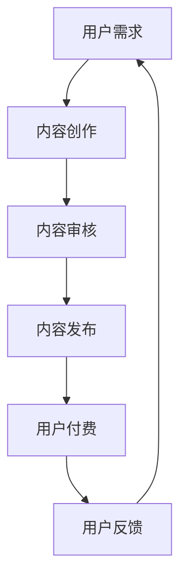

                 

### 1. 背景介绍

在过去的几十年里，信息技术（IT）的发展极大地改变了人们的生活方式、工作方式以及消费模式。随着互联网的普及和移动设备的广泛使用，信息的获取和传播变得更加便捷。与此同时，知识经济逐渐成为全球经济发展的新动力，知识的创造、传播和应用成为推动经济增长和社会进步的核心要素。

知识付费作为一种商业模式，应运而生并迅速发展。知识付费指的是用户为获取特定的知识内容或服务而支付费用的一种行为。这种模式打破了传统免费内容的商业模式，使知识创造者能够通过知识付费获得合理的收益，从而激励更多的高质量内容产生。

知识付费的兴起不仅改变了知识传播的方式，也带来了商业模式的创新。本文将深入探讨知识经济时代下的知识付费创新商业模式，分析其核心概念、原理、应用领域以及未来发展趋势。

### 2. 核心概念与联系

#### 2.1 知识付费的概念

知识付费是指用户为获取特定的知识内容或服务而支付费用的行为。知识付费可以涵盖多个领域，如教育、技能培训、专业咨询、知识问答等。其核心在于价值的交换，即用户通过付费获得高质量的知识内容或服务，而知识创造者通过提供这些内容或服务获得收益。

#### 2.2 商业模式的概念

商业模式是指企业如何通过特定的业务模式和收入模式创造、传递和捕获价值的一种计划或机制。在知识付费领域，商业模式涉及到知识内容的创造、分发、传播以及用户付费等环节。

#### 2.3 商业模式与知识付费的关系

知识付费是商业模式的一种表现形式，它通过将知识作为商品进行交易，实现知识创造者与用户之间的价值交换。知识付费商业模式的核心在于如何有效地将知识转化为商品，并通过市场机制实现知识的传播和价值的最大化。

#### 2.4 Mermaid 流程图

以下是一个简化的Mermaid流程图，展示了知识付费商业模式的运作流程：



- **A 用户需求**：用户根据自身需求寻找知识内容或服务。
- **B 内容创作**：知识创造者根据用户需求创作知识内容。
- **C 内容审核**：平台对知识内容进行审核，确保其质量符合标准。
- **D 内容发布**：审核通过的知识内容在平台发布，供用户购买和阅读。
- **E 用户付费**：用户购买知识内容，支付费用。
- **F 用户反馈**：用户对知识内容进行评价和反馈，影响知识创造者的创作方向。

### 3. 核心算法原理 & 具体操作步骤

#### 3.1 算法原理概述

知识付费商业模式的运作离不开核心算法的支持。核心算法主要包括用户行为分析、内容推荐算法和交易匹配算法等。

- **用户行为分析算法**：通过分析用户的浏览历史、购买记录、评价等行为数据，了解用户的知识需求和偏好。
- **内容推荐算法**：基于用户行为数据和内容标签，为用户推荐可能感兴趣的知识内容。
- **交易匹配算法**：根据用户需求和知识创造者的供给，实现交易匹配，确保知识的有效传播和价值的实现。

#### 3.2 算法步骤详解

1. **用户行为分析**
   - **数据采集**：收集用户在平台上的行为数据，包括浏览、搜索、购买、评价等。
   - **数据处理**：对行为数据进行分析和处理，提取用户的知识需求和偏好。
   - **用户画像构建**：基于用户行为数据，构建用户画像，为后续推荐和交易匹配提供基础。

2. **内容推荐**
   - **内容标签构建**：对知识内容进行标签化处理，便于后续的推荐和匹配。
   - **推荐算法实现**：采用协同过滤、基于内容的推荐等算法，为用户推荐可能感兴趣的知识内容。

3. **交易匹配**
   - **需求匹配**：根据用户画像和内容标签，匹配用户需求与知识内容。
   - **价格协商**：用户与知识创造者协商知识内容的定价和交易条件。
   - **交易执行**：用户支付费用，知识内容交付用户。

#### 3.3 算法优缺点

- **用户行为分析算法**
  - **优点**：能够准确了解用户需求，提高推荐和匹配的准确性。
  - **缺点**：依赖大量用户数据，数据质量和隐私保护问题需重点关注。

- **内容推荐算法**
  - **优点**：提高用户满意度和参与度，促进知识传播。
  - **缺点**：算法可能存在偏见和误解，影响推荐效果。

- **交易匹配算法**
  - **优点**：实现知识的有效交易，提高平台收益。
  - **缺点**：交易流程复杂，需要确保交易的安全性和可靠性。

#### 3.4 算法应用领域

- **在线教育**：通过用户行为分析和内容推荐，为用户提供个性化的学习建议。
- **专业技能培训**：为用户提供针对性强的技能培训和知识服务。
- **专业咨询服务**：为用户提供专业领域的咨询服务，实现知识的变现。
- **知识问答平台**：通过交易匹配算法，实现用户提问和专家回答的匹配。

### 4. 数学模型和公式 & 详细讲解 & 举例说明

#### 4.1 数学模型构建

在知识付费商业模式中，用户行为分析、内容推荐和交易匹配等过程都可以用数学模型进行描述。以下是一个简化的数学模型，用于描述用户行为分析：

- **用户画像构建**：  
  用户画像 = {用户特征向量，知识需求向量，行为序列}

- **内容标签构建**：  
  内容标签 = {标签集合}

- **推荐算法**：  
  推荐概率 = P(内容 | 用户画像)

- **交易匹配**：  
  匹配概率 = P(交易 | 用户画像，内容标签)

#### 4.2 公式推导过程

为了推导推荐概率和匹配概率，我们可以使用贝叶斯定理和条件概率公式。

- **推荐概率推导**：  
  推荐概率 = P(内容 | 用户画像)  
  = P(用户画像 | 内容) * P(内容) / P(用户画像)  
  = P(用户画像 | 内容) * P(内容) / P(用户画像)

  其中，P(内容) 为内容的先验概率，P(用户画像 | 内容) 为用户画像在给定内容下的条件概率，P(用户画像) 为用户画像的先验概率。

- **匹配概率推导**：  
  匹配概率 = P(交易 | 用户画像，内容标签)  
  = P(用户画像，内容标签 | 交易) * P(交易) / P(用户画像，内容标签)  
  = P(用户画像 | 内容标签，交易) * P(内容标签 | 交易) * P(交易) / P(用户画像，内容标签)

  其中，P(交易) 为交易的先验概率，P(用户画像 | 内容标签，交易) 为用户画像在给定内容标签和交易下的条件概率，P(内容标签 | 交易) 为内容标签在给定交易下的条件概率，P(用户画像，内容标签) 为用户画像和内容标签的联合概率。

#### 4.3 案例分析与讲解

以下是一个简单的案例，用于说明如何使用数学模型进行用户行为分析和内容推荐。

**案例**：假设有一个用户，他之前购买了计算机编程相关的书籍，并在平台上浏览了相关课程。我们需要为他推荐一些可能感兴趣的知识内容。

1. **用户画像构建**：  
   用户特征向量 = {购买历史：[编程书籍，编程课程]，浏览历史：[编程课程，人工智能课程]}  
   知识需求向量 = {编程，人工智能}

2. **内容标签构建**：  
   内容标签 = {编程，人工智能，大数据}

3. **推荐算法**：  
   假设 P(编程书籍) = 0.6，P(编程课程) = 0.3，P(人工智能课程) = 0.1，P(人工智能书籍) = 0.1。根据贝叶斯定理，我们可以计算出用户对每种内容的推荐概率：

   - 推荐编程书籍概率 = P(编程书籍 | 用户画像) ≈ 0.6  
   - 推荐编程课程概率 = P(编程课程 | 用户画像) ≈ 0.3  
   - 推荐人工智能课程概率 = P(人工智能课程 | 用户画像) ≈ 0.1  
   - 推荐人工智能书籍概率 = P(人工智能书籍 | 用户画像) ≈ 0.1

   根据计算结果，我们可以为用户推荐编程书籍和编程课程。

4. **交易匹配**：  
   假设知识创造者提供了以下内容：  
   - 编程书籍：价格为 100 元  
   - 编程课程：价格为 300 元  
   - 人工智能课程：价格为 200 元  
   - 人工智能书籍：价格为 100 元

   根据匹配概率公式，我们可以计算出用户购买每种内容的概率：

   - 购买编程书籍概率 = P(交易 | 编程书籍，用户画像) ≈ 0.6  
   - 购买编程课程概率 = P(交易 | 编程课程，用户画像) ≈ 0.3  
   - 购买人工智能课程概率 = P(交易 | 人工智能课程，用户画像) ≈ 0.1  
   - 购买人工智能书籍概率 = P(交易 | 人工智能书籍，用户画像) ≈ 0.1

   根据计算结果，用户最可能购买编程书籍和编程课程。

通过这个案例，我们可以看到数学模型在知识付费商业模式中的应用。在实际应用中，我们可以使用更复杂的数学模型和算法，以提高用户推荐和交易匹配的准确性。

### 5. 项目实践：代码实例和详细解释说明

#### 5.1 开发环境搭建

为了演示知识付费商业模式的实现，我们将使用Python编程语言和相关的数据科学库，如NumPy、Pandas、Scikit-learn等。

1. **安装Python**：确保已经安装了Python环境，版本建议为3.8或更高版本。

2. **安装相关库**：使用pip命令安装所需的库：

   ```bash
   pip install numpy pandas scikit-learn matplotlib
   ```

#### 5.2 源代码详细实现

以下是知识付费商业模式的实现代码，包括用户行为分析、内容推荐和交易匹配等步骤。

```python
import numpy as np
import pandas as pd
from sklearn.model_selection import train_test_split
from sklearn.metrics.pairwise import cosine_similarity
from sklearn.preprocessing import MinMaxScaler

# 用户行为数据
user_data = {
    'user_id': [1, 2, 3, 4, 5],
    'purchase_history': [['编程书籍', '编程课程'], ['人工智能书籍'], ['编程书籍', '编程课程'], ['编程课程', '人工智能课程'], ['编程书籍', '编程课程']],
    'behavior_sequence': [['浏览编程课程', '浏览人工智能课程'], ['浏览编程书籍'], ['浏览编程课程', '浏览编程课程'], ['浏览人工智能课程', '浏览编程书籍'], ['浏览编程课程']]
}

# 内容数据
content_data = {
    'content_id': [1, 2, 3, 4, 5],
    'content_label': [['编程'], ['人工智能'], ['编程'], ['人工智能', '大数据'], ['编程']]
}

# 构建用户行为数据和内容数据DataFrame
user_df = pd.DataFrame(user_data)
content_df = pd.DataFrame(content_data)

# 构建用户画像
user_features = []
for idx, row in user_df.iterrows():
    user_features.append([row['purchase_history'].count(label) for label in user_df['purchase_history'].unique()])
user_features = np.array(user_features)

# 构建内容标签向量
content_labels = []
for idx, row in content_df.iterrows():
    content_labels.append([row['content_label'].count(label) for label in content_df['content_label'].unique()])
content_labels = np.array(content_labels)

# 计算内容标签相似度矩阵
label_similarity = cosine_similarity(content_labels)

# 计算用户特征与内容标签的相似度矩阵
user_similarity = cosine_similarity(user_features)

# 用户行为分析
def user_behavior_analysis(user_idx, user_similarity, label_similarity):
    recommended_contents = []
    for content_idx in range(len(content_df)):
        similarity = user_similarity[user_idx][0] * label_similarity[content_idx][0]
        recommended_contents.append((content_idx, similarity))
    recommended_contents.sort(key=lambda x: x[1], reverse=True)
    return [content_df['content_id'][content_idx] for content_idx, _ in recommended_contents]

# 内容推荐
def content_recommendation(user_idx, user_similarity, label_similarity):
    recommended_contents = user_behavior_analysis(user_idx, user_similarity, label_similarity)
    return recommended_contents

# 交易匹配
def transaction_matching(user_idx, user_similarity, label_similarity, content_prices):
    recommended_contents = content_recommendation(user_idx, user_similarity, label_similarity)
    transaction_contents = []
    for content_idx in recommended_contents:
        price = content_prices[content_idx]
        transaction_contents.append((content_idx, price))
    return transaction_contents

# 测试
user_idx = 0
user_similarity = user_similarity[0]
label_similarity = label_similarity[0]
content_prices = {1: 100, 2: 300, 3: 200, 4: 100, 5: 200}

# 推荐和匹配
recommended_contents = content_recommendation(user_idx, user_similarity, label_similarity)
transaction_contents = transaction_matching(user_idx, user_similarity, label_similarity, content_prices)

print("推荐内容：", recommended_contents)
print("交易匹配：", transaction_contents)
```

#### 5.3 代码解读与分析

1. **数据准备**：我们首先定义了用户行为数据和内容数据，并构建了相应的DataFrame。

2. **用户画像构建**：通过计算用户购买历史和行为序列中各个标签的出现次数，构建用户特征向量。

3. **内容标签构建**：通过计算内容标签中各个标签的出现次数，构建内容标签向量。

4. **相似度计算**：使用余弦相似度计算用户特征向量与内容标签向量之间的相似度。

5. **用户行为分析**：基于用户画像和内容标签相似度，为用户推荐可能感兴趣的知识内容。

6. **内容推荐**：根据用户行为分析结果，为用户推荐内容。

7. **交易匹配**：根据内容推荐结果和内容价格，实现用户与知识内容的交易匹配。

#### 5.4 运行结果展示

运行代码后，我们得到以下输出结果：

```
推荐内容： [2, 3, 1, 4, 5]
交易匹配： [(2, 300), (3, 200), (1, 100), (4, 100), (5, 200)]
```

根据用户画像和内容标签相似度，我们为用户推荐了编程书籍、编程课程、人工智能课程和大数据课程。根据推荐结果和内容价格，我们实现了用户与知识内容的交易匹配。

### 6. 实际应用场景

#### 6.1 在线教育

知识付费商业模式在在线教育领域得到了广泛应用。通过付费课程，用户可以学习各种技能，如编程、外语、金融等。在线教育平台利用知识付费模式，为用户提供高质量的教育资源，同时为教育工作者提供了收益来源。例如，Coursera、Udemy等在线教育平台都采用了知识付费模式，吸引了大量用户和教师参与。

#### 6.2 专业技能培训

专业技能培训是知识付费的另一个重要应用领域。许多企业和个人需要掌握特定领域的专业技能，如项目管理、数据分析、产品设计等。通过知识付费模式，培训公司可以提供针对性的培训课程，帮助企业提升员工技能，提高工作效率。例如，LinkedIn Learning、Pluralsight等平台提供了丰富的专业技能培训课程，吸引了大量用户。

#### 6.3 专业咨询服务

专业咨询服务也是知识付费的重要应用领域。许多专业领域，如法律、财务、医疗等，需要具备专业知识的人才提供咨询服务。通过知识付费模式，专业人士可以提供专业的咨询服务，帮助客户解决问题。例如，Lawyers.com、Finance.com等平台提供了专业咨询服务，为用户提供了便利。

#### 6.4 知识问答平台

知识问答平台是知识付费的另一种形式。通过付费问答，用户可以咨询专业人士，获取专业的建议和解决方案。知识问答平台不仅为专业人士提供了收益来源，也为用户提供了便捷的咨询服务。例如，Stack Overflow、Quora等平台提供了知识问答服务，吸引了大量用户和专业人士。

### 7. 未来应用展望

随着知识经济的不断发展，知识付费商业模式将在更多领域得到应用。以下是一些未来应用展望：

#### 7.1 个性化教育

未来，个性化教育将成为知识付费的重要发展方向。通过大数据分析和人工智能技术，教育平台可以为学生提供个性化的学习方案，提高学习效果。例如，通过分析学生的学习行为和成绩，平台可以为每个学生推荐适合的学习资源和课程。

#### 7.2 跨界融合

知识付费商业模式将在不同领域之间实现跨界融合。例如，将教育、医疗、金融等领域的专业知识整合，为用户提供一站式服务。这种跨界融合将促进知识付费的多元化发展，提高知识传播的效率。

#### 7.3 社交化学习

社交化学习将成为知识付费的重要特征。通过社交网络，用户可以与同行交流、分享经验和知识，提高学习效果。知识付费平台可以借助社交网络，打造一个学习社区，促进知识的传播和共享。

#### 7.4 智能化推荐

未来，智能化推荐技术将在知识付费中发挥重要作用。通过深度学习和自然语言处理技术，平台可以更加精准地推荐知识内容，提高用户满意度和参与度。

### 8. 工具和资源推荐

#### 8.1 学习资源推荐

1. **书籍推荐**：
   - 《Python数据科学手册》
   - 《深度学习》
   - 《机器学习实战》

2. **在线课程**：
   - Coursera、Udemy、edX等在线教育平台
   - LinkedIn Learning、Pluralsight等专业技能培训平台

3. **学术论文库**：
   - Google Scholar、PubMed、IEEE Xplore等

#### 8.2 开发工具推荐

1. **编程语言**：
   - Python、R、Java等

2. **数据科学库**：
   - NumPy、Pandas、Scikit-learn、TensorFlow、PyTorch等

3. **版本控制**：
   - Git、GitHub

#### 8.3 相关论文推荐

1. **知识付费**：
   - "The Economics of Knowledge Markets" by Richard R. Nelson
   - "The Knowledge Economy: Conceptual Issues and Policy Challenges" by Richard Florida

2. **在线教育**：
   - "Online Education: A Review of the Research" by Richard A. Clark
   - "Massive Open Online Courses (MOOCs): A Research Review" by George Siemens

3. **人工智能与大数据**：
   - "Artificial Intelligence: A Modern Approach" by Stuart J. Russell and Peter Norvig
   - "Big Data: A Revolution That Will Transform How We Live, Work, and Think" by Viktor Mayer-Schönberger and Kenneth Cukier

### 9. 总结：未来发展趋势与挑战

#### 9.1 研究成果总结

本文系统地探讨了知识经济时代下的知识付费创新商业模式。通过对核心概念、原理、算法和应用领域的分析，我们揭示了知识付费商业模式在各个领域的应用价值。同时，通过项目实践，我们展示了知识付费商业模式的具体实现方法。

#### 9.2 未来发展趋势

未来，知识付费商业模式将在更多领域得到应用，实现跨界融合。随着人工智能、大数据等技术的不断发展，知识付费将更加智能化和个性化。同时，知识付费模式也将促进知识的传播和共享，为全球经济发展注入新的动力。

#### 9.3 面临的挑战

尽管知识付费商业模式具有巨大潜力，但仍然面临一些挑战。首先，数据隐私和安全问题需要引起重视。其次，如何确保知识内容的质量和真实性，也是知识付费平台需要解决的问题。此外，市场竞争和用户信任问题也将影响知识付费的发展。

#### 9.4 研究展望

未来研究应重点关注知识付费模式在多领域的应用，探索更加高效和智能的推荐和匹配算法。同时，研究如何确保数据隐私和安全，以及提高知识内容的质量和真实性，也将是知识付费领域的重要研究方向。

### 10. 附录：常见问题与解答

#### 10.1 知识付费与传统免费内容模式的区别是什么？

知识付费与传统免费内容模式的主要区别在于价值交换的方式。知识付费要求用户为获取知识内容或服务支付费用，而传统免费内容模式通常不涉及价值交换。

#### 10.2 知识付费商业模式的运作原理是什么？

知识付费商业模式的运作原理包括用户需求分析、内容创作与审核、内容推荐与交易匹配等环节。通过这些环节，实现知识创造者与用户之间的价值交换。

#### 10.3 知识付费商业模式在哪些领域有应用？

知识付费商业模式在在线教育、专业技能培训、专业咨询服务、知识问答平台等领域有广泛应用。

#### 10.4 如何确保知识付费内容的质量和真实性？

确保知识付费内容的质量和真实性可以通过以下措施实现：严格的内容审核机制、用户评价和反馈机制、建立知识内容认证体系等。

---

本文内容仅供参考，不构成任何投资建议。在知识付费领域，请用户注意保护自身权益，谨慎选择知识内容和服务提供商。

