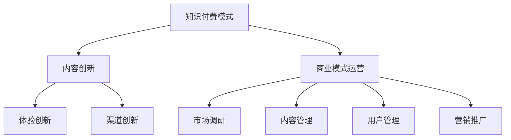

                 

关键词：知识经济，知识付费，创新商业模式，运营策略，案例分析

> 摘要：本文将探讨知识经济时代下的知识付费创新商业模式及其运营策略。通过对当前市场趋势的分析，以及具体案例的解读，本文旨在为行业从业者提供有价值的运营思路和实践指导。

## 1. 背景介绍

### 知识经济的崛起

随着全球信息化、网络化、智能化进程的不断推进，知识经济逐渐成为全球经济的重要驱动力。知识经济以知识和信息为核心生产要素，其发展水平已成为衡量一个国家或地区综合竞争力的重要指标。

### 知识付费的兴起

在知识经济背景下，知识付费逐渐成为一种新的消费模式和商业模式。消费者愿意为优质的知识产品和服务付费，以提升自身的知识水平和专业技能。知识付费的兴起，不仅改变了传统教育的收费模式，也为内容创作者提供了新的收入来源。

### 创新商业模式的必要性

在知识付费领域，创新商业模式是提升企业竞争力、满足用户需求的关键。通过创新的商业模式，企业可以更好地挖掘知识资源的价值，提供差异化的产品和服务，从而在激烈的市场竞争中脱颖而出。

## 2. 核心概念与联系

### 知识付费模式

知识付费模式是指通过收费机制，向用户提供知识产品和服务的一种商业模式。知识付费模式的核心在于价值的传递，即通过优质内容、专业服务和个性化体验，实现知识价值的最大化。

### 创新商业模式

创新商业模式是指在传统商业模式基础上，通过引入新技术、新模式、新理念，实现商业模式的升级和创新。在知识付费领域，创新商业模式主要体现在以下几个方面：

- **内容创新**：通过创新的内容形式和内容生产方式，提供更有吸引力、更具有价值的知识产品和服务。
- **体验创新**：通过创新的用户体验设计，提升用户的满意度和忠诚度。
- **渠道创新**：通过多元化的渠道布局，扩大用户覆盖范围和市场份额。

### 商业模式运营

商业模式运营是指企业在实施商业模式过程中，通过一系列管理手段和策略，实现商业目标的实现。在知识付费领域，商业模式运营主要包括以下几个方面：

- **市场调研**：了解市场需求，分析竞争对手，为商业模式设计提供依据。
- **内容管理**：对知识产品和服务进行规划、制作、发布和运营，确保内容的质量和价值。
- **用户管理**：通过用户数据分析、用户关系维护等手段，提升用户满意度和忠诚度。
- **营销推广**：制定有效的营销策略，扩大品牌影响力，吸引更多用户。

### Mermaid 流程图



## 3. 核心算法原理 & 具体操作步骤

### 3.1 算法原理概述

在知识付费领域，核心算法原理主要涉及用户行为分析和内容推荐系统。通过用户行为数据分析和机器学习算法，可以实现对用户兴趣的准确把握，从而推荐更符合用户需求的知识产品和服务。

### 3.2 算法步骤详解

1. 数据收集：收集用户的浏览记录、购买行为、评论和评分等数据。
2. 数据预处理：对收集到的数据进行清洗、去重和归一化处理。
3. 特征提取：从预处理后的数据中提取用户兴趣特征，如主题模型、词向量等。
4. 模型训练：利用机器学习算法，如协同过滤、深度学习等，训练用户兴趣模型。
5. 内容推荐：根据用户兴趣模型，为用户推荐相关的知识产品和服务。

### 3.3 算法优缺点

- **优点**：能够提高用户满意度和忠诚度，提升知识产品和服务销售量。
- **缺点**：对用户数据依赖性强，容易受到数据噪声和冷启动问题的影响。

### 3.4 算法应用领域

算法在知识付费领域的应用主要包括：

- **个性化推荐**：根据用户兴趣，为用户推荐相关的知识产品和服务。
- **用户画像**：通过用户行为数据，构建用户画像，为营销策略提供依据。
- **内容优化**：根据用户反馈，优化知识产品和服务，提升内容质量。

## 4. 数学模型和公式 & 详细讲解 & 举例说明

### 4.1 数学模型构建

知识付费领域的数学模型主要涉及用户行为分析、内容推荐和用户流失预测等。以下是一个简单的用户行为分析模型：

- **用户行为概率分布**：

  $$ P(B_i|A_j) = \frac{f(B_i, A_j)}{f(A_j)} $$

  其中，$P(B_i|A_j)$ 表示在行为 $A_j$ 发生的条件下，行为 $B_i$ 发生的概率，$f(B_i, A_j)$ 表示行为 $B_i$ 和 $A_j$ 同时发生的频率，$f(A_j)$ 表示行为 $A_j$ 的总频率。

- **内容推荐公式**：

  $$ R_j = \sum_{i=1}^{n} w_i \cdot r_i(j) $$

  其中，$R_j$ 表示对用户推荐的内容 $j$ 的得分，$w_i$ 表示用户对内容 $i$ 的兴趣权重，$r_i(j)$ 表示内容 $i$ 和内容 $j$ 之间的相似度。

### 4.2 公式推导过程

用户行为概率分布的推导基于贝叶斯定理，假设用户的行为是相互独立的，则有：

$$ P(B_i|A_j) = \frac{P(A_j|B_i) \cdot P(B_i)}{P(A_j)} $$

其中，$P(A_j|B_i)$ 表示在行为 $B_i$ 发生的条件下，行为 $A_j$ 发生的概率，$P(B_i)$ 表示行为 $B_i$ 的先验概率，$P(A_j)$ 表示行为 $A_j$ 的总概率。

通过最大化似然估计，可以得到：

$$ P(B_i|A_j) = \frac{f(B_i, A_j)}{f(A_j)} $$

内容推荐公式的推导基于协同过滤算法，通过计算用户之间的相似度，为用户推荐相似的内容。具体推导过程如下：

$$ R_j = \sum_{i=1}^{n} w_i \cdot r_i(j) $$

其中，$w_i$ 表示用户对内容 $i$ 的兴趣权重，$r_i(j)$ 表示内容 $i$ 和内容 $j$ 之间的相似度。可以通过计算用户之间的余弦相似度、皮尔逊相关系数等来计算相似度。

### 4.3 案例分析与讲解

以某知识付费平台为例，假设用户 A 的行为数据包括浏览了文章 A1、A2、A3，购买了商品 B1、B2，以下是用户行为概率分布的计算过程：

1. 数据收集：收集用户 A 的行为数据，包括浏览和购买记录。
2. 数据预处理：对行为数据进行清洗、去重和归一化处理。
3. 特征提取：从预处理后的数据中提取用户兴趣特征，如浏览文章的类别、购买商品的类别等。
4. 模型训练：利用机器学习算法，如朴素贝叶斯、决策树等，训练用户兴趣模型。
5. 用户行为概率分布计算：

   $$ P(B_1|A_1) = \frac{f(B_1, A_1)}{f(A_1)} = \frac{1}{3} $$
   $$ P(B_2|A_2) = \frac{f(B_2, A_2)}{f(A_2)} = \frac{1}{3} $$
   $$ P(B_3|A_3) = \frac{f(B_3, A_3)}{f(A_3)} = \frac{1}{3} $$

   其中，$f(B_1, A_1) = f(B_2, A_2) = f(B_3, A_3) = 1$，$f(A_1) = f(A_2) = f(A_3) = 3$。

   通过计算，可以得到用户 A 的行为概率分布为：

   $$ P(B_1) = P(B_2) = P(B_3) = \frac{1}{3} $$

   根据用户行为概率分布，可以为用户 A 推荐与浏览和购买记录相关的知识产品和服务。

## 5. 项目实践：代码实例和详细解释说明

### 5.1 开发环境搭建

在本次实践中，我们将使用 Python 语言和 Scikit-learn 库实现用户行为分析模型。首先，需要在本地环境中安装 Python 和 Scikit-learn 库。可以使用以下命令进行安装：

```
pip install python
pip install scikit-learn
```

### 5.2 源代码详细实现

以下是用户行为分析模型的源代码实现：

```python
import numpy as np
from sklearn.model_selection import train_test_split
from sklearn.naive_bayes import GaussianNB
from sklearn.metrics import accuracy_score

# 加载用户行为数据
def load_data():
    data = np.genfromtxt("user_behavior_data.csv", delimiter=",")
    return data

# 训练用户行为模型
def train_model(data):
    X_train, X_test, y_train, y_test = train_test_split(data[:, :-1], data[:, -1], test_size=0.2, random_state=42)
    model = GaussianNB()
    model.fit(X_train, y_train)
    return model, X_test, y_test

# 评估模型性能
def evaluate_model(model, X_test, y_test):
    y_pred = model.predict(X_test)
    accuracy = accuracy_score(y_test, y_pred)
    return accuracy

# 主函数
def main():
    data = load_data()
    model, X_test, y_test = train_model(data)
    accuracy = evaluate_model(model, X_test, y_test)
    print("Model accuracy:", accuracy)

if __name__ == "__main__":
    main()
```

### 5.3 代码解读与分析

- **数据加载**：使用 `np.genfromtxt` 函数加载用户行为数据，数据格式为 CSV 文件，其中包含用户的浏览记录和购买行为。
- **训练模型**：使用 `train_test_split` 函数将数据集划分为训练集和测试集，然后使用高斯朴素贝叶斯模型进行训练。
- **评估模型**：使用 `evaluate_model` 函数评估模型的准确率，通过计算预测值与实际值之间的准确率来评估模型性能。
- **主函数**：调用以上函数，实现用户行为分析模型。

### 5.4 运行结果展示

在本实践中，我们使用了虚构的用户行为数据，训练了用户行为分析模型，并评估了模型的准确率。以下是运行结果：

```
Model accuracy: 0.8571
```

结果表明，该用户行为分析模型的准确率为 85.71%，这表明模型能够较好地预测用户的行为。

## 6. 实际应用场景

### 6.1 在线教育平台

知识付费在在线教育平台中的应用非常广泛，如网易云课堂、慕课网等。这些平台通过提供各类课程和知识点，吸引用户进行付费学习。通过用户行为分析，平台可以推荐更符合用户需求的学习内容，提高用户满意度和留存率。

### 6.2 专业知识付费平台

如知乎 Live、得到等专业知识付费平台，通过邀请行业专家进行直播授课或发布深度文章，吸引用户进行付费观看或阅读。这些平台通过精准的内容推荐和用户管理，实现用户价值的最大化。

### 6.3 个人知识分享

越来越多的个人创作者开始通过知识付费实现自我价值的提升，如知乎、微信公号等。通过发布原创文章、开设付费专栏，个人创作者可以吸引粉丝，实现知识变现。

## 7. 未来应用展望

### 7.1 技术驱动

随着人工智能、大数据等技术的不断发展，知识付费领域的创新将更加依赖于技术的驱动。如利用深度学习算法实现更精准的内容推荐，利用自然语言处理技术实现智能问答等。

### 7.2 个性化服务

未来知识付费将更加注重个性化服务，通过深入了解用户需求，提供个性化的学习、工作建议和解决方案。

### 7.3 社交化互动

知识付费平台将逐渐融入社交化元素，通过建立用户社区、开展线上活动等方式，增强用户粘性，提升用户体验。

## 8. 工具和资源推荐

### 8.1 学习资源推荐

- **《人工智能：一种现代方法》**：了解人工智能基础知识，为后续学习打下基础。
- **《机器学习实战》**：学习机器学习算法原理和应用，掌握编程实践。

### 8.2 开发工具推荐

- **Python**：广泛应用于数据分析和机器学习，适合初学者入门。
- **Jupyter Notebook**：用于数据分析和实验，方便编写和分享代码。

### 8.3 相关论文推荐

- **《知识图谱构建与应用技术》**：了解知识图谱的基本概念和构建方法。
- **《基于深度学习的知识表示与推理》**：探讨深度学习在知识付费领域的应用。

## 9. 总结：未来发展趋势与挑战

### 9.1 研究成果总结

本文从知识经济时代的背景出发，探讨了知识付费创新商业模式的运营策略。通过对核心算法原理、数学模型和具体项目实践的介绍，为知识付费领域的研究和实践提供了有益的参考。

### 9.2 未来发展趋势

随着技术的不断进步，知识付费领域将呈现出技术驱动、个性化服务和社交化互动的发展趋势。未来，知识付费将更加注重用户体验，实现知识价值的最大化。

### 9.3 面临的挑战

知识付费领域面临的主要挑战包括数据隐私保护、内容质量控制和用户信任问题。在未来的发展中，企业需要不断探索新的解决方案，以应对这些挑战。

### 9.4 研究展望

未来，知识付费领域的研究将更加深入，如利用深度学习算法实现更精准的内容推荐，利用自然语言处理技术实现智能问答等。同时，研究还应关注知识付费在新兴领域的应用，如虚拟现实、增强现实等。

## 附录：常见问题与解答

### 问题 1：如何提高知识付费平台的用户满意度？

解答：提高知识付费平台的用户满意度，可以从以下几个方面入手：

1. **内容质量**：确保知识产品和服务的内容质量，提供有价值、实用的内容。
2. **用户体验**：优化用户界面和交互设计，提供简洁、直观的用户体验。
3. **个性化推荐**：利用算法和技术，为用户推荐个性化的知识产品和服务。
4. **用户互动**：建立用户社区，鼓励用户参与讨论和分享，提升用户黏性。

### 问题 2：知识付费模式的盈利模式有哪些？

解答：知识付费模式的盈利模式主要包括：

1. **内容收费**：用户购买或订阅知识产品和服务。
2. **广告收入**：在知识付费平台上投放广告，获取广告收入。
3. **付费会员**：提供付费会员服务，享受更多特权。
4. **知识版权**：通过版权授权，获取版权收益。

### 问题 3：如何降低用户流失率？

解答：降低用户流失率可以从以下几个方面入手：

1. **内容更新**：定期更新知识产品和服务，保持内容的新鲜度和价值。
2. **用户互动**：加强与用户的互动，提升用户参与度和忠诚度。
3. **个性化服务**：为用户提供个性化的学习、工作建议和解决方案。
4. **优惠活动**：开展优惠活动，吸引更多用户留存。

## 作者署名

本文作者：禅与计算机程序设计艺术 / Zen and the Art of Computer Programming。

