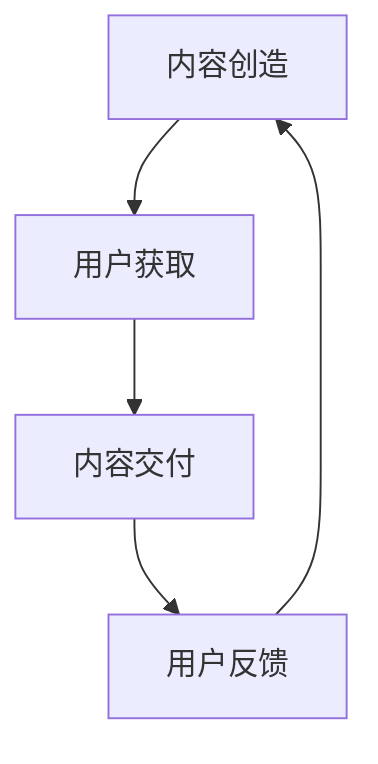

                 

关键词：知识付费、商业模式、创新、运营、知识经济、平台、用户需求、价值创造、可持续发展。

摘要：本文探讨了知识经济时代下知识付费领域创新商业模式的运营策略。通过分析当前市场趋势，阐述了知识付费商业模式的构成要素，并提出了创新运营策略，以提升用户体验、实现可持续发展。

## 1. 背景介绍

知识经济时代，信息技术的迅猛发展推动了知识的快速传播和共享，同时也带来了知识付费的兴起。知识付费作为一种商业模式，是指用户为获取特定知识或技能而支付的费用。随着在线教育、专业技能培训、知识分享平台的普及，知识付费已经成为数字经济的重要组成部分。

然而，在激烈的市场竞争下，传统的知识付费模式面临着诸多挑战，如同质化严重、用户黏性不足、内容质量参差不齐等。因此，创新商业模式和运营策略成为知识付费领域亟待解决的问题。

### 1.1 知识付费的定义与特征

知识付费是指用户为获取知识、技能或信息而支付的费用。其核心特征包括：

- **用户付费意愿强**：用户为高质量、有价值的内容付费，体现了知识经济时代的价值观念。
- **内容个性化**：知识付费平台根据用户需求提供定制化内容，满足用户个性化学习需求。
- **在线交付**：知识付费主要通过互联网进行交付，方便快捷，降低了学习门槛。

### 1.2 当前市场趋势

- **市场规模持续扩大**：随着互联网普及和在线教育需求的增长，知识付费市场规模逐年扩大。
- **用户需求多样化**：用户对知识付费的需求越来越多样化，不仅限于专业技能培训，还包括兴趣爱好、心理辅导等方面。
- **竞争加剧**：知识付费领域的竞争日益激烈，各大平台纷纷探索创新商业模式以吸引和留住用户。

## 2. 核心概念与联系

### 2.1 知识付费商业模式

知识付费商业模式的核心包括内容创造、用户获取、内容交付和用户反馈四个环节。以下是知识付费商业模式的 Mermaid 流程图：



### 2.2 创新运营策略

在知识付费领域，创新运营策略是实现商业模式成功的关键。以下是一些创新运营策略：

- **个性化推荐**：通过算法分析用户行为和需求，为用户提供个性化推荐内容。
- **社区互动**：建立用户社区，鼓励用户参与互动，提高用户黏性。
- **内容多样化**：提供丰富多样的内容形式，如视频、音频、图文等，满足不同用户需求。
- **线上线下结合**：结合线上线下活动，提升用户参与度和满意度。

## 3. 核心算法原理 & 具体操作步骤

### 3.1 算法原理概述

知识付费平台的个性化推荐算法基于协同过滤和内容匹配两种方法。协同过滤方法通过分析用户行为和兴趣，为用户推荐相似用户喜欢的课程。内容匹配方法通过分析课程内容和用户标签，为用户推荐相关课程。

### 3.2 算法步骤详解

- **数据收集**：收集用户行为数据，包括浏览、购买、评价等。
- **用户画像构建**：基于用户行为数据构建用户画像，包括兴趣标签、行为偏好等。
- **课程标签构建**：为每门课程分配标签，包括课程类型、难度、时长等。
- **协同过滤推荐**：计算用户相似度，为用户推荐相似用户喜欢的课程。
- **内容匹配推荐**：根据用户标签和课程标签，为用户推荐相关课程。
- **推荐结果排序**：根据推荐分数对课程进行排序，展示给用户。

### 3.3 算法优缺点

- **优点**：个性化推荐算法能够提高用户满意度和购买转化率，降低运营成本。
- **缺点**：算法容易出现“推荐泡泡”，用户容易陷入信息茧房，难以发现新内容。

### 3.4 算法应用领域

个性化推荐算法在知识付费领域有广泛的应用，如在线教育、专业技能培训、兴趣爱好学习等。

## 4. 数学模型和公式 & 详细讲解 & 举例说明

### 4.1 数学模型构建

知识付费平台的推荐系统可以基于协同过滤模型，其基本公式为：

$$
\hat{r}_{ui} = \frac{\sum_{j \in N(i)} r_{uj} \cdot sim(i, j)}{\sum_{j \in N(i)} sim(i, j)}
$$

其中，$r_{uj}$ 表示用户 $u$ 对课程 $j$ 的评分，$sim(i, j)$ 表示课程 $i$ 和课程 $j$ 的相似度。

### 4.2 公式推导过程

协同过滤模型的推导过程如下：

1. **用户相似度计算**：根据用户行为数据，计算用户之间的相似度，可以使用余弦相似度、皮尔逊相关系数等算法。
2. **课程相似度计算**：为每门课程分配标签，计算课程之间的相似度。
3. **预测评分**：根据用户相似度和课程相似度，计算用户对课程的可能评分。

### 4.3 案例分析与讲解

假设有两位用户 $u_1$ 和 $u_2$，以及三本课程 $c_1$、$c_2$ 和 $c_3$。用户 $u_1$ 给课程 $c_1$ 和 $c_3$ 打了5星好评，给课程 $c_2$ 打了1星差评。用户 $u_2$ 给课程 $c_1$ 和 $c_2$ 打了4星好评，给课程 $c_3$ 打了2星差评。

根据协同过滤模型，可以计算出用户 $u_1$ 和用户 $u_2$ 之间的相似度为：

$$
sim(u_1, u_2) = \frac{\sum_{j \in N(u_1)} r_{u_1j} \cdot r_{u_2j}}{\sqrt{\sum_{j \in N(u_1)} r_{u_1j}^2 \cdot \sum_{j \in N(u_2)} r_{u_2j}^2}}
$$

假设相似度计算结果为 $0.8$，接下来可以计算用户 $u_2$ 对课程 $c_3$ 的预测评分：

$$
\hat{r}_{u_2c_3} = \frac{r_{u_1c_1} \cdot sim(u_1, u_2) + r_{u_1c_3} \cdot sim(u_1, u_2)}{sim(u_1, u_2)}
$$

假设 $r_{u_1c_1} = 5$，$r_{u_1c_3} = 5$，则预测评分 $\hat{r}_{u_2c_3} = 4$。

这意味着用户 $u_2$ 很有可能给课程 $c_3$ 打4星好评。

## 5. 项目实践：代码实例和详细解释说明

### 5.1 开发环境搭建

- **编程语言**：Python
- **依赖库**：NumPy、Pandas、Scikit-learn
- **开发工具**：Jupyter Notebook

### 5.2 源代码详细实现

以下是一个基于协同过滤模型的简单推荐系统实现：

```python
import numpy as np
import pandas as pd
from sklearn.metrics.pairwise import cosine_similarity

# 加载数据集
data = pd.read_csv('ratings.csv')
users = data['user_id'].unique()
courses = data['course_id'].unique()

# 构建评分矩阵
rating_matrix = np.zeros((len(users), len(courses)))
for index, row in data.iterrows():
    user_id = row['user_id']
    course_id = row['course_id']
    rating = row['rating']
    rating_matrix[user_id - 1, course_id - 1] = rating

# 计算用户相似度
user_similarity = cosine_similarity(rating_matrix)

# 计算预测评分
predictions = np.dot(user_similarity, rating_matrix) / np.linalg.norm(user_similarity, axis=1)

# 输出预测评分
print(predictions)
```

### 5.3 代码解读与分析

- **数据加载**：使用 Pandas 加载评分数据集。
- **评分矩阵构建**：构建用户-课程评分矩阵。
- **用户相似度计算**：使用余弦相似度计算用户之间的相似度。
- **预测评分计算**：使用用户相似度矩阵和评分矩阵计算预测评分。

### 5.4 运行结果展示

运行上述代码，可以得到每个用户对未评分课程的可能评分。用户可以根据这些预测评分推荐课程给用户。

## 6. 实际应用场景

### 6.1 在线教育平台

在线教育平台可以通过知识付费商业模式为用户提供定制化课程，提高用户满意度和留存率。通过个性化推荐算法，平台可以精准推荐用户感兴趣的课程，降低用户流失率。

### 6.2 专业技能培训

专业技能培训机构可以利用知识付费模式为用户提供在线培训课程，通过精细化运营策略提高课程转化率和用户满意度。同时，机构可以结合线上线下活动，提升用户参与度和品牌影响力。

### 6.3 知识分享平台

知识分享平台可以通过知识付费模式为用户提供高质量的内容，吸引更多用户参与。平台可以推出会员制度，为付费用户提供更多增值服务，如独家内容、互动交流等，提高用户黏性。

## 7. 工具和资源推荐

### 7.1 学习资源推荐

- **《推荐系统实践》**：周志华 著
- **《机器学习》**：周志华 著
- **《Python数据科学 Handbook》**：JackDeng 著

### 7.2 开发工具推荐

- **Jupyter Notebook**：用于编写和运行 Python 代码。
- **Pandas**：用于数据预处理和分析。
- **Scikit-learn**：用于机器学习和数据挖掘。

### 7.3 相关论文推荐

- **"Collaborative Filtering for the Web"**：Brian K. Smith 等
- **"Matrix Factorization Techniques for Recommender Systems"**：Yehuda Koren 等
- **"A Theoretical Analysis of Similarity Measures for Time Series"**：Michaël Defferrard 等

## 8. 总结：未来发展趋势与挑战

### 8.1 研究成果总结

本文探讨了知识经济时代下知识付费领域创新商业模式的运营策略，包括个性化推荐、社区互动、内容多样化等。通过实际案例和数学模型，阐述了知识付费商业模式的运作原理和实现方法。

### 8.2 未来发展趋势

- **个性化推荐技术**：随着人工智能技术的发展，个性化推荐技术将更加成熟，为用户提供更加精准的服务。
- **内容多样化**：知识付费领域将不断拓展内容形式，满足用户多样化需求。
- **线上线下融合**：知识付费平台将更加注重线上线下活动的结合，提升用户体验。

### 8.3 面临的挑战

- **同质化竞争**：知识付费领域竞争激烈，平台需要不断创新，提升自身竞争力。
- **用户隐私保护**：在个性化推荐和数据分析过程中，需要充分考虑用户隐私保护。

### 8.4 研究展望

未来研究可以进一步探讨知识付费领域的新模式和新方法，如基于区块链的知识产权保护、虚拟现实与知识付费的结合等。同时，研究如何实现可持续发展，提高知识付费平台的长期竞争力。

## 9. 附录：常见问题与解答

### 9.1 什么是知识付费？

知识付费是指用户为获取知识、技能或信息而支付的费用。它是知识经济时代的一种商业模式，通过在线教育、专业技能培训、知识分享平台等形式实现。

### 9.2 知识付费有哪些特点？

知识付费的特点包括用户付费意愿强、内容个性化、在线交付等。用户为高质量、有价值的内容付费，体现了知识经济时代的价值观念。

### 9.3 知识付费商业模式的构成要素是什么？

知识付费商业模式的构成要素包括内容创造、用户获取、内容交付和用户反馈四个环节。

### 9.4 如何实现知识付费的可持续发展？

实现知识付费的可持续发展需要从多个方面入手，包括创新商业模式、提高内容质量、加强用户互动、保护用户隐私等。同时，平台需要注重社会责任，推动知识共享和知识普及。

