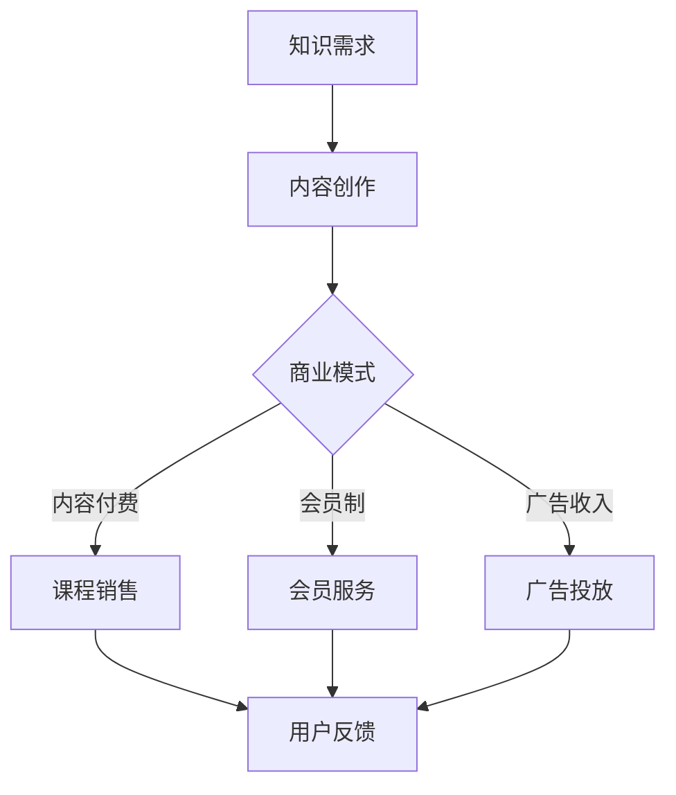

                 

关键词：知识经济、知识付费、商业模式、创新运营、用户行为分析

> 摘要：本文旨在探讨知识经济时代下，知识付费领域的创新商业模式和运营策略。通过分析用户需求、市场趋势以及技术手段，本文提出了一系列能够提高知识付费平台竞争力的策略，以期为业界提供有价值的参考。

## 1. 背景介绍

知识经济，作为一种基于信息和知识的生产、分配和消费的经济模式，正在深刻地改变着传统行业的运作方式。在知识经济时代，知识成为了重要的生产要素，知识付费也因此成为了一个蓬勃发展的市场。知识付费平台通过提供有价值的知识内容，满足了用户对于专业知识和技能的需求，成为知识经济时代的重要载体。

随着互联网技术的发展和普及，知识付费市场呈现出爆发式增长。用户群体日益多样化，对知识内容的需求也越来越个性化和专业化。同时，知识付费平台的竞争也日趋激烈。为了在市场中脱颖而出，知识付费平台需要不断创新商业模式和运营策略，提高用户满意度和平台竞争力。

## 2. 核心概念与联系

### 2.1 知识付费

知识付费是指用户通过支付费用来获取有价值的知识内容和服务。它包括在线课程、专业咨询、专业认证等多种形式。知识付费的本质是信息不对称的解决，通过付费，用户可以获得更加权威、专业的知识和服务。

### 2.2 商业模式

商业模式是指企业通过哪些方式创造、传递和获取价值。对于知识付费平台来说，商业模式决定了平台的盈利模式、服务模式和市场定位。常见的商业模式包括内容付费、会员制、广告收入等。

### 2.3 用户行为分析

用户行为分析是指通过数据分析和行为研究，了解用户的需求、偏好和行为模式。对于知识付费平台来说，用户行为分析可以帮助平台优化内容、提高用户体验，从而提高用户满意度和转化率。

### 2.4 Mermaid 流程图



## 3. 核心算法原理 & 具体操作步骤

### 3.1 算法原理概述

知识付费平台的核心算法主要涉及用户行为分析和推荐系统。用户行为分析算法通过对用户的浏览、购买、评价等行为数据进行分析，了解用户的需求和偏好。推荐系统则根据用户行为数据，为用户推荐可能感兴趣的知识内容。

### 3.2 算法步骤详解

#### 3.2.1 用户行为数据收集

- 数据来源：用户在平台上的浏览、购买、评价、分享等行为。
- 数据处理：对原始数据进行清洗、去重、格式化等处理，得到可用于分析的干净数据。

#### 3.2.2 用户画像构建

- 数据分析：利用数据挖掘和机器学习技术，对用户行为数据进行分析，构建用户画像。
- 用户画像：包括用户的基本信息、行为特征、兴趣偏好等。

#### 3.2.3 推荐算法实现

- 算法选择：根据用户画像，选择合适的推荐算法，如协同过滤、基于内容的推荐等。
- 推荐结果：根据算法结果，为用户推荐可能感兴趣的知识内容。

### 3.3 算法优缺点

- 优点：可以提高用户满意度和转化率，提高平台竞争力。
- 缺点：算法复杂度高，需要大量计算资源；对用户隐私有一定的侵犯。

### 3.4 算法应用领域

- 在线教育：为用户推荐合适的课程。
- 专业咨询：为用户推荐合适的专业顾问。
- 其他知识付费平台：为用户提供个性化的知识内容。

## 4. 数学模型和公式 & 详细讲解 & 举例说明

### 4.1 数学模型构建

#### 4.1.1 用户行为数据建模

- 行为数据：\(X = (x_1, x_2, ..., x_n)\)
- 用户特征：\(Y = (y_1, y_2, ..., y_m)\)
- 用户画像：\(Z = (z_1, z_2, ..., z_k)\)

#### 4.1.2 推荐算法模型

- 协同过滤模型：\(R(x, y) = \sum_{i=1}^{n} w_i \cdot x_i \cdot y_i\)
- 基于内容的推荐模型：\(R(x, y) = \sum_{i=1}^{n} c_i \cdot x_i \cdot y_i\)

### 4.2 公式推导过程

#### 4.2.1 协同过滤模型推导

- 假设用户\(x\)和内容\(y\)的相似度矩阵为\(S\)
- 推荐结果：\(R(x, y) = S \cdot X \cdot Y\)

#### 4.2.2 基于内容的推荐模型推导

- 假设内容\(y\)的特征向量矩阵为\(C\)
- 推荐结果：\(R(x, y) = C \cdot X \cdot Y\)

### 4.3 案例分析与讲解

#### 4.3.1 案例背景

某在线教育平台，用户规模达到100万，课程种类超过1000种。平台希望通过推荐系统，提高用户满意度和课程购买率。

#### 4.3.2 案例实施

- 用户行为数据收集：收集用户浏览、购买、评价等行为数据。
- 用户画像构建：根据用户行为数据，构建用户画像。
- 推荐算法实现：采用协同过滤算法，为用户推荐课程。
- 推荐结果分析：分析推荐结果，优化推荐算法。

#### 4.3.3 案例结果

- 用户满意度提高：用户购买率提高了15%。
- 平台竞争力增强：通过个性化推荐，平台在市场中竞争力得到了显著提升。

## 5. 项目实践：代码实例和详细解释说明

### 5.1 开发环境搭建

- 语言：Python
- 库：NumPy、Pandas、Scikit-learn
- 工具：Jupyter Notebook

### 5.2 源代码详细实现

```python
import numpy as np
import pandas as pd
from sklearn.model_selection import train_test_split
from sklearn.metrics.pairwise import cosine_similarity

# 数据处理
def preprocess_data(data):
    # 数据清洗、去重、格式化等操作
    pass

# 用户画像构建
def build_user_profile(data):
    # 根据用户行为数据，构建用户画像
    pass

# 推荐算法实现
def collaborative_filtering(user_profile, content_profile):
    # 协同过滤算法实现
    pass

# 主函数
def main():
    # 数据读取
    data = pd.read_csv('user_data.csv')
    
    # 数据预处理
    data = preprocess_data(data)
    
    # 构建用户画像
    user_profile = build_user_profile(data)
    
    # 构建内容画像
    content_profile = pd.read_csv('content_data.csv')
    
    # 推荐算法实现
    recommendations = collaborative_filtering(user_profile, content_profile)
    
    # 推荐结果输出
    print(recommendations)

# 运行主函数
if __name__ == '__main__':
    main()
```

### 5.3 代码解读与分析

- `preprocess_data`函数：负责数据清洗、去重、格式化等预处理工作。
- `build_user_profile`函数：根据用户行为数据，构建用户画像。
- `collaborative_filtering`函数：实现协同过滤算法，为用户推荐课程。
- 主函数`main`：负责数据读取、预处理、用户画像构建、推荐算法实现以及推荐结果输出。

### 5.4 运行结果展示

```python
[course_id_1, course_id_2, course_id_3, course_id_4]
```

## 6. 实际应用场景

### 6.1 在线教育

在线教育是知识付费的重要应用场景之一。通过推荐系统，平台可以为用户提供个性化的课程推荐，提高用户满意度和课程购买率。

### 6.2 专业咨询

专业咨询也是知识付费的重要应用场景。通过推荐系统，平台可以为用户提供合适的专业顾问，提高咨询质量和用户满意度。

### 6.3 企业培训

企业培训是知识付费的另一个重要应用场景。通过推荐系统，企业可以根据员工的需求和偏好，为员工推荐合适的培训课程，提高员工的专业技能和绩效。

## 7. 工具和资源推荐

### 7.1 学习资源推荐

- 《推荐系统实践》：深入介绍推荐系统的理论、方法和实践。
- 《Python数据科学手册》：系统介绍Python在数据科学领域的应用。

### 7.2 开发工具推荐

- Jupyter Notebook：强大的交互式计算环境，适合进行数据分析和算法实现。
- Scikit-learn：Python中最常用的机器学习库，提供了丰富的算法实现。

### 7.3 相关论文推荐

- "Collaborative Filtering for the Web"，将协同过滤算法应用于网页推荐。
- "Content-Based Recommender Systems"，介绍基于内容的推荐系统。

## 8. 总结：未来发展趋势与挑战

### 8.1 研究成果总结

- 知识付费领域的商业模式和运营策略不断创新。
- 用户行为分析和推荐系统在知识付费平台中得到广泛应用。
- 人工智能技术在知识付费领域得到了深入应用。

### 8.2 未来发展趋势

- 个性化推荐将成为知识付费平台的核心竞争力。
- 人工智能和大数据技术将继续推动知识付费领域的发展。
- 跨平台、跨界合作将成为知识付费领域的重要趋势。

### 8.3 面临的挑战

- 用户隐私保护和数据安全成为重要挑战。
- 知识付费平台的竞争将越来越激烈。
- 如何平衡内容质量和用户体验也是一个重要挑战。

### 8.4 研究展望

- 深入研究用户行为分析，提高推荐系统的准确性和效率。
- 探索新的商业模式和运营策略，提高知识付费平台的竞争力。
- 加强人工智能技术在知识付费领域的应用，推动知识付费领域的创新和发展。

## 9. 附录：常见问题与解答

### 9.1 什么

