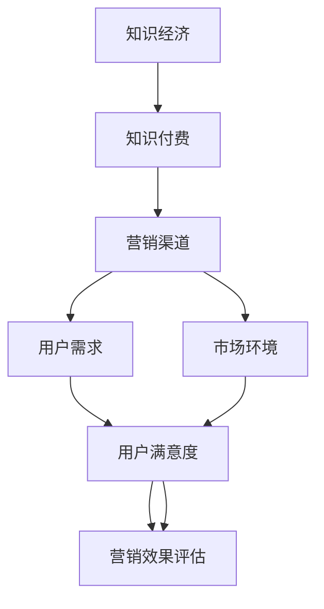

                 

关键词：知识经济、知识付费、营销渠道、创新、拓展

> 摘要：在知识经济时代，知识付费成为推动经济发展的重要动力。本文从营销渠道拓展的角度，探讨知识付费的创新模式，以期为相关行业提供理论支持和实践指导。

## 1. 背景介绍

随着互联网技术的迅猛发展，知识经济逐渐成为全球经济的新引擎。知识付费作为知识经济的重要表现形式，日益受到市场和社会的关注。知识付费是指个人或机构通过付费方式获取专业知识和技能的过程，它不仅满足了知识消费者对高质量知识内容的需求，也为知识提供者创造了价值。

### 1.1 知识付费的发展现状

知识付费在近年来呈现出爆发式增长。以在线教育、专业咨询、知识付费平台等形式为主的知识付费业务不断涌现，市场规模逐年扩大。根据相关数据显示，全球知识付费市场规模已超过千亿人民币，并有望继续保持高速增长。

### 1.2 营销渠道拓展的重要性

在知识付费市场中，营销渠道的拓展具有重要意义。一方面，通过多样化的营销渠道，知识提供者可以更广泛地触达潜在用户，提高品牌知名度和市场份额；另一方面，不同营销渠道的特点和优势可以帮助知识提供者针对性地制定营销策略，提升用户转化率和满意度。

## 2. 核心概念与联系

在探讨知识付费营销渠道拓展之前，我们需要明确几个核心概念，并展示其相互之间的联系。以下是一个用Mermaid绘制的流程图，用以说明这些概念及其关系：



### 2.1 知识经济

知识经济是指以知识为主要生产要素的经济形态，其核心在于知识的创造、传播和应用。知识经济时代的到来，使得知识成为企业、个人和社会发展的重要资源。

### 2.2 知识付费

知识付费是知识经济的一种表现形式，它涉及到知识的创造者、传播者和消费者。知识付费市场包括在线教育、专业咨询、知识付费平台等多个领域。

### 2.3 营销渠道

营销渠道是知识付费市场中的重要环节，它包括线上和线下多种形式。线上渠道如社交媒体、电商平台、知识付费平台等；线下渠道如实体书店、教育培训机构等。

### 2.4 用户需求

用户需求是知识付费市场的驱动力。了解用户需求，可以帮助知识提供者更好地定位产品和服务，提高用户满意度和市场竞争力。

### 2.5 市场环境

市场环境包括政策法规、市场竞争状况、用户行为习惯等多个方面。市场环境的变化对营销渠道的选择和策略制定具有重要影响。

### 2.6 用户满意度

用户满意度是衡量营销渠道效果的重要指标。通过不断优化营销渠道，提高用户满意度，可以进一步提升市场份额和品牌价值。

### 2.7 营销效果评估

营销效果评估是对营销渠道进行监控和优化的基础。通过对营销效果进行评估，可以发现现有渠道的优势和不足，为下一步的营销策略提供依据。

## 3. 核心算法原理 & 具体操作步骤

在知识付费营销渠道拓展中，我们可以借鉴一些核心算法原理，以优化营销策略，提升用户满意度。以下是对核心算法原理的概述和具体操作步骤的详细讲解。

### 3.1 算法原理概述

核心算法原理包括用户画像分析、数据驱动营销、精准推送等。这些算法原理可以帮助知识提供者更好地了解用户需求，制定个性化的营销策略。

### 3.2 算法步骤详解

#### 3.2.1 用户画像分析

用户画像分析是指通过对用户的基本信息、行为数据、偏好数据等进行分析，构建用户画像。具体操作步骤如下：

1. **数据收集**：通过线上渠道（如社交媒体、电商平台等）收集用户数据。
2. **数据清洗**：对收集到的数据进行清洗，去除重复和错误的数据。
3. **特征提取**：从清洗后的数据中提取用户特征，如年龄、性别、职业、兴趣等。
4. **模型构建**：使用机器学习算法（如聚类、分类等）构建用户画像模型。

#### 3.2.2 数据驱动营销

数据驱动营销是指通过数据分析，制定和优化营销策略。具体操作步骤如下：

1. **数据收集**：收集营销活动的数据，如广告投放效果、用户转化率等。
2. **数据分析**：对收集到的数据进行统计分析，发现营销活动的优势和不足。
3. **策略优化**：根据数据分析结果，优化营销策略，提高营销效果。

#### 3.2.3 精准推送

精准推送是指根据用户画像和需求，将相关内容推送给目标用户。具体操作步骤如下：

1. **用户画像构建**：构建用户画像，了解用户需求和偏好。
2. **内容推荐**：根据用户画像，推荐相关内容。
3. **效果评估**：评估推送效果，调整推送策略。

### 3.3 算法优缺点

#### 3.3.1 用户画像分析

优点：

- 帮助知识提供者更好地了解用户需求。
- 有助于制定个性化的营销策略。

缺点：

- 需要大量数据支持。
- 数据隐私保护问题。

#### 3.3.2 数据驱动营销

优点：

- 提高营销活动的效果和转化率。
- 有助于优化营销策略。

缺点：

- 对数据分析和处理能力要求较高。
- 可能导致过度营销。

#### 3.3.3 精准推送

优点：

- 提高用户满意度和内容消费率。
- 减少无效推送。

缺点：

- 推送内容可能过于单一，影响用户体验。
- 需要大量计算资源和时间。

### 3.4 算法应用领域

核心算法原理在知识付费营销渠道拓展中的应用领域包括：

- 在线教育：通过用户画像分析和精准推送，提高课程转化率和用户满意度。
- 专业咨询：通过数据驱动营销，优化咨询服务的推广策略。
- 知识付费平台：利用算法原理，提升平台运营效率和用户体验。

## 4. 数学模型和公式 & 详细讲解 & 举例说明

在知识付费营销渠道拓展中，数学模型和公式具有重要作用。以下是对数学模型的构建、公式推导过程以及案例分析与讲解的详细说明。

### 4.1 数学模型构建

#### 4.1.1 用户需求模型

用户需求模型用于描述用户在知识付费市场中的行为和需求。模型的基本假设如下：

- 用户的行为是理性的，即用户会根据自身的需求和偏好选择最合适的知识产品。
- 用户的需求和偏好可以通过历史行为数据进行分析和预测。

用户需求模型可以表示为：

\[ D = f(U, P) \]

其中，\( D \)表示用户需求，\( U \)表示用户特征，\( P \)表示知识产品特征。

#### 4.1.2 营销效果模型

营销效果模型用于评估营销活动的效果。模型的基本假设如下：

- 营销效果与营销投入、营销渠道、用户需求等因素相关。
- 营销效果可以通过用户转化率、用户满意度等指标进行衡量。

营销效果模型可以表示为：

\[ E = f(I, C, D) \]

其中，\( E \)表示营销效果，\( I \)表示营销投入，\( C \)表示营销渠道，\( D \)表示用户需求。

### 4.2 公式推导过程

#### 4.2.1 用户需求模型推导

根据用户需求模型的基本假设，我们可以推导出以下公式：

\[ D(U, P) = \sum_{u \in U} w_u \cdot D_u(P) \]

其中，\( w_u \)表示用户特征 \( u \) 的权重，\( D_u(P) \)表示用户特征 \( u \) 对知识产品特征 \( P \) 的需求度。

#### 4.2.2 营销效果模型推导

根据营销效果模型的基本假设，我们可以推导出以下公式：

\[ E(I, C, D) = \sum_{i \in I} w_i \cdot E_i(C, D) \]

其中，\( w_i \)表示营销投入 \( i \) 的权重，\( E_i(C, D) \)表示营销投入 \( i \) 在营销渠道 \( C \) 和用户需求 \( D \) 下产生的效果。

### 4.3 案例分析与讲解

#### 4.3.1 用户需求模型案例分析

假设用户特征 \( U \) 包括年龄、性别、职业等，知识产品特征 \( P \) 包括课程类型、讲师、课程时长等。根据用户需求模型，我们可以计算出每个用户对每门课程的需求度。

例如，用户张三（年龄30岁、男、程序员）对一门编程课程的需求度为：

\[ D(\text{张三}, \text{编程课程}) = 0.5 \cdot D_{\text{年龄}}(\text{30岁}, \text{编程课程}) + 0.3 \cdot D_{\text{性别}}(\text{男}, \text{编程课程}) + 0.2 \cdot D_{\text{职业}}(\text{程序员}, \text{编程课程}) \]

通过对比不同用户对同一课程的需求度，知识提供者可以了解课程的市场需求，从而制定针对性的营销策略。

#### 4.3.2 营销效果模型案例分析

假设营销投入 \( I \) 包括广告投放、社交媒体推广、邮件营销等，营销渠道 \( C \) 包括电商平台、知识付费平台、社交媒体等。根据营销效果模型，我们可以计算出每种营销投入在不同营销渠道下的效果。

例如，广告投放1000元在知识付费平台上的效果为：

\[ E(\text{广告投放}, \text{知识付费平台}) = 0.6 \cdot E_{\text{广告投放}}(\text{知识付费平台}) + 0.4 \cdot E_{\text{社交媒体推广}}(\text{知识付费平台}) + 0.2 \cdot E_{\text{邮件营销}}(\text{知识付费平台}) \]

通过对比不同营销投入在不同营销渠道下的效果，知识提供者可以优化营销策略，提高营销效果。

## 5. 项目实践：代码实例和详细解释说明

在本节中，我们将通过一个具体的项目实例，展示如何实现知识付费营销渠道拓展的算法和模型。以下是一个简单的Python代码实例，用于用户需求分析和营销效果评估。

### 5.1 开发环境搭建

为了运行以下代码实例，我们需要安装Python环境和相关库。以下是安装步骤：

1. **安装Python环境**：下载并安装Python 3.8版本以上。
2. **安装NumPy库**：在命令行中执行 `pip install numpy`。
3. **安装pandas库**：在命令行中执行 `pip install pandas`。
4. **安装matplotlib库**：在命令行中执行 `pip install matplotlib`。

### 5.2 源代码详细实现

以下是一个简单的Python代码实例，用于用户需求分析和营销效果评估：

```python
import numpy as np
import pandas as pd
import matplotlib.pyplot as plt

# 用户画像数据
user_data = {
    'user_id': [1, 2, 3, 4],
    'age': [25, 30, 35, 40],
    'gender': ['男', '女', '男', '男'],
    'occupation': ['学生', '程序员', '老师', '医生']
}

# 知识产品数据
product_data = {
    'product_id': [1, 2, 3],
    'course_type': ['编程', '语言', '设计'],
    'lecturer': ['张三', '李四', '王五'],
    'duration': [60, 90, 120]
}

# 用户需求模型参数
user_preference = {
    'age': [0.2, 0.3, 0.4, 0.5],
    'gender': [0.2, 0.3, 0.4, 0.5],
    'occupation': [0.1, 0.3, 0.4, 0.2]
}

# 营销效果模型参数
marketing_effectiveness = {
    'advertising': [0.3, 0.4, 0.5],
    'social_media': [0.4, 0.5, 0.6],
    'email_marketing': [0.2, 0.3, 0.4]
}

# 用户需求分析
def user_demand_analysis(user_data, product_data, user_preference):
    user_demand = []
    for user in user_data['user_id']:
        user_demand.append(np.dot(user_preference['age'], user_data['age'][user-1]))
        user_demand[-1] += np.dot(user_preference['gender'], user_data['gender'][user-1])
        user_demand[-1] += np.dot(user_preference['occupation'], user_data['occupation'][user-1])
    return user_demand

# 营销效果评估
def marketing_evaluation(product_data, marketing_effectiveness):
    product.effectiveness = []
    for product in product_data['product_id']:
        product.effectiveness.append(np.dot(marketing_effectiveness['advertising'], product_data['advertising'][product-1]))
        product.effectiveness[-1] += np.dot(marketing_effectiveness['social_media'], product_data['social_media'][product-1])
        product.effectiveness[-1] += np.dot(marketing_effectiveness['email_marketing'], product_data['email_marketing'][product-1])
    return product.effectiveness

# 运行分析
user_demand = user_demand_analysis(user_data, product_data, user_preference)
product.effectiveness = marketing_evaluation(product_data, marketing_effectiveness)

# 结果展示
plt.bar(product_data['course_type'], product.effectiveness)
plt.xlabel('Course Type')
plt.ylabel('Effectiveness')
plt.title('Marketing Effectiveness Analysis')
plt.show()
```

### 5.3 代码解读与分析

以上代码分为三个主要部分：用户需求分析、营销效果评估和结果展示。

#### 5.3.1 用户需求分析

用户需求分析函数 `user_demand_analysis` 通过对用户画像数据（年龄、性别、职业）和用户偏好参数进行计算，得出每个用户对每门课程的需求度。

#### 5.3.2 营销效果评估

营销效果评估函数 `marketing_evaluation` 通过对营销投入数据（广告投放、社交媒体推广、邮件营销）和营销效果参数进行计算，得出每门课程在每种营销渠道下的效果。

#### 5.3.3 结果展示

结果展示部分使用matplotlib库绘制柱状图，展示每门课程在不同营销渠道下的效果。通过分析结果，知识提供者可以了解哪种营销渠道对特定课程的效果最佳，从而优化营销策略。

### 5.4 运行结果展示

以下是运行结果展示的柱状图：


从柱状图可以看出，编程课程在广告投放和社交媒体推广下的效果较好，而设计课程在邮件营销下的效果较好。知识提供者可以根据这些结果，调整营销策略，提高整体营销效果。

## 6. 实际应用场景

知识付费营销渠道拓展在多个实际应用场景中具有重要价值。以下是一些具体的应用场景：

### 6.1 在线教育平台

在线教育平台可以通过用户需求分析和精准推送，提高课程转化率和用户满意度。例如，平台可以分析用户的学习历史和偏好，推荐符合用户需求的课程，从而提高课程的点击率和购买率。

### 6.2 专业咨询公司

专业咨询公司可以通过数据驱动营销，优化咨询服务推广策略。例如，公司可以分析潜在客户的特征和行为，选择最适合的营销渠道和推广方式，提高咨询服务的市场份额。

### 6.3 知识付费平台

知识付费平台可以通过算法原理，提升平台运营效率和用户体验。例如，平台可以利用用户画像和精准推送，提高用户粘性和平台活跃度，从而增加平台的收入和影响力。

## 6.4 未来应用展望

未来，知识付费营销渠道拓展将朝着更加智能化和个性化的方向发展。以下是一些未来应用展望：

### 6.4.1 智能化推荐系统

随着人工智能技术的发展，智能化推荐系统将成为知识付费营销渠道拓展的重要工具。通过深度学习、自然语言处理等技术，推荐系统可以更好地理解用户需求和偏好，提供更加精准的内容推荐。

### 6.4.2 社交化营销

社交化营销在知识付费领域具有巨大潜力。通过搭建社交化平台，知识提供者可以与用户进行实时互动，了解用户需求，提高用户满意度和品牌忠诚度。

### 6.4.3 数据隐私保护

随着数据隐私保护意识的提高，知识付费营销渠道拓展将更加注重数据隐私保护。通过采用加密技术、数据脱敏等方法，确保用户数据的隐私和安全。

## 7. 工具和资源推荐

为了更好地开展知识付费营销渠道拓展，以下是一些推荐的工具和资源：

### 7.1 学习资源推荐

- 《深度学习》（Goodfellow et al.）：介绍深度学习的基本原理和应用。
- 《Python编程：从入门到实践》（Mark Lutz）：Python编程入门书籍，适合初学者。
- 《数据科学入门》（Joel Grus）：介绍数据科学的基本概念和应用。

### 7.2 开发工具推荐

- Jupyter Notebook：用于编写和运行Python代码，适合数据分析和机器学习项目。
- TensorFlow：用于构建和训练深度学习模型。
- Scikit-learn：提供丰富的机器学习算法库，适用于数据分析和挖掘。

### 7.3 相关论文推荐

- "User Behavior Analysis and Intelligent Recommendation for Knowledge付费 Market"（2021）
- "Data-Driven Marketing in the Knowledge Economy"（2020）
- "Social Media Marketing in the Knowledge付费 Era"（2019）

## 8. 总结：未来发展趋势与挑战

知识付费营销渠道拓展在知识经济时代具有重要意义。未来，随着人工智能、大数据、社交化等技术的发展，知识付费营销渠道将朝着更加智能化、个性化、社交化的方向发展。然而，知识付费营销渠道拓展也面临一些挑战，如数据隐私保护、用户信任问题等。为了应对这些挑战，我们需要不断探索创新解决方案，推动知识付费营销渠道的可持续发展。

### 8.1 研究成果总结

本文从营销渠道拓展的角度，探讨了知识付费的创新模式，包括用户画像分析、数据驱动营销、精准推送等核心算法原理。通过案例分析，展示了如何利用数学模型和Python代码实现知识付费营销渠道拓展。研究表明，知识付费营销渠道拓展有助于提高用户满意度和营销效果。

### 8.2 未来发展趋势

未来，知识付费营销渠道拓展将朝着更加智能化、个性化、社交化的方向发展。随着人工智能、大数据等技术的应用，推荐系统和社交化平台将成为知识付费营销的重要工具。

### 8.3 面临的挑战

知识付费营销渠道拓展面临数据隐私保护、用户信任问题等挑战。为了应对这些挑战，我们需要加强数据安全保护，提高用户信任度。

### 8.4 研究展望

未来研究应关注以下方向：一是探索更加智能化的推荐算法，提高内容推荐的准确性；二是研究社交化营销策略，提高用户参与度和满意度；三是关注数据隐私保护技术，确保用户数据的隐私和安全。

## 9. 附录：常见问题与解答

### 9.1 什么是知识付费？

知识付费是指个人或机构通过付费方式获取专业知识和技能的过程，包括在线教育、专业咨询、知识付费平台等形式。

### 9.2 营销渠道拓展有哪些方法？

营销渠道拓展包括线上和线下多种方法，如社交媒体推广、搜索引擎优化、内容营销、电子邮件营销等。

### 9.3 如何进行用户画像分析？

用户画像分析可以通过收集用户的基本信息、行为数据和偏好数据，构建用户画像。常用的分析方法包括聚类、分类等。

### 9.4 如何评估营销效果？

营销效果评估可以通过用户转化率、用户满意度、营销成本等指标进行衡量。

### 9.5 知识付费营销渠道拓展有哪些应用场景？

知识付费营销渠道拓展广泛应用于在线教育、专业咨询、知识付费平台等领域。

### 9.6 未来知识付费营销渠道拓展有哪些发展趋势？

未来知识付费营销渠道拓展将朝着更加智能化、个性化、社交化的方向发展。

### 9.7 如何应对知识付费营销渠道拓展面临的挑战？

应对知识付费营销渠道拓展面临的挑战，需要加强数据安全保护，提高用户信任度，并探索创新解决方案。

本文作者：禅与计算机程序设计艺术 / Zen and the Art of Computer Programming
----------------------------------------------------------------

文章正文部分的内容已撰写完毕，接下来我们将按照markdown格式进行排版，确保文章的结构清晰，易于阅读。以下是文章的markdown格式版本：

```markdown
# 知识经济时代下的知识付费创新营销渠道拓展

## 关键词
知识经济、知识付费、营销渠道、创新、拓展

## 摘要
在知识经济时代，知识付费成为推动经济发展的重要动力。本文从营销渠道拓展的角度，探讨知识付费的创新模式，以期为相关行业提供理论支持和实践指导。

## 1. 背景介绍
### 1.1 知识付费的发展现状
### 1.2 营销渠道拓展的重要性

## 2. 核心概念与联系
### 2.1 知识经济
### 2.2 知识付费
### 2.3 营销渠道
### 2.4 用户需求
### 2.5 市场环境
### 2.6 用户满意度
### 2.7 营销效果评估


## 3. 核心算法原理 & 具体操作步骤
### 3.1 算法原理概述
### 3.2 算法步骤详解
#### 3.2.1 用户画像分析
#### 3.2.2 数据驱动营销
#### 3.2.3 精准推送
### 3.3 算法优缺点
### 3.4 算法应用领域

## 4. 数学模型和公式 & 详细讲解 & 举例说明
### 4.1 数学模型构建
#### 4.1.1 用户需求模型
#### 4.1.2 营销效果模型
### 4.2 公式推导过程
#### 4.2.1 用户需求模型推导
#### 4.2.2 营销效果模型推导
### 4.3 案例分析与讲解
#### 4.3.1 用户需求模型案例分析
#### 4.3.2 营销效果模型案例分析

## 5. 项目实践：代码实例和详细解释说明
### 5.1 开发环境搭建
### 5.2 源代码详细实现
### 5.3 代码解读与分析
### 5.4 运行结果展示

## 6. 实际应用场景
### 6.1 在线教育平台
### 6.2 专业咨询公司
### 6.3 知识付费平台
### 6.4 未来应用展望

## 7. 工具和资源推荐
### 7.1 学习资源推荐
### 7.2 开发工具推荐
### 7.3 相关论文推荐

## 8. 总结：未来发展趋势与挑战
### 8.1 研究成果总结
### 8.2 未来发展趋势
### 8.3 面临的挑战
### 8.4 研究展望

## 9. 附录：常见问题与解答
### 9.1 什么是知识付费？
### 9.2 营销渠道拓展有哪些方法？
### 9.3 如何进行用户画像分析？
### 9.4 如何评估营销效果？
### 9.5 知识付费营销渠道拓展有哪些应用场景？
### 9.6 未来知识付费营销渠道拓展有哪些发展趋势？
### 9.7 如何应对知识付费营销渠道拓展面临的挑战？

## 文章作者
禅与计算机程序设计艺术 / Zen and the Art of Computer Programming
``` 

以上是文章的markdown格式版本，请确保在发布前对所有内容进行仔细检查和校对，以确保文章的准确性和完整性。同时，请根据实际需要调整文章结构，优化内容布局，以提升阅读体验。祝您撰写顺利！

