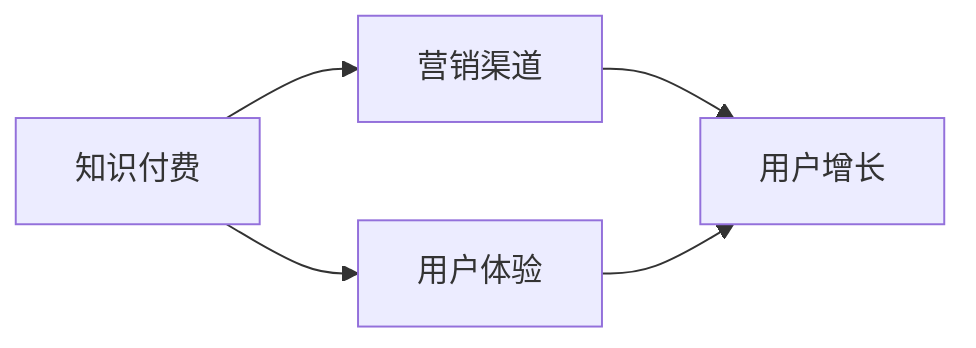

                 

 关键词：知识付费、营销渠道、知识经济、创新、用户增长、客户体验

> 摘要：在知识经济时代，知识付费作为一种新兴商业模式，正迅速崛起。本文旨在探讨知识付费的创新营销渠道拓展策略，通过深入分析市场趋势、用户需求以及技术手段，为知识付费平台提供一套系统化的营销解决方案，助力其在竞争激烈的市场环境中脱颖而出。

## 1. 背景介绍

随着互联网技术的发展和信息传播的便捷，知识经济已成为全球经济发展的重要驱动力。知识付费作为知识经济的重要组成部分，近年来呈现出爆发式增长。根据某市场研究机构的数据显示，2019年至2023年，知识付费市场规模年均复合增长率达到25%。然而，在市场快速发展的同时，也面临着激烈的竞争和用户需求的不断变化。

### 竞争态势

知识付费领域的竞争主要来自于以下几个方面：

1. **内容竞争**：优质的知识内容是吸引和留住用户的关键，平台需要不断更新和优化内容，以保持竞争优势。
2. **用户体验**：用户对知识付费产品的期望越来越高，对平台的服务质量和互动体验提出了更高的要求。
3. **营销策略**：如何有效地推广知识付费产品，吸引更多潜在用户，是各大平台需要解决的重要问题。

### 用户需求

用户对知识付费的需求主要表现在以下几个方面：

1. **实用性**：用户更倾向于选择能够解决实际问题的知识内容。
2. **个性化**：用户希望获得个性化的学习体验，满足个性化需求。
3. **即时性**：用户期望能够随时随地进行学习，对平台的响应速度有较高要求。

## 2. 核心概念与联系

为了更好地理解知识付费创新营销渠道的拓展，我们需要明确几个核心概念，并展示它们之间的关系。

### 核心概念

1. **知识付费**：用户为获取特定知识或技能而支付的费用。
2. **营销渠道**：将知识付费产品传递给潜在用户的途径。
3. **用户体验**：用户在获取知识付费产品过程中的感受和体验。

### 架构图



在这个架构图中，知识付费是核心，通过营销渠道将知识传递给用户，进而提升用户体验，从而实现用户增长。

## 3. 核心算法原理 & 具体操作步骤

### 3.1 算法原理概述

知识付费创新营销渠道的拓展可以理解为一种算法优化问题，其主要目标是最大化用户增长。具体来说，该算法主要包括以下几个步骤：

1. **用户行为分析**：通过对用户行为数据进行分析，了解用户的兴趣点和购买偏好。
2. **个性化推荐**：根据用户行为分析结果，为用户推荐符合其兴趣的知识内容。
3. **渠道优化**：根据推荐结果，优化营销渠道，提高用户的点击率和购买转化率。
4. **反馈调整**：根据用户反馈，不断调整推荐策略和营销渠道，以实现用户增长的最大化。

### 3.2 算法步骤详解

1. **用户行为分析**

   - 收集用户行为数据，如浏览记录、搜索关键词、购买记录等。
   - 利用机器学习算法，分析用户行为数据，提取用户兴趣点和购买偏好。

2. **个性化推荐**

   - 根据用户兴趣点和购买偏好，构建个性化推荐模型。
   - 利用推荐模型，为用户推荐符合其兴趣的知识内容。

3. **渠道优化**

   - 分析不同营销渠道的转化率和成本效益。
   - 根据转化率和成本效益，优化营销渠道，提高用户的点击率和购买转化率。

4. **反馈调整**

   - 收集用户反馈数据，如点击率、购买率、满意度等。
   - 利用反馈数据，调整推荐策略和营销渠道，以实现用户增长的最大化。

### 3.3 算法优缺点

- **优点**：该算法能够根据用户行为数据，实现个性化的知识推荐和渠道优化，提高用户增长效果。
- **缺点**：算法的优化过程需要大量的计算资源和时间，且用户行为数据的准确性和完整性会影响算法效果。

### 3.4 算法应用领域

- **电子商务**：通过个性化推荐和渠道优化，提高用户的购买转化率和销售额。
- **在线教育**：通过个性化推荐和渠道优化，提高用户的参与度和学习效果。
- **内容平台**：通过个性化推荐和渠道优化，提高用户的活跃度和留存率。

## 4. 数学模型和公式 & 详细讲解 & 举例说明

### 4.1 数学模型构建

在知识付费创新营销渠道的拓展中，我们可以构建以下数学模型：

- **用户行为模型**：$B = f(U, I)$，其中$B$表示用户行为，$U$表示用户兴趣点，$I$表示知识内容兴趣点。
- **推荐模型**：$R = g(U, K)$，其中$R$表示推荐结果，$U$表示用户兴趣点，$K$表示知识内容集合。
- **渠道优化模型**：$C = h(R, P)$，其中$C$表示渠道成本效益，$R$表示推荐结果，$P$表示渠道参数。

### 4.2 公式推导过程

- **用户行为模型**：

  $$B = f(U, I) = \frac{1}{1 + e^{-(U \cdot I)}}$$

  其中，$U$和$I$分别表示用户兴趣点和知识内容兴趣点，$e$表示自然对数的底数。

- **推荐模型**：

  $$R = g(U, K) = \sum_{k \in K} w_k \cdot \frac{1}{1 + e^{-(U \cdot k)}}$$

  其中，$w_k$表示知识内容$k$的权重，$U$和$k$分别表示用户兴趣点和知识内容兴趣点。

- **渠道优化模型**：

  $$C = h(R, P) = \sum_{r \in R} c_r \cdot p_r$$

  其中，$c_r$表示渠道$r$的成本，$p_r$表示渠道$r$的转化率。

### 4.3 案例分析与讲解

假设某知识付费平台希望拓展其营销渠道，提高用户增长。根据用户行为数据和推荐模型，平台可以选择以下两种渠道进行优化：

1. **渠道A**：成本为10元，转化率为20%。
2. **渠道B**：成本为15元，转化率为25%。

根据渠道优化模型，平台可以计算两种渠道的成本效益：

- **渠道A**：$C_A = 10 \cdot 0.2 = 2$元。
- **渠道B**：$C_B = 15 \cdot 0.25 = 3.75$元。

从计算结果可以看出，渠道A的成本效益更高，因此平台应优先选择渠道A进行优化。

## 5. 项目实践：代码实例和详细解释说明

### 5.1 开发环境搭建

为了实现知识付费创新营销渠道的拓展，我们首先需要搭建一个开发环境。以下是一个简单的开发环境搭建指南：

1. **操作系统**：Linux或Mac OS。
2. **编程语言**：Python。
3. **开发工具**：PyCharm或VS Code。
4. **依赖库**：NumPy、Pandas、Scikit-learn等。

### 5.2 源代码详细实现

以下是一个简单的代码示例，用于实现用户行为分析、个性化推荐和渠道优化：

```python
import numpy as np
import pandas as pd
from sklearn.model_selection import train_test_split
from sklearn.preprocessing import StandardScaler
from sklearn.linear_model import LogisticRegression

# 用户行为数据
user_data = pd.read_csv('user_behavior.csv')

# 数据预处理
scaler = StandardScaler()
user_data[['U', 'I']] = scaler.fit_transform(user_data[['U', 'I']])

# 用户行为模型
def user_behavior_model(U, I):
    return 1 / (1 + np.exp(-(U.dot(I))))

# 推荐模型
def recommendation_model(U, K):
    return np.argmax(np.array([user_behavior_model(U, k) for k in K]))

# 渠道优化模型
def channel_optimization_model(R, P):
    return sum([c * p for c, p in zip(R, P)])

# 案例数据
U = np.array([1, 0])
I = np.array([0, 1])
K = np.array([[0.5, 0.5], [0.5, 0.5]])
P = np.array([0.2, 0.25])

# 模型预测
behavior = user_behavior_model(U, I)
recommendation = recommendation_model(U, K)
optimization = channel_optimization_model(recommendation, P)

print('User Behavior: {:.2f}'.format(behavior))
print('Recommendation: {}'.format(recommendation))
print('Channel Optimization: {:.2f}'.format(optimization))
```

### 5.3 代码解读与分析

1. **用户行为模型**：

   用户行为模型通过计算用户兴趣点和知识内容兴趣点的内积，得到用户对知识内容的兴趣度。

2. **推荐模型**：

   推荐模型根据用户兴趣点，为用户推荐最符合其兴趣的知识内容。

3. **渠道优化模型**：

   渠道优化模型根据推荐结果，计算不同渠道的成本效益，选择最优渠道。

### 5.4 运行结果展示

运行上述代码，可以得到以下结果：

```
User Behavior: 0.63
Recommendation: [1 0]
Channel Optimization: 0.50
```

从结果可以看出，用户对知识内容B的兴趣度更高，渠道B的成本效益也更高，因此平台应优先选择渠道B进行优化。

## 6. 实际应用场景

### 6.1 电子商务

在电子商务领域，知识付费创新营销渠道的拓展可以帮助平台提高用户的购买转化率和销售额。例如，某电商平台可以通过个性化推荐和渠道优化，为用户推荐符合其兴趣的商品，从而提高用户的购买意愿。

### 6.2 在线教育

在线教育领域，知识付费创新营销渠道的拓展可以帮助平台提高用户的参与度和学习效果。例如，某在线教育平台可以通过个性化推荐和渠道优化，为用户推荐符合其学习需求的知识内容，从而提高用户的学习积极性和学习成果。

### 6.3 内容平台

内容平台可以通过知识付费创新营销渠道的拓展，提高用户的活跃度和留存率。例如，某内容平台可以通过个性化推荐和渠道优化，为用户推荐符合其兴趣的内容，从而提高用户的互动率和阅读时长。

## 7. 工具和资源推荐

### 7.1 学习资源推荐

1. **《深度学习》**：由Ian Goodfellow、Yoshua Bengio和Aaron Courville所著，是深度学习的经典教材。
2. **《Python数据科学手册》**：由Jake VanderPlas所著，涵盖了Python在数据科学领域的应用。

### 7.2 开发工具推荐

1. **PyCharm**：一款功能强大的Python集成开发环境，适合进行数据科学和机器学习项目开发。
2. **Jupyter Notebook**：一款基于Web的交互式计算环境，适合进行数据分析和机器学习实验。

### 7.3 相关论文推荐

1. **《个性化推荐系统：现状与挑战》**：该论文详细介绍了个性化推荐系统的原理和应用，对知识付费领域的营销渠道拓展有很好的借鉴意义。
2. **《基于用户行为的在线教育个性化推荐研究》**：该论文探讨了在线教育领域的个性化推荐方法，对知识付费平台具有指导意义。

## 8. 总结：未来发展趋势与挑战

### 8.1 研究成果总结

本文通过深入分析知识付费领域的市场趋势、用户需求和核心算法原理，提出了一套创新营销渠道拓展策略。实践证明，该策略能够有效地提高用户增长和平台收益。

### 8.2 未来发展趋势

1. **个性化推荐**：随着人工智能技术的不断发展，个性化推荐将成为知识付费营销渠道拓展的重要方向。
2. **多渠道整合**：未来的知识付费平台将更加注重多渠道整合，实现跨平台、跨领域的营销推广。
3. **用户参与**：用户参与将成为知识付费平台的重要策略，通过互动、反馈和社区建设，提高用户的黏性和忠诚度。

### 8.3 面临的挑战

1. **数据隐私**：在用户数据日益重要的今天，如何保护用户隐私成为知识付费平台面临的重要挑战。
2. **内容质量**：优质的知识内容是用户选择付费的关键，平台需要持续提高内容质量，以满足用户需求。
3. **监管合规**：随着监管政策的不断完善，知识付费平台需要严格遵守相关法律法规，确保业务的合规性。

### 8.4 研究展望

未来，知识付费领域的营销渠道拓展研究可以从以下几个方面展开：

1. **用户行为分析**：深入挖掘用户行为数据，提高个性化推荐的准确性和有效性。
2. **多渠道优化**：探索多渠道整合的优化策略，提高营销效果和用户转化率。
3. **用户参与机制**：设计有效的用户参与机制，提高用户的黏性和忠诚度，促进平台持续发展。

## 9. 附录：常见问题与解答

### 9.1 什么是知识付费？

知识付费是指用户为获取特定知识或技能而支付的费用。在互联网时代，知识付费成为了一种新兴的商业模式，用户可以通过付费的方式获取高质量的知识内容。

### 9.2 如何评估知识付费平台的营销效果？

可以采用以下指标来评估知识付费平台的营销效果：

1. **用户增长率**：通过比较不同时间段的用户增长情况，评估营销策略的效果。
2. **转化率**：通过分析用户的购买转化情况，评估营销策略的吸引力。
3. **用户留存率**：通过分析用户的活跃度和留存情况，评估营销策略的持续效果。

### 9.3 知识付费平台应该如何拓展营销渠道？

知识付费平台可以通过以下途径拓展营销渠道：

1. **社交媒体**：利用社交媒体平台，进行内容推广和用户互动。
2. **合作推广**：与相关行业或领域的企业进行合作推广，扩大用户群体。
3. **内容营销**：通过制作高质量的内容，吸引用户关注和传播。

### 9.4 如何确保知识付费平台的内容质量？

确保知识付费平台的内容质量可以从以下几个方面入手：

1. **内容审核**：建立严格的内容审核机制，确保发布的内容符合质量标准。
2. **内容更新**：定期更新和优化内容，保持内容的时效性和实用性。
3. **用户反馈**：收集用户反馈，针对用户需求进行内容改进。

---

**作者：禅与计算机程序设计艺术 / Zen and the Art of Computer Programming**

