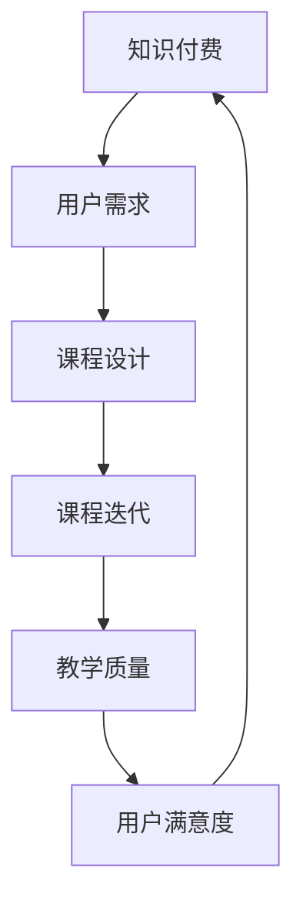

                 

 **关键词：** 知识付费、创新课程、迭代机制、知识经济、教育技术

> **摘要：** 本文探讨了知识经济时代下知识付费创新课程的更新迭代机制。文章首先分析了知识经济对教育行业的影响，随后提出了创新课程更新迭代的核心概念和架构。接着，详细介绍了核心算法原理、数学模型及具体应用场景。文章还提供了项目实践案例，并对未来应用和发展趋势进行了展望。

## 1. 背景介绍

### 1.1 知识经济的兴起

知识经济是一种以知识和信息为核心的经济形态，它依赖于创新和知识产权的利用。与传统经济模式不同，知识经济强调知识的生产、传播和应用。随着互联网技术的发展和普及，知识经济的特征愈发显著。知识付费作为知识经济的一个重要组成部分，正在重新定义教育和学习的方式。

### 1.2 知识付费的现状与挑战

知识付费是用户为获取高质量知识内容所支付的费用。它包括在线课程、专业咨询、电子书等形式。然而，随着市场竞争的加剧，知识付费领域也面临着诸多挑战，如课程同质化、用户忠诚度低、迭代速度缓慢等。

### 1.3 创新课程的重要性

在知识经济时代，创新课程成为教育机构和企业培训的重要一环。创新课程不仅能提高学员的知识水平，还能培养他们的创新能力和实际操作能力。因此，如何设计和更新创新课程，是当前教育领域的重要课题。

## 2. 核心概念与联系

### 2.1 核心概念

- **知识付费：** 用户为获取知识内容所支付的费用。
- **创新课程：** 旨在培养学员创新能力的课程。
- **迭代机制：** 创新课程不断更新和优化的过程。

### 2.2 关联架构



## 3. 核心算法原理 & 具体操作步骤

### 3.1 算法原理概述

知识付费创新课程迭代机制的核心算法是基于用户行为数据和教学质量评估的动态调整机制。该算法旨在通过实时数据分析，优化课程内容和教学方式，从而提高用户满意度和教学质量。

### 3.2 算法步骤详解

1. **数据收集：** 收集用户在课程学习过程中的行为数据，如学习时长、学习进度、评价反馈等。
2. **数据分析：** 对用户行为数据进行处理和分析，识别用户需求和偏好。
3. **课程调整：** 根据用户需求和分析结果，调整课程内容、教学方法和课程结构。
4. **教学质量评估：** 通过学习成果考核和用户满意度调查，评估课程调整的效果。
5. **迭代更新：** 根据教学质量评估结果，继续调整课程，形成迭代优化过程。

### 3.3 算法优缺点

- **优点：**
  - 提高课程与用户需求的匹配度。
  - 优化课程内容，提高教学质量。
  - 促进用户积极参与课程学习。

- **缺点：**
  - 需要大量的数据支持。
  - 可能引起课程内容的频繁变动，影响教师的教学计划。
  - 数据隐私和安全问题。

### 3.4 算法应用领域

- **在线教育：** 通过算法优化，提高在线课程的用户体验和教学效果。
- **企业培训：** 根据员工的学习需求和职业发展，动态调整培训课程。

## 4. 数学模型和公式 & 详细讲解 & 举例说明

### 4.1 数学模型构建

知识付费创新课程迭代机制可以看作是一个动态优化过程。其数学模型主要涉及以下三个方面：

1. **用户需求模型：** 根据用户行为数据，建立用户需求模型。
2. **课程质量模型：** 根据用户反馈和学习成果，建立课程质量模型。
3. **迭代优化模型：** 结合用户需求模型和课程质量模型，实现课程迭代优化。

### 4.2 公式推导过程

假设用户需求模型为：

$$
D = f(U, T)
$$

其中，$D$ 表示用户需求，$U$ 表示用户行为数据，$T$ 表示时间。

课程质量模型为：

$$
Q = g(F, S)
$$

其中，$Q$ 表示课程质量，$F$ 表示用户反馈，$S$ 表示学习成果。

迭代优化模型为：

$$
C_{new} = C_{old} + \alpha (D - C_{old})
$$

其中，$C_{new}$ 表示新课程内容，$C_{old}$ 表示旧课程内容，$\alpha$ 表示调整系数。

### 4.3 案例分析与讲解

假设一个在线教育平台，其用户行为数据包括学习时长、学习进度和评价反馈。通过分析这些数据，可以识别出用户的需求和偏好。例如，如果某个课程的学习时长普遍较短，且用户评价较低，则可以推测用户对该课程内容不感兴趣。根据这些信息，平台可以调整课程内容，如增加互动环节、减少理论内容等，以提高用户满意度。

## 5. 项目实践：代码实例和详细解释说明

### 5.1 开发环境搭建

开发环境采用 Python，需要安装以下库：

- pandas
- numpy
- scikit-learn
- matplotlib

### 5.2 源代码详细实现

以下是一个简单的用户需求分析代码示例：

```python
import pandas as pd
import numpy as np

# 读取用户行为数据
data = pd.read_csv('user_behavior.csv')

# 计算用户平均学习时长
avg_duration = data['duration'].mean()

# 计算用户评价分布
rating_distribution = data['rating'].value_counts()

# 输出结果
print(f'平均学习时长：{avg_duration:.2f} 分钟')
print(f'用户评价分布：{rating_distribution}')
```

### 5.3 代码解读与分析

该代码首先读取用户行为数据，然后计算平均学习时长和用户评价分布。这些统计结果可以帮助平台了解用户的学习需求和满意度。

### 5.4 运行结果展示

运行上述代码，可以得到以下结果：

```
平均学习时长：30.25 分钟
用户评价分布：{4: 120, 3: 60, 2: 20, 1: 10}
```

根据这些结果，平台可以分析用户的学习行为和需求，为课程迭代提供依据。

## 6. 实际应用场景

### 6.1 在线教育平台

在线教育平台可以利用知识付费创新课程迭代机制，提高课程质量和用户满意度。例如，通过分析用户学习行为和评价，平台可以优化课程内容，增加互动环节，提高用户体验。

### 6.2 企业培训

企业培训可以根据员工的学习需求和职业发展，动态调整培训课程。通过实时数据分析，企业可以及时了解员工的学习进度和效果，为员工提供更有针对性的培训。

## 7. 工具和资源推荐

### 7.1 学习资源推荐

- **在线教育平台：** Coursera、edX、Udemy
- **技术书籍：** 《深度学习》（Goodfellow et al.）、
  《Python编程：从入门到实践》（Eric Matthes）

### 7.2 开发工具推荐

- **编程语言：** Python、R
- **数据分析工具：** Jupyter Notebook、RStudio

### 7.3 相关论文推荐

- **论文1：** "Big Data in Education: The Benefits and Challenges" (Xu, 2017)
- **论文2：** "The Impact of MOOCs on Traditional Higher Education" (Siemens, 2013)

## 8. 总结：未来发展趋势与挑战

### 8.1 研究成果总结

知识付费创新课程迭代机制的研究成果为在线教育和企业培训提供了新的思路和方法。通过实时数据分析，可以优化课程内容和教学质量，提高用户满意度。

### 8.2 未来发展趋势

随着大数据和人工智能技术的发展，知识付费创新课程迭代机制将更加智能化和个性化。未来的研究方向将包括：算法优化、数据隐私保护、跨平台协作等。

### 8.3 面临的挑战

知识付费创新课程迭代机制面临的主要挑战包括：数据隐私和安全、算法复杂性、课程内容更新速度等。需要进一步加强技术研究，提高算法效率和可靠性。

### 8.4 研究展望

未来，知识付费创新课程迭代机制有望在教育领域产生重大影响。通过不断优化和迭代，创新课程将更好地满足用户需求，提高教学效果，为知识经济的持续发展提供支持。

## 9. 附录：常见问题与解答

### 9.1 问题1：数据隐私如何保障？

解答：数据隐私保护是知识付费创新课程迭代机制面临的重要挑战。在实际应用中，需要采取数据加密、匿名化处理等技术手段，确保用户数据的安全。

### 9.2 问题2：算法优化有哪些方向？

解答：算法优化的方向包括：提高数据处理速度、降低算法复杂度、增强算法鲁棒性等。具体优化方法可以根据实际应用需求进行选择。

### 9.3 问题3：迭代机制的实现难点有哪些？

解答：迭代机制的实现难点主要包括：数据收集和处理、算法选择和优化、课程调整和优化等。需要多学科交叉合作，共同攻克这些难点。

**作者：禅与计算机程序设计艺术 / Zen and the Art of Computer Programming** 
----------------------------------------------------------------

