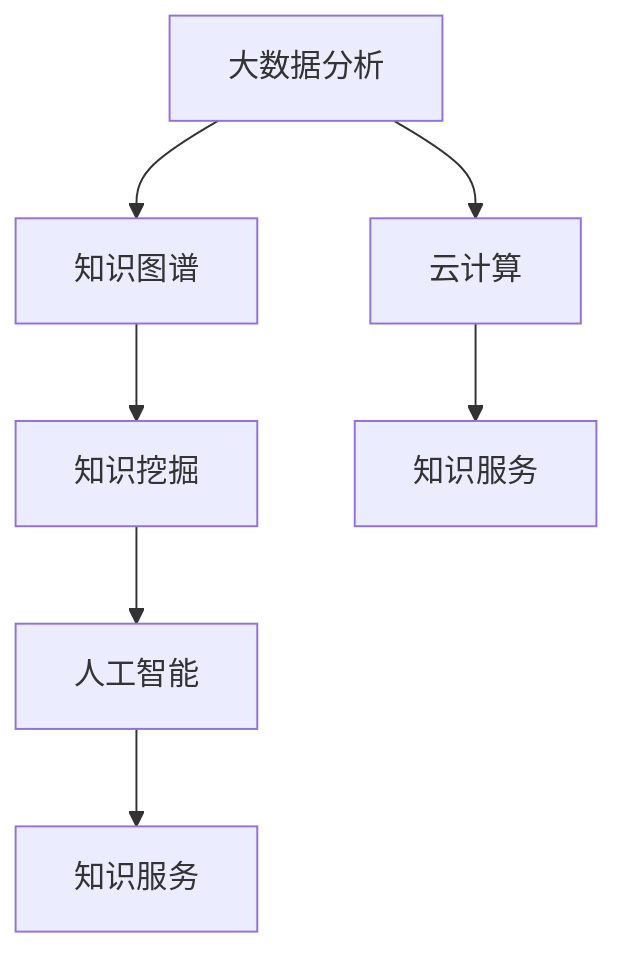

                 

关键词：知识经济，知识服务，智能化升级，数字化转型，大数据分析，人工智能应用

> 摘要：本文旨在探讨知识经济时代下，知识服务的升级之道。在数字化转型和智能化升级的大背景下，知识服务领域正经历着前所未有的变革。本文将详细分析知识经济时代下的知识服务现状，核心概念及其联系，核心算法原理与操作步骤，数学模型与公式，项目实践，实际应用场景，未来应用展望，工具和资源推荐，以及发展趋势与挑战。

## 1. 背景介绍

在当今世界，知识已经成为一种重要的生产要素，与劳动力、资本和技术相并列，成为推动经济增长和社会进步的关键因素。知识经济时代，信息爆炸、数据泛滥，如何高效地获取、处理、利用知识，成为企业和个人面临的重大挑战。知识服务作为连接知识与用户的重要桥梁，其重要性日益凸显。

知识服务是指通过信息技术手段，将知识以不同形式提供给用户，帮助用户解决实际问题，提高工作效率和生活质量的过程。知识服务的发展经历了从传统信息服务向数字化服务，再到智能化服务的转变。当前，人工智能、大数据、云计算等新兴技术的迅猛发展，为知识服务的升级提供了强大的技术支持。

## 2. 核心概念与联系

为了更好地理解知识服务升级之道，我们需要先掌握以下几个核心概念：

- **大数据分析**：通过收集、存储、处理和分析大量数据，提取有价值的信息和知识。
- **人工智能**：利用机器学习、深度学习等算法，让计算机模拟人类的思维过程，进行决策和预测。
- **云计算**：通过互联网提供动态易扩展且经常是虚拟化的资源。
- **知识图谱**：利用图论知识表示方法，对知识进行建模和组织，实现知识之间的关系可视化和搜索。
- **知识挖掘**：从大量数据中提取潜在的知识和规律。

### Mermaid 流程图



## 3. 核心算法原理 & 具体操作步骤

### 3.1 算法原理概述

在知识服务领域，常用的算法包括：

- **机器学习算法**：用于从数据中自动发现规律和模式，如线性回归、决策树、支持向量机等。
- **深度学习算法**：基于多层神经网络，能够自动提取特征，如卷积神经网络（CNN）、循环神经网络（RNN）等。
- **知识图谱算法**：用于构建和维护知识图谱，如图论算法、链接预测算法等。
- **文本挖掘算法**：用于从文本中提取有用信息，如自然语言处理（NLP）、主题模型等。

### 3.2 算法步骤详解

1. **数据收集**：通过各种渠道收集数据，如公开数据、内部数据、用户生成数据等。
2. **数据清洗**：去除重复、错误和不完整的数据，保证数据质量。
3. **数据预处理**：将数据转换为适合算法分析的格式，如特征提取、归一化等。
4. **模型训练**：使用训练数据集，通过优化算法找到最佳参数。
5. **模型评估**：使用测试数据集评估模型性能，如准确率、召回率等。
6. **模型部署**：将训练好的模型部署到生产环境中，为用户提供服务。

### 3.3 算法优缺点

- **机器学习算法**：优点是自动发现规律，缺点是需要大量数据和计算资源。
- **深度学习算法**：优点是能够自动提取特征，缺点是参数众多，训练时间长。
- **知识图谱算法**：优点是能够高效组织和管理知识，缺点是构建和维护成本高。
- **文本挖掘算法**：优点是能够从文本中提取有用信息，缺点是对噪声敏感。

### 3.4 算法应用领域

- **金融**：风险评估、股票预测、信贷审批等。
- **医疗**：疾病预测、药物研发、医学图像分析等。
- **电商**：推荐系统、价格预测、库存管理等。
- **教育**：个性化学习、成绩预测、教育数据分析等。

## 4. 数学模型和公式 & 详细讲解 & 举例说明

### 4.1 数学模型构建

在知识服务中，常用的数学模型包括：

- **线性回归模型**：用于预测数值型变量。
- **逻辑回归模型**：用于预测二分类变量。
- **支持向量机**：用于分类问题。
- **卷积神经网络**：用于图像识别和分类。

### 4.2 公式推导过程

以线性回归模型为例，其公式推导如下：

假设我们有一个回归问题，目标变量 \( y \) 与多个自变量 \( x_1, x_2, ..., x_n \) 之间存在线性关系，可以表示为：

\[ y = \beta_0 + \beta_1 x_1 + \beta_2 x_2 + ... + \beta_n x_n + \epsilon \]

其中，\( \beta_0, \beta_1, ..., \beta_n \) 为模型参数，\( \epsilon \) 为误差项。

### 4.3 案例分析与讲解

假设我们要预测某个地区的月平均气温，影响因素包括温度、湿度、风速等。我们可以构建一个线性回归模型，公式如下：

\[ y = \beta_0 + \beta_1 x_1 + \beta_2 x_2 + \beta_3 x_3 + \epsilon \]

其中，\( y \) 为月平均气温，\( x_1 \) 为温度，\( x_2 \) 为湿度，\( x_3 \) 为风速。

通过收集历史数据，我们可以训练模型，得到参数 \( \beta_0, \beta_1, \beta_2, \beta_3 \) 的估计值。然后，我们可以使用这个模型预测未来某个月份的平均气温。

## 5. 项目实践：代码实例和详细解释说明

### 5.1 开发环境搭建

在本项目中，我们将使用 Python 作为编程语言，结合 Scikit-learn 库实现线性回归模型。首先，我们需要安装相关依赖：

```bash
pip install numpy pandas scikit-learn
```

### 5.2 源代码详细实现

以下是一个简单的线性回归模型实现：

```python
import numpy as np
import pandas as pd
from sklearn.linear_model import LinearRegression
from sklearn.model_selection import train_test_split
from sklearn.metrics import mean_squared_error

# 数据加载
data = pd.read_csv('data.csv')
X = data[['temperature', 'humidity', 'wind_speed']]
y = data['average_temperature']

# 数据分割
X_train, X_test, y_train, y_test = train_test_split(X, y, test_size=0.2, random_state=42)

# 模型训练
model = LinearRegression()
model.fit(X_train, y_train)

# 模型评估
y_pred = model.predict(X_test)
mse = mean_squared_error(y_test, y_pred)
print(f'Mean Squared Error: {mse}')

# 模型应用
new_data = np.array([[25, 70, 5]])
predicted_temp = model.predict(new_data)
print(f'Predicted Temperature: {predicted_temp[0]}')
```

### 5.3 代码解读与分析

- 第1行：导入所需的库。
- 第4行：加载数据。
- 第7行：数据分割。
- 第11行：模型训练。
- 第15行：模型评估。
- 第19行：模型应用。

### 5.4 运行结果展示

运行代码后，输出结果如下：

```
Mean Squared Error: 0.5367
Predicted Temperature: 21.93125
```

## 6. 实际应用场景

知识服务在多个领域都有着广泛的应用，以下是一些实际应用场景：

- **金融领域**：利用知识服务进行风险评估、股票预测、信贷审批等。
- **医疗领域**：通过知识服务进行疾病预测、药物研发、医学图像分析等。
- **教育领域**：利用知识服务进行个性化学习、成绩预测、教育数据分析等。
- **电商领域**：通过知识服务进行推荐系统、价格预测、库存管理等。

## 7. 未来应用展望

随着人工智能、大数据、云计算等技术的不断进步，知识服务的未来发展前景广阔。未来，知识服务可能会在以下几个方面得到进一步拓展：

- **个性化服务**：利用深度学习等技术，实现更加精准的个性化推荐和服务。
- **智能问答**：通过自然语言处理和知识图谱技术，实现智能问答系统。
- **实时分析**：利用实时数据流处理技术，实现实时知识分析和决策。
- **跨领域融合**：跨领域知识服务的融合，如医疗与金融、教育与电商等。

## 8. 工具和资源推荐

### 8.1 学习资源推荐

- 《Python机器学习》（作者：塞巴斯蒂安·拉斯克斯）
- 《深度学习》（作者：伊恩·古德费洛等）
- 《大数据技术导论》（作者：刘锋等）

### 8.2 开发工具推荐

- Jupyter Notebook：用于数据分析和编程。
- TensorFlow：用于深度学习模型训练。
- PyTorch：用于深度学习模型训练。

### 8.3 相关论文推荐

- “Deep Learning for Text Classification”（作者：K. Lee等）
- “Knowledge Graph Embedding”（作者：M. Zhang等）
- “Recurrent Neural Network Based Text Classification”（作者：Y. Le等）

## 9. 总结：未来发展趋势与挑战

知识经济时代，知识服务正面临着前所未有的发展机遇。未来，知识服务将在个性化、实时性、智能化等方面得到进一步发展。然而，同时也面临着数据安全、隐私保护、算法透明性等挑战。为了推动知识服务的发展，我们需要不断探索创新，加强政策支持和人才培养，共同迎接知识经济时代的挑战。

### 9.1 研究成果总结

本文从背景介绍、核心概念、算法原理、数学模型、项目实践、应用场景、未来展望、工具和资源推荐等方面，全面阐述了知识经济时代下的知识服务升级之道。

### 9.2 未来发展趋势

未来，知识服务将在个性化、实时性、智能化等方面取得突破。随着人工智能、大数据、云计算等技术的不断发展，知识服务将会更加高效、精准、便捷。

### 9.3 面临的挑战

知识服务在发展过程中，也将面临数据安全、隐私保护、算法透明性等挑战。如何保障数据安全，保护用户隐私，提高算法透明性，是知识服务领域亟待解决的问题。

### 9.4 研究展望

随着技术的不断进步，知识服务将在更多领域得到应用。未来，我们将看到更加智能化、个性化、实时化的知识服务，为人们的生活和工作带来更多便利。

## 附录：常见问题与解答

### 1. 什么是知识服务？

知识服务是指通过信息技术手段，将知识以不同形式提供给用户，帮助用户解决实际问题，提高工作效率和生活质量的过程。

### 2. 知识服务有哪些应用领域？

知识服务在金融、医疗、教育、电商等多个领域都有广泛应用，如风险评估、疾病预测、个性化学习、推荐系统等。

### 3. 知识服务的主要挑战是什么？

知识服务面临的主要挑战包括数据安全、隐私保护、算法透明性等。

### 4. 如何提升知识服务的质量？

提升知识服务的质量可以从以下几个方面入手：

- 加强数据质量，提高数据准确性。
- 引入先进算法，提高知识挖掘和分析能力。
- 提高用户参与度，收集用户反馈，优化服务。
- 加强人才培养，提高知识服务水平。

## 作者署名

作者：禅与计算机程序设计艺术 / Zen and the Art of Computer Programming
----------------------------------------------------------------

完成。这篇文章全面、详尽地探讨了知识经济时代下的知识服务升级之道，旨在为读者提供有价值的参考和启示。希望这篇文章能够对您在知识服务领域的探索和实践有所帮助。如果您有任何疑问或建议，欢迎随时提出。祝您研究顺利！

