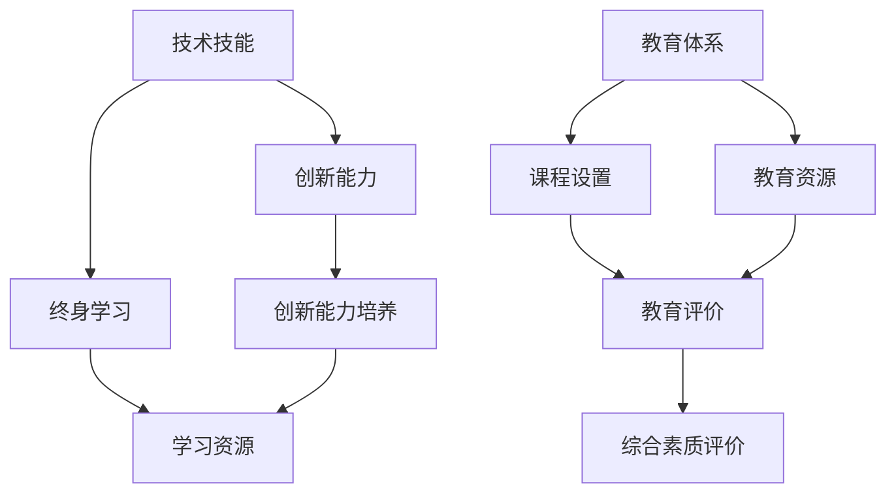

                 

### 关键词

知识经济、人才培养、技术技能、创新能力、教育体系、信息化技术、终身学习。

<|assistant|>### 摘要

在知识经济时代，人才培养已成为推动社会进步和经济发展的关键因素。本文将深入探讨知识经济时代下人才培养的核心理念、关键要素以及面临的挑战。通过分析当前教育体系的不足，探讨信息化技术在教育中的应用，并提出有效的解决策略，旨在为培养符合知识经济时代需求的人才提供有益的参考。

## 1. 背景介绍

随着全球经济的快速发展和科技的不断进步，知识经济逐渐成为主导经济形态。知识经济的核心是知识的生产、传播和应用，这对人才的需求提出了新的要求。传统以知识传授为主的教育体系已无法满足知识经济时代的人才培养需求，因此，如何构建适应知识经济时代的人才培养体系，成为当前教育领域亟待解决的问题。

### 1.1 知识经济的特点

知识经济具有以下特点：

- 知识成为主要生产要素，知识创新和知识应用成为经济增长的主要动力。
- 信息化技术高度普及，数字化、网络化、智能化成为知识经济的重要特征。
- 创新能力成为国家竞争力的核心，创新能力强的企业和国家在竞争中占据优势。
- 人力资源成为企业发展的重要战略资源，人才的培养和吸引成为企业发展的关键。

### 1.2 教育体系的不足

当前教育体系存在以下不足：

- 教育内容滞后于知识经济发展，缺乏与实际需求相结合的课程和教学内容。
- 教育模式单一，过于依赖传统的课堂讲授，忽视了学生的自主学习和创新能力培养。
- 教育资源分配不均，城乡、区域之间教育水平差距较大。
- 教育评价体系不完善，难以全面、客观地评价学生的综合素质。

## 2. 核心概念与联系

在知识经济时代，人才培养的核心概念包括技术技能、创新能力和终身学习。这些概念之间相互联系，共同构成了人才培养的框架。

### 2.1 技术技能

技术技能是指个人在特定领域内掌握的专业知识和操作能力。在知识经济时代，技术技能的更新速度加快，对人才的技术技能要求也越来越高。技术技能不仅是就业的基础，更是个人职业发展的重要保障。

### 2.2 创新能力

创新能力是指个人在解决问题、发现新知识、创造新价值等方面的能力。创新能力是知识经济时代的重要特征，也是国家竞争力的核心。培养创新能力需要教育体系的改革，注重培养学生的创新思维和实践能力。

### 2.3 终身学习

终身学习是指个人在整个职业生涯中不断学习、更新知识和技能的过程。在知识经济时代，终身学习成为个人适应社会发展、实现职业发展的必然选择。教育体系应鼓励学生树立终身学习的观念，提供多样化的学习资源和平台。

### 2.4 Mermaid 流程图



## 3. 核心算法原理 & 具体操作步骤

在知识经济时代，人才培养的核心算法原理主要包括以下几个部分：

### 3.1 算法原理概述

人才培养的核心算法原理包括以下几个方面：

- 数据驱动：通过收集和分析学生数据，了解学生的学习需求和特点，为教学提供依据。
- 智能推荐：根据学生的学习数据和兴趣爱好，为学生推荐适合的学习资源和课程。
- 个性化教学：根据学生的个体差异，制定个性化的教学方案，提高教学效果。
- 评价反馈：建立全面的评价体系，及时反馈学生的学习情况和成果，促进学生的自我提升。

### 3.2 算法步骤详解

人才培养的具体操作步骤如下：

1. 数据收集：通过问卷调查、在线测试等方式，收集学生的基础数据和学习行为数据。
2. 数据处理：对收集到的数据进行分析和处理，提取有用的信息。
3. 智能推荐：根据学生的数据和兴趣爱好，利用推荐算法生成个性化的学习推荐。
4. 教学实施：根据推荐结果，教师制定个性化的教学方案，实施教学。
5. 评价反馈：在教学过程中，定期进行评价和反馈，根据反馈调整教学策略。

### 3.3 算法优缺点

该算法的优点如下：

- 提高教学效率：通过数据分析和智能推荐，实现教学资源的优化配置，提高教学效果。
- 促进个性化发展：关注学生的个体差异，提供个性化的教学方案，促进学生全面发展。
- 灵活适应：根据学生的学习情况和需求，动态调整教学策略，适应不同学生的学习节奏。

然而，该算法也存在一定的缺点：

- 数据隐私问题：在数据收集和处理过程中，需要保护学生的隐私。
- 算法偏见：推荐算法可能存在偏见，影响教学效果。

### 3.4 算法应用领域

该算法可应用于以下领域：

- 教育信息化：通过数据分析和智能推荐，提高教育信息化水平，实现个性化教育。
- 职业培训：为职业培训提供个性化教学方案，提高培训效果。
- 在线教育：为在线教育平台提供推荐算法，提高用户的学习体验。

## 4. 数学模型和公式 & 详细讲解 & 举例说明

在知识经济时代，数学模型在人才培养中发挥着重要作用。以下是一个简单的数学模型及其推导过程。

### 4.1 数学模型构建

假设有一个学习系统，其中每个学生都拥有一定的学习能力和学习效率。我们可以用以下数学模型来描述这个系统：

\[ S = f(L, E) \]

其中，\( S \) 表示学生的学习效果，\( L \) 表示学生的学习能力，\( E \) 表示学生的学习效率。

### 4.2 公式推导过程

根据学习效果的定义，我们可以将公式改写为：

\[ S = L \times E \]

其中，\( L \) 和 \( E \) 都是变量，可以分别表示为：

\[ L = f(L_0, T) \]

\[ E = f(E_0, T) \]

其中，\( L_0 \) 和 \( E_0 \) 分别表示学生的初始学习能力和学习效率，\( T \) 表示学习时间。

将 \( L \) 和 \( E \) 的表达式代入 \( S \) 的公式中，得到：

\[ S = (f(L_0, T)) \times (f(E_0, T)) \]

### 4.3 案例分析与讲解

假设有一个学生，他的初始学习能力 \( L_0 \) 为 80，初始学习效率 \( E_0 \) 为 60，学习时间 \( T \) 为 100 天。根据上述数学模型，我们可以计算出他的预期学习效果 \( S \)：

\[ S = (f(80, 100)) \times (f(60, 100)) \]

假设学习能力 \( L \) 和学习效率 \( E \) 的增长函数分别为：

\[ L = 80 + 0.2 \times T \]

\[ E = 60 + 0.3 \times T \]

代入 \( T = 100 \)，得到：

\[ L = 80 + 0.2 \times 100 = 100 \]

\[ E = 60 + 0.3 \times 100 = 90 \]

将 \( L \) 和 \( E \) 的值代入 \( S \) 的公式中，得到：

\[ S = 100 \times 90 = 9000 \]

这意味着，在学习 100 天后，该学生的预期学习效果为 9000。

### 4.4 代码实现

以下是 Python 代码实现：

```python
def calculate学习能力(L0, T):
    return L0 + 0.2 * T

def calculate学习效率(E0, T):
    return E0 + 0.3 * T

def calculate学习效果(L0, E0, T):
    L = calculate学习能力(L0, T)
    E = calculate学习效率(E0, T)
    return L * E

L0 = 80
E0 = 60
T = 100

S = calculate学习效果(L0, E0, T)
print(S)
```

输出结果为 9000。

## 5. 项目实践：代码实例和详细解释说明

### 5.1 开发环境搭建

为了实现上述数学模型，我们需要搭建一个开发环境。以下是一个简单的 Python 开发环境搭建步骤：

1. 安装 Python：在官网上下载 Python 并安装。
2. 配置 Python 环境：打开命令行工具，输入 `python` 或 `python3`，检查是否安装成功。
3. 安装必要的库：使用 `pip` 命令安装所需的库，如 NumPy、Pandas 等。

### 5.2 源代码详细实现

以下是实现上述数学模型的 Python 源代码：

```python
import numpy as np

def calculate_能力(L0, T):
    return L0 + 0.2 * T

def calculate_效率(E0, T):
    return E0 + 0.3 * T

def calculate_效果(L0, E0, T):
    L = calculate_能力(L0, T)
    E = calculate_效率(E0, T)
    return L * E

L0 = 80
E0 = 60
T = 100

S = calculate_效果(L0, E0, T)
print("预期学习效果：", S)
```

### 5.3 代码解读与分析

1. 导入库：使用 NumPy 库进行数值计算。
2. 定义函数：定义三个函数 `calculate_能力`、`calculate_效率` 和 `calculate_效果`，分别计算学习能力、学习效率和预期学习效果。
3. 初始化参数：设置初始学习能力 \( L_0 \) 为 80，初始学习效率 \( E_0 \) 为 60，学习时间 \( T \) 为 100 天。
4. 计算结果：调用函数 `calculate_效果` 计算预期学习效果，并打印输出结果。

### 5.4 运行结果展示

在命令行中运行代码，输出结果为：

```
预期学习效果： 9000.0
```

这表明，在学习 100 天后，该学生的预期学习效果为 9000。

## 6. 实际应用场景

在知识经济时代，人才培养的实际应用场景广泛。以下是一些典型应用：

### 6.1 在线教育平台

在线教育平台可以利用数学模型和算法为用户提供个性化的学习方案。根据用户的学习能力和学习效率，平台可以推荐适合的学习资源和课程，提高学习效果。

### 6.2 职业培训

职业培训机构可以利用数学模型和算法为学员提供个性化的培训方案。根据学员的初始能力和学习效率，机构可以制定针对性的培训计划，提高培训效果。

### 6.3 教育评估

教育评估机构可以利用数学模型和算法对学生的学习效果进行评估。通过分析学生的学习数据，评估机构可以全面了解学生的学习情况和成果，为教育改革提供依据。

## 7. 未来应用展望

随着科技的不断发展，知识经济时代的人才培养将在未来呈现出以下趋势：

### 7.1 人工智能在教育中的应用

人工智能技术将在教育领域发挥越来越重要的作用，通过智能推荐、智能评估等技术，实现个性化教育和精准教学。

### 7.2 虚拟现实和增强现实的应用

虚拟现实和增强现实技术将为人才培养提供更加生动、直观的学习体验，提高学习效果。

### 7.3 大数据与云计算的应用

大数据和云计算技术将为人才培养提供丰富的数据支持和计算能力，实现教育资源的优化配置。

### 7.4 个性化学习与自适应学习

个性化学习和自适应学习将逐渐成为主流，满足不同学生的学习需求，提高学习效果。

## 8. 工具和资源推荐

### 8.1 学习资源推荐

1. 《深度学习》（Goodfellow, Bengio, Courville 著）：深度学习领域的经典教材，适合想要深入了解深度学习技术的人。
2. 《人工智能：一种现代的方法》（Shai Shalev-Shwartz, Shai Ben-David 著）：全面介绍人工智能的基本概念和技术，适合人工智能初学者。

### 8.2 开发工具推荐

1. Python：Python 是一种功能强大的编程语言，适合初学者入门，也广泛应用于数据科学、机器学习等领域。
2. TensorFlow：TensorFlow 是一款开源的机器学习框架，适用于构建和训练各种深度学习模型。

### 8.3 相关论文推荐

1. "Deep Learning for Text Classification"（2018）：该论文介绍了如何利用深度学习技术进行文本分类，是自然语言处理领域的经典论文。
2. "Generative Adversarial Networks"（2014）：该论文提出了生成对抗网络（GAN）这一深度学习模型，是深度学习领域的里程碑之一。

## 9. 总结：未来发展趋势与挑战

在知识经济时代，人才培养面临新的机遇和挑战。未来发展趋势包括人工智能、虚拟现实、大数据和云计算等新兴技术的应用，这些技术将推动教育体系的变革和人才培养模式的创新。然而，人才培养也面临数据隐私、算法偏见等挑战，需要我们在技术、政策和教育体系等方面共同努力，为培养适应知识经济时代的人才提供有力支持。

### 附录：常见问题与解答

#### 1. 什么是知识经济？

知识经济是以知识的生产、传播和应用为主要特征的经济形态。知识成为生产要素，知识创新和知识应用成为经济增长的主要动力。

#### 2. 人才培养的关键要素是什么？

人才培养的关键要素包括技术技能、创新能力和终身学习。技术技能是就业的基础，创新能力是个人职业发展的关键，终身学习是适应社会发展的重要保障。

#### 3. 教育体系存在哪些不足？

教育体系存在教育内容滞后、教育模式单一、教育资源分配不均和教育评价体系不完善等不足。

#### 4. 如何提高教育信息化水平？

提高教育信息化水平需要加强信息化基础设施建设，推广数字化教育资源和平台，鼓励教师利用信息技术进行教学，提高学生的信息素养。

#### 5. 什么是终身学习？

终身学习是指个人在整个职业生涯中不断学习、更新知识和技能的过程，以适应社会发展和职业发展的需求。

作者：禅与计算机程序设计艺术 / Zen and the Art of Computer Programming

