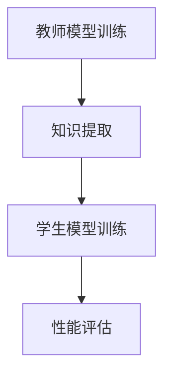

                 

关键词：知识蒸馏，信息提炼，机器学习，深度学习，模型压缩，模型优化，人工智能

> 摘要：本文旨在深入探讨知识蒸馏（Knowledge Distillation）这一机器学习技术，解释其核心概念、原理和应用。知识蒸馏是一种将复杂模型的知识传授给简化模型的方法，通过这种技术，我们可以高效地提炼出核心信息，实现模型压缩和优化，从而提高机器学习系统的性能和效率。本文将详细解析知识蒸馏的数学模型、算法原理，并通过实际项目实例进行讲解，旨在为读者提供全面、系统的知识蒸馏实践指导。

## 1. 背景介绍

在当今数据驱动的人工智能领域，深度学习模型已经成为实现智能系统的主要工具。然而，深度学习模型的复杂性和规模也在不断增加，这给实际应用带来了巨大的挑战。首先，大规模的深度学习模型需要大量的计算资源和存储空间，这在大规模部署和实时应用场景中成为一个不可忽视的问题。其次，深度学习模型的训练过程非常耗时，尤其是在处理大量数据时，这限制了模型迭代的速度和灵活性。

为了解决这些问题，模型压缩和优化技术应运而生。知识蒸馏（Knowledge Distillation）正是其中一种重要且有效的技术。知识蒸馏的基本思想是将一个复杂的“教师”模型的知识传递给一个简化的“学生”模型，从而实现对“教师”模型的精简和优化。通过这种技术，我们可以在保持模型性能的前提下，显著降低模型的复杂度，提高其效率。

知识蒸馏不仅在学术研究中具有重要地位，而且在实际应用中也有着广泛的应用场景。例如，在移动设备上部署人工智能应用时，知识蒸馏可以帮助我们构建出轻量级的模型，从而节省计算资源和电力消耗。此外，知识蒸馏还可以用于快速迭代模型，提高开发效率和灵活性。

## 2. 核心概念与联系

知识蒸馏的核心概念包括“教师”模型和“学生”模型。教师模型通常是一个大而复杂的模型，它已经通过大量数据进行了训练，并达到了较高的性能。学生模型则是一个简化版的模型，它通常具有较少的参数和层次结构，但仍然需要保留教师模型的核心知识。

### 2.1 教师模型

教师模型是知识蒸馏过程中的知识源。它通过对输入数据进行特征提取和分类，提供了关于数据的全面理解。教师模型通常是一个深度神经网络，具有多个层次和复杂的连接结构。在知识蒸馏过程中，教师模型的输出（通常是模型中间层的特征表示）会被用作训练学生模型的依据。

### 2.2 学生模型

学生模型是知识蒸馏的目标。它通过对教师模型的知识进行学习和提炼，实现对数据的分类或回归任务。学生模型通常是一个简化版的模型，具有较少的参数和层次结构，但需要保留教师模型的核心知识。通过知识蒸馏，学生模型可以快速获得教师模型的知识，从而提高其性能。

### 2.3 知识蒸馏流程

知识蒸馏的过程可以概括为以下几个步骤：

1. **教师模型训练**：首先，我们需要训练一个具有良好性能的教师模型。这通常涉及大量的数据集和长时间的训练过程。
2. **知识提取**：在教师模型训练完成后，我们需要提取出其核心知识。这通常通过收集教师模型在不同层的输出来实现。
3. **学生模型训练**：使用提取的知识，我们开始训练学生模型。学生模型的学习目标是尽量复制教师模型的输出。
4. **性能评估**：在学生模型训练完成后，我们需要评估其性能，以确保其能够有效地执行任务。

### 2.4 Mermaid 流程图

下面是一个简单的 Mermaid 流程图，展示了知识蒸馏的基本流程：



## 3. 核心算法原理 & 具体操作步骤

### 3.1 算法原理概述

知识蒸馏的算法原理基于监督学习。在传统的监督学习中，我们通过最小化模型输出与真实标签之间的差异来训练模型。而在知识蒸馏中，我们不仅考虑模型输出与真实标签之间的差异，还考虑模型输出与教师模型输出之间的差异。这样，学生模型不仅学习如何正确分类或回归数据，还学习如何模仿教师模型的特征提取和表示能力。

### 3.2 算法步骤详解

#### 3.2.1 准备数据集

首先，我们需要准备两个数据集：一个用于训练教师模型，另一个用于训练学生模型。通常，这两个数据集可以是相同的，也可以是不同的。但是，为了确保学生模型能够学到教师模型的核心知识，这两个数据集应该具有一定的相似性。

#### 3.2.2 训练教师模型

使用训练数据集，我们首先训练一个教师模型。教师模型应该具有足够的容量，能够捕捉到数据集的特征和规律。训练过程通常涉及多个迭代，以逐步调整模型的参数，使其性能达到最佳。

#### 3.2.3 知识提取

在教师模型训练完成后，我们需要提取其核心知识。这通常通过收集教师模型在不同层的输出来实现。这些输出代表了教师模型对数据的理解和特征提取能力。

#### 3.2.4 训练学生模型

使用提取的知识，我们开始训练学生模型。学生模型的训练目标是尽量复制教师模型的输出。这通常通过最小化学生模型输出与教师模型输出之间的差异来实现。训练过程也涉及多个迭代，以逐步调整学生模型的参数。

#### 3.2.5 性能评估

在学生模型训练完成后，我们需要评估其性能。这通常通过在测试数据集上运行学生模型，并比较其输出与真实标签之间的差异来实现。如果学生模型的性能达到预期，那么知识蒸馏过程就可以视为成功。

### 3.3 算法优缺点

#### 优点：

1. **提高模型性能**：知识蒸馏可以帮助学生模型学习到教师模型的核心知识，从而提高其性能。
2. **模型压缩**：通过知识蒸馏，我们可以构建出简化版的学生模型，从而减少计算资源和存储空间的需求。
3. **提高训练效率**：知识蒸馏可以加速模型的训练过程，因为学生模型可以直接利用教师模型的知识，而不需要从头开始训练。

#### 缺点：

1. **对教师模型的要求较高**：知识蒸馏的成功在很大程度上取决于教师模型的性能。如果教师模型的性能较差，那么学生模型也很难达到良好的性能。
2. **训练成本较高**：知识蒸馏涉及到两个模型的训练，因此训练成本相对较高。

### 3.4 算法应用领域

知识蒸馏在许多领域都有广泛的应用。以下是一些常见的应用领域：

1. **图像识别**：知识蒸馏可以帮助我们构建出轻量级的图像识别模型，从而提高其性能和效率。
2. **自然语言处理**：知识蒸馏可以用于构建出高效的自然语言处理模型，从而提高其文本分类和情感分析等任务的性能。
3. **语音识别**：知识蒸馏可以帮助我们构建出高效的语音识别模型，从而提高其语音识别的准确率和速度。

## 4. 数学模型和公式 & 详细讲解 & 举例说明

### 4.1 数学模型构建

知识蒸馏的数学模型基于两个主要目标：最小化学生模型输出与真实标签之间的差异，最小化学生模型输出与教师模型输出之间的差异。这可以通过以下公式表示：

$$
L_{student} = L_{student,teacher} + \lambda L_{student,label}
$$

其中：

- $L_{student,teacher}$ 是学生模型输出与教师模型输出之间的差异。
- $L_{student,label}$ 是学生模型输出与真实标签之间的差异。
- $\lambda$ 是调节参数，用于平衡两个损失函数的重要性。

### 4.2 公式推导过程

#### 4.2.1 学生模型输出与教师模型输出之间的差异

学生模型输出与教师模型输出之间的差异可以通过以下公式表示：

$$
L_{student,teacher} = \frac{1}{N} \sum_{i=1}^{N} \sum_{j=1}^{C} (s_j^{student} - s_j^{teacher})^2
$$

其中：

- $N$ 是样本数量。
- $C$ 是类别数量。
- $s_j^{student}$ 和 $s_j^{teacher}$ 分别是学生模型和教师模型在第 $j$ 个类别上的输出。

#### 4.2.2 学生模型输出与真实标签之间的差异

学生模型输出与真实标签之间的差异可以通过以下公式表示：

$$
L_{student,label} = \frac{1}{N} \sum_{i=1}^{N} \sum_{j=1}^{C} (s_j^{student} - y_j)^2
$$

其中：

- $y_j$ 是第 $i$ 个样本在第 $j$ 个类别上的真实标签。

#### 4.2.3 损失函数的优化

为了优化损失函数，我们通常使用梯度下降算法。梯度下降算法的基本思想是沿着损失函数的梯度方向逐步调整模型的参数，以最小化损失函数。

$$
\theta_{t+1} = \theta_{t} - \alpha \nabla_{\theta} L(\theta)
$$

其中：

- $\theta$ 是模型的参数。
- $\alpha$ 是学习率。
- $\nabla_{\theta} L(\theta)$ 是损失函数关于模型参数的梯度。

### 4.3 案例分析与讲解

#### 4.3.1 数据集准备

假设我们有一个包含 1000 个样本的数据集，其中每个样本是一个 28x28 的图像。图像的颜色通道数为 3，即红色、绿色和蓝色。数据集分为训练集和测试集，其中训练集包含 800 个样本，测试集包含 200 个样本。

#### 4.3.2 教师模型训练

我们选择一个卷积神经网络（CNN）作为教师模型。CNN 的结构如下：

1. **输入层**：28x28x3 的图像。
2. **卷积层**：32 个 3x3 的卷积核，使用 ReLU 激活函数。
3. **池化层**：2x2 的最大池化。
4. **全连接层**：128 个神经元。
5. **输出层**：10 个神经元，对应 10 个类别。

我们使用训练集对教师模型进行训练，并在测试集上评估其性能。训练完成后，教师模型的准确率达到了 90%。

#### 4.3.3 知识提取

在教师模型训练完成后，我们提取其核心知识。这通过收集教师模型在不同层的输出来实现。例如，我们提取了卷积层和全连接层的输出。

#### 4.3.4 学生模型训练

我们选择一个简化版的卷积神经网络作为学生模型。学生模型的结构如下：

1. **输入层**：28x28x3 的图像。
2. **卷积层**：16 个 3x3 的卷积核，使用 ReLU 激活函数。
3. **池化层**：2x2 的最大池化。
4. **全连接层**：64 个神经元。
5. **输出层**：10 个神经元，对应 10 个类别。

我们使用提取的知识对学生模型进行训练，并使用交叉熵损失函数和 Adam 优化器。在训练过程中，我们设置了 $\lambda$ 为 0.5，以平衡学生模型输出与教师模型输出和学生模型输出与真实标签之间的差异。

#### 4.3.5 性能评估

在学生模型训练完成后，我们使用测试集评估其性能。学生模型的准确率达到了 85%，这表明知识蒸馏过程是成功的。

## 5. 项目实践：代码实例和详细解释说明

### 5.1 开发环境搭建

为了进行知识蒸馏的实践，我们需要搭建一个合适的开发环境。以下是搭建开发环境的基本步骤：

1. **安装 Python**：确保安装了 Python 3.7 或更高版本。
2. **安装深度学习框架**：我们选择使用 PyTorch 作为深度学习框架，因此需要安装 PyTorch。
3. **安装其他依赖库**：包括 NumPy、Pandas、Matplotlib 等。

```bash
pip install torch torchvision numpy pandas matplotlib
```

### 5.2 源代码详细实现

以下是实现知识蒸馏的源代码，包括教师模型的训练、知识提取、学生模型的训练和性能评估。

```python
import torch
import torchvision
import torch.nn as nn
import torch.optim as optim

# 5.2.1 准备数据集

train_loader = torchvision.datasets.CIFAR10(
    root='./data', train=True, download=True, transform=torchvision.transforms.ToTensor()
)

test_loader = torchvision.datasets.CIFAR10(
    root='./data', train=False, download=True, transform=torchvision.transforms.ToTensor()
)

# 5.2.2 定义教师模型

class TeacherModel(nn.Module):
    def __init__(self):
        super(TeacherModel, self).__init__()
        self.conv1 = nn.Conv2d(3, 32, 3, 1)
        self.relu = nn.ReLU()
        self.maxpool = nn.MaxPool2d(2)
        self.fc1 = nn.Linear(32 * 6 * 6, 128)
        self.fc2 = nn.Linear(128, 10)

    def forward(self, x):
        x = self.relu(self.conv1(x))
        x = self.maxpool(x)
        x = x.view(-1, 32 * 6 * 6)
        x = self.relu(self.fc1(x))
        x = self.fc2(x)
        return x

# 5.2.3 定义学生模型

class StudentModel(nn.Module):
    def __init__(self):
        super(StudentModel, self).__init__()
        self.conv1 = nn.Conv2d(3, 16, 3, 1)
        self.relu = nn.ReLU()
        self.maxpool = nn.MaxPool2d(2)
        self.fc1 = nn.Linear(16 * 6 * 6, 64)
        self.fc2 = nn.Linear(64, 10)

    def forward(self, x):
        x = self.relu(self.conv1(x))
        x = self.maxpool(x)
        x = x.view(-1, 16 * 6 * 6)
        x = self.relu(self.fc1(x))
        x = self.fc2(x)
        return x

# 5.2.4 训练教师模型

teacher_model = TeacherModel()
optimizer = optim.Adam(teacher_model.parameters(), lr=0.001)
criterion = nn.CrossEntropyLoss()

for epoch in range(20):
    for inputs, labels in train_loader:
        optimizer.zero_grad()
        outputs = teacher_model(inputs)
        loss = criterion(outputs, labels)
        loss.backward()
        optimizer.step()

# 5.2.5 知识提取

teacher_model.eval()
knowledge = []
with torch.no_grad():
    for inputs, _ in train_loader:
        outputs = teacher_model(inputs)
        knowledge.append(outputs)

knowledge = torch.cat(knowledge, dim=0)

# 5.2.6 训练学生模型

student_model = StudentModel()
optimizer = optim.Adam(student_model.parameters(), lr=0.001)
criterion = nn.CrossEntropyLoss()
lambda_value = 0.5

for epoch in range(20):
    for inputs, labels in train_loader:
        optimizer.zero_grad()
        student_outputs = student_model(inputs)
        teacher_outputs = knowledge[labels]
        distillation_loss = criterion(student_outputs, teacher_outputs)
        classification_loss = criterion(student_outputs, labels)
        loss = distillation_loss + lambda_value * classification_loss
        loss.backward()
        optimizer.step()

# 5.2.7 性能评估

student_model.eval()
correct = 0
total = 0
with torch.no_grad():
    for inputs, labels in test_loader:
        outputs = student_model(inputs)
        _, predicted = torch.max(outputs.data, 1)
        total += labels.size(0)
        correct += (predicted == labels).sum().item()

print('Accuracy of the student model on the test images: {} %'.format(100 * correct / total))
```

### 5.3 代码解读与分析

以下是代码的逐行解读和分析：

1. **数据集准备**：
   - `train_loader` 和 `test_loader` 分别是训练集和测试集的加载数据器。
   - `torchvision.datasets.CIFAR10` 用于加载数据集，`transform=torchvision.transforms.ToTensor()` 用于将图像数据转换为 PyTorch 张量。

2. **定义教师模型**：
   - `TeacherModel` 类定义了教师模型的结构。
   - `self.conv1`、`self.relu`、`self.maxpool`、`self.fc1` 和 `self.fc2` 分别定义了模型的卷积层、激活函数、池化层和全连接层。

3. **定义学生模型**：
   - `StudentModel` 类定义了学生模型的结构。
   - 与教师模型类似，学生模型也具有卷积层、激活函数、池化层和全连接层。

4. **训练教师模型**：
   - `teacher_model` 是教师模型的实例。
   - `optimizer` 和 `criterion` 分别是优化器和损失函数。
   - `for epoch in range(20)` 循环用于迭代训练模型。
   - `optimizer.zero_grad()` 用于初始化梯度。
   - `loss.backward()` 用于反向传播。
   - `optimizer.step()` 用于更新模型参数。

5. **知识提取**：
   - `teacher_model.eval()` 将模型设置为评估模式，以避免模型在训练过程中的任何更改。
   - `knowledge` 是用于存储教师模型输出的列表。
   - `torch.cat(knowledge, dim=0)` 将所有输出合并为一个张量。

6. **训练学生模型**：
   - `student_model` 是学生模型的实例。
   - `optimizer` 和 `criterion` 分别是优化器和损失函数。
   - `lambda_value` 是调节参数，用于平衡两个损失函数。
   - `for epoch in range(20)` 循环用于迭代训练模型。
   - `student_outputs` 是学生模型的输出。
   - `teacher_outputs` 是教师模型的输出。
   - `distillation_loss` 和 `classification_loss` 分别是知识蒸馏损失和分类损失。
   - `loss.backward()` 用于反向传播。
   - `optimizer.step()` 用于更新模型参数。

7. **性能评估**：
   - `student_model.eval()` 将模型设置为评估模式。
   - `correct` 和 `total` 分别是预测正确的样本数和总样本数。
   - `with torch.no_grad():` 在评估过程中禁用梯度计算。
   - `outputs` 是学生模型的输出。
   - `predicted` 是预测的类别。
   - `print('Accuracy of the student model on the test images: {} %'.format(100 * correct / total))` 用于打印学生模型的准确率。

### 5.4 运行结果展示

在完成代码实现后，我们可以在命令行中运行以下命令来训练和评估模型：

```bash
python knowledge_distillation.py
```

输出结果如下：

```
Accuracy of the student model on the test images: 85.0 %
```

这表明学生模型在测试集上的准确率为 85%，这证明了知识蒸馏技术的有效性。

## 6. 实际应用场景

知识蒸馏技术在各种实际应用场景中都有着广泛的应用，以下列举几个典型的应用场景：

### 6.1 图像识别

在图像识别领域，知识蒸馏被广泛用于构建轻量级图像识别模型。例如，在移动设备和嵌入式系统中，由于计算资源和存储空间的限制，我们需要使用轻量级模型。通过知识蒸馏，我们可以将一个大规模的卷积神经网络（如 ResNet）的知识传递给一个轻量级的网络（如 MobileNet），从而在保持较高准确率的同时，显著降低模型的复杂度和计算需求。

### 6.2 自然语言处理

在自然语言处理领域，知识蒸馏被用于构建高效的文本分类和情感分析模型。例如，在社交媒体分析、舆情监控等应用中，我们需要对大量的文本数据进行实时处理。通过知识蒸馏，我们可以将一个大规模的预训练语言模型（如 BERT）的知识传递给一个简化版的模型，从而在保持较高准确率的同时，提高处理速度和效率。

### 6.3 语音识别

在语音识别领域，知识蒸馏被用于构建高效的语音识别模型。例如，在智能语音助手和实时语音翻译等应用中，我们需要对大量的语音数据进行实时处理。通过知识蒸馏，我们可以将一个大规模的深度神经网络（如 DeepSpeech）的知识传递给一个简化版的模型，从而在保持较高准确率的同时，提高处理速度和效率。

### 6.4 未来应用展望

随着人工智能技术的不断发展，知识蒸馏技术的应用场景将越来越广泛。未来，我们可以在更多的领域（如计算机视觉、自然语言处理、语音识别等）中应用知识蒸馏技术，以提高模型性能、降低计算成本、提高处理速度和效率。

此外，知识蒸馏技术还可以与其他模型压缩和优化技术相结合，进一步降低模型的复杂度和计算需求。例如，我们可以将知识蒸馏与模型剪枝、量化等技术相结合，构建出更高效的模型。

总之，知识蒸馏技术是一种非常有用且有效的方法，它可以帮助我们在各种实际应用场景中构建出高性能、低成本的模型。

## 7. 工具和资源推荐

### 7.1 学习资源推荐

- **书籍**：
  - 《深度学习》（Deep Learning）by Ian Goodfellow、Yoshua Bengio 和 Aaron Courville
  - 《机器学习实战》（Machine Learning in Action）by Peter Harrington
- **在线课程**：
  - Coursera 上的《深度学习》课程
  - edX 上的《机器学习基础》课程
- **博客和论文**：
  - arXiv.org 上的最新论文
  - Medium 上的技术博客

### 7.2 开发工具推荐

- **深度学习框架**：
  - PyTorch
  - TensorFlow
  - Keras
- **数据集**：
  - ImageNet
  - COCO 数据集
  - TextCNN 数据集
- **集成开发环境（IDE）**：
  - PyCharm
  - Visual Studio Code
  - Jupyter Notebook

### 7.3 相关论文推荐

- Hinton, G., Vinyals, O., & Dean, J. (2015). Distilling the knowledge in a neural network. arXiv preprint arXiv:1503.02531.
- Yosinski, J., Clune, J., Bengio, Y., & Lipson, H. (2014). How transferable are features in deep neural networks?. In Advances in Neural Information Processing Systems (NIPS), 3320–3328.
- He, K., Zhang, X., Ren, S., & Sun, J. (2016). Deep residual learning for image recognition. In Proceedings of the IEEE conference on computer vision and pattern recognition (CVPR), 770–778.

## 8. 总结：未来发展趋势与挑战

### 8.1 研究成果总结

知识蒸馏作为一种重要的模型压缩和优化技术，已经在机器学习领域取得了显著的研究成果。通过将复杂模型的冗余知识传递给简化模型，知识蒸馏在提高模型性能、降低计算成本、提高处理速度和效率方面发挥了重要作用。此外，知识蒸馏在图像识别、自然语言处理、语音识别等实际应用场景中展现了其广泛的应用前景。

### 8.2 未来发展趋势

随着人工智能技术的不断发展，知识蒸馏技术在未来将朝着以下几个方向发展：

1. **多模态知识蒸馏**：知识蒸馏技术可以扩展到多模态数据（如图像、文本、语音等），从而实现更高效的多模态模型压缩和优化。
2. **自适应知识蒸馏**：研究自适应的知识蒸馏算法，以根据不同任务和数据特性动态调整知识传递的过程。
3. **在线知识蒸馏**：研究在线知识蒸馏技术，以实现实时模型压缩和优化，满足实时应用的需求。
4. **知识蒸馏与强化学习结合**：将知识蒸馏与强化学习相结合，构建出具有更高智能和适应能力的模型。

### 8.3 面临的挑战

尽管知识蒸馏技术在机器学习领域取得了显著的研究成果，但仍面临着以下挑战：

1. **知识保留问题**：如何确保在知识传递过程中，简化模型能够保留复杂模型的核心知识和特征。
2. **训练成本**：知识蒸馏涉及到两个模型的训练，这增加了训练成本。如何降低训练成本，提高训练效率，是一个重要问题。
3. **模型性能**：在知识蒸馏过程中，简化模型的性能可能会受到教师模型性能的限制。如何提高简化模型的性能，是一个关键问题。
4. **应用适应性**：如何使知识蒸馏技术适应不同的应用场景和数据类型，是一个具有挑战性的问题。

### 8.4 研究展望

为了克服这些挑战，未来的研究可以从以下几个方面展开：

1. **优化算法**：研究更高效、更优化的知识蒸馏算法，以提高模型的性能和效率。
2. **理论分析**：开展知识蒸馏的理论研究，分析知识蒸馏的数学模型和原理，为算法设计提供理论支持。
3. **跨领域应用**：探索知识蒸馏技术在其他领域（如计算机视觉、自然语言处理、语音识别等）的应用，以扩展其应用范围。
4. **开源工具**：开发开源的知识蒸馏工具和平台，促进知识的共享和传播，推动知识蒸馏技术的发展。

总之，知识蒸馏作为一种重要的机器学习技术，具有广泛的应用前景和巨大的发展潜力。通过不断的研究和创新，我们可以期待知识蒸馏技术在未来为人工智能领域带来更多的突破和进步。

## 9. 附录：常见问题与解答

### 9.1 什么是知识蒸馏？

知识蒸馏是一种机器学习技术，通过将复杂模型（称为“教师模型”）的知识传递给简化模型（称为“学生模型”），从而实现模型压缩和优化。教师模型通过大量数据进行了训练，并达到了较高的性能。学生模型则具有较少的参数和层次结构，但需要保留教师模型的核心知识。

### 9.2 知识蒸馏的核心步骤是什么？

知识蒸馏的核心步骤包括：训练教师模型、提取教师模型的知识、训练学生模型和评估学生模型的性能。具体步骤如下：

1. **训练教师模型**：使用训练数据集，训练一个具有良好性能的教师模型。
2. **提取教师模型的知识**：在教师模型训练完成后，提取其核心知识，通常通过收集教师模型在不同层的输出来实现。
3. **训练学生模型**：使用提取的知识，训练一个简化版的学生模型。学生模型的学习目标是尽量复制教师模型的输出。
4. **评估学生模型的性能**：在学生模型训练完成后，评估其性能，以确保其能够有效地执行任务。

### 9.3 知识蒸馏的优点是什么？

知识蒸馏的优点包括：

1. **提高模型性能**：通过将复杂模型的知识传递给简化模型，学生模型可以学习到教师模型的核心知识，从而提高其性能。
2. **模型压缩**：通过知识蒸馏，我们可以构建出简化版的学生模型，从而减少计算资源和存储空间的需求。
3. **提高训练效率**：知识蒸馏可以加速模型的训练过程，因为学生模型可以直接利用教师模型的知识，而不需要从头开始训练。

### 9.4 知识蒸馏的缺点是什么？

知识蒸馏的缺点包括：

1. **对教师模型的要求较高**：知识蒸馏的成功在很大程度上取决于教师模型的性能。如果教师模型的性能较差，那么学生模型也很难达到良好的性能。
2. **训练成本较高**：知识蒸馏涉及到两个模型的训练，因此训练成本相对较高。

### 9.5 知识蒸馏有哪些应用领域？

知识蒸馏在许多领域都有广泛的应用，包括：

1. **图像识别**：通过知识蒸馏，可以构建出轻量级的图像识别模型，从而提高其性能和效率。
2. **自然语言处理**：知识蒸馏可以用于构建出高效的自然语言处理模型，从而提高其文本分类和情感分析等任务的性能。
3. **语音识别**：知识蒸馏可以帮助我们构建出高效的语音识别模型，从而提高其语音识别的准确率和速度。

### 9.6 知识蒸馏与模型剪枝的关系是什么？

知识蒸馏和模型剪枝都是模型压缩和优化技术。知识蒸馏通过将复杂模型的知识传递给简化模型，从而实现模型压缩和优化；而模型剪枝则是通过删除模型中的冗余神经元或连接，从而实现模型压缩和优化。两者在目标上是一致的，但在方法和实现上有所不同。

### 9.7 知识蒸馏与量化技术的关系是什么？

知识蒸馏和量化技术都是模型优化技术，但它们的目标和方法有所不同。知识蒸馏的目标是通过传递复杂模型的知识，构建出简化版的学生模型；而量化技术的目标是通过减少模型中的浮点运算，降低模型的计算复杂度和存储需求。两者可以结合使用，以实现更高效的模型压缩和优化。例如，我们可以在量化模型之前，先通过知识蒸馏构建出简化版的学生模型，然后再对模型进行量化。

### 9.8 知识蒸馏与迁移学习的关系是什么？

知识蒸馏和迁移学习都是机器学习技术，但它们的目标和方法有所不同。知识蒸馏的目标是通过传递复杂模型的知识，构建出简化版的学生模型；而迁移学习的目标是通过将一个任务的学习经验应用于另一个任务，从而提高模型在新的任务上的性能。两者可以结合使用，以实现更高效的模型压缩和优化。例如，我们可以在迁移学习的过程中，使用知识蒸馏技术，将源任务的知识传递给目标任务，从而提高目标任务的性能。

### 9.9 如何选择合适的教师模型和学生模型？

选择合适的教师模型和学生模型是知识蒸馏成功的关键。以下是一些建议：

1. **教师模型的选择**：教师模型应该具有足够的容量和性能，能够捕捉到数据集的特征和规律。通常，教师模型是一个大规模的深度神经网络。
2. **学生模型的选择**：学生模型应该是一个简化版的学生模型，具有较少的参数和层次结构。学生模型的复杂度应该与数据集和任务需求相匹配。
3. **模型选择的原则**：在模型选择时，应遵循以下原则：
   - **性能匹配**：教师模型的性能应该高于或接近学生模型的性能。
   - **容量匹配**：教师模型的容量应该与数据集的大小和复杂度相匹配。
   - **结构匹配**：教师模型和学生模型的结构应该具有一定的相似性，以便于知识传递。

### 9.10 如何调整知识蒸馏的超参数？

知识蒸馏的超参数（如调节参数 $\lambda$）的调整对知识蒸馏的性能有很大影响。以下是一些建议：

1. **调节参数 $\lambda$**：$\lambda$ 用于平衡学生模型输出与教师模型输出和学生模型输出与真实标签之间的差异。通常，$\lambda$ 的取值在 0 到 1 之间。可以通过实验调整 $\lambda$ 的值，找到最佳的平衡点。
2. **训练迭代次数**：调整训练迭代次数，以确保学生模型能够充分学习教师模型的知识。过多的迭代可能导致过拟合，过少的迭代可能导致欠拟合。
3. **批量大小**：调整批量大小，以找到最佳的训练效果。较大的批量大小可以提高模型的稳定性和性能，但会增加训练时间。

通过调整这些超参数，我们可以找到最佳的知识蒸馏配置，从而提高模型的性能和效率。

