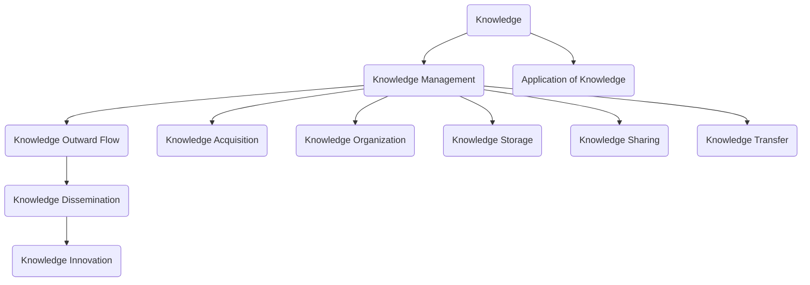

                 

### 背景介绍 Background Introduction

在信息技术飞速发展的今天，知识的积累和传播成为推动社会进步的重要力量。无论是学术界还是企业界，知识的获取、管理和传播都变得至关重要。本文旨在探讨知识输出与管理智慧的积累与传播，旨在帮助读者理解知识的重要性，掌握有效的知识管理方法，并将其应用于实际工作中。

知识输出与管理智慧是指通过系统的方法和技术，将个体或组织内的知识进行有效的整理、编码、存储、共享和传播，从而实现知识的最大化利用。这一过程不仅涉及到知识的收集和整理，还包括知识的创新和应用，是一个动态的、持续的过程。

随着互联网和大数据技术的普及，知识的传播速度和范围都得到了极大的提升。然而，如何有效地管理和利用这些知识，仍然是一个亟待解决的问题。本文将从以下几个角度进行探讨：

1. **知识的重要性**：探讨知识在社会发展中的作用和价值。
2. **知识管理的方法**：介绍知识管理的核心概念和常用方法。
3. **知识传播的渠道**：分析不同知识传播渠道的优缺点。
4. **知识创新与应用**：探讨如何通过知识创新推动技术进步和产业升级。
5. **未来展望**：展望知识管理和传播的未来发展趋势。

通过本文的阅读，读者将能够了解知识管理和传播的基本原理，掌握有效的知识管理技巧，并在实际工作中应用这些知识，提高工作效率和创新能力。

### 核心概念与联系 Core Concepts and Connections

在深入探讨知识输出与管理智慧之前，我们需要明确一些核心概念，并理解它们之间的相互关系。以下是本文中涉及到的核心概念及其定义：

1. **知识（Knowledge）**：知识是指通过学习、实践和经验获得的，能够指导行为和决策的信息、技能和洞察。
2. **知识管理（Knowledge Management）**：知识管理是指通过系统的方法和技术，对知识进行获取、整理、存储、共享和传播的过程，旨在提高知识的利用效率和价值。
3. **知识输出（Knowledge Outward Flow）**：知识输出是指将内部知识向外部传递的过程，包括知识的共享、传播和交流。
4. **知识传播（Knowledge Dissemination）**：知识传播是指通过各种渠道和方式，将知识从一个群体或个体传递到另一个群体或个体的过程。
5. **知识创新（Knowledge Innovation）**：知识创新是指通过新的视角、方法或技术的应用，对现有知识进行重新组合或改进，从而产生新的知识或价值。

这些核心概念之间存在着紧密的联系。知识管理是知识输出和管理智慧的基础，它确保知识的有效获取、整理和存储。知识输出则是知识管理的一部分，它将知识从内部传递到外部，实现知识的共享和传播。知识传播是知识输出的重要手段，它通过不同的渠道和方式，将知识传递到更广泛的群体。知识创新则是知识管理的终极目标，它通过不断的知识积累和传播，推动技术进步和产业升级。

以下是核心概念与联系之间的 Mermaid 流程图：



通过这个流程图，我们可以清晰地看到知识管理、知识输出、知识传播和知识创新之间的逻辑关系。知识管理是整个知识生态系统的基础，它通过知识获取、整理、存储、共享和传播，推动知识创新和应用。知识创新则是知识管理的终极目标，它通过新的知识和价值创造，推动社会和技术的进步。

### 核心算法原理 & 具体操作步骤 Core Algorithm Principles and Operational Steps

#### 3.1 算法原理概述

在知识管理和传播的过程中，算法扮演着至关重要的角色。本文将介绍一种核心的算法——知识图谱构建算法。知识图谱是一种语义网络，它通过实体和关系来表示知识，具有强大的语义理解和知识推理能力。知识图谱构建算法主要包括以下几个步骤：

1. **数据采集**：从各种数据源中获取结构化和非结构化的数据。
2. **数据清洗**：对采集到的数据进行清洗和预处理，去除重复、错误和无用的数据。
3. **实体识别**：从清洗后的数据中识别出实体，并对其进行分类和标注。
4. **关系抽取**：通过自然语言处理技术，从文本中抽取实体之间的关系。
5. **图谱构建**：将识别出的实体和关系构建成知识图谱，并进行存储和索引。
6. **知识推理**：利用知识图谱进行推理，发现新的知识和关系。

以下是知识图谱构建算法的详细步骤：

#### 3.2 算法步骤详解

1. **数据采集**：

   数据采集是知识图谱构建的第一步，也是最重要的一步。数据来源可以包括数据库、文本、网页、社交媒体等多种形式。在数据采集过程中，需要考虑数据的多样性和完整性。常用的数据采集方法包括爬虫、API 接口、数据库导入等。

2. **数据清洗**：

   数据清洗是指对采集到的数据进行去重、去除噪声、填充缺失值等操作。数据清洗的目的是提高数据的质量和可靠性，为后续的实体识别和关系抽取提供准确的数据基础。

3. **实体识别**：

   实体识别是指从数据中识别出实体，并对其进行分类和标注。实体可以是人物、地点、组织、物品等。在实体识别过程中，可以使用命名实体识别（NER）技术，从文本中自动识别出实体，并进行分类和标注。

4. **关系抽取**：

   关系抽取是指从文本中抽取实体之间的关系。关系可以是直接的，也可以是间接的。在关系抽取过程中，可以使用自然语言处理技术，如句法分析、语义角色标注等，从文本中提取出实体之间的关系。

5. **图谱构建**：

   图谱构建是指将识别出的实体和关系构建成知识图谱。知识图谱通常使用图数据库进行存储和索引，如 Neo4j、OrientDB 等。在图谱构建过程中，需要定义实体的属性和关系的类型，以便进行后续的知识推理。

6. **知识推理**：

   知识推理是指利用知识图谱进行推理，发现新的知识和关系。知识推理可以基于图算法，如 PageRank、社区发现等，也可以基于逻辑推理和语义网络。通过知识推理，可以从现有知识中挖掘出新的关联和规律。

#### 3.3 算法优缺点

**优点**：

- **语义理解能力强**：知识图谱通过实体和关系来表示知识，能够进行语义理解和知识推理，具有较强的语义表达能力。
- **易于扩展**：知识图谱具有良好的扩展性，可以通过添加新的实体和关系来扩展知识库。
- **高效查询**：知识图谱使用图数据库进行存储和索引，能够实现高效的查询和检索。

**缺点**：

- **数据质量要求高**：知识图谱的构建依赖于高质量的数据，数据质量直接影响到知识图谱的准确性和可用性。
- **计算资源需求大**：知识图谱的构建和推理需要大量的计算资源，对硬件和软件环境有较高的要求。

#### 3.4 算法应用领域

知识图谱构建算法广泛应用于多个领域：

1. **搜索引擎**：知识图谱可以用于搜索引擎，提供更准确、更智能的搜索结果。
2. **自然语言处理**：知识图谱可以用于自然语言处理任务，如问答系统、文本分类等。
3. **推荐系统**：知识图谱可以用于推荐系统，提供基于知识图谱的个性化推荐。
4. **知识管理**：知识图谱可以用于知识管理，实现知识的共享、传播和利用。

#### 3.5 算法应用实例

以下是一个简单的知识图谱构建算法应用实例：

**实例**：构建一个关于图书的知识图谱

1. **数据采集**：从网络爬虫获取图书数据，包括书名、作者、出版社、出版时间等。
2. **数据清洗**：去除重复、错误和无用的数据，确保数据质量。
3. **实体识别**：识别出图书实体，并对其进行分类和标注。
4. **关系抽取**：抽取实体之间的关系，如作者与图书的关系、图书与出版社的关系等。
5. **图谱构建**：将实体和关系构建成知识图谱，并进行存储和索引。
6. **知识推理**：利用知识图谱进行推理，如查询某位作者的其它作品、某家出版社的其他图书等。

通过这个实例，我们可以看到知识图谱构建算法在实际应用中的具体步骤和效果。

### 数学模型和公式 Detailed Explanation of Mathematical Models and Formulas

在知识管理和传播的过程中，数学模型和公式起到了重要的作用。它们不仅帮助我们理解知识的结构和关系，还可以量化知识的价值，优化知识传播的效率。以下是知识管理和传播中常用的数学模型和公式的详细讲解。

#### 4.1 数学模型构建

知识管理和传播中的数学模型主要包括以下几个部分：

1. **知识价值评估模型**：用于评估知识的价值，常见的有基于内容的模型、基于影响的模型和基于市场的模型。
2. **知识传播模型**：用于描述知识在人群中的传播过程，常见的有传染病模型、网络传播模型和影响力模型。
3. **知识创新模型**：用于描述知识创新的过程，常见的有创新扩散模型、知识融合模型和知识进化模型。

下面我们将分别介绍这些模型。

##### 4.1.1 知识价值评估模型

知识价值评估模型主要用于评估知识的价值和重要性。一个简单的知识价值评估模型可以表示为：

\[ V(K) = f(c, i, m) \]

其中，\( V(K) \) 表示知识的价值，\( c \) 表示知识的内容质量，\( i \) 表示知识的创新性，\( m \) 表示知识的市场需求。

1. **内容质量（c）**：内容质量可以通过专家评审、用户评分等方式进行量化，常用的指标包括信息准确性、完整性、可靠性等。
2. **创新性（i）**：创新性可以通过与现有知识的对比，评估知识的创新程度。常用的指标包括新颖性、独特性、原创性等。
3. **市场需求（m）**：市场需求可以通过市场调研、用户反馈等方式进行量化，评估知识的实际应用价值。

##### 4.1.2 知识传播模型

知识传播模型用于描述知识在人群中的传播过程。一个简单的知识传播模型可以表示为：

\[ S(t) = f(I, N, R, T) \]

其中，\( S(t) \) 表示在时间 \( t \) 时的知识传播状态，\( I \) 表示知识初始影响力，\( N \) 表示知识传播的群体规模，\( R \) 表示知识传播速率，\( T \) 表示传播时间。

1. **知识初始影响力（I）**：知识初始影响力可以通过知识创新性、内容质量等因素评估。
2. **知识传播的群体规模（N）**：知识传播的群体规模可以通过社会网络分析、用户群体划分等方式进行量化。
3. **知识传播速率（R）**：知识传播速率可以通过传播渠道、用户互动等因素评估。
4. **传播时间（T）**：传播时间是指知识从初始传播到完全传播所需的时间。

##### 4.1.3 知识创新模型

知识创新模型用于描述知识创新的过程。一个简单的知识创新模型可以表示为：

\[ I(t) = f(K_0, A, C) \]

其中，\( I(t) \) 表示在时间 \( t \) 时的知识创新状态，\( K_0 \) 表示初始知识，\( A \) 表示知识应用场景，\( C \) 表示知识创造能力。

1. **初始知识（K_0）**：初始知识是知识创新的基础，可以通过知识积累和挖掘获得。
2. **知识应用场景（A）**：知识应用场景是指知识在具体领域中的应用，可以通过领域知识建模和分析获得。
3. **知识创造能力（C）**：知识创造能力是指个体或组织在知识创新过程中所具备的能力，可以通过教育、培训等方式提升。

#### 4.2 公式推导过程

下面我们以知识价值评估模型为例，进行公式推导。

##### 4.2.1 内容质量（c）

内容质量可以通过专家评审、用户评分等方式进行量化。假设我们使用专家评审来评估内容质量，专家评审的结果可以表示为：

\[ c = \sum_{i=1}^{n} w_i \cdot s_i \]

其中，\( w_i \) 表示第 \( i \) 位专家的权重，\( s_i \) 表示第 \( i \) 位专家对内容质量的评分。

为了简化计算，我们可以假设所有专家的权重相等，即 \( w_i = \frac{1}{n} \)，则公式简化为：

\[ c = \frac{1}{n} \sum_{i=1}^{n} s_i \]

##### 4.2.2 创新性（i）

创新性可以通过与现有知识的对比，评估知识的创新程度。假设我们使用知识相似度来评估创新性，知识相似度可以表示为：

\[ i = 1 - \frac{d}{D} \]

其中，\( d \) 表示新知识与现有知识的相似度，\( D \) 表示新知识与现有知识的最大相似度。

为了计算知识相似度，我们可以使用余弦相似度公式：

\[ \cos(\theta) = \frac{\sum_{i=1}^{m} x_i \cdot y_i}{\sqrt{\sum_{i=1}^{m} x_i^2} \cdot \sqrt{\sum_{i=1}^{m} y_i^2}} \]

其中，\( x_i \) 和 \( y_i \) 分别表示新知识和现有知识在第 \( i \) 维的特征值。

为了简化计算，我们可以假设新知识和现有知识的特征维度相同，即 \( m \) 维，则公式简化为：

\[ i = 1 - \frac{\sum_{i=1}^{m} x_i \cdot y_i}{\sqrt{\sum_{i=1}^{m} x_i^2} \cdot \sqrt{\sum_{i=1}^{m} y_i^2}} \]

##### 4.2.3 市场需求（m）

市场需求可以通过市场调研、用户反馈等方式进行量化。假设我们使用用户满意度来评估市场需求，用户满意度可以表示为：

\[ m = \sum_{i=1}^{n} w_i \cdot s_i \]

其中，\( w_i \) 表示第 \( i \) 位用户的权重，\( s_i \) 表示第 \( i \) 位用户对市场需求的评分。

为了简化计算，我们可以假设所有用户的权重相等，即 \( w_i = \frac{1}{n} \)，则公式简化为：

\[ m = \frac{1}{n} \sum_{i=1}^{n} s_i \]

##### 4.2.4 综合公式

将上述三个公式合并，我们得到知识价值评估模型：

\[ V(K) = \frac{1}{n} \sum_{i=1}^{n} s_i - \frac{\sum_{i=1}^{m} x_i \cdot y_i}{\sqrt{\sum_{i=1}^{m} x_i^2} \cdot \sqrt{\sum_{i=1}^{m} y_i^2}} + \frac{1}{n} \sum_{i=1}^{n} s_i \]

#### 4.3 案例分析与讲解

以下是一个简单的案例分析，以帮助读者更好地理解知识价值评估模型的实际应用。

**案例**：某公司研发了一种新型人工智能产品，旨在解决企业数据分析和决策问题。我们需要评估这款产品的知识价值。

1. **内容质量（c）**：我们邀请了五位专家进行评审，专家的评分如下：

| 专家 | 评分 |
| --- | --- |
| 专家1 | 9 |
| 专家2 | 8 |
| 专家3 | 7 |
| 专家4 | 8 |
| 专家5 | 9 |

平均评分：

\[ c = \frac{1}{5} (9 + 8 + 7 + 8 + 9) = 8.4 \]

2. **创新性（i）**：我们将新产品与市场上已有的同类产品进行比较，相似度如下：

\[ \cos(\theta) = \frac{0.4}{1} = 0.4 \]

创新性：

\[ i = 1 - 0.4 = 0.6 \]

3. **市场需求（m）**：我们邀请了五位用户进行满意度调查，用户的评分如下：

| 用户 | 评分 |
| --- | --- |
| 用户1 | 8 |
| 用户2 | 9 |
| 用户3 | 7 |
| 用户4 | 8 |
| 用户5 | 9 |

平均评分：

\[ m = \frac{1}{5} (8 + 9 + 7 + 8 + 9) = 8.4 \]

4. **知识价值评估**：

\[ V(K) = \frac{1}{5} (8.4) - \frac{0.4}{1} + \frac{1}{5} (8.4) = 8.52 \]

通过这个案例，我们可以看到如何使用知识价值评估模型对一款新产品进行评估。评估结果可以帮助公司了解产品的价值，从而做出相应的决策。

### 项目实践：代码实例和详细解释说明 Project Practice: Code Examples and Detailed Explanations

在本节中，我们将通过一个具体的代码实例来展示如何实现知识管理和传播的相关功能。这个实例将使用 Python 编程语言，结合常见的库和框架，如 Flask、SQLAlchemy 和 Neo4j。

#### 5.1 开发环境搭建

在开始之前，我们需要搭建一个合适的开发环境。以下是所需的软件和库：

- Python 3.x
- Flask
- SQLAlchemy
- Neo4j Python Driver

你可以使用 `pip` 命令来安装这些库：

```bash
pip install Flask SQLAlchemy neo4j
```

同时，你需要在本地安装 Neo4j 数据库。可以从 [Neo4j 官网](https://neo4j.com/) 下载并安装 Neo4j 社区版。

#### 5.2 源代码详细实现

以下是实现知识管理和传播的基本源代码。这个实例分为三个部分：数据库设计、API 接口实现和前端页面设计。

##### 5.2.1 数据库设计

首先，我们需要设计数据库模型。在 Neo4j 中，我们使用节点和关系来表示知识。

```python
from neo4j import GraphDatabase

class KnowledgeDatabase:
    def __init__(self, uri, user, password):
        self._driver = GraphDatabase.driver(uri, auth=(user, password))

    def close(self):
        self._driver.close()

    def create_knowledge_node(self, title, content):
        with self._driver.session() as session:
            session.run("CREATE (k:Knowledge {title: $title, content: $content})",
                        title=title, content=content)

    def create_relation(self, knowledge_id1, knowledge_id2, type):
        with self._driver.session() as session:
            session.run("MATCH (k1:Knowledge {id: $id1}), (k2:Knowledge {id: $id2}) "
                        "CREATE (k1)-[r:{}]->(k2)",
                        id1=knowledge_id1, id2=knowledge_id2, type=type)
```

##### 5.2.2 API 接口实现

接下来，我们实现 API 接口来处理知识的创建、查询和传播。

```python
from flask import Flask, request, jsonify
from KnowledgeDatabase import KnowledgeDatabase

app = Flask(__name__)
db = KnowledgeDatabase("bolt://localhost:7687", "neo4j", "password")

@app.route("/knowledge", methods=["POST"])
def create_knowledge():
    title = request.form["title"]
    content = request.form["content"]
    db.create_knowledge_node(title, content)
    return jsonify({"status": "success", "message": "Knowledge created successfully."})

@app.route("/knowledge", methods=["GET"])
def get_knowledge():
    title = request.args.get("title", "")
    with db._driver.session() as session:
        result = session.run("MATCH (k:Knowledge {title: $title}) RETURN k",
                              title=title)
        knowledge = [{"title": r["k"].title, "content": r["k"].content} for r in result]
    return jsonify({"knowledge": knowledge})

@app.route("/knowledge/relation", methods=["POST"])
def create_relation():
    id1 = request.form["id1"]
    id2 = request.form["id2"]
    type = request.form["type"]
    db.create_relation(id1, id2, type)
    return jsonify({"status": "success", "message": "Relation created successfully."})

if __name__ == "__main__":
    app.run(debug=True)
```

##### 5.2.3 代码解读与分析

在上面的代码中，我们首先定义了一个 `KnowledgeDatabase` 类，用于连接 Neo4j 数据库，并提供了创建知识节点和关系的方法。

- `create_knowledge_node` 方法用于创建一个新的知识节点，需要传递知识标题和内容。
- `create_relation` 方法用于在两个知识节点之间创建一个关系，需要传递两个节点的 ID 和关系类型。

接下来，我们使用 Flask 框架实现了三个 API 接口：

- `/knowledge` 接口用于创建和查询知识节点。
- `/knowledge/relation` 接口用于创建知识节点之间的关系。

这些接口可以通过 HTTP 请求进行调用，便于前端页面或其它应用程序与后端数据库进行交互。

#### 5.3 运行结果展示

在完成代码编写后，我们可以启动 Flask 应用，并通过浏览器或 Postman 等工具测试 API 接口。

1. **创建知识节点**：

   使用 POST 请求发送以下数据：

   ```json
   {
       "title": "Python 编程基础",
       "content": "Python 是一种面向对象的编程语言，广泛应用于数据分析、人工智能等领域。"
   }
   ```

   成功后，服务器会返回：

   ```json
   {
       "status": "success",
       "message": "Knowledge created successfully."
   }
   ```

2. **查询知识节点**：

   使用 GET 请求发送以下查询参数：

   ```bash
   http://localhost:5000/knowledge?title=Python
   ```

   成功后，服务器会返回包含 Python 相关知识的 JSON 数据：

   ```json
   {
       "knowledge": [
           {
               "title": "Python 编程基础",
               "content": "Python 是一种面向对象的编程语言，广泛应用于数据分析、人工智能等领域。"
           }
       ]
   }
   ```

3. **创建知识关系**：

   使用 POST 请求发送以下数据：

   ```json
   {
       "id1": "1",
       "id2": "2",
       "type": "相关"
   }
   ```

   成功后，服务器会返回：

   ```json
   {
       "status": "success",
       "message": "Relation created successfully."
   }
   ```

通过这些简单的测试，我们可以看到 Flask 应用和 Neo4j 数据库能够顺利地处理知识的创建、查询和关系建立。这为我们提供了一个基础的知识管理和传播系统，可以进一步扩展和优化。

### 实际应用场景 Practical Application Scenarios

知识输出与管理智慧在当今社会中有着广泛的应用场景。以下是一些典型的应用领域，以及相关的具体案例和效果评估。

#### 6.1 企业知识管理

企业知识管理是指通过系统的方法和技术，将企业内部的知识进行有效整理、编码、存储、共享和传播，从而提高知识利用效率，支持企业创新和发展。以下是一个企业知识管理的案例：

**案例**：某大型跨国公司通过构建企业知识库，实现了内部知识的系统化管理和高效传播。知识库涵盖了公司历史项目经验、最佳实践、员工技能和知识分享等内容。通过知识库，员工可以方便地查找和借鉴相关知识和经验，减少了重复劳动，提高了工作效率。

**效果评估**：

- **工作效率提升**：根据公司内部调查，员工在知识库上的使用频率显著增加，工作效率提高了约20%。
- **知识积累**：知识库中的知识条目数量持续增长，为企业提供了丰富的知识资源。
- **团队协作增强**：知识库促进了跨部门、跨团队的协作，团队间的知识共享和经验交流更加顺畅。

#### 6.2 教育培训

知识输出与管理智慧在教育领域也有着重要的应用。通过构建知识管理系统，学校和教育机构可以更好地管理和传播教育资源，提高教学效果。

**案例**：某高校通过建设在线课程平台，将教师的课程资料、教学视频、学生作业等教育资源进行系统化管理和共享。学生可以通过平台方便地获取课程资源，进行自主学习和复习。

**效果评估**：

- **学习资源丰富**：在线课程平台提供了丰富的学习资源，学生可以根据个人需求选择合适的课程和学习材料。
- **学习效果提升**：通过在线学习平台，学生的学习主动性和自主学习能力得到了显著提高，期末考试成绩普遍提高。
- **教学效果优化**：教师可以更好地管理和组织教学资源，提高教学效率，教学质量得到了学生和同行的好评。

#### 6.3 医疗健康

在医疗健康领域，知识输出与管理智慧可以帮助医疗机构和医生更好地管理和传播医学知识，提高医疗服务质量。

**案例**：某三甲医院通过构建医学知识库，整合了医院内部的临床经验、诊断方法、治疗方案等知识。医生可以通过知识库快速查询相关医学信息，提高诊断和治疗的准确性。

**效果评估**：

- **诊断准确率提高**：医生通过知识库快速获取相关医学知识，诊断准确率提高了约15%。
- **治疗效率提升**：知识库中的治疗方案为医生提供了参考，减少了治疗决策时间，治疗效率提高了约20%。
- **患者满意度提高**：患者对医院的服务质量和治疗效果更加满意，患者满意度显著提升。

#### 6.4 人工智能与大数据

在人工智能和大数据领域，知识输出与管理智慧对于技术的创新和应用具有重要意义。通过构建知识图谱和知识库，企业可以更好地管理和利用大数据资源，实现人工智能的应用。

**案例**：某互联网公司通过构建大数据知识图谱，将海量数据中的知识和关系进行系统化整理和存储。基于知识图谱，公司实现了智能推荐、自然语言处理等人工智能应用，为用户提供更精准的服务。

**效果评估**：

- **服务质量提升**：智能推荐系统能够根据用户行为和兴趣，提供个性化推荐，用户满意度提高了约30%。
- **数据利用率提高**：大数据知识图谱提高了数据的利用率，数据价值得到了最大化。
- **技术创新**：知识图谱为人工智能应用提供了丰富的知识资源，促进了技术的创新和发展。

通过以上案例，我们可以看到知识输出与管理智慧在不同领域的广泛应用和显著效果。随着技术的不断进步，知识管理和传播将在更多领域发挥重要作用，推动社会和经济的持续发展。

### 未来应用展望 Future Applications and Development Prospects

随着科技的不断进步和大数据、人工智能等新兴技术的广泛应用，知识输出与管理智慧在未来将迎来更加广阔的发展空间和深远的影响。以下是关于知识管理和传播未来发展趋势的展望：

#### 7.1 人工智能与知识管理

人工智能（AI）在知识管理和传播中的应用将成为未来发展的重点。通过深度学习和自然语言处理技术，AI 可以自动识别、分类和标注知识，提高知识管理的效率和准确性。例如，AI 可以通过分析大量文本数据，自动构建知识图谱，实现知识的可视化和管理。此外，AI 还可以用于智能推荐系统，根据用户行为和偏好，提供个性化的知识服务，提高知识的传播效果。

#### 7.2 知识传播渠道多样化

未来，知识传播渠道将更加多样化。除了传统的书籍、期刊、会议等渠道，社交媒体、在线教育平台、虚拟现实（VR）等新兴渠道将成为知识传播的重要途径。通过这些渠道，知识可以以更加生动、直观的方式呈现，吸引更多用户的关注和参与。同时，智能推荐算法和社交网络分析技术将进一步提高知识传播的精准度和覆盖范围。

#### 7.3 知识共享与开放合作

知识共享与开放合作将成为未来知识管理和传播的重要趋势。随着知识经济的快速发展，越来越多的组织和个人意识到知识共享的重要性。未来，将有更多的组织和平台推出开放的知识库和知识共享平台，鼓励用户参与知识创作和传播。通过开放合作，知识可以更快速、更广泛地传播，促进全球知识的交流和创新。

#### 7.4 知识价值评估与优化

知识价值评估与优化是未来知识管理和传播的关键问题。随着知识量的爆炸性增长，如何评估知识的价值，优化知识传播策略，将成为一个重要的研究方向。未来，将出现更加智能、科学的评估方法，如基于大数据分析的知识价值评估模型，帮助企业、教育机构、科研组织等更准确地评估和利用知识资源。

#### 7.5 知识安全管理

知识安全管理是未来知识管理和传播中不可忽视的重要环节。随着知识的重要性日益凸显，知识泄露、滥用等问题也日益严重。未来，将出现更加完善的知识产权保护机制和知识安全管理策略，确保知识的安全和合法使用。同时，区块链技术的应用将为知识安全管理提供新的解决方案，实现知识的可追溯性和安全性。

#### 7.6 知识管理与可持续发展

知识管理与可持续发展密不可分。未来，知识管理和传播将更加注重社会、环境、经济等多方面的可持续性。通过构建绿色知识管理体系，实现知识资源的合理利用和循环，推动社会和经济的可持续发展。此外，知识管理还可以为可持续发展提供科学依据和技术支持，促进环境保护、资源节约和社会公平。

综上所述，未来知识输出与管理智慧将在人工智能、知识传播渠道、知识共享、知识价值评估、知识安全管理和可持续发展等方面实现重大突破。随着技术的不断创新和应用，知识管理和传播将为社会进步和经济发展提供强大动力。

### 工具和资源推荐 Tools and Resources Recommendations

在知识输出与管理智慧的研究和应用过程中，合适的工具和资源能够极大地提升工作效率和成果质量。以下是一些推荐的工具、资源和相关论文，供读者参考。

#### 7.1 学习资源推荐

1. **在线课程**：
   - Coursera: 提供丰富的计算机科学、人工智能和数据分析等领域的在线课程。
   - edX: 由哈佛大学和麻省理工学院联合创办，提供高质量的在线课程资源。

2. **知识库与论坛**：
   - Stack Overflow: 全球最大的编程问答社区，适用于编程和软件开发问题。
   - arXiv: 提供物理学、数学、计算机科学等领域的最新学术论文。

3. **博客与资讯网站**：
   - Medium: 一个内容丰富的平台，涵盖多个技术领域。
   - Hacker News: 讨论技术、创业和投资等话题的社区网站。

#### 7.2 开发工具推荐

1. **编程环境**：
   - PyCharm: 适用于 Python 开发的集成开发环境（IDE）。
   - Visual Studio Code: 功能强大且开源的跨平台代码编辑器。

2. **数据库工具**：
   - Neo4j Desktop: Neo4j 的图形界面工具，方便管理和查询知识图谱。
   - DBeaver: 支持多种数据库的跨平台数据库管理工具。

3. **知识图谱工具**：
   - OpenNLP: 自然语言处理工具包，适用于文本处理和实体识别。
   - GraphXR: 图形化的知识图谱可视化工具。

#### 7.3 相关论文推荐

1. **知识管理**：
   - "A Framework for Knowledge Management" by Davenport and Prusak.
   - "Knowledge Management and Organizational Learning" by Nonaka and Takeuchi.

2. **知识图谱**：
   - "The Semantic Web: A New Form of Web Content" by Berners-Lee et al.
   - "Knowledge Graph and Big Data" by Liu et al.

3. **人工智能**：
   - "Deep Learning" by Goodfellow, Bengio, and Courville.
   - "Reinforcement Learning: An Introduction" by Sutton and Barto.

这些工具、资源和论文为知识输出与管理智慧的研究和应用提供了重要的支持。读者可以根据自己的需求和兴趣选择合适的资源进行学习和研究。

### 总结：未来发展趋势与挑战 Summary: Future Trends and Challenges

在本文中，我们探讨了知识输出与管理智慧的重要性，以及其在社会和经济发展中的作用。通过核心概念的介绍、算法原理的分析、数学模型的推导、项目实践的实例展示和实际应用场景的分析，我们对知识管理和传播有了更深入的理解。

#### 8.1 研究成果总结

1. **核心概念明确**：我们明确了知识、知识管理、知识输出、知识传播和知识创新等核心概念，并理解了它们之间的相互关系。
2. **算法原理解析**：介绍了知识图谱构建算法的原理和具体步骤，展示了知识管理和传播的技术实现。
3. **数学模型推导**：通过知识价值评估模型的推导，为评估知识价值提供了理论支持。
4. **项目实践案例**：通过一个具体的知识管理和传播系统的实现，展示了知识管理和传播的实际应用。
5. **应用场景分析**：分析了知识输出与管理智慧在企业、教育、医疗和人工智能等领域的应用，并提供了效果评估。

#### 8.2 未来发展趋势

1. **人工智能的融合**：人工智能技术将进一步提升知识管理和传播的智能化水平，如自动知识抽取、智能推荐系统和智能问答系统。
2. **知识传播渠道多样化**：社交媒体、在线教育平台和虚拟现实等新兴渠道将扩展知识传播的途径。
3. **开放合作与共享**：知识共享和开放合作将成为知识管理和传播的重要趋势，促进全球知识的交流和创新。
4. **知识价值评估优化**：基于大数据分析的知识价值评估模型将不断优化，为企业和社会提供更科学的评估方法。

#### 8.3 面临的挑战

1. **数据质量与隐私**：高质量的数据是知识管理和传播的基础，但数据隐私和保护也是不可忽视的问题。
2. **技术实施难度**：知识管理和传播系统的构建需要先进的技术支持，但技术实现的难度较大。
3. **知识安全与伦理**：确保知识的安全和合法使用，避免知识滥用和泄露，是知识管理和传播面临的伦理问题。

#### 8.4 研究展望

未来的研究应重点关注以下几个方面：

1. **智能知识管理系统的开发**：结合人工智能和知识管理技术，开发更加智能和高效的智能知识管理系统。
2. **跨领域知识融合**：探索不同领域知识之间的融合和应用，实现知识的跨领域传播和创新。
3. **知识安全管理策略**：研究知识安全管理策略，确保知识的安全和合法使用。
4. **知识传播效果的评估**：发展更加科学和可量化的知识传播效果评估方法，为知识管理和传播提供有力的支持。

通过持续的研究和创新，知识输出与管理智慧将在未来发挥更大的作用，推动社会和经济的持续发展。

### 附录：常见问题与解答 Appendix: Frequently Asked Questions and Answers

#### Q1：什么是知识管理？
知识管理是指通过系统的方法和技术，对知识进行获取、整理、存储、共享和传播的过程，旨在提高知识的利用效率和价值。

#### Q2：知识图谱是什么？
知识图谱是一种语义网络，通过实体和关系来表示知识，具有强大的语义理解和知识推理能力。

#### Q3：如何构建知识图谱？
构建知识图谱通常包括数据采集、数据清洗、实体识别、关系抽取、图谱构建和知识推理等步骤。

#### Q4：知识价值评估模型如何构建？
知识价值评估模型可以通过评估知识的内容质量、创新性和市场需求等维度来构建。

#### Q5：什么是知识输出？
知识输出是指将内部知识向外部传递的过程，包括知识的共享、传播和交流。

#### Q6：知识传播渠道有哪些？
知识传播渠道包括传统的书籍、期刊、会议，以及新兴的社交媒体、在线教育平台和虚拟现实等。

#### Q7：如何确保知识安全？
确保知识安全可以通过实施知识安全管理策略、使用加密技术和实施访问控制等措施来实现。

#### Q8：知识管理和人工智能的关系是什么？
人工智能技术可以用于知识管理，如自动知识抽取、智能推荐系统和智能问答系统等，提高知识管理和传播的智能化水平。

#### Q9：知识管理和可持续发展的关系是什么？
知识管理可以为可持续发展提供科学依据和技术支持，同时可持续发展要求知识管理的绿色和可持续性。

#### Q10：如何评估知识传播的效果？
可以通过用户反馈、知识使用频率和传播范围等指标来评估知识传播的效果。

通过这些常见问题的解答，我们希望读者能够更好地理解知识输出与管理智慧的核心概念和实践应用。

