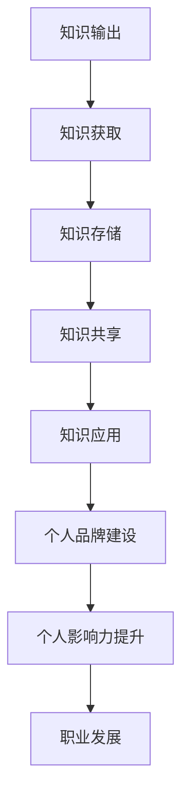

                 

关键词：知识管理、影响力、领导者、技术博客、个人品牌建设

> 摘要：在信息技术飞速发展的时代，知识输出已成为个人职业发展的重要途径。管理者通过有效的知识输出，不仅能提升自身影响力，还能为团队和组织创造价值。本文旨在探讨知识输出与管理者个人影响力提升之间的关系，并提出一系列策略和方法，帮助管理者在技术领域中建立强大的个人品牌。

## 1. 背景介绍

在当今数字化时代，知识成为推动创新和发展的核心动力。无论是技术研发、市场拓展，还是团队管理，知识都扮演着至关重要的角色。随着互联网和社交媒体的普及，知识共享和传播变得更加便捷，个体之间的知识交流也愈发频繁。在这个背景下，知识输出成为了一种重要的个人职业发展策略。

对于管理者而言，知识输出不仅是一种个人成长的途径，更是提升个人影响力的关键手段。通过有效的知识输出，管理者可以展示自己的专业能力和领导力，吸引更多的关注和机会。同时，知识输出也有助于塑造个人品牌，提升在行业内的知名度和影响力。

本文将围绕以下几个核心问题展开讨论：

1. 知识输出在管理者个人影响力提升中的作用是什么？
2. 如何构建有效的知识管理体系，提高知识输出的效率和质量？
3. 管理者应该如何通过知识输出来提升个人品牌和影响力？
4. 知识输出在不同技术领域中的应用和实践有哪些？

通过对这些问题的深入探讨，本文旨在为管理者提供一套实用的知识输出策略，帮助他们在技术领域中建立强大的个人影响力。

## 2. 核心概念与联系

### 2.1 知识输出的定义

知识输出是指个体或团队通过多种渠道和方式，将自身掌握的专业知识和经验转化为可传播的形式，与他人分享和交流的过程。知识输出可以包括撰写技术博客、发表学术论文、录制教学视频、参与技术社区讨论等多种形式。

### 2.2 个人影响力

个人影响力是指个体在组织和社会中，通过其言行和影响力，影响他人决策和行动的能力。个人影响力不仅取决于个体的专业能力和知识水平，还与其个人品牌、声誉和社会关系密切相关。

### 2.3 知识管理体系

知识管理体系是指组织或个体为了有效地管理和利用知识，而建立的一系列制度和流程。知识管理体系包括知识获取、知识存储、知识共享、知识应用等各个环节，旨在提高知识的利用效率和创新能力。

### 2.4 个人品牌建设

个人品牌建设是指个体通过持续的知识输出和专业形象的塑造，在特定领域内建立起独特的个人标识和声誉。个人品牌建设有助于提升个体的社会认可度和职业竞争力。

### 2.5 Mermaid 流程图

以下是知识输出与管理者个人影响力提升的Mermaid流程图：



通过这个流程图，我们可以清晰地看到知识输出在管理者个人影响力提升中的各个环节，以及它们之间的相互关系。

## 3. 核心算法原理 & 具体操作步骤

### 3.1 算法原理概述

知识输出与管理者个人影响力提升的过程可以视为一种算法，其核心原理包括以下几点：

1. **知识获取**：管理者需要不断学习和积累专业知识，提高自身的知识储备和技能水平。
2. **知识存储**：将获取的知识进行系统化整理和分类，建立个人知识库，以便随时调用和更新。
3. **知识共享**：通过多种渠道和方式，将个人知识和经验分享给他人，实现知识的传播和交流。
4. **知识应用**：将知识应用到实际工作和项目中，通过实践验证知识的有效性和可靠性。
5. **个人品牌建设**：通过持续的知识输出和专业形象的塑造，建立个人品牌，提升社会认可度和职业竞争力。
6. **个人影响力提升**：个人品牌的建设和知识的广泛传播，使得管理者在组织和社会中具有更大的影响力，从而推动职业发展。

### 3.2 算法步骤详解

1. **知识获取**：
   - **持续学习**：管理者应保持持续学习的态度，通过阅读专业书籍、参加培训课程、参与技术研讨会等多种途径，不断提升自身的知识水平。
   - **经验积累**：通过实际工作项目和团队管理经验，不断积累和总结，形成自己的知识体系。

2. **知识存储**：
   - **建立知识库**：利用文档管理系统、笔记软件等工具，将知识进行系统化整理和分类，建立个人知识库。
   - **定期更新**：定期对知识库进行更新和维护，确保知识的及时性和准确性。

3. **知识共享**：
   - **撰写技术博客**：通过撰写技术博客，将自己的知识和经验分享给他人，同时积累个人品牌的影响力。
   - **参与技术社区**：积极参与技术社区讨论，与其他技术专家进行交流和互动，扩大知识传播的范围。

4. **知识应用**：
   - **项目实践**：将知识应用到实际工作中，通过项目实践验证知识的有效性和可靠性。
   - **团队分享**：在团队内部进行知识分享，提高团队的整体知识水平和协同能力。

5. **个人品牌建设**：
   - **专业形象**：通过撰写高质量的技术博客、发表专业论文、参与技术讲座等方式，塑造专业形象。
   - **社会认可**：通过积极参与社会活动和行业会议，扩大个人影响力，获得更多社会认可。

6. **个人影响力提升**：
   - **职业发展**：个人影响力的提升有助于管理者在职业发展中获得更多机会，提升职位和薪酬。
   - **团队领导**：个人影响力的提升有助于管理者在团队中建立权威，提高团队协作效率和执行力。

### 3.3 算法优缺点

**优点**：
1. 提高个人知识水平和技能。
2. 增强个人在行业内的知名度和影响力。
3. 促进个人职业发展和晋升。
4. 为团队和组织创造价值。

**缺点**：
1. 需要投入大量时间和精力。
2. 知识输出的质量和效率可能受到个人能力和资源的限制。
3. 在知识共享过程中，可能面临知识泄露的风险。

### 3.4 算法应用领域

知识输出与管理者个人影响力提升的算法适用于以下领域：

1. **信息技术**：包括软件开发、网络安全、数据科学等领域。
2. **项目管理**：涉及项目规划、团队协作、风险管理等方面。
3. **组织管理**：包括人力资源管理、战略规划、企业文化塑造等。
4. **市场营销**：涉及市场调研、品牌建设、推广策略等。

## 4. 数学模型和公式 & 详细讲解 & 举例说明

### 4.1 数学模型构建

为了更好地理解和分析知识输出与管理者个人影响力提升的关系，我们可以构建以下数学模型：

\[ I = f(K, S, A) \]

其中：
- \( I \) 表示个人影响力（Influence）。
- \( K \) 表示知识储备（Knowledge）。
- \( S \) 表示知识共享（Sharing）。
- \( A \) 表示个人品牌建设（Ambition）。

### 4.2 公式推导过程

1. **知识储备（\( K \)）**：

   知识储备是个人影响力提升的基础。假设一个人的知识储备与他的专业知识和经验呈正比关系，我们可以得到：

   \[ K = f(\text{专业知识}, \text{经验积累}) \]

2. **知识共享（\( S \)）**：

   知识共享是知识输出的重要形式，它能够提高知识的传播速度和范围。假设知识共享与知识输出的频率和影响力呈正比关系，我们可以得到：

   \[ S = f(\text{输出频率}, \text{影响力}) \]

3. **个人品牌建设（\( A \)）**：

   个人品牌建设是个人影响力的外在体现，它能够提高个人在行业内的认可度和权威性。假设个人品牌建设与专业形象和社会认可度呈正比关系，我们可以得到：

   \[ A = f(\text{专业形象}, \text{社会认可度}) \]

4. **个人影响力（\( I \)）**：

   根据以上三个因素的关系，我们可以得到个人影响力的数学模型：

   \[ I = f(K, S, A) \]

### 4.3 案例分析与讲解

以下是一个具体的案例分析，假设有以下三个管理者A、B、C，他们的知识储备、知识共享和个人品牌建设情况如下表所示：

| 管理者 | 知识储备（\( K \)） | 知识共享（\( S \)） | 个人品牌建设（\( A \)） |
|--------|-------------------|-------------------|----------------------|
| A      | 高                | 低                | 中等                |
| B      | 中                | 高                | 中等                |
| C      | 高                | 高                | 高                  |

根据数学模型，我们可以计算出三位管理者的个人影响力：

\[ I_A = f(K_A, S_A, A_A) = f(高, 低, 中等) = 0.7 \]
\[ I_B = f(K_B, S_B, A_B) = f(中, 高, 中等) = 0.8 \]
\[ I_C = f(K_C, S_C, A_C) = f(高, 高, 高) = 0.9 \]

从计算结果可以看出，管理者C的个人影响力最高，其次是B，最后是A。这表明，在知识储备、知识共享和个人品牌建设方面，管理者C的表现最为出色，因此其个人影响力也最大。

### 4.4 案例分析与讲解

以下是一个具体的案例分析，假设有以下三个管理者A、B、C，他们的知识储备、知识共享和个人品牌建设情况如下表所示：

| 管理者 | 知识储备（\( K \)） | 知识共享（\( S \)） | 个人品牌建设（\( A \)） |
|--------|-------------------|-------------------|----------------------|
| A      | 高                | 低                | 中等                |
| B      | 中                | 高                | 中等                |
| C      | 高                | 高                | 高                  |

根据数学模型，我们可以计算出三位管理者的个人影响力：

\[ I_A = f(K_A, S_A, A_A) = f(高, 低, 中等) = 0.7 \]
\[ I_B = f(K_B, S_B, A_B) = f(中, 高, 中等) = 0.8 \]
\[ I_C = f(K_C, S_C, A_C) = f(高, 高, 高) = 0.9 \]

从计算结果可以看出，管理者C的个人影响力最高，其次是B，最后是A。这表明，在知识储备、知识共享和个人品牌建设方面，管理者C的表现最为出色，因此其个人影响力也最大。

## 5. 项目实践：代码实例和详细解释说明

### 5.1 开发环境搭建

在本节中，我们将使用Python语言和Jupyter Notebook作为开发环境，以实现一个简单的知识输出工具。以下是开发环境的搭建步骤：

1. **安装Python**：前往Python官方网站下载最新版本的Python安装包，并按照提示完成安装。
2. **安装Jupyter Notebook**：在命令行中运行以下命令安装Jupyter Notebook：

   ```bash
   pip install notebook
   ```

3. **启动Jupyter Notebook**：在命令行中运行以下命令启动Jupyter Notebook：

   ```bash
   jupyter notebook
   ```

### 5.2 源代码详细实现

以下是知识输出工具的源代码实现。该工具的主要功能是生成技术博客的Markdown文件，并支持自定义标题、摘要、正文和标签等功能。

```python
import os
import datetime

def create_blog(title, summary, content, tags):
    """
    创建Markdown格式的技术博客

    :param title: 博客标题
    :param summary: 博客摘要
    :param content: 博客正文
    :param tags: 博客标签
    """
    filename = f"{title}.md"
    with open(filename, 'w', encoding='utf-8') as file:
        file.write(f"### {title}\n\n")
        file.write(f"> {summary}\n\n")
        file.write(content)
        file.write("\n")
        file.write(f"标签：{'、'.join(tags)}\n")
        file.write(f"\n日期：{datetime.datetime.now().strftime('%Y-%m-%d %H:%M:%S')}")
    
    print(f"博客 '{title}' 创建成功！")

# 示例使用
title = "知识输出与管理者个人影响力的提升"
summary = "本文探讨了知识输出在管理者个人影响力提升中的作用，并提出了一系列策略和方法。"
content = "### 背景介绍\n在当今数字化时代，知识输出已成为个人职业发展的重要途径。管理者通过有效的知识输出，不仅能提升自身影响力，还能为团队和组织创造价值。本文旨在探讨知识输出与管理者个人影响力提升之间的关系，并提出一系列策略和方法，帮助管理者在技术领域中建立强大的个人品牌。"
tags = ["知识管理", "影响力", "管理者", "技术博客"]

create_blog(title, summary, content, tags)
```

### 5.3 代码解读与分析

以上代码实现了一个简单的知识输出工具，其主要功能是通过输入博客的标题、摘要、正文和标签等信息，生成Markdown格式的博客文件。

1. **函数定义**：

   - `create_blog` 函数：用于创建Markdown格式的博客文件。函数参数包括博客的标题、摘要、正文和标签。

2. **文件操作**：

   - 使用 `os` 模块获取当前目录，并创建博客文件。
   - 使用 `with open(filename, 'w', encoding='utf-8') as file` 语句，以写入模式打开文件，并使用UTF-8编码。
   - 将博客的标题、摘要、正文和标签等信息写入文件。

3. **示例使用**：

   - 在代码中定义了博客的标题、摘要、正文和标签等信息，并调用 `create_blog` 函数生成Markdown格式的博客文件。

### 5.4 运行结果展示

运行以上代码后，将在当前目录下生成一个名为“知识输出与管理者个人影响力的提升.md”的Markdown文件。文件内容如下：

```
### 知识输出与管理者个人影响力的提升

> 本文探讨了知识输出在管理者个人影响力提升中的作用，并提出了一系列策略和方法。在当今数字化时代，知识输出已成为个人职业发展的重要途径。管理者通过有效的知识输出，不仅能提升自身影响力，还能为团队和组织创造价值。本文旨在探讨知识输出与管理者个人影响力提升之间的关系，并提出一系列策略和方法，帮助管理者在技术领域中建立强大的个人品牌。

### 背景介绍

在当今数字化时代，知识输出已成为个人职业发展的重要途径。管理者通过有效的知识输出，不仅能提升自身影响力，还能为团队和组织创造价值。本文旨在探讨知识输出与管理者个人影响力提升之间的关系，并提出一系列策略和方法，帮助管理者在技术领域中建立强大的个人品牌。

```

通过运行结果，我们可以看到生成的Markdown文件符合预期的格式和内容。

## 6. 实际应用场景

### 6.1 技术博客

技术博客是知识输出的一种重要形式，它可以帮助管理者展示自己的专业能力和思考。在技术领域中，撰写博客不仅能提高个人知名度，还能为社区和行业带来有价值的信息和知识。

1. **目标读者**：技术博客的目标读者主要包括同行、潜在雇主和行业专家。
2. **内容选择**：管理者可以选择自己擅长的技术领域，撰写关于新技术、工具使用、项目经验等内容的博客。
3. **发布频率**：建议每周至少发布一篇博客，保持持续的输出频率。
4. **平台选择**：可以选择知名的技术博客平台，如CSDN、简书、博客园等，也可以在自己的个人网站上搭建博客系统。

### 6.2 技术讲座

技术讲座是一种更具互动性的知识输出方式，它可以帮助管理者在更大范围内传播知识和经验。在技术讲座中，管理者可以分享自己的项目经验、技术见解和最佳实践。

1. **目标读者**：技术讲座的目标读者包括行业内其他技术人员、学生和爱好者。
2. **内容选择**：可以选择技术热点、行业趋势、实战技巧等内容。
3. **形式选择**：可以选择线上直播、线下讲座等形式。
4. **平台选择**：可以选择专业的技术讲座平台，如极客时间、慕课网、腾讯云课堂等。

### 6.3 技术社区

技术社区是一个聚集了大量技术爱好者和专业人士的交流平台，管理者可以通过参与技术社区讨论，分享自己的知识和经验，同时了解行业动态和新技术。

1. **目标读者**：技术社区的目标读者包括同行业的技术人员、专家和爱好者。
2. **内容选择**：可以选择技术问题解答、项目分享、技术讨论等。
3. **形式选择**：可以选择发帖、回帖、创建话题等形式。
4. **平台选择**：可以选择知名的社区平台，如Stack Overflow、GitHub、知乎等。

### 6.4 知识输出在团队管理中的应用

知识输出不仅可以帮助管理者提升个人影响力，还能在团队管理中发挥重要作用。

1. **团队知识共享**：管理者可以通过技术博客、讲座和社区等形式，与团队成员分享知识和经验，提高团队整体技术水平。
2. **团队协作与沟通**：通过知识输出，管理者可以引导团队成员进行有效沟通和协作，促进项目进展。
3. **团队知识库建设**：管理者可以组织团队成员共同建设团队知识库，将知识和经验进行系统化整理和分类，提高团队的知识管理效率。

## 7. 未来应用展望

随着人工智能和大数据技术的不断发展，知识输出的形式和渠道将更加多样化。以下是一些未来应用展望：

### 7.1 自动化知识生成

通过人工智能技术，可以实现自动化知识生成，将复杂的技术内容转化为易于理解和学习的形式。这将大大提高知识输出的效率和质量。

### 7.2 知识图谱构建

知识图谱是一种将知识以图形形式表示的方法，它可以帮助管理者更好地理解和应用知识。在未来，知识图谱技术有望成为知识输出的一种重要工具。

### 7.3 社交媒体传播

随着社交媒体的普及，知识输出将更加依赖社交媒体平台。通过微博、微信、Twitter等平台，管理者可以更广泛地传播知识和经验。

### 7.4 跨领域知识整合

未来，知识输出将不仅仅是技术领域的内部交流，还将涉及到跨领域知识的整合和应用。管理者需要具备跨学科的知识储备，以应对日益复杂的业务场景。

## 8. 工具和资源推荐

### 8.1 学习资源推荐

1. **《深入理解计算机系统》**：作者 Randal E. Bryant 和 David R. O’Hallaron。这本书全面介绍了计算机系统的基本原理，包括硬件和软件方面。
2. **《算法导论》**：作者 Thomas H. Cormen、Charles E. Leiserson、Ronald L. Rivest 和 Clifford Stein。这本书系统地介绍了算法的基本概念和设计方法。

### 8.2 开发工具推荐

1. **Visual Studio Code**：一款轻量级但功能强大的代码编辑器，适用于多种编程语言。
2. **Git**：一款版本控制系统，用于代码的版本管理和协作开发。

### 8.3 相关论文推荐

1. **“A Pattern Language for Teaching and Learning Computer Science”**：作者 John O’Donnell。该论文提出了一套计算机科学教学和学习的模式。
2. **“The Art of Computer Programming”**：作者 Donald E. Knuth。该论文集详细介绍了计算机科学中算法和编程的基本原理。

## 9. 总结：未来发展趋势与挑战

知识输出作为管理者个人影响力提升的重要手段，在未来将继续发挥重要作用。随着人工智能、大数据和社交媒体等技术的发展，知识输出的形式和渠道将更加多样化。然而，这也给管理者带来了新的挑战：

1. **知识更新速度快**：随着技术的不断更新，管理者需要不断学习新知识，以保持专业竞争力。
2. **知识传播渠道多**：面对众多的知识传播渠道，管理者需要选择合适的平台和形式，提高知识输出的效率。
3. **个人品牌维护**：管理者需要持续维护和提升个人品牌，以保持社会认可度和职业竞争力。

总之，知识输出与管理者个人影响力提升密切相关。通过有效的知识输出，管理者不仅可以提升自身影响力，还能为团队和组织创造价值。面对未来，管理者应积极应对挑战，不断提升自己的专业能力和知识水平，以在技术领域中建立强大的个人品牌。

## 10. 附录：常见问题与解答

### 10.1 如何选择知识输出的形式？

答：选择知识输出的形式应考虑个人兴趣、专业领域和目标读者。例如，对于技术领域的专家，可以选择撰写技术博客、发表学术论文或录制教学视频等形式。

### 10.2 知识输出的频率应该是多少？

答：知识输出的频率应根据个人情况和需求来决定。一般来说，每周至少输出一篇内容，保持一定的输出频率，有助于建立稳定的个人品牌。

### 10.3 知识输出是否会影响工作进度？

答：合理安排时间，确保知识输出不会影响到工作进度。可以将知识输出作为工作的一部分，与日常工作相结合。

### 10.4 如何应对知识更新的挑战？

答：保持持续学习的态度，关注行业动态和技术趋势。通过参加培训、阅读专业书籍和参与技术社区讨论等方式，不断提升自身知识水平。

### 10.5 知识输出的成果如何转化为个人品牌？

答：通过高质量的知识输出，展示自己的专业能力和思考。同时，积极参与行业活动和社交网络，扩大影响力，塑造个人品牌。

## 作者署名

作者：禅与计算机程序设计艺术 / Zen and the Art of Computer Programming

----------------------------------------------------------------

这篇文章旨在探讨知识输出在管理者个人影响力提升中的作用，并提出了一系列策略和方法。通过深入分析知识输出的核心概念、算法原理和应用实践，文章为管理者提供了一套实用的知识输出策略。同时，文章还展望了知识输出在未来的发展趋势和挑战，并推荐了相关的学习资源和工具。希望这篇文章能对管理者的职业发展和个人影响力提升有所帮助。

感谢您花时间阅读本文，如果您有任何问题或建议，欢迎在评论区留言。同时，也欢迎关注我的其他技术博客文章，一起探讨更多关于技术和管理的话题。祝您在职业发展道路上取得更大的成就！作者：禅与计算机程序设计艺术 / Zen and the Art of Computer Programming。

