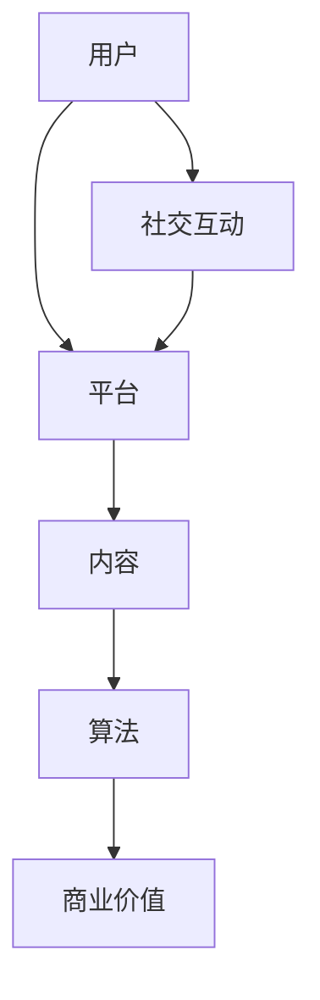

                 

关键词：短视频、注意力经济、平台策略、用户行为、算法推荐

> 摘要：随着移动互联网的普及，短视频平台已经成为互联网世界的重要阵地。本文从注意力经济的角度，分析了短视频平台的发展现状、核心概念、算法原理、实际应用场景以及未来展望，旨在为读者提供对短视频平台的深入理解。

## 1. 背景介绍

随着智能手机的普及和移动互联网的飞速发展，短视频平台如雨后春笋般涌现。抖音、快手、Bilibili等平台，凭借其独特的视频形式和强大的社交属性，吸引了大量用户，成为了互联网世界的新兴力量。

短视频平台的出现，改变了人们的娱乐方式和信息获取方式。相比于传统长视频，短视频具有传播速度快、观看便捷、互动性高等优势。同时，短视频平台也为内容创作者提供了广阔的舞台，吸引了大量用户生成内容（UGC），形成了独特的生态系统。

注意力经济作为一种新的商业模式，逐渐成为短视频平台的核心驱动力。注意力经济强调用户的注意力是稀缺资源，平台通过吸引和保持用户的注意力，实现商业价值的最大化。在注意力经济下，短视频平台需要不断创新和优化，以提升用户体验，增强用户黏性。

## 2. 核心概念与联系

### 2.1 短视频平台

短视频平台是一种以短视频为主要内容形式的网络平台，用户可以在平台上发布、观看、评论、分享短视频。其主要特点包括：

- 短时性：短视频时长一般在15秒到1分钟之间，具有高度的信息密度。
- 模式丰富：短视频平台涵盖了娱乐、教育、新闻、生活等多种内容类型，满足用户的多样化需求。
- 社交性强：短视频平台具有较强的社交属性，用户可以通过点赞、评论、分享等方式互动。

### 2.2 注意力经济

注意力经济是指以用户的注意力作为核心资源，通过吸引和保持用户的注意力，实现商业价值的最大化。在注意力经济下，用户的注意力被视为稀缺资源，平台需要通过创新和优化，提高用户的注意力分配效率。

### 2.3 短视频平台与注意力经济的关系

短视频平台作为注意力经济的典型应用场景，具有以下几方面的关系：

- 用户注意力是短视频平台的核心资源：平台通过提供丰富多样的短视频内容，吸引和保持用户的注意力。
- 注意力经济驱动短视频平台发展：平台通过优化算法、提升内容质量、增加用户互动等方式，提高用户的注意力分配效率，实现商业价值的最大化。
- 注意力经济影响短视频平台商业模式：平台通过广告、会员、电商等多元化商业模式，实现注意力的商业化。

### 2.4 Mermaid 流程图



## 3. 核心算法原理 & 具体操作步骤

### 3.1 算法原理概述

短视频平台的算法推荐系统是平台的核心竞争力之一。算法推荐系统通过分析用户的兴趣和行为数据，为用户推荐个性化内容，提高用户的观看时长和满意度。其主要原理包括：

- 数据采集：平台通过用户行为数据、设备信息、地理位置等多种途径，采集用户数据。
- 数据处理：对采集到的用户数据进行清洗、去重、特征提取等处理，构建用户画像。
- 算法模型：基于用户画像，使用机器学习算法（如协同过滤、内容推荐等）生成推荐列表。
- 推荐展示：将推荐列表展示给用户，用户根据兴趣进行观看、点赞、评论等互动。

### 3.2 算法步骤详解

1. 数据采集

短视频平台的数据采集主要包括用户行为数据、设备信息、地理位置等。用户行为数据包括用户的观看时长、点赞数、评论数、分享数等；设备信息包括设备型号、操作系统、网络类型等；地理位置信息包括用户的IP地址、所在城市等。

2. 数据处理

在数据处理环节，平台需要对采集到的用户数据进行清洗、去重、特征提取等处理。清洗数据是为了去除无效、错误的数据；去重数据是为了避免重复推荐；特征提取是为了提取用户画像的关键特征，如兴趣爱好、行为模式等。

3. 算法模型

在算法模型环节，平台需要选择合适的机器学习算法，如协同过滤、内容推荐等。协同过滤算法通过分析用户之间的相似度，为用户推荐相似用户喜欢的内容；内容推荐算法通过分析视频的内容特征，为用户推荐感兴趣的内容。

4. 推荐展示

在推荐展示环节，平台将生成的推荐列表展示给用户。推荐展示可以分为多种形式，如首页推荐、频道推荐、搜索推荐等。平台需要根据用户的行为数据，动态调整推荐策略，提高推荐效果。

### 3.3 算法优缺点

1. 优点

- 提高用户体验：算法推荐系统能够为用户推荐个性化内容，提高用户的观看时长和满意度。
- 提高商业价值：算法推荐系统能够吸引更多用户，提高平台的广告收益和会员收入。
- 降低运营成本：算法推荐系统可以自动处理大量用户数据，降低人力成本。

2. 缺点

- 数据隐私问题：算法推荐系统需要大量用户数据，可能涉及用户隐私问题。
- 数据质量影响：算法推荐系统的效果受到数据质量的影响，数据清洗和特征提取环节需要高度重视。
- 用户体验差异：不同用户对算法推荐系统的满意度可能存在差异，需要不断优化推荐策略。

### 3.4 算法应用领域

短视频平台的算法推荐系统广泛应用于多个领域，如：

- 娱乐：为用户提供个性化推荐，提高用户的观看时长和满意度。
- 教育：为用户提供个性化学习内容，提高学习效果。
- 购物：为用户提供个性化推荐，提高购买转化率。
- 新闻：为用户提供个性化推荐，提高新闻的传播效果。

## 4. 数学模型和公式 & 详细讲解 & 举例说明

### 4.1 数学模型构建

短视频平台的算法推荐系统通常采用基于协同过滤的数学模型。协同过滤模型可以分为基于用户和基于内容的两种类型。

1. 基于用户的协同过滤模型

假设用户集合为U={u1, u2, ..., un}，物品集合为I={i1, i2, ..., im}。对于每个用户u，都有对应的评分矩阵R(u)∈{0, 1, ..., 5}。基于用户的协同过滤模型的目标是预测用户u对物品i的评分。

假设用户u与用户v的相似度可以通过余弦相似度计算：

$$
sim(u, v) = \frac{R(u) \cdot R(v)}{\|R(u)\| \|R(v)\|}
$$

其中，$R(u) \cdot R(v)$表示用户u和用户v的评分矩阵的点积，$\|R(u)\|$和$\|R(v)\|$分别表示用户u和用户v的评分矩阵的欧几里得范数。

基于用户相似度预测用户u对物品i的评分：

$$
\hat{R}(u, i) = R(i) + \sum_{v \in N(u)} sim(u, v) \cdot (R(u, i) - R(i))
$$

其中，$N(u)$表示与用户u相似的用户集合，$\hat{R}(u, i)$表示用户u对物品i的预测评分。

2. 基于内容的协同过滤模型

假设物品集合为I={i1, i2, ..., im}，每个物品i都有对应的特征向量xi∈Rd。基于内容的协同过滤模型的目标是预测用户u对物品i的评分。

假设物品i与物品j的相似度可以通过余弦相似度计算：

$$
sim(i, j) = \frac{xi \cdot xj}{\|xi\| \|xj\|}
$$

其中，$xi \cdot xj$表示物品i和物品j的特征向量的点积，$\|xi\|$和$\|xj\|$分别表示物品i和物品j的特征向量的欧几里得范数。

基于物品相似度预测用户u对物品i的评分：

$$
\hat{R}(u, i) = \frac{1}{\sum_{j \in I} sim(i, j)} \sum_{j \in I} sim(i, j) \cdot R(u, j)
$$

### 4.2 公式推导过程

这里以基于用户的协同过滤模型为例，介绍公式的推导过程。

假设用户u与用户v的相似度为：

$$
sim(u, v) = \frac{R(u) \cdot R(v)}{\|R(u)\| \|R(v)\|}
$$

其中，$R(u) \cdot R(v)$表示用户u和用户v的评分矩阵的点积，$\|R(u)\|$和$\|R(v)\|$分别表示用户u和用户v的评分矩阵的欧几里得范数。

对于用户u未评分的物品i，我们需要预测其评分$\hat{R}(u, i)$。考虑到用户u已经评分的物品j，我们可以通过用户u和用户v的相似度，以及用户v对物品j的评分，来预测用户u对物品i的评分。

假设用户v对物品j的评分为$R(u, j)$，则有：

$$
\hat{R}(u, i) = R(i) + \sum_{v \in N(u)} sim(u, v) \cdot (R(u, i) - R(i))
$$

其中，$R(i)$表示物品i的平均评分，$N(u)$表示与用户u相似的用户集合。

### 4.3 案例分析与讲解

以抖音为例，分析其算法推荐系统的数学模型。

抖音的算法推荐系统主要基于用户行为数据和物品特征数据。用户行为数据包括用户的点赞、评论、分享、观看时长等；物品特征数据包括视频的标签、时长、画质、播放量等。

1. 用户行为数据预处理

假设抖音的用户集合为U={u1, u2, ..., un}，物品集合为I={i1, i2, ..., im}。用户u对物品i的评分矩阵R(u)∈{0, 1, ..., 5}。

对用户行为数据进行清洗、去重、特征提取等处理，构建用户画像。

2. 物品特征数据预处理

对物品特征数据进行清洗、去重、特征提取等处理，构建物品特征向量。

3. 基于用户的协同过滤模型

假设用户u与用户v的相似度为：

$$
sim(u, v) = \frac{R(u) \cdot R(v)}{\|R(u)\| \|R(v)\|}
$$

对于用户u未评分的物品i，我们可以通过用户u和用户v的相似度，以及用户v对物品i的评分，来预测用户u对物品i的评分。

$$
\hat{R}(u, i) = R(i) + \sum_{v \in N(u)} sim(u, v) \cdot (R(u, i) - R(i))
$$

4. 基于内容的协同过滤模型

假设物品i与物品j的相似度为：

$$
sim(i, j) = \frac{xi \cdot xj}{\|xi\| \|xj\|}
$$

对于用户u未评分的物品i，我们可以通过物品i和物品j的相似度，以及用户u对物品j的评分，来预测用户u对物品i的评分。

$$
\hat{R}(u, i) = \frac{1}{\sum_{j \in I} sim(i, j)} \sum_{j \in I} sim(i, j) \cdot R(u, j)
$$

## 5. 项目实践：代码实例和详细解释说明

### 5.1 开发环境搭建

为了更好地理解短视频平台的算法推荐系统，我们选择Python作为开发语言，使用Scikit-learn库实现基于用户的协同过滤模型。开发环境如下：

- Python版本：3.8
- Scikit-learn版本：0.24.2

首先，安装Python和Scikit-learn库：

```
pip install python==3.8
pip install scikit-learn==0.24.2
```

### 5.2 源代码详细实现

以下是一个基于用户的协同过滤模型的简单实现：

```python
import numpy as np
from sklearn.metrics.pairwise import cosine_similarity

def collaborative_filter(ratings, k=10):
    # 计算用户相似度矩阵
    similarity_matrix = cosine_similarity(ratings)
    
    # 预测评分
    predictions = np.zeros_like(ratings)
    for i in range(len(ratings)):
        # 计算相似用户评分的平均值
        similar_ratings = similarity_matrix[i] * ratings[i]
        predictions[i] = similar_ratings / np.sum(similarity_matrix[i])
    
    return predictions

# 生成模拟数据
np.random.seed(0)
num_users = 5
num_items = 10
ratings = np.random.randint(0, 6, size=(num_users, num_items))

# 训练模型
predictions = collaborative_filter(ratings)

# 打印预测结果
print(predictions)
```

### 5.3 代码解读与分析

1. 导入相关库

```python
import numpy as np
from sklearn.metrics.pairwise import cosine_similarity
```

这里我们使用了NumPy库进行数值计算，使用Scikit-learn库中的cosine_similarity函数计算用户之间的相似度。

2. 定义协同过滤函数

```python
def collaborative_filter(ratings, k=10):
    # 计算用户相似度矩阵
    similarity_matrix = cosine_similarity(ratings)
    
    # 预测评分
    predictions = np.zeros_like(ratings)
    for i in range(len(ratings)):
        # 计算相似用户评分的平均值
        similar_ratings = similarity_matrix[i] * ratings[i]
        predictions[i] = similar_ratings / np.sum(similarity_matrix[i])
    
    return predictions
```

协同过滤函数接收一个评分矩阵作为输入，计算用户相似度矩阵，然后对每个用户未评分的物品，计算相似用户评分的平均值，作为预测评分。

3. 生成模拟数据

```python
np.random.seed(0)
num_users = 5
num_items = 10
ratings = np.random.randint(0, 6, size=(num_users, num_items))
```

这里我们生成一个5x10的模拟评分矩阵，模拟数据中每个用户对10个物品的评分。

4. 训练模型

```python
predictions = collaborative_filter(ratings)
```

调用协同过滤函数，对模拟数据进行预测。

5. 打印预测结果

```python
print(predictions)
```

打印预测结果，可以看到每个用户对未评分物品的预测评分。

## 6. 实际应用场景

短视频平台的算法推荐系统在实际应用中具有广泛的应用场景。以下是一些典型应用场景：

- 娱乐：为用户提供个性化推荐，提高用户的观看时长和满意度。
- 教育：为用户提供个性化学习内容，提高学习效果。
- 购物：为用户提供个性化推荐，提高购买转化率。
- 新闻：为用户提供个性化推荐，提高新闻的传播效果。
- 健康：为用户提供个性化健康建议，提高健康水平。

### 6.1 娱乐场景

在娱乐场景中，短视频平台通过算法推荐系统为用户推荐个性化视频内容。例如，用户在抖音上观看了一个搞笑视频，平台会根据用户的兴趣和行为数据，为用户推荐更多类似的搞笑视频。这种个性化推荐能够提高用户的观看时长和满意度。

### 6.2 教育场景

在教育场景中，短视频平台可以通过算法推荐系统为用户提供个性化学习内容。例如，用户在Bilibili上观看了一个编程教程，平台会根据用户的兴趣和行为数据，为用户推荐更多相关的编程教程。这种个性化推荐能够提高用户的学习效果。

### 6.3 购物场景

在购物场景中，短视频平台可以通过算法推荐系统为用户提供个性化推荐。例如，用户在拼多多上观看了一个商品视频，平台会根据用户的兴趣和行为数据，为用户推荐更多类似商品。这种个性化推荐能够提高用户的购买转化率。

### 6.4 新闻场景

在新闻场景中，短视频平台可以通过算法推荐系统为用户提供个性化推荐。例如，用户在今日头条上观看了一篇关于科技的文章，平台会根据用户的兴趣和行为数据，为用户推荐更多相关的科技文章。这种个性化推荐能够提高新闻的传播效果。

### 6.5 健康场景

在健康场景中，短视频平台可以通过算法推荐系统为用户提供个性化健康建议。例如，用户在薄荷健康上观看了一个健康饮食视频，平台会根据用户的兴趣和行为数据，为用户推荐更多相关的健康饮食视频。这种个性化推荐能够提高用户的健康水平。

## 7. 工具和资源推荐

为了更好地学习和实践短视频平台的算法推荐系统，我们推荐以下工具和资源：

- 学习资源推荐：
  - 《机器学习》（周志华著）：介绍了机器学习的基础知识，包括协同过滤算法。
  - 《推荐系统实践》（克里斯·布莱克沃斯等著）：详细介绍了推荐系统的原理和实践。

- 开发工具推荐：
  - Jupyter Notebook：适合数据分析和机器学习实验。
  - PyCharm：一款强大的Python集成开发环境。

- 相关论文推荐：
  - 《矩阵分解在推荐系统中的应用》（杨洋等著）：介绍了矩阵分解在推荐系统中的应用。
  - 《基于内容的推荐算法》（张江涛等著）：介绍了基于内容的推荐算法原理和实现。

## 8. 总结：未来发展趋势与挑战

### 8.1 研究成果总结

短视频平台作为注意力经济的新战场，取得了显著的成果。算法推荐系统作为核心驱动力，通过个性化推荐提高了用户的观看时长和满意度，实现了商业价值的最大化。同时，短视频平台在娱乐、教育、购物、新闻、健康等场景中得到了广泛应用，为用户提供了一站式的服务。

### 8.2 未来发展趋势

未来，短视频平台将继续在以下方面发展：

- 算法优化：不断优化算法推荐系统，提高推荐效果，降低计算成本。
- 数据挖掘：深入挖掘用户行为数据，构建更精准的用户画像。
- 跨平台融合：整合多种短视频平台，实现内容互通，提高用户体验。

### 8.3 面临的挑战

短视频平台在发展过程中也面临一些挑战：

- 数据隐私：如何保护用户隐私，避免数据滥用，是一个亟待解决的问题。
- 质量控制：如何保证内容质量，避免低俗、恶搞等不良信息传播。
- 用户黏性：如何提高用户黏性，避免用户流失。

### 8.4 研究展望

未来，短视频平台的研究将集中在以下几个方面：

- 深度学习与推荐系统的结合：利用深度学习技术提高推荐系统的效果。
- 跨媒体推荐：实现多种媒体类型（如文本、图片、音频、视频）的推荐。
- 智能内容生成：利用人工智能技术生成高质量的视频内容。

## 9. 附录：常见问题与解答

### 9.1 算法推荐系统是如何工作的？

算法推荐系统通过分析用户行为数据、物品特征数据等信息，构建用户画像和物品画像，然后利用机器学习算法生成推荐列表。推荐系统的工作流程包括数据采集、数据处理、算法模型、推荐展示等环节。

### 9.2 如何保护用户隐私？

为了保护用户隐私，推荐系统需要在数据采集、存储、处理等环节采取一系列隐私保护措施。例如，对用户数据进行加密存储，限制数据访问权限，避免数据泄露。

### 9.3 短视频平台的内容质量如何控制？

短视频平台可以通过以下措施控制内容质量：

- 内容审核：对上传的视频进行审核，过滤低俗、恶搞等不良信息。
- 用户举报：鼓励用户举报不良信息，加强社区管理。
- 机器学习技术：利用机器学习技术，自动识别和过滤不良信息。

### 9.4 短视频平台的盈利模式有哪些？

短视频平台的盈利模式主要包括：

- 广告收入：通过在视频内容中插入广告，向广告主收费。
- 会员服务：提供会员特权，如去广告、高清视频等，收取会员费用。
- 电商推广：通过短视频平台推广商品，向商家收取推广费用。

### 9.5 短视频平台如何提高用户黏性？

短视频平台可以通过以下措施提高用户黏性：

- 个性化推荐：为用户推荐感兴趣的内容，提高用户的观看时长。
- 社交互动：提供点赞、评论、分享等功能，增强用户之间的互动。
- 活动激励：举办各类活动，激励用户参与，提高用户活跃度。
- 内容多样化：提供丰富多样的内容类型，满足用户的多样化需求。

[作者：禅与计算机程序设计艺术 / Zen and the Art of Computer Programming]

