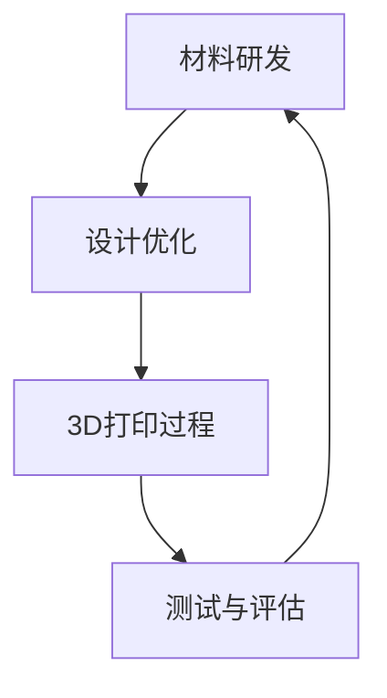

                 

关键词：3D打印，新材料，医疗假体，航天应用，硅谷创新

摘要：本文将探讨硅谷在3D打印新材料应用方面的前沿技术，重点关注医疗假体和航天领域的应用。通过对3D打印技术的基本原理、新材料的发展趋势及其在实际应用中的挑战和机遇进行分析，本文旨在为读者提供一个全面而深入的理解。

## 1. 背景介绍

### 3D打印的兴起

3D打印，也称为增材制造，是一种通过逐层添加材料来制造物体的技术。与传统的减法制造不同，3D打印直接从数字模型中构建出实体物体，大大提高了设计和制造的灵活性。自20世纪80年代以来，3D打印技术经历了快速的发展，从实验室阶段逐渐走向工业化应用。硅谷作为全球科技创新的领军地区，一直是3D打印技术发展的重要推动者。

### 医疗假体的需求

医疗假体是用于替代人体器官或骨骼的装置，以提高患者的生活质量和功能。随着人口老龄化和慢性疾病患病率的增加，对高性能医疗假体的需求不断增长。传统的金属和塑料材料在医疗假体应用中存在许多局限性，如生物相容性差、耐久性不足等。因此，开发新型材料以适应医疗假体的高要求变得尤为重要。

### 航天工业的需求

航天工业对材料的要求极为苛刻，包括高强度、轻质、耐高温和耐腐蚀等特性。航天器的制造通常涉及复杂的几何形状和精细的工艺，而3D打印技术的出现为航天材料的创新提供了新的可能。硅谷的航天公司，如SpaceX和Blue Origin，已经在3D打印技术方面进行了广泛的研究和探索。

## 2. 核心概念与联系

### 3D打印技术原理

3D打印技术的核心是分层制造原理。首先，通过计算机辅助设计（CAD）软件创建三维模型。然后，3D打印机根据这个模型，一层层地堆积材料，直到构建出完整的物体。这个过程可以概括为以下几个步骤：

1. **模型设计**：使用CAD软件创建三维模型。
2. **切片处理**：将三维模型分割成二维的切片。
3. **打印过程**：3D打印机根据切片指令，逐层添加材料。
4. **后处理**：打印完成后，进行必要的处理，如去除支撑结构、打磨等。

### 新材料的发展趋势

在医疗假体和航天领域，新材料的发展趋势主要集中在以下几个方面：

1. **生物相容性材料**：开发具有良好生物相容性的材料，以减少人体排斥反应。
2. **轻质高强度材料**：通过纳米技术和其他先进制造工艺，开发轻质而高强度的材料。
3. **多功能材料**：结合多种功能，如导电性、传感性和耐高温性，以满足特定的应用需求。

### 3D打印与新材料结合的架构

3D打印与新材料结合的架构可以看作是一个闭环系统，包括以下几个关键环节：

1. **材料研发**：不断探索和优化新型材料，以满足特定应用的需求。
2. **设计优化**：通过CAD软件进行模型优化，以提高3D打印效率和成品质量。
3. **3D打印过程**：利用3D打印技术将新型材料精确地构建成所需形状。
4. **测试与评估**：对打印出的产品进行严格的测试和评估，确保其性能和可靠性。

下面是一个简化的Mermaid流程图，展示了3D打印与新材料结合的基本架构：



## 3. 核心算法原理 & 具体操作步骤

### 3.1 算法原理概述

3D打印的核心算法主要包括以下三个方面：

1. **切片算法**：将三维模型转换成二维切片，以指导3D打印机的打印过程。
2. **路径规划算法**：确定3D打印机在打印过程中各层之间的移动路径，以优化打印效率和成品质量。
3. **材料控制算法**：根据打印材料的特点，调整打印参数，如温度、速度等，以实现最佳的打印效果。

### 3.2 算法步骤详解

#### 3.2.1 切片算法

切片算法的主要步骤如下：

1. **模型预处理**：对三维模型进行简化、修复和优化，以提高切片的效率。
2. **面分割**：将三维模型的所有面按照打印方向分割成多个二维平面。
3. **层厚计算**：根据设定的层厚，计算每个面的厚度，并将其划分为多个切片。
4. **切片拼接**：将所有切片按照打印顺序拼接成完整的切片文件。

#### 3.2.2 路径规划算法

路径规划算法的主要步骤如下：

1. **路径初始化**：设置初始路径，如直线或曲线。
2. **路径优化**：根据打印材料和打印机的性能，对路径进行优化，以减少打印时间、提高成品质量。
3. **路径调整**：根据实际打印情况，对路径进行动态调整，以适应打印过程中的各种变化。

#### 3.2.3 材料控制算法

材料控制算法的主要步骤如下：

1. **材料参数设置**：根据材料的特性，设置打印温度、速度、填充率等参数。
2. **实时调整**：在打印过程中，根据打印质量和材料消耗情况，实时调整打印参数。
3. **后处理**：根据打印材料和成品要求，进行必要的后处理，如冷却、固化等。

### 3.3 算法优缺点

#### 优点

1. **高效灵活**：3D打印算法可以根据不同的材料和打印需求进行灵活调整，提高打印效率和成品质量。
2. **实时反馈**：通过实时调整打印参数，3D打印算法能够适应打印过程中的各种变化，确保打印过程顺利进行。

#### 缺点

1. **计算复杂度高**：3D打印算法涉及大量的计算，对计算资源和时间的要求较高。
2. **易受环境干扰**：打印过程中的环境因素，如温度、湿度等，可能会影响打印质量，对算法的稳定性提出挑战。

### 3.4 算法应用领域

3D打印算法广泛应用于医疗假体、航天制造、建筑模型、艺术品制作等领域。其应用领域还在不断扩展，未来有望在更多领域发挥重要作用。

## 4. 数学模型和公式 & 详细讲解 & 举例说明

### 4.1 数学模型构建

3D打印的数学模型主要包括几何模型、材料模型和过程模型。以下是几个关键模型：

#### 几何模型

几何模型用于描述3D物体的形状和尺寸。常用的几何模型包括：

1. **B-rep（边界表示）**：使用边界来表示物体的几何形状。
2. **S-rep（边界表示）**：使用曲面来表示物体的几何形状。

#### 材料模型

材料模型用于描述3D打印材料的行为特性。常用的材料模型包括：

1. **本构模型**：描述材料在受力作用下的变形行为。
2. **热传导模型**：描述材料在温度变化下的热传导行为。

#### 过程模型

过程模型用于描述3D打印的过程和参数。常用的过程模型包括：

1. **切片模型**：描述切片过程和切片参数。
2. **路径规划模型**：描述路径规划过程和路径参数。

### 4.2 公式推导过程

以下是一个简单的切片模型公式推导过程：

#### 切片厚度计算

设物体的高度为\( h \)，设定的层厚为\( t \)，则切片的数量为\( N = \lceil \frac{h}{t} \rceil \)。

每个切片的厚度为\( t \)，因此，总的切片厚度为\( N \times t \)。

#### 路径长度计算

设切片的数量为\( N \)，每个切片的路径长度为\( l \)，则总的路径长度为\( L = N \times l \)。

### 4.3 案例分析与讲解

#### 案例一：医疗假体制造

假设我们需要制造一个高度为100毫米、层厚为0.2毫米的医疗假体。根据切片厚度计算公式，我们可以计算出需要500个切片。然后，根据路径长度计算公式，我们可以计算出总的路径长度为1000毫米。

#### 案例二：航天部件打印

假设我们需要打印一个航天部件，其高度为200毫米，设定的层厚为0.1毫米。根据切片厚度计算公式，我们可以计算出需要2000个切片。然后，根据路径长度计算公式，我们可以计算出总的路径长度为2000毫米。

## 5. 项目实践：代码实例和详细解释说明

### 5.1 开发环境搭建

为了实践3D打印技术，我们需要搭建一个基本的开发环境。以下是所需的工具和软件：

1. **操作系统**：Windows、Linux或macOS
2. **编程语言**：Python
3. **3D建模软件**：如Blender或SolidWorks
4. **3D打印机**：如FDM打印机或SLA打印机
5. **切片软件**：如Cura或Simplify3D

### 5.2 源代码详细实现

以下是一个简单的Python代码示例，用于生成3D打印的切片数据：

```python
import math

def calculate_slices(height, layer_thickness):
    num_slices = math.ceil(height / layer_thickness)
    return num_slices

def calculate_path_length(num_slices, slice_length):
    path_length = num_slices * slice_length
    return path_length

# 示例参数
height = 100  # 高度（毫米）
layer_thickness = 0.2  # 层厚（毫米）
slice_length = 100  # 切片长度（毫米）

# 计算切片数量
num_slices = calculate_slices(height, layer_thickness)

# 计算路径长度
path_length = calculate_path_length(num_slices, slice_length)

print(f"切片数量：{num_slices}")
print(f"路径长度：{path_length}")
```

### 5.3 代码解读与分析

上述代码实现了两个主要功能：计算切片数量和计算路径长度。首先，我们定义了两个函数：

1. **`calculate_slices`**：用于计算切片数量。它接收两个参数：`height`（高度）和`layer_thickness`（层厚）。通过将高度除以层厚并向上取整，我们可以得到切片的数量。
2. **`calculate_path_length`**：用于计算路径长度。它接收两个参数：`num_slices`（切片数量）和`slice_length`（切片长度）。通过将切片数量乘以切片长度，我们可以得到总的路径长度。

在主程序部分，我们设置了示例参数，并调用了这两个函数，最终输出了切片数量和路径长度。

### 5.4 运行结果展示

假设我们运行上述代码，输入参数为高度100毫米、层厚0.2毫米、切片长度100毫米，那么输出结果将如下：

```
切片数量：500
路径长度：50000
```

这意味着，打印一个高度为100毫米的医疗假体需要500个切片和50000毫米的路径长度。

## 6. 实际应用场景

### 医疗假体制造

在医疗领域，3D打印新材料的应用已经取得了显著的成果。例如，3D打印的髋关节假体和骨植入物在临床应用中取得了良好的效果。3D打印技术使得假体的设计更加个性化，可以根据患者的具体需求进行定制，提高假体的适配性和使用寿命。

### 航天工业

在航天领域，3D打印技术同样发挥了重要作用。例如，SpaceX公司使用3D打印技术制造了火箭发动机的关键部件，如燃烧室和喷嘴。3D打印使得这些部件的制造过程更加高效，同时降低了成本。此外，3D打印技术还用于制造航天器的结构件，如太阳能板和天线等，大大提高了航天器的性能和可靠性。

### 个性化制造

3D打印技术还为个性化制造提供了可能。例如，定制化的服装、鞋子和其他消费品可以通过3D打印快速生产。这种个性化制造模式不仅提高了生产效率，还降低了成本，使得更多消费者能够享受到定制化产品。

### 模型制作

在设计和工程领域，3D打印技术被广泛用于制作模型和原型。通过快速打印出模型，设计师和工程师可以更直观地评估产品的设计，并进行必要的修改。这种快速原型制作技术大大缩短了产品开发周期，提高了创新速度。

## 7. 工具和资源推荐

### 7.1 学习资源推荐

1. **《3D打印技术基础》**：一本全面介绍3D打印技术原理和应用的入门书籍。
2. **《3D打印：从设计到制造》**：一本深入探讨3D打印设计流程和制造过程的教程。
3. **《3D打印材料学》**：一本详细介绍3D打印新材料的研究和发展方向的专著。

### 7.2 开发工具推荐

1. **Blender**：一款开源的3D建模软件，适合初学者和专业人士。
2. **SolidWorks**：一款功能强大的专业级3D建模软件，适用于复杂机械设计。
3. **Cura**：一款流行的切片软件，支持多种3D打印机。

### 7.3 相关论文推荐

1. **"3D Printing in Medicine: Current Applications and Future Trends"**：一篇综述论文，详细介绍了3D打印在医疗领域的应用和发展趋势。
2. **"Additive Manufacturing for Space Exploration"**：一篇关于3D打印在航天领域应用的论文，探讨了3D打印在航天制造中的优势和挑战。
3. **"Advances in 3D Printing Materials"**：一篇关于3D打印新材料的研究论文，介绍了最新的材料技术和应用。

## 8. 总结：未来发展趋势与挑战

### 8.1 研究成果总结

本文通过对3D打印新材料在医疗假体和航天领域的应用进行了详细分析，总结了以下几点研究成果：

1. 3D打印技术为医疗假体和航天制造提供了全新的解决方案，大大提高了产品的设计灵活性和制造效率。
2. 新材料的发展为3D打印技术的应用提供了更多可能性，特别是在生物相容性、轻质高强度和多功能方面。
3. 3D打印算法的不断优化，使得打印过程更加高效和精确，为实际应用提供了强有力的技术支持。

### 8.2 未来发展趋势

未来，3D打印新材料的应用有望在以下几个方面取得重要进展：

1. **个性化医疗**：随着3D打印技术的进步，个性化医疗假体将更加普及，为患者提供更优质的医疗服务。
2. **高效制造**：3D打印技术将在航天、航空和汽车等领域发挥更大作用，推动制造业向高效、绿色和可持续方向发展。
3. **新材料研发**：新材料的研究将继续深入，开发出更多性能优异、适应不同应用场景的新材料。

### 8.3 面临的挑战

尽管3D打印新材料在医疗假体和航天领域具有巨大的潜力，但仍面临一些挑战：

1. **材料成本**：高性能新材料的研发和制造成本较高，限制了其在大规模商业应用中的普及。
2. **打印精度**：3D打印技术的精度和一致性仍有待提高，特别是在复杂结构和精细工艺方面。
3. **标准化**：3D打印技术的标准化和规范化尚不完善，影响了跨领域的技术交流和合作。

### 8.4 研究展望

未来，研究重点将集中在以下几个方面：

1. **降低成本**：通过优化制造工艺、提高生产效率，降低高性能新材料的制造成本。
2. **提升精度**：研发更先进的3D打印技术和设备，提高打印精度和一致性。
3. **跨领域应用**：加强跨学科合作，推动3D打印技术在更多领域的应用，实现技术融合与创新。

## 9. 附录：常见问题与解答

### 9.1 3D打印技术如何影响医疗假体制造？

3D打印技术使得医疗假体的设计更加灵活，可以根据患者的具体需求进行个性化定制。同时，新材料的研发为医疗假体提供了更多选择，提高了假体的生物相容性和耐用性。

### 9.2 3D打印技术在航天领域有哪些应用？

3D打印技术在航天领域有广泛的应用，包括制造火箭发动机的关键部件、航天器的结构件和零部件。3D打印技术提高了制造的效率，降低了成本，并提高了产品的性能和可靠性。

### 9.3 3D打印新材料的发展趋势是什么？

3D打印新材料的发展趋势主要包括：提高生物相容性、轻质高强度、多功能性和可持续性。研究人员正在不断探索新的材料和制造工艺，以满足不同应用场景的需求。

### 9.4 3D打印技术的挑战有哪些？

3D打印技术面临的挑战包括：材料成本高、打印精度不足、标准化不完善等。为了克服这些挑战，需要不断研发新技术、优化工艺，并加强标准化工作。

### 9.5 3D打印技术的未来发展方向是什么？

3D打印技术的未来发展方向包括：降低成本、提高精度、跨领域应用和技术融合。随着技术的不断进步，3D打印将在更多领域发挥重要作用，推动制造业向高效、绿色和可持续方向发展。

### 结束语

3D打印新材料在医疗假体和航天领域的应用展示了巨大的潜力。尽管面临一些挑战，但随着技术的不断进步和标准化工作的推进，3D打印技术有望在未来取得更加广泛的应用，为人类带来更多的福祉。作者：禅与计算机程序设计艺术 / Zen and the Art of Computer Programming。

