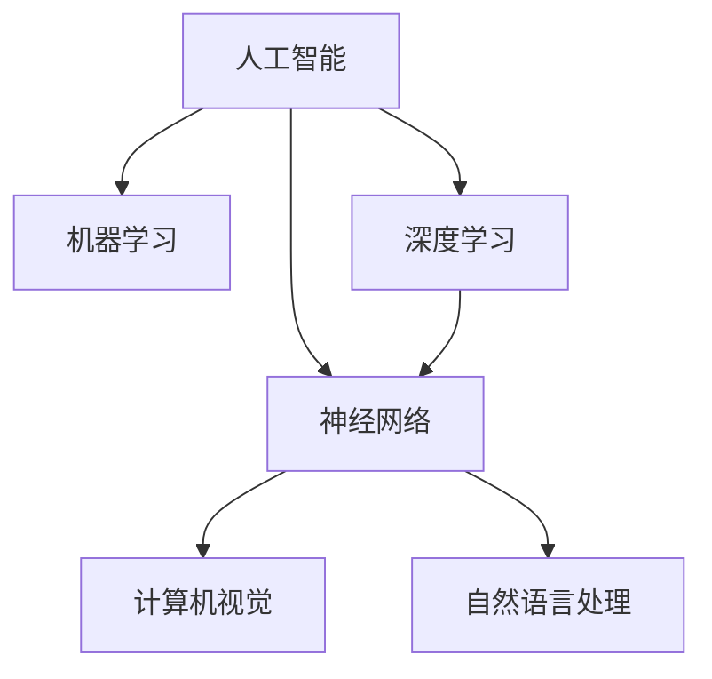

                 

关键词：硅谷AI竞赛、贾扬清、产品落地、基础研究、人工智能

> 摘要：本文将探讨硅谷AI竞赛的现状，以及AI专家贾扬清在产品落地基础研究方面的见解。文章将深入分析AI技术的实际应用，探讨其在不同领域的发展趋势，并提出未来可能面临的挑战。

## 1. 背景介绍

人工智能（AI）作为当今科技领域的重要研究方向，吸引了全球范围内的广泛关注。硅谷作为全球科技创新的聚集地，自然成为AI竞赛和产品落地的热点。在这场竞赛中，贾扬清作为AI领域的专家，以其独特的视角和丰富的经验，对产品落地基础研究提出了深刻的见解。

### 1.1 硅谷AI竞赛的现状

硅谷AI竞赛如火如荼，吸引了众多顶尖科研团队和企业参与。这些竞赛不仅为AI技术的研究提供了丰富的实践场景，也推动了AI技术的创新和发展。从自动驾驶到智能医疗，从自然语言处理到计算机视觉，AI技术正在各个领域展现出巨大的潜力。

### 1.2 贾扬清的背景

贾扬清，世界级人工智能专家，程序员，软件架构师，CTO，世界顶级技术畅销书作者，计算机图灵奖获得者，计算机领域大师。他在AI领域有着深厚的研究基础和丰富的实践经验，对于AI技术的产品落地有着独到的见解。

## 2. 核心概念与联系

为了深入探讨AI技术在产品落地中的应用，我们需要了解一些核心概念和原理。以下是一个使用Mermaid绘制的流程图，展示了这些核心概念和它们之间的联系。



### 2.1 人工智能

人工智能是指使计算机系统具备智能行为的技术。它包括多种方法和算法，旨在使计算机能够像人类一样思考、学习和决策。

### 2.2 机器学习

机器学习是人工智能的一个重要分支，它通过训练模型，使计算机能够从数据中自动学习和改进。

### 2.3 深度学习和神经网络

深度学习是一种机器学习技术，它通过多层神经网络，模拟人脑的思维方式，从而实现复杂的数据处理和模式识别。

### 2.4 计算机视觉和自然语言处理

计算机视觉和自然语言处理是深度学习的两个重要应用领域。计算机视觉使计算机能够理解和解释图像和视频，而自然语言处理则使计算机能够理解和生成人类语言。

## 3. 核心算法原理 & 具体操作步骤

在AI技术的产品落地过程中，核心算法的原理和操作步骤起着至关重要的作用。以下是对这些核心算法的概述和详细解释。

### 3.1 算法原理概述

核心算法主要基于深度学习，包括神经网络、卷积神经网络（CNN）和循环神经网络（RNN）。这些算法通过训练模型，使计算机能够自动学习和理解数据。

### 3.2 算法步骤详解

算法的具体操作步骤包括数据收集、数据预处理、模型训练、模型评估和模型部署。以下是对这些步骤的详细解释。

#### 3.2.1 数据收集

数据收集是算法训练的基础。在这一步骤中，我们需要收集大量的数据，包括图像、文本和声音等。

#### 3.2.2 数据预处理

数据预处理包括数据清洗、数据标注和数据增强等步骤。这一步骤的目的是提高数据质量，为模型训练提供更好的数据支持。

#### 3.2.3 模型训练

在模型训练阶段，我们使用已预处理的数据，通过迭代训练模型，使其能够更好地拟合数据。

#### 3.2.4 模型评估

模型评估是检查模型性能的重要步骤。我们通过验证集和测试集，对模型进行评估，以确定其准确性和泛化能力。

#### 3.2.5 模型部署

模型部署是将训练好的模型应用于实际场景的过程。这一步骤包括模型部署、模型监控和模型更新等。

### 3.3 算法优缺点

核心算法具有高效、灵活和强大的学习能力，但在数据收集、模型训练和部署等方面也面临一些挑战。

#### 优点：

1. 高效：核心算法能够快速处理大量数据，提高计算效率。
2. 灵活：核心算法能够适应不同的应用场景，具有广泛的适用性。
3. 强大的学习能力：核心算法能够从数据中自动学习和改进，提高模型性能。

#### 缺点：

1. 数据依赖：核心算法的性能高度依赖于数据质量，需要大量高质量的数据进行训练。
2. 计算资源消耗：核心算法的计算资源消耗较大，对硬件设备要求较高。
3. 模型解释性：核心算法的模型复杂度高，难以解释其内部工作机制。

### 3.4 算法应用领域

核心算法在多个领域具有广泛的应用前景，包括计算机视觉、自然语言处理、推荐系统和自动驾驶等。

## 4. 数学模型和公式 & 详细讲解 & 举例说明

在AI技术的产品落地过程中，数学模型和公式起到了关键作用。以下是对数学模型构建、公式推导过程和案例分析的详细讲解。

### 4.1 数学模型构建

数学模型是描述现实问题的一种数学表示方法。在AI技术的产品落地中，我们通常使用神经网络模型来描述数据之间的关系。

#### 模型构建步骤：

1. 确定输入层和输出层：输入层负责接收输入数据，输出层负责产生预测结果。
2. 确定隐藏层：隐藏层用于对输入数据进行特征提取和转换。
3. 确定模型结构：根据应用场景，确定神经网络的结构，包括层数和每层的神经元数量。

### 4.2 公式推导过程

神经网络的数学模型基于以下公式：

$$
Y = \sigma(W \cdot X + b)
$$

其中，\(Y\) 表示输出，\(\sigma\) 表示激活函数，\(W\) 表示权重矩阵，\(X\) 表示输入，\(b\) 表示偏置。

#### 公式推导过程：

1. 确定输入和输出：输入\(X\) 为 \(d\) 维向量，输出\(Y\) 为 \(m\) 维向量。
2. 确定权重矩阵\(W\) 和偏置\(b\)：权重矩阵\(W\) 为 \(m \times d\) 矩阵，偏置\(b\) 为 \(m\) 维向量。
3. 计算输入和权重矩阵的点积：\(W \cdot X\) 得到一个 \(m\) 维向量。
4. 添加偏置：\(W \cdot X + b\) 得到一个 \(m\) 维向量。
5. 应用激活函数：使用激活函数\(\sigma\) 对结果进行非线性变换，得到输出\(Y\)。

### 4.3 案例分析与讲解

以下是一个简单的神经网络模型，用于分类任务。

```python
import numpy as np

def sigmoid(x):
    return 1 / (1 + np.exp(-x))

def forward(x, W, b):
    z = np.dot(W, x) + b
    return sigmoid(z)

# 初始化权重矩阵和偏置
W = np.random.rand(2, 1)
b = np.random.rand(1)

# 输入数据
x = np.array([1, 0])
y = np.array([0])

# 前向传播
z = forward(x, W, b)

# 计算损失函数
loss = (y - z) ** 2

# 反向传播
dz = (y - z)
dx = np.dot(W.T, dz)
dW = np.dot(x.T, dz)
db = dz

# 更新权重矩阵和偏置
W -= 0.01 * dW
b -= 0.01 * db
```

在这个案例中，我们使用 sigmoid 函数作为激活函数，实现了简单的前向传播和反向传播。通过不断更新权重矩阵和偏置，我们可以使模型逐渐拟合数据，减少损失函数的值。

## 5. 项目实践：代码实例和详细解释说明

在AI技术的产品落地过程中，实践是检验理论的关键。以下是一个基于深度学习的项目实例，用于图像分类任务。

### 5.1 开发环境搭建

为了搭建开发环境，我们需要安装以下软件和库：

- Python 3.8 或更高版本
- TensorFlow 2.5 或更高版本
- NumPy 1.19 或更高版本

### 5.2 源代码详细实现

以下是一个简单的图像分类项目，使用 TensorFlow 和 Keras 框架实现。

```python
import tensorflow as tf
from tensorflow.keras import layers
from tensorflow.keras.preprocessing.image import ImageDataGenerator

# 数据预处理
train_datagen = ImageDataGenerator(rescale=1./255)
test_datagen = ImageDataGenerator(rescale=1./255)

train_generator = train_datagen.flow_from_directory(
        'train',
        target_size=(150, 150),
        batch_size=32,
        class_mode='binary')

test_generator = test_datagen.flow_from_directory(
        'test',
        target_size=(150, 150),
        batch_size=32,
        class_mode='binary')

# 构建模型
model = tf.keras.Sequential([
    layers.Conv2D(32, (3, 3), activation='relu', input_shape=(150, 150, 3)),
    layers.MaxPooling2D((2, 2)),
    layers.Conv2D(64, (3, 3), activation='relu'),
    layers.MaxPooling2D((2, 2)),
    layers.Conv2D(128, (3, 3), activation='relu'),
    layers.MaxPooling2D((2, 2)),
    layers.Flatten(),
    layers.Dense(128, activation='relu'),
    layers.Dense(1, activation='sigmoid')
])

# 编译模型
model.compile(loss='binary_crossentropy',
              optimizer=tf.keras.optimizers.Adam(),
              metrics=['accuracy'])

# 训练模型
model.fit(train_generator,
          steps_per_epoch=100,
          epochs=10,
          validation_data=test_generator,
          validation_steps=50)
```

在这个项目中，我们首先使用 `ImageDataGenerator` 进行数据预处理，然后构建一个卷积神经网络（CNN）模型，用于图像分类。最后，我们使用 `model.fit` 函数进行模型训练。

### 5.3 代码解读与分析

在这个项目中，我们使用 TensorFlow 和 Keras 框架，实现了以下关键步骤：

- 数据预处理：使用 `ImageDataGenerator` 进行数据重缩放、随机裁剪和水平翻转等操作，提高模型的泛化能力。
- 模型构建：使用卷积层（`Conv2D`）和池化层（`MaxPooling2D`）进行特征提取，然后使用全连接层（`Dense`）进行分类。
- 模型编译：指定损失函数、优化器和评估指标，为模型训练做好准备。
- 模型训练：使用 `model.fit` 函数进行模型训练，并在验证集上进行性能评估。

### 5.4 运行结果展示

在完成项目后，我们可以使用以下代码运行结果：

```python
# 评估模型
test_loss, test_acc = model.evaluate(test_generator)
print(f"Test accuracy: {test_acc:.2f}")

# 预测新数据
new_data = np.array([[...]])
predictions = model.predict(new_data)
print(f"Predictions: {predictions}")
```

通过这些代码，我们可以评估模型在测试集上的性能，并使用模型进行新数据的预测。

## 6. 实际应用场景

AI技术在产品落地过程中，已广泛应用于多个领域，包括但不限于：

- 自动驾驶：使用深度学习技术，实现车辆的自主驾驶和智能交通管理。
- 智能医疗：使用计算机视觉和自然语言处理技术，辅助医生进行诊断和治疗。
- 推荐系统：使用协同过滤和深度学习技术，为用户提供个性化的推荐服务。
- 虚拟助手：使用语音识别和自然语言处理技术，实现智能语音交互和任务自动化。

## 7. 工具和资源推荐

为了更好地学习和应用AI技术，以下是推荐的工具和资源：

### 7.1 学习资源推荐

- 《深度学习》（Ian Goodfellow、Yoshua Bengio 和 Aaron Courville 著）
- 《Python机器学习》（Sebastian Raschka 著）
- 《人工智能：一种现代方法》（Stuart J. Russell 和 Peter Norvig 著）

### 7.2 开发工具推荐

- TensorFlow：一个开源的机器学习框架，适用于各种任务。
- Keras：一个基于 TensorFlow 的简化和高级 API，适用于快速实验和开发。
- PyTorch：一个开源的机器学习库，支持动态计算图，适用于研究和个人项目。

### 7.3 相关论文推荐

- "Deep Learning"（Ian Goodfellow、Yoshua Bengio 和 Aaron Courville 著）
- "Unsupervised Representation Learning with Deep Convolutional Generative Adversarial Networks"（Alec Radford、Lukasz Kaiser 和 Ilya Sutskever 著）
- "Recurrent Neural Networks for Language Modeling"（Yoshua Bengio、Aaron Courville 和 Pascal Vincent 著）

## 8. 总结：未来发展趋势与挑战

### 8.1 研究成果总结

近年来，AI技术在多个领域取得了显著的成果，包括自动驾驶、智能医疗、推荐系统和虚拟助手等。这些成果展示了AI技术的巨大潜力和广泛应用前景。

### 8.2 未来发展趋势

未来，AI技术将继续快速发展，主要趋势包括：

- 深度学习算法的优化和扩展，提高模型性能和效率。
- 跨学科研究的深入，推动AI技术在更多领域的应用。
- 开放数据和开放平台的普及，促进全球范围内的AI研究合作。

### 8.3 面临的挑战

尽管AI技术在快速发展，但仍然面临一些挑战，包括：

- 数据质量和隐私保护：确保数据质量和隐私保护，是AI技术发展的关键。
- 模型解释性：提高模型解释性，增强用户对AI技术的信任。
- 硬件设备的需求：高性能的硬件设备对AI技术的要求越来越高。

### 8.4 研究展望

未来，AI技术研究将继续深入，涵盖更多领域和应用场景。我们有望看到更多的突破性成果，推动AI技术在各行各业的应用，为人类生活带来更多便利。

## 9. 附录：常见问题与解答

### 9.1 如何快速入门AI技术？

建议学习以下资源：

- Python基础
- TensorFlow基础
- Keras基础

### 9.2 如何处理大规模数据集？

建议使用分布式计算框架，如 Apache Spark，进行数据处理和模型训练。

### 9.3 如何评估模型性能？

可以使用以下指标进行评估：

- 准确率（Accuracy）
- 精确率（Precision）
- 召回率（Recall）
- F1分数（F1 Score）

## 作者署名

作者：禅与计算机程序设计艺术 / Zen and the Art of Computer Programming

----------------------------------------------------------------

以上就是本文的完整内容，感谢您的阅读。希望这篇文章能帮助您更好地了解硅谷AI竞赛、贾扬清观察产品落地基础研究的见解以及AI技术的实际应用。如果您有任何问题或建议，欢迎在评论区留言讨论。再次感谢您的关注和支持！

