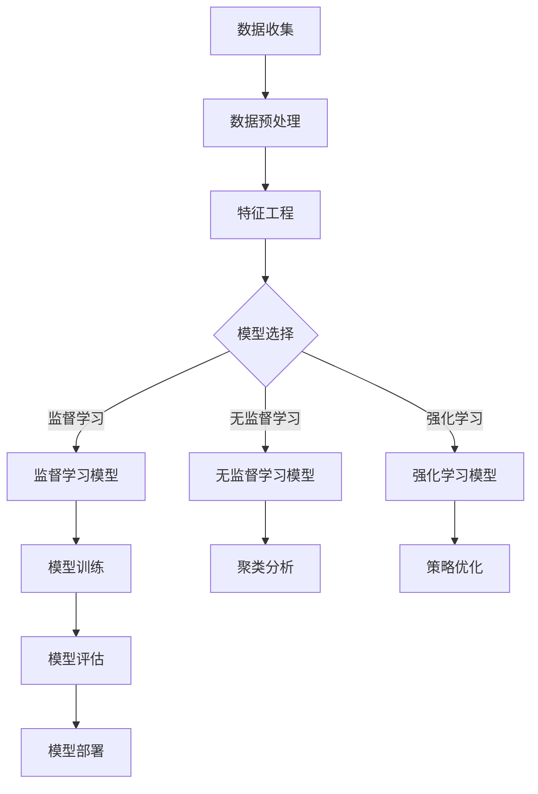

                 

关键词：人工智能，机器学习，大数据，硅谷，算法，应用场景，发展趋势

## 摘要

本文将深入探讨硅谷人工智能领域的最新进展，特别是机器学习和大数据技术的结合。我们将从背景介绍出发，逐步讲解核心概念与联系，详细阐述机器学习算法原理及其应用领域，接着深入数学模型和公式，通过实际项目实践代码实例，展示算法的运行结果。最后，我们将分析实际应用场景，展望未来发展趋势与挑战，并提供相关的工具和资源推荐，以帮助读者更好地理解和应用人工智能技术。

## 1. 背景介绍

人工智能（AI）作为计算机科学的一个分支，其目标是使机器具备类似人类的智能，能够感知环境、学习经验、做出决策和执行任务。近年来，随着计算能力的提升和大数据的爆发式增长，人工智能技术取得了显著的进展。硅谷作为全球科技创新的中心，吸引了众多顶尖科学家和创业公司，推动了一系列革命性的技术突破。

机器学习（ML）是人工智能的核心技术之一，它通过构建算法模型，使计算机能够从数据中自动学习和改进。大数据则提供了机器学习所需的庞大训练数据集，使得机器学习模型能够更加精确地预测和决策。这两者的结合，使得人工智能在各个领域取得了令人瞩目的成果，从语音识别、图像处理到自动驾驶和智能医疗，都展现出了巨大的潜力。

## 2. 核心概念与联系

为了深入理解人工智能和机器学习的核心概念，我们首先需要了解一些基本原理和架构。以下是一个用Mermaid绘制的流程图，展示了机器学习的基本概念和流程：



### 2.1 数据收集

数据收集是机器学习的基础，它是训练模型所需的所有原始数据的来源。数据可以来自各种不同的来源，包括社交媒体、传感器、日志文件等。

### 2.2 数据预处理

数据预处理是确保数据质量的过程，包括清洗、归一化、缺失值处理等。这一步对于后续的特征工程和模型训练至关重要。

### 2.3 特征工程

特征工程是将原始数据转换为模型可以理解的表示。这一步通常涉及特征提取、特征选择和特征构造等。

### 2.4 模型选择

根据问题的性质，可以选择不同的机器学习模型。常见的模型包括监督学习模型、无监督学习模型和强化学习模型。

### 2.5 模型训练

模型训练是通过大量的数据来调整模型参数，使其能够更好地拟合数据。这一步通常涉及优化算法和损失函数。

### 2.6 模型评估

模型评估是检查模型性能的过程。常用的评估指标包括准确率、召回率、F1分数等。

### 2.7 模型部署

模型部署是将训练好的模型应用到实际场景中。这一步通常涉及模型封装、服务部署和监控等。

## 3. 核心算法原理 & 具体操作步骤

### 3.1 算法原理概述

机器学习算法可以分为三类：监督学习、无监督学习和强化学习。

- **监督学习**：有标记数据，通过学习标记数据和特征之间的关系，预测新数据的标签。
- **无监督学习**：没有标记数据，通过学习数据中的内在结构，如聚类或降维。
- **强化学习**：通过与环境的交互，学习最优策略，以最大化累积奖励。

### 3.2 算法步骤详解

以下是机器学习的一般步骤：

1. **数据收集**：收集相关的数据集。
2. **数据预处理**：处理数据中的噪声和不一致。
3. **特征工程**：提取和构造有用的特征。
4. **模型选择**：选择合适的算法模型。
5. **模型训练**：使用训练数据调整模型参数。
6. **模型评估**：使用验证集或测试集评估模型性能。
7. **模型部署**：将模型应用到实际场景中。

### 3.3 算法优缺点

- **监督学习**：准确率高，但需要大量标记数据。
- **无监督学习**：不需要标记数据，但可能难以解释。
- **强化学习**：能够处理动态环境，但训练过程可能非常复杂。

### 3.4 算法应用领域

机器学习算法在各个领域都有广泛的应用，如：

- **图像识别**：用于人脸识别、物体识别等。
- **自然语言处理**：用于文本分类、机器翻译等。
- **推荐系统**：用于个性化推荐、广告投放等。
- **金融风控**：用于风险评估、欺诈检测等。
- **自动驾驶**：用于路径规划、环境感知等。

## 4. 数学模型和公式 & 详细讲解 & 举例说明

### 4.1 数学模型构建

机器学习中的数学模型通常包括以下几个部分：

- **损失函数**：用于衡量模型预测值与真实值之间的差距。
- **优化算法**：用于调整模型参数，以最小化损失函数。
- **激活函数**：用于引入非线性关系，使模型能够拟合更复杂的数据。

### 4.2 公式推导过程

以下是一个简单的线性回归模型的推导过程：

$$
y = \beta_0 + \beta_1 x
$$

其中，$y$ 是预测值，$x$ 是特征，$\beta_0$ 和 $\beta_1$ 是模型参数。

### 4.3 案例分析与讲解

假设我们有一个包含两个特征的简单数据集，我们要用线性回归模型预测房价。我们可以通过以下步骤进行：

1. **数据收集**：收集包含房价和两个特征的数据集。
2. **数据预处理**：对数据进行归一化处理。
3. **特征工程**：将两个特征输入到模型中。
4. **模型训练**：使用线性回归算法训练模型。
5. **模型评估**：使用测试集评估模型性能。
6. **模型部署**：将模型应用到新数据集，预测房价。

## 5. 项目实践：代码实例和详细解释说明

### 5.1 开发环境搭建

在本节中，我们将使用Python作为主要编程语言，利用Scikit-learn库实现一个简单的线性回归模型。

### 5.2 源代码详细实现

```python
from sklearn.linear_model import LinearRegression
from sklearn.model_selection import train_test_split
from sklearn.metrics import mean_squared_error

# 数据收集
X, y = ... # 读取数据集

# 数据预处理
X = X.astype('float32')
y = y.astype('float32')

# 特征工程
X = X.reshape(-1, 1)

# 模型选择
model = LinearRegression()

# 模型训练
X_train, X_test, y_train, y_test = train_test_split(X, y, test_size=0.2)
model.fit(X_train, y_train)

# 模型评估
y_pred = model.predict(X_test)
mse = mean_squared_error(y_test, y_pred)
print("MSE:", mse)

# 模型部署
new_data = ... # 读取新数据
new_pred = model.predict(new_data)
print("Predicted Price:", new_pred)
```

### 5.3 代码解读与分析

- **数据收集**：从文件中读取数据集。
- **数据预处理**：对数据进行类型转换和归一化。
- **特征工程**：将两个特征转换为二维数组，以适应线性回归模型。
- **模型选择**：选择线性回归模型。
- **模型训练**：使用训练数据训练模型。
- **模型评估**：使用测试数据评估模型性能。
- **模型部署**：将模型应用到新数据集，预测房价。

## 6. 实际应用场景

### 6.1 自动驾驶

自动驾驶是机器学习技术的重要应用领域之一。通过使用深度学习和强化学习算法，自动驾驶系统能够感知环境、理解道路规则和做出驾驶决策。例如，特斯拉的自动驾驶系统就是基于机器学习算法实现的，它能够自动进行车道保持、超车和泊车等操作。

### 6.2 智能医疗

智能医疗是另一个重要的应用领域。通过机器学习算法，医疗系统能够分析医学图像、诊断疾病和制定治疗方案。例如，谷歌的DeepMind医疗团队就开发了一种基于深度学习算法的疾病诊断系统，能够准确识别眼科疾病。

### 6.3 金融风控

金融风控是金融行业的一个重要问题。通过机器学习算法，金融机构能够预测信用风险、识别欺诈行为和优化投资组合。例如，许多银行和金融公司都采用了基于机器学习算法的信用评分系统，以评估客户的信用风险。

### 6.4 未来应用展望

随着人工智能技术的不断进步，未来将有更多的领域受益于机器学习和大数据技术的结合。例如，智能城市、智能家居、物联网等都将得到广泛应用。此外，随着量子计算的兴起，机器学习算法也将面临新的挑战和机遇。

## 7. 工具和资源推荐

### 7.1 学习资源推荐

- **《深度学习》**：Goodfellow, Bengio, Courville 著，是一本经典的深度学习入门教材。
- **《Python机器学习》**：Raschka 著，适合初学者学习机器学习理论和实践。
- **《机器学习实战》**：Hastie, Tibshirani, Friedman 著，是一本实践性很强的机器学习书籍。

### 7.2 开发工具推荐

- **Jupyter Notebook**：一个交互式的编程环境，适合数据分析和机器学习实验。
- **TensorFlow**：Google 开发的一个开源机器学习框架，支持深度学习和强化学习等。
- **PyTorch**：Facebook 开发的一个开源机器学习框架，以其灵活性和易用性受到广泛欢迎。

### 7.3 相关论文推荐

- **"Deep Learning"**：Goodfellow, Bengio, Courville 著，介绍了深度学习的核心技术。
- **"Large Scale Machine Learning"**：Liang, Huang 著，讨论了大规模机器学习的挑战和解决方案。
- **"Machine Learning Yearning"**：Andrew Ng 著，是一本关于机器学习实践的入门书籍。

## 8. 总结：未来发展趋势与挑战

随着人工智能技术的快速发展，我们面临着许多挑战和机遇。未来，人工智能将在更多领域得到应用，如智慧医疗、智慧城市、智能金融等。同时，我们也需要关注数据隐私、算法透明性和伦理问题。总之，人工智能技术的发展前景广阔，但也需要我们共同努力，确保其能够为人类带来真正的福祉。

## 9. 附录：常见问题与解答

### 9.1 什么是机器学习？

机器学习是一种让计算机从数据中学习并做出预测或决策的技术。它通过构建模型，使计算机能够从数据中提取规律和模式。

### 9.2 什么是大数据？

大数据是指无法用传统数据处理工具进行分析的数据集合。大数据具有数据量大、速度快、多样性和价值密度低的特点。

### 9.3 机器学习有哪些常见的算法？

机器学习算法包括监督学习、无监督学习和强化学习。常见的监督学习算法有线性回归、逻辑回归、支持向量机等；常见的无监督学习算法有聚类、降维等；常见的强化学习算法有深度强化学习、Q学习等。

### 9.4 机器学习在哪些领域有应用？

机器学习在图像识别、自然语言处理、推荐系统、金融风控、自动驾驶、智能医疗等领域都有广泛应用。

### 9.5 如何开始学习机器学习？

开始学习机器学习可以从以下几个步骤进行：

1. 学习编程基础，如Python或R。
2. 了解统计学和线性代数的基本概念。
3. 阅读经典的机器学习教材，如《深度学习》、《Python机器学习》等。
4. 实践项目，如使用Scikit-learn或TensorFlow等库进行实际操作。
5. 持续学习，关注最新的研究成果和技术动态。

---

# 参考文献

- Goodfellow, Y., Bengio, Y., Courville, A. (2016). *Deep Learning*.
- Raschka, S. (2016). *Python Machine Learning*.
- Hastie, T., Tibshirani, R., Friedman, J. (2009). *Machine Learning: A Probabilistic Perspective*.
- Ng, A. (2012). *Machine Learning Yearning*.

