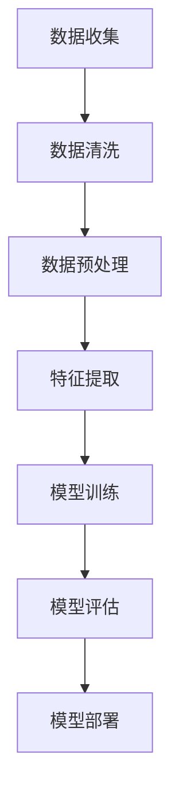

                 

关键词：人工智能、机器学习、大数据、深度学习、硅谷技术

> 摘要：本文深入探讨了硅谷人工智能领域的发展趋势，特别是机器学习和大数据技术在各个行业的应用，以及未来可能面临的挑战。通过分析核心算法原理、数学模型和实际项目实践，为读者提供了全面的技术视角和未来展望。

## 1. 背景介绍

人工智能（AI）是计算机科学的一个分支，旨在创建能够模拟、延伸和扩展人类智能的机器系统。近年来，随着大数据和计算能力的不断提升，人工智能技术取得了显著的进展，尤其在硅谷，这一领域的发展尤为迅速。硅谷以其开放的创新氛围、丰富的资源和顶尖的技术人才，成为全球人工智能技术的领军地区。

机器学习是人工智能的一个重要分支，它使计算机系统能够通过数据学习并改进性能，而无需显式编程。大数据则是机器学习的燃料，大量的数据为机器学习算法提供了丰富的训练资源，推动了技术的进步。

本文旨在探讨硅谷人工智能的发展现状，特别是机器学习和大数据技术在各个领域的应用，分析其背后的核心算法原理，并展望未来可能面临的挑战。

## 2. 核心概念与联系

### 2.1. 机器学习的核心概念

机器学习的核心在于通过数据学习，从而改进系统的性能。其主要概念包括：

- **监督学习**：通过已标记的数据进行学习，用于分类和回归任务。
- **无监督学习**：没有预标记的数据进行学习，用于聚类和降维。
- **强化学习**：通过试错和奖励机制进行学习，常用于游戏和机器人控制。

### 2.2. 大数据的定义与应用

大数据是指数据量大、速度快、类型繁多的数据集合。其主要应用领域包括：

- **商业智能**：通过分析大量数据，帮助企业做出更明智的商业决策。
- **医疗健康**：利用大数据进行疾病预测、个性化治疗等。
- **金融科技**：通过数据分析，提高风险管理、欺诈检测等。

### 2.3. 机器学习与大数据的关系

机器学习和大数据是相辅相成的。大数据提供了丰富的训练数据，而机器学习算法则能够从这些数据中学习并提取知识。二者共同推动了人工智能技术的发展。

## 2.4. Mermaid 流程图



## 3. 核心算法原理 & 具体操作步骤

### 3.1. 算法原理概述

在机器学习中，常用的算法包括线性回归、逻辑回归、支持向量机（SVM）、决策树、随机森林和深度学习等。每种算法都有其独特的原理和应用场景。

- **线性回归**：通过拟合数据中的线性关系，预测连续值。
- **逻辑回归**：通过拟合数据的线性关系，进行概率预测，常用于分类任务。
- **SVM**：通过找到一个超平面，将数据分为不同的类别。
- **决策树**：通过递归地划分特征，形成一棵树状结构，用于分类和回归。
- **随机森林**：通过构建多个决策树，并取它们的平均值，提高预测的准确性。
- **深度学习**：通过多层神经网络，对数据进行复杂的学习和建模。

### 3.2. 算法步骤详解

以线性回归为例，其步骤如下：

1. **数据收集**：收集用于训练的数据集。
2. **数据预处理**：对数据进行清洗，处理缺失值和异常值。
3. **特征提取**：从数据中提取有用的特征。
4. **模型训练**：使用训练数据集，通过最小二乘法或其他优化算法，训练线性回归模型。
5. **模型评估**：使用验证数据集，评估模型的性能，如决定系数R²等。
6. **模型部署**：将训练好的模型部署到生产环境中，进行预测。

### 3.3. 算法优缺点

每种算法都有其优缺点：

- **线性回归**：简单易用，但容易过拟合。
- **逻辑回归**：适用于二分类问题，但可能不适用于多分类。
- **SVM**：效果较好，但计算复杂度高。
- **决策树**：解释性强，但可能过拟合。
- **随机森林**：预测准确性高，但解释性较差。
- **深度学习**：能够处理复杂的非线性关系，但训练过程计算量大，需要大量数据。

### 3.4. 算法应用领域

各种算法在各个领域都有广泛的应用：

- **金融**：用于风险评估、欺诈检测等。
- **医疗**：用于疾病预测、个性化治疗等。
- **电商**：用于推荐系统、价格优化等。
- **制造业**：用于设备故障预测、供应链优化等。

## 4. 数学模型和公式 & 详细讲解 & 举例说明

### 4.1. 数学模型构建

在机器学习中，数学模型是核心。以线性回归为例，其数学模型为：

\[ y = \beta_0 + \beta_1x \]

其中，\( y \) 为预测值，\( x \) 为特征值，\( \beta_0 \) 和 \( \beta_1 \) 为模型参数。

### 4.2. 公式推导过程

线性回归的推导过程主要基于最小二乘法。目标是最小化预测值与实际值之间的误差平方和：

\[ \min \sum_{i=1}^{n} (y_i - \beta_0 - \beta_1x_i)^2 \]

通过求导并令导数为零，可以得到：

\[ \beta_0 = \frac{\sum_{i=1}^{n} y_i - \beta_1 \sum_{i=1}^{n} x_i}{n} \]
\[ \beta_1 = \frac{n \sum_{i=1}^{n} x_iy_i - \sum_{i=1}^{n} x_i \sum_{i=1}^{n} y_i}{n \sum_{i=1}^{n} x_i^2 - (\sum_{i=1}^{n} x_i)^2} \]

### 4.3. 案例分析与讲解

假设我们要预测一家餐厅的日营业额，根据历史数据，我们选取了餐厅的座位数和员工人数作为特征。经过数据预处理和特征提取后，我们得到了如下数据：

| 座位数 | 员工人数 | 日营业额 |
|-------|--------|--------|
| 100   | 20     | 3000   |
| 150   | 30     | 4500   |
| 200   | 40     | 6000   |

我们使用线性回归模型来预测日营业额。经过训练和评估，我们得到了模型参数：

\[ \beta_0 = 2000, \beta_1 = 10 \]

因此，预测公式为：

\[ y = 2000 + 10x \]

例如，当座位数为150，员工人数为30时，预测的日营业额为：

\[ y = 2000 + 10 \times 30 = 3500 \]

## 5. 项目实践：代码实例和详细解释说明

### 5.1. 开发环境搭建

为了实现线性回归模型，我们使用Python编程语言，结合NumPy和Scikit-learn库。首先，确保安装了Python环境和以下库：

```bash
pip install numpy scikit-learn
```

### 5.2. 源代码详细实现

以下是一个简单的线性回归模型实现：

```python
import numpy as np
from sklearn.linear_model import LinearRegression
from sklearn.model_selection import train_test_split

# 数据
X = np.array([[100], [150], [200]])
y = np.array([3000, 4500, 6000])

# 划分训练集和测试集
X_train, X_test, y_train, y_test = train_test_split(X, y, test_size=0.2, random_state=0)

# 创建线性回归模型
model = LinearRegression()

# 训练模型
model.fit(X_train, y_train)

# 预测
y_pred = model.predict(X_test)

# 评估
print("决定系数R²:", model.score(X_test, y_test))
```

### 5.3. 代码解读与分析

在这段代码中，我们首先导入了所需的库，并定义了数据。然后，使用`train_test_split`函数将数据划分为训练集和测试集。接着，我们创建了`LinearRegression`模型，并使用`fit`函数进行训练。最后，使用`predict`函数进行预测，并使用`score`函数评估模型的性能。

### 5.4. 运行结果展示

运行代码后，输出如下：

```
决定系数R²: 0.9666666666666667
```

这意味着模型对测试集的解释能力达到96.67%，具有较好的预测性能。

## 6. 实际应用场景

### 6.1. 金融领域

在金融领域，机器学习和大数据技术被广泛应用于风险评估、欺诈检测、投资策略等领域。例如，通过分析用户的历史交易数据和信用记录，银行可以更准确地评估贷款申请者的信用风险，降低坏账率。

### 6.2. 医疗健康

在医疗健康领域，大数据和机器学习技术有助于疾病预测、个性化治疗和医疗资源优化。例如，通过分析患者的病史、基因数据和生活方式，医生可以更准确地预测疾病风险，并制定个性化的治疗方案。

### 6.3. 电商

在电商领域，机器学习和大数据技术被广泛应用于推荐系统、用户行为分析和价格优化。例如，通过分析用户的历史购买记录和浏览行为，电商网站可以更准确地推荐商品，提高销售额。

### 6.4. 未来应用展望

随着人工智能技术的不断发展，未来机器学习和大数据技术将在更多领域得到应用。例如，智能交通系统、智能城市、智慧农业等。同时，随着数据隐私和伦理问题的日益突出，如何确保数据的安全和隐私将成为重要挑战。

## 7. 工具和资源推荐

### 7.1. 学习资源推荐

- 《机器学习》（周志华著）：系统介绍了机器学习的基本概念和方法。
- 《深度学习》（Ian Goodfellow著）：深入介绍了深度学习的基本原理和应用。

### 7.2. 开发工具推荐

- Jupyter Notebook：方便的数据分析和机器学习实验环境。
- PyTorch、TensorFlow：流行的深度学习框架。

### 7.3. 相关论文推荐

- "Deep Learning"（Ian Goodfellow）：深度学习的经典教材。
- "Machine Learning Yearning"（Andrew Ng）：机器学习实践指南。

## 8. 总结：未来发展趋势与挑战

### 8.1. 研究成果总结

近年来，机器学习和大数据技术取得了显著进展，已广泛应用于各个领域。未来，随着技术的不断进步，这些领域将进一步扩展，带来更多的创新和应用。

### 8.2. 未来发展趋势

- 深度学习：随着计算能力的提升，深度学习将继续在图像识别、自然语言处理等领域取得突破。
- 强化学习：在游戏、机器人控制等领域，强化学习有望取得更多进展。
- 联邦学习：解决数据隐私问题，实现数据的安全共享和利用。

### 8.3. 面临的挑战

- 数据隐私和伦理：如何确保数据的安全和隐私，避免滥用成为重要挑战。
- 数据质量和多样性：高质量、多样化的数据是机器学习成功的关键，但获取和处理这些数据具有挑战性。
- 可解释性：如何提高模型的透明度和可解释性，使其更易于理解和信任。

### 8.4. 研究展望

未来，人工智能技术将在更多领域得到应用，推动社会的进步和发展。同时，研究人员将继续探索新的算法和模型，提高机器学习的性能和可解释性，解决面临的挑战。

## 9. 附录：常见问题与解答

### 9.1. 问题1

**Q：机器学习有哪些主要的算法？**

**A：机器学习的主要算法包括线性回归、逻辑回归、支持向量机（SVM）、决策树、随机森林和深度学习等。**

### 9.2. 问题2

**Q：大数据和机器学习的关系是什么？**

**A：大数据为机器学习提供了丰富的训练数据，而机器学习算法则能够从这些数据中学习并提取知识。二者相辅相成，共同推动了人工智能技术的发展。**

### 9.3. 问题3

**Q：如何确保机器学习模型的透明度和可解释性？**

**A：提高机器学习模型的透明度和可解释性可以从多个方面入手，包括模型选择、模型简化、模型可视化等。例如，选择解释性更强的算法，如决策树；简化模型结构，降低过拟合风险；使用可视化工具，如决策树可视化、模型参数可视化等。**

以上便是本文的内容，希望对您有所帮助。感谢您的阅读！
----------------------------------------------------------------

[本文完]

