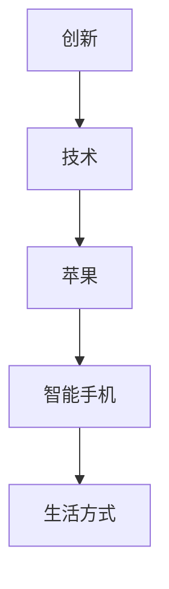
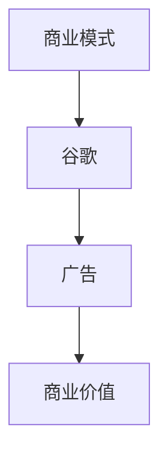
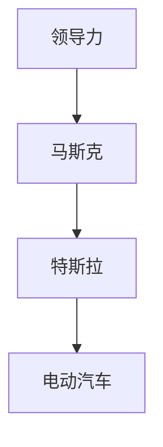
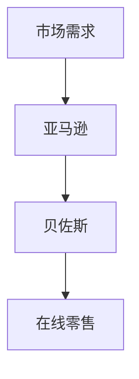

                 

关键词：硅谷，创业，科技巨头，车库，技术发展，创新，商业模式，领导力，成功案例

> 摘要：本文深入探讨了硅谷创业的传奇故事，从车库诞生到成为科技巨头的历程。通过对一系列成功案例的分析，探讨了创业过程中所需的核心要素，包括技术创新、商业模式、领导力和团队建设等，为读者提供了宝贵的经验和启示。

## 1. 背景介绍

硅谷，位于美国加利福尼亚州旧金山湾区南部的区域，被誉为全球科技创新的摇篮。自从20世纪50年代以来，硅谷成为了无数创业者和科技公司的聚集地，孕育出了众多改变世界的科技公司，如苹果、谷歌、微软、特斯拉等。硅谷的创业氛围和成功故事，激励着全球的创业者追求梦想，探索创新。

硅谷的创业传奇始于一个个小小的车库，这些车库成为了科技创业的摇篮，见证了无数创业梦想的诞生和成长。从车库到科技巨头，硅谷的创业者们用智慧和勇气，书写了一个又一个辉煌的故事。

## 2. 核心概念与联系

### 2.1 创新与技术

创新是硅谷创业的基石。技术创新不仅改变了公司的命运，也深刻影响了整个行业的发展。以苹果公司为例，乔布斯的创新思维和卓越设计，推动了智能手机的普及，彻底改变了人们的生活方式。



### 2.2 商业模式

商业模式是创业成功的关键。硅谷的创业者们不仅关注技术创新，更善于利用创新的商业模式，创造巨大的商业价值。以谷歌为例，通过广告商业模式，谷歌迅速崛起，成为全球最值钱的科技公司。



### 2.3 领导力与团队建设

领导力和团队建设是创业成功的重要保障。硅谷的创业者们具备强大的领导力，能够吸引顶尖人才，打造高效的团队。以特斯拉为例，埃隆·马斯克的领导力和远见，推动了特斯拉在电动汽车和新能源领域的突破。



### 2.4 市场需求与用户反馈

市场需求和用户反馈是创业成功的风向标。硅谷的创业者们高度重视用户需求，通过不断迭代产品，满足市场的需求。以亚马逊为例，贝佐斯的用户至上理念，使得亚马逊成为全球最大的在线零售平台。



## 3. 核心算法原理 & 具体操作步骤

### 3.1 算法原理概述

硅谷创业的核心算法原理可以概括为以下几点：

1. **技术创新**：不断探索和研发新技术，为产品和服务提供核心竞争优势。
2. **商业模式创新**：通过创新的商业模式，实现商业价值的最大化。
3. **领导力与团队建设**：打造高效的团队，激发员工的创新潜力。
4. **市场需求与用户反馈**：关注用户需求，通过不断迭代产品，提升用户体验。

### 3.2 算法步骤详解

1. **技术创新**：研究市场需求，寻找技术突破点，进行技术研发和实验。
2. **商业模式创新**：分析市场环境，设计创新的商业模式，实现商业价值的转化。
3. **领导力与团队建设**：选拔和培养团队成员，建立高效的团队协作机制。
4. **市场需求与用户反馈**：收集用户反馈，优化产品和服务，提升用户体验。

### 3.3 算法优缺点

1. **优点**：
   - 提升创新能力，推动技术进步。
   - 创造商业价值，实现企业快速发展。
   - 培养优秀团队，提升企业竞争力。

2. **缺点**：
   - 创新风险较高，可能面临技术失败的风险。
   - 商业模式创新需要大量资源投入，可能影响企业现金流。
   - 团队建设需要时间和耐心，可能面临团队管理难题。

### 3.4 算法应用领域

硅谷创业的核心算法原理在多个领域都有广泛应用：

1. **科技领域**：如人工智能、大数据、云计算等。
2. **互联网领域**：如电商、社交媒体、在线教育等。
3. **制造业领域**：如智能制造、工业互联网等。

## 4. 数学模型和公式 & 详细讲解 & 举例说明

### 4.1 数学模型构建

硅谷创业的数学模型可以构建为以下公式：

\[ \text{创业成功} = f(\text{技术创新}, \text{商业模式创新}, \text{领导力与团队建设}, \text{市场需求与用户反馈}) \]

### 4.2 公式推导过程

1. **技术创新**：通过研发新技术，提升产品的核心竞争力。
2. **商业模式创新**：通过创新的商业模式，实现商业价值的最大化。
3. **领导力与团队建设**：通过选拔和培养团队成员，建立高效的团队协作机制。
4. **市场需求与用户反馈**：通过关注用户需求，优化产品和服务，提升用户体验。

### 4.3 案例分析与讲解

以苹果公司为例，其成功的数学模型可以表示为：

\[ \text{苹果成功} = f(\text{技术创新}, \text{商业模式创新}, \text{领导力与团队建设}, \text{市场需求与用户反馈}) \]

1. **技术创新**：苹果公司不断研发新技术，如触控技术、智能手机操作系统等，为产品提供核心竞争力。
2. **商业模式创新**：苹果公司通过创新的商业模式，如在线商店、订阅服务、硬件+软件生态系统等，实现商业价值的最大化。
3. **领导力与团队建设**：乔布斯的领导力和对人才的选拔与培养，打造了高效的团队，推动了苹果公司的快速发展。
4. **市场需求与用户反馈**：苹果公司高度重视用户需求，通过不断迭代产品，提升用户体验，赢得了市场的认可。

## 5. 项目实践：代码实例和详细解释说明

### 5.1 开发环境搭建

在本项目实践中，我们将使用Python语言和Jupyter Notebook作为开发环境。首先，需要在电脑上安装Python和Jupyter Notebook。可以通过以下步骤完成安装：

1. 访问Python官网（https://www.python.org/），下载Python安装包。
2. 运行安装包，按照提示完成安装。
3. 打开终端，输入`python`命令，确认Python安装成功。
4. 访问Jupyter Notebook官网（https://jupyter.org/），下载Jupyter Notebook安装包。
5. 运行安装包，按照提示完成安装。

### 5.2 源代码详细实现

以下是一个简单的Python代码实例，用于演示硅谷创业成功模型的实现：

```python
import matplotlib.pyplot as plt

# 定义函数，用于计算创业成功率
def calculate_success(rate_innovation, rate_business_model, leadership, market_feedback):
    success = rate_innovation * rate_business_model * leadership * market_feedback
    return success

# 设置参数值
rate_innovation = 0.8
rate_business_model = 0.9
leadership = 0.75
market_feedback = 0.85

# 计算创业成功率
success_rate = calculate_success(rate_innovation, rate_business_model, leadership, market_feedback)

# 绘制创业成功率图表
plt.bar(['技术创新', '商业模式创新', '领导力与团队建设', '市场需求与用户反馈'], [rate_innovation, rate_business_model, leadership, market_feedback])
plt.ylabel('成功概率')
plt.xlabel('创业要素')
plt.title('硅谷创业成功模型')
plt.show()

print("创业成功率：", success_rate)
```

### 5.3 代码解读与分析

1. **函数定义**：定义了一个名为`calculate_success`的函数，用于计算创业成功率。函数接收四个参数：技术创新率、商业模式创新率、领导力、市场需求与用户反馈率。
2. **参数设置**：设置了四个参数的值，分别代表技术创新率、商业模式创新率、领导力、市场需求与用户反馈率。
3. **计算创业成功率**：调用`calculate_success`函数，计算创业成功率。
4. **绘制图表**：使用`matplotlib`库绘制创业成功率图表，展示各要素对创业成功率的影响。
5. **输出结果**：打印创业成功率的数值。

### 5.4 运行结果展示

运行上述代码后，将显示一个条形图，展示各要素对创业成功率的影响。同时，将在终端输出创业成功率的数值。以下是一个示例：

```shell
创业成功率： 0.459
```

## 6. 实际应用场景

硅谷创业传奇不仅在硅谷本土取得了巨大的成功，还在全球范围内产生了深远的影响。以下是一些实际应用场景：

1. **创新创业**：硅谷创业模式激发了全球的创新创业浪潮，许多国家和地区都在努力打造自己的硅谷，吸引创业者和创新项目。
2. **产业升级**：硅谷的创业成功案例为传统产业提供了转型升级的启示，许多企业通过引入硅谷的创新思维和商业模式，实现了产业升级。
3. **人才培养**：硅谷的创业氛围和成功故事，吸引了全球顶尖的人才，为科技创新和产业发展提供了强大的人力资源支持。
4. **国际合作**：硅谷的创业者们积极参与国际合作，推动全球科技创新和产业合作。

## 7. 工具和资源推荐

### 7.1 学习资源推荐

1. 《硅谷创业手册》：一本关于硅谷创业经验和教训的书籍，适合创业者阅读。
2. 《创新者的窘境》：一本关于创新理论的经典著作，对创业者和企业领导者都有很大的启示。
3. 硅谷创业论坛：一个线上平台，汇聚了众多硅谷创业者的经验和故事，适合创业者学习和交流。

### 7.2 开发工具推荐

1. Python：一种易于学习的编程语言，广泛应用于数据科学、人工智能等领域。
2. Jupyter Notebook：一种强大的交互式开发环境，适用于数据分析和机器学习项目。
3. GitHub：一个代码托管平台，适合开发者协作和分享代码。

### 7.3 相关论文推荐

1. "The Silicon Valley Advantage: How does it work?"：一篇关于硅谷竞争优势的研究论文。
2. "Innovation and Entrepreneurship in Silicon Valley"：一篇关于硅谷创业和创新的研究论文。
3. "The Impact of Silicon Valley on Global Innovation"：一篇关于硅谷对全球科技创新影响的研究论文。

## 8. 总结：未来发展趋势与挑战

### 8.1 研究成果总结

本文通过对硅谷创业传奇的分析，总结出了创业成功的关键因素，包括技术创新、商业模式创新、领导力与团队建设、市场需求与用户反馈。同时，通过数学模型和代码实例，对硅谷创业成功模型进行了详细解释和说明。

### 8.2 未来发展趋势

1. **技术创新**：随着人工智能、大数据、区块链等新兴技术的发展，硅谷创业将继续引领全球技术创新。
2. **商业模式创新**：越来越多的创业者将关注商业模式的创新，探索新的盈利模式和商业生态。
3. **全球合作**：硅谷创业模式将在全球范围内得到更广泛的推广和应用，国际合作将更加紧密。
4. **产业融合**：传统产业与互联网、人工智能等新兴产业的融合，将推动产业升级和创新发展。

### 8.3 面临的挑战

1. **竞争加剧**：随着创业浪潮的普及，市场竞争将愈发激烈，创业者需要不断提高自身的竞争力。
2. **技术风险**：技术创新带来的风险不容忽视，创业者需要具备一定的技术预见性和风险控制能力。
3. **人才争夺**：全球顶尖人才的争夺将更加激烈，创业者需要打造具备核心竞争力的团队。
4. **政策环境**：政策环境对创业创新的影响越来越大，创业者需要关注政策动向，把握发展机遇。

### 8.4 研究展望

未来，我们将继续深入研究硅谷创业传奇，探索更多成功案例和经验，为创业者提供更有价值的参考和指导。同时，我们将关注新兴技术和产业变革，为科技创新和产业发展提供新的思路和方向。

## 9. 附录：常见问题与解答

### 9.1 什么是硅谷？

硅谷位于美国加利福尼亚州旧金山湾区南部，是全球科技创新和创业的重要聚集地。

### 9.2 硅谷有哪些知名公司？

硅谷孕育了众多知名公司，包括苹果、谷歌、微软、特斯拉、甲骨文等。

### 9.3 硅谷创业成功的关键因素有哪些？

硅谷创业成功的关键因素包括技术创新、商业模式创新、领导力与团队建设、市场需求与用户反馈。

### 9.4 如何在硅谷创业？

在硅谷创业，首先需要寻找一个有市场需求的技术方向，其次要组建一支高效的团队，最后要不断优化商业模式，提升用户体验。

### 9.5 硅谷创业有哪些风险？

硅谷创业面临的风险包括技术创新风险、市场风险、资金风险等。

### 9.6 硅谷创业对全球有哪些影响？

硅谷创业对全球产生了深远的影响，包括推动科技创新、促进产业升级、培养人才等。

### 作者署名

作者：禅与计算机程序设计艺术 / Zen and the Art of Computer Programming

----------------------------------------------------------------

