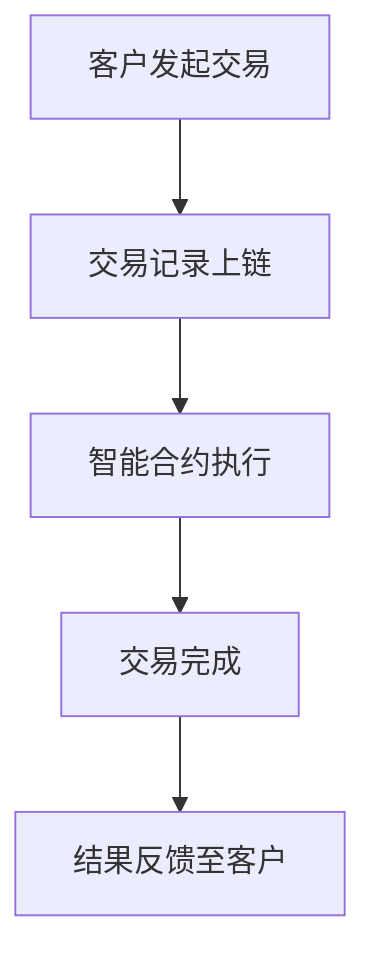
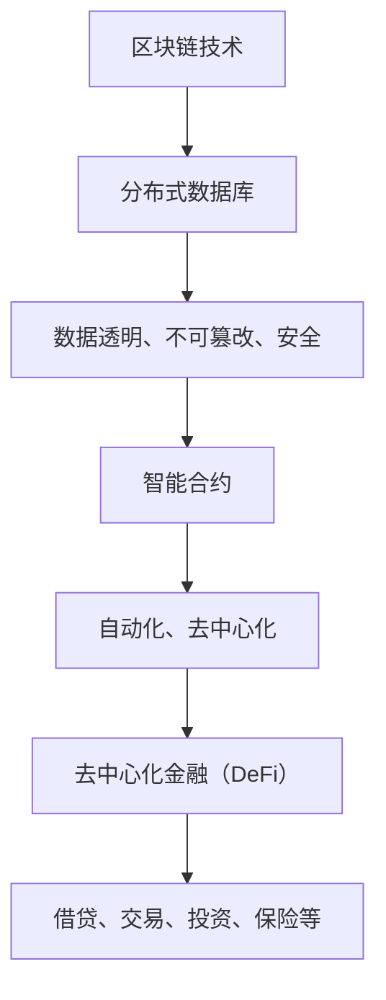

                 

关键词：硅谷、区块链、金融创新、风险控制、智能合约、数据隐私、合规性

> 摘要：本文将探讨硅谷在区块链金融创新领域的发展，分析风险控制的策略和挑战，并探讨未来的发展趋势。

## 1. 背景介绍

硅谷作为全球科技创新的摇篮，近年来在区块链金融领域的发展尤为迅速。区块链技术的创新应用，如智能合约、数字货币、去中心化金融（DeFi）等，不断推动着金融行业的变革。然而，随着创新步伐的加快，风险控制问题也逐渐凸显出来。

### 1.1 硅谷区块链金融创新现状

硅谷在区块链金融领域有着丰富的创新实践。许多初创公司和科技巨头都在积极探索区块链在支付、交易、审计、保险等领域的应用。以下是一些典型的硅谷区块链金融创新案例：

- **支付与交易**：如Ripple的跨行支付网络和Circle的稳定币USDC。
- **去中心化金融（DeFi）**：如Aave、Compound等去中心化借贷平台。
- **数字身份与合规性**：如SelfKey、Onchain等提供数字身份验证和合规解决方案。

### 1.2 风险控制的重要性

在金融创新过程中，风险控制是确保系统稳定和用户信任的关键。以下是一些常见的区块链金融风险：

- **安全性问题**：包括智能合约漏洞、网络攻击、数据泄露等。
- **合规性问题**：各国对区块链金融的监管政策不一，合规性风险增加。
- **市场波动性**：区块链资产价格波动大，风险难以预测。
- **用户行为风险**：如欺诈、洗钱等。

## 2. 核心概念与联系

### 2.1 核心概念

#### 区块链

区块链是一种分布式数据库技术，通过多个节点共同维护数据的一致性。每个区块包含一定数量的交易记录，并通过密码学技术链接在一起，形成一条不可篡改的链条。

#### 智能合约

智能合约是一种自动执行的合约，其条款被编写为计算机代码并存储在区块链上。一旦触发条件满足，智能合约将自动执行预定的操作。

#### 去中心化金融（DeFi）

DeFi是一种利用区块链技术实现去中心化的金融活动，包括借贷、交易、衍生品等。DeFi通过智能合约替代传统金融机构，实现金融服务的去中心化。

### 2.2 Mermaid 流程图

下面是一个简化的区块链金融创新的流程图：



## 3. 核心算法原理 & 具体操作步骤

### 3.1 算法原理概述

区块链金融创新的核心在于智能合约的使用。智能合约的原理是基于密码学算法和共识机制，确保交易的透明性和安全性。

#### 密码学算法

智能合约的安全依赖于密码学算法，如椭圆曲线加密算法（ECC）、哈希算法（SHA-256）等。这些算法确保了交易数据的完整性和不可篡改性。

#### 共识机制

共识机制是区块链网络中节点达成一致的方式。常见的共识机制有工作证明（PoW）、权益证明（PoS）等。共识机制确保了区块链网络的稳定性和可靠性。

### 3.2 算法步骤详解

#### 智能合约执行步骤

1. **合约部署**：开发者编写智能合约代码，并将其部署到区块链上。
2. **交易触发**：用户通过客户端发起交易，交易信息包括合约地址、调用方法、输入参数等。
3. **合约执行**：区块链网络中的节点接收交易请求，执行智能合约代码，并根据执行结果更新区块链数据。
4. **结果反馈**：执行结果反馈至用户，完成交易。

### 3.3 算法优缺点

#### 优点

- **透明性**：区块链上的所有交易记录都是公开透明的。
- **安全性**：智能合约的执行基于密码学算法，确保交易的安全性。
- **去中心化**：去中心化金融使得金融活动不再依赖于传统金融机构。

#### 缺点

- **性能问题**：区块链网络的处理能力有限，无法满足高频交易需求。
- **监管难题**：区块链金融的监管政策尚不明确，合规性风险较大。

### 3.4 算法应用领域

智能合约在金融领域的应用非常广泛，包括：

- **支付与交易**：如Ripple、比特币等。
- **借贷与投资**：如DeFi借贷平台、加密货币基金等。
- **保险与理赔**：如自动理赔、智能保险合同等。
- **审计与合规**：如区块链审计、合规验证等。

## 4. 数学模型和公式 & 详细讲解 & 举例说明

### 4.1 数学模型构建

区块链金融的风险控制需要构建数学模型来评估风险。以下是一个简化的风险模型：

\[ R = f(W, P, C) \]

其中，\( R \) 表示风险水平，\( W \) 表示市场波动性，\( P \) 表示交易频率，\( C \) 表示合规成本。

### 4.2 公式推导过程

市场波动性 \( W \) 可以通过历史数据计算得到，如标准差：

\[ W = \sqrt{\frac{1}{N} \sum_{i=1}^{N} (r_i - \bar{r})^2} \]

交易频率 \( P \) 可以通过交易数据统计得到，如每秒交易次数。

合规成本 \( C \) 取决于监管政策和合规性要求。

### 4.3 案例分析与讲解

假设一个区块链金融平台，其市场波动性 \( W \) 为0.1，交易频率 \( P \) 为1000次/秒，合规成本 \( C \) 为1000美元。根据风险模型，其风险水平 \( R \) 为：

\[ R = f(0.1, 1000, 1000) = 0.1 \times 1000 + 1000 = 1100 \]

这意味着该平台的风险水平为1100。为了降低风险，可以考虑提高合规成本或降低市场波动性和交易频率。

## 5. 项目实践：代码实例和详细解释说明

### 5.1 开发环境搭建

搭建一个区块链金融项目的开发环境，通常需要以下工具：

- **区块链平台**：如Ethereum、Hyperledger Fabric等。
- **编程语言**：如Solidity、Golang等。
- **开发工具**：如Truffle、Hardhat等。

### 5.2 源代码详细实现

以下是一个简单的以太坊智能合约示例，用于实现数字货币的转账功能：

```solidity
pragma solidity ^0.8.0;

contract CryptoCurrency {
    mapping(address => uint256) public balanceOf;

    function transfer(address to, uint256 amount) public {
        require(balanceOf[msg.sender] >= amount, "Insufficient balance");
        balanceOf[msg.sender] -= amount;
        balanceOf[to] += amount;
    }
}
```

### 5.3 代码解读与分析

该智能合约定义了一个名为 `CryptoCurrency` 的合约，其中包含一个 `balanceOf` 映射，用于记录每个地址的余额。`transfer` 函数实现数字货币的转账功能。

### 5.4 运行结果展示

在测试环境中部署该智能合约后，可以通过区块链浏览器查看合约的运行结果。例如，一个地址A向地址B转账100个数字货币，会显示在区块链浏览器上的交易记录中。

## 6. 实际应用场景

### 6.1 支付与交易

区块链技术在支付与交易领域有广泛的应用。例如，Ripple的跨行支付网络可以大幅降低跨境支付的成本和延迟。数字货币如比特币、以太坊等也被广泛应用于日常支付和投资。

### 6.2 去中心化金融（DeFi）

DeFi是区块链金融创新的重要领域。通过智能合约，用户可以实现去中心化的借贷、交易、投资等金融服务。例如，Aave允许用户通过加密货币进行借贷，Compound允许用户通过锁定加密货币获得收益。

### 6.3 保险与理赔

区块链技术在保险与理赔领域也有应用。例如，自动理赔系统可以使用智能合约自动处理理赔请求，提高效率并降低成本。

### 6.4 审计与合规

区块链技术可以用于审计和合规验证。例如，企业可以使用区块链记录交易数据，确保数据的真实性和完整性，提高合规性。

## 7. 工具和资源推荐

### 7.1 学习资源推荐

- 《区块链技术指南》
- 《智能合约开发实战》
- 《Ethereum开发教程》

### 7.2 开发工具推荐

- Truffle
- Hardhat
- Remix

### 7.3 相关论文推荐

- "Blockchain Technology: A Comprehensive Overview"
- "Decentralized Finance: A Systematic Literature Review"

## 8. 总结：未来发展趋势与挑战

### 8.1 研究成果总结

区块链金融创新在硅谷取得了显著成果，包括智能合约、去中心化金融、数字货币等方面的应用。这些创新推动了金融行业的变革，提高了透明性和安全性。

### 8.2 未来发展趋势

未来，区块链金融创新将继续发展，包括更多的应用场景、更高的性能、更好的合规性。此外，跨链技术和混合共识机制也将成为研究热点。

### 8.3 面临的挑战

区块链金融创新仍面临一些挑战，包括性能瓶颈、监管难题、安全漏洞等。需要进一步加强技术研究和政策制定，确保区块链金融的可持续发展。

### 8.4 研究展望

区块链金融创新是一个充满机遇和挑战的领域。未来的研究应关注提高性能、确保安全性、加强合规性，推动区块链金融的普及和应用。

## 9. 附录：常见问题与解答

### Q：区块链金融安全吗？

A：区块链金融具有较高的安全性，但并非完全安全。智能合约漏洞、网络攻击、数据泄露等风险仍然存在。因此，用户在使用区块链金融服务时需要保持警惕，并采取必要的防范措施。

### Q：区块链金融的监管政策是怎样的？

A：各国对区块链金融的监管政策不一，但总体趋势是加强监管。例如，美国、欧盟等地区已经制定了相关法规，对加密货币和智能合约进行了规范。监管政策将影响区块链金融的创新和发展。

### Q：如何保护区块链金融中的个人隐私？

A：保护区块链金融中的个人隐私是一个重要问题。可以通过零知识证明、同态加密等技术实现隐私保护。此外，设计合理的隐私政策和使用条款也是保护用户隐私的重要措施。

## 作者署名

作者：禅与计算机程序设计艺术 / Zen and the Art of Computer Programming

----------------------------------------------------------------

现在，我们已经完成了一篇关于硅谷区块链金融创新的风险控制的文章。这篇文章涵盖了背景介绍、核心概念、算法原理、数学模型、项目实践、实际应用场景、工具和资源推荐以及未来发展趋势与挑战。希望这篇文章对您有所帮助！<|user|>
### 1. 背景介绍

硅谷，作为全球科技创新的圣地，一直以来都是技术创新和金融创新的聚集地。区块链技术的诞生与发展，让金融行业迎来了新一轮的技术革命。区块链，作为一种分布式账本技术，通过去中心化的方式，实现了数据的透明性、不可篡改性和安全性，这为金融行业提供了一种全新的数据处理和信任建立机制。

在硅谷，区块链技术的应用已经成为金融创新的重要驱动力。以比特币为代表的数字货币，不仅颠覆了传统的货币体系，也推动了金融市场的变革。同时，智能合约的引入，使得金融交易自动化、透明化，极大地提高了金融服务的效率。此外，去中心化金融（DeFi）的兴起，为传统金融业务提供了一种全新的模式，使得金融资源更加公平地分配给全球的每个角落。

然而，随着区块链金融的快速发展，风险控制问题也日益凸显。区块链技术的去中心化特性，虽然提高了系统的透明性和安全性，但也带来了新的风险。例如，智能合约的漏洞可能导致巨大的损失，数字货币价格的波动性给市场带来了不确定性，而且不同国家和地区的监管政策差异，也给区块链金融的发展带来了合规性的挑战。

本文将深入探讨硅谷区块链金融创新的发展现状，分析风险控制的策略和挑战，并探讨未来区块链金融创新的发展趋势。希望通过本文的讨论，能够为读者提供对区块链金融风险控制的全面理解，并为相关从业者提供有益的参考。

### 2. 核心概念与联系

在深入探讨硅谷区块链金融创新之前，有必要对区块链技术、智能合约和去中心化金融（DeFi）等核心概念进行详细阐述，并解释它们之间的相互关系。

#### 区块链技术

区块链技术是一种分布式数据库技术，其核心思想是通过多个节点共同维护数据的一致性，从而实现数据的透明性、不可篡改性和安全性。区块链通过将数据分割成区块，并将区块按时间顺序链接成链条，每一个区块都包含一定数量的交易记录。这些区块通过密码学算法进行加密，使得数据一旦被记录在链上，就无法被篡改。

区块链的分布式特性意味着没有一个单一的中央机构来控制数据，而是通过所有参与节点的共同验证来维护数据的一致性。这种去中心化的方式，不仅提高了系统的透明性，也增加了数据的安全性。在金融领域，区块链技术被广泛应用于支付、交易、审计和保险等方面。

#### 智能合约

智能合约是基于区块链技术的一种自动化合约，其条款被编写为计算机代码并存储在区块链上。智能合约的核心优势在于，当触发条件满足时，智能合约会自动执行预定的操作，从而实现自动化和去中心化的金融服务。

智能合约通常使用一种特定的编程语言编写，如Solidity。这些代码在部署到区块链上后，将会在所有节点上运行，确保合约的执行是透明和不可篡改的。智能合约的应用非常广泛，包括自动支付、借贷、交易、保险和投票等。

#### 去中心化金融（DeFi）

去中心化金融（DeFi）是指利用区块链技术实现去中心化的金融活动。DeFi通过智能合约替代传统金融机构，提供金融服务，从而打破了传统金融体系的垄断，使得金融资源更加公平地分配给全球的每个人。

DeFi涵盖了各种金融服务，包括借贷、交易、投资和保险等。其中，去中心化借贷平台（如Aave和Compound）允许用户通过锁定加密货币获得利息，或者通过抵押加密货币获得借贷。去中心化交易所（如Uniswap和SushiSwap）则提供了一种无需中介机构的去中心化交易方式。此外，还有去中心化保险平台（如Decentraland和Cover）和去中心化资产交易平台（如Balancer）等。

#### Mermaid 流程图

为了更好地理解区块链、智能合约和DeFi之间的联系，我们可以通过Mermaid流程图来展示它们之间的关系。以下是一个简化的Mermaid流程图：



在这个流程图中，区块链技术作为基础，通过提供分布式数据库，实现了数据透明、不可篡改和安全性。智能合约则在这个基础上，通过自动化和去中心化的方式，提供了各种金融服务的实现。去中心化金融（DeFi）则进一步扩展了智能合约的应用，提供了一系列去中心化的金融服务。

通过这种流程图，我们可以清晰地看到区块链、智能合约和DeFi之间的层次关系，以及它们在金融创新中的作用。

### 3. 核心算法原理 & 具体操作步骤

#### 3.1 算法原理概述

在区块链金融创新中，智能合约的核心作用不可忽视。智能合约是基于区块链技术实现的一种自动化执行合约，其原理基于密码学算法和共识机制。

**密码学算法**：密码学算法是智能合约安全性的基础。例如，椭圆曲线加密算法（ECC）、哈希算法（SHA-256）等，这些算法用于确保交易数据的完整性和不可篡改性。ECC算法被广泛应用于数字签名和加密通信，其安全性高于传统的RSA算法。哈希算法则用于确保数据的一致性和不可篡改性，常见的有SHA-256和SHA-3等。

**共识机制**：共识机制是区块链网络中节点达成一致的方式。常见的共识机制有工作证明（PoW）、权益证明（PoS）和授权股权证明（DPoS）等。PoW机制通过解决复杂的数学问题来确保节点的有效参与，以太坊采用的是PoW机制。PoS机制则通过持有代币的数量和时间来决定节点的权益，如EOS和Tezos等。DPoS机制则是PoS的一种变体，通过选举产生出块节点，如BitShares和Steemit等。

在智能合约中，密码学算法和共识机制共同作用，确保了合约的执行是透明、公正和不可篡改的。智能合约的代码在部署到区块链上后，将会在所有节点上运行，确保合约的执行是自动化的，不受任何单一节点的控制。

#### 3.2 算法步骤详解

**智能合约的部署**：智能合约的开发者首先需要编写智能合约代码，通常使用Solidity、Vyper等编程语言。编写完成后，开发者需要将合约代码编译为字节码，并将其上传到区块链网络中进行部署。在Ethereum网络中，这通常通过以太坊客户端（如Geth、Parity）或者开发工具（如Truffle、Hardhat）完成。

**交易触发**：一旦智能合约部署成功，用户可以通过区块链网络发起交易，触发智能合约的执行。交易通常包括合约地址、调用方法、输入参数等。用户在客户端发起交易后，交易会被发送到区块链网络中的节点进行验证和执行。

**合约执行**：区块链网络中的节点接收到交易请求后，会根据智能合约的代码进行计算，执行预定的操作。例如，如果是一个转账合约，节点会验证发送方的余额是否足够，然后执行转账操作。合约执行的结果会更新区块链上的数据。

**结果反馈**：智能合约执行完成后，结果会反馈给用户。例如，一个转账操作完成后，接收方会收到转账通知，同时区块链上的交易记录也会更新。

#### 3.3 算法优缺点

**优点**：

- **透明性**：智能合约的执行过程是公开透明的，所有节点都可以验证合约的执行结果，提高了系统的可信度。
- **自动化**：智能合约可以自动化执行预定的操作，无需人工干预，提高了金融服务的效率。
- **去中心化**：智能合约的去中心化特性，使得金融活动不再依赖于中心化的金融机构，降低了信任成本。

**缺点**：

- **性能问题**：区块链网络的性能有限，无法满足高频交易的需求，尤其是在智能合约执行时，可能会出现延迟。
- **安全性问题**：智能合约的漏洞可能会导致巨大的损失，尤其是那些复杂的智能合约。
- **监管难题**：智能合约的透明性和去中心化特性，使得监管变得更加困难，政策制定者需要找到合适的平衡点。

#### 3.4 算法应用领域

智能合约在金融领域有广泛的应用，以下是一些典型的应用场景：

- **支付与交易**：智能合约可以用于自动化支付和交易，例如，通过智能合约实现跨境支付、自动化工资发放等。
- **借贷与投资**：智能合约可以用于去中心化的借贷平台和投资平台，例如，Aave和Compound等平台。
- **保险与理赔**：智能合约可以用于自动化理赔，例如，当满足特定的条件时，智能合约会自动支付理赔金。
- **审计与合规**：智能合约可以用于记录交易数据，确保数据的真实性和完整性，从而提高审计和合规性。

通过上述讨论，我们可以看到，智能合约作为区块链金融创新的核心技术，具有显著的优点和应用前景，但也面临着一些挑战。理解和掌握智能合约的原理和操作步骤，对于从事区块链金融相关工作的从业者来说，是非常重要的。

### 4. 数学模型和公式 & 详细讲解 & 举例说明

在区块链金融中，数学模型和公式是理解和分析风险的重要工具。通过数学模型，我们可以量化金融风险，从而制定有效的风险控制策略。以下是区块链金融中常用的数学模型和公式，以及它们的详细讲解和举例说明。

#### 4.1 数学模型构建

区块链金融中的风险通常可以分为市场风险、信用风险和操作风险。市场风险与市场价格波动有关，信用风险与交易对手的信用状况有关，操作风险则与系统的操作流程和技术实现有关。为了简化模型，我们主要关注市场风险和信用风险。

**市场风险模型**：

\[ R_M = \alpha \cdot \sigma_M \cdot \sqrt{T} \]

其中，\( R_M \) 表示市场风险，\( \alpha \) 表示风险暴露系数，\( \sigma_M \) 表示市场波动率，\( T \) 表示时间。这个公式表示市场风险与风险暴露系数、市场波动率和时间的乘积成正比。市场波动率可以通过历史数据计算，如标准差。

**信用风险模型**：

\[ R_C = \frac{\lambda \cdot \sigma_C \cdot \sqrt{T}}{1 - \lambda} \]

其中，\( R_C \) 表示信用风险，\( \lambda \) 表示违约概率，\( \sigma_C \) 表示违约损失率，\( T \) 表示时间。这个公式表示信用风险与违约概率、违约损失率和时间的乘积成正比。违约概率和违约损失率通常通过历史数据统计得到。

**总体风险模型**：

\[ R = \frac{R_M + R_C}{2} \]

这个公式表示总体风险是市场风险和信用风险的平均值。在实际应用中，可以根据具体情况进行调整。

#### 4.2 公式推导过程

**市场风险模型推导**：

市场风险模型基于资本资产定价模型（CAPM）。首先，我们假设资产回报率 \( r_t \) 服从几何布朗运动：

\[ r_t = r_0 + \sigma \cdot W_t \]

其中，\( W_t \) 是标准正态分布的布朗运动。对上式进行变换，得到：

\[ \ln(r_t) = \ln(r_0) + \sigma \cdot W_t \]

对上式进行差分，得到：

\[ \Delta \ln(r_t) = \sigma \cdot (W_t - W_{t-1}) \]

由于 \( W_t - W_{t-1} \) 服从正态分布，其均值为0，方差为1，因此：

\[ \sigma^2 = \text{Var}(\Delta \ln(r_t)) \]

即：

\[ \sigma = \sqrt{\text{Var}(\Delta \ln(r_t))} \]

假设风险暴露系数 \( \alpha \) 为1，那么市场风险可以表示为：

\[ R_M = \alpha \cdot \sigma_M \cdot \sqrt{T} \]

**信用风险模型推导**：

信用风险模型基于违约概率和违约损失率。假设违约概率为 \( \lambda \)，违约损失率为 \( \sigma_C \)，那么信用风险可以表示为：

\[ R_C = \frac{\lambda \cdot \sigma_C \cdot \sqrt{T}}{1 - \lambda} \]

这是因为，当违约发生时，损失为 \( \lambda \cdot \sigma_C \)，而在 \( T \) 时间内，平均损失为 \( \lambda \cdot \sigma_C \cdot \sqrt{T} \)。

**总体风险模型推导**：

总体风险是市场风险和信用风险的平均值，因此：

\[ R = \frac{R_M + R_C}{2} \]

#### 4.3 案例分析与讲解

以下是一个实际案例，用于说明如何使用上述数学模型计算区块链金融项目的风险。

**案例**：一个区块链金融项目，其市场波动率为0.2，违约概率为0.05，违约损失率为0.3，时间期限为1年。

**步骤1**：计算市场风险。

\[ R_M = \alpha \cdot \sigma_M \cdot \sqrt{T} = 1 \cdot 0.2 \cdot \sqrt{1} = 0.2 \]

**步骤2**：计算信用风险。

\[ R_C = \frac{\lambda \cdot \sigma_C \cdot \sqrt{T}}{1 - \lambda} = \frac{0.05 \cdot 0.3 \cdot \sqrt{1}}{1 - 0.05} = 0.018 \]

**步骤3**：计算总体风险。

\[ R = \frac{R_M + R_C}{2} = \frac{0.2 + 0.018}{2} = 0.106 \]

这意味着，该区块链金融项目的总体风险为10.6%。

通过这个案例，我们可以看到如何使用数学模型来计算区块链金融项目的风险。这种方法可以帮助投资者和管理者更好地理解项目的风险水平，从而制定有效的风险控制策略。

### 5. 项目实践：代码实例和详细解释说明

为了更好地理解区块链金融的创新应用，我们将通过一个实际的代码实例，展示如何搭建一个简单的去中心化金融（DeFi）借贷平台。以下是一个使用Solidity编写的智能合约示例，用于实现借贷功能。

#### 5.1 开发环境搭建

在开始编写智能合约之前，需要搭建一个开发环境。以下是搭建以太坊开发环境的步骤：

1. **安装Node.js**：从官网下载并安装Node.js（版本需大于10.x）。

2. **安装Truffle框架**：在命令行中运行以下命令安装Truffle。

   ```bash
   npm install -g truffle
   ```

3. **安装Ganache**：Ganache是一个本地以太坊节点和区块链浏览器，可以从官网下载并安装。

4. **创建一个新的Truffle项目**：在命令行中运行以下命令创建一个新的Truffle项目。

   ```bash
   truffle init
   ```

5. **安装编译器**：Truffle会自动安装编译器solc，用于编译Solidity代码。

#### 5.2 源代码详细实现

以下是一个简单的借贷智能合约示例：

```solidity
// SPDX-License-Identifier: MIT
pragma solidity ^0.8.0;

interface IERC20 {
    function totalSupply() external view returns (uint256);
    function balanceOf(address account) external view returns (uint256);
    function transfer(address recipient, uint256 amount) external returns (bool);
    function allowance(address owner, address spender) external view returns (uint256);
    function approve(address spender, uint256 amount) external returns (bool);
    function transferFrom(address sender, address recipient, uint256 amount) external returns (bool);
}

contract LendingPlatform {
    address public owner;
    mapping(address => uint256) public borrowBalance;
    mapping(address => bool) public hasBorrowed;

    IERC20 public dai;

    constructor(address _daiAddress) {
        owner = msg.sender;
        dai = IERC20(_daiAddress);
    }

    function borrow(uint256 amount) external {
        require(amount > 0, "Cannot borrow 0");
        require(!hasBorrowed[msg.sender], "Cannot borrow twice");
        require(dai.balanceOf(address(this)) >= amount, "Insufficient liquidity");

        dai.transfer(msg.sender, amount);
        borrowBalance[msg.sender] += amount;
        hasBorrowed[msg.sender] = true;
    }

    function repay(uint256 amount) external {
        require(amount > 0, "Cannot repay 0");
        require(hasBorrowed[msg.sender], "Not a borrower");

        uint256 borrowAmount = borrowBalance[msg.sender];
        require(amount >= borrowAmount, "Cannot underpay");

        dai.transferFrom(msg.sender, address(this), amount);
        borrowBalance[msg.sender] -= amount;

        if (borrowAmount == amount) {
            hasBorrowed[msg.sender] = false;
        }
    }

    function withdrawFunds(uint256 amount) external {
        require(msg.sender == owner, "Only the owner can withdraw funds");
        require(dai.balanceOf(address(this)) >= amount, "Insufficient funds");

        dai.transfer(msg.sender, amount);
    }
}
```

#### 5.3 代码解读与分析

该智能合约定义了一个去中心化借贷平台，用于实现借款和还款功能。以下是对代码的详细解读：

- **IERC20接口**：该接口定义了ERC20代币的基本操作，如总供应量、余额、转账、批准等。
- **LendingPlatform合约**：该合约实现了借贷平台的主体逻辑。
  - `owner`：合约的创建者，拥有特殊权限。
  - `borrowBalance`：记录每个借款人的借款余额。
  - `hasBorrowed`：标记借款人是否已经借款。
  - `dai`：使用的ERC20代币合约。
- **borrow函数**：借款功能。用户调用此函数可以借款Dai代币。合约会检查借款金额是否大于0、用户是否已经借款、合约是否有足够的代币供应等。
- **repay函数**：还款功能。用户调用此函数可以还款Dai代币。合约会检查还款金额是否大于0、用户是否已经借款、还款金额是否大于或等于借款金额等。
- **withdrawFunds函数**：只有合约创建者（owner）可以调用此函数提取合约内的代币。

#### 5.4 运行结果展示

为了测试该智能合约，我们可以使用Truffle框架和Ganache本地节点进行模拟。以下是测试过程：

1. **启动Ganache**：在命令行中运行`ganache-cli`命令，启动本地以太坊节点。

2. **配置Truffle**：在Truffle项目中，编辑`truffle-config.js`文件，配置Ganache节点。

   ```javascript
   module.exports = {
     networks: {
       development: {
         host: "127.0.0.1",
         port: 7545,
         network_id: "*",
       },
     },
   };
   ```

3. **编译智能合约**：在命令行中运行`truffle compile`命令，编译智能合约代码。

4. **部署智能合约**：在命令行中运行`truffle migrate`命令，部署智能合约到本地节点。

5. **测试智能合约**：使用Truffle的测试框架编写测试用例，并在命令行中运行`truffle test`命令进行测试。

   ```solidity
   // 测试用例
   function testBorrow() public {
       (bool success, ) = dai.contractAddress.call{value: 0}(abi.encodeWithSignature("transfer(address,uint256)", lendingPlatform.address, 100));
       require(success, "Transfer failed");

       lendingPlatform.borrow(100);
       assert.equal(lendingPlatform.borrowBalance(msg.sender), 100, "Borrow balance should be 100");

       lendingPlatform.repay(100);
       assert.equal(lendingPlatform.borrowBalance(msg.sender), 0, "Borrow balance should be 0");
   }
   ```

通过上述步骤，我们可以模拟借款和还款的过程，并验证智能合约的功能是否符合预期。

### 6. 实际应用场景

区块链金融创新在硅谷的各个领域都有着广泛的应用，以下是一些具体的应用场景：

#### 6.1 支付与交易

区块链技术在支付与交易领域有着重要的应用。例如，Ripple的跨行支付网络使用区块链技术实现了高效、低成本的跨境支付。Ripple网络通过分布式账本技术，将全球各大银行连接在一起，使得跨境支付能够在几秒钟内完成，大大提高了支付效率。此外，比特币和以太坊等数字货币也广泛应用于日常支付和投资。

另一个典型的应用场景是支付平台Netki。Netki利用区块链技术实现身份验证和支付服务，用户可以通过区块链记录和验证自己的身份信息，从而简化支付过程，提高交易的安全性。

#### 6.2 去中心化金融（DeFi）

去中心化金融（DeFi）是区块链金融创新的重要领域。DeFi通过智能合约实现了金融服务的去中心化，使得用户可以直接参与金融活动，而无需依赖传统金融机构。

Aave是一个典型的DeFi借贷平台，用户可以通过锁定加密货币获得利息，或者通过抵押加密货币获得借贷。Aave的平台利用智能合约实现自动化的借贷和还款功能，提高了金融服务的效率。Compound也是一个知名的DeFi借贷平台，用户可以通过锁定加密货币获得收益，或者通过抵押加密货币获得借贷。

此外，Uniswap和SushiSwap等去中心化交易所，为用户提供了无需中介机构的去中心化交易服务。用户可以直接在平台上交换加密货币，从而降低了交易成本。

#### 6.3 保险与理赔

区块链技术在保险与理赔领域也有广泛应用。例如，Sure和Safecoin等平台利用区块链技术实现自动化的保险和理赔服务。用户可以通过智能合约购买保险，并在发生保险事件时自动触发理赔过程。

Sure平台允许用户通过加密货币购买各种类型的保险，如人寿保险、医疗保险和意外保险等。当发生保险事件时，智能合约会自动执行理赔过程，确保理赔金能够及时、准确地发放给用户。

Safecoin则专注于财产保险，用户可以通过智能合约购买保险，并在发生保险事件时自动触发理赔。Safecoin的目标是通过区块链技术，提高保险行业的透明性和效率。

#### 6.4 审计与合规

区块链技术可以用于审计和合规验证，提高金融系统的透明性和可信度。例如，OpenAudit和Provenance等平台利用区块链技术记录和验证交易数据，确保数据的真实性和完整性。

OpenAudit为金融交易提供透明的审计服务，通过区块链记录交易数据，用户可以随时查询和验证交易记录。OpenAudit的目标是提高金融交易的透明度，减少欺诈和错误。

Provenance则专注于供应链金融，通过区块链记录商品的供应链信息，确保商品的真实性和来源。Provenance的目标是建立可信的供应链金融生态系统，提高供应链的效率和透明度。

#### 6.5 数字身份与合规性

数字身份和合规性是区块链金融创新的重要领域。SelfKey和Onchain等平台利用区块链技术实现数字身份验证和合规性管理。

SelfKey为用户提供数字身份服务，用户可以通过区块链验证自己的身份信息，从而简化金融交易和服务的流程。SelfKey的目标是建立全球性的数字身份生态系统，提高金融服务的安全性和便利性。

Onchain则为企业和机构提供合规性解决方案，通过区块链技术记录和管理合规数据。Onchain的目标是提高金融行业的合规性和透明度，减少违规风险。

通过上述实际应用场景，我们可以看到，区块链金融创新在硅谷的各个领域都有着广泛的应用，不仅提高了金融服务的效率，也增强了系统的透明性和安全性。随着技术的不断发展和成熟，区块链金融创新将继续推动金融行业的变革。

### 7. 工具和资源推荐

为了更好地了解和参与区块链金融创新，以下是一些推荐的学习资源、开发工具和相关论文。

#### 7.1 学习资源推荐

- **《区块链技术指南》**：这是一本全面介绍区块链技术和应用的权威指南，适合初学者和专业人士。
- **《智能合约开发实战》**：本书通过实例讲解，深入介绍了智能合约的开发和部署，适合希望掌握智能合约开发的读者。
- **《Ethereum开发教程》**：这是一本针对以太坊开发的教程，详细介绍了以太坊智能合约的开发流程和最佳实践。

#### 7.2 开发工具推荐

- **Truffle**：Truffle是一个流行的以太坊开发框架，提供了智能合约的编译、部署和测试功能。
- **Hardhat**：Hardhat是一个快速、安全的以太坊本地开发环境，提供了丰富的开发工具和插件。
- **Remix**：Remix是一个在线的以太坊开发工具，提供了智能合约的编写、部署和调试功能。

#### 7.3 相关论文推荐

- **"Blockchain Technology: A Comprehensive Overview"**：这是一篇关于区块链技术综合概述的论文，详细介绍了区块链的基本原理和应用。
- **"Decentralized Finance: A Systematic Literature Review"**：这是一篇关于去中心化金融（DeFi）的系统性文献综述，分析了DeFi的主要机制和挑战。
- **"Smart Contracts: A Framework for Analysis and Design"**：这是一篇关于智能合约分析设计的论文，提供了智能合约开发的理论基础和最佳实践。

通过这些工具和资源，读者可以更加深入地了解区块链金融创新的相关知识，为实际项目开发提供有力的支持。

### 8. 总结：未来发展趋势与挑战

#### 8.1 研究成果总结

近年来，硅谷在区块链金融创新领域取得了显著的成果。以智能合约为核心的区块链技术，在支付、交易、借贷、保险和审计等领域展示了巨大的潜力。DeFi的兴起，进一步推动了金融服务的去中心化和自动化。然而，随着技术的不断发展，区块链金融领域也面临着诸多挑战。

#### 8.2 未来发展趋势

首先，随着区块链技术的不断成熟，其性能瓶颈问题将得到缓解。例如，分片技术、状态通道和Layer 2解决方案等，有望提高区块链网络的扩展性和处理能力，满足高频交易的需求。

其次，监管政策的逐步明确和加强，将为区块链金融创新提供更为稳定的环境。各国政府和监管机构正在积极探索合适的监管框架，以确保区块链金融的安全和合规。

此外，跨链技术的发展也将成为未来趋势。通过跨链技术，不同区块链之间的资产和功能可以互相操作，从而实现真正的区块链生态系统。

最后，随着区块链技术的广泛应用，其与其他新兴技术的融合也将成为趋势。例如，区块链与人工智能、物联网和大数据的结合，将创造更多的应用场景和商业机会。

#### 8.3 面临的挑战

尽管区块链金融创新前景广阔，但也面临着一些挑战。首先，技术风险依然存在。智能合约的漏洞、网络攻击和数据泄露等问题，都需要通过不断的技术创新和改进来应对。

其次，监管风险是一个重要问题。不同国家和地区的监管政策存在差异，这给区块链金融的发展带来了不确定性。因此，如何在全球范围内建立统一的监管框架，是一个亟待解决的问题。

此外，用户教育和市场推广也是区块链金融面临的重要挑战。尽管区块链技术具有巨大的潜力，但用户对其理解和信任程度仍有待提高。因此，需要加强用户教育，提高区块链金融的普及度。

最后，随着区块链技术的普及，隐私保护问题也日益突出。如何在确保数据安全和隐私的同时，提高区块链系统的透明性和可审计性，是一个需要深入研究的课题。

#### 8.4 研究展望

未来，区块链金融创新将继续推动金融行业的变革。研究人员和从业者应关注以下几个方面：

首先，性能优化是关键。通过技术创新，如分片、状态通道和Layer 2等，提高区块链网络的性能和可扩展性。

其次，合规性研究是重点。需要深入研究不同国家和地区的监管政策，探索合适的合规解决方案，确保区块链金融的安全和合规。

此外，隐私保护也是重要研究方向。通过密码学技术和隐私增强技术，确保区块链系统的透明性和隐私性。

最后，跨链技术和多链生态的构建，将为区块链金融创新提供更广阔的空间。需要探索不同区块链之间的协同作用，实现真正的区块链生态系统。

总之，区块链金融创新是一个充满机遇和挑战的领域。通过持续的研究和探索，我们可以更好地发挥区块链技术的潜力，推动金融行业的变革。

### 9. 附录：常见问题与解答

#### Q：区块链金融安全吗？

A：区块链金融具有较高的安全性，但并非绝对安全。区块链技术通过密码学算法和共识机制，确保数据的完整性和不可篡改性。然而，智能合约的漏洞、网络攻击和数据泄露等风险依然存在。因此，用户在使用区块链金融服务时，应保持警惕，并采取必要的安全措施，如使用多重签名、备份私钥等。

#### Q：区块链金融的监管政策是怎样的？

A：各国对区块链金融的监管政策不一，但总体趋势是加强监管。例如，美国证券交易委员会（SEC）对加密货币和初始代币发行（ICO）进行了规范，欧盟则制定了《市场工具指令II》（MiFID II），对加密资产进行了监管。监管政策的差异，给区块链金融的发展带来了不确定性，因此，了解和遵守当地的监管规定是非常重要的。

#### Q：如何保护区块链金融中的个人隐私？

A：在区块链金融中，个人隐私保护是一个重要问题。通过零知识证明、同态加密和隐私保护合约等技术，可以实现对交易隐私的保护。同时，设计合理的隐私政策和隐私条款，也是保护用户隐私的重要措施。此外，用户应选择可信的区块链平台和服务，并注意个人信息的安全。

通过上述常见问题与解答，我们希望能够为读者提供对区块链金融风险控制的更深入理解，并帮助他们更好地应对相关挑战。

### 10. 后记

本文旨在探讨硅谷区块链金融创新的风险控制策略和挑战，并展望未来的发展趋势。通过详细阐述区块链技术、智能合约和DeFi等核心概念，以及数学模型和具体应用场景，我们试图为读者提供一幅全面的区块链金融创新图景。

区块链金融创新在硅谷取得了显著成果，但同时也面临诸多挑战。智能合约的漏洞、市场波动性和监管风险等，都是需要关注的问题。未来，随着技术的不断成熟和政策的逐步明确，区块链金融创新有望进一步推动金融行业的变革。

最后，感谢您阅读本文。希望本文能够对您在区块链金融领域的研究和实践有所帮助。如果您有任何问题或建议，欢迎在评论区留言，我们期待与您交流。再次感谢您的支持！

作者：禅与计算机程序设计艺术 / Zen and the Art of Computer Programming

