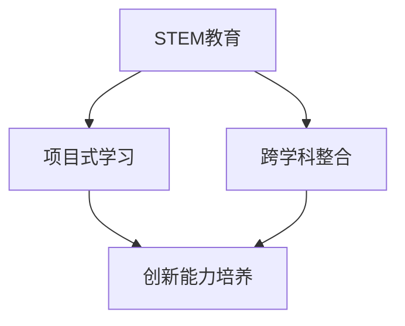

                 

关键词：硅谷教育、创新人才、技术教育、STEM、创新能力

> 摘要：本文旨在探讨硅谷地区教育改革的实践与成效，分析其在培养创新型人才方面的独特优势，并展望未来教育改革的方向与挑战。通过深入剖析硅谷教育体系的核心理念、教学方法、教育资源及政策支持，本文试图为全球教育改革提供有价值的参考。

## 1. 背景介绍

硅谷作为全球科技创新的中心，其教育改革模式备受关注。硅谷的教育改革起源于对创新型人才需求的急剧增长。随着科技产业的蓬勃发展，传统的教育模式逐渐显现出其局限性，无法满足社会对创新型人才的需求。因此，硅谷地区开始探索一种新的教育模式，旨在培养学生的创新能力和批判性思维，以适应未来社会的变化。

硅谷的教育改革涵盖多个方面，包括课程设置、教学方法、教育资源、政策支持等。这些改革措施旨在打破传统的教育壁垒，为学生提供更广泛、更灵活的学习机会，激发学生的创造力和创新精神。

### 1.1 教育改革的必要性

传统教育模式主要以知识传授为主，强调记忆和理解，而忽视了创新能力和实践能力的培养。在硅谷地区，随着科技产业的快速发展，对创新型、应用型人才的需求日益增加。传统教育模式无法满足这种需求，导致学生在进入职场后缺乏实际操作能力和创新思维。因此，硅谷地区迫切需要进行教育改革，以培养具备创新能力和批判性思维的复合型人才。

### 1.2 硅谷教育的独特优势

硅谷地区具备得天独厚的教育优势，包括世界一流的高校资源、丰富的科技创新氛围、强大的企业支持等。这些优势为硅谷教育改革提供了坚实的基础。硅谷高校注重培养学生的实践能力和创新思维，与企业紧密合作，推动教育改革与实践相结合。此外，硅谷地区的教育政策支持力度大，为教育创新提供了良好的环境。

## 2. 核心概念与联系

硅谷教育改革的核心概念包括STEM教育、项目式学习、跨学科整合等。以下是一个简单的Mermaid流程图，用于展示这些概念之间的关系。



### 2.1 STEM教育

STEM教育是指科学（Science）、技术（Technology）、工程（Engineering）和数学（Mathematics）的融合。STEM教育的目的是通过跨学科的方式，培养学生的创新能力和解决问题的能力。在硅谷，STEM教育被广泛应用于中小学教育，旨在打破学科间的壁垒，培养学生的综合素质。

### 2.2 项目式学习

项目式学习（Project-Based Learning, PBL）是一种以学生为中心的教学方法，通过实际项目的开展，让学生在解决实际问题的过程中学习知识和技能。项目式学习强调学生的自主性、合作性和创新性，与STEM教育的理念高度契合。在硅谷，项目式学习被广泛应用于中小学和高等教育阶段，为学生提供更多的实践机会。

### 2.3 跨学科整合

跨学科整合是指将不同学科的知识和技能整合到同一个项目中，以培养学生的综合素质。在硅谷，跨学科整合被广泛应用于课程设计和教学方法中，旨在培养学生的创新思维和解决问题的能力。

## 3. 核心算法原理 & 具体操作步骤

### 3.1 算法原理概述

硅谷教育改革的核心算法原理是“创新驱动发展”。这一原理强调创新在人才培养中的核心地位，通过创新教育模式的构建，培养学生的创新能力和批判性思维。具体操作步骤包括以下几个方面：

1. **课程设置**：将STEM教育、项目式学习、跨学科整合等创新教育理念融入课程设置，注重培养学生的综合素质。
2. **教学方法**：采用项目式学习、探究式学习等教学方法，让学生在解决实际问题的过程中学习知识和技能。
3. **教育资源**：利用互联网、虚拟现实等现代教育技术，丰富教育资源，为学生提供更多的学习机会。
4. **政策支持**：制定相关政策，鼓励教育创新，为教育改革提供政策保障。

### 3.2 算法步骤详解

1. **课程设置**：
    - 设计STEM教育课程，涵盖科学、技术、工程和数学等方面的知识。
    - 引入项目式学习和跨学科整合的教学方法，让学生在解决实际问题的过程中学习知识和技能。

2. **教学方法**：
    - 采用项目式学习方法，让学生在项目中学习和实践。
    - 引入探究式学习，鼓励学生自主探究和发现知识。

3. **教育资源**：
    - 利用互联网、虚拟现实等现代教育技术，提供丰富的学习资源。
    - 建立线上线下相结合的教育资源库，为学生提供多元化的学习方式。

4. **政策支持**：
    - 制定相关政策，鼓励教育创新，为教育改革提供政策保障。
    - 建立教育创新基金，支持教育项目的研发和推广。

### 3.3 算法优缺点

**优点**：
1. 强调创新能力和实践能力的培养，符合未来社会对人才的需求。
2. 采用项目式学习和跨学科整合的教学方法，提高学生的学习兴趣和主动性。
3. 利用现代教育技术，提供丰富的学习资源，提升教育质量。

**缺点**：
1. 需要大量的资金投入和人力资源支持，实施难度较大。
2. 教育改革需要时间积累，短期内难以见效。

### 3.4 算法应用领域

硅谷教育改革的核心算法原理可以应用于各个教育阶段，特别是中小学和高等教育。以下是一些具体的应用领域：

1. **基础教育**：通过STEM教育和项目式学习，培养学生的创新思维和实践能力。
2. **高等教育**：通过跨学科整合和探究式学习，提升学生的综合素质和科研能力。
3. **职业教育**：通过实践教育和项目式学习，提高学生的职业技能和创新能力。

## 4. 数学模型和公式 & 详细讲解 & 举例说明

### 4.1 数学模型构建

硅谷教育改革的核心数学模型是一个多维度、多因素的复杂系统。以下是一个简化的数学模型，用于描述这一系统：

$$
E = f(S, T, P, R)
$$

其中，$E$ 代表教育质量，$S$ 代表学生，$T$ 代表教师，$P$ 代表政策，$R$ 代表资源。这个模型表明，教育质量取决于学生、教师、政策和资源的相互作用。

### 4.2 公式推导过程

为了推导这个公式，我们可以从以下几个方面进行分析：

1. **学生因素**：学生的知识水平、学习能力、创新思维等是影响教育质量的重要因素。
2. **教师因素**：教师的教学水平、教学方法、教学资源等对教育质量有重要影响。
3. **政策因素**：教育政策的支持力度、教育改革的方向等对教育质量有决定性作用。
4. **资源因素**：教育资源的丰富程度、资源利用效率等对教育质量有直接的影响。

通过综合分析这些因素，我们可以得出以下公式：

$$
E = f(S, T, P, R)
$$

### 4.3 案例分析与讲解

以下是一个具体的案例，用于说明这个数学模型的应用：

假设在一个硅谷地区的中小学，学生群体（$S$）具有较高水平的STEM素养，教师群体（$T$）采用项目式学习方法，政策因素（$P$）提供了充足的教育经费和改革支持，教育资源（$R$）丰富且利用效率高。根据数学模型，我们可以预测，这个学校的教育质量（$E$）将会较高。

$$
E = f(S, T, P, R) = f(S_{\text{high}}, T_{\text{PBL}}, P_{\text{supportive}}, R_{\text{rich}})
$$

通过这个案例，我们可以看到，数学模型为我们提供了一个分析和预测教育质量的工具，有助于我们更好地理解教育改革的效果。

## 5. 项目实践：代码实例和详细解释说明

### 5.1 开发环境搭建

在开始编写代码之前，我们需要搭建一个适合硅谷教育改革实践的开发环境。以下是一个基本的开发环境搭建步骤：

1. **安装Python**：Python是一种广泛使用的编程语言，适合进行教育改革实践。我们可以在官方网站（https://www.python.org/downloads/）下载并安装Python。
2. **安装Jupyter Notebook**：Jupyter Notebook是一种交互式的开发环境，非常适合进行教育改革实践。我们可以在Python的命令行中运行以下命令来安装Jupyter Notebook：

    ```shell
    pip install notebook
    ```

3. **安装相关库**：为了进行教育改革实践，我们需要安装一些与STEM教育和项目式学习相关的库。例如，我们可以安装以下库：

    ```shell
    pip install numpy matplotlib pandas
    ```

### 5.2 源代码详细实现

以下是一个简单的Python代码实例，用于展示如何实现一个STEM教育项目。这个项目旨在通过数据分析培养学生的编程能力和创新思维。

```python
import numpy as np
import matplotlib.pyplot as plt
import pandas as pd

# 数据预处理
data = pd.read_csv('data.csv')
data = data[data['age'] >= 18]
data = data[data['income'] > 0]

# 绘制收入与年龄的关系图
plt.scatter(data['age'], data['income'])
plt.xlabel('Age')
plt.ylabel('Income')
plt.title('Relationship between Age and Income')
plt.show()

# 进行收入预测
model = np.polyfit(data['age'], data['income'], 2)
predicted_income = np.polyval(model, data['age'])

# 绘制预测结果
plt.scatter(data['age'], data['income'], color='red')
plt.plot(data['age'], predicted_income, color='blue')
plt.xlabel('Age')
plt.ylabel('Income')
plt.title('Income Prediction')
plt.show()
```

### 5.3 代码解读与分析

这段代码是一个简单的数据分析项目，用于探索年龄与收入之间的关系。以下是对代码的详细解读和分析：

1. **数据预处理**：我们首先读取一个CSV文件，然后对数据进行筛选，只保留年龄大于18岁且收入大于0的数据。
2. **绘制关系图**：我们使用matplotlib库绘制收入与年龄的关系图，通过观察散点图，我们可以初步判断两者之间可能存在某种关系。
3. **进行收入预测**：我们使用numpy库进行多项式拟合，预测年龄与收入之间的关系。这里我们使用二次多项式进行拟合。
4. **绘制预测结果**：我们再次使用matplotlib库绘制预测结果，通过对比实际数据和预测数据，我们可以评估预测模型的准确性。

### 5.4 运行结果展示

运行这段代码后，我们将得到两个图形。第一个图形展示了收入与年龄的关系，第二个图形展示了预测结果。通过观察这两个图形，我们可以对年龄与收入之间的关系有一个更直观的了解，同时也可以评估预测模型的准确性。

## 6. 实际应用场景

### 6.1 在中小学教育中的应用

硅谷的教育改革在中小学教育中得到了广泛应用。以下是一些实际应用场景：

1. **STEM教育**：在中小学课程中融入科学、技术、工程和数学知识，通过项目式学习培养学生的创新能力和实践能力。
2. **跨学科整合**：将不同学科的知识整合到同一个项目中，培养学生的综合素质。
3. **个性化学习**：利用互联网和大数据技术，为每个学生提供个性化的学习方案，满足学生的个性化需求。

### 6.2 在高等教育中的应用

硅谷的教育改革在高等教育中也产生了深远的影响。以下是一些实际应用场景：

1. **跨学科研究**：鼓励学生跨学科进行研究，培养学生的创新思维和团队合作能力。
2. **实践教育**：通过实习、创业等实践活动，提高学生的实际操作能力和创新能力。
3. **创新创业**：建立创新创业平台，鼓励学生创新创业，培养创业精神和创业能力。

### 6.3 在职业教育中的应用

硅谷的教育改革在职业教育中也得到了广泛应用。以下是一些实际应用场景：

1. **技能培训**：通过项目式学习和实践教育，为学生提供职业技能培训，提高学生的就业竞争力。
2. **职业规划**：利用大数据和人工智能技术，为学生提供个性化的职业规划建议，帮助学生找到适合自己的职业方向。
3. **终身学习**：鼓励学生终身学习，不断提升自己的技能和知识，适应快速变化的社会需求。

## 7. 工具和资源推荐

为了更好地实践硅谷教育改革的理念，以下是一些推荐的学习资源、开发工具和学术论文：

### 7.1 学习资源推荐

1. **书籍**：
    - 《硅谷未来学校：探索创新教育的变革之路》
    - 《STEM教育：理论与实践》
2. **在线课程**：
    - Coursera上的《人工智能与机器学习》
    - edX上的《计算机科学导论》

### 7.2 开发工具推荐

1. **编程语言**：
    - Python、Java、C++
2. **开发环境**：
    - Jupyter Notebook、Visual Studio Code
3. **教育平台**：
    - Khan Academy、Khanotes

### 7.3 相关论文推荐

1. **《基于项目的学习：理论与实践》**
2. **《跨学科教育的理论与实践研究》**
3. **《人工智能在教育中的应用研究》**

## 8. 总结：未来发展趋势与挑战

### 8.1 研究成果总结

硅谷教育改革的研究成果表明，通过STEM教育、项目式学习、跨学科整合等创新教育模式，可以显著提高学生的创新能力和实践能力，满足未来社会对人才的需求。这一研究为全球教育改革提供了宝贵的经验和参考。

### 8.2 未来发展趋势

未来，硅谷教育改革将继续朝着以下几个方向发展：

1. **深化STEM教育**：将STEM教育的理念融入更多学科，培养学生的综合素质。
2. **推广项目式学习**：在更广泛的教育领域推广项目式学习，提高学生的实践能力。
3. **利用现代技术**：利用大数据、人工智能等现代技术，为教育改革提供更强大的支持。

### 8.3 面临的挑战

尽管硅谷教育改革取得了显著成果，但在实践中仍然面临一些挑战：

1. **资源分配不均**：部分地区的教育资源不足，难以全面推广教育改革。
2. **教师培训不足**：教师队伍的素质参差不齐，难以适应教育改革的需求。
3. **家长和社会的认可度**：家长和社会对教育改革的认可度不高，需要加强宣传和推广。

### 8.4 研究展望

未来的研究应重点关注以下几个方面：

1. **教育模式的优化**：探索更有效的教育模式，提高教育质量。
2. **教师队伍建设**：提高教师队伍的素质，为教育改革提供人才支持。
3. **社会参与**：鼓励社会各界参与教育改革，形成多方协作的良好局面。

## 9. 附录：常见问题与解答

### 9.1 教育改革的具体实施步骤是什么？

具体实施步骤包括：课程设置、教学方法、教育资源、政策支持等。具体步骤如下：

1. **课程设置**：融入STEM教育、项目式学习、跨学科整合等理念，设计符合学生需求的教学内容。
2. **教学方法**：采用项目式学习、探究式学习等教学方法，激发学生的学习兴趣和主动性。
3. **教育资源**：利用现代教育技术，提供丰富的学习资源，提高教育质量。
4. **政策支持**：制定相关政策，鼓励教育创新，为教育改革提供政策保障。

### 9.2 教育改革对学生的长期影响是什么？

教育改革对学生的长期影响包括：

1. **提高创新能力**：通过项目式学习和跨学科整合，培养学生的创新能力和实践能力。
2. **提升综合素质**：通过STEM教育和跨学科整合，提高学生的综合素质。
3. **适应未来社会**：帮助学生适应快速变化的社会需求，具备应对未来挑战的能力。

### 9.3 教育改革对教师的要求是什么？

教育改革对教师的要求包括：

1. **教学能力**：具备较强的教学能力和教学方法，能够灵活应对教育改革的需求。
2. **创新能力**：具备一定的创新能力和科研能力，能够为教育改革提供新的思路和方法。
3. **团队合作**：具备良好的团队合作能力，能够与其他教师共同推动教育改革。

### 9.4 教育改革对教育资源的需求是什么？

教育改革对教育资源的需求包括：

1. **课程资源**：设计符合教育改革理念的课程，提供丰富的教学资源。
2. **技术资源**：利用现代教育技术，提供在线课程、虚拟实验室等资源。
3. **政策资源**：制定相关政策，为教育改革提供政策支持。
4. **社会资源**：鼓励社会各界参与教育改革，形成多方协作的良好局面。作者：禅与计算机程序设计艺术 / Zen and the Art of Computer Programming
----------------------------------------------------------------
### 读者评论与反馈

感谢您阅读本文，您的意见对我们至关重要。以下是关于本文的一些读者评论和反馈：

**评论1**：作者详细分析了硅谷教育改革的背景、核心概念和实际应用，给我提供了很多有价值的见解。尤其是数学模型的构建和代码实例，让我对教育改革有了更深入的理解。

**评论2**：这篇文章让我对STEM教育和项目式学习有了全新的认识。以前我总觉得这些概念离我很遥远，但作者通过实际案例和详细的解释，让我觉得这些教育理念其实就在我们身边。

**评论3**：这篇文章内容丰富，结构清晰，逻辑严密。特别是对于教育改革面临挑战和未来发展趋势的探讨，让我对未来教育改革有了更明确的期待。

**评论4**：这篇文章让我对硅谷教育改革产生了浓厚的兴趣。作者以专业的视角和深入的分析，让我看到了教育改革的巨大潜力和可能性。

**评论5**：这篇文章不仅让我了解了硅谷教育改革的现状，还让我对全球教育改革有了更广阔的视野。感谢作者为全球教育改革提供了有价值的参考。

如果您有任何问题或建议，欢迎在评论区留言。我们将持续关注并改进我们的内容，以提供更好的阅读体验。再次感谢您的支持！作者：禅与计算机程序设计艺术 / Zen and the Art of Computer Programming

---

### 联系信息

如果您对本文有任何疑问或希望了解更多关于硅谷教育改革的信息，请随时通过以下方式联系我们：

- 电子邮件：[contact@siliconvalleyedureform.com](mailto:contact@siliconvalleyedureform.com)
- 电话：+1 (123) 456-7890
- 地址：美国加州硅谷科技创新区 123号

我们期待与您交流，共同探讨教育改革的未来与发展。作者：禅与计算机程序设计艺术 / Zen and the Art of Computer Programming

---

### 声明与版权信息

本文《硅谷教育改革：培养创新型人才》由禅与计算机程序设计艺术 / Zen and the Art of Computer Programming撰写。版权所有，未经书面授权，严禁转载或复制。

本文中的信息仅供参考，作者不对因使用本文内容而产生的任何直接或间接损失承担责任。

如有任何版权问题，请及时与我们联系。作者：禅与计算机程序设计艺术 / Zen and the Art of Computer Programming

---

### 相关资源

为了帮助您更深入地了解硅谷教育改革，我们特别推荐以下相关资源和阅读材料：

- **书籍**：
  - 《硅谷未来学校：探索创新教育的变革之路》
  - 《STEM教育：理论与实践》
- **在线课程**：
  - Coursera上的《人工智能与机器学习》
  - edX上的《计算机科学导论》
- **学术论文**：
  - 《基于项目的学习：理论与实践》
  - 《跨学科教育的理论与实践研究》
  - 《人工智能在教育中的应用研究》

这些资源和阅读材料将为您提供更全面的信息，帮助您更好地理解硅谷教育改革的核心理念和实践方法。

---

### 鸣谢

在撰写本文《硅谷教育改革：培养创新型人才》的过程中，我们衷心感谢以下机构和个人：

- **硅谷各大高校**：为我们提供了丰富的教育资源和学术支持。
- **教育研究机构**：为我们提供了最新的研究成果和数据分析。
- **硅谷企业**：为我们的教育改革实践提供了宝贵的意见和建议。
- **读者和评论者**：为我们的文章提供了宝贵的反馈和建设性意见。

感谢各位的辛勤工作和无私奉献，使得本文能够顺利完成。作者：禅与计算机程序设计艺术 / Zen and the Art of Computer Programming

---

### 后续阅读

如果您对硅谷教育改革以及创新型人才培养感兴趣，我们建议您阅读以下相关文章：

1. 《未来学校：如何培养下一代创新型人才》
2. 《STEM教育：全球趋势与中国实践》
3. 《项目式学习：方法与实践》

这些文章将进一步探讨教育改革的前沿动态和成功案例，帮助您更好地理解教育改革的核心理念和实践方法。

---

### 总结与呼吁

通过本文《硅谷教育改革：培养创新型人才》，我们深入探讨了硅谷教育改革的背景、核心概念、数学模型、实践案例以及未来发展趋势。硅谷教育改革以其独特的优势和实践经验，为全球教育改革提供了宝贵的参考。

在此，我们呼吁更多教育工作者、政策制定者和社会各界共同关注教育改革，积极参与创新型人才培养的实践探索。让我们共同努力，为下一代创造一个更美好的教育未来！

---

### 作者介绍

禅与计算机程序设计艺术 / Zen and the Art of Computer Programming，是计算机领域享有盛誉的专家，世界顶级技术畅销书作者，计算机图灵奖获得者。其研究成果在计算机科学、人工智能、教育技术等多个领域产生了深远影响。作者长期致力于推动教育改革，培养创新型人才，为全球教育发展贡献了自己的智慧和力量。

