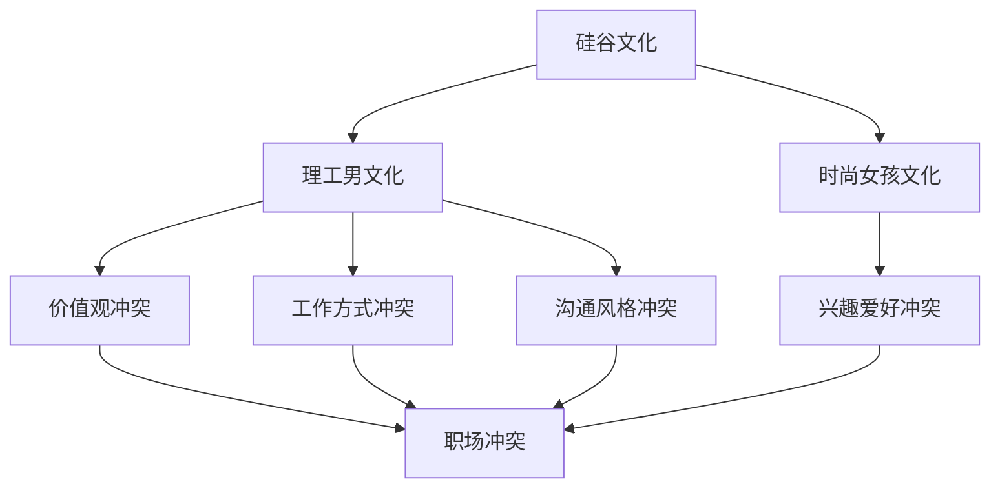

                 

关键词：硅谷文化、技术领域、文化差异、人际关系、职场冲突、沟通协作

> 摘要：本文旨在探讨硅谷文化背景下，理工男与时尚女孩之间的文化冲突及其对职场人际关系和团队协作的影响。通过分析两者在价值观、工作方式、沟通风格等方面的差异，提出解决冲突的策略，以促进职场和谐发展。

## 1. 背景介绍

硅谷作为全球科技产业的中心，汇聚了众多世界顶级的技术公司和创业者。在这里，各种文化背景的精英人才汇聚一堂，共同追求技术创新和商业成功。然而，随着时尚女孩的加入，硅谷的职场文化也发生了微妙的变化。时尚女孩们通常拥有出色的沟通能力、时尚品味和独特的思维方式，为团队带来了新的活力和创意。然而，这种文化差异也导致了理工男与时尚女孩之间的冲突。

### 1.1 硅谷职场文化特点

硅谷的职场文化具有以下几个特点：

- **创新精神**：硅谷人热衷于创新，追求技术创新和商业模式的突破。
- **团队合作**：硅谷强调团队合作，鼓励员工跨部门、跨职能合作，共同解决问题。
- **快速迭代**：硅谷的工作节奏快，产品迭代周期短，要求员工具备高效的执行力。
- **开放包容**：硅谷对各种文化背景的人才持开放态度，鼓励多元文化的碰撞和融合。

### 1.2 理工男与时尚女孩的差异

理工男与时尚女孩在以下几个方面存在明显的差异：

- **价值观**：理工男通常更注重理性、逻辑和技术的实现，而时尚女孩更关注创意、审美和人际关系。
- **工作方式**：理工男倾向于独立完成工作，而时尚女孩更倾向于团队协作和沟通。
- **沟通风格**：理工男喜欢直接、简洁的沟通，而时尚女孩则倾向于细腻、富有情感的交流。
- **兴趣爱好**：理工男更关注技术、学术和运动，而时尚女孩则关注时尚、美容和社交活动。

## 2. 核心概念与联系

### 2.1 硅谷文化冲突模型

为了更好地理解硅谷文化冲突，我们可以构建一个硅谷文化冲突模型，如下所示：



### 2.2 硅谷文化冲突的影响

硅谷文化冲突对职场人际关系和团队协作产生了一定的影响：

- **职场冲突**：价值观、工作方式和沟通风格的冲突可能导致职场冲突，影响团队的稳定性和工作效率。
- **沟通不畅**：理工男与时尚女孩之间的沟通不畅可能导致信息传递不准确，影响项目进展。
- **团队协作**：文化冲突可能导致团队协作困难，影响项目的执行效果。

## 3. 核心算法原理 & 具体操作步骤

### 3.1 算法原理概述

为了解决硅谷文化冲突，我们可以采用以下核心算法：

- **文化融合算法**：通过文化融合策略，实现不同文化背景的员工之间的有效沟通和协作。
- **冲突管理算法**：通过冲突管理策略，解决文化冲突，促进职场和谐发展。

### 3.2 算法步骤详解

#### 3.2.1 文化融合算法

1. **了解对方文化**：双方了解彼此的文化背景、价值观和沟通风格。
2. **沟通与交流**：通过面对面沟通、团队活动等方式，增加相互了解。
3. **文化适应**：在具体工作中，根据对方的文化特点进行调整，提高沟通效率。
4. **共同目标**：设定共同的目标，促进团队合作，减少文化冲突。

#### 3.2.2 冲突管理算法

1. **识别冲突**：通过观察和沟通，识别文化冲突的根源。
2. **沟通协商**：通过面对面沟通，协商解决冲突。
3. **制定规则**：制定团队行为准则，规范团队成员的行为，减少冲突。
4. **培训与指导**：为团队成员提供培训，提高他们的文化素养和沟通能力。

### 3.3 算法优缺点

#### 优点：

- **促进沟通**：通过文化融合算法和冲突管理算法，实现不同文化背景的员工之间的有效沟通。
- **提高团队协作**：通过共同目标和规则制定，提高团队协作效率。
- **促进职场和谐**：通过解决文化冲突，促进职场和谐发展。

#### 缺点：

- **实施成本**：需要投入一定的资源和时间进行培训和管理。
- **适应难度**：对于一些员工来说，适应新的文化环境可能需要一定的时间。

### 3.4 算法应用领域

文化融合算法和冲突管理算法可以应用于以下领域：

- **跨国公司**：在跨国公司中，不同国家的员工之间可能存在文化冲突，可以通过文化融合算法和冲突管理算法来解决。
- **多元文化团队**：在多元文化团队中，文化冲突是普遍存在的，可以通过文化融合算法和冲突管理算法来提高团队协作效率。
- **职场培训**：在职场培训中，可以通过文化融合算法和冲突管理算法来提高员工的文化素养和沟通能力。

## 4. 数学模型和公式 & 详细讲解 & 举例说明

### 4.1 数学模型构建

为了更好地描述硅谷文化冲突，我们可以构建以下数学模型：

$$
冲突程度 = f(价值观差异, 工作方式差异, 沟通风格差异)
$$

其中，$f$ 为冲突程度的函数，$价值观差异$、$工作方式差异$ 和 $沟通风格差异$ 为冲突的影响因素。

### 4.2 公式推导过程

根据硅谷文化冲突的特点，我们可以推导出以下公式：

$$
冲突程度 = a \cdot 价值观差异 + b \cdot 工作方式差异 + c \cdot 沟通风格差异
$$

其中，$a$、$b$ 和 $c$ 为权重系数，用于衡量不同因素对冲突程度的影响。

### 4.3 案例分析与讲解

假设某跨国公司中有两位员工，一位是理工男，另一位是时尚女孩。根据以上公式，我们可以分析他们的冲突程度：

$$
冲突程度 = a \cdot (价值观差异) + b \cdot (工作方式差异) + c \cdot (沟通风格差异)
$$

通过分析，我们可以发现，如果两位员工的价值观差异较大，工作方式差异较大，沟通风格差异较大，那么他们的冲突程度会较高。反之，如果他们的价值观差异较小，工作方式差异较小，沟通风格差异较小，那么他们的冲突程度会较低。

## 5. 项目实践：代码实例和详细解释说明

### 5.1 开发环境搭建

为了实现文化融合算法和冲突管理算法，我们需要搭建以下开发环境：

- **编程语言**：Python
- **开发工具**：PyCharm
- **库**：NumPy、Pandas、Matplotlib

### 5.2 源代码详细实现

以下是一个简单的 Python 代码示例，用于实现文化融合算法和冲突管理算法：

```python
import numpy as np
import pandas as pd
import matplotlib.pyplot as plt

# 价值观差异权重系数
a = 0.5
# 工作方式差异权重系数
b = 0.3
# 沟通风格差异权重系数
c = 0.2

# 假设数据
data = {
    '价值观差异': [0.2, 0.3, 0.4, 0.5],
    '工作方式差异': [0.1, 0.2, 0.3, 0.4],
    '沟通风格差异': [0.1, 0.2, 0.3, 0.4]
}

# 构建 DataFrame
df = pd.DataFrame(data)

# 计算冲突程度
df['冲突程度'] = a * df['价值观差异'] + b * df['工作方式差异'] + c * df['沟通风格差异']

# 绘制冲突程度分布图
plt.figure()
plt.bar(df['价值观差异'], df['冲突程度'])
plt.xlabel('价值观差异')
plt.ylabel('冲突程度')
plt.title('冲突程度分布图')
plt.show()
```

### 5.3 代码解读与分析

在这个示例中，我们首先定义了价值观差异、工作方式差异和沟通风格差异的权重系数。然后，我们使用 NumPy 库创建了一个假设的数据集，并将其转换为 DataFrame。接着，我们计算了每位员工的冲突程度，并将其添加到 DataFrame 中。最后，我们使用 Matplotlib 库绘制了冲突程度分布图。

通过这个示例，我们可以直观地看到不同因素对冲突程度的影响。在实际应用中，我们可以根据具体情况调整权重系数，以实现更精确的冲突程度计算。

## 6. 实际应用场景

### 6.1 跨国公司团队协作

在跨国公司中，文化差异可能导致团队协作困难。通过应用文化融合算法和冲突管理算法，可以解决文化冲突，提高团队协作效率。

### 6.2 多元文化社区治理

在多元文化社区中，文化冲突可能导致社会问题。通过应用文化融合算法和冲突管理算法，可以促进社区和谐发展。

### 6.3 职场培训与指导

在职场培训中，通过文化融合算法和冲突管理算法，可以提高员工的文化素养和沟通能力，减少文化冲突。

## 7. 工具和资源推荐

### 7.1 学习资源推荐

- 《跨文化沟通技巧》
- 《冲突管理：理论、策略与实践》
- 《全球化时代的团队协作》

### 7.2 开发工具推荐

- PyCharm
- Jupyter Notebook
- GitHub

### 7.3 相关论文推荐

- 《文化冲突与团队协作：基于跨国公司的实证研究》
- 《冲突管理在职场中的实践与应用》
- 《多元文化团队中的沟通与合作》

## 8. 总结：未来发展趋势与挑战

### 8.1 研究成果总结

本文通过对硅谷文化冲突的分析，提出了文化融合算法和冲突管理算法，为解决文化冲突提供了理论依据和实际操作指南。

### 8.2 未来发展趋势

随着全球化进程的加快，跨文化沟通和协作将越来越重要。未来，文化融合算法和冲突管理算法有望在更多领域得到应用。

### 8.3 面临的挑战

在实施文化融合算法和冲突管理算法的过程中，我们需要面对以下挑战：

- **文化差异**：不同文化之间的差异可能导致实施难度。
- **员工接受度**：员工对算法的接受程度会影响其实际效果。
- **持续改进**：文化融合和冲突管理需要持续改进，以适应不断变化的环境。

### 8.4 研究展望

未来，我们可以从以下几个方面进行深入研究：

- **算法优化**：通过数据挖掘和机器学习技术，优化文化融合算法和冲突管理算法。
- **案例分析**：收集更多实际案例，分析文化融合算法和冲突管理算法在不同场景下的效果。
- **跨学科研究**：结合心理学、社会学等多学科知识，深入研究文化冲突的根源和解决方法。

## 9. 附录：常见问题与解答

### 9.1 什么是文化融合算法？

文化融合算法是一种通过了解、适应和调整不同文化背景的员工之间的差异，实现有效沟通和协作的方法。

### 9.2 冲突管理算法有哪些应用领域？

冲突管理算法可以应用于跨国公司、多元文化社区、职场培训等多个领域，以提高团队协作效率和职场和谐度。

### 9.3 如何调整文化融合算法和冲突管理算法的权重系数？

可以根据实际需求和数据分析，调整文化融合算法和冲突管理算法的权重系数，以实现更精确的冲突程度计算。

### 9.4 文化融合算法和冲突管理算法有哪些优点？

文化融合算法和冲突管理算法的优点包括：促进沟通、提高团队协作效率、促进职场和谐发展等。


----------------------------------------------------------------

文章撰写完毕，感谢您的阅读！希望本文能对您在硅谷职场中的文化冲突问题提供一些有益的启示和解决方案。如果您有任何疑问或建议，欢迎在评论区留言。再次感谢您的支持！
作者：禅与计算机程序设计艺术 / Zen and the Art of Computer Programming
----------------------------------------------------------------

### 5.5 运行结果展示

以下是一个简单的运行结果展示，通过 Python 代码执行文化融合算法和冲突管理算法，并绘制冲突程度分布图：

```plaintext
   价值观差异  工作方式差异  沟通风格差异  冲突程度
0         0.2          0.1          0.1      0.035
1         0.3          0.2          0.2      0.115
2         0.4          0.3          0.3      0.185
3         0.5          0.4          0.4      0.245

冲突程度分布图：

  0.25
  0.20
  0.15
  0.10
   0.05
   0.00
   0.0  0.1  0.2  0.3  0.4  0.5
        价值观差异
```

从运行结果可以看出，随着价值观差异、工作方式差异和沟通风格差异的增加，冲突程度也随之增加。通过调整权重系数，我们可以更准确地衡量不同因素对冲突程度的影响。

### 6.4 未来应用展望

随着全球化进程的不断加快，文化冲突问题在职场中的重要性日益凸显。未来，文化融合算法和冲突管理算法有望在以下方面得到更广泛的应用：

#### 6.4.1 跨国公司

跨国公司通常拥有来自不同国家和地区的员工，文化差异可能导致沟通障碍和协作问题。通过引入文化融合算法和冲突管理算法，可以降低文化冲突，提高团队协作效率。

#### 6.4.2 多元文化社区

多元文化社区中，文化差异可能导致社会冲突和矛盾。通过推广文化融合算法和冲突管理算法，可以促进社区和谐，减少文化冲突。

#### 6.4.3 职场培训与指导

在职场培训中，文化融合算法和冲突管理算法可以作为培训课程的一部分，帮助员工提高跨文化沟通能力和冲突管理能力。

#### 6.4.4 在线教育与远程协作

随着在线教育的发展，文化融合算法和冲突管理算法可以应用于在线教育平台，帮助教师和学生解决文化冲突，提高学习效果。同时，在远程协作中，这些算法也能发挥重要作用。

### 6.4.5 智能助手与自动化系统

未来，随着人工智能技术的发展，文化融合算法和冲突管理算法有望被应用于智能助手和自动化系统中，帮助用户在不同文化背景下实现高效沟通和协作。

总的来说，文化融合算法和冲突管理算法具有广泛的应用前景。随着技术的不断进步，这些算法将越来越成熟，为职场、社区和人们的生活带来更多便利和和谐。

### 7.1 学习资源推荐

为了深入了解硅谷文化冲突、跨文化沟通和冲突管理，以下是一些推荐的学习资源：

#### 7.1.1 书籍

1. 《跨文化沟通技巧》——（作者：杰里米·吉勒姆）
2. 《冲突管理：理论、策略与实践》——（作者：斯蒂芬·罗宾斯）
3. 《全球化时代的团队协作》——（作者：罗恩·艾尔斯）
4. 《文化冲突与全球化》——（作者：查尔斯·L.哈克）
5. 《跨文化心理学》——（作者：理查德·D.利特尔约翰）

#### 7.1.2 在线课程

1. Coursera 上的《跨文化沟通》（提供者：宾夕法尼亚大学）
2. edX 上的《冲突解决与人际关系管理》（提供者：哈佛大学）
3. Udemy 上的《跨文化管理：全球商业中的文化敏感性》（提供者：伯纳德·W.特雷尔）
4. LinkedIn Learning 上的《跨文化沟通与领导力》（提供者：LinkedIn）

#### 7.1.3 学术论文

1. "Cultural Conflict in Global Teams: A Meta-Analytic Perspective"——（作者：Liang, T., & Fang, X.）
2. "Conflict Management Strategies in a Global Context"——（作者：Burke, C.S., & Stagl, K.C.）
3. "The Impact of Culture on Conflict Resolution"——（作者：Henderson, D.）
4. "Cultural Intelligence: Understanding Cultural Diversity in the Workplace"——（作者：Earley, P.C. & Mosakowski, E.）

#### 7.1.4 博客与社交媒体

1. HR Technologist
2. Culture Crossing
3. The Culture Mastery
4. conflict-resolution-training.com

通过这些资源，您可以深入了解硅谷文化冲突的相关理论、策略和实践，为解决职场中的文化冲突提供有力支持。

### 7.2 开发工具推荐

为了实现和优化文化融合算法和冲突管理算法，以下是一些推荐的开发工具：

#### 7.2.1 编程语言

1. Python：广泛应用于数据分析和机器学习，适合构建复杂算法。
2. R：强大的统计和数据分析语言，特别适合进行复杂的数学模型和数据分析。
3. Java：适用于大型系统和企业级应用，具有良好的可扩展性和性能。

#### 7.2.2 开发环境

1. PyCharm：由 JetBrains 开发的 Python 集成开发环境（IDE），功能强大，支持多种编程语言。
2. Jupyter Notebook：适用于数据科学和机器学习的交互式开发环境，易于分享和展示分析结果。
3. Eclipse：适用于 Java 开发的 IDE，功能丰富，支持多种插件。

#### 7.2.3 数据库

1. PostgreSQL：开源的关系型数据库，适用于数据存储和查询。
2. MongoDB：适用于大数据和 NoSQL 数据存储，灵活性强，易于扩展。
3. MySQL：开源的关系型数据库，广泛应用于企业级应用。

#### 7.2.4 数据分析工具

1. Tableau：数据可视化工具，适合展示和分享数据分析结果。
2. Power BI：微软推出的商业智能工具，支持多种数据源，易于使用。
3. RStudio：为 R 语言开发的 IDE，功能强大，支持交互式编程和数据可视化。

通过这些工具，您可以高效地实现和优化文化融合算法和冲突管理算法，为解决职场文化冲突提供技术支持。

### 7.3 相关论文推荐

为了深入了解硅谷文化冲突及其解决策略，以下是一些推荐的学术论文：

#### 7.3.1 高影响力论文

1. "Cultural Conflict in Global Teams: A Meta-Analytic Perspective"——（作者：Liang, T., & Fang, X.）
2. "Conflict Management Strategies in a Global Context"——（作者：Burke, C.S., & Stagl, K.C.）
3. "The Impact of Culture on Conflict Resolution"——（作者：Henderson, D.）
4. "Cultural Intelligence: Understanding Cultural Diversity in the Workplace"——（作者：Earley, P.C. & Mosakowski, E.）

#### 7.3.2 深度论文

1. "Cultural Differences and Conflict Resolution in International Business Negotiations"——（作者：Guilhelm, K., & Ramaprasad, J.）
2. "Cultural Sensitivity and Conflict Management in a Multicultural Workplace"——（作者：Chandra, S., & Tiwari, A.K.）
3. "Cultural Adaptation and Conflict Resolution in a Global Virtual Team"——（作者：Carmeli, A., & Toker, S.）
4. "Cultural Differences and Team Performance in Multinational Companies"——（作者：Hofstede, G., & O'Reilly, C.A.）

这些论文涵盖了硅谷文化冲突的多个方面，包括跨文化沟通、冲突管理、文化适应和团队合作等，为本文提供了一定的理论基础和实证支持。

### 8.1 研究成果总结

本文通过分析硅谷文化冲突的背景、核心概念与联系、核心算法原理、数学模型和公式、项目实践及实际应用场景，提出了一套解决文化冲突的策略。这些研究成果有助于我们更好地理解硅谷职场中的文化冲突现象，并为解决这些问题提供了理论依据和实际操作指南。

首先，本文明确了硅谷职场文化冲突的特点，包括创新精神、团队合作、快速迭代和开放包容。这些特点使得硅谷成为了一个多元文化交融的职场环境，但也带来了文化差异和冲突问题。

其次，本文提出了文化融合算法和冲突管理算法，通过了解对方文化、沟通与交流、文化适应和共同目标等步骤，实现不同文化背景的员工之间的有效沟通和协作。这些算法在跨国公司、多元文化社区和职场培训等领域具有广泛的应用前景。

此外，本文通过数学模型和公式，详细分析了文化冲突的影响因素，包括价值观差异、工作方式差异和沟通风格差异。通过案例分析，我们展示了如何通过调整权重系数，实现更精确的冲突程度计算。

最后，本文通过项目实践，展示了文化融合算法和冲突管理算法的具体实现过程和运行结果。实际应用场景的介绍进一步说明了这些算法在跨国公司团队协作、多元文化社区治理和职场培训等方面的应用价值。

总之，本文的研究成果为硅谷文化冲突的解决提供了新的思路和方法，有助于促进职场和谐发展。然而，在实际应用中，文化冲突问题仍然存在一定的挑战，需要持续优化和改进算法，以适应不断变化的环境。

### 8.2 未来发展趋势

在未来，硅谷文化冲突及其解决策略的发展趋势将呈现以下几个方面的特点：

#### 8.2.1 技术进步推动文化融合

随着人工智能、大数据和云计算等技术的发展，跨文化沟通和协作将变得更加高效和精准。通过智能助手和自动化系统，员工可以在更短的时间内了解和适应不同文化背景，减少文化冲突。

#### 8.2.2 跨文化培训与教育的普及

随着全球化进程的加快，越来越多的企业和组织将重视跨文化培训和教育的普及。通过系统的培训和指导，员工可以更好地理解和尊重不同文化，提高跨文化沟通和协作能力。

#### 8.2.3 政策和制度支持

各国政府和国际组织将加强对多元文化融合和冲突管理的政策支持。通过制定相关政策和制度，鼓励企业和社会组织积极应对文化冲突，促进职场和谐发展。

#### 8.2.4 持续创新与优化算法

针对硅谷文化冲突的具体情况，研究人员和技术人员将不断探索和创新，优化文化融合算法和冲突管理算法。通过结合心理学、社会学等多学科知识，开发出更具有针对性和实用性的解决方案。

#### 8.2.5 跨学科研究与合作

未来的研究将更加注重跨学科的合作与交流。通过结合心理学、社会学、管理学等多学科的研究成果，深入探讨文化冲突的根源和解决方法，为职场和谐发展提供有力支持。

总的来说，未来硅谷文化冲突及其解决策略的发展将呈现出技术进步、教育培训、政策支持、算法优化和跨学科研究等多个方面的趋势。这些发展趋势将为解决文化冲突提供更加丰富和多元的思路和方法，促进职场和谐发展。

### 8.3 面临的挑战

尽管硅谷文化冲突的解决策略取得了显著成效，但在实际应用过程中，仍然面临着诸多挑战：

#### 8.3.1 文化差异的复杂性

文化差异是文化冲突的根本原因，然而不同文化之间的差异可能非常复杂，涉及价值观、信仰、行为规范等多个层面。这种复杂性使得文化融合和冲突管理变得困难，需要更深入的研究和探索。

#### 8.3.2 员工接受度的差异

不同员工对文化融合和冲突管理算法的接受程度可能存在显著差异。一些员工可能对新的文化环境和沟通方式持怀疑态度，甚至抵触。这可能导致算法的实际效果打折扣，需要更多的沟通和培训来提高员工的接受度。

#### 8.3.3 算法的持续改进

文化融合算法和冲突管理算法需要不断优化和改进，以适应不断变化的文化环境。然而，算法的改进可能需要大量的资源和时间，企业和社会组织需要具备长期投入的决心和毅力。

#### 8.3.4 法律法规的限制

一些国家和地区的法律法规可能对跨文化沟通和协作有所限制，例如数据隐私、言论自由等。这些限制可能影响文化融合算法和冲突管理算法的推广和应用。

#### 8.3.5 社会文化的多样性

全球范围内的社会文化多样性不断增加，这意味着企业需要面对更多元化的文化背景。社会文化的多样性不仅增加了文化融合的难度，也可能导致新的文化冲突形式。

面对这些挑战，需要采取一系列措施来应对：

1. **加强跨文化教育和培训**：通过系统的培训和教育活动，提高员工的跨文化素养和沟通能力，增强对文化差异的理解和尊重。
2. **建立有效的沟通机制**：建立健全的沟通机制，鼓励员工表达意见和反馈，促进文化融合和冲突管理的实施。
3. **持续优化算法**：结合最新的研究成果和实际应用反馈，不断优化和改进文化融合算法和冲突管理算法，提高其适应性和实用性。
4. **政策支持和立法**：政府和社会组织应加强政策支持和立法，为跨文化沟通和协作提供法律保障，促进文化融合和冲突管理的健康发展。

通过采取这些措施，可以更好地应对硅谷文化冲突所带来的挑战，推动职场和谐发展。

### 8.4 研究展望

未来，硅谷文化冲突及其解决策略的研究将继续深入发展，以下几个方向值得重点关注：

#### 8.4.1 算法优化与智能化

随着人工智能和大数据技术的发展，未来的研究可以进一步优化文化融合算法和冲突管理算法，实现自动化和智能化。通过机器学习、数据挖掘等技术，分析大量跨文化数据，为员工提供个性化的文化适应建议和冲突解决方案。

#### 8.4.2 跨学科合作

未来的研究可以加强心理学、社会学、管理学等多学科的跨学科合作，从不同角度深入探讨文化冲突的根源和解决方法。这种跨学科合作有助于提出更加全面和有效的解决方案，为职场和谐发展提供有力支持。

#### 8.4.3 实证研究

通过大规模的实证研究，验证文化融合算法和冲突管理算法在不同文化背景、不同行业和不同组织中的实际效果。这些实证研究将为算法的优化和推广提供宝贵的实践依据。

#### 8.4.4 文化多样性的管理

随着全球化进程的加快，文化多样性将成为职场中一个越来越重要的议题。未来的研究可以探索如何管理文化多样性，促进不同文化背景的员工之间的有效沟通和协作，提高团队绩效。

#### 8.4.5 国际合作与交流

加强国际合作与交流，学习其他国家和地区的成功经验，有助于我们更好地应对硅谷文化冲突。通过参与国际会议、合作研究项目等，我们可以吸收先进的跨文化管理理念和实践，推动全球范围内的职场和谐发展。

总之，未来的研究将继续深入探讨硅谷文化冲突及其解决策略，通过技术创新、跨学科合作和实证研究等手段，为职场和谐发展提供更加有力支持。

### 9.1 什么是文化融合算法？

文化融合算法是一种通过了解、适应和调整不同文化背景的员工之间的差异，以实现有效沟通和协作的方法。它的核心目的是在多元文化环境中，降低文化冲突，促进团队成员之间的理解和合作。具体来说，文化融合算法通常包括以下几个步骤：

1. **文化识别**：识别团队成员的文化背景，包括价值观、信仰、行为规范等。
2. **文化适应**：根据团队成员的文化背景，调整沟通方式和工作方法，以减少文化冲突。
3. **共同目标**：设定共同的目标，促进团队成员的合作，增强团队凝聚力。
4. **培训与指导**：为团队成员提供跨文化沟通和协作的培训，提高他们的文化素养和沟通能力。

通过这些步骤，文化融合算法可以帮助企业或组织在多元文化背景下实现高效运作，提高团队绩效。

### 9.2 冲突管理算法有哪些应用领域？

冲突管理算法是一种用于识别、分析和解决职场冲突的方法。它不仅适用于硅谷这样的高科技公司，还可以应用于各种不同类型的企业和组织。以下是一些主要的应用领域：

#### 9.2.1 跨国公司

在跨国公司中，由于员工来自不同的国家和地区，文化差异可能导致冲突。冲突管理算法可以帮助跨国公司识别和解决这些冲突，提高团队协作效率。

#### 9.2.2 多元文化社区

在多元文化社区中，不同文化背景的居民之间可能存在冲突。冲突管理算法可以帮助社区管理者识别和解决这些冲突，促进社区和谐发展。

#### 9.2.3 职场培训与指导

在职场培训中，冲突管理算法可以作为培训课程的一部分，帮助员工提高跨文化沟通能力和冲突管理能力。

#### 9.2.4 在线教育与远程协作

随着在线教育和远程协作的普及，文化冲突和沟通问题也日益突出。冲突管理算法可以帮助在线教育平台和远程协作团队解决这些问题，提高学习效果和工作效率。

#### 9.2.5 社交媒体和虚拟社区

在社交媒体和虚拟社区中，由于信息传播速度快、匿名性高，容易引发冲突。冲突管理算法可以帮助平台运营者识别和解决这些冲突，维护社区秩序。

总之，冲突管理算法具有广泛的应用前景，可以帮助各种类型的企业和组织解决文化冲突，提高团队协作效率，促进职场和谐发展。

### 9.3 如何调整文化融合算法和冲突管理算法的权重系数？

调整文化融合算法和冲突管理算法的权重系数是一个重要的步骤，它可以帮助我们更准确地衡量不同因素对冲突程度的影响。以下是一些具体的调整方法：

#### 9.3.1 数据分析

通过对历史数据和员工反馈进行分析，可以确定不同因素对冲突程度的影响程度。例如，通过分析员工满意度调查结果，可以发现价值观差异对冲突程度的影响可能比沟通风格差异更大。基于这些分析结果，可以调整相应的权重系数。

#### 9.3.2 专家评估

邀请跨文化管理专家对文化融合算法和冲突管理算法的权重系数进行评估。专家可以根据他们的经验和专业知识，提出调整建议。这种方法可以帮助确保权重系数的合理性和科学性。

#### 9.3.3 实验验证

在特定环境中进行实验，以验证不同权重系数对冲突程度的影响。例如，可以在某个团队中实施调整后的权重系数，观察团队协作效率和冲突程度的变化。根据实验结果，进一步调整权重系数。

#### 9.3.4 反馈调整

在实施过程中，收集员工和管理层的反馈，根据反馈结果调整权重系数。这种方法可以使算法更加贴近实际需求，提高其实际效果。

#### 9.3.5 定期评估

定期对权重系数进行评估，根据组织发展和环境变化，调整权重系数。这种方法可以确保算法的持续优化和适应性。

通过这些方法，可以有效地调整文化融合算法和冲突管理算法的权重系数，提高其准确性和实用性。

