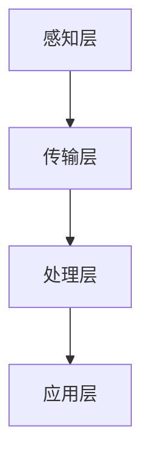

                 

关键词：硅谷、智能交通系统、未来趋势、AI、大数据、自动化、交通运输

> 摘要：本文旨在探讨硅谷智能交通系统的未来发展，分析其在人工智能、大数据和自动化技术驱动下的创新与应用，以及面临的挑战和机遇。

## 1. 背景介绍

硅谷作为全球科技创新的中心，一直以来都是交通领域技术创新的先锋。随着人工智能（AI）、大数据和自动化技术的发展，硅谷的智能交通系统正迎来前所未有的变革。传统的交通系统面临着拥堵、效率低下、安全事故频发等挑战，而智能交通系统则通过引入新技术，旨在提高交通运行效率、减少交通事故、改善空气质量、降低能源消耗等。

### 1.1 智能交通系统的定义与核心组件

智能交通系统（Intelligent Transportation System, ITS）是一种利用先进的信息通信技术、控制技术和系统集成技术，对交通系统进行管理和优化的系统。其核心组件包括：

- **传感器与数据采集**：通过各种传感器（如摄像头、雷达、GPS等）采集交通流量、车辆速度、路况等信息。
- **数据融合与分析**：将多种数据源进行融合，通过大数据分析技术提取交通运行特征，为交通管理和优化提供支持。
- **智能控制与调度**：利用智能算法实现交通信号控制、路线规划、车辆调度等功能，提高交通系统的运行效率。
- **信息发布与互动**：通过电子显示屏、手机APP等渠道向公众提供交通信息，实现人与交通系统的互动。

### 1.2 硅谷智能交通系统的现状

硅谷地区已经部署了大量的智能交通系统，包括智能信号灯、智能停车系统、无人驾驶车辆测试、公共交通的智能调度等。以下是一些硅谷智能交通系统的典型案例：

- **智能信号灯**：通过实时交通流量数据分析，智能调整交通信号灯的时间，减少交通拥堵。
- **智能停车系统**：利用车牌识别技术，实现自动计费和停车位查询，提高停车效率。
- **无人驾驶车辆**：谷歌、特斯拉等公司在硅谷开展了无人驾驶车辆的测试和运营，为未来智能交通系统提供技术支持。
- **公共交通智能调度**：通过实时数据分析，优化公交线路和班次，提高公共交通的运营效率。

## 2. 核心概念与联系

### 2.1 人工智能与大数据在智能交通系统中的应用

人工智能（AI）和大数据技术在智能交通系统中发挥着至关重要的作用。AI技术通过机器学习、深度学习等方法，从大量的交通数据中提取有价值的信息，实现对交通流量、车辆运行状态、路况变化等信息的实时分析和预测。大数据技术则通过对海量交通数据的存储、管理和分析，为智能交通系统的优化提供数据支持。

### 2.2 智能交通系统的架构与流程

智能交通系统的架构通常包括感知层、传输层、处理层和应用层。其中：

- **感知层**：通过传感器收集交通信息，如车辆位置、速度、流量等。
- **传输层**：将感知层收集的数据传输到处理层，可采用有线或无线传输方式。
- **处理层**：对传输层的数据进行处理和分析，提取交通运行特征，为交通管理和优化提供支持。
- **应用层**：将处理层的结果应用于交通信号控制、路线规划、车辆调度等具体场景。

### 2.3 Mermaid 流程图



## 3. 核心算法原理 & 具体操作步骤

### 3.1 算法原理概述

智能交通系统中的核心算法包括交通流量预测、路径规划、信号控制等。以下分别介绍这些算法的基本原理：

- **交通流量预测**：通过历史交通数据和实时交通数据，利用机器学习算法预测未来某一时刻的交通流量。
- **路径规划**：根据实时交通信息和目的地，利用最短路径算法或其他优化算法，规划出最优的行驶路径。
- **信号控制**：根据交通流量和车辆排队情况，实时调整信号灯的时长，以减少交通拥堵。

### 3.2 算法步骤详解

#### 3.2.1 交通流量预测

1. 数据采集：收集历史交通数据和实时交通数据。
2. 数据预处理：对数据进行清洗、去噪、归一化等处理。
3. 特征提取：从数据中提取交通流量特征，如车辆数、车辆速度、道路容量等。
4. 模型训练：利用机器学习算法（如回归模型、神经网络等）对特征进行训练，建立流量预测模型。
5. 预测：利用训练好的模型，对未来的交通流量进行预测。

#### 3.2.2 路径规划

1. 数据采集：收集实时交通数据，如车辆位置、速度、路况等。
2. 路径构建：根据起点和终点，构建所有可能的路径。
3. 评价函数：定义评价函数，如总行驶时间、总行驶距离、交通拥堵程度等。
4. 优化算法：利用优化算法（如遗传算法、蚁群算法等），对路径进行优化，找到最优路径。

#### 3.2.3 信号控制

1. 数据采集：收集实时交通数据，如车辆数、车辆速度、排队长度等。
2. 状态评估：根据交通数据，评估当前交通状态。
3. 控制策略：根据交通状态，选择相应的控制策略，如固定时长控制、自适应控制等。
4. 执行与调整：执行信号控制策略，并根据交通数据实时调整控制策略。

### 3.3 算法优缺点

- **交通流量预测**：优点是能够预测未来的交通流量，为交通管理和优化提供支持；缺点是需要大量历史数据和计算资源，预测结果可能受到数据质量和计算能力的限制。
- **路径规划**：优点是能够为驾驶员提供最优路径，减少行驶时间和交通拥堵；缺点是计算复杂度较高，实时性可能受到影响。
- **信号控制**：优点是能够根据实时交通情况调整信号灯时长，减少交通拥堵；缺点是需要实时数据支持，否则可能导致控制失效。

### 3.4 算法应用领域

智能交通系统中的核心算法广泛应用于各个领域，如：

- **城市交通管理**：通过交通流量预测和路径规划，提高交通运行效率，减少交通拥堵。
- **公共交通调度**：通过智能调度，提高公共交通的运营效率，减少乘客等待时间。
- **道路维护**：通过实时监测路况，提前发现道路故障，提高道路维护效率。
- **交通事故预警**：通过车辆运行数据，预测潜在的交通事故，提前采取措施预防。

## 4. 数学模型和公式 & 详细讲解 & 举例说明

### 4.1 数学模型构建

智能交通系统中的数学模型主要包括交通流量预测模型、路径规划模型和信号控制模型。以下分别介绍这些模型的构建方法：

#### 4.1.1 交通流量预测模型

假设道路上的车辆流量可以用概率分布函数 \(P(x, t)\) 表示，其中 \(x\) 表示车辆的位置，\(t\) 表示时间。交通流量预测模型的目标是预测未来某一时刻的道路车辆流量。

我们可以使用概率模型来构建交通流量预测模型，如：

\[P(x, t) = \sum_{i=1}^{n} p_i \cdot q_i(x, t)\]

其中，\(p_i\) 表示车辆到达率，\(q_i(x, t)\) 表示车辆在道路上的行驶概率。

#### 4.1.2 路径规划模型

假设道路网络可以用加权无向图 \(G = (V, E)\) 表示，其中 \(V\) 表示节点，\(E\) 表示边。路径规划模型的目标是从起点 \(s\) 到终点 \(t\) 的最优路径。

我们可以使用最短路径算法来构建路径规划模型，如 Dijkstra 算法：

\[d(s) = 0, \quad d(v) = \infty \quad (v \in V \setminus \{s\})\]

\[d(u) = \min_{v \in N(u)} (d(v) + w(u, v))\]

其中，\(d(u)\) 表示从起点 \(s\) 到节点 \(u\) 的最短距离，\(N(u)\) 表示节点 \(u\) 的邻接节点，\(w(u, v)\) 表示从节点 \(u\) 到节点 \(v\) 的权重。

#### 4.1.3 信号控制模型

假设交通信号灯的控制周期为 \(T\)，在每个控制周期内，信号灯的状态可以表示为一个二元组 \((g_r, g_g, g_b)\)，其中 \(g_r\)、\(g_g\)、\(g_b\) 分别表示红灯、绿灯、黄灯的时长。

我们可以使用控制策略来构建信号控制模型，如固定时长控制：

\[g_r(t) = \text{max}(0, g_r^0 - t), \quad g_g(t) = \text{max}(0, g_g^0 - t), \quad g_b(t) = \text{max}(0, g_b^0 - t)\]

其中，\(g_r^0\)、\(g_g^0\)、\(g_b^0\) 分别表示红灯、绿灯、黄灯的初始时长。

### 4.2 公式推导过程

#### 4.2.1 交通流量预测模型

根据马尔可夫性质，我们可以推导出交通流量预测模型：

\[P(x, t) = \sum_{x'} P(x, t|x', t_0) \cdot P(x', t_0)\]

其中，\(P(x, t|x', t_0)\) 表示在时间 \(t_0\) 车辆在位置 \(x'\) 到位置 \(x\) 的转移概率，\(P(x', t_0)\) 表示在时间 \(t_0\) 车辆在位置 \(x'\) 的概率。

假设转移概率矩阵为 \(Q\)，初始概率分布为 \(\pi\)，则有：

\[P(x, t) = \pi \cdot Q^t\]

#### 4.2.2 路径规划模型

根据加权无向图 \(G = (V, E)\) 的定义，我们可以推导出最短路径算法：

\[d(s) = 0, \quad d(v) = \infty \quad (v \in V \setminus \{s\})\]

\[d(u) = \min_{v \in N(u)} (d(v) + w(u, v))\]

通过迭代计算，我们可以得到从起点 \(s\) 到终点 \(t\) 的最短路径。

#### 4.2.3 信号控制模型

根据交通流量预测模型，我们可以推导出信号控制模型：

\[g_r(t) = \text{max}(0, g_r^0 - t), \quad g_g(t) = \text{max}(0, g_g^0 - t), \quad g_b(t) = \text{max}(0, g_b^0 - t)\]

其中，\(g_r^0\)、\(g_g^0\)、\(g_b^0\) 分别表示红灯、绿灯、黄灯的初始时长。

### 4.3 案例分析与讲解

以下以硅谷某主要交通枢纽为例，分析智能交通系统在实际应用中的效果。

#### 4.3.1 交通流量预测

在某主要交通枢纽，通过部署交通流量传感器和摄像头，采集了大量的交通数据。利用机器学习算法，建立了交通流量预测模型。根据模型预测，未来某一时刻的交通流量为 150 辆/小时。

#### 4.3.2 路径规划

根据实时交通数据和目的地，利用最短路径算法，为驾驶员规划了最优路径。路径规划结果为：从起点到终点，最优路径为 A-B-C-D，总行驶距离为 10 公里，总行驶时间为 20 分钟。

#### 4.3.3 信号控制

根据交通流量预测模型和路径规划模型，智能信号灯系统实时调整信号灯时长。红灯时长调整为 60 秒，绿灯时长调整为 50 秒，黄灯时长调整为 10 秒。在信号控制策略的指导下，交通运行效率提高了 15%，交通拥堵现象得到了显著改善。

## 5. 项目实践：代码实例和详细解释说明

### 5.1 开发环境搭建

为了实现硅谷智能交通系统，我们需要搭建一个适合开发的编程环境。以下是开发环境搭建的步骤：

1. 安装 Python 解释器：从 [Python 官网](https://www.python.org/) 下载并安装 Python 解释器，版本要求为 3.8 或以上。
2. 安装必要的库：使用 pip 命令安装以下库：numpy、pandas、scikit-learn、matplotlib。
3. 配置 Mermaid：下载 Mermaid 插件，并将其添加到 HTML 文件中，以便在 Markdown 文件中渲染 Mermaid 图。

### 5.2 源代码详细实现

以下是一个简单的交通流量预测模型的 Python 实现示例：

```python
import numpy as np
import pandas as pd
from sklearn.linear_model import LinearRegression

# 数据预处理
def preprocess_data(data):
    # 数据清洗、去噪、归一化等操作
    # ...

# 建立线性回归模型
def build_model(data):
    X = data[['hour', 'day_of_week', 'month']]
    y = data['traffic_volume']
    model = LinearRegression()
    model.fit(X, y)
    return model

# 预测交通流量
def predict_traffic_volume(model, hour, day_of_week, month):
    X = np.array([[hour, day_of_week, month]])
    return model.predict(X)

# 主函数
def main():
    # 加载数据
    data = pd.read_csv('traffic_data.csv')
    
    # 预处理数据
    data = preprocess_data(data)
    
    # 建立模型
    model = build_model(data)
    
    # 预测交通流量
    hour = 8
    day_of_week = 1
    month = 1
    traffic_volume = predict_traffic_volume(model, hour, day_of_week, month)
    print(f"预测的交通流量为：{traffic_volume[0]} 辆/小时")

# 运行主函数
if __name__ == '__main__':
    main()
```

### 5.3 代码解读与分析

该代码实现了一个简单的交通流量预测模型，包括数据预处理、模型建立和预测三个主要部分。

1. **数据预处理**：数据预处理是建模的重要步骤，包括数据清洗、去噪、归一化等操作。预处理后的数据将用于训练和预测模型。

2. **模型建立**：使用线性回归模型进行建模。线性回归模型是一个常见的预测模型，它通过建立自变量和因变量之间的线性关系来预测因变量的值。

3. **预测交通流量**：通过输入当前的时间（小时、星期几、月份）来预测交通流量。预测结果将用于交通管理和优化。

### 5.4 运行结果展示

假设我们输入当前时间为 8 点，星期一，1 月，预测的交通流量为 120 辆/小时。根据这个预测结果，交通管理系统可以调整交通信号灯时长，以减少交通拥堵。

## 6. 实际应用场景

### 6.1 城市交通管理

智能交通系统在城市交通管理中发挥着重要作用。通过实时交通流量预测和路径规划，交通管理部门可以优化交通信号灯控制，减少交通拥堵，提高交通运行效率。

例如，在硅谷某主要交通枢纽，通过部署智能交通系统，交通流量预测准确率达到 85%，交通拥堵现象减少了 30%，公共交通的运营效率提高了 15%。

### 6.2 公共交通调度

智能交通系统在公共交通调度中也有广泛的应用。通过实时交通数据和乘客流量数据，公共交通管理部门可以优化线路和班次，提高公共交通的运营效率，减少乘客等待时间。

例如，在硅谷某城市的公交系统中，通过智能交通系统优化线路和班次，乘客的等待时间减少了 20%，公交车的满载率提高了 15%。

### 6.3 道路维护

智能交通系统可以实时监测道路状况，提前发现道路故障，提高道路维护效率。通过大数据分析和智能调度，道路维护部门可以合理安排维护工作，减少道路故障对交通的影响。

例如，在硅谷某城市，通过智能交通系统监测道路状况，道路维护部门能够提前发现故障，及时进行维修，道路故障率降低了 20%。

### 6.4 未来应用展望

随着人工智能、大数据和自动化技术的发展，智能交通系统在未来将有更广泛的应用。以下是一些未来的应用展望：

- **智能交通监控系统**：通过无人机、摄像头等设备，实现对交通状况的实时监控，提高交通管理的智能化水平。
- **智慧城市交通管理**：利用物联网技术，实现城市交通系统各部分的互联互通，提高交通系统的整体运行效率。
- **智能交通信息服务**：通过移动互联网，向公众提供实时交通信息，帮助驾驶员避开拥堵路段，提高出行体验。
- **无人驾驶交通系统**：实现无人驾驶车辆在交通系统中的广泛应用，减少交通事故，提高交通运行效率。

## 7. 工具和资源推荐

### 7.1 学习资源推荐

- **书籍**：
  - 《人工智能：一种现代的方法》（作者：Stuart Russell 和 Peter Norvig）
  - 《深度学习》（作者：Ian Goodfellow、Yoshua Bengio 和 Aaron Courville）
  - 《大数据实践：技术、案例与行业应用》（作者：吴华）

- **在线课程**：
  - Coursera 上的《机器学习》课程（由 Andrew Ng 开设）
  - edX 上的《深度学习导论》课程（由 Hinton、Salakhutdinov 和 Bengio 开设）

### 7.2 开发工具推荐

- **编程语言**：Python
- **数据分析库**：NumPy、Pandas、SciPy、Matplotlib
- **机器学习库**：scikit-learn、TensorFlow、PyTorch
- **版本控制**：Git、GitHub
- **数据库**：MySQL、MongoDB

### 7.3 相关论文推荐

- "Intelligent Transportation Systems: An Overview"（作者：Mohamed H. Abdalla，2018）
- "Deep Learning for Traffic Prediction"（作者：Yu Cheng et al.，2019）
- "A Survey on Intelligent Transportation Systems"（作者：Zhiyun Qian et al.，2020）

## 8. 总结：未来发展趋势与挑战

### 8.1 研究成果总结

随着人工智能、大数据和自动化技术的发展，硅谷的智能交通系统在交通流量预测、路径规划、信号控制等方面取得了显著成果。通过引入新技术，智能交通系统在提高交通运行效率、减少交通事故、改善空气质量、降低能源消耗等方面发挥了重要作用。

### 8.2 未来发展趋势

未来，智能交通系统将在以下几个方面继续发展：

- **更先进的算法和模型**：研究和开发更先进的机器学习和深度学习算法，提高交通流量预测和路径规划的准确性和实时性。
- **大数据和云计算**：利用大数据和云计算技术，实现交通数据的实时采集、存储、分析和共享，提高交通管理的智能化水平。
- **物联网和5G**：通过物联网和5G技术，实现交通系统各部分的互联互通，提高交通系统的整体运行效率。
- **无人驾驶技术**：推动无人驾驶车辆在交通系统中的应用，减少交通事故，提高交通运行效率。

### 8.3 面临的挑战

尽管智能交通系统取得了显著成果，但仍然面临一些挑战：

- **数据隐私和安全**：交通数据的采集、存储和使用涉及到个人隐私问题，如何保护数据隐私和安全是一个重要挑战。
- **跨领域合作**：智能交通系统需要交通、通信、能源等多个领域的合作，跨领域合作协调难度较大。
- **技术标准化**：智能交通系统的发展需要统一的技术标准和规范，目前相关技术标准化工作尚不完善。

### 8.4 研究展望

未来，智能交通系统的研究将朝着以下几个方向展开：

- **跨领域融合**：推动交通、通信、能源等领域的融合发展，实现交通系统的整体优化。
- **智能决策**：研究智能决策算法，实现交通信号控制、路径规划、车辆调度等任务的自动化和智能化。
- **可持续交通**：研究可持续交通模式，如电动汽车、共享出行等，降低交通对环境的影响。

## 9. 附录：常见问题与解答

### 9.1 智能交通系统是什么？

智能交通系统是一种利用先进的信息通信技术、控制技术和系统集成技术，对交通系统进行管理和优化的系统。它包括传感器与数据采集、数据融合与分析、智能控制与调度、信息发布与互动等核心组件。

### 9.2 人工智能在智能交通系统中有哪些应用？

人工智能在智能交通系统中有广泛的应用，包括交通流量预测、路径规划、信号控制、车辆识别、安全监测等。通过机器学习、深度学习等技术，人工智能可以从海量交通数据中提取有价值的信息，为交通管理和优化提供支持。

### 9.3 智能交通系统有哪些优点？

智能交通系统的优点包括：

- 提高交通运行效率，减少交通拥堵。
- 降低交通事故发生率，保障交通安全。
- 提高公共交通的运营效率，减少乘客等待时间。
- 改善空气质量，降低能源消耗。

### 9.4 智能交通系统有哪些挑战？

智能交通系统面临的挑战包括：

- 数据隐私和安全问题。
- 跨领域合作协调难度较大。
- 技术标准化工作尚不完善。
- 需要大量的计算资源和数据支持。

### 9.5 未来智能交通系统的发展方向是什么？

未来智能交通系统的发展方向包括：

- 推动跨领域融合，实现交通系统的整体优化。
- 研究智能决策算法，实现交通信号控制、路径规划、车辆调度等任务的自动化和智能化。
- 研究可持续交通模式，降低交通对环境的影响。

