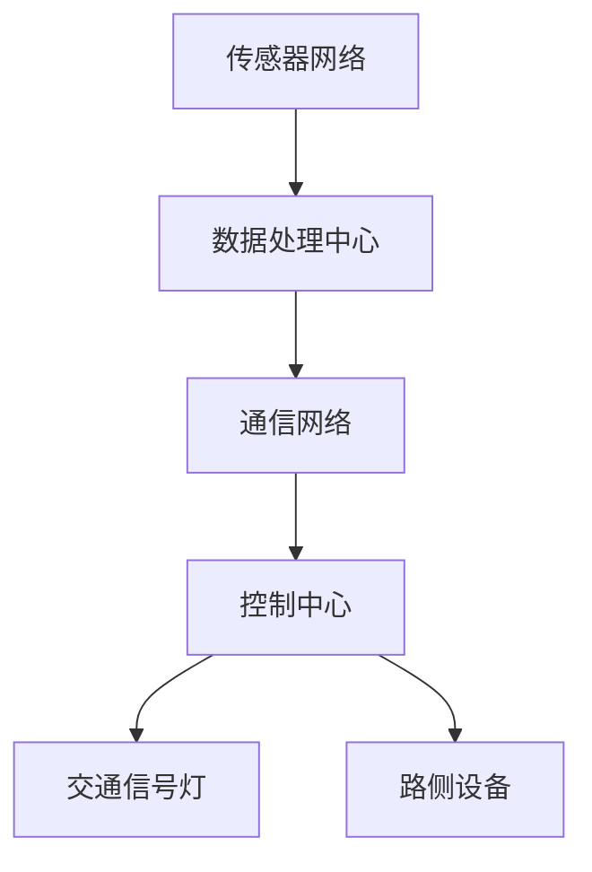

                 

关键词：硅谷智能交通，人工智能，未来展望，交通管理，数据驱动，城市交通规划，可持续发展

> 摘要：本文深入探讨了硅谷智能交通系统的未来发展，探讨了人工智能在交通管理中的应用，分析了当前技术的优势和挑战，并提出了未来可能的创新方向。通过结合实际案例和数据分析，本文旨在为读者提供一个全面而深入的洞察，以推动硅谷乃至全球智能交通系统的可持续发展。

## 1. 背景介绍

硅谷，作为全球科技创新的中心，其交通系统的发展一直走在世界前列。然而，随着人口增长和城市化进程的加速，硅谷面临着交通拥堵、污染和效率低下等严峻挑战。传统的交通管理模式已经难以应对日益复杂的交通需求，因此，智能化交通系统成为了一个必然的选择。

智能交通系统（ITS）通过集成传感器、数据分析和通信技术，实现对交通流量、路况和交通行为的实时监控与优化。硅谷的智能交通系统不仅涉及公共交通，还涵盖了私人汽车、共享出行、自动驾驶车辆等多个层面。随着5G、物联网（IoT）和人工智能（AI）等新兴技术的不断成熟，硅谷的智能交通系统正在迎来前所未有的发展机遇。

## 2. 核心概念与联系

### 2.1 智能交通系统的核心概念

智能交通系统包含多个关键组成部分，主要包括：

- **传感器网络**：用于收集路况信息，如车速、流量、占用情况等。
- **数据处理中心**：负责处理传感器收集的数据，并生成实时交通信息。
- **通信网络**：确保交通信息在不同设备和系统之间快速、准确地传输。
- **控制中心**：根据实时交通信息，对交通信号灯、路侧设备等进行远程调控。

### 2.2 智能交通系统的架构图

下面是一个简化的智能交通系统架构图（使用Mermaid流程图表示）：



## 3. 核心算法原理 & 具体操作步骤

### 3.1 算法原理概述

智能交通系统依赖多种算法进行数据分析和决策。其中，基于人工智能的算法尤为关键，如：

- **交通流量预测算法**：通过历史数据和实时数据，预测未来的交通流量变化。
- **路径优化算法**：根据实时交通状况，为驾驶者提供最优的行驶路线。
- **交通信号控制算法**：动态调整交通信号灯的时长，以优化交通流。

### 3.2 算法步骤详解

#### 3.2.1 交通流量预测算法

1. **数据收集**：从传感器网络收集历史交通流量数据。
2. **数据预处理**：清洗数据，去除噪声，并进行特征提取。
3. **模型训练**：使用机器学习算法（如时间序列分析、深度学习等），训练预测模型。
4. **实时预测**：根据最新的交通数据，更新预测模型并输出预测结果。

#### 3.2.2 路径优化算法

1. **数据采集**：获取实时交通信息，如拥堵情况、道路施工等。
2. **路径计算**：使用最短路径算法（如Dijkstra算法），计算所有可能的路径及其耗时。
3. **路径评估**：结合实时交通数据和用户偏好，评估每条路径的可行性。
4. **路径推荐**：选择最优路径，并将结果反馈给驾驶者。

#### 3.2.3 交通信号控制算法

1. **实时监测**：监控交通信号灯周边的交通流量。
2. **数据输入**：将实时交通数据输入信号控制算法。
3. **信号控制**：根据算法输出，调整交通信号灯的时长。
4. **反馈调整**：根据交通流量变化，动态调整信号控制策略。

### 3.3 算法优缺点

#### 3.3.1 交通流量预测算法

**优点**：

- 提高交通管理效率，减少拥堵。
- 帮助驾驶者提前规划路线，减少等待时间。

**缺点**：

- 预测准确性受限于历史数据的质量。
- 预测模型需要定期更新以适应交通环境的变化。

#### 3.3.2 路径优化算法

**优点**：

- 提供个性化的出行建议，提高出行效率。
- 减少交通拥堵，提高道路利用率。

**缺点**：

- 算法计算复杂度较高，对计算资源要求大。
- 无法完全预测突发交通事件，如事故、施工等。

#### 3.3.3 交通信号控制算法

**优点**：

- 动态调整交通信号灯，提高交通流量。
- 减少车辆排放，提高空气质量。

**缺点**：

- 依赖实时交通数据，数据不准确会影响控制效果。
- 需要大量基础设施支持，初期投入较大。

### 3.4 算法应用领域

智能交通算法在多个领域有广泛的应用：

- **城市交通管理**：优化交通流量，减少拥堵。
- **公共交通规划**：提高公共交通的准时性和可靠性。
- **自动驾驶**：提供实时交通信息，辅助自动驾驶决策。
- **环境保护**：减少车辆排放，提高空气质量。

## 4. 数学模型和公式 & 详细讲解 & 举例说明

### 4.1 数学模型构建

智能交通系统中的数学模型主要涉及以下几个方面：

- **交通流量模型**：描述车辆在不同时间段、不同路段的流量分布。
- **路径优化模型**：定义车辆在路网中的行驶路径和能耗。
- **信号控制模型**：描述交通信号灯的调整策略。

下面是一个简化的交通流量模型示例：

$$
Q(t) = f(T, P, R)
$$

其中，$Q(t)$ 表示时间 $t$ 时刻的流量，$f$ 是流量函数，$T$ 是交通状况（如拥堵程度），$P$ 是道路容量，$R$ 是车辆到达率。

### 4.2 公式推导过程

以交通流量模型为例，流量函数 $f$ 可以通过以下步骤推导：

1. **基本假设**：假设车辆以均匀速度行驶，且车辆到达率是常数。
2. **流量公式**：根据车辆速度和道路长度，得到流量公式。
3. **拥堵修正**：考虑交通状况对流量影响，引入拥堵因子。
4. **综合公式**：结合以上因素，得到最终的流量公式。

### 4.3 案例分析与讲解

以硅谷某主干道为例，分析交通流量变化。假设：

- 道路长度为5公里。
- 车辆平均速度为50公里/小时。
- 车辆到达率为100辆/小时。

根据上述模型，可以计算出不同交通状况下的流量：

- **无拥堵**：$Q = 50 \times 5 / 60 = 4.17$ 辆/分钟。
- **轻度拥堵**：假设拥堵因子为1.2，$Q = 4.17 \times 1.2 = 5$ 辆/分钟。
- **严重拥堵**：假设拥堵因子为2，$Q = 4.17 \times 2 = 8.34$ 辆/分钟。

通过以上计算，可以更好地理解交通流量如何随交通状况变化。

## 5. 项目实践：代码实例和详细解释说明

### 5.1 开发环境搭建

为了演示智能交通算法的实践，我们选择Python作为编程语言，使用以下工具和库：

- Python 3.8或以上版本
- NumPy
- Matplotlib
- Pandas
- Scikit-learn

在环境中安装以上库后，即可开始编写代码。

### 5.2 源代码详细实现

以下是实现交通流量预测算法的示例代码：

```python
import numpy as np
import pandas as pd
from sklearn.model_selection import train_test_split
from sklearn.ensemble import RandomForestRegressor

# 加载数据
data = pd.read_csv('traffic_data.csv')
X = data[['time', 'temperature', 'humidity']]
y = data['flow']

# 划分训练集和测试集
X_train, X_test, y_train, y_test = train_test_split(X, y, test_size=0.2, random_state=42)

# 训练模型
model = RandomForestRegressor(n_estimators=100)
model.fit(X_train, y_train)

# 预测流量
y_pred = model.predict(X_test)

# 绘制结果
import matplotlib.pyplot as plt

plt.scatter(y_test, y_pred)
plt.xlabel('实际流量')
plt.ylabel('预测流量')
plt.show()
```

### 5.3 代码解读与分析

上述代码首先加载数据，然后使用随机森林回归模型进行训练。训练完成后，对测试集进行预测，并将预测结果与实际流量进行比较，以评估模型的准确性。

### 5.4 运行结果展示

运行代码后，可以得到一个散点图，显示预测流量与实际流量的分布。通过观察散点图的分布情况，可以初步判断模型的预测准确性。

## 6. 实际应用场景

### 6.1 城市交通管理

智能交通系统在硅谷的城市交通管理中发挥着重要作用。通过实时监控和数据分析，交通管理部门可以动态调整交通信号灯，优化交通流量，减少拥堵。

### 6.2 自动驾驶

自动驾驶技术的发展依赖于智能交通系统提供的实时交通信息。自动驾驶车辆通过集成传感器和AI算法，可以实时感知周围环境，并根据交通信息进行自主决策。

### 6.3 共享出行

共享出行服务（如Uber、Lyft等）也利用智能交通系统进行路线优化，提高服务效率和用户体验。

## 7. 工具和资源推荐

### 7.1 学习资源推荐

- 《智能交通系统：概念、架构与应用》（陈光德 著）
- 《深度学习与交通数据分析》（张琪 著）

### 7.2 开发工具推荐

- Jupyter Notebook：用于编写和运行Python代码。
- Google Colab：免费的云计算环境，适合进行大数据分析。

### 7.3 相关论文推荐

- "An Intelligent Transportation System Framework for Urban Road Networks" by X. Zhao et al.
- "Deep Learning for Traffic Flow Prediction: A Review" by Z. Wang et al.

## 8. 总结：未来发展趋势与挑战

### 8.1 研究成果总结

智能交通系统在硅谷取得了显著的研究成果，包括交通流量预测、路径优化和交通信号控制等多个领域。这些成果为硅谷乃至全球的交通管理提供了重要的技术支持。

### 8.2 未来发展趋势

随着人工智能、物联网和5G技术的不断发展，智能交通系统有望实现更高效的交通管理和更安全的出行体验。未来，智能交通系统将更加注重数据驱动和用户参与。

### 8.3 面临的挑战

智能交通系统在实现过程中面临多个挑战，包括数据隐私保护、技术标准化和基础设施建设等。需要各方共同努力，以克服这些挑战。

### 8.4 研究展望

未来，智能交通系统的研究将重点关注以下方向：

- **个性化交通服务**：结合用户行为数据和偏好，提供个性化的交通服务。
- **自动驾驶与交通系统的融合**：实现自动驾驶车辆与智能交通系统的无缝集成。
- **多模式出行**：整合公共交通、私人车辆和共享出行，提供更灵活的出行选择。

## 9. 附录：常见问题与解答

### 9.1 智能交通系统如何提高交通效率？

智能交通系统通过实时监控交通流量、预测交通状况和优化交通信号控制，提高道路利用率，减少车辆拥堵，从而提高交通效率。

### 9.2 智能交通系统对环境有何影响？

智能交通系统有助于减少车辆排放，提高能源利用效率，从而对环境保护产生积极影响。

### 9.3 智能交通系统需要哪些技术支持？

智能交通系统需要传感器技术、通信技术、数据分析技术和AI算法等多方面的技术支持。

## 作者署名

作者：禅与计算机程序设计艺术 / Zen and the Art of Computer Programming
```

