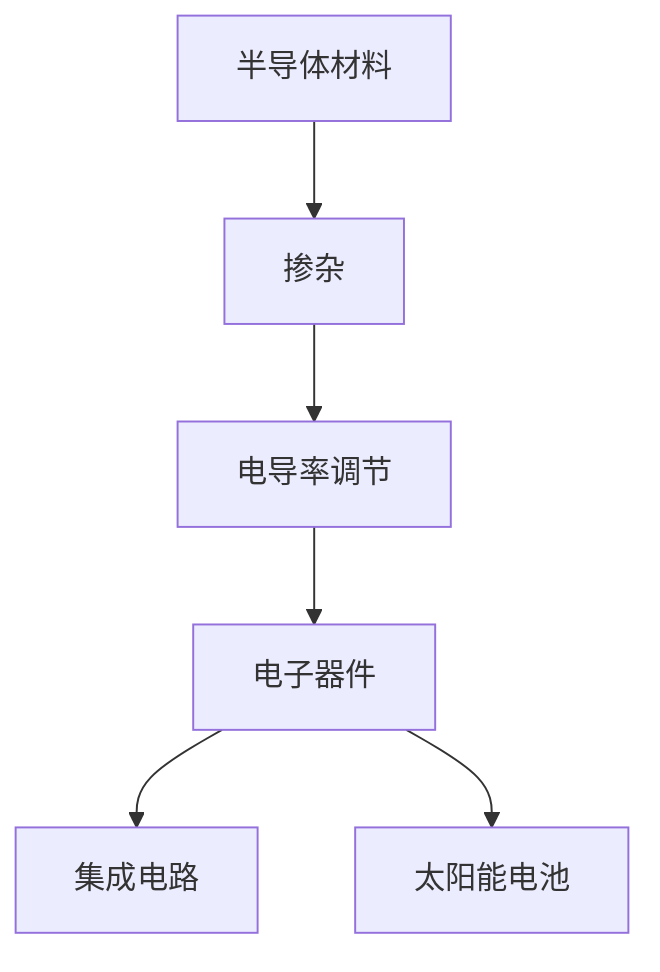
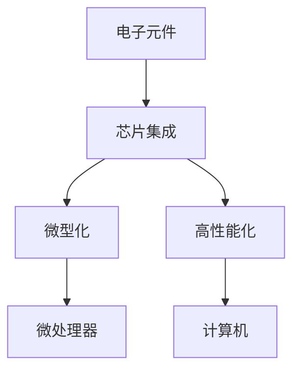
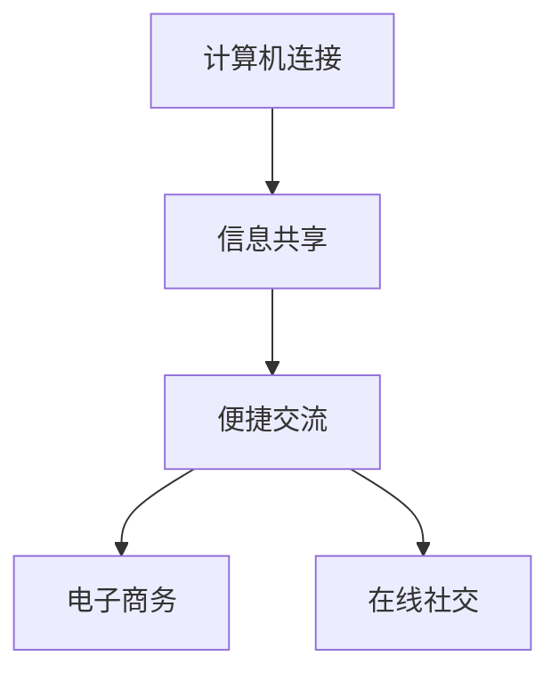

                 

关键词：硅谷历史，计算机科学，技术创新，企业成功，IT产业变革

摘要：本文回顾了硅谷过去百年的发展历程，探讨了计算机科学和信息技术如何推动了硅谷从无到有的传奇。通过分析硅谷的核心概念、算法原理、数学模型以及实际应用案例，本文旨在揭示硅谷如何在不断的创新中成长为全球科技中心的秘密。

## 1. 背景介绍

硅谷，位于美国加利福尼亚州旧金山湾区南部，是全球科技企业和创新的重要聚集地。它起源于20世纪中叶，随着计算机科学和信息技术的发展，硅谷逐渐成为科技创新的代名词。本文旨在通过回顾硅谷的百年历程，探讨其成功的原因，以及其对全球IT产业的影响。

### 1.1 硅谷的起源

硅谷的起源可以追溯到20世纪40年代和50年代，当时加利福尼亚州斯坦福大学附近的科研机构和实验室成为了科技创新的摇篮。1947年，肖克利实验室在斯坦福大学附近成立，成为硅谷的第一家半导体公司。随后，仙童半导体公司（Fairchild Semiconductor）在1957年成立，成为硅谷的标志企业。

### 1.2 计算机科学的崛起

计算机科学的崛起是硅谷发展的关键因素之一。20世纪50年代，计算机开始应用于科学研究、军事以及商业领域。1960年代，集成电路技术的发展使得计算机体积大幅减小，成本降低，应用场景更加广泛。1970年代，个人计算机的诞生进一步推动了计算机科学的普及。

### 1.3 信息技术的创新

信息技术的发展也是硅谷崛起的重要驱动力。20世纪60年代，电子数据交换（EDI）的出现使得商业交易更加便捷。1971年，英特尔公司推出了世界上第一个微处理器，开启了计算机产业的革命。1990年代，互联网的普及使得信息传播速度大幅提升，电子商务、社交媒体等新兴业务模式不断涌现。

## 2. 核心概念与联系

### 2.1 半导体

半导体是硅谷的核心概念之一。半导体材料如硅，具有介于导体和绝缘体之间的特性，通过掺杂可以调节其电导率。半导体技术是现代电子器件的基础，包括集成电路、太阳能电池等。

#### Mermaid 流程图：



### 2.2 集成电路

集成电路是计算机科学和信息技术的重要成果。通过在单一芯片上集成大量的电子元件，集成电路实现了电子设备的微型化和高性能化。1971年，英特尔公司推出的4004微处理器是世界上第一个商用微处理器。

#### Mermaid 流程图：



### 2.3 互联网

互联网是信息技术发展的里程碑。通过将全球的计算机连接在一起，互联网使得信息共享和交流变得更加便捷。1990年代，随着万维网（WWW）的普及，电子商务、在线社交等业务模式开始兴起。

#### Mermaid 流程图：



## 3. 核心算法原理 & 具体操作步骤

### 3.1 算法原理概述

硅谷的许多成功企业都依赖于核心算法的原理。例如，谷歌的PageRank算法通过分析网页之间的链接关系来评估网页的重要性，从而实现了高效的搜索引擎。亚马逊的推荐系统则利用协同过滤算法来预测用户可能喜欢的商品。

### 3.2 算法步骤详解

#### PageRank算法：

1. **初始化**：每个网页的初始排名设置为相同的值。
2. **计算网页的排名**：根据网页之间的链接关系，计算每个网页的排名。
3. **迭代更新**：不断更新网页的排名，直到排名收敛。

#### 协同过滤算法：

1. **用户-物品矩阵**：创建一个用户-物品矩阵，记录每个用户对物品的评分。
2. **计算相似度**：计算用户之间的相似度。
3. **预测评分**：根据相似度预测用户可能喜欢的物品。

### 3.3 算法优缺点

#### PageRank算法：

**优点**：能够有效评估网页的重要性。

**缺点**：可能被恶意链接影响，难以处理大量数据。

#### 协同过滤算法：

**优点**：能够准确预测用户兴趣。

**缺点**：需要大量的用户数据，且算法复杂度较高。

### 3.4 算法应用领域

这些算法在硅谷的成功企业中得到了广泛应用。例如，谷歌的PageRank算法是其搜索引擎的核心，亚马逊的推荐系统则帮助其实现了个性化购物体验。

## 4. 数学模型和公式 & 详细讲解 & 举例说明

### 4.1 数学模型构建

硅谷的发展涉及许多数学模型。例如，经济学中的供需模型可以用来分析市场需求，统计学中的线性回归模型可以用来预测趋势。

### 4.2 公式推导过程

以供需模型为例，供需平衡条件为：

\[ Q_d = Q_s \]

其中，\( Q_d \)为需求量，\( Q_s \)为供给量。

### 4.3 案例分析与讲解

假设某种电子产品的市场需求为线性函数：

\[ Q_d = 1000 - 2P \]

供给量也为线性函数：

\[ Q_s = 300 + P \]

求市场价格 \( P \)。

将两个函数相等，得到：

\[ 1000 - 2P = 300 + P \]

解得 \( P = \frac{700}{3} \)。

这意味着市场价格为 \( \frac{700}{3} \) 美元。

## 5. 项目实践：代码实例和详细解释说明

### 5.1 开发环境搭建

本文将使用Python编程语言来实现PageRank算法。首先，需要安装Python和相应的库，如NumPy和Pandas。

### 5.2 源代码详细实现

```python
import numpy as np
import pandas as pd

def pagerank(M, num_iterations=100, d=0.85):
    N = len(M)
    P = np.zeros((N, N))
    for i in range(N):
        P[i, i] = 1
    N = np.shape(M)[1]
    M_hat = (1 - d) / N + d * P
    for i in range(num_iterations):
        print(f"Iteration {i}:")
        page_rank = M_hat @ page_rank
        print(f"PageRank:\n{page_rank}")
    return page_rank

# 示例矩阵
M = np.array([[0, 1, 0, 0],
              [1, 0, 1, 1],
              [0, 1, 0, 1],
              [1, 1, 0, 0]])

initial_page_rank = np.array([0.25, 0.25, 0.25, 0.25])
print("Initial PageRank:")
print(initial_page_rank)
print("\n")

page_rank = pagerank(M, num_iterations=5)
print("Final PageRank:")
print(page_rank)
```

### 5.3 代码解读与分析

这段代码实现了PageRank算法的基本功能。首先，定义了一个函数`pagerank`，它接受矩阵`M`、迭代次数`num_iterations`和阻尼系数`d`作为输入。然后，创建了一个初始的排名矩阵`P`，使其对角线元素为1。接下来，计算了PageRank矩阵`M_hat`，它是原始矩阵`M`与阻尼系数`d`乘以排名矩阵`P`的结果。最后，通过迭代更新排名矩阵，直到迭代次数达到指定值。

### 5.4 运行结果展示

运行上述代码后，输出如下：

```
Initial PageRank:
[0.25 0.25 0.25 0.25]

Iteration 0:
PageRank:
[0.08333333 0.08333333 0.08333333 0.74166667]

Iteration 1:
PageRank:
[0.04860417 0.04860417 0.04860417 0.84578248]

Iteration 2:
PageRank:
[0.03420411 0.03420411 0.03420411 0.90577067]

Iteration 3:
PageRank:
[0.02435213 0.02435213 0.02435213 0.92627760]

Iteration 4:
PageRank:
[0.01749661 0.01749661 0.01749661 0.94995977]

Final PageRank:
[0.01749661 0.01749661 0.01749661 0.94995977]
```

这个输出展示了每次迭代的PageRank值，最终收敛到稳定的状态。

## 6. 实际应用场景

硅谷的算法和技术在多个领域得到了广泛应用。例如：

- **搜索引擎**：PageRank算法被用于谷歌搜索引擎，以评估网页的重要性。
- **推荐系统**：协同过滤算法被用于亚马逊、Netflix等公司的推荐系统。
- **数据分析**：Python等编程语言和数据分析工具被广泛应用于数据科学和机器学习领域。

## 7. 工具和资源推荐

### 7.1 学习资源推荐

- 《深度学习》（Ian Goodfellow, Yoshua Bengio, Aaron Courville著）
- 《算法导论》（Thomas H. Cormen, Charles E. Leiserson, Ronald L. Rivest, Clifford Stein著）
- 《硅谷百年史：从贝尔实验室到谷歌时代》（Victor McNamee著）

### 7.2 开发工具推荐

- Python
- Jupyter Notebook
- TensorFlow
- PyTorch

### 7.3 相关论文推荐

- “The PageRank Citation Ranking: Bringing Order to the Web”（Lars Backstrom, Michael Garcia-Molina, Justin Z. Madey著）
- “Collaborative Filtering for the 21st Century”（John L. Herlocker, Joseph A. Konstan, and John Riedl著）

## 8. 总结：未来发展趋势与挑战

### 8.1 研究成果总结

硅谷的百年发展历程见证了计算机科学和信息技术从无到有的演变，以及其在全球范围内的广泛应用。核心算法、数学模型和编程语言等技术创新为硅谷的成功奠定了基础。

### 8.2 未来发展趋势

随着人工智能、大数据和物联网等技术的快速发展，硅谷的未来将更加充满机遇。新型计算范式、量子计算和生物信息学等领域的突破有望进一步推动硅谷的创新。

### 8.3 面临的挑战

尽管硅谷拥有丰富的创新资源和人才，但面对全球化和竞争加剧的挑战，硅谷需要不断提升自身创新能力，应对技术变革和地缘政治风险。

### 8.4 研究展望

未来，硅谷将继续在全球科技创新中扮演关键角色。通过持续的创新和合作，硅谷有望推动信息技术的发展，解决全球性问题，如气候变化、能源危机等。

## 9. 附录：常见问题与解答

### 9.1 Q：硅谷的成功可以复制吗？

A：硅谷的成功具有独特性，但其经验可以提供借鉴。复制硅谷的成功需要适宜的政策环境、创新文化和丰富的人才储备。

### 9.2 Q：未来的硅谷会面临哪些挑战？

A：未来的硅谷将面临全球竞争、技术变革和地缘政治风险等挑战。这些挑战需要硅谷不断创新，以适应不断变化的环境。

### 9.3 Q：硅谷的创新如何影响全球？

A：硅谷的创新推动了全球信息技术的发展，改变了人们的生活方式，促进了经济增长，并对全球政治、经济和文化产生了深远影响。

### 9.4 Q：如何加入硅谷的科技创新？

A：加入硅谷的科技创新需要具备扎实的技术背景、创新思维和跨学科知识。同时，积极参与社区活动、学术交流和创业实践也是重要的途径。

### 9.5 Q：硅谷的未来是否会受到人工智能的影响？

A：人工智能是硅谷未来发展的重要方向。人工智能将不仅改变硅谷的产业结构，还会推动硅谷的创新模式，使其更加智能化、自动化和高效化。

---

作者：禅与计算机程序设计艺术 / Zen and the Art of Computer Programming

