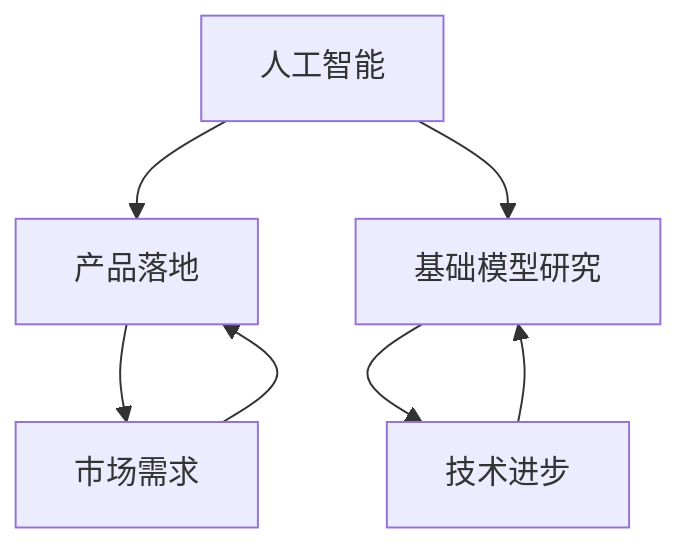

                 

关键词：人工智能，硅谷，产品落地，基础模型研究，贾扬清

摘要：本文将深入探讨硅谷在人工智能领域的竞赛现状，特别是知名AI专家贾扬清对产品落地与基础模型研究的观察。我们将分析当前硅谷在AI领域的竞争格局，讨论产品落地与基础研究的平衡，并展望未来发展的趋势与挑战。

## 1. 背景介绍

近年来，人工智能（AI）已经成为科技领域的热点，硅谷作为全球科技创新的中心，自然成为了AI竞赛的主战场。在这个竞赛中，AI产品落地与基础模型研究并重，成为推动AI技术进步的关键因素。贾扬清，作为硅谷知名的AI专家，其对这一领域的观察和见解具有重要意义。

### 1.1 硅谷的AI竞赛现状

硅谷的AI竞赛现状可以用“群雄逐鹿”来形容。各大科技公司、初创企业和研究机构都在积极投入AI技术研发，希望通过创新的产品和基础模型研究来获取竞争优势。从自动驾驶、智能语音助手到医疗诊断、金融风控，AI技术的应用场景不断扩展，硅谷的AI竞赛也愈发激烈。

### 1.2 贾扬清的角色与观察

贾扬清，前Facebook AI研究院负责人，现为AI初创公司Myrtle AI的联合创始人兼CEO。他在AI领域有着丰富的经验，对硅谷的AI竞赛有着深刻的洞察。他的观察主要集中在产品落地与基础模型研究之间的关系，以及如何在这种关系中找到平衡点。

## 2. 核心概念与联系

在讨论AI竞赛时，我们首先需要了解一些核心概念，如人工智能、产品落地和基础模型研究。下面将使用Mermaid流程图来展示这些概念之间的联系。



### 2.1 人工智能

人工智能是指计算机系统模拟人类智能行为的能力。它涵盖了多个领域，包括机器学习、深度学习、自然语言处理等。

### 2.2 产品落地

产品落地是指将AI技术应用于实际场景，解决实际问题。这个过程需要考虑市场需求、用户体验和商业化可行性。

### 2.3 基础模型研究

基础模型研究是AI技术发展的基石。它关注算法的优化、新模型的发现和理论的创新。这些研究为产品落地提供了技术支持。

## 3. 核心算法原理 & 具体操作步骤

### 3.1 算法原理概述

AI竞赛的核心在于算法的创新与优化。以深度学习为例，其原理是基于多层神经网络对数据进行特征提取和学习，从而实现智能预测和决策。

### 3.2 算法步骤详解

- 数据预处理：对原始数据进行清洗、归一化等处理，以适应模型训练。
- 模型构建：选择合适的神经网络架构，如卷积神经网络（CNN）或循环神经网络（RNN）。
- 模型训练：使用训练数据对模型进行训练，优化模型参数。
- 模型评估：使用验证数据评估模型性能，调整模型参数。
- 模型部署：将训练好的模型部署到实际应用场景中。

### 3.3 算法优缺点

- 优点：深度学习具有强大的特征提取和建模能力，能够处理大量数据，实现高精度预测。
- 缺点：模型复杂度高，训练时间较长，对计算资源要求较高。

### 3.4 算法应用领域

深度学习在图像识别、自然语言处理、推荐系统等领域有着广泛的应用。例如，在图像识别方面，深度学习模型可以实现对复杂场景的精确识别，如人脸识别、自动驾驶等。

## 4. 数学模型和公式

### 4.1 数学模型构建

深度学习中的数学模型主要基于神经元之间的连接和激活函数。以下是一个简单的神经网络模型：

$$
f(x) = \sigma(W \cdot x + b)
$$

其中，$x$是输入向量，$W$是权重矩阵，$b$是偏置项，$\sigma$是激活函数，通常使用Sigmoid函数或ReLU函数。

### 4.2 公式推导过程

神经网络的训练过程实际上是优化权重矩阵$W$和偏置项$b$的过程。通过反向传播算法，可以计算损失函数关于权重矩阵和偏置项的梯度，并使用梯度下降法进行优化。

### 4.3 案例分析与讲解

以图像识别为例，我们使用一个简单的卷积神经网络（CNN）模型进行训练。假设输入图像的大小为$28 \times 28$，输出为10个类别。训练数据集包含60000张训练图像和10000张测试图像。

### 4.3.1 模型构建

$$
\text{Input} \rightarrow \text{Convolution} \rightarrow \text{Pooling} \rightarrow \text{ReLU} \rightarrow \text{Fully Connected} \rightarrow \text{Output}
$$

### 4.3.2 模型训练

使用训练数据集对模型进行训练，调整权重矩阵$W$和偏置项$b$，最小化损失函数。

### 4.3.3 模型评估

使用测试数据集评估模型性能，计算准确率。

## 5. 项目实践：代码实例

### 5.1 开发环境搭建

安装Python、TensorFlow等依赖库。

### 5.2 源代码详细实现

以下是一个简单的CNN模型实现：

```python
import tensorflow as tf

model = tf.keras.Sequential([
    tf.keras.layers.Conv2D(32, (3, 3), activation='relu', input_shape=(28, 28, 1)),
    tf.keras.layers.MaxPooling2D((2, 2)),
    tf.keras.layers.Flatten(),
    tf.keras.layers.Dense(128, activation='relu'),
    tf.keras.layers.Dense(10, activation='softmax')
])

model.compile(optimizer='adam', loss='categorical_crossentropy', metrics=['accuracy'])

model.fit(x_train, y_train, epochs=10, validation_data=(x_test, y_test))
```

### 5.3 代码解读与分析

代码实现了卷积神经网络模型，包括卷积层、池化层、全连接层和输出层。使用TensorFlow框架进行模型编译和训练。

## 6. 实际应用场景

### 6.1 自动驾驶

自动驾驶是AI技术的重要应用领域。通过深度学习模型，汽车可以实现实时环境感知、路径规划和决策控制。

### 6.2 医疗诊断

深度学习在医疗诊断中的应用越来越广泛，如肺癌检测、乳腺癌检测等。通过分析医学图像，深度学习模型可以提供准确、高效的诊断结果。

### 6.3 金融风控

深度学习在金融风控领域也有广泛应用，如欺诈检测、信用评估等。通过分析大量金融数据，深度学习模型可以识别潜在风险，提高风险管理水平。

## 7. 未来应用展望

### 7.1 自动驾驶的普及

随着AI技术的不断进步，自动驾驶将逐渐从实验室走向量产，为人类带来更安全、更高效的出行方式。

### 7.2 医疗诊断的智能化

深度学习在医疗诊断中的应用将越来越深入，通过结合大数据和人工智能技术，有望实现更加精准、个性化的医疗服务。

### 7.3 金融风控的智能化

深度学习在金融风控领域的应用将进一步提高风险识别和管理的效率，为金融行业的稳健发展提供有力支持。

## 8. 工具和资源推荐

### 8.1 学习资源推荐

- 《深度学习》（Goodfellow, Bengio, Courville著）
- 《Python深度学习》（François Chollet著）

### 8.2 开发工具推荐

- TensorFlow
- PyTorch

### 8.3 相关论文推荐

- "AlexNet: Image Classification with Deep Convolutional Neural Networks"（2012）
- "Deep Learning for Text Classification"（2015）

## 9. 总结：未来发展趋势与挑战

### 9.1 研究成果总结

AI技术在产品落地与基础模型研究方面取得了显著成果，为各个领域的发展带来了新的机遇。

### 9.2 未来发展趋势

AI技术将继续向智能化、泛在化、场景化方向发展，为人类社会带来更多便利。

### 9.3 面临的挑战

AI技术的普及还面临诸多挑战，如数据隐私、算法透明度、伦理道德等。

### 9.4 研究展望

未来研究将重点关注算法的优化、应用场景的拓展和跨学科融合，为AI技术的发展提供新动力。

## 附录：常见问题与解答

### 问题1：深度学习模型如何训练？

**回答**：深度学习模型的训练过程包括数据预处理、模型构建、模型训练、模型评估和模型部署。具体步骤如下：

1. 数据预处理：对原始数据进行清洗、归一化等处理。
2. 模型构建：选择合适的神经网络架构。
3. 模型训练：使用训练数据对模型进行训练。
4. 模型评估：使用验证数据评估模型性能。
5. 模型部署：将训练好的模型部署到实际应用场景中。

### 问题2：深度学习模型如何优化？

**回答**：深度学习模型的优化主要包括算法优化、结构优化和数据优化。具体方法如下：

1. 算法优化：采用更高效的训练算法，如Adam优化器。
2. 结构优化：设计更合理的神经网络结构，如残差网络。
3. 数据优化：收集更多、更高质量的数据，并使用数据增强技术提高模型泛化能力。

### 问题3：深度学习模型如何评估？

**回答**：深度学习模型的评估主要包括准确性、召回率、F1分数等指标。具体评估方法如下：

1. 准确性：预测正确的样本数占总样本数的比例。
2. 召回率：预测正确的正样本数占总正样本数的比例。
3. F1分数：准确率和召回率的调和平均值。

## 10. 作者署名

作者：禅与计算机程序设计艺术 / Zen and the Art of Computer Programming

---

本文以贾扬清在硅谷AI竞赛中的观察为切入点，深入分析了产品落地与基础模型研究的关系，探讨了深度学习技术在实际应用中的挑战与机遇。希望通过本文的讨论，能够为AI领域的研究者提供一些有益的启示。

