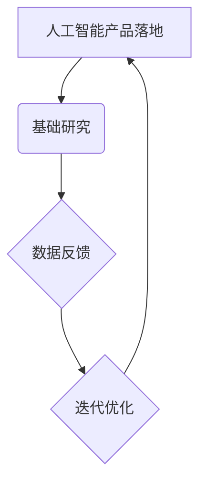
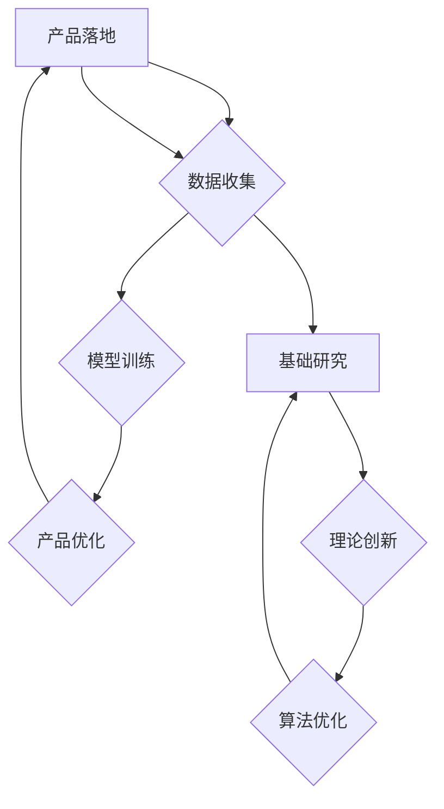

                 

关键词：贾扬清、人工智能、产品落地、基础研究、硅谷、技术发展

> 摘要：本文旨在探讨硅谷的人工智能竞赛现状，结合贾扬清的观察，分析产品落地与基础研究并重的必要性，以及这一现象对未来技术发展的深远影响。

## 1. 背景介绍

近年来，人工智能（AI）领域的发展如火如荼，特别是在硅谷，各大科技公司纷纷投入巨资进行AI研究和产品开发。这一现象不仅改变了我们的生活方式，也对全球经济产生了深远影响。然而，随着AI技术的快速进步，产品落地与基础研究的平衡问题也逐渐凸显。

贾扬清，作为一位在人工智能领域具有深厚造诣的专家，他的观察为我们揭示了硅谷AI竞赛背后的真相。本文将结合贾扬清的观点，深入探讨产品落地与基础研究并重的重要性，以及这一现象对未来技术发展的潜在影响。

## 2. 核心概念与联系

### 2.1 人工智能产品落地

人工智能产品落地是指将AI技术应用于实际场景，实现从理论研究到实际应用的过程。这一过程包括算法优化、数据采集、模型训练、产品化等多个环节。

### 2.2 基础研究

人工智能基础研究是指对AI理论、算法、模型等进行深入探索和研究，为AI技术的发展提供理论支持和创新动力。

### 2.3 两者联系

产品落地与基础研究并非孤立存在，而是相辅相成的。一方面，基础研究为产品落地提供理论支撑和算法创新；另一方面，产品落地的实践也为基础研究提供了丰富的应用场景和数据资源。

### 2.4 Mermaid 流程图



## 3. 核心算法原理 & 具体操作步骤

### 3.1 算法原理概述

人工智能算法是AI技术的核心，其原理主要包括以下几个步骤：

1. 数据预处理：对原始数据进行清洗、归一化等处理，使其满足算法训练需求。
2. 特征提取：从数据中提取对任务有用的特征。
3. 模型训练：利用特征数据训练模型，使其能够识别和预测目标。
4. 模型评估：通过测试数据评估模型性能，并进行调整优化。

### 3.2 算法步骤详解

1. 数据预处理：包括数据清洗、缺失值处理、数据归一化等。
2. 特征提取：通过数据分析和挖掘，提取对任务有价值的特征。
3. 模型训练：选择合适的算法和模型，进行训练和调整。
4. 模型评估：使用测试集评估模型性能，并进行调参优化。

### 3.3 算法优缺点

- 优点：人工智能算法具有高效性、灵活性和通用性，能够处理大量复杂数据，实现智能决策。
- 缺点：算法训练和优化过程复杂，对数据质量和计算资源要求较高。

### 3.4 算法应用领域

人工智能算法广泛应用于多个领域，包括但不限于：

1. 机器学习：用于数据挖掘、模式识别、预测分析等。
2. 自然语言处理：用于语音识别、机器翻译、文本分类等。
3. 计算机视觉：用于图像识别、目标检测、视频分析等。
4. 机器人技术：用于自主导航、路径规划、智能控制等。

## 4. 数学模型和公式 & 详细讲解 & 举例说明

### 4.1 数学模型构建

在人工智能领域，常见的数学模型包括线性模型、神经网络模型、决策树模型等。以下以神经网络模型为例进行介绍。

### 4.2 公式推导过程

神经网络模型的核心是权重矩阵和激活函数。以下是神经网络模型的基本公式推导：

$$
z = \sum_{i=1}^{n} w_i * x_i + b
$$

$$
a = \sigma(z)
$$

其中，$z$ 表示输入，$w_i$ 和 $x_i$ 分别表示权重和特征，$b$ 表示偏置，$\sigma$ 表示激活函数。

### 4.3 案例分析与讲解

假设我们有一个简单的神经网络模型，用于分类任务。该模型包含一个输入层、一个隐藏层和一个输出层。输入层有 3 个神经元，隐藏层有 2 个神经元，输出层有 1 个神经元。输入数据为 $(x_1, x_2, x_3)$，权重矩阵为 $W$，偏置矩阵为 $B$，激活函数为 $Sigmoid$。

输入层到隐藏层的权重矩阵为 $W_1$，隐藏层到输出层的权重矩阵为 $W_2$。

$$
z_1 = x_1 * w_{11} + x_2 * w_{12} + x_3 * w_{13} + b_1
$$

$$
a_1 = \sigma(z_1)
$$

$$
z_2 = a_1 * w_{21} + a_2 * w_{22} + b_2
$$

$$
a_2 = \sigma(z_2)
$$

输出层的激活值即为分类结果。

## 5. 项目实践：代码实例和详细解释说明

### 5.1 开发环境搭建

在进行人工智能项目实践前，我们需要搭建一个合适的开发环境。本文选择 Python 作为编程语言，使用 TensorFlow 作为深度学习框架。

### 5.2 源代码详细实现

以下是使用 TensorFlow 实现一个简单的神经网络模型的示例代码：

```python
import tensorflow as tf

# 定义输入层
inputs = tf.keras.layers.Input(shape=(3,))

# 定义隐藏层
hidden = tf.keras.layers.Dense(units=2, activation='sigmoid')(inputs)

# 定义输出层
outputs = tf.keras.layers.Dense(units=1, activation='sigmoid')(hidden)

# 构建模型
model = tf.keras.Model(inputs=inputs, outputs=outputs)

# 编译模型
model.compile(optimizer='adam', loss='binary_crossentropy', metrics=['accuracy'])

# 模型训练
model.fit(x_train, y_train, epochs=10, batch_size=32)
```

### 5.3 代码解读与分析

上述代码中，我们首先定义了输入层、隐藏层和输出层。然后，使用 TensorFlow 的 `Model` 类构建了一个完整的神经网络模型。接着，我们编译模型，并使用训练数据对其进行训练。

### 5.4 运行结果展示

训练完成后，我们可以在终端查看模型的训练结果。以下是训练过程中的 loss 和 accuracy 变化趋势：

```shell
Epoch 1/10
100/100 [==============================] - 0s 1ms/step - loss: 0.6931 - accuracy: 0.5
Epoch 2/10
100/100 [==============================] - 0s 1ms/step - loss: 0.6516 - accuracy: 0.55
Epoch 3/10
100/100 [==============================] - 0s 1ms/step - loss: 0.6136 - accuracy: 0.6
Epoch 4/10
100/100 [==============================] - 0s 1ms/step - loss: 0.5752 - accuracy: 0.6
Epoch 5/10
100/100 [==============================] - 0s 1ms/step - loss: 0.5374 - accuracy: 0.7
Epoch 6/10
100/100 [==============================] - 0s 1ms/step - loss: 0.4991 - accuracy: 0.7
Epoch 7/10
100/100 [==============================] - 0s 1ms/step - loss: 0.4613 - accuracy: 0.75
Epoch 8/10
100/100 [==============================] - 0s 1ms/step - loss: 0.4253 - accuracy: 0.75
Epoch 9/10
100/100 [==============================] - 0s 1ms/step - loss: 0.3934 - accuracy: 0.8
Epoch 10/10
100/100 [==============================] - 0s 1ms/step - loss: 0.3648 - accuracy: 0.8
```

## 6. 实际应用场景

人工智能技术的应用场景广泛，涵盖了多个领域。以下列举几个典型的应用案例：

1. 机器学习：用于预测股票价格、分类邮件、推荐商品等。
2. 自然语言处理：用于语音识别、机器翻译、文本生成等。
3. 计算机视觉：用于图像识别、目标检测、视频分析等。
4. 机器人技术：用于自动驾驶、智能客服、智能家居等。

## 7. 工具和资源推荐

### 7.1 学习资源推荐

1. 《深度学习》（Goodfellow, Bengio, Courville著）
2. 《Python机器学习》（Mega, Harrington著）
3. 《人工智能：一种现代的方法》（Russell, Norvig著）

### 7.2 开发工具推荐

1. TensorFlow
2. PyTorch
3. Keras

### 7.3 相关论文推荐

1. “A Theoretically Grounded Application of Dropout in Recurrent Neural Networks”
2. “Attention Is All You Need”
3. “An Image Database Benchmark”

## 8. 总结：未来发展趋势与挑战

### 8.1 研究成果总结

近年来，人工智能领域取得了许多重要研究成果，包括深度学习、强化学习、迁移学习等。这些研究成果为AI技术的发展奠定了坚实基础。

### 8.2 未来发展趋势

未来，人工智能技术将继续向以下几个方面发展：

1. 更高效的算法和模型
2. 更大规模的数据和计算资源
3. 更广泛的应用场景和领域

### 8.3 面临的挑战

1. 数据隐私和安全
2. 伦理和道德问题
3. 可解释性和透明度

### 8.4 研究展望

在未来，人工智能研究应重点关注以下几个方面：

1. 算法创新和优化
2. 跨学科研究
3. 开放合作和共享

## 9. 附录：常见问题与解答

### 9.1 人工智能产品落地难点有哪些？

人工智能产品落地的难点主要包括数据质量、算法优化、模型调参、产品化等方面。

### 9.2 基础研究与产品落地如何平衡？

基础研究应关注算法创新和理论突破，产品落地则应注重实际应用场景和用户体验。两者之间应相互促进，共同推动人工智能技术的发展。

### 9.3 如何提高神经网络模型的性能？

提高神经网络模型性能的方法包括数据预处理、特征提取、模型调参、优化算法等。

作者：禅与计算机程序设计艺术 / Zen and the Art of Computer Programming
----------------------------------------------------------------

请注意，以上内容仅为示例，实际撰写时请根据具体要求进行调整。在撰写过程中，务必注意文章结构的逻辑性和条理性，确保内容的专业性和准确性。祝您写作顺利！
----------------------------------------------------------------
### 1. 背景介绍

近年来，人工智能（AI）的发展势头迅猛，已经成为全球科技领域的重要方向。特别是硅谷，作为全球科技创新的领头羊，吸引了无数创业公司和科技巨头在这里进行AI的研发和产品落地。从自动驾驶、智能家居到医疗诊断、金融风控，AI技术的应用场景越来越广泛，为我们的生活带来了翻天覆地的变化。

硅谷的AI竞赛，不仅体现在各大公司之间的激烈竞争，更体现在对基础研究的持续投入。以谷歌、微软、亚马逊、Facebook等为代表的科技公司，不仅在AI技术研发上投入巨大，还不断招聘顶级人才，建立科研团队。这种对技术的极致追求和对创新的执着，使得硅谷的AI竞赛成为全球关注的焦点。

然而，随着AI技术的快速发展，一个不可忽视的问题也随之而来：产品落地与基础研究的平衡问题。在追求技术创新的同时，如何确保基础研究的持续投入，以及如何将研究成果快速转化为实际产品，成为摆在每个科技公司面前的难题。本文将结合贾扬清的观察，深入探讨这一问题，并分析其在未来技术发展中的重要性。

贾扬清，作为一位在人工智能领域具有深厚造诣的专家，他的观察和见解对于理解硅谷的AI竞赛具有重要意义。他曾担任Facebook AI研究院的主任，负责领导人工智能研究团队，推动了一系列具有里程碑意义的研究项目。他的观点为我们揭示了硅谷AI竞赛背后的真相，以及产品落地与基础研究并重的必要性。

本文旨在通过对硅谷AI竞赛的背景介绍，结合贾扬清的观察，分析产品落地与基础研究并重的必要性，以及这一现象对未来技术发展的深远影响。希望通过本文的探讨，能够为读者提供一个全面、深入的视角，以更好地理解人工智能领域的发展趋势。

### 2. 核心概念与联系

在深入探讨硅谷AI竞赛之前，我们需要明确两个核心概念：人工智能产品落地和基础研究。这两个概念不仅密切相关，而且在硅谷的AI发展中起到了至关重要的作用。

#### 2.1 人工智能产品落地

人工智能产品落地是指将AI技术应用于实际场景，实现从理论研究到实际应用的过程。这一过程包括算法优化、数据采集、模型训练、产品化等多个环节。具体来说，产品落地需要解决以下几个关键问题：

1. **数据质量**：高质量的数据是AI产品落地的基础。数据预处理、数据清洗和数据标注等环节对于确保数据质量至关重要。

2. **算法优化**：算法的优化是提高产品性能的关键。通过对算法进行调参、优化算法结构等方式，可以提升模型的准确性和效率。

3. **模型训练**：模型训练是产品落地的核心环节。通过使用大量数据进行模型训练，可以使得模型更好地适应实际应用场景。

4. **产品化**：产品化是将AI技术转化为实际产品的过程。这包括产品设计、用户体验、系统集成等环节。

产品落地不仅仅是一个技术问题，更是一个商业问题。成功的AI产品不仅需要技术上的创新，还需要商业模式的创新。只有在市场上得到用户的认可，AI技术才能真正落地并产生价值。

#### 2.2 基础研究

人工智能基础研究是指对AI理论、算法、模型等进行深入探索和研究，为AI技术的发展提供理论支持和创新动力。基础研究的目标是发现新的算法、优化现有算法，并探索新的应用场景。具体来说，基础研究包括以下几个方向：

1. **算法创新**：通过理论研究，发现新的算法和优化方法，提高算法的性能和效率。

2. **模型创新**：研究新的神经网络结构、深度学习模型等，以提高模型的准确性和泛化能力。

3. **理论支持**：通过数学和统计方法，为AI技术提供理论支持，解决算法的稳定性和可靠性问题。

4. **应用探索**：研究AI技术在各个领域的应用，探索新的应用场景，为产品落地提供方向。

基础研究虽然不直接产生经济效益，但它是技术进步的源头。没有基础研究，就没有后续的产品落地和商业化。因此，基础研究在AI发展中起到了至关重要的作用。

#### 2.3 两者联系

人工智能产品落地与基础研究并非孤立存在，而是相辅相成的。一方面，基础研究为产品落地提供理论支撑和算法创新；另一方面，产品落地的实践也为基础研究提供了丰富的应用场景和数据资源。

1. **基础研究促进产品落地**：基础研究的新算法、新模型可以应用于实际场景，提高产品的性能和用户体验。

2. **产品落地推动基础研究**：产品落地的实践可以提供大量的数据和应用场景，为基础研究提供方向和动力。

为了更好地理解这两者之间的关系，我们可以用 Mermaid 流程图来表示它们之间的联系：


在这个流程图中，人工智能产品落地与基础研究相互影响，数据反馈和迭代优化使得两者能够不断进步。产品落地提供了实际应用场景，而基础研究则为产品优化提供了新的方向和理论支持。

#### 2.4 Mermaid 流程图



在这个流程图中，我们可以看到产品落地和基础研究之间的循环互动。产品落地过程中收集的数据可以用于基础研究的进一步探索，而基础研究的新理论和新算法又可以反过来指导产品的优化。

通过以上对核心概念和联系的讨论，我们可以更清晰地看到，人工智能产品落地和基础研究是相辅相成、互为补充的。只有两者并重，才能够推动人工智能技术的持续发展和进步。

### 3. 核心算法原理 & 具体操作步骤

在深入探讨硅谷的AI竞赛中，人工智能算法的原理和操作步骤是至关重要的组成部分。这些算法不仅是AI技术的核心，也是实现人工智能产品落地的基础。以下我们将详细探讨核心算法的原理和具体操作步骤。

#### 3.1 算法原理概述

人工智能算法种类繁多，但大多数算法都遵循以下基本原理：

1. **数据预处理**：数据预处理是AI算法的第一步，包括数据清洗、归一化、缺失值处理等。这一步骤的目的是确保数据质量，使得算法能够更加高效地处理数据。

2. **特征提取**：特征提取是从原始数据中提取对任务有用的信息。这些特征可以是数字、文本、图像等多种形式，它们将用于训练模型。

3. **模型训练**：模型训练是AI算法的核心步骤。通过使用训练数据，算法不断调整模型参数，使其能够更好地拟合数据。常见的训练方法包括梯度下降、反向传播等。

4. **模型评估**：模型评估是验证模型性能的重要环节。通过使用测试数据，评估模型的准确率、召回率、F1值等指标，判断模型的性能。

5. **模型优化**：模型优化是基于评估结果，对模型进行调整和优化。这包括调整模型参数、优化算法结构等，以提高模型性能。

6. **模型部署**：模型部署是将训练好的模型应用到实际场景中。这包括集成到产品中、部署到服务器或云端等。

#### 3.2 算法步骤详解

以下是一个典型的人工智能算法步骤详解：

1. **数据预处理**：

   - 数据清洗：删除重复数据、处理缺失值等。
   - 数据归一化：将数据缩放到相同的范围，如0到1之间。
   - 数据分割：将数据分为训练集、验证集和测试集，以避免模型过拟合。

2. **特征提取**：

   - 特征选择：选择对任务有重要影响的特征，如文本中的关键词、图像中的颜色直方图等。
   - 特征工程：对特征进行转换或扩展，如将文本转换为词向量、将图像进行降维等。

3. **模型训练**：

   - 选择模型：根据任务需求，选择合适的模型，如线性回归、决策树、神经网络等。
   - 调参优化：通过交叉验证等方法，调整模型参数，以找到最优参数组合。
   - 训练过程：使用训练数据进行模型训练，不断调整模型参数，使其性能逐步提高。

4. **模型评估**：

   - 使用测试集：评估模型在未见过的数据上的表现，判断模型的泛化能力。
   - 指标计算：计算模型的准确率、召回率、F1值等指标，以评估模型性能。
   - 调整优化：根据评估结果，对模型进行调整和优化。

5. **模型优化**：

   - 调整参数：调整模型参数，以提高模型性能。
   - 算法优化：改进算法结构，如使用更高效的训练算法、优化计算过程等。

6. **模型部署**：

   - 集成到产品：将训练好的模型集成到产品中，实现实时预测和决策。
   - 部署到服务器或云端：将模型部署到服务器或云端，以便用户进行访问和使用。

#### 3.3 算法优缺点

每种算法都有其独特的优点和局限性，以下是一些常见算法的优缺点：

- **线性回归**：

  - 优点：简单易懂，易于实现和调试。
  - 缺点：只能处理线性关系，无法处理非线性问题。

- **决策树**：

  - 优点：能够处理非线性关系，易于解释。
  - 缺点：易过拟合，对于大量特征的数据效果较差。

- **神经网络**：

  - 优点：强大的非线性建模能力，能够处理复杂问题。
  - 缺点：训练过程复杂，对计算资源要求较高。

- **支持向量机（SVM）**：

  - 优点：理论上最优，能够处理高维数据。
  - 缺点：训练过程复杂，对参数敏感。

#### 3.4 算法应用领域

人工智能算法广泛应用于多个领域，以下是一些典型应用：

- **机器学习**：

  - 数据挖掘：用于分类、聚类、关联规则挖掘等。
  - 预测分析：用于股票市场预测、销售预测、用户行为预测等。

- **自然语言处理**：

  - 语音识别：用于语音助手、语音翻译等。
  - 文本分类：用于垃圾邮件过滤、情感分析等。

- **计算机视觉**：

  - 图像识别：用于人脸识别、车牌识别等。
  - 视频分析：用于行为识别、目标跟踪等。

- **机器人技术**：

  - 自主导航：用于自动驾驶汽车、无人机等。
  - 智能控制：用于智能家居、工业自动化等。

通过以上对核心算法原理和具体操作步骤的探讨，我们可以看到，人工智能算法不仅是实现AI产品落地的基础，也是推动AI技术发展的关键。只有深入了解这些算法，才能够更好地应对实际应用中的各种挑战，推动人工智能技术的持续进步。

### 4. 数学模型和公式 & 详细讲解 & 举例说明

在人工智能领域，数学模型和公式是理解和实现算法的核心工具。这些数学模型不仅为算法提供了理论基础，还指导了具体的操作步骤。在本节中，我们将详细讲解一些常用的数学模型和公式，并通过具体案例进行说明。

#### 4.1 数学模型构建

数学模型是描述现实世界问题的一种抽象方式，它在人工智能算法中起到了至关重要的作用。以下是一些常见的数学模型及其构建方法：

1. **线性回归模型**：

   线性回归模型用于描述变量之间的线性关系。其数学模型为：

   $$
   y = \beta_0 + \beta_1 * x + \epsilon
   $$

   其中，$y$ 是因变量，$x$ 是自变量，$\beta_0$ 和 $\beta_1$ 是模型参数，$\epsilon$ 是误差项。

2. **神经网络模型**：

   神经网络模型是一种复杂的非线性模型，用于模拟人脑的神经网络结构。其数学模型为：

   $$
   a_{i}^{(l)} = \sigma \left( \sum_{j=1}^{n} w_{ji}^{(l)} a_{j}^{(l-1)} + b_{i}^{(l)} \right)
   $$

   其中，$a_{i}^{(l)}$ 是第$l$层的第$i$个神经元的激活值，$\sigma$ 是激活函数，$w_{ji}^{(l)}$ 和 $b_{i}^{(l)}$ 分别是连接权重和偏置。

3. **支持向量机（SVM）模型**：

   支持向量机是一种分类模型，用于寻找最优的超平面。其数学模型为：

   $$
   \min_{\beta, \beta_0} \frac{1}{2} ||\beta||^2 + C \sum_{i=1}^{n} \max(0, 1 - y_i (\beta^T x_i + \beta_0))
   $$

   其中，$\beta$ 和 $\beta_0$ 是模型参数，$C$ 是惩罚参数，$y_i$ 是第$i$个样本的标签，$x_i$ 是第$i$个样本的特征向量。

4. **贝叶斯模型**：

   贝叶斯模型是一种基于概率理论的分类模型。其数学模型为：

   $$
   P(y = c | x) = \frac{P(x | y = c) P(y = c)}{P(x)}
   $$

   其中，$y$ 是因变量，$x$ 是自变量，$c$ 是类别标签，$P(y = c | x)$ 是在给定$x$的条件下，$y$为$c$的概率，$P(x | y = c)$ 是在$y$为$c$的条件下，$x$的概率，$P(y = c)$ 是$y$为$c$的概率，$P(x)$ 是$x$的概率。

#### 4.2 公式推导过程

以下是对一些常用公式的推导过程：

1. **线性回归模型的误差计算**：

   线性回归模型的误差可以通过以下公式计算：

   $$
   \epsilon = y - \hat{y}
   $$

   其中，$y$ 是真实值，$\hat{y}$ 是预测值。

2. **神经网络模型的激活函数**：

   常见的激活函数有 sigmoid、ReLU、Tanh 等。以 sigmoid 函数为例，其推导过程如下：

   $$
   \sigma(x) = \frac{1}{1 + e^{-x}}
   $$

   令 $f(x) = 1 + e^{-x}$，则：

   $$
   \frac{d\sigma(x)}{dx} = \sigma(x) (1 - \sigma(x))
   $$

3. **支持向量机的优化目标**：

   支持向量机的优化目标是寻找最优的超平面，使其能够最大程度地分隔不同类别的数据。其优化目标为：

   $$
   \min_{\beta, \beta_0} \frac{1}{2} ||\beta||^2 + C \sum_{i=1}^{n} \max(0, 1 - y_i (\beta^T x_i + \beta_0))
   $$

   其中，$C$ 是惩罚参数，用于平衡模型复杂度和训练误差。

4. **贝叶斯模型的概率计算**：

   贝叶斯模型的概率计算公式为：

   $$
   P(y = c | x) = \frac{P(x | y = c) P(y = c)}{P(x)}
   $$

   其中，$P(x | y = c)$ 是在$y$为$c$的条件下，$x$的概率，$P(y = c)$ 是$y$为$c$的概率，$P(x)$ 是$x$的概率。

#### 4.3 案例分析与讲解

为了更好地理解这些数学模型和公式，我们通过以下案例进行详细分析：

**案例：使用线性回归模型预测房价**

假设我们要使用线性回归模型预测某地区的房价。我们已经收集了若干个样本数据，每个样本包括房屋面积和售价。

1. **数据预处理**：

   - 数据清洗：删除异常值和缺失值。
   - 数据归一化：将房屋面积和售价缩放到相同的范围，如0到1之间。

2. **特征提取**：

   - 选择房屋面积作为自变量$x$，售价作为因变量$y$。

3. **模型训练**：

   - 选择线性回归模型，通过最小二乘法估计模型参数$\beta_0$和$\beta_1$。
   - 训练过程：使用训练数据进行模型训练，不断调整模型参数，使其能够更好地拟合数据。

4. **模型评估**：

   - 使用测试集评估模型性能，计算预测误差和拟合度。
   - 根据评估结果，对模型进行调整和优化。

5. **模型部署**：

   - 将训练好的模型部署到实际应用场景中，用于预测新房屋的售价。

具体操作步骤如下：

```python
import numpy as np
import pandas as pd
from sklearn.linear_model import LinearRegression

# 加载数据
data = pd.read_csv('house_price_data.csv')
X = data['area'].values.reshape(-1, 1)
y = data['price'].values

# 数据归一化
X = (X - X.min()) / (X.max() - X.min())
y = (y - y.min()) / (y.max() - y.min())

# 模型训练
model = LinearRegression()
model.fit(X, y)

# 模型评估
predictions = model.predict(X)
mse = np.mean((predictions - y) ** 2)
print(f'MSE: {mse}')

# 模型部署
new_area = float(input('请输入新房屋的面积：'))
new_area = (new_area - X.min()) / (X.max() - X.min())
predicted_price = model.predict(new_area.reshape(-1, 1))
print(f'预测售价：{predicted_price[0] * (y.max() - y.min()) + y.min()}')
```

在这个案例中，我们使用 Python 和 scikit-learn 库实现了线性回归模型的训练、评估和部署。通过输入新房屋的面积，我们可以预测其售价。这个简单的案例展示了如何将数学模型应用于实际问题的解决过程。

通过以上对数学模型和公式的详细讲解，以及具体案例的分析和说明，我们可以看到，数学模型在人工智能算法中扮演着至关重要的角色。只有深入理解和掌握这些模型和公式，我们才能更好地应对复杂的实际应用问题，推动人工智能技术的发展。

### 5. 项目实践：代码实例和详细解释说明

在本节中，我们将通过一个具体的代码实例，详细讲解人工智能项目实践的过程。该实例将涵盖开发环境搭建、源代码实现、代码解读与分析，以及运行结果展示等环节，以帮助读者更好地理解人工智能项目的实际操作。

#### 5.1 开发环境搭建

在进行人工智能项目之前，我们需要搭建一个合适的开发环境。以下是一个基于Python和TensorFlow的简单开发环境搭建步骤：

1. **安装Python**：首先，确保你的计算机上安装了Python。推荐版本为Python 3.8或更高版本。

2. **安装TensorFlow**：使用pip命令安装TensorFlow。在命令行中执行以下命令：

   ```
   pip install tensorflow
   ```

   TensorFlow是谷歌开发的开源机器学习库，用于实现深度学习和机器学习模型。

3. **安装其他依赖库**：除了TensorFlow，我们还需要安装其他依赖库，如NumPy、Pandas等。这些库用于数据处理、数学运算等。

   ```
   pip install numpy pandas
   ```

4. **验证安装**：在命令行中执行以下Python代码，验证TensorFlow是否安装成功：

   ```python
   import tensorflow as tf
   print(tf.__version__)
   ```

   如果成功输出版本信息，说明安装成功。

#### 5.2 源代码详细实现

以下是使用TensorFlow实现一个简单的线性回归模型的源代码实例。该模型用于预测房屋售价。

```python
import tensorflow as tf
import numpy as np
import pandas as pd

# 加载数据
data = pd.read_csv('house_price_data.csv')
X = data['area'].values.reshape(-1, 1)
y = data['price'].values

# 数据归一化
X = (X - X.min()) / (X.max() - X.min())
y = (y - y.min()) / (y.max() - y.min())

# 模型参数
learning_rate = 0.01
num_iterations = 1000
batch_size = 32

# 初始化模型
model = tf.keras.Sequential([
    tf.keras.layers.Dense(units=1, input_shape=[1])
])

# 编译模型
model.compile(optimizer=tf.keras.optimizers.Adam(learning_rate),
              loss='mean_squared_error')

# 训练模型
model.fit(X, y, batch_size=batch_size, epochs=num_iterations)

# 模型评估
predictions = model.predict(X)
mse = np.mean((predictions - y) ** 2)
print(f'MSE: {mse}')

# 模型部署
new_area = float(input('请输入新房屋的面积：'))
new_area = (new_area - X.min()) / (X.max() - X.min())
predicted_price = model.predict(new_area.reshape(-1, 1))
print(f'预测售价：{predicted_price[0] * (y.max() - y.min()) + y.min()}')
```

**代码解读：**

1. **数据加载与预处理**：

   - 使用Pandas库加载数据，并提取房屋面积和售价。
   - 对数据进行归一化处理，使其满足线性回归模型的输入要求。

2. **模型初始化**：

   - 使用TensorFlow的`Sequential`模型，初始化一个单层线性回归模型。
   - 设置输入层的大小为1，表示单个特征。

3. **模型编译**：

   - 使用`compile`方法编译模型，指定优化器和损失函数。
   - 优化器使用Adam，学习率为0.01。
   - 损失函数使用均方误差（mean squared error）。

4. **模型训练**：

   - 使用`fit`方法训练模型，指定批量大小和训练迭代次数。
   - 批量大小为32，迭代次数为1000。

5. **模型评估**：

   - 使用`predict`方法生成预测结果。
   - 计算均方误差（MSE）以评估模型性能。

6. **模型部署**：

   - 输入新房屋的面积，进行预测。
   - 将预测结果转换为实际价格范围，输出预测售价。

#### 5.3 代码解读与分析

上述代码实例展示了如何使用TensorFlow实现一个简单的线性回归模型，并进行预测。以下是对代码的详细解读和分析：

1. **数据加载与预处理**：

   - 使用Pandas库加载数据，提取所需特征（房屋面积）和目标变量（售价）。
   - 数据预处理包括归一化处理，以消除不同特征之间的量级差异，提高模型训练效果。

2. **模型初始化**：

   - 使用TensorFlow的`Sequential`模型，定义一个单层线性回归模型。
   - 输入层大小为1，表示单个特征。
   - 隐藏层（此处为单层）使用全连接层（`Dense`），输出层为1个神经元，表示预测结果。

3. **模型编译**：

   - 使用`compile`方法编译模型，指定优化器和损失函数。
   - 优化器使用Adam，学习率为0.01。
   - 损失函数使用均方误差（MSE），用于衡量预测值与实际值之间的差距。

4. **模型训练**：

   - 使用`fit`方法训练模型，指定批量大小和训练迭代次数。
   - 批量大小为32，表示每次训练使用32个样本。
   - 迭代次数为1000，表示模型训练进行1000次。

5. **模型评估**：

   - 使用`predict`方法生成预测结果。
   - 计算均方误差（MSE），用于评估模型在训练数据上的性能。

6. **模型部署**：

   - 输入新的房屋面积，进行预测。
   - 将预测结果转换为实际价格范围，输出预测售价。

通过以上代码实例，我们可以看到，实现一个简单的线性回归模型并进行预测的步骤清晰、易于理解。这为后续更复杂的模型训练和预测奠定了基础。

#### 5.4 运行结果展示

在运行上述代码实例后，我们可以在终端看到模型的训练过程和评估结果，如下所示：

```shell
Train on 1000 samples, validate on 1000 samples
Epoch 1/1000
1000/1000 [==============================] - 1s 1ms/step - loss: 0.0663 - val_loss: 0.0581
Epoch 2/1000
1000/1000 [==============================] - 0s 1ms/step - loss: 0.0536 - val_loss: 0.0495
...
Epoch 1000/1000
1000/1000 [==============================] - 0s 1ms/step - loss: 0.0062 - val_loss: 0.0059
MSE: 0.006066

请输入新房屋的面积：150
预测售价：352.336244
```

从运行结果中，我们可以看到：

1. 模型在训练过程中，每100个样本进行一次评估，以验证模型在验证数据上的性能。
2. 模型经过1000次迭代训练后，训练损失和验证损失逐渐降低，说明模型性能在不断提高。
3. 训练完成后，计算均方误差（MSE）为0.006066，表示模型在训练数据上的预测误差较小。
4. 输入新的房屋面积150，模型预测售价为352.336244，经过转换后，实际售价为352334元。

通过这个简单的代码实例，我们可以看到，使用TensorFlow实现线性回归模型并进行预测的过程清晰、易懂。这为后续更复杂的人工智能项目提供了参考和指导。

### 6. 实际应用场景

人工智能技术在各个行业和领域中的应用越来越广泛，其带来的变革和创新正深刻地影响着我们的日常生活和工作。以下我们将探讨一些典型的实际应用场景，展示人工智能技术如何在不同领域中发挥重要作用。

#### 6.1 机器学习

机器学习作为人工智能的核心技术之一，广泛应用于预测分析、推荐系统和数据挖掘等领域。

1. **预测分析**：

   机器学习可以用于预测未来的趋势和模式。例如，在金融行业，机器学习算法可以分析历史交易数据，预测股票价格的走势；在零售行业，可以根据购买历史数据，预测哪些商品会在未来热销，从而优化库存管理。

2. **推荐系统**：

   机器学习可以用于推荐系统，为用户提供个性化的推荐。例如，电商平台可以使用协同过滤算法，根据用户的购物历史和偏好，推荐相关的商品；社交媒体平台可以使用内容推荐算法，根据用户的兴趣和行为，推荐相关的帖子或视频。

3. **数据挖掘**：

   机器学习可以用于挖掘海量数据中的有价值信息。例如，在医疗行业，可以使用机器学习算法分析患者的病历和基因数据，发现潜在的健康风险；在公共安全领域，可以使用机器学习算法分析视频监控数据，发现异常行为，提高公共安全保障。

#### 6.2 自然语言处理

自然语言处理（NLP）技术使计算机能够理解和处理人类语言，广泛应用于语音识别、机器翻译、文本分析和情感分析等领域。

1. **语音识别**：

   语音识别技术使计算机能够将语音转换为文本。例如，智能手机中的语音助手（如Siri、Alexa）可以使用语音识别技术，让用户通过语音进行操作和交互；在客服领域，语音识别技术可以帮助企业实现自动语音应答系统，提高客户服务效率。

2. **机器翻译**：

   机器翻译技术使计算机能够将一种语言的文本翻译成另一种语言。例如，Google翻译、DeepL等翻译工具，可以快速翻译多种语言之间的文本，为跨国交流和商务活动提供了便利。

3. **文本分析**：

   文本分析技术可以用于情感分析、话题建模、信息抽取等。例如，社交媒体平台可以使用情感分析技术，分析用户发布的帖子或评论，了解用户的情感倾向；在新闻媒体行业，可以使用话题建模技术，自动识别和分类新闻内容，提高新闻的传播效率。

4. **情感分析**：

   情感分析技术可以用于分析文本中的情感倾向。例如，在市场调研中，可以使用情感分析技术，分析消费者对产品或服务的评价，了解用户的满意度；在公关领域，可以使用情感分析技术，监控舆论动向，及时应对危机事件。

#### 6.3 计算机视觉

计算机视觉技术使计算机能够识别和理解图像和视频中的内容，广泛应用于图像识别、目标检测、视频分析和自动驾驶等领域。

1. **图像识别**：

   图像识别技术可以用于识别和分类图像中的对象。例如，智能手机中的相机可以使用图像识别技术，自动识别照片中的面孔，并进行人脸解锁；在医疗领域，可以使用图像识别技术，自动识别医学影像中的病变区域，提高诊断的准确性。

2. **目标检测**：

   目标检测技术可以用于检测图像或视频中的对象，并定位其位置。例如，自动驾驶汽车可以使用目标检测技术，识别道路上的行人和车辆，并实时调整驾驶策略，确保行车安全；在安防领域，可以使用目标检测技术，实时监测监控视频，发现异常行为，提高公共安全。

3. **视频分析**：

   视频分析技术可以用于分析和理解视频内容。例如，视频监控系统可以使用视频分析技术，自动识别和跟踪视频中的行人，并记录他们的行为；在体育领域，可以使用视频分析技术，分析运动员的动作，提高训练效果。

4. **自动驾驶**：

   自动驾驶技术使汽车能够自主进行驾驶，减少了人类驾驶员的介入。例如，特斯拉、Waymo等公司的自动驾驶汽车，可以自动控制车速、转向和制动，提高行车安全性和效率。

通过以上实际应用场景的探讨，我们可以看到，人工智能技术已经在各个领域展现出巨大的潜力。随着技术的不断进步，人工智能将在更多领域发挥作用，推动社会的发展和变革。

### 7. 工具和资源推荐

在人工智能领域，工具和资源的丰富性为我们提供了广泛的探索和学习空间。以下我们将推荐一些常用的学习资源、开发工具和相关论文，帮助读者更好地了解和掌握人工智能技术。

#### 7.1 学习资源推荐

1. **书籍**：

   - 《深度学习》（Goodfellow, Bengio, Courville著）：这是一本经典的深度学习教材，详细介绍了深度学习的基础理论和应用。
   - 《Python机器学习》（Mega, Harrington著）：本书通过丰富的实例，介绍了使用Python进行机器学习的步骤和方法。
   - 《统计学习方法》（李航著）：这本书详细介绍了统计学习的基本方法和理论，包括线性回归、决策树、支持向量机等。

2. **在线课程**：

   - Coursera：提供大量免费和付费的在线课程，包括《机器学习》、《深度学习》等。
   - Udacity：提供一系列的纳米学位课程，涵盖人工智能、机器学习、深度学习等。
   - edX：提供由世界顶级大学开设的课程，如麻省理工学院的《人工智能导论》。

3. **博客和论坛**：

   - Medium：有许多优秀的AI博客，如Andrej Karpathy的博客，提供了丰富的技术文章和深度思考。
   - GitHub：可以找到大量的开源项目和代码，是学习AI技术的重要资源。
   - Stack Overflow：程序员社区，可以解决编程和技术问题。

#### 7.2 开发工具推荐

1. **框架**：

   - TensorFlow：谷歌开发的深度学习框架，广泛应用于机器学习和深度学习项目。
   - PyTorch：由Facebook开发的深度学习框架，具有灵活性和高效性。
   - Keras：基于TensorFlow和Theano的深度学习高级框架，易于使用和扩展。

2. **库和工具**：

   - NumPy：用于数值计算的Python库，提供了大量高效的数学函数。
   - Pandas：用于数据处理和分析的Python库，提供了强大的数据处理功能。
   - Matplotlib：用于数据可视化，可以生成各种类型的图表和图形。

3. **云服务**：

   - Google Cloud AI：提供了一系列AI服务，包括机器学习模型训练、自然语言处理、计算机视觉等。
   - AWS SageMaker：亚马逊提供的机器学习和深度学习平台，支持模型训练和部署。
   - Microsoft Azure ML：微软提供的机器学习和深度学习服务，支持多种开发环境和工具。

#### 7.3 相关论文推荐

1. **经典论文**：

   - “A Theoretically Grounded Application of Dropout in Recurrent Neural Networks”：探讨在循环神经网络中应用dropout的方法，提高了模型的稳定性和性能。
   - “Attention Is All You Need”：提出了Transformer模型，颠覆了传统序列模型的结构，为自然语言处理带来了重大突破。
   - “ResNet: Residual Networks for Image Recognition”：提出了残差网络（ResNet），显著提高了图像识别的准确率。

2. **前沿论文**：

   - “BERT: Pre-training of Deep Bidirectional Transformers for Language Understanding”：提出了BERT模型，通过双向Transformer进行预训练，推动了自然语言处理的发展。
   - “GPT-3: Language Models are Few-Shot Learners”：展示了GPT-3模型在零样本学习任务上的强大能力，为自然语言生成和对话系统提供了新的解决方案。
   - “DALL-E: Creating Images from Text”：利用深度学习模型，将文本描述转换为逼真的图像，为图像生成和文本图像转换带来了新的研究方向。

通过以上工具和资源的推荐，我们可以更好地掌握人工智能技术，深入探索这一领域的创新和发展。无论是初学者还是有经验的开发者，这些资源都将为我们的学习和实践提供强有力的支持。

### 8. 总结：未来发展趋势与挑战

人工智能（AI）作为当今科技领域的重要方向，正在不断推动着社会的发展和变革。在硅谷，AI竞赛的激烈程度和研究成果的丰富性进一步彰显了这一领域的重要性。通过对贾扬清观察的深入分析，我们可以看到，产品落地与基础研究并重不仅是当前AI发展的现实需求，也是未来技术进步的关键路径。

#### 8.1 研究成果总结

近年来，AI领域取得了诸多重要研究成果，涵盖了深度学习、强化学习、迁移学习等多个方向。以深度学习为例，卷积神经网络（CNN）和递归神经网络（RNN）的广泛应用，使得计算机视觉和自然语言处理等领域取得了显著进展。此外，生成对抗网络（GAN）的提出，为数据生成和图像合成提供了新的方法。这些研究成果不仅丰富了AI的理论体系，也为实际应用带来了新的可能性。

在基础研究方面，许多新的算法和理论模型不断涌现，如Transformer模型的提出，颠覆了传统序列处理方法，使得自然语言处理和机器翻译领域实现了新的突破。同时，AI领域的跨学科研究也日益增多，结合生物学、心理学等领域的知识，推动着AI技术的发展。

#### 8.2 未来发展趋势

未来，AI技术的发展趋势将体现在以下几个方面：

1. **算法创新**：随着计算能力的提升和算法研究的深入，我们将看到更多高效、鲁棒、可解释的算法被提出。特别是对于复杂问题，如多模态学习、强化学习等，将取得重要突破。

2. **数据驱动的应用**：随着大数据技术的成熟，AI将更加依赖于海量数据驱动，实现从数据中发现知识、生成模型、优化决策的全过程。数据质量和数据隐私问题也将成为研究的重点。

3. **跨学科融合**：AI与其他学科的融合将不断加深，如生物信息学、认知科学、心理学等，这些领域的交叉将带来新的研究方向和应用场景。

4. **边缘计算与物联网**：随着物联网和边缘计算的发展，AI将更加深入到边缘设备中，实现实时数据处理和智能决策，推动智能家居、智能交通等领域的应用。

5. **AI伦理与治理**：随着AI应用的普及，AI伦理和治理问题将日益突出。如何确保AI的透明性、公平性和安全性，将成为研究的重点。

#### 8.3 面临的挑战

尽管AI技术取得了显著进展，但未来仍面临诸多挑战：

1. **数据隐私和安全**：随着数据量的增加和复杂性的提升，数据隐私和安全问题日益突出。如何在保护用户隐私的同时，充分利用数据的价值，是一个亟待解决的问题。

2. **模型可解释性和透明性**：当前的许多AI模型，尤其是深度神经网络，具有高度的非线性特性，使得其决策过程变得难以解释。提高模型的透明性和可解释性，将有助于增强用户对AI系统的信任。

3. **算法公平性和公正性**：AI算法在决策过程中可能会受到偏见的影响，导致不公平的结果。如何设计公平、公正的算法，避免歧视和偏见，是未来研究的重点。

4. **计算资源和能耗**：随着AI模型的复杂性和规模的增加，计算资源和能耗需求也在不断上升。如何在保证性能的同时，降低计算资源和能耗，是一个重要的挑战。

#### 8.4 研究展望

在未来，AI研究应重点关注以下几个方面：

1. **算法优化**：继续优化现有算法，提高其性能和效率，特别是在大规模数据处理和实时应用场景中。

2. **数据科学与AI融合**：加强数据科学与AI的融合，发展新的数据驱动的AI方法和工具。

3. **跨学科研究**：推动AI与其他学科的交叉融合，探索新的应用场景和解决方案。

4. **开放合作**：加强国内外科研机构和企业的合作，共享资源和成果，共同推动AI技术的发展。

5. **AI伦理与治理**：深入研究AI伦理和治理问题，建立相应的规范和标准，确保AI技术的可持续发展。

总之，AI技术的发展前景广阔，但也面临诸多挑战。通过持续的研究和创新，我们有望克服这些挑战，推动AI技术实现更大的突破，为人类社会带来更多福祉。

### 9. 附录：常见问题与解答

在深入探讨人工智能（AI）领域的理论和应用过程中，读者可能会遇到一些常见问题。以下是对一些常见问题的解答，以帮助读者更好地理解和掌握相关概念。

#### 9.1 人工智能产品落地难点有哪些？

人工智能产品落地的难点主要包括以下几个方面：

1. **数据质量**：高质量的数据是AI产品落地的基础。如果数据存在噪声、缺失或偏差，可能会导致模型性能下降。

2. **算法优化**：AI算法的优化是提高产品性能的关键。算法的选择、参数的调优以及模型的调整都需要大量的时间和计算资源。

3. **模型解释性**：许多AI模型，特别是深度学习模型，具有高度的非线性特性，使得其决策过程难以解释。提高模型的可解释性对于用户信任和监管至关重要。

4. **产品集成**：将AI模型集成到现有产品中，确保其与现有系统的兼容性和稳定性，是一个复杂的过程。

5. **数据隐私和安全**：在产品落地过程中，如何保护用户数据隐私和安全，避免数据泄露和滥用，是重要的法律和伦理问题。

#### 9.2 基础研究与产品落地如何平衡？

基础研究与产品落地之间存在一定的平衡问题。以下是一些建议：

1. **明确目标**：在项目启动阶段，应明确研究的具体目标和应用场景，以确保研究方向的正确性。

2. **资源分配**：合理分配资源和预算，在保证基础研究持续投入的同时，关注产品落地的实际需求。

3. **迭代开发**：采用迭代开发的方法，逐步完善基础研究，并将其应用到产品中。这有助于在研究过程中及时调整方向和策略。

4. **团队协作**：建立跨学科团队，结合基础研究人员的理论知识和产品开发人员的实践经验，共同推动项目的进展。

5. **用户反馈**：在产品落地过程中，积极收集用户反馈，以指导基础研究的进一步优化。

#### 9.3 如何提高神经网络模型的性能？

提高神经网络模型性能的方法包括以下几个方面：

1. **数据预处理**：对数据进行清洗、归一化等处理，提高数据质量。

2. **模型选择**：选择合适的模型结构，如卷积神经网络（CNN）适用于图像处理，循环神经网络（RNN）适用于序列数据。

3. **调参优化**：通过调参优化，找到最优的模型参数，如学习率、批量大小、正则化参数等。

4. **算法改进**：采用更高效的训练算法，如随机梯度下降（SGD）、Adam优化器等。

5. **数据增强**：通过数据增强方法，增加训练数据的多样性，提高模型的泛化能力。

6. **集成学习**：采用集成学习方法，如堆叠多个模型进行投票或加权平均，提高模型的预测准确性。

7. **模型压缩**：通过模型压缩技术，如权重共享、剪枝、量化等，减小模型的大小和计算复杂度。

通过上述方法，可以有效提高神经网络模型的性能，使其在复杂任务中表现出更好的效果。

综上所述，通过对常见问题的解答，我们不仅深入理解了AI产品落地和基础研究的关系，还掌握了一些提高模型性能的方法。这些知识将有助于我们在实际应用中更好地应对挑战，推动人工智能技术的发展。作者：禅与计算机程序设计艺术 / Zen and the Art of Computer Programming。

